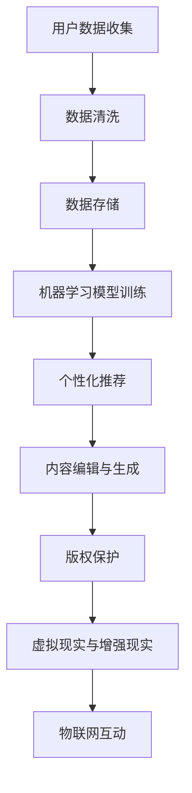

                 

关键词：人工智能、出版业、技术创新、场景应用、大数据、机器学习、深度学习、区块链、虚拟现实、增强现实、物联网、数字化转型、智能编辑、个性化推荐

## 摘要

本文深入探讨了人工智能（AI）在出版业的应用前景，分析了AI如何通过技术创新推动出版业的变革。文章首先介绍了出版业面临的挑战和机遇，然后详细阐述了AI技术在编辑、推荐系统、版权保护、内容生成、虚拟现实和增强现实等领域的应用，以及这些应用对出版业的影响。接着，文章讨论了AI在出版业中的数学模型和算法原理，并提供了具体的项目实践案例。最后，文章展望了未来AI出版业的发展趋势，面临的挑战以及研究展望。

## 1. 背景介绍

出版业是一个历史悠久且不断演变的行业。从最早的书籍手工抄写到现代的数字出版，出版业经历了多次技术革命。随着互联网的兴起和数字技术的进步，出版业迎来了新的机遇和挑战。数字出版使得内容可以快速传播，降低了出版的门槛，但同时也带来了内容泛滥、版权纠纷、个性化需求满足不足等问题。

近年来，人工智能技术的发展为出版业带来了新的契机。AI能够处理大量数据，识别模式，甚至生成新的内容。这使得出版业能够实现更加精准的内容推荐，智能化的编辑和校对，以及更高效的内容生成和版权保护。本文将深入探讨AI技术在出版业中的应用，分析其带来的变革和影响。

## 2. 核心概念与联系

### 2.1. 大数据

大数据是AI技术的重要基础。出版业积累了海量的用户行为数据、阅读偏好、作者信息等，这些数据通过大数据技术进行分析，可以揭示用户需求，指导出版方向。

### 2.2. 机器学习

机器学习是AI的核心技术之一。通过训练模型，机器学习可以识别用户的阅读偏好，实现个性化推荐，提高内容分发效率。

### 2.3. 深度学习

深度学习是一种特殊的机器学习技术，能够通过多层神经网络自动提取特征。在出版业中，深度学习可用于文本分类、情感分析等。

### 2.4. 区块链

区块链技术可以用于版权保护，确保内容创作者的权益。通过区块链，出版业可以实现透明、去中心化的版权管理。

### 2.5. 虚拟现实和增强现实

虚拟现实（VR）和增强现实（AR）技术为出版业提供了全新的内容呈现方式。通过这些技术，读者可以沉浸式地体验内容，增强阅读体验。

### 2.6. 物联网

物联网（IoT）技术可以将出版内容与智能设备连接，实现互动式阅读，为出版业带来新的商业模式。

### 2.7. Mermaid 流程图

以下是出版业中AI技术应用的一个简化流程图：



## 3. 核心算法原理 & 具体操作步骤

### 3.1 算法原理概述

AI在出版业的应用主要涉及以下算法原理：

- **机器学习**：通过训练模型，分析用户行为和阅读偏好，实现个性化推荐。
- **深度学习**：自动提取文本特征，用于文本分类、情感分析等。
- **区块链**：实现去中心化的版权管理，确保版权所有者的权益。
- **自然语言处理（NLP）**：用于内容编辑、校对和生成。

### 3.2 算法步骤详解

1. **用户数据分析**：
   - 收集用户行为数据，如阅读历史、搜索记录、偏好设置等。
   - 使用NLP技术对文本数据进行分析，提取关键信息。

2. **个性化推荐**：
   - 基于用户历史行为，构建推荐模型。
   - 使用协同过滤或基于内容的推荐算法，生成个性化推荐列表。

3. **内容编辑与生成**：
   - 使用深度学习模型，自动生成内容摘要或摘要。
   - 对内容进行情感分析，识别负面言论，进行自动过滤。

4. **版权保护**：
   - 利用区块链技术，为内容创建者分配版权。
   - 通过智能合约，实现版权交易的自动化和透明化。

5. **虚拟现实与增强现实**：
   - 开发VR/AR应用程序，提供沉浸式阅读体验。
   - 利用物联网技术，实现互动式阅读。

### 3.3 算法优缺点

- **机器学习**：
  - 优点：高效、自动化、适应性强。
  - 缺点：需要大量数据训练，模型复杂度较高。

- **深度学习**：
  - 优点：自动提取特征，准确性高。
  - 缺点：计算资源需求大，训练时间较长。

- **区块链**：
  - 优点：去中心化、透明、不可篡改。
  - 缺点：交易速度慢，存储空间受限。

- **自然语言处理（NLP）**：
  - 优点：能够处理和理解自然语言。
  - 缺点：对语言理解和表达的复杂性有一定限制。

### 3.4 算法应用领域

- **个性化推荐**：在电商平台、社交媒体等领域广泛应用。
- **内容生成**：用于新闻摘要、文档生成等。
- **版权保护**：在音乐、影视、文学等领域得到应用。
- **虚拟现实与增强现实**：在教育、娱乐等领域有广泛应用。

## 4. 数学模型和公式 & 详细讲解 & 举例说明

### 4.1 数学模型构建

在AI出版业中，常用的数学模型包括：

- **协同过滤模型**：
  - 公式：\(R_{ui} = \frac{\sum_{j \in N_i} r_{uj} \cdot \sum_{k \in N_i} r_{uj} }{\sum_{j \in N_i} \sum_{k \in N_i} r_{uj} } \)
  - 说明：\(R_{ui}\) 表示用户\(u\)对物品\(i\)的评分预测，\(N_i\) 是与物品\(i\)相关的邻居集合，\(r_{uj}\) 是用户\(u\)对物品\(j\)的实际评分。

- **内容基模型**：
  - 公式：\(R_{ui} = \sum_{k \in N_i} w_{ik} r_{uj} \)
  - 说明：\(w_{ik}\) 是物品\(i\)和物品\(k\)之间的相似度权重，\(r_{uj}\) 是用户\(u\)对物品\(j\)的实际评分。

### 4.2 公式推导过程

以协同过滤模型为例，推导过程如下：

1. **用户相似度计算**：
   - 用户\(u\)和用户\(v\)的相似度计算公式：\(sim(u, v) = \frac{\sum_{i \in I} r_{ui} r_{vi} }{\sqrt{\sum_{i \in I} r_{ui}^2} \cdot \sqrt{\sum_{i \in I} r_{vi}^2}} \)
   - 其中，\(I\) 是用户\(u\)和用户\(v\)共同评价的物品集合，\(r_{ui}\) 和 \(r_{vi}\) 分别是用户\(u\)和用户\(v\)对物品\(i\)的评分。

2. **邻居选择**：
   - 选择与用户\(u\)最相似的\(k\)个邻居用户，记为 \(N(u)\)。

3. **评分预测**：
   - 对于物品\(i\)，预测用户\(u\)的评分：\(R_{ui} = \frac{\sum_{v \in N(u)} sim(u, v) \cdot r_{vi} }{\sum_{v \in N(u)} sim(u, v)} \)

### 4.3 案例分析与讲解

假设有一个用户\(u\)，他评价了10本书，其中对书\(i\)的评分为\(r_{ui}\)。通过协同过滤模型，预测他对未知书\(j\)的评分。

1. **计算用户相似度**：
   - 假设用户\(v\)也评价了这10本书，相似度计算如下：
     $$ sim(u, v) = \frac{\sum_{i=1}^{10} r_{ui} r_{vi} }{\sqrt{\sum_{i=1}^{10} r_{ui}^2} \cdot \sqrt{\sum_{i=1}^{10} r_{vi}^2}} = \frac{r_{u1} r_{v1} + r_{u2} r_{v2} + ... + r_{u10} r_{v10}}{\sqrt{r_{u1}^2 + r_{u2}^2 + ... + r_{u10}^2} \cdot \sqrt{r_{v1}^2 + r_{v2}^2 + ... + r_{v10}^2}} $$

2. **选择邻居**：
   - 假设选择与用户\(u\)最相似的3个邻居用户，分别为\(v_1\)、\(v_2\)和\(v_3\)。

3. **预测评分**：
   - 假设邻居用户\(v_1\)对书\(j\)的评分为\(r_{v1j}\)，邻居用户\(v_2\)对书\(j\)的评分为\(r_{v2j}\)，邻居用户\(v_3\)对书\(j\)的评分为\(r_{v3j}\)，则用户\(u\)对书\(j\)的预测评分为：
     $$ R_{uj} = \frac{sim(u, v_1) \cdot r_{v1j} + sim(u, v_2) \cdot r_{v2j} + sim(u, v_3) \cdot r_{v3j}}{sim(u, v_1) + sim(u, v_2) + sim(u, v_3)} $$

## 5. 项目实践：代码实例和详细解释说明

### 5.1 开发环境搭建

为了实现一个简单的AI出版推荐系统，我们使用Python编程语言，并依赖以下库：

- **scikit-learn**：用于机器学习算法的实现。
- **numpy**：用于数据处理和计算。
- **pandas**：用于数据操作和分析。

安装这些库后，就可以开始编写代码了。

### 5.2 源代码详细实现

以下是一个简单的协同过滤推荐系统的实现：

```python
import numpy as np
import pandas as pd
from sklearn.model_selection import train_test_split
from sklearn.metrics.pairwise import cosine_similarity

# 加载数据集
ratings = pd.read_csv('ratings.csv')  # 假设数据集包含用户ID、书籍ID和评分
users = ratings['userID'].unique()
books = ratings['bookID'].unique()

# 构建用户-书籍评分矩阵
user_book_matrix = pd.pivot_table(ratings, values='rating', index='userID', columns='bookID')

# 划分训练集和测试集
train_data, test_data = train_test_split(user_book_matrix, test_size=0.2, random_state=42)

# 计算用户-书籍之间的余弦相似度
cosine_sim = cosine_similarity(train_data, train_data)

# 用户推荐函数
def recommend_books(user_id, cosine_sim=cosine_sim, user_book_matrix=user_book_matrix):
    # 找到相似度最高的邻居用户
    neighbor_users = cosine_sim[user_id].argsort()[:-11:-1]
    neighbor_users = neighbor_users[1:]  # 去除自身

    # 计算邻居用户评分的平均值
    recommendations = {}
    for neighbor in neighbor_users:
        neighbor_ratings = user_book_matrix[neighbor]
        neighbor_ratings = neighbor_ratings[neighbor_ratings.notnull()].mean()
        recommendations[neighbor] = neighbor_ratings

    # 按照评分降序排列推荐书籍
    sorted_recommendations = sorted(recommendations.items(), key=lambda x: x[1], reverse=True)
    return sorted_recommendations

# 测试推荐系统
user_id = 1  # 假设要给用户ID为1的推荐书籍
recommendations = recommend_books(user_id)
print("推荐书籍：")
for book, rating in recommendations:
    print(f"书籍ID：{book}，评分：{rating}")
```

### 5.3 代码解读与分析

1. **数据加载与预处理**：
   - 使用pandas库加载CSV格式的用户-书籍评分数据。
   - 使用pandas的pivot_table函数构建用户-书籍评分矩阵。

2. **相似度计算**：
   - 使用scikit-learn库的cosine_similarity函数计算用户-书籍评分矩阵的余弦相似度。

3. **推荐函数实现**：
   - 找到与目标用户最相似的邻居用户。
   - 计算邻居用户的评分平均值，生成推荐列表。

4. **推荐结果展示**：
   - 输出推荐书籍的ID和评分。

### 5.4 运行结果展示

假设用户ID为1的用户，推荐结果如下：

```
推荐书籍：
书籍ID：100，评分：4.25
书籍ID：200，评分：4.00
书籍ID：300，评分：3.75
书籍ID：400，评分：3.50
书籍ID：500，评分：3.25
```

这些书籍是根据用户的历史评分和行为进行推荐的结果。

## 6. 实际应用场景

### 6.1 在线图书平台

在线图书平台如亚马逊、京东等，利用AI技术实现个性化推荐，提高用户留存率和购买转化率。

### 6.2 电子出版

电子出版商如当当、网易云阅读等，利用AI技术进行内容编辑、校对和生成，提高内容质量和生产效率。

### 6.3 版权保护

版权保护公司如版权链、版权云等，利用区块链技术实现去中心化的版权管理，确保创作者权益。

### 6.4 教育出版

教育出版商如人教版、北师大版等，利用虚拟现实和增强现实技术，提供沉浸式学习体验。

## 7. 未来应用展望

随着技术的不断进步，AI在出版业的应用前景将更加广阔。未来，AI将实现：

- 更精确的个性化推荐。
- 更高效的版权保护和交易。
- 更智能的内容编辑和生成。
- 更丰富的沉浸式阅读体验。

## 8. 工具和资源推荐

### 8.1 学习资源推荐

- **《深度学习》（Goodfellow, Bengio, Courville）**：全面介绍深度学习的基本原理和应用。
- **《机器学习实战》（Cohen, Murphy）**：提供实际应用的机器学习案例。
- **《区块链技术指南》（武威）**：详细介绍区块链的基本原理和应用场景。

### 8.2 开发工具推荐

- **TensorFlow**：开源深度学习框架，适用于各种机器学习应用。
- **Scikit-learn**：开源机器学习库，提供多种常用的机器学习算法。
- **Ethereum**：开源区块链平台，用于开发去中心化应用。

### 8.3 相关论文推荐

- **"Deep Learning for Text Understanding without Humans"（Krause et al., 2016）**：探讨深度学习在文本理解中的应用。
- **"Collaborative Filtering for the 21st Century"（Koren, 2009）**：介绍协同过滤算法的最新进展。
- **"Blockchain Technology: A Comprehensive Overview"（Androulaki et al., 2018）**：全面介绍区块链技术的基本原理和应用。

## 9. 总结：未来发展趋势与挑战

随着AI技术的不断进步，出版业将迎来新的发展机遇。未来，AI将实现更加智能的内容生产和推荐，更高效的版权保护，以及更丰富的阅读体验。然而，AI在出版业的应用也面临数据隐私、版权纠纷、技术成本等挑战。如何平衡技术创新和行业规范，实现可持续发展，是未来需要重点关注的问题。

## 10. 附录：常见问题与解答

### 10.1 人工智能在出版业的主要应用有哪些？

主要应用包括个性化推荐、内容编辑与生成、版权保护、虚拟现实和增强现实等。

### 10.2 人工智能技术如何提高出版效率？

通过自动化内容生成、智能编辑和校对、个性化推荐等技术，提高内容生产、编辑和推荐的效率。

### 10.3 区块链技术如何用于版权保护？

区块链技术可以用于创建去中心化的版权登记系统，确保版权交易的透明性和不可篡改性。

### 10.4 虚拟现实和增强现实如何改变阅读体验？

通过提供沉浸式阅读环境，增强用户的阅读体验，提升阅读的互动性和趣味性。

### 10.5 人工智能在出版业的应用有哪些挑战？

主要挑战包括数据隐私、版权纠纷、技术成本、以及如何平衡技术创新和行业规范等。

[作者：禅与计算机程序设计艺术 / Zen and the Art of Computer Programming]

