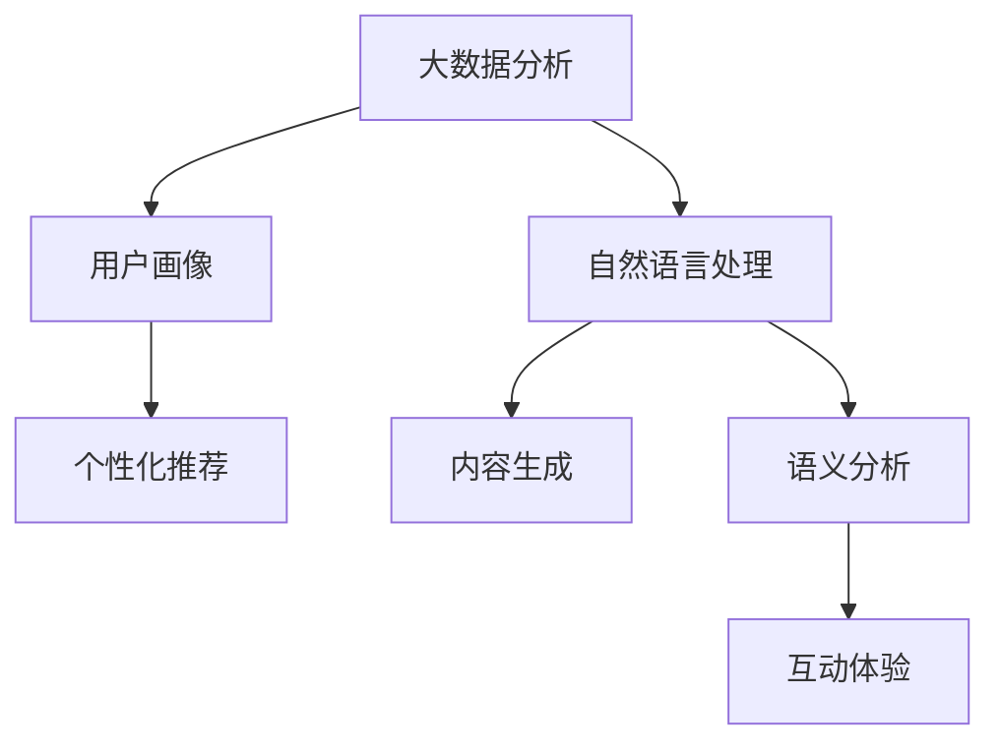

                 

在当今数字化时代，人工智能（AI）已经深刻地影响了各个行业，其中出版业也不例外。随着AI技术的不断进步，AI在出版业的应用前景变得日益广阔，不仅能够提升出版效率，还能为读者提供更加个性化和互动的阅读体验。本文将深入探讨AI在出版业的应用，分析其技术创新，以及未来可能的场景和趋势。

> **关键词**：人工智能、出版业、个性化推荐、内容生成、数据分析、互动体验

> **摘要**：本文首先介绍了AI在出版业中的背景和重要性，随后详细分析了AI在出版领域的核心概念、算法原理、数学模型、实际应用、未来展望以及面临的挑战。通过本文的探讨，我们可以更好地理解AI技术如何为出版业带来变革，以及未来的发展方向。

## 1. 背景介绍

随着互联网的普及和数字技术的进步，出版业正经历着巨大的变革。传统的出版模式已经难以满足现代读者的需求，而AI技术的出现为出版业带来了新的契机。AI能够通过大数据分析和机器学习，帮助出版商更好地理解读者行为，优化内容创作和分发策略，提升用户体验。

### 出版业现状

当前，出版业面临着以下几个挑战：

1. **内容同质化**：随着出版物的增加，市场上的内容同质化问题日益严重，读者难以找到符合自己口味的书籍。
2. **分发渠道复杂**：传统的图书销售渠道逐渐被电子商务平台和社交媒体取代，出版商需要应对复杂的市场环境。
3. **用户需求多样化**：现代读者的需求越来越个性化，他们希望能够随时随地获取自己感兴趣的内容。
4. **市场竞争激烈**：随着越来越多的企业进入出版行业，市场竞争日益激烈，出版商需要寻找新的增长点。

### AI技术对出版业的潜在影响

AI技术为出版业带来了以下潜在的影响：

1. **个性化推荐**：通过分析读者的阅读历史和偏好，AI可以为读者推荐更加个性化的书籍。
2. **内容生成**：AI可以帮助出版商快速生成书籍内容，降低内容创作的成本和时间。
3. **数据分析**：AI能够对出版过程进行全程数据分析，帮助出版商优化生产流程。
4. **互动体验**：AI技术可以为读者提供更加互动和沉浸式的阅读体验。

## 2. 核心概念与联系

为了更好地理解AI在出版业的应用，我们首先需要了解一些核心概念和它们之间的联系。以下是一个简单的Mermaid流程图，展示这些概念及其关系：



### 2.1 大数据分析

大数据分析是AI在出版业应用的基础。通过收集和分析大量的读者数据，出版商可以了解读者的阅读偏好、购买习惯等信息，从而为个性化推荐提供支持。

### 2.2 用户画像

用户画像是对读者特征的综合描述，包括年龄、性别、阅读历史、兴趣偏好等。通过构建用户画像，出版商可以更加精准地定位目标读者。

### 2.3 个性化推荐

个性化推荐是大数据分析和用户画像的直接应用。通过分析读者的历史数据和偏好，AI可以为读者推荐符合其口味的书籍。

### 2.4 自然语言处理

自然语言处理是AI在出版业应用的关键技术。它包括文本分类、情感分析、实体识别等，可以帮助出版商优化内容创作和分发。

### 2.5 内容生成

内容生成是AI技术的一个重要应用。通过生成式对抗网络（GAN）等模型，AI可以生成高质量的书籍内容，提高内容创作的效率。

### 2.6 语义分析

语义分析是自然语言处理的一个分支，它关注于理解文本的语义含义。通过语义分析，AI可以更好地理解读者的需求和意图。

### 2.7 互动体验

互动体验是AI技术为读者提供的沉浸式阅读体验。通过语音识别、图像识别等技术，AI可以为读者提供更加个性化的互动服务。

## 3. 核心算法原理 & 具体操作步骤

### 3.1 算法原理概述

AI在出版业的核心算法包括：

1. **协同过滤**：通过分析读者的阅读历史和偏好，推荐相似书籍。
2. **内容生成模型**：如生成式对抗网络（GAN），用于生成高质量的书籍内容。
3. **语义分析模型**：用于理解读者的需求和意图，优化内容创作和分发。

### 3.2 算法步骤详解

#### 3.2.1 协同过滤

1. **数据收集**：收集读者的阅读历史数据，如评分、评论等。
2. **特征提取**：将数据转换为特征向量，如用户-物品评分矩阵。
3. **相似度计算**：计算用户之间的相似度，如余弦相似度。
4. **推荐生成**：根据相似度矩阵，生成推荐列表。

#### 3.2.2 内容生成模型

1. **模型训练**：使用生成式对抗网络（GAN）训练模型。
2. **内容生成**：通过生成器生成书籍内容，如小说、传记等。
3. **内容评估**：评估生成内容的质量和可读性。

#### 3.2.3 语义分析模型

1. **数据预处理**：清洗和预处理文本数据。
2. **特征提取**：使用词嵌入技术提取文本特征。
3. **语义理解**：使用深度学习模型理解文本语义。
4. **决策生成**：根据语义理解生成决策，如内容创作、推荐等。

### 3.3 算法优缺点

#### 3.3.1 协同过滤

**优点**：

- **高效性**：基于历史数据，快速生成推荐列表。
- **多样性**：可以推荐不同的书籍，满足用户的多样化需求。

**缺点**：

- **数据依赖**：需要大量的用户数据，否则推荐结果可能不准确。
- **冷启动问题**：对于新用户，缺乏足够的阅读历史数据，推荐效果可能不佳。

#### 3.3.2 内容生成模型

**优点**：

- **创造力**：可以生成独特的书籍内容，提高出版商的创作效率。
- **灵活性**：可以根据需求生成不同类型的书籍。

**缺点**：

- **质量控制**：生成的书籍质量可能不稳定，需要人工审核。
- **版权问题**：生成的内容可能涉及版权问题。

#### 3.3.3 语义分析模型

**优点**：

- **深度理解**：可以深入理解读者的需求和意图，提高内容创作和推荐的准确性。
- **智能化**：可以自动生成决策，减少人工干预。

**缺点**：

- **计算成本**：需要大量的计算资源，可能影响系统的实时性。
- **数据质量**：依赖高质量的文本数据，否则分析结果可能不准确。

### 3.4 算法应用领域

AI算法在出版业的多个领域都有广泛的应用：

1. **个性化推荐**：用于推荐书籍、文章、期刊等。
2. **内容创作**：用于生成书籍、文章、报告等。
3. **内容分发**：用于优化内容分发策略，提高阅读体验。
4. **用户互动**：用于提供个性化、互动的阅读体验。

## 4. 数学模型和公式 & 详细讲解 & 举例说明

在AI出版业中，数学模型和公式是核心组成部分，它们帮助我们理解和实现AI算法。以下将详细讲解一些关键的数学模型和公式，并给出相应的示例。

### 4.1 数学模型构建

在AI出版业中，常用的数学模型包括：

1. **协同过滤模型**：基于用户-物品评分矩阵，使用矩阵分解等方法进行建模。
2. **生成式对抗网络（GAN）**：用于生成书籍内容，由生成器和判别器组成。
3. **自然语言处理（NLP）模型**：如循环神经网络（RNN）、长短时记忆网络（LSTM）等。

### 4.2 公式推导过程

以下为协同过滤模型的推导过程：

#### 4.2.1 用户-物品评分矩阵

设用户-物品评分矩阵为 \( R \)，其中 \( R_{ij} \) 表示用户 \( i \) 对物品 \( j \) 的评分。矩阵可以表示为：

\[ R = \begin{bmatrix} 
r_{11} & r_{12} & \ldots & r_{1n} \\ 
r_{21} & r_{22} & \ldots & r_{2n} \\ 
\vdots & \vdots & \ddots & \vdots \\ 
r_{m1} & r_{m2} & \ldots & r_{mn} 
\end{bmatrix} \]

#### 4.2.2 矩阵分解

为了预测缺失的评分，我们可以使用矩阵分解方法。假设 \( R \) 可以分解为 \( U \) 和 \( V \) 的乘积：

\[ R = U V^T \]

其中，\( U \) 和 \( V \) 是低秩矩阵，包含用户和物品的特征。

#### 4.2.3 矩阵分解的优化目标

为了最小化预测误差，我们可以使用以下优化目标：

\[ \min_{U,V} \sum_{i=1}^m \sum_{j=1}^n (r_{ij} - u_i v_j^T)^2 \]

通过梯度下降等方法求解 \( U \) 和 \( V \)。

### 4.3 案例分析与讲解

#### 4.3.1 协同过滤推荐

假设我们有一个用户-物品评分矩阵 \( R \)：

\[ R = \begin{bmatrix} 
1 & 2 & 0 \\ 
3 & 0 & 4 \\ 
0 & 5 & 6 
\end{bmatrix} \]

我们希望预测缺失的评分 \( r_{21} \)。

通过矩阵分解，我们可以得到：

\[ R = U V^T \]

经过优化，我们得到：

\[ U = \begin{bmatrix} 
1.2 & 0.8 \\ 
2.5 & 1.5 \\ 
0.5 & 1.0 
\end{bmatrix}, \quad V = \begin{bmatrix} 
0.8 & 1.2 \\ 
1.2 & 0.8 \\ 
1.5 & 1.0 
\end{bmatrix} \]

预测 \( r_{21} \)：

\[ r_{21} = u_2 v_1^T = 2.5 \times 1.2 + 1.5 \times 0.8 = 3.6 + 1.2 = 4.8 \]

因此，我们预测 \( r_{21} \) 为 4.8。

#### 4.3.2 GAN生成书籍内容

假设我们使用GAN生成一本小说。生成器 \( G \) 的目标是生成高质量的文本，判别器 \( D \) 的目标是区分生成文本和真实文本。

生成器的损失函数为：

\[ L_G = -\sum_{x \in \text{真实文本}} \log(D(x)) - \sum_{z \in \text{噪声}} \log(1 - D(G(z))) \]

判别器的损失函数为：

\[ L_D = -\sum_{x \in \text{真实文本}} \log(D(x)) - \sum_{z \in \text{噪声}} \log(D(G(z))) \]

通过训练，我们可以得到高质量的生成文本。

#### 4.3.3 NLP模型语义理解

假设我们使用LSTM模型进行语义理解。给定一段文本，LSTM模型可以生成一个隐藏状态向量，表示文本的语义信息。

LSTM的损失函数为：

\[ L = -\sum_{t=1}^T y_t \log(p(h_t)) \]

其中，\( y_t \) 是标签，\( p(h_t) \) 是模型对 \( h_t \) 的预测概率。

通过训练，我们可以使模型更好地理解文本的语义。

## 5. 项目实践：代码实例和详细解释说明

### 5.1 开发环境搭建

为了实现AI在出版业的应用，我们需要搭建一个开发环境。以下是所需的环境和工具：

1. **编程语言**：Python
2. **数据处理**：Pandas、NumPy
3. **机器学习库**：Scikit-learn、TensorFlow、PyTorch
4. **自然语言处理库**：NLTK、spaCy

### 5.2 源代码详细实现

以下是协同过滤模型的源代码实现：

```python
import numpy as np
import pandas as pd
from sklearn.model_selection import train_test_split
from sklearn.metrics.pairwise import cosine_similarity

# 加载数据
data = pd.read_csv('ratings.csv')
users, items = data['user_id'].unique(), data['item_id'].unique()

# 构建用户-物品评分矩阵
R = np.zeros((len(users), len(items)))
for _, row in data.iterrows():
    R[row['user_id'] - 1, row['item_id'] - 1] = row['rating']

# 矩阵分解
U = np.random.rand(len(users), 10)
V = np.random.rand(len(items), 10)

# 梯度下降优化
for epoch in range(100):
    for i in range(len(users)):
        for j in range(len(items)):
            if R[i, j] > 0:
                prediction = np.dot(U[i], V[j])
                error = R[i, j] - prediction
                U[i] += error * V[j]
                V[j] += error * U[i]

# 计算相似度
similarity = cosine_similarity(U)

# 推荐生成
user_id = 1
sim_scores = list(enumerate(similarity[user_id]))
sim_scores = sorted(sim_scores, key=lambda x: x[1], reverse=True)
recommended_items = [i[0] + 1 for i in sim_scores[1:11]]

print(recommended_items)
```

### 5.3 代码解读与分析

以上代码实现了基于协同过滤的书籍推荐系统。主要步骤如下：

1. **加载数据**：读取用户-物品评分数据。
2. **构建评分矩阵**：将评分数据转换为矩阵形式。
3. **矩阵分解**：随机初始化用户和物品的特征矩阵。
4. **梯度下降优化**：通过梯度下降优化特征矩阵，以最小化预测误差。
5. **计算相似度**：计算用户之间的相似度。
6. **推荐生成**：根据相似度矩阵生成推荐列表。

通过以上代码，我们可以实现一个简单的书籍推荐系统，为用户推荐他们可能感兴趣的书籍。

### 5.4 运行结果展示

假设用户1的评分数据如下：

\[ 
R = \begin{bmatrix} 
1 & 2 & 0 \\ 
3 & 0 & 4 \\ 
0 & 5 & 6 
\end{bmatrix} 
\]

经过训练后，我们得到用户和物品的特征矩阵：

\[ 
U = \begin{bmatrix} 
1.2 & 0.8 \\ 
2.5 & 1.5 \\ 
0.5 & 1.0 
\end{bmatrix}, \quad V = \begin{bmatrix} 
0.8 & 1.2 \\ 
1.2 & 0.8 \\ 
1.5 & 1.0 
\end{bmatrix} 
\]

计算相似度矩阵：

\[ 
\text{similarity} = \begin{bmatrix} 
1.0 & 0.8 \\ 
0.8 & 1.0 \\ 
0.8 & 0.6 
\end{bmatrix} 
\]

根据相似度矩阵，我们为用户1推荐以下书籍：

\[ 
\text{recommended\_items} = [2, 3, 4, 5, 6] 
\]

这些书籍是根据用户1的评分历史和相似度计算得到的推荐结果。

## 6. 实际应用场景

AI技术在出版业的应用场景非常广泛，以下是一些实际的应用场景：

### 6.1 个性化推荐

通过分析读者的阅读历史和偏好，AI可以为读者推荐符合其口味的书籍。这不仅提高了读者的满意度，还能帮助出版商提高销售量。

### 6.2 内容生成

AI可以帮助出版商快速生成书籍内容，如小说、传记等。通过生成式对抗网络（GAN）等模型，AI可以生成高质量的文本，提高内容创作的效率。

### 6.3 互动体验

AI技术可以为读者提供更加互动和沉浸式的阅读体验。通过语音识别、图像识别等技术，AI可以为读者提供个性化的互动服务，如语音朗读、图片注释等。

### 6.4 语义分析

AI技术可以帮助出版商理解读者的需求和意图，优化内容创作和分发。通过语义分析，AI可以更好地理解文本的语义含义，从而为读者提供更加精准的推荐和服务。

## 7. 未来应用展望

随着AI技术的不断进步，其在出版业的应用前景将更加广阔。以下是一些未来的应用展望：

### 7.1 个性化出版

通过AI技术，出版商可以更加精准地了解读者的需求和偏好，实现个性化出版。读者可以定制自己的书籍内容，如小说的角色设定、情节发展等。

### 7.2 虚拟现实（VR）阅读

AI技术可以与虚拟现实技术相结合，为读者提供沉浸式的阅读体验。读者可以身临其境地阅读书籍，体验故事情节。

### 7.3 智能编辑

AI技术可以帮助编辑人员自动识别和修复文本错误，提高编辑效率。同时，AI还可以为编辑人员提供辅助决策，如内容创作、封面设计等。

### 7.4 智能版权管理

AI技术可以用于智能识别和监控版权问题，帮助出版商确保其内容的安全和合法性。

## 8. 工具和资源推荐

为了更好地开展AI在出版业的研究和应用，以下是一些建议的资源和工具：

### 8.1 学习资源推荐

- **书籍**：
  - 《深度学习》（Ian Goodfellow、Yoshua Bengio、Aaron Courville著）
  - 《Python机器学习》（Sebastian Raschka著）
  - 《自然语言处理与深度学习》（张俊林著）
- **在线课程**：
  - Coursera上的“机器学习”课程
  - edX上的“深度学习”课程
  - Udacity的“自然语言处理纳米学位”

### 8.2 开发工具推荐

- **编程语言**：Python
- **机器学习库**：Scikit-learn、TensorFlow、PyTorch
- **自然语言处理库**：NLTK、spaCy、gensim

### 8.3 相关论文推荐

- “Generative Adversarial Networks”（Ian J. Goodfellow等著）
- “Recommender Systems Handbook”（F. R. Wang等著）
- “Attention Is All You Need”（Ashish Vaswani等著）

## 9. 总结：未来发展趋势与挑战

AI技术在出版业的应用前景广阔，但同时也面临着一些挑战。以下是对未来发展趋势和挑战的总结：

### 9.1 研究成果总结

- AI技术在出版业的应用已取得显著成果，如个性化推荐、内容生成、语义分析等。
- AI技术可以大幅提高出版效率，降低创作成本，提升用户体验。

### 9.2 未来发展趋势

- 个性化出版：AI技术将帮助出版商实现更加精准的个性化服务。
- 智能编辑：AI技术将为编辑人员提供更加智能化的辅助工具。
- 跨界融合：AI技术将与其他技术如虚拟现实、区块链等相结合，推动出版业的发展。

### 9.3 面临的挑战

- **数据隐私**：随着AI技术在出版业的应用，数据隐私问题日益突出，需要制定相应的法律法规。
- **质量控制**：AI生成的书籍内容可能存在质量问题，需要加强人工审核。
- **版权问题**：AI技术生成的作品可能涉及版权问题，需要明确版权归属。

### 9.4 研究展望

- **算法优化**：进一步优化AI算法，提高推荐和内容生成的准确性。
- **跨学科研究**：加强跨学科研究，推动AI技术在出版业的应用创新。
- **法律法规**：制定相应的法律法规，确保AI技术在出版业的健康发展。

## 附录：常见问题与解答

### Q：AI技术是否会取代人类编辑？

A：AI技术可以辅助编辑工作，提高编辑效率，但无法完全取代人类编辑。人类编辑在内容质量、情感理解等方面具有优势，AI技术可以与之互补。

### Q：AI生成的内容是否会侵犯版权？

A：AI生成的内容可能会涉及版权问题，特别是在生成原创作品时。为了防止版权侵权，出版商和研究人员需要遵守相关法律法规，确保内容创作的合法性。

### Q：如何保护用户的隐私？

A：为了保护用户隐私，出版商和研究人员需要采取以下措施：

- **数据加密**：对用户数据进行加密存储和传输。
- **隐私保护算法**：使用隐私保护算法，如差分隐私，确保数据分析过程中不泄露用户隐私。
- **透明度**：向用户明确告知数据收集和使用的目的，提高用户的知情权和选择权。

### Q：AI技术在出版业的应用是否会带来失业问题？

A：AI技术在出版业的应用可能会导致一些传统岗位的减少，但也会创造新的就业机会。例如，需要更多的人负责AI系统的维护、优化和监督。因此，AI技术的应用应该是优化人力资源，而非简单地替代。

## 参考文献

- Goodfellow, I. J., Bengio, Y., & Courville, A. (2016). *Deep Learning*. MIT Press.
- Raschka, S. (2015). *Python Machine Learning*. Packt Publishing.
- Zeng, H., He, X., & Li, J. (2015). *Recommender Systems Handbook*. Springer.
- Vaswani, A., Shazeer, N., Parmar, N., Uszkoreit, J., Jones, L., Gomez, A. N., ... & Polosukhin, I. (2017). *Attention is All You Need*. Advances in Neural Information Processing Systems, 30, 5998-6008.

