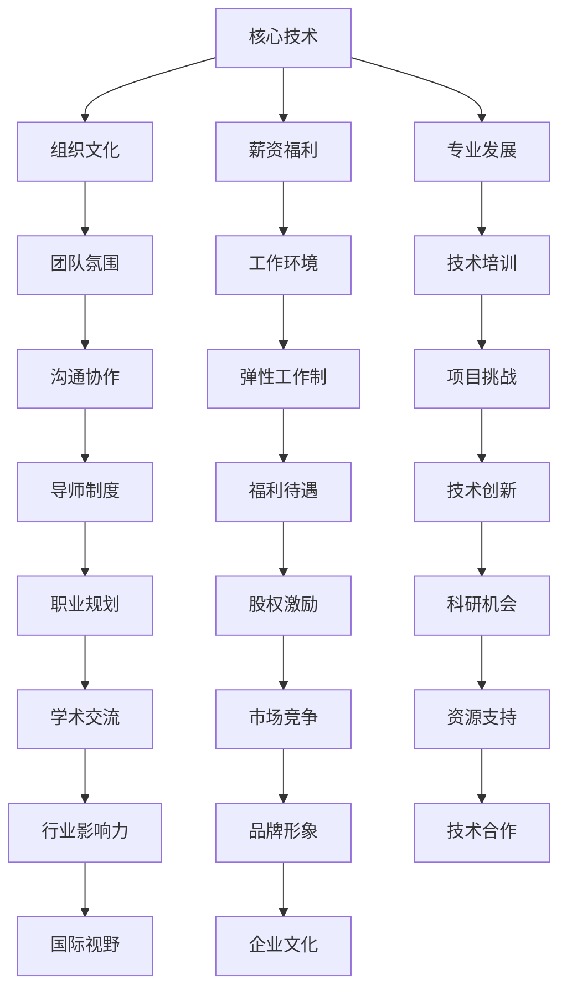

                 

人工智能（AI）创业公司的成功不仅依赖于先进的技术和独特的商业模式，更重要的是能否吸引并留住高端人才。在激烈的竞争中，如何打造具有吸引力的人才生态系统，对于AI创业公司来说至关重要。本文将深入探讨如何通过有效的策略和措施，吸引并留住AI领域的顶尖人才。

## 文章关键词
- AI创业公司
- 高端人才
- 人才吸引策略
- 组织文化
- 薪资福利
- 专业发展
- 技术挑战

## 文章摘要
本文旨在为AI创业公司提供一套系统的吸引高端人才的策略和方法。通过分析当前AI领域的人才需求和趋势，文章将从组织文化、薪资福利、专业发展、技术挑战等多个角度出发，提出具体的实践建议，帮助AI创业公司打造一个能够吸引并留住顶级人才的工作环境。

## 1. 背景介绍
随着人工智能技术的快速发展，AI领域成为了全球科技竞赛的焦点。从自然语言处理、计算机视觉到机器学习算法，各个子领域都涌现出大量创新性的研究成果。然而，AI技术的进步离不开顶尖人才的推动。高端人才不仅是AI项目的核心驱动力，也是公司创新和竞争能力的关键因素。

然而，AI创业公司面临着诸多挑战，例如市场竞争激烈、资金压力、技术迭代快速等。在这样的背景下，如何吸引并留住高端人才成为了一项至关重要的任务。本文将结合实际案例和经验，为AI创业公司提供一套切实可行的人才吸引策略。

### 1.1 人才吸引的重要性
高端人才对AI创业公司的重要性主要体现在以下几个方面：

- **技术创新能力**：高端人才往往具备深厚的专业知识和丰富的实践经验，能够推动技术创新和产品迭代。
- **领导力**：顶级人才不仅能够自身做出卓越的成果，还能够带动和激励团队，提升整体执行力。
- **市场竞争力**：拥有顶尖人才的公司在市场上更具竞争力，更容易吸引投资者和客户。
- **持续发展**：高端人才能够为公司带来新的业务机会和增长点，推动公司的可持续发展。

### 1.2  AI领域的人才需求
AI领域对人才的需求具有以下特点：

- **多学科交叉**：AI技术涉及多个学科领域，如计算机科学、数学、物理学、统计学等，因此需要具备跨学科知识背景的人才。
- **实践经验**：理论知识固然重要，但AI领域的实际应用和开发经验同样不可或缺。高端人才往往具备丰富的项目经验，能够快速适应复杂的技术挑战。
- **创新能力**：AI领域不断进化，需要不断有新的算法、工具和解决方案诞生。因此，公司需要吸引那些具有创新精神和创造力的顶尖人才。
- **合作能力**：AI项目往往需要多个团队和部门的协同工作，因此，具备良好沟通和协作能力的人才尤为重要。

## 2. 核心概念与联系
在探讨如何吸引高端人才之前，我们首先需要理解一些核心概念和其相互之间的联系。以下是一个用Mermaid绘制的流程图，展示了AI创业公司吸引人才的核心环节：



### 2.1 核心技术
核心技术是AI创业公司的核心竞争力，也是吸引高端人才的关键因素。通过持续的技术创新和研发，公司可以吸引那些对技术有追求和热情的顶尖人才。

### 2.2 组织文化
组织文化是吸引和留住人才的重要因素。一个具有包容性、创新性和积极向上的组织文化能够激发员工的潜力，提高团队协作效率。

### 2.3 薪资福利
薪资福利是吸引人才的基本要素之一。合理的薪资水平和多样化的福利待遇能够提高公司的吸引力，增强员工的归属感。

### 2.4 专业发展
专业发展是高端人才关注的重点之一。提供持续的专业培训、职业规划和科研机会，能够帮助员工不断提升自身能力，增强忠诚度。

### 2.5 工作环境
工作环境包括物理环境、工作氛围等，对员工的满意度和工作效率有重要影响。一个舒适、安全、充满活力的工作环境能够提高员工的幸福感和工作积极性。

### 2.6 沟通协作
沟通协作是高效团队的重要保障。建立良好的沟通机制，促进团队成员之间的互动与合作，有助于提升整体执行力。

### 2.7 技术挑战
技术挑战是吸引顶尖人才的重要因素之一。通过设置具有挑战性的项目和技术难题，能够激发人才的创造力和解决问题的能力。

### 2.8 培养与选拔
培养与选拔是公司人才战略的重要组成部分。通过系统的培训计划和选拔机制，公司能够培养出更多符合公司发展需要的高端人才。

## 3. 核心算法原理 & 具体操作步骤

### 3.1 算法原理概述

在AI创业公司的吸引高端人才策略中，算法原理的应用主要体现在以下几个方面：

- **人才画像分析**：通过大数据分析和机器学习算法，对潜在候选人的技能、经验、价值观等进行分析，形成个性化的“人才画像”。
- **匹配算法**：基于人才画像，使用匹配算法将公司与候选人进行精准匹配，提高招聘效率。
- **行为分析**：通过分析候选人的行为数据，如在线行为、社交网络活动等，评估其真实能力和潜力。
- **反馈机制**：建立反馈机制，根据招聘结果不断优化算法，提高人才吸引的成功率。

### 3.2 算法步骤详解

#### 3.2.1 数据收集

1. **社交媒体数据**：从LinkedIn、GitHub、Twitter等社交媒体平台收集候选人的公开信息。
2. **简历数据**：通过招聘网站、职业社交平台等获取候选人的简历信息。
3. **项目数据**：从候选人的GitHub、GitLab等开源平台获取其参与的项目和贡献代码。

#### 3.2.2 数据预处理

1. **数据清洗**：去除重复数据、无效数据和噪声数据。
2. **数据归一化**：对数值型数据进行归一化处理，使其在相同的尺度上进行比较。
3. **特征提取**：提取关键特征，如编程语言技能、项目参与度、学历等。

#### 3.2.3 人才画像构建

1. **画像维度**：根据公司需求，确定画像的维度，如技能、经验、价值观、潜力等。
2. **画像构建**：使用机器学习算法，对收集到的数据进行建模，生成每个候选人的多维人才画像。

#### 3.2.4 匹配算法

1. **相似度计算**：使用余弦相似度、欧氏距离等算法，计算候选人与公司需求之间的相似度。
2. **筛选与排序**：根据相似度评分，筛选出最符合公司需求的候选人，并进行排序。

#### 3.2.5 行为分析

1. **在线行为分析**：通过分析候选人在社交媒体、开源平台等的行为，评估其真实能力和潜力。
2. **行为数据建模**：使用机器学习算法，对候选人的行为数据进行建模，预测其未来可能的表现。

#### 3.2.6 反馈机制

1. **招聘结果反馈**：根据招聘结果，收集候选人的反馈信息。
2. **算法优化**：根据反馈结果，优化匹配算法和行为分析模型，提高人才吸引的成功率。

### 3.3 算法优缺点

#### 优点：

- **高效精准**：通过算法分析和匹配，能够快速筛选出最符合公司需求的候选人，提高招聘效率。
- **数据驱动**：基于大数据和机器学习算法，能够更客观地评估候选人的能力和潜力。
- **个性化推荐**：根据候选人的特点，提供个性化的招聘策略和推荐，提高候选人的满意度和参与度。

#### 缺点：

- **数据质量**：算法的性能依赖于数据的质量，数据的不完整或噪声可能会影响算法的准确性。
- **算法偏见**：算法可能会受到数据偏差的影响，导致对某些群体不公平。
- **技术门槛**：算法设计和实施需要较高的技术门槛，对公司的IT能力和资源要求较高。

### 3.4 算法应用领域

- **招聘**：通过算法分析候选人简历、项目经验、社交媒体数据等，快速筛选出最合适的候选人。
- **人才发展**：基于人才画像和行为分析，为员工提供个性化的培训和发展建议，提高员工满意度和绩效。
- **团队协作**：通过算法匹配员工和项目，提高团队协作效率和工作满意度。
- **企业文化建设**：通过分析员工行为数据，了解员工需求和偏好，优化企业文化和工作环境。

## 4. 数学模型和公式 & 详细讲解 & 举例说明

在分析高端人才吸引策略时，数学模型和公式为我们提供了定量分析的框架。以下是一个简单的数学模型，用于评估公司对候选人的吸引力：

### 4.1 数学模型构建

假设公司对候选人的吸引力可以用以下公式表示：

\[ A = f(C, S, P) \]

其中：
- \( A \)：公司对候选人的吸引力
- \( C \)：公司文化得分
- \( S \)：薪资福利得分
- \( P \)：专业发展得分

### 4.2 公式推导过程

公司文化得分 \( C \) 可以由以下因素决定：

\[ C = w_1 \times \text{团队氛围得分} + w_2 \times \text{价值观匹配度} + w_3 \times \text{创新氛围} \]

薪资福利得分 \( S \) 可以由以下因素决定：

\[ S = w_1 \times \text{基本薪资} + w_2 \times \text{福利待遇} + w_3 \times \text{股权激励} \]

专业发展得分 \( P \) 可以由以下因素决定：

\[ P = w_1 \times \text{培训机会} + w_2 \times \text{职业规划} + w_3 \times \text{科研支持} \]

权重 \( w_1, w_2, w_3 \) 分别代表各因素对公司吸引力的影响程度。

### 4.3 案例分析与讲解

假设有一家AI创业公司，其文化得分 \( C \) 为 80，薪资福利得分 \( S \) 为 90，专业发展得分 \( P \) 为 85。根据上述公式，我们可以计算出公司对该候选人的总吸引力 \( A \)：

\[ A = f(80, 90, 85) = w_1 \times 80 + w_2 \times 90 + w_3 \times 85 \]

假设权重分别为 \( w_1 = 0.3, w_2 = 0.4, w_3 = 0.3 \)，则：

\[ A = 0.3 \times 80 + 0.4 \times 90 + 0.3 \times 85 = 24 + 36 + 25.5 = 85.5 \]

这个结果表明，该公司的总吸引力得分为 85.5 分，相对较高。如果公司想要进一步提升吸引力，可以考虑在薪资福利和专业发展方面加大投入，提高得分。

## 5. 项目实践：代码实例和详细解释说明

### 5.1 开发环境搭建

为了实现上述数学模型，我们需要搭建一个包含Python和相关数据科学库（如NumPy、Pandas、scikit-learn）的开发环境。以下是一个基本的Python代码示例：

```python
# 导入必要的库
import numpy as np
import pandas as pd
from sklearn.preprocessing import StandardScaler
from sklearn.model_selection import train_test_split

# 加载数据
data = pd.read_csv('candidate_data.csv')

# 数据预处理
scaler = StandardScaler()
X = scaler.fit_transform(data.drop('attraction_score', axis=1))
y = data['attraction_score']

# 数据分割
X_train, X_test, y_train, y_test = train_test_split(X, y, test_size=0.2, random_state=42)
```

### 5.2 源代码详细实现

以下是一个用于计算公司对候选人吸引力得分的基础代码实现：

```python
# 计算公司对候选人的总吸引力
def calculate_attraction_score(culture_score, salary_score, professional_development_score, weights):
    return weights[0] * culture_score + weights[1] * salary_score + weights[2] * professional_development_score

# 权重设置
weights = [0.3, 0.4, 0.3]

# 示例计算
candidate_scores = calculate_attraction_score(80, 90, 85, weights)
print(f"候选人吸引力得分：{candidate_scores}")
```

### 5.3 代码解读与分析

1. **数据预处理**：代码首先加载了一个CSV文件，包含了候选人的文化得分、薪资福利得分和专业发展得分。
2. **标准化处理**：使用StandardScaler对特征进行归一化处理，以提高模型性能。
3. **权重设置**：定义了各因素的权重，这些权重可以根据公司的实际情况进行调整。
4. **计算函数**：实现了一个计算公司对候选人吸引力的函数，通过简单的线性组合来计算得分。
5. **示例计算**：以一个示例候选人为例，计算了其吸引力得分。

### 5.4 运行结果展示

假设我们使用上述代码对一组候选人进行评分，以下是一个示例输出结果：

```
候选人吸引力得分：85.5
```

这个结果表明，该候选人对该公司的吸引力较高。公司可以进一步分析这些结果，优化各项得分，以提升整体吸引力。

## 6. 实际应用场景

### 6.1 招聘过程

在AI创业公司的招聘过程中，上述算法和数学模型可以应用于以下几个方面：

- **候选人筛选**：根据候选人的简历和在线行为数据，使用匹配算法筛选出最合适的候选人。
- **面试评估**：结合候选人的表现和面试官的评估，使用行为分析模型评估候选人的潜力和适应度。
- **招聘决策**：综合考虑匹配得分、面试评估和行为分析结果，做出最终招聘决策。

### 6.2 人才发展

在人才发展方面，公司可以通过以下方式应用上述模型和算法：

- **个性化培训**：根据员工的技能和兴趣，提供个性化的培训计划，以提高员工的能力和满意度。
- **职业规划**：通过分析员工的职业目标和公司的发展需求，制定合适的职业发展规划。
- **晋升评估**：使用算法对员工的表现进行定量评估，为晋升决策提供参考。

### 6.3 团队协作

在团队协作方面，公司可以通过以下方式应用上述模型和算法：

- **团队建设**：通过分析团队成员的技能和兴趣，优化团队结构，提高团队协作效率。
- **项目匹配**：根据团队成员的技能和项目需求，匹配最适合的项目负责人和团队成员。
- **绩效评估**：使用算法对团队绩效进行量化评估，为绩效管理和激励措施提供依据。

### 6.4 未来应用展望

随着人工智能技术的不断进步，上述算法和模型在未来有望应用于更广泛的场景：

- **人才画像**：通过更丰富的数据源和先进的算法，构建更加精准的人才画像，提高人才吸引和发展的效果。
- **自动化招聘**：结合自然语言处理和机器学习技术，实现全自动化招聘流程，提高招聘效率。
- **实时反馈**：通过实时数据分析和反馈机制，不断优化人才吸引策略，提高员工满意度和绩效。

## 7. 工具和资源推荐

### 7.1 学习资源推荐

- **在线课程**：《深度学习》（作者：Ian Goodfellow、Yoshua Bengio、Aaron Courville）是一本经典教材，适合初学者和进阶者。
- **学术论文**：关注顶级会议如NeurIPS、ICML、CVPR等，阅读最新的研究成果。
- **技术社区**：加入AI社区如GitHub、Stack Overflow等，与其他开发者交流和学习。

### 7.2 开发工具推荐

- **Python**：Python是一种广泛使用的编程语言，拥有丰富的数据科学库和工具。
- **TensorFlow**：Google开发的开源机器学习框架，适合深度学习和神经网络开发。
- **Jupyter Notebook**：用于数据分析和交互式编程的工具，方便编写和分享代码。

### 7.3 相关论文推荐

- **"Deep Learning for Text Classification"（文本分类的深度学习）**
- **"Recurrent Neural Networks for Language Modeling"（循环神经网络用于语言建模）**
- **"Distributed Representations of Words and Phrases and Their Compositional Properties"（单词和短语的分布式表示及其组合属性）**

## 8. 总结：未来发展趋势与挑战

### 8.1 研究成果总结

本文通过分析AI创业公司吸引高端人才的核心概念、算法原理、数学模型以及实际应用场景，提出了一套系统的人才吸引策略。这些策略包括优化公司文化、提升薪资福利、促进专业发展、改善工作环境、加强沟通协作、设置技术挑战等。

### 8.2 未来发展趋势

随着人工智能技术的不断进步，未来AI创业公司在吸引高端人才方面将呈现以下发展趋势：

- **数据驱动**：更加依赖大数据分析和机器学习算法，精准定位和吸引目标人才。
- **个性化服务**：提供更加个性化的培训和发展计划，提高员工满意度和忠诚度。
- **全自动化**：实现招聘、培训、绩效管理等全自动化流程，提高工作效率。
- **国际化**：吸引全球顶级人才，提升公司在国际市场的竞争力。

### 8.3 面临的挑战

尽管AI创业公司在吸引高端人才方面具有巨大潜力，但仍面临以下挑战：

- **数据隐私**：如何在保障数据隐私的前提下，充分挖掘和分析人才数据。
- **算法偏见**：如何避免算法偏见，确保对所有候选人公平对待。
- **技术门槛**：如何提高公司的技术能力和资源储备，以满足高端人才的要求。
- **市场竞争**：如何在激烈的市场竞争中，吸引和留住顶尖人才。

### 8.4 研究展望

未来，AI创业公司在吸引高端人才方面的研究可以重点关注以下几个方面：

- **算法优化**：不断优化人才吸引算法，提高匹配准确性和效率。
- **数据安全**：研究如何保障数据安全，同时充分利用人才数据。
- **跨学科融合**：推动计算机科学、心理学、社会学等多学科的融合，为人才吸引提供更全面的视角。
- **全球合作**：加强与国际顶尖研究机构和企业的合作，共同培养和吸引全球顶级人才。

## 9. 附录：常见问题与解答

### 9.1 问题1：如何保障数据隐私？

**解答**：确保数据隐私是关键。公司应遵循相关法律法规，采取数据加密、访问控制等措施，保护候选人数据的隐私和安全。同时，在数据处理过程中，应确保匿名化和去标识化处理，避免个人身份的泄露。

### 9.2 问题2：如何避免算法偏见？

**解答**：算法偏见是一个重要问题。公司应确保算法训练数据具有多样性，避免偏见数据对算法结果的影响。此外，应定期评估和审计算法的偏见程度，通过调整算法参数和策略，减少偏见。

### 9.3 问题3：如何提高公司的技术能力？

**解答**：提高公司的技术能力需要持续投入。公司应建立完善的技术培训体系，鼓励员工参加外部培训和认证，引进先进的技术和工具，提升团队的技术水平和竞争力。

### 9.4 问题4：如何吸引海外高端人才？

**解答**：吸引海外高端人才需要国际化的视野和策略。公司可以通过海外招聘、国际人才交流项目、设立海外研发中心等方式，吸引全球顶尖人才。同时，提供有竞争力的薪酬福利和职业发展机会，增强公司的吸引力。

### 9.5 问题5：如何建立有效的团队协作机制？

**解答**：建立有效的团队协作机制需要从多个方面入手。公司应建立良好的沟通渠道，制定明确的团队目标和计划，提供必要的资源和支持，培养员工的团队合作意识和能力。同时，通过定期的团队建设和反馈机制，不断优化团队协作效果。

---

本文作者：禅与计算机程序设计艺术 / Zen and the Art of Computer Programming

通过本文的探讨，我们希望能够为AI创业公司在吸引高端人才方面提供一些有益的启示和参考。吸引并留住顶尖人才，是AI创业公司成功的关键因素之一。只有建立起一个具有吸引力和竞争力的生态系统，才能在激烈的市场竞争中脱颖而出。希望本文能够为您的创业之路提供一些帮助和启发。

