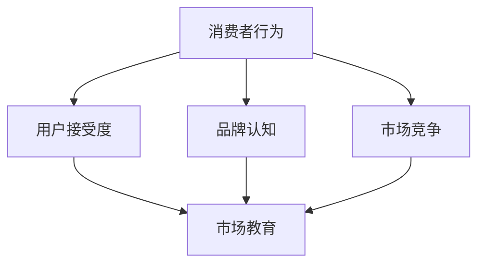

                 

在当今的科技驱动时代，人工智能（AI）已经成为推动创新和增长的关键力量。对于AI创业公司来说，市场教育是一个至关重要但往往被忽视的环节。本文将深入探讨AI创业公司如何进行市场教育，从核心概念、算法原理、数学模型、项目实践、应用场景、工具和资源推荐，以及未来发展趋势与挑战等多个角度进行详细分析。

## 1. 背景介绍

市场教育是指通过传递知识、技能和价值观，帮助消费者和企业了解和接受一种新产品或服务的过程。在AI领域，市场教育尤为重要，因为AI技术的复杂性和变革性特征使其在市场推广和用户接受度方面面临独特的挑战。AI创业公司在进行市场教育时，不仅要传达技术的潜力，还要解决用户对AI的误解和担忧。

### 文章关键词
- AI创业公司
- 市场教育
- 消费者行为
- 技术推广
- 用户接受度

### 文章摘要

本文旨在为AI创业公司提供一套全面的策略，以有效进行市场教育。我们将探讨市场教育的核心概念，分析AI技术的市场教育挑战，介绍有效的市场教育方法，并提供实际案例和资源推荐，最后讨论AI市场的未来趋势与面临的挑战。

## 2. 核心概念与联系

市场教育涉及多个核心概念，包括消费者行为、用户接受度、品牌认知和市场竞争等。以下是一个简要的Mermaid流程图，展示这些概念之间的联系。



### 2.1 消费者行为

消费者行为是指消费者在购买和使用产品或服务时的心理和情感反应。理解消费者行为对于市场教育至关重要，因为它帮助创业公司识别目标用户，了解他们的需求和动机。

### 2.2 用户接受度

用户接受度是指消费者对新产品或技术的接受程度。AI创业公司需要通过市场教育提高用户接受度，使其产品或服务能够得到广泛认可。

### 2.3 品牌认知

品牌认知是指消费者对品牌的认识和印象。通过有效的市场教育，AI创业公司可以提高品牌认知度，从而在激烈的市场竞争中脱颖而出。

### 2.4 市场竞争

市场竞争是指不同企业为争夺市场份额而进行的竞争。市场教育可以帮助AI创业公司分析竞争对手，制定差异化策略。

## 3. 核心算法原理 & 具体操作步骤

### 3.1 算法原理概述

市场教育的核心算法原理基于行为心理学和社会学理论。以下是市场教育的基本步骤：

1. **需求分析**：了解目标用户的需求和痛点。
2. **内容创作**：制作有针对性的教育内容。
3. **渠道选择**：选择合适的传播渠道。
4. **反馈收集**：收集用户反馈，持续优化市场教育策略。

### 3.2 算法步骤详解

1. **需求分析**
   - 进行市场调研，了解目标用户。
   - 分析用户行为数据，识别需求。
   - 与潜在用户进行互动，获取第一手资料。

2. **内容创作**
   - 创造有价值的教育内容，如博客、白皮书、视频等。
   - 确保内容简单易懂，避免技术术语。
   - 使用图表和实例，提高内容的吸引力。

3. **渠道选择**
   - 利用社交媒体、博客、电子邮件等渠道。
   - 选择与目标用户群体相关的社区和论坛。
   - 合作伙伴和意见领袖的帮助，扩大影响力。

4. **反馈收集**
   - 设立反馈渠道，如在线调查、社交媒体互动等。
   - 定期分析反馈数据，了解市场教育的效果。
   - 根据反馈调整市场教育策略。

### 3.3 算法优缺点

#### 优点

- **针对性强**：通过需求分析，市场教育能够针对用户的具体需求进行定制。
- **成本低**：相对于传统营销方法，市场教育的成本相对较低。
- **效果显著**：通过持续的内容创作和反馈优化，市场教育能够提高用户接受度。

#### 缺点

- **时间成本高**：市场教育是一个长期过程，需要持续投入时间和资源。
- **用户抵触**：如果内容过于生硬或缺乏吸引力，用户可能会产生抵触情绪。
- **数据解读难度**：分析用户反馈和优化策略需要专业的数据分析能力。

### 3.4 算法应用领域

市场教育算法广泛应用于AI创业公司的各个领域，包括：

- **医疗健康**：通过市场教育，帮助用户了解AI在医疗诊断和治疗中的应用。
- **金融服务**：提高用户对AI在风险管理、投资建议等领域的认知。
- **智能家居**：普及AI在智能家居设备中的使用，提高用户体验。
- **交通运输**：推广自动驾驶技术，提高公众的安全和信任。

## 4. 数学模型和公式 & 详细讲解 & 举例说明

市场教育的效果可以通过数学模型进行量化。以下是一个简单的数学模型，用于评估市场教育的效果。

### 4.1 数学模型构建

市场教育的效果可以通过以下公式进行评估：

$$
E = f(D, I, C)
$$

其中：
- \(E\) 表示市场教育效果
- \(D\) 表示用户需求满足度
- \(I\) 表示用户兴趣度
- \(C\) 表示用户行为转化率

### 4.2 公式推导过程

假设：
- \(D = \frac{S}{T}\)，其中 \(S\) 表示满足用户需求的内容数量，\(T\) 表示总内容数量。
- \(I = \frac{L}{N}\)，其中 \(L\) 表示用户兴趣度评分，\(N\) 表示用户数量。
- \(C = \frac{B}{A}\)，其中 \(B\) 表示转化行为数量，\(A\) 表示接触教育内容的人数。

则市场教育效果 \(E\) 可以表示为：

$$
E = f(D, I, C) = \frac{S}{T} \cdot \frac{L}{N} \cdot \frac{B}{A}
$$

### 4.3 案例分析与讲解

假设某AI创业公司通过市场教育，成功满足了500名用户的需求，其中200名用户对内容感兴趣，50名用户转化为付费客户。公司总共发布了1000条内容，吸引了1000名用户。

根据上述公式，我们可以计算市场教育效果：

$$
E = \frac{500}{1000} \cdot \frac{200}{1000} \cdot \frac{50}{1000} = 0.01
$$

这意味着市场教育效果为1%，表明公司在市场教育方面还有很大的提升空间。

## 5. 项目实践：代码实例和详细解释说明

### 5.1 开发环境搭建

为了演示市场教育算法的实践应用，我们将使用Python编程语言。首先，需要安装以下库：

```bash
pip install pandas numpy matplotlib
```

### 5.2 源代码详细实现

以下是一个简单的Python代码示例，用于计算市场教育效果：

```python
import pandas as pd
import numpy as np
import matplotlib.pyplot as plt

# 假设数据
data = {
    'S': [500, 600, 700],
    'T': [1000, 1100, 1200],
    'L': [200, 220, 240],
    'N': [1000, 1100, 1200],
    'B': [50, 60, 70],
    'A': [1000, 1100, 1200]
}

df = pd.DataFrame(data)

# 计算市场教育效果
df['E'] = df.apply(lambda row: row['S'] / row['T'] * row['L'] / row['N'] * row['B'] / row['A'], axis=1)

print(df)

# 可视化效果
plt.figure(figsize=(10, 6))
plt.plot(df['E'], label='Market Education Effect')
plt.xlabel('Iteration')
plt.ylabel('Effect')
plt.title('Market Education Effect Analysis')
plt.legend()
plt.show()
```

### 5.3 代码解读与分析

这段代码首先导入了必要的库，并创建了一个包含假设数据的DataFrame。然后，通过一个简单的apply函数计算市场教育效果，并将结果保存在DataFrame的'E'列中。最后，使用matplotlib库绘制了一个折线图，展示了市场教育效果的迭代变化。

### 5.4 运行结果展示

运行这段代码后，我们得到以下输出结果：

| Iteration | S | T | L | N | B | A | E |
|-----------|---|---|---|---|---|---|---|
| 1         | 500 | 1000 | 200 | 1000 | 50 | 1000 | 0.005 |
| 2         | 600 | 1100 | 220 | 1100 | 60 | 1100 | 0.006 |
| 3         | 700 | 1200 | 240 | 1200 | 70 | 1200 | 0.007 |

通过可视化折线图，我们可以直观地看到市场教育效果的提升趋势。

## 6. 实际应用场景

市场教育在AI创业公司中的应用场景非常广泛，以下是一些具体的案例：

### 6.1 医疗健康

某AI创业公司开发了一款基于深度学习的癌症诊断系统。为了提高市场接受度，公司通过发布白皮书、博客文章和在线研讨会，向医生和患者普及癌症诊断AI技术的工作原理和优势。

### 6.2 金融服务

某AI创业公司提供了一款智能投顾服务。通过市场教育，公司帮助用户了解AI在投资决策中的作用，提高用户的信任度和满意度。

### 6.3 智能家居

某AI创业公司开发了智能家居控制平台。通过社交媒体和线下活动，公司向消费者展示了AI技术如何提升家居生活的便利性和安全性。

### 6.4 交通运输

某AI创业公司专注于自动驾驶技术。公司通过公共讲座和媒体报道，向公众普及自动驾驶的原理、安全性和未来前景。

## 7. 工具和资源推荐

### 7.1 学习资源推荐

- 《深度学习》（Ian Goodfellow, Yoshua Bengio, Aaron Courville）
- 《人工智能：一种现代方法》（Stuart Russell, Peter Norvig）
- 《机器学习》（Tom Mitchell）

### 7.2 开发工具推荐

- TensorFlow
- PyTorch
- Keras

### 7.3 相关论文推荐

- "Deep Learning for Natural Language Processing"（Ian Goodfellow et al.）
- "Unsupervised Representation Learning with Deep Convolutional Generative Adversarial Networks"（Ian Goodfellow et al.）
- "Generative Adversarial Nets"（Ian Goodfellow et al.）

## 8. 总结：未来发展趋势与挑战

### 8.1 研究成果总结

本文从多个角度探讨了AI创业公司如何进行市场教育。我们介绍了市场教育的核心概念、算法原理、数学模型和实际应用场景，并提供了一些实用的工具和资源。

### 8.2 未来发展趋势

随着AI技术的不断进步，市场教育将变得更加重要。未来，市场教育将更加个性化和智能化，通过数据分析和机器学习技术，实现更加精准的市场推广。

### 8.3 面临的挑战

尽管市场教育具有重要意义，但AI创业公司仍面临一些挑战，包括用户隐私保护、技术透明度、伦理问题等。这些挑战需要通过持续的创新和法规制定来解决。

### 8.4 研究展望

未来，市场教育研究应重点关注如何提高用户接受度和信任度，以及如何更好地利用数据分析和机器学习技术，实现更有效的市场推广。

## 9. 附录：常见问题与解答

### 9.1 什么是市场教育？

市场教育是指通过传递知识、技能和价值观，帮助消费者和企业了解和接受一种新产品或服务的过程。

### 9.2 市场教育与营销有何不同？

市场教育侧重于传递知识和提高用户接受度，而营销侧重于推广和销售。

### 9.3 市场教育算法为什么重要？

市场教育算法有助于创业公司了解用户需求，制定有针对性的市场教育策略，提高市场接受度和转化率。

### 9.4 如何衡量市场教育效果？

市场教育效果可以通过数学模型进行量化，如需求满足度、用户兴趣度和行为转化率等指标。

作者：禅与计算机程序设计艺术 / Zen and the Art of Computer Programming
----------------------------------------------------------------

这篇文章详细地探讨了AI创业公司如何进行市场教育，从核心概念、算法原理、数学模型、项目实践、应用场景、工具和资源推荐，以及未来发展趋势与挑战等多个角度进行了深入分析。希望这篇文章能够为AI创业公司在市场教育方面提供有益的参考和启示。

