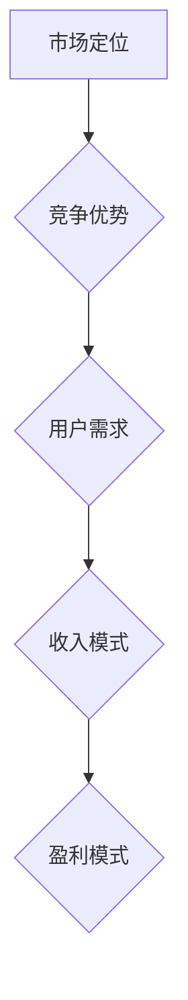

                 

在当今快速发展的技术时代，AI创业公司面临着前所未有的机遇和挑战。选择合适的商业模式，对于这些公司能否在竞争激烈的市场中脱颖而出至关重要。本文将深入探讨AI创业公司在选择商业模式时的关键考虑因素，以及如何根据自身特点和市场状况进行策略制定。

## 文章关键词

- AI创业公司
- 商业模式
- 市场定位
- 竞争优势
- 收入模式
- 盈利模式

## 文章摘要

本文旨在为AI创业公司提供选择商业模式的指导。通过分析市场环境、竞争优势、用户需求以及资金状况等多方面因素，文章将帮助创业者识别并制定适合自己公司的商业模式，从而在激烈的市场竞争中占据有利位置。

## 1. 背景介绍

随着人工智能技术的不断进步，AI创业公司如雨后春笋般涌现。这些公司不仅涉及深度学习、自然语言处理等前沿技术，还涵盖了智能机器人、自动化系统等多个应用领域。然而，成功开发出创新技术并不意味着公司就能顺利生存并实现盈利。选择合适的商业模式，成为AI创业公司能否成功的关键因素之一。

### 当前AI市场的现状

当前AI市场呈现出以下几个特点：

1. **技术迅速发展**：深度学习、强化学习等技术的不断突破，使得AI应用场景越来越广泛。
2. **市场竞争激烈**：众多创业公司进入同一领域，竞争愈发激烈。
3. **用户需求多样化**：企业用户和个人用户对AI产品的需求呈现出多样化的趋势。

### AI创业公司面临的挑战

AI创业公司在发展过程中面临诸多挑战：

1. **资金压力**：初期投入大，资金回笼周期长。
2. **人才竞争**：高技术人才短缺，争夺人才成为一大难题。
3. **用户获取**：市场推广难度大，用户获取成本高。

## 2. 核心概念与联系

在探讨AI创业公司的商业模式之前，有必要理解几个核心概念：

### 2.1 市场定位

市场定位是指公司根据自身资源和市场环境，确定目标客户群体和产品定位的过程。对于AI创业公司，市场定位决定了公司能否找到合适的市场切入点。

### 2.2 竞争优势

竞争优势是指公司在市场中相对于竞争对手所具有的优势。AI创业公司可以通过技术创新、产品差异化等方式建立竞争优势。

### 2.3 用户需求

用户需求是商业模式设计的起点。了解目标用户的需求，有助于AI创业公司开发出符合市场需求的产品。

### 2.4 收入模式

收入模式是指公司通过何种方式获取收入的机制。常见的收入模式包括产品销售、服务订阅、广告收入等。

### 2.5 盈利模式

盈利模式是指公司如何将收入转化为利润的机制。盈利模式决定了公司的可持续发展和长期盈利能力。

### 2.6 Mermaid 流程图



## 3. 核心算法原理 & 具体操作步骤

### 3.1 算法原理概述

在选择商业模式时，AI创业公司需要运用数据分析、用户行为分析等算法，以准确了解市场动态和用户需求。以下是一些核心算法原理：

1. **数据分析**：通过对大量市场数据进行分析，识别趋势和机会。
2. **用户行为分析**：通过用户行为数据，了解用户喜好和使用习惯。
3. **市场预测**：利用历史数据和机器学习算法，预测市场趋势和用户需求。

### 3.2 算法步骤详解

1. **数据收集**：收集市场数据、用户行为数据等。
2. **数据处理**：对收集到的数据进行清洗、整合和预处理。
3. **数据分析**：运用统计分析、机器学习等方法，分析数据以获取洞察。
4. **结果应用**：根据分析结果，调整商业模式和市场策略。

### 3.3 算法优缺点

1. **优点**：
   - 提高决策效率。
   - 降低决策风险。
   - 增强市场竞争力。
2. **缺点**：
   - 需要大量的数据支持。
   - 需要专业的技术团队。
   - 数据安全和隐私问题。

### 3.4 算法应用领域

- **市场预测**：帮助企业预测市场需求，调整生产和营销策略。
- **产品推荐**：基于用户行为数据，提供个性化的产品推荐。
- **风险管理**：通过分析市场数据，识别潜在风险并制定应对策略。

## 4. 数学模型和公式 & 详细讲解 & 举例说明

### 4.1 数学模型构建

在商业模式选择中，常用的数学模型包括：

1. **需求预测模型**：如线性回归、时间序列分析等。
2. **成本效益分析模型**：如成本-收益分析、盈亏平衡分析等。

### 4.2 公式推导过程

以线性回归模型为例，其基本公式为：

$$y = \beta_0 + \beta_1x_1 + \beta_2x_2 + ... + \beta_nx_n$$

其中，$y$ 为因变量，$x_1, x_2, ..., x_n$ 为自变量，$\beta_0, \beta_1, \beta_2, ..., \beta_n$ 为模型参数。

### 4.3 案例分析与讲解

假设一家AI创业公司希望通过市场需求预测来调整产品策略。以下是一个基于线性回归的需求预测案例：

1. **数据收集**：收集过去一年的产品销量数据。
2. **数据处理**：对数据进行清洗和整合。
3. **模型构建**：选择合适的自变量（如广告投入、促销活动等）。
4. **模型训练**：使用历史数据训练线性回归模型。
5. **预测**：输入新的自变量，预测未来的产品销量。
6. **结果分析**：根据预测结果，调整产品策略。

通过这个案例，我们可以看到数学模型在商业模式选择中的应用价值。它帮助公司更准确地了解市场需求，从而制定更有针对性的策略。

## 5. 项目实践：代码实例和详细解释说明

### 5.1 开发环境搭建

在Python环境中搭建线性回归模型所需的开发环境：

1. 安装Python：从官方网站下载并安装Python。
2. 安装NumPy和Pandas库：使用pip命令安装这两个库。

### 5.2 源代码详细实现

以下是一个简单的线性回归模型实现：

```python
import numpy as np
import pandas as pd

# 数据收集
data = pd.read_csv('sales_data.csv')

# 数据处理
X = data[['ad_spend', 'promo_activity']]
y = data['sales']

# 模型构建
from sklearn.linear_model import LinearRegression
model = LinearRegression()
model.fit(X, y)

# 预测
new_data = pd.DataFrame({'ad_spend': [5000], 'promo_activity': [1000]})
predicted_sales = model.predict(new_data)
print(predicted_sales)
```

### 5.3 代码解读与分析

1. 导入必要的库。
2. 读取数据。
3. 数据处理：划分自变量和因变量。
4. 构建线性回归模型。
5. 使用训练数据训练模型。
6. 输入新的自变量进行预测。

### 5.4 运行结果展示

运行上述代码，可以得到预测的销售量。这为公司的产品策略调整提供了数据支持。

## 6. 实际应用场景

### 6.1 企业级服务

AI创业公司可以为大型企业提供定制化的AI解决方案，如智能客服系统、自动化生产线等。

### 6.2 个人应用市场

AI技术可以应用于个人应用市场，如智能助手、健康监测设备等。

### 6.3 教育领域

AI技术可以用于教育领域，如个性化学习系统、智能考试系统等。

### 6.4 未来应用展望

随着AI技术的不断进步，其应用领域将越来越广泛。未来，AI创业公司有望在医疗、金融、能源等领域取得突破性进展。

## 7. 工具和资源推荐

### 7.1 学习资源推荐

- 《深度学习》（Goodfellow, Bengio, Courville）
- 《Python机器学习》（Sebastian Raschka）
- 《人工智能：一种现代的方法》（Stuart J. Russell & Peter Norvig）

### 7.2 开发工具推荐

- Jupyter Notebook：用于数据分析和模型构建。
- TensorFlow：用于深度学习模型的构建和训练。
- PyTorch：用于深度学习模型的开发。

### 7.3 相关论文推荐

- “Deep Learning: A Brief History” (Goodfellow, Bengio, Courville)
- “Generative Adversarial Networks” (Ian J. Goodfellow et al.)
- “Recurrent Neural Networks for Language Modeling” (Yoshua Bengio et al.)

## 8. 总结：未来发展趋势与挑战

### 8.1 研究成果总结

AI创业公司通过数据分析、用户行为分析和市场预测等算法，能够更准确地选择商业模式。数学模型在商业模式设计中的应用，为创业公司提供了有力支持。

### 8.2 未来发展趋势

随着AI技术的不断进步，AI创业公司将在更多领域取得突破。个性化服务、自动化系统等将成为未来发展的趋势。

### 8.3 面临的挑战

AI创业公司在发展过程中面临资金压力、人才竞争和数据安全等挑战。如何解决这些问题，将是未来研究的重要方向。

### 8.4 研究展望

未来，AI创业公司将更加注重用户体验和实际应用价值。技术创新与商业模式的结合，将成为创业公司成功的关键。

## 9. 附录：常见问题与解答

### 9.1 如何进行市场定位？

市场定位应基于对市场环境和目标客户群体的深入研究。通过分析竞争对手、用户需求和市场趋势，确定公司的市场定位。

### 9.2 如何建立竞争优势？

竞争优势可以通过技术创新、产品差异化和品牌建设等方式建立。创业公司应发挥自身优势，打造独特的市场地位。

### 9.3 数据安全和隐私问题如何解决？

数据安全和隐私问题可以通过加密技术、隐私保护算法和合规性设计等方式解决。公司应建立健全的数据安全管理体系。

## 作者署名

作者：禅与计算机程序设计艺术 / Zen and the Art of Computer Programming
```

