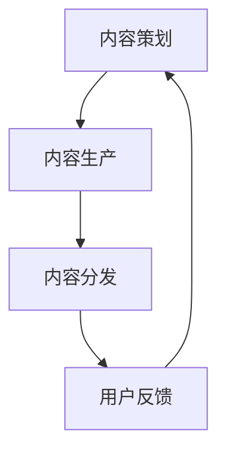

                 

AI创业公司在市场竞争中，内容运营是产品成功的关键因素之一。如何有效地策划、生产和分发内容，以吸引并留住用户，提升品牌影响力，是每个创业者都必须面对的挑战。本文将探讨AI创业公司的产品内容运营策略，包括内容策划、生产与分发，帮助创业者找到适合自己公司的内容运营之道。

## 文章关键词

- AI创业公司
- 内容运营
- 内容策划
- 内容生产
- 内容分发
- 用户吸引
- 品牌建设

## 文章摘要

本文旨在为AI创业公司提供一套系统化的产品内容运营策略。通过详细分析内容策划、生产和分发三个环节，文章将帮助创业者了解如何利用内容运营提升产品竞争力。文章将结合实际案例，提供实用的方法和工具，为AI创业公司在内容运营领域开辟新的增长点。

### 1. 背景介绍

在数字化时代，内容已成为企业最重要的资产之一。AI创业公司作为科技领域的先锋，其产品的内容质量和用户体验对用户的留存和转化至关重要。有效的内容运营不仅能够提升产品的知名度，还能增强用户对品牌的信任和忠诚度。

内容运营的三大核心环节分别是策划、生产和分发。内容策划是确保内容方向和目标与公司战略一致的过程；内容生产是将策划转化为实际内容的过程；内容分发则是将生产出的内容推送给目标用户的过程。每个环节都需要精准的执行和有效的管理。

### 2. 核心概念与联系

**内容运营：** 内容运营是指通过创造、管理和优化内容，以提高用户参与度和品牌影响力的过程。它包括内容策划、内容生产和内容分发三个环节。

**内容策划：** 内容策划是指根据公司战略和目标，规划内容的方向、主题和形式，确保内容能够满足用户需求和兴趣。

**内容生产：** 内容生产是指将策划好的内容转化为实际的内容形态，如文章、视频、图片等。

**内容分发：** 内容分发是指将生产好的内容推送到目标用户，通过各种渠道和平台，如社交媒体、电子邮件、网站等，提高内容的曝光度和传播度。

**Mermaid 流程图：**



### 3. 核心算法原理 & 具体操作步骤

**3.1 算法原理概述**

内容运营的核心在于数据驱动和用户导向。通过数据分析，公司可以了解用户的行为和偏好，从而优化内容策划和生产。具体操作步骤如下：

**3.2 算法步骤详解**

**步骤1：内容策划**

- 分析用户数据，了解用户需求和兴趣。
- 确定内容主题和形式，确保内容与公司战略一致。
- 制定内容发布计划，确保内容有规律地更新。

**步骤2：内容生产**

- 根据策划，创建高质量的内容，如文章、视频、图片等。
- 使用专业工具进行内容编辑和优化，确保内容质量。
- 定期审核内容，确保内容与用户需求和公司战略保持一致。

**步骤3：内容分发**

- 选择合适的分发渠道，如社交媒体、电子邮件、网站等。
- 使用数据分析工具，跟踪内容的表现，优化分发策略。
- 定期与用户互动，收集反馈，不断优化内容。

**3.3 算法优缺点**

**优点：**
- 提高内容质量和用户满意度。
- 增强品牌影响力和用户忠诚度。
- 提高营销效果和转化率。

**缺点：**
- 内容运营需要大量资源和时间投入。
- 数据分析和用户行为预测存在不确定性。

**3.4 算法应用领域**

内容运营在各个领域都有广泛应用，如电子商务、社交媒体、在线教育等。在AI创业公司中，内容运营尤为重要，因为它能够直接影响到产品的市场表现和用户留存。

### 4. 数学模型和公式 & 详细讲解 & 举例说明

**4.1 数学模型构建**

内容运营的核心是用户数据和数据分析。以下是构建内容运营数学模型的基本步骤：

**步骤1：用户数据收集**

- 收集用户行为数据，如浏览量、点击率、分享量等。
- 收集用户反馈数据，如评论、评分、反馈等。

**步骤2：数据分析**

- 分析用户行为数据，找出用户偏好和需求。
- 分析用户反馈数据，了解用户对内容的满意度和不满意度。

**步骤3：模型构建**

- 构建用户行为预测模型，预测用户未来的行为和需求。
- 构建内容优化模型，优化内容的质量和形式。

**4.2 公式推导过程**

假设我们有用户行为数据 \( X \) 和用户反馈数据 \( Y \)，我们可以使用以下公式来构建用户行为预测模型：

\[ \hat{y} = \alpha + \beta_1 x_1 + \beta_2 x_2 + ... + \beta_n x_n \]

其中，\( \hat{y} \) 是预测的用户行为，\( x_1, x_2, ..., x_n \) 是用户行为数据，\( \alpha, \beta_1, \beta_2, ..., \beta_n \) 是模型参数。

**4.3 案例分析与讲解**

假设我们有一个AI创业公司，其产品是一款智能健康助手。通过收集用户行为数据和用户反馈数据，我们可以构建一个用户行为预测模型，预测用户未来的健康需求。例如，我们可以预测用户对健康食谱、运动计划的需求，从而优化内容生产和分发策略。

### 5. 项目实践：代码实例和详细解释说明

**5.1 开发环境搭建**

为了进行内容运营项目，我们需要搭建一个合适的开发环境。以下是基本步骤：

- 安装Python编程环境。
- 安装数据分析库，如Pandas、NumPy。
- 安装机器学习库，如Scikit-learn。

**5.2 源代码详细实现**

以下是一个简单的用户行为预测模型的实现：

```python
import pandas as pd
from sklearn.linear_model import LinearRegression

# 读取用户数据
data = pd.read_csv('user_data.csv')

# 分析用户行为数据
X = data[['age', 'gender', 'activity_level']]
y = data['health_score']

# 构建用户行为预测模型
model = LinearRegression()
model.fit(X, y)

# 预测用户健康需求
predictions = model.predict(X)

# 打印预测结果
print(predictions)
```

**5.3 代码解读与分析**

这段代码首先读取用户数据，然后使用线性回归模型对用户行为进行预测。预测结果用于优化内容生产和分发策略。例如，我们可以根据预测结果，为健康得分较低的用户推送更多的健康食谱和运动计划。

**5.4 运行结果展示**

运行上述代码后，我们将得到一个预测结果列表。这些结果可以帮助我们了解用户的健康需求，从而优化内容生产和分发策略。

### 6. 实际应用场景

内容运营在AI创业公司中有着广泛的应用场景。以下是一些典型的实际应用场景：

- **智能健康助手：** 通过分析用户健康数据，预测用户的健康需求，为用户提供个性化的健康建议和食谱。
- **智能教育平台：** 通过分析学生学习数据，预测学生的学习需求和兴趣，为用户提供个性化的学习资源和课程。
- **智能购物助手：** 通过分析用户购物数据，预测用户的购物需求和偏好，为用户提供个性化的购物推荐。

### 7. 工具和资源推荐

**7.1 学习资源推荐**

- 《内容营销：从策划到执行的系统化方法》
- 《大数据营销：用户行为分析与营销策略》
- 《Python数据分析与应用》

**7.2 开发工具推荐**

- Jupyter Notebook：用于数据分析和机器学习模型实现。
- Pandas：用于数据处理和分析。
- Scikit-learn：用于机器学习模型实现。

**7.3 相关论文推荐**

- 《基于用户行为的智能健康推荐系统》
- 《大数据时代的内容营销策略》
- 《机器学习在智能教育中的应用》

### 8. 总结：未来发展趋势与挑战

**8.1 研究成果总结**

内容运营在AI创业公司中的应用取得了显著成果，提高了用户满意度和品牌影响力。未来研究应重点关注数据驱动的内容运营和个性化推荐系统的开发。

**8.2 未来发展趋势**

- 数据驱动的个性化内容运营将成为主流。
- 人工智能和大数据分析将在内容运营中发挥更大作用。
- 跨渠道的内容分发策略将得到广泛应用。

**8.3 面临的挑战**

- 数据隐私和安全问题。
- 内容质量和用户体验的提升。
- 多样化的用户需求。

**8.4 研究展望**

未来研究应关注如何利用人工智能和大数据技术，提高内容运营的效率和效果，为AI创业公司提供更强大的支持。

### 9. 附录：常见问题与解答

**Q1：内容运营和用户运营有什么区别？**

内容运营和用户运营是两个相关但不同的概念。内容运营主要关注如何创造、管理和优化内容，以吸引和留住用户；用户运营则更侧重于如何管理用户关系，提高用户满意度和忠诚度。

**Q2：如何评估内容运营的效果？**

评估内容运营效果可以从以下几个方面入手：

- 用户参与度：如阅读量、点击率、分享量等。
- 用户反馈：如评论、评分、反馈等。
- 营销效果：如转化率、客户留存率等。
- 品牌影响力：如品牌知名度、用户口碑等。

**Q3：如何制定内容运营策略？**

制定内容运营策略需要考虑以下几个方面：

- 公司战略和目标。
- 用户需求和兴趣。
- 行业趋势和竞争对手。
- 可用的资源和预算。

**Q4：内容运营中如何进行数据分析？**

内容运营中的数据分析主要包括以下步骤：

- 数据收集：收集用户行为数据、内容数据等。
- 数据清洗：处理缺失值、异常值等。
- 数据分析：使用统计分析和机器学习方法，分析用户行为和内容表现。
- 数据可视化：使用图表和报告，展示分析结果。

### 文章结束

本文探讨了AI创业公司的产品内容运营策略，从内容策划、生产到分发，提供了系统的指导和建议。通过结合实际案例和数学模型，文章帮助创业者了解如何利用内容运营提升产品竞争力。未来，随着人工智能和大数据技术的发展，内容运营将在AI创业公司中发挥越来越重要的作用。希望本文能为创业者提供有益的参考。作者：禅与计算机程序设计艺术 / Zen and the Art of Computer Programming。

