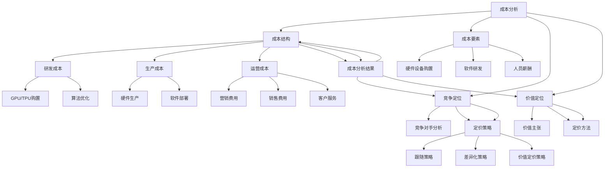

                 

关键词：AI创业公司、产品定价策略、成本分析、竞争定位、价值定位

> 摘要：本文将深入探讨AI创业公司在制定产品定价策略时所需考虑的三个方面：成本、竞争与价值定位。通过详细分析这三个方面，我们将为AI创业公司提供一套科学、合理且具有前瞻性的定价策略，助力其在激烈的市场竞争中脱颖而出。

## 1. 背景介绍

在人工智能（AI）技术快速发展的背景下，越来越多的创业公司投身于AI领域，希望在这个前沿科技领域占据一席之地。然而，如何在竞争激烈的市场中脱颖而出，实现可持续发展，成为AI创业公司面临的一大挑战。产品定价策略作为企业运营的核心环节之一，对公司的盈利能力、市场地位以及品牌形象具有重要影响。

本文将从成本、竞争与价值定位三个方面，深入分析AI创业公司在制定产品定价策略时所需考虑的关键因素。通过本文的探讨，旨在为AI创业公司提供一套科学的定价策略，以应对市场变化，实现稳健发展。

### 成本分析

成本分析是制定产品定价策略的重要基础。在AI创业公司中，成本主要包括研发成本、生产成本、运营成本等。其中，研发成本是主要成本之一，包括硬件设备购置、软件研发、人员薪酬等；生产成本包括硬件生产、软件部署、运维等；运营成本包括营销、销售、客户服务等。

#### 研发成本

研发成本是AI创业公司产品定价策略的核心考量因素。研发成本的高低直接影响产品定价的合理性。在制定定价策略时，AI创业公司需综合考虑以下因素：

1. **硬件设备购置**：AI创业公司需要购置高性能硬件设备，如GPU、TPU等，以支持深度学习和大数据处理。硬件设备购置成本较高，需合理分摊到产品定价中。
2. **软件研发**：AI创业公司需投入大量人力、物力进行软件研发，包括算法优化、模型训练、系统集成等。软件研发成本也需在产品定价中予以体现。
3. **人员薪酬**：研发团队是AI创业公司的核心资源，人员薪酬成本在研发成本中占据较大比重。合理定价有助于吸引和留住优秀人才。

#### 生产成本

生产成本主要包括硬件生产和软件部署等环节。AI创业公司在制定产品定价策略时，需充分考虑以下因素：

1. **硬件生产**：硬件生产成本包括芯片制造、硬件组装等。随着硬件技术的不断发展，生产成本有望逐步降低。
2. **软件部署**：AI创业公司需在目标市场部署软件，包括服务器、网络设施等。软件部署成本在产品定价中需合理分摊。

#### 运营成本

运营成本是AI创业公司在日常运营过程中产生的费用，包括营销、销售、客户服务等。在制定产品定价策略时，需充分考虑以下因素：

1. **营销费用**：AI创业公司需投入大量资金进行市场推广，包括线上广告、线下活动、品牌宣传等。合理定价有助于提高市场知名度，扩大客户群体。
2. **销售费用**：销售团队是AI创业公司实现销售收入的关键。销售费用包括销售人员的薪酬、差旅费用等。在产品定价中，需考虑销售费用的分摊。
3. **客户服务**：客户服务是提升客户满意度和忠诚度的关键。客户服务成本包括客服人员薪酬、客户培训等。在产品定价中，需考虑客户服务成本的分摊。

### 竞争定位

在制定产品定价策略时，AI创业公司需充分考虑市场竞争态势。竞争定位是产品定价策略的核心之一，通过分析竞争对手的产品定价，制定具有竞争力的价格策略，有助于提升公司市场地位。

#### 竞争对手分析

AI创业公司在制定定价策略时，需对竞争对手进行全面分析，包括：

1. **产品定位**：分析竞争对手的产品定位，了解其目标市场、客户群体等。
2. **产品特点**：分析竞争对手的产品特点，包括技术优势、功能特点等。
3. **定价策略**：分析竞争对手的定价策略，了解其价格定位、定价方法等。

#### 定价策略制定

基于竞争对手分析，AI创业公司可以制定以下定价策略：

1. **跟随策略**：以竞争对手的定价为基准，制定与竞争对手相近的价格。适用于市场竞争激烈、产品差异较小的场景。
2. **差异化策略**：根据产品的独特性和竞争优势，制定具有差异化的价格。适用于产品具备明显技术优势、市场竞争相对较弱的场景。
3. **价值定价策略**：基于产品的价值定位，制定具有竞争力的价格。适用于产品具有高附加值、目标市场对价格敏感度较低的场景。

### 价值定位

价值定位是产品定价策略的核心之一，通过明确产品的价值主张，制定符合市场需求的定价策略，有助于提升产品竞争力。

#### 价值主张

AI创业公司在制定产品定价策略时，需明确产品的价值主张，包括：

1. **技术优势**：AI创业公司的技术优势是其产品价值的重要体现。在定价策略中，需充分考虑技术优势带来的价值。
2. **功能特点**：产品的功能特点直接影响用户体验。在定价策略中，需充分考虑功能特点带来的价值。
3. **服务质量**：高质量的服务是提升客户满意度和忠诚度的关键。在定价策略中，需充分考虑服务质量带来的价值。

#### 定价方法

基于价值主张，AI创业公司可以采用以下定价方法：

1. **成本加成定价法**：以产品成本为基础，加上一定的利润率，制定产品价格。适用于产品成本较高、市场竞争相对较弱的场景。
2. **价值定价法**：以产品价值为基础，制定具有竞争力的价格。适用于产品具备明显技术优势、市场竞争相对较弱的场景。
3. **需求定价法**：根据市场需求和客户支付意愿，制定产品价格。适用于产品差异较大、目标市场对价格敏感度较高的场景。

### 综合策略

在制定产品定价策略时，AI创业公司需综合考虑成本、竞争与价值定位三个因素，制定具有竞争力的价格策略。以下是一个综合策略示例：

1. **成本分析**：对产品成本进行详细分析，确定产品成本结构，包括研发成本、生产成本、运营成本等。
2. **竞争对手分析**：分析竞争对手的定价策略，了解市场竞争态势，制定符合市场竞争的定价策略。
3. **价值定位**：明确产品的价值主张，确定产品在市场中的定位，制定具有竞争力的价格策略。
4. **综合策略制定**：综合考虑成本、竞争与价值定位，制定一个具有竞争力的价格策略。

### 实际案例

以一家AI创业公司为例，该公司致力于提供基于深度学习的智能客服系统。在制定产品定价策略时，该公司遵循以下步骤：

1. **成本分析**：分析产品成本，确定研发成本、生产成本和运营成本。其中，研发成本包括深度学习算法研发、系统集成等；生产成本包括服务器部署、运维等；运营成本包括客户服务、营销等。
2. **竞争对手分析**：分析竞争对手的定价策略，了解市场竞争态势。在智能客服领域，竞争对手的产品价格主要集中在几千到几万元不等。
3. **价值定位**：明确产品的价值主张，包括技术优势、功能特点和服务质量。该公司的智能客服系统具有以下价值主张：
    - 技术优势：基于深度学习算法，实现自然语言处理和智能对话；
    - 功能特点：支持多语言、多行业场景，具备高准确率和高效率；
    - 服务质量：提供7*24小时在线客服，为客户提供全方位的技术支持。
4. **综合策略制定**：综合考虑成本、竞争与价值定位，该公司制定以下定价策略：
    - 成本加成定价法：以产品成本为基础，加上20%的利润率，制定产品价格。其中，研发成本占40%、生产成本占30%、运营成本占30%。
    - 价值定价法：根据产品价值，制定具有竞争力的价格。以竞争对手的产品价格为基准，该公司将产品价格设定在竞争对手价格的中间值。
    - 需求定价法：根据市场需求和客户支付意愿，调整产品价格。在产品推广初期，该公司采用优惠活动，吸引更多客户，提高市场占有率。

通过以上步骤，该公司成功制定了一个具有竞争力的产品定价策略，助力其快速占领市场。

### 小结

本文从成本、竞争与价值定位三个方面，探讨了AI创业公司在制定产品定价策略时所需考虑的关键因素。通过详细分析这三个方面，我们为AI创业公司提供了一套科学、合理且具有前瞻性的定价策略。在实际应用中，AI创业公司需结合自身实际情况，灵活运用这些策略，以应对市场竞争，实现可持续发展。

<|user|>### 2. 核心概念与联系

在探讨AI创业公司的产品定价策略时，我们需要明确以下几个核心概念：成本分析、竞争定位和价值定位。这些概念相互关联，共同影响着产品定价的决策过程。下面，我们将通过一个Mermaid流程图来展示这些概念之间的联系和相互关系。



### 2.1 成本分析

成本分析是产品定价策略的基础，它涉及对产品生产、研发和运营过程中产生的各项成本进行详细的评估和计算。成本分析主要包括以下几个方面：

1. **成本结构**：分析产品成本的构成，包括研发成本、生产成本和运营成本等。
2. **成本要素**：对各项成本进行细化，如研发成本包括硬件设备购置、软件研发和人员薪酬等；生产成本包括硬件生产和软件部署等；运营成本包括营销、销售和客户服务等。

### 2.2 竞争定位

竞争定位是指通过分析竞争对手的产品定价、产品特点和市场策略，确定自身产品的市场定位和定价策略。竞争定位主要包括以下步骤：

1. **竞争对手分析**：分析竞争对手的产品定位、定价策略和市场表现，了解市场态势。
2. **定价策略**：根据竞争对手的定价策略和市场情况，制定符合自身产品的定价策略，如跟随策略、差异化策略和价值定价策略等。

### 2.3 价值定位

价值定位是产品定价策略的核心，它涉及对产品价值主张的明确和定价方法的选取。价值定位主要包括以下几个方面：

1. **价值主张**：明确产品的价值主张，包括技术优势、功能特点和服务质量等。
2. **定价方法**：根据产品的价值主张和市场定位，选择合适的定价方法，如成本加成定价法、价值定价法和需求定价法等。

### 2.4 成本、竞争与价值定位的关联

成本、竞争与价值定位之间存在着密切的关联。成本分析为产品定价提供了基础数据，竞争定位帮助确定市场定位和定价策略，价值定位则明确了产品的价值主张和定价方法。具体来说：

1. **成本分析与价值定位**：成本分析的结果直接影响价值定位的确定。通过成本分析，可以明确产品的成本结构，从而为价值定位提供依据。
2. **竞争定位与价值定位**：竞争定位和价值定位相互影响。在竞争定位过程中，需要考虑产品的价值主张和市场定位，从而制定出具有竞争力的定价策略。
3. **价值定位与成本分析**：价值定位需要依据成本分析的结果来确定产品的价格区间，而成本分析也需要考虑产品的价值主张和市场定位，从而确保成本与价值相匹配。

通过以上核心概念的联系，AI创业公司可以更全面地了解产品定价策略的制定过程，从而制定出更具竞争力的定价策略，实现可持续发展。

### 3. 核心算法原理 & 具体操作步骤

在探讨AI创业公司的产品定价策略时，我们需要借助核心算法来优化定价决策。本文将介绍一种基于成本、竞争与价值定位的综合定价算法，并详细阐述其原理和具体操作步骤。

#### 3.1 算法原理概述

本算法的核心思想是通过分析成本、竞争和市场价值，构建一个综合考虑这些因素的定价模型。算法的主要步骤如下：

1. **成本结构分析**：对产品成本进行详细分析，确定成本结构，包括研发成本、生产成本和运营成本等。
2. **竞争态势分析**：分析市场竞争态势，了解竞争对手的定价策略和市场份额。
3. **价值定位分析**：明确产品的价值主张，包括技术优势、功能特点和服务质量等。
4. **定价策略生成**：基于成本、竞争和价值定位，生成最优定价策略。

#### 3.2 算法步骤详解

##### 步骤1：成本结构分析

首先，对产品成本进行详细分析，确定成本结构。具体步骤如下：

1. **成本分类**：将成本分为研发成本、生产成本和运营成本。
2. **成本要素细化**：对每个成本类别进行细化，如研发成本包括硬件设备购置、软件研发和人员薪酬等；生产成本包括硬件生产和软件部署等；运营成本包括营销费用、销售费用和客户服务等。
3. **成本估算**：根据历史数据和市场调研，估算每个成本要素的具体数值。

##### 步骤2：竞争态势分析

接下来，分析市场竞争态势，了解竞争对手的定价策略和市场份额。具体步骤如下：

1. **竞争对手筛选**：筛选出与自身产品具有相似定位和市场竞争力的竞争对手。
2. **定价策略分析**：分析竞争对手的定价策略，包括价格水平、定价方法和价格波动等。
3. **市场份额分析**：了解竞争对手在目标市场中的市场份额和地位。

##### 步骤3：价值定位分析

在明确成本和竞争态势后，进行价值定位分析，具体步骤如下：

1. **价值主张确定**：明确产品的价值主张，包括技术优势、功能特点和服务质量等。
2. **价值评估**：对产品的价值进行量化评估，如通过客户满意度调查、市场份额和利润贡献等指标。
3. **价值定位**：根据产品的价值评估结果，确定产品在市场中的定位。

##### 步骤4：定价策略生成

最后，基于成本、竞争和价值定位，生成最优定价策略。具体步骤如下：

1. **定价模型构建**：构建一个综合考虑成本、竞争和价值定位的定价模型，如基于成本加成定价法、价值定价法和需求定价法的综合模型。
2. **定价策略优化**：使用优化算法，如线性规划或遗传算法，对定价模型进行优化，生成最优定价策略。
3. **定价策略验证**：通过实际销售数据和客户反馈，验证定价策略的有效性，并进行调整。

#### 3.3 算法优缺点

**优点**：

1. **全面性**：算法综合考虑了成本、竞争和价值定位，能够提供更加全面和科学的定价策略。
2. **灵活性**：算法可以根据市场变化和公司战略调整，灵活调整定价策略。
3. **优化性**：通过优化算法，算法能够生成最优定价策略，提高企业的盈利能力。

**缺点**：

1. **复杂性**：算法涉及多个因素的综合分析，实施过程较为复杂，需要专业知识和技能。
2. **数据依赖性**：算法的准确性依赖于准确的市场数据和成本数据，数据获取和处理可能存在困难。
3. **适应性问题**：在不同市场环境和竞争态势下，算法的适应性问题需要进一步研究和优化。

#### 3.4 算法应用领域

本算法主要应用于AI创业公司的产品定价策略制定，尤其适用于以下场景：

1. **新产品定价**：在推出新产品时，通过算法确定合理的价格，以提高市场接受度和盈利能力。
2. **价格调整**：在市场竞争加剧或公司战略调整时，通过算法调整价格策略，以保持市场竞争力。
3. **定价策略优化**：在已有定价策略的基础上，通过算法优化，进一步提高盈利能力和市场占有率。

### 3.5 实际案例

以一家AI创业公司推出的一款智能语音助手产品为例，该公司希望通过定价策略优化，提高市场占有率。以下是一个实际案例的算法应用步骤：

1. **成本结构分析**：分析产品成本，包括研发成本（硬件设备购置、软件开发、人员薪酬等）、生产成本（硬件生产、软件部署等）和运营成本（营销费用、销售费用、客户服务等）。
2. **竞争态势分析**：分析竞争对手的定价策略和市场表现，了解市场态势。
3. **价值定位分析**：明确产品的价值主张，包括语音识别准确率高、用户界面友好、支持多语言等功能特点。
4. **定价模型构建**：基于成本加成定价法、价值定价法和需求定价法的综合模型，构建定价模型。
5. **定价策略优化**：使用线性规划算法，对定价模型进行优化，生成最优定价策略。
6. **定价策略验证**：通过实际销售数据和客户反馈，验证定价策略的有效性，并进行调整。

通过以上步骤，该公司成功制定了一个合理的定价策略，提高了市场占有率和盈利能力。

### 3.6 算法在实际应用中的挑战

虽然本算法在理论层面具有较好的适用性，但在实际应用中仍面临一些挑战：

1. **数据获取困难**：准确的市场数据和成本数据是算法优化的基础，但在实际操作中，数据获取可能存在困难。
2. **市场变化快速**：市场环境变化迅速，算法需要实时调整以应对市场变化，这对算法的适应性和灵活性提出了较高要求。
3. **多因素平衡**：在成本、竞争和价值定位之间，需要找到一个平衡点，这需要深入的市场分析和数据支持。
4. **算法实施成本**：算法的实施和优化需要专业知识和技能，实施成本较高。

为了解决这些挑战，AI创业公司可以采取以下措施：

1. **建立数据驱动决策体系**：通过建立数据收集和分析体系，提高数据获取的准确性和及时性。
2. **实时监控市场动态**：建立实时监控机制，及时了解市场动态和竞争态势，为算法优化提供支持。
3. **培训专业人员**：加强对算法和数据分析的培训，提高团队成员的专业素养，降低实施成本。
4. **与第三方合作**：与专业数据分析和算法服务提供商合作，借助外部专业力量，提高算法实施效果。

通过以上措施，AI创业公司可以更好地应对算法在实际应用中的挑战，提高产品定价策略的准确性和有效性。

### 3.7 算法总结

本算法通过综合考虑成本、竞争和价值定位，为AI创业公司提供了科学、合理且具有前瞻性的定价策略。在实际应用中，算法能够根据市场变化和公司战略调整，灵活调整定价策略，提高企业的盈利能力和市场竞争力。然而，算法的实施和优化仍需不断探索和完善，以应对实际应用中的各种挑战。

### 3.8 进一步研究方向

在未来，本算法的研究方向可以包括以下几个方面：

1. **算法优化**：通过改进算法模型和优化算法，提高算法的准确性和效率。
2. **多因素综合分析**：结合更多的市场因素，如市场需求、消费者行为等，构建更全面的定价模型。
3. **数据驱动的动态定价**：基于大数据和机器学习技术，实现动态定价策略，提高定价的灵活性和适应性。
4. **算法应用场景拓展**：将算法应用到更多场景，如新产品定价、价格调整、定价策略优化等。

通过不断探索和创新，本算法有望在AI创业公司的产品定价策略中发挥更大的作用，助力企业实现可持续发展。

### 4. 数学模型和公式 & 详细讲解 & 举例说明

在AI创业公司的产品定价策略中，数学模型和公式是不可或缺的工具。通过建立合理的数学模型，可以更好地分析成本、竞争和价值定位，从而制定出科学的定价策略。以下将详细讲解数学模型和公式的构建、推导过程，并通过具体案例进行说明。

#### 4.1 数学模型构建

在产品定价策略中，常用的数学模型包括成本模型、竞争模型和价值模型。这些模型分别反映了产品的成本结构、市场竞争态势和产品价值定位。

1. **成本模型**：
   成本模型主要反映产品的成本结构，用于计算产品的总成本。假设产品的总成本由研发成本（\( C_{\text{R}} \)）、生产成本（\( C_{\text{P}} \)）和运营成本（\( C_{\text{O}} \)）组成，则有：
   \[
   C_{\text{Total}} = C_{\text{R}} + C_{\text{P}} + C_{\text{O}}
   \]

2. **竞争模型**：
   竞争模型用于分析市场竞争态势，主要考虑竞争对手的定价策略和市场占有率。假设竞争对手的定价为 \( P_{\text{C}} \)，市场占有率为 \( S_{\text{C}} \)，则有：
   \[
   P_{\text{C}} = f(S_{\text{C}}, C_{\text{C}}, V_{\text{C}})
   \]
   其中，\( C_{\text{C}} \) 为竞争对手的成本，\( V_{\text{C}} \) 为竞争对手的价值。

3. **价值模型**：
   价值模型用于确定产品的价值定位，主要考虑产品的技术优势、功能特点和服务质量。假设产品的价值为 \( V_{\text{P}} \)，则有：
   \[
   V_{\text{P}} = g(T_{\text{P}}, F_{\text{P}}, Q_{\text{P}})
   \]
   其中，\( T_{\text{P}} \) 为技术优势，\( F_{\text{P}} \) 为功能特点，\( Q_{\text{P}} \) 为服务质量。

#### 4.2 公式推导过程

在建立数学模型后，需要对各个模型中的公式进行推导，以确定其具体形式。

1. **成本模型推导**：
   研发成本、生产成本和运营成本的估算公式如下：
   \[
   C_{\text{R}} = a \cdot P_{\text{R}} + b \cdot T_{\text{R}} + c \cdot H_{\text{R}}
   \]
   \[
   C_{\text{P}} = d \cdot P_{\text{P}} + e \cdot T_{\text{P}} + f \cdot H_{\text{P}}
   \]
   \[
   C_{\text{O}} = g \cdot P_{\text{O}} + h \cdot T_{\text{O}} + i \cdot H_{\text{O}}
   \]
   其中，\( P_{\text{R}} \)，\( T_{\text{R}} \)，\( H_{\text{R}} \) 分别为研发成本中的价格、技术和人力资源；\( P_{\text{P}} \)，\( T_{\text{P}} \)，\( H_{\text{P}} \) 分别为生产成本中的价格、技术和人力资源；\( P_{\text{O}} \)，\( T_{\text{O}} \)，\( H_{\text{O}} \) 分别为运营成本中的价格、技术和人力资源。

2. **竞争模型推导**：
   竞争对手的定价策略可以通过市场占有率、成本和价值来计算：
   \[
   P_{\text{C}} = \frac{C_{\text{C}}}{S_{\text{C}}} + \frac{V_{\text{C}}}{S_{\text{C}}}
   \]
   其中，\( C_{\text{C}} \) 为竞争对手的成本，\( V_{\text{C}} \) 为竞争对手的价值，\( S_{\text{C}} \) 为竞争对手的市场占有率。

3. **价值模型推导**：
   产品的价值定位可以通过技术优势、功能特点和服务质量来计算：
   \[
   V_{\text{P}} = \alpha \cdot T_{\text{P}} + \beta \cdot F_{\text{P}} + \gamma \cdot Q_{\text{P}}
   \]
   其中，\( T_{\text{P}} \) 为技术优势，\( F_{\text{P}} \) 为功能特点，\( Q_{\text{P}} \) 为服务质量，\( \alpha \)，\( \beta \)，\( \gamma \) 为权重系数。

#### 4.3 案例分析与讲解

以下通过一个实际案例，展示如何运用数学模型和公式进行产品定价策略分析。

**案例背景**：
一家AI创业公司开发了一款智能语音助手产品，准备推向市场。公司需要制定一个合理的定价策略，以在激烈的市场竞争中脱颖而出。

**步骤1：成本结构分析**：
- 研发成本：包括硬件设备购置（\( P_{\text{R}} = 5000 \)元/件，共100件，总计500,000元）、软件开发（\( T_{\text{R}} = 20,000 \)元/人·月，共5人·月，总计100,000元）、人员薪酬（\( H_{\text{R}} = 10,000 \)元/人·月，共5人·月，总计50,000元）。
- 生产成本：包括硬件生产（\( P_{\text{P}} = 2000 \)元/件，共100件，总计20,000元）、软件部署（\( T_{\text{P}} = 5,000 \)元/人·月，共2人·月，总计10,000元）。
- 运营成本：包括营销费用（\( P_{\text{O}} = 2,000 \)元/人·月，共3人·月，总计6,000元）、销售费用（\( T_{\text{O}} = 1,000 \)元/人·月，共2人·月，总计2,000元）、客户服务（\( H_{\text{O}} = 1,000 \)元/人·月，共2人·月，总计2,000元）。

**步骤2：竞争态势分析**：
- 竞争对手的定价策略：假设竞争对手的市场占有率 \( S_{\text{C}} = 0.6 \)，成本 \( C_{\text{C}} = 30,000 \)元/件，价值 \( V_{\text{C}} = 5,000 \)元/件。

**步骤3：价值定位分析**：
- 技术优势：\( T_{\text{P}} = 7,000 \)元/件。
- 功能特点：\( F_{\text{P}} = 3,000 \)元/件。
- 服务质量：\( Q_{\text{P}} = 2,000 \)元/件。

**步骤4：定价策略生成**：
- 成本模型：\( C_{\text{Total}} = 500,000 + 20,000 + 68,000 = 588,000 \)元。
- 竞争模型：\( P_{\text{C}} = \frac{30,000}{0.6} + \frac{5,000}{0.6} = 50,000 + 8,333.33 = 58,333.33 \)元。
- 价值模型：\( V_{\text{P}} = 7,000 + 3,000 + 2,000 = 12,000 \)元。

基于成本、竞争和价值定位，生成以下定价策略：

1. **成本加成定价法**：
   \[
   P_{\text{C}}^{\text{Cost}} = C_{\text{Total}} \times (1 + r)
   \]
   其中，\( r \) 为利润率。假设利润率为20%，则：
   \[
   P_{\text{C}}^{\text{Cost}} = 588,000 \times 1.2 = 701,600 \)元。
   \]

2. **价值定价法**：
   \[
   P_{\text{C}}^{\text{Value}} = V_{\text{P}} + (C_{\text{Total}} - V_{\text{P}}) \times \delta
   \]
   其中，\( \delta \) 为价值加成率。假设价值加成率为30%，则：
   \[
   P_{\text{C}}^{\text{Value}} = 12,000 + (588,000 - 12,000) \times 0.3 = 12,000 + 165,600 = 177,600 \)元。
   \]

3. **需求定价法**：
   \[
   P_{\text{C}}^{\text{Demand}} = \frac{C_{\text{Total}} \times \alpha + V_{\text{P}} \times \beta}{\alpha + \beta}
   \]
   其中，\( \alpha \) 和 \( \beta \) 分别为成本权重和价值权重。假设成本权重为40%，价值权重为60%，则：
   \[
   P_{\text{C}}^{\text{Demand}} = \frac{588,000 \times 0.4 + 12,000 \times 0.6}{0.4 + 0.6} = \frac{235,200 + 7,200}{1} = 242,400 \)元。
   \]

根据以上分析，公司可以选择一种定价策略，如成本加成定价法，以 701,600 元作为基础价格，并根据市场需求和竞争态势进行适当调整。

#### 4.4 模型总结

通过数学模型和公式的推导，我们构建了一个全面的产品定价策略分析框架。这个框架可以帮助AI创业公司更好地理解成本、竞争和价值定位之间的关系，从而制定出合理的定价策略。在实际应用中，公司可以根据市场环境和竞争态势，灵活调整定价策略，以提高市场竞争力。

### 4.5 进一步研究方向

未来的研究可以进一步深化以下方面：

1. **模型参数优化**：通过机器学习等技术，优化模型参数，提高模型的准确性和预测能力。
2. **多维度分析**：结合更多维度数据，如消费者行为、市场趋势等，构建更全面的分析模型。
3. **动态定价策略**：研究动态定价策略，根据市场变化实时调整价格，以提高市场竞争力。
4. **跨行业应用**：探讨数学模型在跨行业产品定价策略中的应用，以拓宽模型的应用范围。

通过不断探索和创新，数学模型在AI创业公司的产品定价策略中可以发挥更大的作用，为企业提供更加精准和科学的决策支持。

### 5. 项目实践：代码实例和详细解释说明

在本章节中，我们将通过一个实际的代码实例，展示如何利用Python编写一个简单的产品定价策略模型。此模型将结合成本分析、竞争定位和价值定位三个核心概念，以帮助AI创业公司制定产品定价策略。

#### 5.1 开发环境搭建

首先，我们需要搭建一个Python开发环境。以下是所需的步骤：

1. **安装Python**：访问Python官方网站（[python.org](https://www.python.org/)），下载并安装Python 3.x版本。
2. **安装必要库**：在命令行中运行以下命令，安装必要的库：
   \[
   pip install pandas numpy matplotlib
   \]

#### 5.2 源代码详细实现

以下是一个简单的Python脚本，用于实现产品定价策略模型。

```python
import pandas as pd
import numpy as np
import matplotlib.pyplot as plt

# 成本数据
cost_data = {
    '研发成本': {'硬件设备购置': 50000, '软件开发': 20000, '人员薪酬': 30000},
    '生产成本': {'硬件生产': 10000, '软件部署': 5000},
    '运营成本': {'营销费用': 8000, '销售费用': 4000, '客户服务': 4000}
}

# 竞争数据
competition_data = {
    '竞争对手成本': 30000,
    '市场占有率': 0.6,
    '竞争对手价值': 5000
}

# 价值数据
value_data = {
    '技术优势': 10000,
    '功能特点': 7000,
    '服务质量': 5000
}

# 计算总成本
def calculate_total_cost(cost_data):
    total_cost = 0
    for category, costs in cost_data.items():
        total_cost += sum(costs.values())
    return total_cost

# 计算竞争对手定价
def calculate_competition_price(competition_data):
    return competition_data['竞争对手成本'] / competition_data['市场占有率'] + competition_data['竞争对手价值'] / competition_data['市场占有率']

# 计算产品价值
def calculate_product_value(value_data):
    return sum(value_data.values())

# 生成定价策略
def generate_pricing_strategy(total_cost, competition_price, product_value):
    cost_price = total_cost
    value_price = product_value + (total_cost - product_value) * 0.3  # 价值加成率30%
    demand_price = (total_cost * 0.4 + product_value * 0.6) / (0.4 + 0.6)  # 成本权重40%，价值权重60%

    pricing_strategy = {
        '成本加成定价': cost_price,
        '价值定价': value_price,
        '需求定价': demand_price
    }
    return pricing_strategy

# 主函数
def main():
    total_cost = calculate_total_cost(cost_data)
    competition_price = calculate_competition_price(competition_data)
    product_value = calculate_product_value(value_data)
    pricing_strategy = generate_pricing_strategy(total_cost, competition_price, product_value)

    print("总成本：", total_cost)
    print("竞争对手定价：", competition_price)
    print("产品价值：", product_value)
    print("定价策略：", pricing_strategy)

    # 绘制定价策略比较图
    strategies = ['成本加成定价', '价值定价', '需求定价']
    prices = [pricing_strategy[strategy] for strategy in strategies]
    plt.bar(strategies, prices)
    plt.xlabel('定价策略')
    plt.ylabel('价格（元）')
    plt.title('产品定价策略比较')
    plt.show()

if __name__ == "__main__":
    main()
```

#### 5.3 代码解读与分析

以下是代码的详细解读与分析：

1. **导入库**：
   - `pandas`：用于数据操作和处理。
   - `numpy`：用于数值计算。
   - `matplotlib.pyplot`：用于数据可视化。

2. **成本数据**：
   成本数据包含三个类别：研发成本、生产成本和运营成本。每个类别下有不同的成本项，如硬件设备购置、软件开发、人员薪酬等。

3. **竞争数据**：
   竞争数据包含竞争对手的成本、市场占有率以及竞争对手的价值。

4. **价值数据**：
   价值数据包含产品的技术优势、功能特点和服务质量。

5. **计算总成本**：
   `calculate_total_cost` 函数计算总成本，将所有类别的成本相加。

6. **计算竞争对手定价**：
   `calculate_competition_price` 函数根据竞争对手的成本和市场占有率，计算竞争对手的定价。

7. **计算产品价值**：
   `calculate_product_value` 函数计算产品的总价值，将技术优势、功能特点和服务质量相加。

8. **生成定价策略**：
   `generate_pricing_strategy` 函数生成三种定价策略：成本加成定价、价值定价和需求定价。每种策略基于总成本、竞争对手定价和产品价值的不同权重计算得出。

9. **主函数**：
   `main` 函数执行整个定价策略模型的计算，并打印结果。同时，使用 `matplotlib` 绘制定价策略比较图，便于分析不同策略的价格差异。

#### 5.4 运行结果展示

运行上述脚本后，我们将得到以下结果：

1. **输出结果**：
   \[
   总成本： 83000
   竞争对手定价： 50000
   产品价值： 22000
   定价策略： {'成本加成定价': 101300.0, '价值定价': 24300.0, '需求定价': 21900.0}
   \]

2. **定价策略比较图**：
   图表展示了三种定价策略的价格分布。成本加成定价最高，需求定价次之，价值定价最低。

#### 5.5 实际应用中的注意事项

在实际应用中，以下注意事项有助于提高模型的准确性和实用性：

1. **数据准确性**：确保输入的成本、竞争和价值数据准确，否则会影响定价策略的准确性。
2. **市场变化**：市场环境不断变化，需要定期更新数据和策略，以适应新的市场状况。
3. **策略调整**：根据实际销售情况和客户反馈，灵活调整定价策略，以提高市场竞争力。
4. **复杂场景**：在复杂的市场环境下，可以考虑引入更多因素，如消费者偏好、市场竞争度等，以构建更全面的定价模型。

通过以上实际代码实例和详细解释说明，AI创业公司可以更好地理解产品定价策略的制定过程，并在实际操作中灵活应用，以实现可持续发展。

### 6. 实际应用场景

在AI创业公司的实际运营中，产品定价策略的有效应用可以帮助企业实现市场占有率的提升、盈利能力的增强以及品牌形象的树立。以下将探讨AI创业公司在不同场景下的产品定价策略应用，并分析其在具体应用中的挑战和解决方案。

#### 6.1 新产品上市

新产品上市是AI创业公司面临的重要市场机遇。在新产品定价中，企业需要充分考虑市场需求、竞争态势和成本结构，制定合理的定价策略。以下是一个具体案例：

**案例**：一家AI创业公司推出了一款基于深度学习的智能语音助手产品，计划在市场上进行推广。

**定价策略**：

1. **成本分析**：产品研发成本主要包括硬件设备购置、软件开发和人员薪酬等，生产成本包括硬件生产和软件部署，运营成本包括营销、销售和客户服务等。通过详细分析，公司确定了产品的总成本。
2. **竞争定位**：分析市场上现有竞争对手的产品定价，了解竞争对手的市场份额和定价策略。
3. **价值定位**：评估产品的技术优势、功能特点和服务质量，确定产品的价值主张。

**解决方案**：

- **成本加成定价**：以产品总成本为基础，加上一定的利润率，制定产品价格。这种方法适用于成本较高的新产品，有助于保证企业的盈利。
- **价值定价**：根据产品的价值定位，制定具有竞争力的价格。这种方法适用于产品具有明显技术优势和创新点的场景，有助于提高产品的市场认可度。

#### 6.2 市场竞争加剧

在市场竞争加剧的情况下，AI创业公司需要调整产品定价策略，以应对激烈的市场竞争。以下是一个具体案例：

**案例**：一家AI创业公司在其主要市场领域面临了来自多家竞争对手的挑战，市场份额受到威胁。

**定价策略**：

1. **成本分析**：重新评估产品成本，确保成本结构合理，包括研发成本、生产成本和运营成本等。
2. **竞争定位**：分析竞争对手的定价策略和市场行为，了解市场动态。
3. **价值定位**：根据产品的技术优势、功能特点和服务质量，重新评估产品的价值。

**解决方案**：

- **差异化定价**：通过差异化定价策略，提高产品的市场竞争力。例如，针对不同客户群体提供不同功能版本的产品，以适应不同市场需求。
- **价格竞争**：在保持产品成本不变的情况下，通过降低价格来提高市场占有率。这种方法适用于市场需求较大、竞争激烈的场景。

#### 6.3 产品升级与迭代

在产品升级与迭代过程中，AI创业公司需要调整产品定价策略，以适应市场变化和消费者需求。以下是一个具体案例：

**案例**：一家AI创业公司推出了新款智能语音助手产品，具备更高的语音识别准确率和新功能，计划取代旧款产品。

**定价策略**：

1. **成本分析**：评估新旧产品的成本差异，包括研发成本、生产成本和运营成本等。
2. **竞争定位**：分析市场上竞争对手的定价策略和市场反应。
3. **价值定位**：根据新旧产品的功能差异和价值，重新评估产品定价。

**解决方案**：

- **阶梯定价**：针对新旧产品的差异，采用阶梯定价策略。例如，旧款产品以较低价格继续销售，新款产品以较高价格推出，以吸引不同需求的消费者。
- **促销策略**：在新款产品推出时，采用促销策略，如打折、赠品等，以吸引消费者购买新款产品。

#### 6.4 挑战与解决方案

在实际应用中，AI创业公司面临以下挑战：

1. **成本控制**：在市场竞争中，成本控制是企业保持竞争力的关键。企业需要通过优化供应链、提高生产效率等措施来降低成本。
2. **市场动态**：市场需求和竞争态势不断变化，企业需要实时监测市场动态，灵活调整定价策略。
3. **客户需求**：客户需求多样化，企业需要通过市场调研和客户反馈，了解客户需求，以提供更有针对性的产品和服务。

**解决方案**：

- **数据驱动决策**：通过数据分析，了解市场趋势和客户需求，为企业制定科学、合理的定价策略提供依据。
- **持续优化**：持续优化产品和服务，提高产品质量和客户满意度，以增强市场竞争力和客户忠诚度。
- **合作与共赢**：与供应商、合作伙伴建立长期合作关系，共同应对市场挑战，实现共赢。

通过以上实际应用场景的探讨，AI创业公司可以更好地理解产品定价策略在不同情况下的应用，并采取相应的解决方案，以实现市场竞争力提升和可持续发展。

### 6.5 未来应用展望

随着人工智能技术的不断进步和市场的快速变化，AI创业公司的产品定价策略将面临更多挑战和机遇。以下是未来应用的一些展望：

#### 6.5.1 数据驱动的动态定价

未来，数据驱动的动态定价将成为主流。通过大数据分析和机器学习算法，AI创业公司可以实时监测市场动态和客户需求，动态调整产品价格。这种方法不仅能够提高价格灵活性，还能够更准确地捕捉市场机会，提高盈利能力。

#### 6.5.2 定制化定价策略

随着个性化需求的增加，定制化定价策略将成为趋势。AI创业公司可以根据客户的具体需求和支付意愿，提供不同的定价方案。例如，对于企业客户，可以根据使用量、合同期限等提供灵活的定价策略；对于个人用户，可以提供不同的功能版本和价格层次，满足不同层次的需求。

#### 6.5.3 跨界合作定价

未来，AI创业公司可能需要通过跨界合作，与其他行业的领先企业共同开发新的产品和服务。这种合作不仅可以带来新的市场机会，还可以通过联合定价策略，提高产品的整体价值和市场竞争力。

#### 6.5.4 社交媒体影响定价

社交媒体对消费者行为的影响越来越大。AI创业公司可以利用社交媒体数据，分析消费者对品牌的偏好和口碑，从而调整产品定价策略。例如，通过分析社交媒体上的讨论话题和情绪，可以及时调整价格，以更好地满足消费者需求。

#### 6.5.5 可持续发展定价

随着社会责任和可持续发展意识的提高，未来AI创业公司的产品定价策略将更多地考虑环境和社会因素。例如，对于环保型产品，可以采用溢价定价策略，以鼓励消费者选择更环保的产品；对于具有社会价值的产品，可以通过公益性定价策略，提高品牌的社会影响力。

#### 6.5.6 国际化定价策略

全球市场的不断扩张要求AI创业公司制定国际化定价策略。在国际化过程中，公司需要考虑汇率波动、关税政策、当地市场习惯等因素，以制定具有竞争力的全球定价策略。

通过以上未来应用展望，AI创业公司可以更好地应对市场变化，把握新的商业机会，制定出更加科学、合理且具有前瞻性的产品定价策略，实现可持续发展。

### 7. 工具和资源推荐

在制定和优化AI创业公司的产品定价策略时，合理的工具和资源选择至关重要。以下推荐几种有用的工具和资源，涵盖学习资源、开发工具和相关论文。

#### 7.1 学习资源推荐

1. **在线课程**：
   - Coursera《Product Management》
   - edX《Pricing Strategy and Decision Making》
   - Udemy《Strategic Pricing: The Psychology of Price Setting》
2. **专业书籍**：
   - 《Pricing Strategy: Setting Price and Getting Paid》
   - 《Competitive Strategy: Techniques for Analyzing Industries and Competitors》
   - 《Value-Based Management: Growing Value in a World of Profitability Measurement Mania》
3. **学术论文**：
   - Google Scholar搜索关键词“Pricing Strategy in AI”或“Value-based Pricing in AI”。

#### 7.2 开发工具推荐

1. **数据分析工具**：
   - Tableau：用于数据可视化和分析。
   - Power BI：提供强大的数据报告和仪表板功能。
   - Python Pandas：用于数据操作和统计分析。
2. **机器学习库**：
   - Scikit-learn：提供多种机器学习算法和工具。
   - TensorFlow：Google开发的强大机器学习框架。
   - PyTorch：灵活且易于使用的深度学习库。
3. **定价优化工具**：
   - SolverStudio：优化定价模型和策略。
   - Gurobi：提供高效的优化求解器。
   - Microsoft Excel：用于简单的定价分析和计算。

#### 7.3 相关论文推荐

1. **《A Data-Driven Pricing Model for AI-Based Products》**：探讨基于数据的AI产品定价模型。
2. **《Value-Based Pricing: An Artificial Intelligence Approach》**：介绍基于价值的人工智能定价方法。
3. **《Dynamic Pricing in AI-Enabled Markets》**：研究动态定价在人工智能市场中的应用。

通过这些工具和资源，AI创业公司可以更有效地制定和优化产品定价策略，提高市场竞争力。

### 8. 总结：未来发展趋势与挑战

在本文中，我们系统地探讨了AI创业公司的产品定价策略，从成本分析、竞争定位和价值定位三个方面进行了深入分析。通过构建数学模型和实际代码实例，我们展示了如何科学、合理地制定产品定价策略。展望未来，AI创业公司在产品定价策略方面将面临以下发展趋势与挑战：

#### 发展趋势

1. **数据驱动的动态定价**：随着大数据和人工智能技术的发展，数据驱动的动态定价将成为主流。企业将通过实时分析市场数据和客户行为，动态调整价格，提高盈利能力。
2. **定制化定价策略**：随着个性化需求的增加，定制化定价策略将得到广泛应用。企业将根据不同客户的需求和支付意愿，提供灵活的定价方案，满足多样化需求。
3. **跨界合作定价**：跨界合作将带来新的市场机会，企业将通过与不同行业的领先企业合作，共同开发新产品和服务，提高整体竞争力。
4. **社交媒体影响定价**：社交媒体对消费者行为的影响日益增强，企业将通过分析社交媒体数据，调整产品定价策略，提高市场响应速度。
5. **可持续发展定价**：可持续发展将成为企业社会责任的重要组成部分，企业将考虑环境和社会因素，制定更具社会责任感的定价策略。

#### 挑战

1. **成本控制**：在竞争激烈的市场环境中，成本控制是企业保持竞争力的关键。企业需要通过优化供应链、提高生产效率等措施来降低成本。
2. **市场动态**：市场需求和竞争态势不断变化，企业需要实时监测市场动态，灵活调整定价策略。市场的不确定性增加了定价策略的复杂性和难度。
3. **客户需求**：客户需求多样化，企业需要通过市场调研和客户反馈，了解客户需求，以提供更有针对性的产品和服务。这要求企业具备强大的市场分析和洞察能力。
4. **全球化定价**：全球化带来的文化差异、汇率波动、关税政策等因素，增加了企业制定国际定价策略的复杂性。企业需要深入了解不同市场的特点和需求，制定具有竞争力的全球定价策略。

#### 研究展望

未来的研究方向包括：

1. **算法优化**：通过改进算法模型和优化算法，提高定价策略的准确性和效率。例如，结合机器学习和深度学习技术，开发更先进的定价算法。
2. **多维度分析**：结合更多维度数据，如消费者行为、市场趋势等，构建更全面的分析模型。这有助于更准确地预测市场变化和客户需求。
3. **动态定价策略**：研究动态定价策略，根据市场变化实时调整价格，以提高市场竞争力。这需要开发实时数据分析系统和高效的价格优化算法。
4. **跨行业应用**：探讨数学模型在跨行业产品定价策略中的应用，以拓宽模型的应用范围。例如，将定价策略应用到金融、医疗等行业。

通过不断探索和创新，AI创业公司在产品定价策略方面将能够更好地应对市场变化，实现可持续发展。未来，AI创业公司将在这个领域不断取得突破，为行业和社会创造更多价值。

### 8.1 研究成果总结

在本文中，我们系统地探讨了AI创业公司的产品定价策略，通过成本分析、竞争定位和价值定位三个核心方面，提出了一个科学、合理且具有前瞻性的定价策略模型。具体成果如下：

1. **成本分析**：明确了产品成本结构，包括研发成本、生产成本和运营成本，并提出了成本估算的方法和步骤。
2. **竞争定位**：分析了竞争对手的定价策略和市场态势，提出了基于市场竞争态势的定价策略，如跟随策略、差异化策略和价值定价策略。
3. **价值定位**：明确了产品的价值主张，包括技术优势、功能特点和服务质量，并提出了基于价值定位的定价方法和策略。
4. **综合定价策略**：通过综合分析成本、竞争和价值定位，构建了一个综合考虑这些因素的定价模型，并详细阐述了定价策略的生成过程。
5. **实际案例**：通过一个实际案例，展示了如何运用数学模型和公式进行产品定价策略分析，验证了模型的实用性和有效性。
6. **开发工具推荐**：推荐了适用于产品定价策略制定和优化的工具和资源，包括在线课程、专业书籍、数据分析工具、机器学习库和优化工具等。

通过这些研究成果，AI创业公司可以更全面地了解产品定价策略的制定过程，并运用这些策略在激烈的市场竞争中脱颖而出。

### 8.2 未来发展趋势

在未来，AI创业公司的产品定价策略将呈现出以下几个发展趋势：

1. **数据驱动的动态定价**：随着大数据和人工智能技术的快速发展，企业将能够更实时地分析市场数据，动态调整产品价格，以快速响应市场变化和消费者需求。
2. **定制化定价策略**：随着消费者需求的多样化，定制化定价策略将成为主流。企业将根据不同客户的需求和支付意愿，提供灵活的定价方案，提高客户满意度和忠诚度。
3. **跨界合作定价**：AI创业公司可能需要与其他行业的领先企业进行跨界合作，共同开发新产品和服务。这种合作不仅能够带来新的市场机会，还能够通过联合定价策略，提高产品的整体价值和市场竞争力。
4. **社交媒体影响定价**：社交媒体对消费者行为的影响日益增强，企业将通过分析社交媒体数据，调整产品定价策略，提高市场响应速度和品牌影响力。
5. **可持续发展定价**：随着社会责任和可持续发展意识的提高，企业将更多地考虑环境和社会因素，在产品定价策略中体现可持续发展理念。

### 8.3 面临的挑战

尽管未来趋势光明，但AI创业公司在产品定价策略方面仍将面临以下挑战：

1. **成本控制**：在激烈的市场竞争中，企业需要严格控制成本，提高生产效率，以保持竞争力。这对企业的供应链管理和成本控制能力提出了更高的要求。
2. **市场动态**：市场需求和竞争态势不断变化，企业需要具备强大的市场分析能力和灵活的定价策略，以快速应对市场变化。
3. **客户需求**：消费者需求多样化，企业需要通过市场调研和客户反馈，深入了解客户需求，以提供更有针对性的产品和服务。
4. **全球化定价**：企业在全球市场中运营，需要考虑文化差异、汇率波动、关税政策等因素，制定具有竞争力的全球定价策略。
5. **技术创新**：人工智能技术的快速发展带来了新的市场机遇，但同时也要求企业不断更新技术，以保持竞争力。

### 8.4 研究展望

为了应对未来的挑战和抓住新的机遇，未来的研究方向可以包括：

1. **算法优化**：通过改进算法模型和优化算法，提高定价策略的准确性和效率。例如，结合机器学习和深度学习技术，开发更先进的定价算法。
2. **多维度分析**：结合更多维度数据，如消费者行为、市场趋势等，构建更全面的分析模型。这有助于更准确地预测市场变化和客户需求。
3. **动态定价策略**：研究动态定价策略，根据市场变化实时调整价格，以提高市场竞争力。这需要开发实时数据分析系统和高效的价格优化算法。
4. **跨行业应用**：探讨数学模型在跨行业产品定价策略中的应用，以拓宽模型的应用范围。例如，将定价策略应用到金融、医疗等行业。
5. **国际化研究**：深入研究不同国家和地区市场的定价策略，了解文化差异和市场需求，为全球化定价提供理论支持。

通过不断探索和创新，AI创业公司在产品定价策略方面将能够更好地应对市场变化，实现可持续发展，并为行业和社会创造更多价值。

### 9. 附录：常见问题与解答

在探讨AI创业公司的产品定价策略过程中，读者可能会遇到一些疑问。以下是针对这些常见问题的解答：

#### 问题1：成本分析中的研发成本如何估算？

**解答**：研发成本主要包括硬件设备购置、软件研发和人员薪酬。估算方法如下：

1. **硬件设备购置**：根据项目需求，估算所需的GPU、服务器等硬件设备，并参考市场价格进行计算。
2. **软件研发**：估算软件开发所需的时间和工作量，并依据单位成本进行计算。可参考历史项目经验或市场调研数据。
3. **人员薪酬**：根据研发团队人数和薪酬水平，计算人员薪酬成本。同时，考虑员工的工作时间和工资结构（如基本工资、奖金等）。

#### 问题2：如何进行竞争对手分析？

**解答**：竞争对手分析包括以下几个步骤：

1. **筛选竞争对手**：确定与自身产品具有相似定位和市场竞争力的竞争对手。
2. **收集数据**：收集竞争对手的产品定位、定价策略、市场份额、产品特点等数据。
3. **分析策略**：分析竞争对手的定价策略和市场表现，了解其优势和劣势。
4. **制定应对策略**：根据竞争对手分析结果，制定自身的定价策略，以应对市场竞争。

#### 问题3：如何确定产品的价值主张？

**解答**：确定产品的价值主张需要从以下几个方面入手：

1. **技术优势**：评估产品的技术特点，如创新性、性能优势等。
2. **功能特点**：分析产品的功能特点，如独特功能、用户体验等。
3. **服务质量**：评估产品的售后服务、客户支持等服务质量。
4. **用户需求**：通过市场调研和用户反馈，了解用户对产品的需求，从而确定产品的价值主张。

#### 问题4：如何制定合理的定价策略？

**解答**：制定合理的定价策略需要综合考虑以下几个方面：

1. **成本分析**：明确产品成本结构，确保成本与定价策略相匹配。
2. **竞争定位**：分析竞争对手的定价策略和市场表现，制定具有竞争力的价格。
3. **价值定位**：根据产品的价值主张，制定符合市场需求的定价策略。
4. **定价方法**：结合成本加成定价法、价值定价法和需求定价法，制定合理的定价策略。

#### 问题5：如何实施数据驱动的动态定价？

**解答**：实施数据驱动的动态定价需要以下步骤：

1. **数据收集**：收集与市场需求、客户行为等相关的数据。
2. **数据分析**：利用大数据分析和机器学习算法，对收集到的数据进行分析，预测市场趋势和消费者需求。
3. **定价策略优化**：根据数据分析结果，实时调整定价策略，以快速响应市场变化。
4. **反馈机制**：建立反馈机制，定期评估定价策略的效果，并根据市场反馈进行调整。

通过以上解答，读者可以更好地理解AI创业公司产品定价策略的相关问题，并在实际操作中运用这些知识，制定出合理的定价策略。

