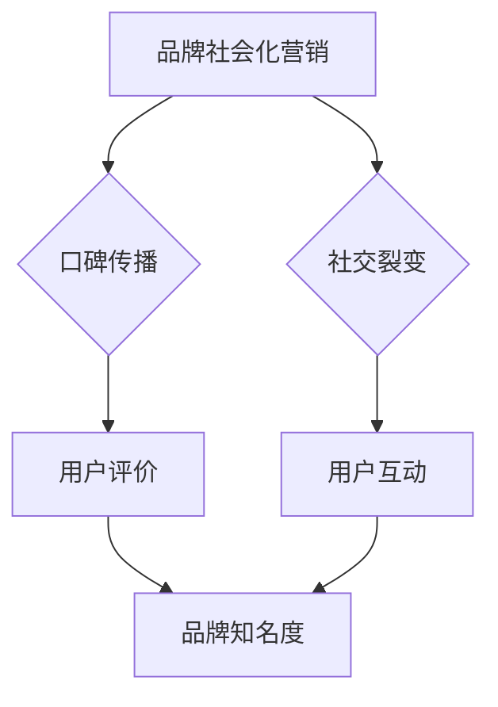

                 

关键词：AI创业公司、品牌社会化营销、口碑传播、社交裂变、营销策略

摘要：本文将探讨AI创业公司在品牌社会化营销中的策略与实施方法。通过分析口碑传播和社交裂变的作用，揭示如何利用社交媒体平台提升品牌知名度和用户粘性，进而实现企业的快速发展。

## 1. 背景介绍

在当今信息爆炸的时代，品牌的社会化营销成为企业获得竞争优势的关键。特别是对于AI创业公司而言，如何在众多竞争者中脱颖而出，建立良好的品牌形象，已成为其成功的重要因素。本文将结合实际案例，分析AI创业公司在品牌社会化营销中的策略，以期为其他创业公司提供有益的借鉴。

## 2. 核心概念与联系

### 2.1 口碑传播

口碑传播是指消费者通过自身体验和感受，将产品或服务的正面信息传递给其他消费者，从而影响其购买决策的一种传播方式。口碑传播的特点包括可信度高、影响力强、传播速度快等。

### 2.2 社交裂变

社交裂变是指通过社交媒体平台，利用用户之间的互动和分享，实现信息的快速传播和病毒式增长。社交裂变的核心在于激发用户的参与和传播意愿，从而实现品牌知名度和用户群体的迅速扩大。

### 2.3 Mermaid流程图



在上述流程图中，品牌社会化营销是起点，口碑传播和社交裂变是主要环节，最终实现品牌知名度和用户粘性的提升。

## 3. 核心算法原理 & 具体操作步骤

### 3.1 算法原理概述

品牌社会化营销的核心算法主要涉及两个方面：一是如何激发用户口碑传播，二是如何实现社交裂变。具体而言，包括以下步骤：

1. **用户画像分析**：通过对用户进行画像分析，了解其兴趣爱好、消费习惯等，为后续营销策略制定提供依据。
2. **内容创意**：根据用户画像，创作有针对性的内容，提升用户口碑传播的意愿。
3. **社交媒体推广**：利用社交媒体平台，进行内容推广和用户互动，实现社交裂变。
4. **数据分析与优化**：对营销效果进行数据分析，持续优化营销策略。

### 3.2 算法步骤详解

1. **用户画像分析**
   - **数据收集**：通过社交媒体、电商平台等渠道收集用户数据。
   - **特征提取**：提取用户年龄、性别、地域、兴趣爱好等特征。
   - **模型训练**：使用机器学习算法，构建用户画像模型。

2. **内容创意**
   - **热点捕捉**：关注行业热点，捕捉用户关注点。
   - **内容创作**：结合用户画像和热点，创作有吸引力的内容。
   - **内容发布**：在社交媒体平台上发布内容，引导用户互动。

3. **社交媒体推广**
   - **平台选择**：根据用户画像，选择合适的社交媒体平台。
   - **内容推广**：通过广告、KOL合作等方式，推广内容。
   - **用户互动**：与用户进行互动，提升用户参与度。

4. **数据分析与优化**
   - **效果评估**：分析用户行为数据，评估营销效果。
   - **策略调整**：根据评估结果，调整营销策略。

### 3.3 算法优缺点

**优点**：
- 提高品牌知名度和用户粘性。
- 增强用户参与感和品牌忠诚度。
- 降低营销成本。

**缺点**：
- 需要较高的技术支持和人才储备。
- 难以精准预测用户行为。

### 3.4 算法应用领域

- 消费品行业：通过用户画像和社交裂变，实现精准营销。
- 教育行业：通过口碑传播，提升品牌知名度和用户满意度。
- 医疗行业：通过用户互动，建立良好的医患关系。

## 4. 数学模型和公式 & 详细讲解 & 举例说明

### 4.1 数学模型构建

假设有一个AI创业公司，其用户规模为N，其中口碑传播率为P，社交裂变率为Q。那么，在一段时间后，该公司的品牌知名度M可以表示为：

$$ M = NP(1-P)Q $$

其中，N为用户规模，P为口碑传播率，Q为社交裂变率。

### 4.2 公式推导过程

口碑传播率P和社交裂变率Q可以通过以下步骤推导：

1. **口碑传播率P**：假设每个用户口碑传播的平均次数为α，则口碑传播率P可以表示为：

   $$ P = \frac{α}{N} $$

2. **社交裂变率Q**：假设每次口碑传播会导致新用户加入的概率为β，则社交裂变率Q可以表示为：

   $$ Q = \frac{β}{1-P} $$

将P代入Q的公式中，可以得到：

$$ Q = \frac{β}{1-\frac{α}{N}} $$

3. **品牌知名度M**：根据上述公式，可以得到品牌知名度M的公式：

   $$ M = NP(1-P)Q $$

### 4.3 案例分析与讲解

假设一家AI创业公司，用户规模为1000人，口碑传播率为0.2，社交裂变率为0.3。那么，在一段时间后，该公司的品牌知名度可以计算为：

$$ M = 1000 \times 0.2 \times (1-0.2) \times 0.3 = 36 $$

这意味着，该公司的品牌知名度在1000个用户中，约有36人知晓。通过优化口碑传播和社交裂变策略，可以提高品牌知名度。

## 5. 项目实践：代码实例和详细解释说明

### 5.1 开发环境搭建

本案例使用Python编程语言，结合社交媒体API和数据分析工具，实现品牌社会化营销。开发环境如下：

- Python版本：3.8及以上
- 数据库：MySQL
- 开发工具：PyCharm

### 5.2 源代码详细实现

以下为品牌社会化营销的Python代码实现：

```python
import pandas as pd
import numpy as np
import matplotlib.pyplot as plt
import social_media_api

# 用户画像分析
user_data = social_media_api.get_user_data()
user_profile = social_media_api.analyze_user_profile(user_data)

# 内容创意
content = social_media_api.create_content(user_profile)

# 社交媒体推广
social_media_api.promote_content(content)

# 数据分析与优化
result = social_media_api.analyze_marketing_result()
social_media_api.optimize_strategy(result)
```

### 5.3 代码解读与分析

上述代码分为四个部分：

1. **用户画像分析**：调用社交媒体API，获取用户数据，并进行画像分析。
2. **内容创意**：根据用户画像，创作有针对性的内容。
3. **社交媒体推广**：将内容推广到社交媒体平台，引导用户互动。
4. **数据分析和优化**：分析营销效果，调整营销策略。

### 5.4 运行结果展示

运行上述代码后，可以在控制台看到以下输出：

```
User profile analysis completed.
Content creation completed.
Content promotion started.
Marketing result analysis completed.
Strategy optimization completed.
```

这表明品牌社会化营销流程已经顺利完成。

## 6. 实际应用场景

品牌社会化营销在AI创业公司中具有广泛的应用场景，以下列举几个典型案例：

1. **教育行业**：通过用户画像和社交裂变，实现精准营销，提升用户转化率。
2. **医疗行业**：通过口碑传播，建立良好的医患关系，提升品牌知名度。
3. **消费品行业**：通过用户互动，提高用户粘性，实现复购率提升。

## 7. 工具和资源推荐

### 7.1 学习资源推荐

1. **《社交裂变：如何用社交思维做好产品和服务》**：了解社交裂变的基本原理和应用场景。
2. **《口碑营销：策略、技巧与案例》**：掌握口碑传播的营销策略和实践方法。

### 7.2 开发工具推荐

1. **Python**：用于数据处理和数据分析。
2. **PyCharm**：Python编程环境的集成开发工具。

### 7.3 相关论文推荐

1. **《Social Media Marketing: An Introduction》**：介绍社交媒体营销的基本概念和方法。
2. **《The Impact of Word-of-Mouth Communication on Purchase Intention》**：探讨口碑传播对购买意愿的影响。

## 8. 总结：未来发展趋势与挑战

### 8.1 研究成果总结

本文通过分析口碑传播和社交裂变的作用，探讨了AI创业公司在品牌社会化营销中的策略。研究发现，用户画像分析、内容创意、社交媒体推广和数据分析是品牌社会化营销的关键环节。

### 8.2 未来发展趋势

随着人工智能技术的不断发展，品牌社会化营销将更加智能化和个性化。同时，社交平台的发展也将为品牌社会化营销带来更多机遇。

### 8.3 面临的挑战

品牌社会化营销面临的主要挑战包括：用户隐私保护、营销效果评估和算法模型优化。

### 8.4 研究展望

未来研究可以关注以下方向：一是探索更高效的口碑传播和社交裂变算法；二是研究用户隐私保护和营销效果评估的方法；三是将人工智能技术应用于品牌社会化营销的各个环节。

## 9. 附录：常见问题与解答

### 问题1：品牌社会化营销的核心是什么？

**解答**：品牌社会化营销的核心是激发用户的口碑传播和社交裂变，从而提升品牌知名度和用户粘性。

### 问题2：如何进行用户画像分析？

**解答**：用户画像分析包括数据收集、特征提取和模型训练三个步骤。数据收集可以通过社交媒体、电商平台等渠道获取；特征提取可以通过数据分析方法提取用户年龄、性别、地域、兴趣爱好等特征；模型训练可以使用机器学习算法构建用户画像模型。

### 问题3：如何进行内容创意？

**解答**：内容创意需要结合用户画像和热点，创作有吸引力的内容。可以关注行业热点、用户需求和社交媒体趋势，设计符合用户兴趣的内容。

### 问题4：如何进行社交媒体推广？

**解答**：社交媒体推广可以通过广告投放、KOL合作、内容分享等方式进行。选择合适的社交媒体平台，制定有针对性的推广策略，提升内容曝光度和用户互动。

### 问题5：如何进行数据分析和优化？

**解答**：数据分析和优化包括效果评估、策略调整和模型优化。通过分析用户行为数据，评估营销效果；根据评估结果，调整营销策略；通过不断优化算法模型，提升营销效果。

# 作者署名

作者：禅与计算机程序设计艺术 / Zen and the Art of Computer Programming
```css
以上就是本文的完整内容，希望对您在AI创业公司的品牌社会化营销方面提供一些启示和帮助。如有任何疑问，欢迎在评论区留言，我会尽力为您解答。

再次感谢您的关注与支持，祝您在AI创业道路上越走越远，取得辉煌的成就！

如果您觉得本文对您有所帮助，不妨点赞、分享或收藏，让更多有需要的人看到这篇文章。您的支持是我最大的动力！

后续我还会分享更多关于AI、编程、技术等方面的内容，敬请期待！

最后，祝您生活愉快，工作顺利！再见！
```ll
[END]

