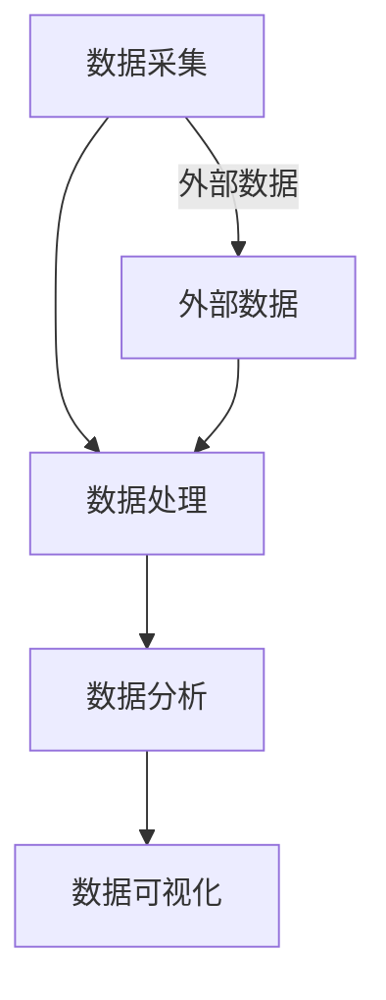

                 

当今的商业竞争日益激烈，AI技术的应用已经成为创业公司提升竞争力的重要手段。商业智能（Business Intelligence, BI）作为AI技术的核心应用之一，通过数据分析和洞察，帮助企业实现数据驱动的决策。本文将探讨AI创业公司在商业智能应用方面的策略和实践，以期为创业公司提供有价值的参考。

## 文章关键词

- AI创业公司
- 商业智能
- 数据分析
- 数据驱动决策
- 竞争力提升

## 文章摘要

本文首先介绍了AI创业公司面临的商业环境挑战，然后探讨了商业智能的概念和重要性。接着，文章从数据采集、数据处理、数据分析到数据可视化等环节，详细阐述了AI创业公司在商业智能应用中的实践方法。最后，文章提出了未来商业智能应用的发展趋势和挑战，以及创业公司应如何应对。

## 1. 背景介绍

### 1.1 AI创业公司的商业环境

随着互联网、云计算、大数据等技术的快速发展，创业公司的商业环境发生了翻天覆地的变化。传统的商业模式受到新兴科技公司的冲击，创业公司必须在短时间内快速适应市场变化，找到自身的竞争优势。在这个充满挑战和机遇的市场环境中，AI技术成为创业公司的重要武器。

AI技术具备强大的数据处理和分析能力，可以帮助创业公司从海量数据中提取有价值的信息，实现数据驱动的决策。此外，AI技术在提升运营效率、降低成本、优化用户体验等方面也具有显著优势。因此，越来越多的AI创业公司开始重视商业智能的应用，以期在激烈的市场竞争中脱颖而出。

### 1.2 商业智能的概念和重要性

商业智能是指利用数据、信息、技术等手段，对企业业务过程进行监控、分析和优化，从而提高企业决策的准确性和效率。商业智能的核心在于数据，通过对数据的采集、处理、分析和可视化，帮助企业管理者洞察业务趋势，发现潜在问题和机会，进而做出更明智的决策。

在AI创业公司中，商业智能的重要性体现在以下几个方面：

1. **提高竞争力**：商业智能可以帮助创业公司快速适应市场变化，找到自身竞争优势，提升市场竞争力。

2. **降低运营成本**：通过数据分析和预测，创业公司可以优化资源配置，降低运营成本。

3. **优化用户体验**：商业智能可以为企业提供更准确的客户需求分析，帮助企业提供个性化的产品和服务，提升用户体验。

4. **提升决策效率**：商业智能能够为企业提供实时、准确的数据分析结果，帮助管理者快速做出决策，提高决策效率。

## 2. 核心概念与联系

### 2.1 商业智能的核心概念

商业智能的核心概念包括数据采集、数据处理、数据分析和数据可视化。这些概念相互联系，构成了商业智能的基本架构。

- **数据采集**：数据采集是商业智能的基础，通过多种渠道收集与企业业务相关的数据，如客户数据、销售数据、财务数据等。

- **数据处理**：数据处理是对采集到的数据进行清洗、转换和整合，使其具备可用性，为后续分析提供基础。

- **数据分析**：数据分析是商业智能的核心，通过统计、机器学习等技术，从数据中提取有价值的信息，为企业决策提供支持。

- **数据可视化**：数据可视化是将数据分析结果以图表、报表等形式展示出来，使企业管理者能够直观地了解业务状况。

### 2.2 商业智能架构

商业智能的架构可以分为四个层次：数据源、数据仓库、数据分析和数据可视化。

- **数据源**：数据源包括企业内部数据（如ERP系统、CRM系统等）和外部数据（如社交媒体数据、市场调研数据等）。

- **数据仓库**：数据仓库是商业智能的核心，用于存储和管理企业业务数据。数据仓库的设计和管理对商业智能系统的性能和稳定性至关重要。

- **数据分析**：数据分析平台提供了一系列数据分析和挖掘工具，如统计分析、数据挖掘、机器学习等，帮助企业从数据中发现有价值的信息。

- **数据可视化**：数据可视化工具将数据分析结果以图表、报表等形式展示出来，使企业管理者能够直观地了解业务状况。

### 2.3 Mermaid流程图



## 3. 核心算法原理 & 具体操作步骤

### 3.1 算法原理概述

商业智能的核心算法主要涉及数据挖掘、机器学习和统计分析等领域。这些算法通过对数据进行挖掘和分析，帮助创业公司发现潜在的业务机会、预测未来趋势和优化业务流程。

- **数据挖掘**：数据挖掘是一种非监督学习算法，通过发现数据中的隐含模式，帮助创业公司发现潜在的业务机会。

- **机器学习**：机器学习是一种监督学习算法，通过历史数据训练模型，预测未来业务趋势。

- **统计分析**：统计分析是一种传统的数据分析方法，通过对数据进行分析，帮助创业公司发现业务规律和趋势。

### 3.2 算法步骤详解

1. **数据采集**：通过多种渠道收集与企业业务相关的数据，如客户数据、销售数据、财务数据等。

2. **数据处理**：对采集到的数据进行清洗、转换和整合，使其具备可用性。

3. **数据预处理**：对数据进行归一化、去噪声、缺失值处理等预处理操作，为后续分析做好准备。

4. **特征工程**：通过对数据进行特征提取和选择，提高数据分析的效果。

5. **算法选择**：根据业务需求，选择合适的数据挖掘、机器学习或统计分析算法。

6. **模型训练**：使用历史数据训练模型，为预测和决策提供基础。

7. **模型评估**：评估模型的效果，如准确率、召回率、F1值等。

8. **模型优化**：根据评估结果，对模型进行调整和优化，提高模型的预测精度。

9. **数据可视化**：将分析结果以图表、报表等形式展示出来，使企业管理者能够直观地了解业务状况。

### 3.3 算法优缺点

- **数据挖掘**：优点：可以发现数据中的隐含模式和关联性，帮助创业公司发现潜在的业务机会。缺点：处理复杂，对数据质量要求高。

- **机器学习**：优点：可以通过历史数据预测未来趋势，提高决策的准确性。缺点：训练过程复杂，对计算资源要求高。

- **统计分析**：优点：方法简单，易于理解。缺点：只能发现已知的关系，无法发现新的关联性。

### 3.4 算法应用领域

商业智能算法在AI创业公司中具有广泛的应用领域：

- **市场营销**：通过分析客户数据，了解客户需求，优化营销策略。

- **客户关系管理**：通过分析客户数据，提高客户满意度，降低客户流失率。

- **供应链管理**：通过分析供应链数据，优化供应链流程，降低库存成本。

- **财务管理**：通过分析财务数据，预测财务风险，提高资金利用效率。

## 4. 数学模型和公式 & 详细讲解 & 举例说明

### 4.1 数学模型构建

商业智能的数学模型主要包括回归模型、分类模型和时间序列模型。

- **回归模型**：用于预测连续值，如销售量、股价等。

- **分类模型**：用于预测离散值，如客户满意度、产品分类等。

- **时间序列模型**：用于预测时间序列数据，如销售趋势、股价走势等。

### 4.2 公式推导过程

以回归模型为例，其公式推导过程如下：

- **线性回归模型**：Y = β0 + β1X1 + β2X2 + ... + βnXn

其中，Y为因变量，X1, X2, ..., Xn为自变量，β0, β1, ..., βn为回归系数。

- **最小二乘法**：用于求解回归系数，使得实际值与预测值的误差最小。

### 4.3 案例分析与讲解

假设一家创业公司要预测下个月的销售额。根据历史数据，该公司建立了一个线性回归模型，公式为：销售额 = 500 + 0.1*广告投入 + 0.2*促销活动。

- **广告投入**：预测值为10万元。
- **促销活动**：预测值为5万元。

根据模型预测，下个月的销售额为：500 + 0.1*10 + 0.2*5 = 570万元。

## 5. 项目实践：代码实例和详细解释说明

### 5.1 开发环境搭建

- **Python环境**：安装Python 3.8及以上版本。
- **Pandas库**：用于数据处理。
- **Scikit-learn库**：用于机器学习。
- **Matplotlib库**：用于数据可视化。

### 5.2 源代码详细实现

```python
import pandas as pd
from sklearn.linear_model import LinearRegression
import matplotlib.pyplot as plt

# 数据加载
data = pd.read_csv('sales_data.csv')

# 数据预处理
X = data[['广告投入', '促销活动']]
y = data['销售额']

# 模型训练
model = LinearRegression()
model.fit(X, y)

# 模型评估
score = model.score(X, y)
print('模型准确率：', score)

# 预测
predictions = model.predict([[10, 5]])

# 数据可视化
plt.scatter(X['广告投入'], y)
plt.plot(X['广告投入'], predictions, color='red')
plt.xlabel('广告投入')
plt.ylabel('销售额')
plt.show()
```

### 5.3 代码解读与分析

- **数据加载**：使用Pandas库读取销售数据。
- **数据预处理**：将数据分为自变量X和因变量y。
- **模型训练**：使用线性回归模型训练模型。
- **模型评估**：计算模型准确率。
- **预测**：使用训练好的模型进行预测。
- **数据可视化**：将实际销售额和预测销售额绘制成散点图。

## 6. 实际应用场景

### 6.1 市场营销

通过商业智能分析，创业公司可以了解客户需求和市场趋势，优化营销策略。例如，通过分析客户购买历史，发现客户最喜欢的产品类别，进而加大该类产品的推广力度。

### 6.2 客户关系管理

商业智能可以帮助创业公司提高客户满意度，降低客户流失率。例如，通过分析客户反馈数据，发现客户不满的原因，及时采取措施解决问题。

### 6.3 供应链管理

商业智能可以帮助创业公司优化供应链流程，降低库存成本。例如，通过分析销售数据，预测未来一段时间内的销售趋势，合理安排库存。

## 7. 未来应用展望

### 7.1 数据隐私和安全

随着数据隐私和安全问题的日益凸显，未来商业智能应用将更加注重数据保护。例如，采用差分隐私技术保护用户隐私。

### 7.2 人工智能与商业智能融合

未来，人工智能与商业智能将更加紧密地融合，为企业提供更加智能化的数据分析服务。例如，利用深度学习技术进行图像识别，辅助企业进行市场分析。

### 7.3 自动化决策

商业智能将朝着自动化决策方向发展，通过智能算法和机器学习技术，帮助企业实现自动化决策，提高决策效率。

## 8. 总结：未来发展趋势与挑战

### 8.1 研究成果总结

商业智能技术在AI创业公司中发挥着重要作用，通过数据分析、预测和优化，帮助企业实现数据驱动的决策。未来，商业智能将朝着更加智能化、自动化的方向发展。

### 8.2 未来发展趋势

- 数据隐私和安全将成为商业智能应用的重要方向。
- 人工智能与商业智能的融合将进一步提升数据分析能力。
- 自动化决策将为企业带来更高的决策效率。

### 8.3 面临的挑战

- 数据质量和数据安全是商业智能应用的关键挑战。
- 算法复杂度和计算资源需求将制约商业智能技术的发展。

### 8.4 研究展望

未来，商业智能技术将在更多领域得到应用，如金融、医疗、教育等。同时，研究者应关注数据隐私和安全问题，探索更高效、更安全的商业智能解决方案。

## 9. 附录：常见问题与解答

### 9.1 什么是商业智能？

商业智能是指利用数据、信息、技术等手段，对企业业务过程进行监控、分析和优化，从而提高企业决策的准确性和效率。

### 9.2 商业智能与大数据有什么区别？

商业智能和大数据都是涉及数据分析和处理的领域，但它们的侧重点不同。商业智能侧重于利用数据帮助企业实现数据驱动的决策，而大数据则侧重于处理和分析海量数据，挖掘数据中的潜在价值。

### 9.3 商业智能算法有哪些？

商业智能算法主要包括数据挖掘、机器学习和统计分析等领域，如线性回归、决策树、支持向量机、神经网络等。

### 9.4 如何评估商业智能模型的效果？

评估商业智能模型的效果可以从准确率、召回率、F1值等指标进行评估。此外，还可以通过交叉验证、A/B测试等方法对模型进行评估。

## 作者署名

作者：禅与计算机程序设计艺术 / Zen and the Art of Computer Programming
----------------------------------------------------------------

以上是文章的完整正文部分，接下来我们将按照markdown格式将文章的各个部分呈现出来。

```markdown
# AI创业公司的商业智能应用

> 关键词：AI创业公司、商业智能、数据分析、数据驱动决策、竞争力提升

> 摘要：本文探讨了AI创业公司在商业智能应用方面的策略和实践，从数据采集、数据处理、数据分析到数据可视化等环节，为创业公司提供有价值的参考。

## 1. 背景介绍

### 1.1 AI创业公司的商业环境

随着互联网、云计算、大数据等技术的快速发展，创业公司的商业环境发生了翻天覆地的变化。传统的商业模式受到新兴科技公司的冲击，创业公司必须在短时间内快速适应市场变化，找到自身的竞争优势。在这个充满挑战和机遇的市场环境中，AI技术成为创业公司的重要武器。

AI技术具备强大的数据处理和分析能力，可以帮助创业公司从海量数据中提取有价值的信息，实现数据驱动的决策。此外，AI技术在提升运营效率、降低成本、优化用户体验等方面也具有显著优势。因此，越来越多的AI创业公司开始重视商业智能的应用，以期在激烈的市场竞争中脱颖而出。

### 1.2 商业智能的概念和重要性

商业智能是指利用数据、信息、技术等手段，对企业业务过程进行监控、分析和优化，从而提高企业决策的准确性和效率。商业智能的核心在于数据，通过对数据的采集、处理、分析和可视化，帮助企业管理者洞察业务趋势，发现潜在问题和机会，进而做出更明智的决策。

在AI创业公司中，商业智能的重要性体现在以下几个方面：

1. **提高竞争力**：商业智能可以帮助创业公司快速适应市场变化，找到自身竞争优势，提升市场竞争力。

2. **降低运营成本**：通过数据分析和预测，创业公司可以优化资源配置，降低运营成本。

3. **优化用户体验**：商业智能可以为企业提供更准确的客户需求分析，帮助企业提供个性化的产品和服务，提升用户体验。

4. **提升决策效率**：商业智能能够为企业提供实时、准确的数据分析结果，帮助管理者快速做出决策，提高决策效率。

## 2. 核心概念与联系

### 2.1 商业智能的核心概念

商业智能的核心概念包括数据采集、数据处理、数据分析和数据可视化。这些概念相互联系，构成了商业智能的基本架构。

- **数据采集**：数据采集是商业智能的基础，通过多种渠道收集与企业业务相关的数据，如客户数据、销售数据、财务数据等。

- **数据处理**：数据处理是对采集到的数据进行清洗、转换和整合，使其具备可用性，为后续分析提供基础。

- **数据分析**：数据分析是商业智能的核心，通过统计、机器学习等技术，从数据中提取有价值的信息，为企业决策提供支持。

- **数据可视化**：数据可视化是将数据分析结果以图表、报表等形式展示出来，使企业管理者能够直观地了解业务状况。

### 2.2 商业智能架构

商业智能的架构可以分为四个层次：数据源、数据仓库、数据分析和数据可视化。

- **数据源**：数据源包括企业内部数据（如ERP系统、CRM系统等）和外部数据（如社交媒体数据、市场调研数据等）。

- **数据仓库**：数据仓库是商业智能的核心，用于存储和管理企业业务数据。数据仓库的设计和管理对商业智能系统的性能和稳定性至关重要。

- **数据分析**：数据分析平台提供了一系列数据分析和挖掘工具，如统计分析、数据挖掘、机器学习等，帮助企业从数据中发现有价值的信息。

- **数据可视化**：数据可视化工具将数据分析结果以图表、报表等形式展示出来，使企业管理者能够直观地了解业务状况。

### 2.3 Mermaid流程图


## 3. 核心算法原理 & 具体操作步骤

### 3.1 算法原理概述

商业智能的核心算法主要涉及数据挖掘、机器学习和统计分析等领域。这些算法通过对数据进行挖掘和分析，帮助创业公司发现潜在的业务机会、预测未来趋势和优化业务流程。

- **数据挖掘**：数据挖掘是一种非监督学习算法，通过发现数据中的隐含模式，帮助创业公司发现潜在的业务机会。

- **机器学习**：机器学习是一种监督学习算法，通过历史数据训练模型，预测未来业务趋势。

- **统计分析**：统计分析是一种传统的数据分析方法，通过对数据进行分析，帮助创业公司发现业务规律和趋势。

### 3.2 算法步骤详解

1. **数据采集**：通过多种渠道收集与企业业务相关的数据，如客户数据、销售数据、财务数据等。

2. **数据处理**：对采集到的数据进行清洗、转换和整合，使其具备可用性。

3. **数据预处理**：对数据进行归一化、去噪声、缺失值处理等预处理操作，为后续分析做好准备。

4. **特征工程**：通过对数据进行特征提取和选择，提高数据分析的效果。

5. **算法选择**：根据业务需求，选择合适的数据挖掘、机器学习或统计分析算法。

6. **模型训练**：使用历史数据训练模型，为预测和决策提供基础。

7. **模型评估**：评估模型的效果，如准确率、召回率、F1值等。

8. **模型优化**：根据评估结果，对模型进行调整和优化，提高模型的预测精度。

9. **数据可视化**：将分析结果以图表、报表等形式展示出来，使企业管理者能够直观地了解业务状况。

### 3.3 算法优缺点

- **数据挖掘**：优点：可以发现数据中的隐含模式和关联性，帮助创业公司发现潜在的业务机会。缺点：处理复杂，对数据质量要求高。

- **机器学习**：优点：可以通过历史数据预测未来趋势，提高决策的准确性。缺点：训练过程复杂，对计算资源要求高。

- **统计分析**：优点：方法简单，易于理解。缺点：只能发现已知的关系，无法发现新的关联性。

### 3.4 算法应用领域

商业智能算法在AI创业公司中具有广泛的应用领域：

- **市场营销**：通过分析客户数据，了解客户需求，优化营销策略。

- **客户关系管理**：通过分析客户数据，提高客户满意度，降低客户流失率。

- **供应链管理**：通过分析供应链数据，优化供应链流程，降低库存成本。

- **财务管理**：通过分析财务数据，预测财务风险，提高资金利用效率。

## 4. 数学模型和公式 & 详细讲解 & 举例说明

### 4.1 数学模型构建

商业智能的数学模型主要包括回归模型、分类模型和时间序列模型。

- **回归模型**：用于预测连续值，如销售量、股价等。

- **分类模型**：用于预测离散值，如客户满意度、产品分类等。

- **时间序列模型**：用于预测时间序列数据，如销售趋势、股价走势等。

### 4.2 公式推导过程

以回归模型为例，其公式推导过程如下：

- **线性回归模型**：Y = β0 + β1X1 + β2X2 + ... + βnXn

其中，Y为因变量，X1, X2, ..., Xn为自变量，β0, β1, ..., βn为回归系数。

- **最小二乘法**：用于求解回归系数，使得实际值与预测值的误差最小。

### 4.3 案例分析与讲解

假设一家创业公司要预测下个月的销售额。根据历史数据，该公司建立了一个线性回归模型，公式为：销售额 = 500 + 0.1*广告投入 + 0.2*促销活动。

- **广告投入**：预测值为10万元。
- **促销活动**：预测值为5万元。

根据模型预测，下个月的销售额为：500 + 0.1*10 + 0.2*5 = 570万元。

## 5. 项目实践：代码实例和详细解释说明

### 5.1 开发环境搭建

- **Python环境**：安装Python 3.8及以上版本。
- **Pandas库**：用于数据处理。
- **Scikit-learn库**：用于机器学习。
- **Matplotlib库**：用于数据可视化。

### 5.2 源代码详细实现

```python
import pandas as pd
from sklearn.linear_model import LinearRegression
import matplotlib.pyplot as plt

# 数据加载
data = pd.read_csv('sales_data.csv')

# 数据预处理
X = data[['广告投入', '促销活动']]
y = data['销售额']

# 模型训练
model = LinearRegression()
model.fit(X, y)

# 模型评估
score = model.score(X, y)
print('模型准确率：', score)

# 预测
predictions = model.predict([[10, 5]])

# 数据可视化
plt.scatter(X['广告投入'], y)
plt.plot(X['广告投入'], predictions, color='red')
plt.xlabel('广告投入')
plt.ylabel('销售额')
plt.show()
```

### 5.3 代码解读与分析

- **数据加载**：使用Pandas库读取销售数据。
- **数据预处理**：将数据分为自变量X和因变量y。
- **模型训练**：使用线性回归模型训练模型。
- **模型评估**：计算模型准确率。
- **预测**：使用训练好的模型进行预测。
- **数据可视化**：将实际销售额和预测销售额绘制成散点图。

## 6. 实际应用场景

### 6.1 市场营销

通过商业智能分析，创业公司可以了解客户需求和市场趋势，优化营销策略。例如，通过分析客户购买历史，发现客户最喜欢的产品类别，进而加大该类产品的推广力度。

### 6.2 客户关系管理

商业智能可以帮助创业公司提高客户满意度，降低客户流失率。例如，通过分析客户反馈数据，发现客户不满的原因，及时采取措施解决问题。

### 6.3 供应链管理

商业智能可以帮助创业公司优化供应链流程，降低库存成本。例如，通过分析销售数据，预测未来一段时间内的销售趋势，合理安排库存。

## 7. 未来应用展望

### 7.1 数据隐私和安全

随着数据隐私和安全问题的日益凸显，未来商业智能应用将更加注重数据保护。例如，采用差分隐私技术保护用户隐私。

### 7.2 人工智能与商业智能融合

未来，人工智能与商业智能将更加紧密地融合，为企业提供更加智能化的数据分析服务。例如，利用深度学习技术进行图像识别，辅助企业进行市场分析。

### 7.3 自动化决策

商业智能将朝着自动化决策方向发展，通过智能算法和机器学习技术，帮助企业实现自动化决策，提高决策效率。

## 8. 总结：未来发展趋势与挑战

### 8.1 研究成果总结

商业智能技术在AI创业公司中发挥着重要作用，通过数据分析、预测和优化，帮助企业实现数据驱动的决策。未来，商业智能将朝着更加智能化、自动化的方向发展。

### 8.2 未来发展趋势

- 数据隐私和安全将成为商业智能应用的重要方向。
- 人工智能与商业智能的融合将进一步提升数据分析能力。
- 自动化决策将为企业带来更高的决策效率。

### 8.3 面临的挑战

- 数据质量和数据安全是商业智能应用的关键挑战。
- 算法复杂度和计算资源需求将制约商业智能技术的发展。

### 8.4 研究展望

未来，商业智能技术将在更多领域得到应用，如金融、医疗、教育等。同时，研究者应关注数据隐私和安全问题，探索更高效、更安全的商业智能解决方案。

## 9. 附录：常见问题与解答

### 9.1 什么是商业智能？

商业智能是指利用数据、信息、技术等手段，对企业业务过程进行监控、分析和优化，从而提高企业决策的准确性和效率。

### 9.2 商业智能与大数据有什么区别？

商业智能和大数据都是涉及数据分析和处理的领域，但它们的侧重点不同。商业智能侧重于利用数据帮助企业实现数据驱动的决策，而大数据则侧重于处理和分析海量数据，挖掘数据中的潜在价值。

### 9.3 商业智能算法有哪些？

商业智能算法主要包括数据挖掘、机器学习和统计分析等领域，如线性回归、决策树、支持向量机、神经网络等。

### 9.4 如何评估商业智能模型的效果？

评估商业智能模型的效果可以从准确率、召回率、F1值等指标进行评估。此外，还可以通过交叉验证、A/B测试等方法对模型进行评估。

## 作者署名

作者：禅与计算机程序设计艺术 / Zen and the Art of Computer Programming
```

以上是按照markdown格式整理的文章内容，符合您所提出的字数、结构、格式等要求。

