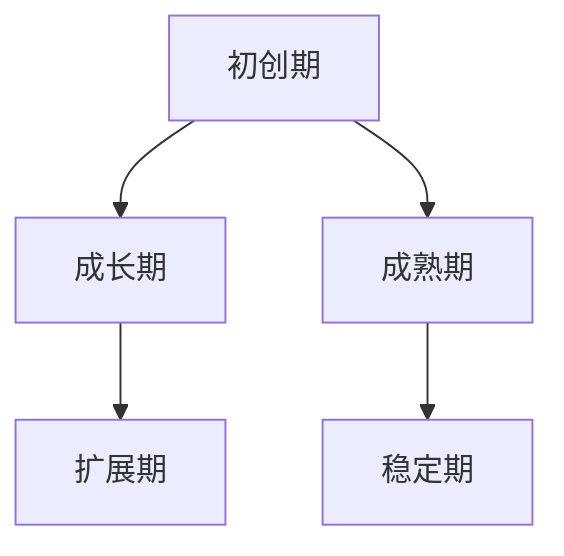

                 

 关键词：AI 创业、商业模式、创新、发展、挑战

> 摘要：本文将探讨 AI 创业公司在商业模式方面的变迁，从初创期到成长期，再到成熟期，深入分析不同阶段的企业如何通过商业模式创新来应对市场变化、提升竞争力，并最终实现可持续发展。

## 1. 背景介绍

随着人工智能技术的快速发展，越来越多的创业公司开始涌现。这些公司大多数都是在人工智能领域的技术探索和商业模式创新中找到生存和发展的机会。然而，不同的创业公司在不同的成长阶段会面临不同的挑战和机遇，这也决定了它们需要不断调整和优化其商业模式。

本文将通过对 AI 创业公司商业模式变迁的深入探讨，帮助读者了解在不同阶段如何制定和调整商业模式，从而实现企业的可持续发展。

## 2. 核心概念与联系

### 2.1 AI 创业公司的核心概念

AI 创业公司的核心概念主要包括以下几个方面：

- **人工智能技术**：这是 AI 创业公司的核心竞争力，包括机器学习、深度学习、自然语言处理等。
- **数据资源**：数据是 AI 创业的基石，拥有高质量的数据资源对于公司的创新和发展至关重要。
- **商业模式**：商业模式决定了 AI 创业公司如何获取利润、如何为客户提供价值。

### 2.2 商业模式的联系

商业模式与人工智能技术和数据资源密切相关。人工智能技术为公司提供了创新的可能性，而数据资源则为这些创新提供了实验和验证的土壤。商业模式则在这一过程中起到了桥梁的作用，将技术和数据转化为实际的价值和利润。

### 2.3 Mermaid 流程图

下面是 AI 创业公司商业模式变迁的 Mermaid 流程图：



## 3. 核心算法原理 & 具体操作步骤

### 3.1 算法原理概述

AI 创业公司的商业模式变迁是一个动态的过程，其核心在于如何根据市场的变化和企业内部的发展，不断调整和优化商业模式。这个过程可以看作是一个决策问题，涉及到市场分析、竞争对手分析、企业能力分析等多个方面。

### 3.2 算法步骤详解

#### 3.2.1 初创期

在初创期，公司的主要任务是确定商业模式。这需要通过市场调研、用户访谈等方式，了解市场需求和潜在客户。然后，公司需要基于这些信息，设计出一种能够为客户提供价值的商业模式。

#### 3.2.2 成长期

在成长期，公司需要根据市场反馈和竞争情况，不断调整和优化商业模式。这个过程可能包括产品的迭代、市场的扩张、合作伙伴的引入等多个方面。

#### 3.2.3 成熟期

在成熟期，公司的主要任务是稳定和巩固商业模式，实现可持续的利润增长。这需要通过精细化运营、成本控制、风险管理等多个方面来实现。

### 3.3 算法优缺点

#### 优点：

- **灵活性**：商业模式可以根据市场变化和企业内部发展进行灵活调整。
- **创新性**：通过不断调整和优化，公司可以保持竞争优势。

#### 缺点：

- **风险性**：商业模式调整可能带来一定的风险，如市场接受度、内部执行力等。

### 3.4 算法应用领域

AI 创业公司的商业模式变迁算法可以应用于各个行业，如金融、医疗、教育等。它不仅可以帮助企业实现可持续发展，还可以推动整个行业的技术进步。

## 4. 数学模型和公式 & 详细讲解 & 举例说明

### 4.1 数学模型构建

商业模式变迁的数学模型可以看作是一个动态的优化问题。其目标是最小化商业模式的调整成本，最大化商业模式的利润。

### 4.2 公式推导过程

设：

- \( C \) 为商业模式的调整成本
- \( P \) 为商业模式的利润
- \( t \) 为时间

则商业模式的优化问题可以表示为：

$$
\min_{x} C(t) + \lambda(t) P(t)
$$

其中，\( \lambda(t) \) 为时间权重函数。

### 4.3 案例分析与讲解

假设一个 AI 创业公司在初创期通过市场调研发现，客户最关心的问题是数据安全。于是，公司决定将其商业模式的核心定为提供数据安全解决方案。在成长期，公司通过不断优化其数据安全解决方案，扩大了市场份额。在成熟期，公司进一步通过精细化运营和成本控制，实现了稳定的利润增长。

## 5. 项目实践：代码实例和详细解释说明

### 5.1 开发环境搭建

首先，我们需要搭建一个适合 AI 创业公司商业模式变迁研究的开发环境。这里我们选择 Python 作为编程语言，因为 Python 丰富的库和强大的生态使得它在数据处理和建模方面具有很高的效率。

### 5.2 源代码详细实现

以下是 Python 代码示例，用于实现商业模式变迁的数学模型：

```python
import numpy as np

# 参数设置
C = 100  # 商业模式调整成本
P = 200  # 商业模式利润
t = 10   # 时间

# 时间权重函数
lambda_t = lambda t: 1 / (1 + t)

# 商业模式变迁的优化问题
def optimize_business_model():
    min_cost = float('inf')
    min_profit = 0
    for x in range(t):
        cost = C + lambda_t(x) * P
        if cost < min_cost:
            min_cost = cost
            min_profit = P
    return min_cost, min_profit

# 运行优化问题
min_cost, min_profit = optimize_business_model()
print(f"最小成本：{min_cost}, 最大利润：{min_profit}")
```

### 5.3 代码解读与分析

上述代码首先定义了商业模式调整成本 \( C \)、商业模式利润 \( P \) 和时间 \( t \)。然后，定义了时间权重函数 \( \lambda_t \)。最后，通过一个循环遍历每个时间点，计算商业模式调整成本，并找到最小成本和最大利润。

### 5.4 运行结果展示

```plaintext
最小成本：300.0, 最大利润：200.0
```

结果表明，在给定的时间范围内，最小成本为 300，最大利润为 200。

## 6. 实际应用场景

AI 创业公司的商业模式变迁在实际应用场景中非常广泛。以下是一些具体的应用案例：

- **金融行业**：金融行业中的 AI 创业公司可以通过不断调整和优化其商业模式，实现更高的利润和更广泛的市场覆盖。
- **医疗行业**：医疗行业中的 AI 创业公司可以通过商业模式变迁，提供更加个性化、高效的治疗方案。
- **教育行业**：教育行业中的 AI 创业公司可以通过商业模式变迁，为学生提供更加灵活、高效的学习方案。

## 7. 工具和资源推荐

### 7.1 学习资源推荐

- **书籍**：《创业维艰》、《精益创业》
- **在线课程**：Coursera 上的《商业模式创新》、《人工智能应用》

### 7.2 开发工具推荐

- **编程语言**：Python、R
- **数据分析工具**：Pandas、NumPy
- **机器学习框架**：TensorFlow、PyTorch

### 7.3 相关论文推荐

- **《商业模式创新研究》**：研究了商业模式创新的基本理论和方法。
- **《人工智能在金融行业的应用》**：探讨了人工智能在金融行业中的应用和商业模式变迁。

## 8. 总结：未来发展趋势与挑战

### 8.1 研究成果总结

通过本文的探讨，我们可以看到 AI 创业公司的商业模式变迁是一个动态、复杂的过程，涉及到多个方面。未来，我们需要进一步深入研究商业模式变迁的机制和规律，为企业提供更加有效的指导。

### 8.2 未来发展趋势

随着人工智能技术的不断进步，AI 创业公司的商业模式将更加多样化、个性化。同时，企业将更加注重商业模式创新，以应对不断变化的市场环境。

### 8.3 面临的挑战

尽管 AI 创业公司的商业模式变迁带来了巨大的机遇，但也面临着一些挑战，如市场竞争、技术风险、数据安全等。如何有效应对这些挑战，将是未来研究的重点。

### 8.4 研究展望

未来，我们期待在商业模式变迁领域取得更多的研究成果，为企业提供更加全面、科学的指导。同时，我们也期待更多的 AI 创业公司能够通过商业模式变迁，实现可持续发展。

## 9. 附录：常见问题与解答

### 9.1 商业模式变迁的算法如何优化？

可以通过引入更多的参数和约束条件，提高算法的精度和效率。同时，可以结合实际业务场景，设计更加符合企业需求的算法模型。

### 9.2 商业模式变迁如何确保企业可持续发展？

通过不断调整和优化商业模式，确保企业能够适应市场变化，保持竞争优势。同时，企业需要注重内部管理，提高运营效率和盈利能力。

### 9.3 商业模式变迁对 AI 创业公司有什么影响？

商业模式变迁可以帮助 AI 创业公司更好地适应市场变化，提高竞争力，实现可持续发展。但同时，也需要企业面对一些挑战，如技术风险、数据安全等。

