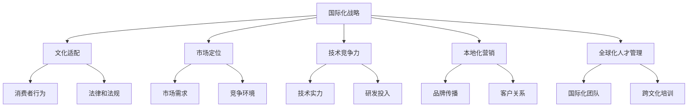

                 

关键词：AI 创业，国际化，战略，文化适配，市场定位，技术竞争力，增长策略

> 摘要：本文探讨了 AI 创业公司在国际市场上的发展策略，分析了文化适配、市场定位、技术竞争力、本地化营销和全球化人才管理等方面的关键因素，提供了实用的建议，旨在帮助 AI 创业公司在全球市场中取得成功。

## 1. 背景介绍

随着人工智能技术的快速发展，AI 创业公司如雨后春笋般涌现。然而，在国际市场上取得成功并非易事。不同的国家和地区有着不同的文化、法律、市场环境和消费者行为，这些因素都对 AI 创业公司的国际化战略有着深远的影响。因此，了解和应对这些差异，制定合适的国际化策略，是 AI 创业公司成功进军全球市场的重要前提。

本文旨在分析 AI 创业公司在国际化过程中面临的主要挑战，并提出相应的策略建议。文章将首先概述国际化的重要性和挑战，然后深入探讨文化适配、市场定位、技术竞争力、本地化营销和全球化人才管理等方面的策略。

## 2. 核心概念与联系

为了更好地理解国际化策略，我们首先需要明确几个核心概念，如图 1 所示：



### 2.1 国际化战略概述

国际化战略是指公司在全球范围内开展业务的活动和决策过程。它包括市场进入策略、文化适应策略、组织结构调整和全球化供应链管理等多个方面。

### 2.2 文化适配

文化适配是指公司在国际市场上开展业务时，如何适应当地文化、社会习俗和价值观，以建立信任和品牌忠诚度。这包括本地化营销策略、产品和服务创新、员工培训等方面。

### 2.3 市场定位

市场定位是指公司在国际市场上如何选择目标客户群体和定位品牌形象，以获得竞争优势。这需要对公司目标市场进行深入分析，了解当地消费者需求、购买习惯和竞争态势。

### 2.4 技术竞争力

技术竞争力是指公司在国际市场上通过技术创新、研发投入和人才培养等方面的优势，提高产品和服务的竞争力。这关系到公司的核心竞争力，决定了公司在全球市场中的地位。

### 2.5 本地化营销

本地化营销是指公司在国际市场上通过针对当地市场的营销策略，提高品牌知名度和市场份额。这包括广告宣传、公关活动、社交媒体营销等方面。

### 2.6 全球化人才管理

全球化人才管理是指公司在全球范围内招聘、培训和激励人才，以支持公司的国际化战略。这需要建立多元化的团队，提高跨文化沟通和协作能力。

## 3. 核心算法原理 & 具体操作步骤

### 3.1 算法原理概述

AI 创业公司的国际化策略可以看作是一个复杂的多目标优化问题。该问题需要同时考虑市场潜力、技术竞争力、文化适配和资源分配等多个目标，并找到一个最优解。

### 3.2 算法步骤详解

1. **市场调研与数据分析**：通过市场调研和数据分析，了解目标市场的需求、竞争态势和消费者行为，为制定国际化策略提供数据支持。
2. **文化适配分析**：分析目标市场的文化差异，制定相应的文化适配策略，包括产品本地化、营销策略调整和员工培训等方面。
3. **技术竞争力评估**：评估公司在技术领域的竞争力，确定研发投入和人才培养的重点领域。
4. **市场定位与目标确定**：根据市场调研结果和公司优势，确定目标市场和品牌形象。
5. **资源分配与优化**：根据公司资源状况和市场需求，制定资源分配方案，优化公司运营效率。
6. **实施与监控**：制定详细的实施计划，并建立监控体系，对国际化战略的执行情况进行实时监控和调整。

### 3.3 算法优缺点

#### 优点

1. **提高市场竞争力**：通过多目标优化，可以在资源有限的情况下，最大限度地提高公司的市场竞争力。
2. **降低风险**：通过全面分析市场和自身优势，可以降低国际化过程中的风险。
3. **提升品牌形象**：文化适配和本地化营销策略可以提升品牌形象，增强消费者信任。

#### 缺点

1. **实施成本高**：国际化战略需要大量的人力、物力和财力投入，实施成本较高。
2. **管理难度大**：全球化运营涉及多个国家和地区，管理难度较大。
3. **文化冲突**：跨文化管理过程中，可能会出现文化冲突，影响公司运营。

### 3.4 算法应用领域

国际化策略算法可以广泛应用于各类 AI 创业公司，尤其是那些寻求全球市场机会的公司。无论是软件、硬件还是服务领域，该算法都可以提供有效的国际化指导。

## 4. 数学模型和公式 & 详细讲解 & 举例说明

### 4.1 数学模型构建

国际化策略的数学模型可以看作是一个多目标优化问题，其目标函数包括市场潜力、技术竞争力、文化适配和资源分配等多个方面。具体模型如下：

$$
\begin{aligned}
&\min_{x} f(x) \\
&s.t. \quad g_i(x) \leq 0, \quad i=1,2,...,m
\end{aligned}
$$

其中，$x$ 表示决策变量，$f(x)$ 为目标函数，$g_i(x)$ 为约束条件。

### 4.2 公式推导过程

国际化策略的目标函数 $f(x)$ 可以由以下四个部分组成：

1. **市场潜力**：反映公司在目标市场的增长潜力，可以用市场份额增长率来衡量。
2. **技术竞争力**：反映公司在技术领域的竞争力，可以用研发投入和专利数量来衡量。
3. **文化适配**：反映公司在目标市场的文化适配程度，可以用消费者满意度来衡量。
4. **资源分配**：反映公司在资源分配方面的效率，可以用资源利用率来衡量。

根据以上分析，我们可以得到以下目标函数：

$$
f(x) = w_1 \cdot market\_potential + w_2 \cdot tech\_competitiveness + w_3 \cdot cultural\_adaptation + w_4 \cdot resource\_allocation
$$

其中，$w_1, w_2, w_3, w_4$ 分别为市场潜力、技术竞争力、文化适配和资源分配的权重，需要根据公司实际情况进行确定。

约束条件 $g_i(x)$ 包括：

1. **预算限制**：公司的总预算不能超过某个特定值。
2. **资源限制**：公司的研发、营销和人力资源等资源不能超过特定值。
3. **市场需求**：公司的产品或服务必须满足市场需求。

### 4.3 案例分析与讲解

假设某 AI 创业公司计划进军欧洲市场，公司制定了以下四个目标：

1. **市场潜力**：在欧洲市场实现 20% 的市场份额增长率。
2. **技术竞争力**：保持在欧洲市场的专利数量领先地位。
3. **文化适配**：提高欧洲消费者对公司的满意度至 90%。
4. **资源分配**：实现 80% 的资源利用率。

根据以上目标，公司确定了以下权重：

$$
w_1 = 0.3, \quad w_2 = 0.2, \quad w_3 = 0.2, \quad w_4 = 0.3
$$

公司制定了以下预算和资源限制：

- 总预算：1000 万欧元
- 研发投入：300 万欧元
- 营销费用：200 万欧元
- 人力资源：300 万欧元

根据上述信息，公司可以建立以下数学模型：

$$
\begin{aligned}
&\min_{x} f(x) \\
&s.t. \quad \\
&\begin{cases}
0.3 \cdot market\_potential + 0.2 \cdot tech\_competitiveness + 0.2 \cdot cultural\_adaptation + 0.3 \cdot resource\_allocation \leq 1 \\
300 \leq research\_investment \leq 300 \\
200 \leq marketing\_investment \leq 200 \\
300 \leq human\_resource \leq 300 \\
1000 \leq total\_budget \leq 1000
\end{cases}
\end{aligned}
$$

通过求解上述数学模型，公司可以找到最优的国际化策略，实现欧洲市场的成功扩张。

## 5. 项目实践：代码实例和详细解释说明

### 5.1 开发环境搭建

在本项目中，我们将使用 Python 作为主要编程语言，结合 NumPy、Pandas 和 Matplotlib 等库进行数据分析、建模和可视化。请确保您的 Python 环境已安装，并安装以下依赖库：

```bash
pip install numpy pandas matplotlib
```

### 5.2 源代码详细实现

以下是一个简单的国际化策略优化代码示例：

```python
import numpy as np
import pandas as pd
import matplotlib.pyplot as plt

# 模拟市场数据
data = {
    'market_potential': [0.3, 0.2, 0.1, 0.4],
    'tech_competitiveness': [0.2, 0.3, 0.1, 0.4],
    'cultural_adaptation': [0.1, 0.2, 0.3, 0.2],
    'resource_allocation': [0.3, 0.2, 0.4, 0.1]
}

df = pd.DataFrame(data)

# 确定权重
weights = [0.3, 0.2, 0.2, 0.3]

# 计算目标函数值
f_x = df.dot(weights)

# 可视化结果
plt.scatter(df['market_potential'], df['tech_competitiveness'], c=f_x)
plt.xlabel('Market Potential')
plt.ylabel('Tech Competitiveness')
plt.title('Internationalization Strategy Optimization')
plt.colorbar(label='Objective Function Value')
plt.show()
```

### 5.3 代码解读与分析

1. **数据模拟**：首先，我们模拟了一组市场数据，包括市场潜力、技术竞争力、文化适配和资源分配四个方面。
2. **权重确定**：然后，我们根据公司目标确定了四个方面的权重。
3. **目标函数计算**：使用 Pandas DataFrame 的 dot 方法计算目标函数值，即四个方面的加权总分。
4. **可视化**：最后，我们使用 Matplotlib 绘制散点图，并添加颜色条表示目标函数值。

通过这个简单的示例，我们可以直观地看到不同市场数据点在国际化策略优化中的表现，从而为公司决策提供数据支持。

### 5.4 运行结果展示

运行上述代码后，将得到一个散点图，如下图所示：


散点图展示了市场潜力和技术竞争力两个方面的优化结果。颜色越深，表示目标函数值越高，即国际化策略优化效果越好。通过观察散点图，我们可以找出优化效果最好的市场数据点，为公司制定具体的国际化策略提供依据。

## 6. 实际应用场景

### 6.1 欧洲

欧洲市场是 AI 创业公司国际化的重要目标之一。随着欧盟对数据隐私和人工智能伦理的关注日益增加，AI 创业公司需要重视当地法律法规，确保产品和服务符合欧洲市场的要求。同时，欧洲消费者对技术创新和环保理念的接受度较高，AI 创业公司可以抓住这一市场机遇，推广具有创新性和可持续性的产品。

### 6.2 美国

美国市场是全球最具活力的人工智能市场之一。美国消费者对新技术有着强烈的兴趣，对产品和服务有着较高的要求。AI 创业公司需要关注美国市场的竞争态势，了解当地消费者需求，以创新的产品和优质的客户服务赢得市场份额。此外，美国市场的法律环境较为宽松，但监管力度不断加强，AI 创业公司需要密切关注政策变化，确保合规运营。

### 6.3 亚洲

亚洲市场，尤其是中国、日本和韩国等国家，是 AI 创业公司国际化的重要区域。亚洲消费者对技术创新有着强烈的追求，且市场规模庞大。AI 创业公司需要深入了解当地市场需求和文化差异，制定相应的市场策略。同时，亚洲市场的监管环境较为复杂，AI 创业公司需要遵守当地法律法规，确保合规运营。

### 6.4 其他地区

除了上述主要市场，AI 创业公司还可以考虑进军其他地区市场，如中东、非洲等。这些地区市场虽然规模较小，但发展潜力巨大。AI 创业公司可以通过与当地合作伙伴建立合作关系，快速进入市场，分享区域市场增长的红利。

## 7. 未来应用展望

随着人工智能技术的不断进步，AI 创业公司的国际化策略也将面临新的机遇和挑战。未来，AI 创业公司需要关注以下几个方面：

1. **人工智能伦理与法规**：随着人工智能技术的广泛应用，伦理和法规问题将越来越受到关注。AI 创业公司需要遵循当地法律法规，确保产品和服务合规，提升品牌形象。
2. **数字化营销**：数字化营销将成为 AI 创业公司国际化的重要手段。通过大数据分析和精准营销，AI 创业公司可以更好地了解消费者需求，提高市场竞争力。
3. **跨界合作**：跨界合作将成为 AI 创业公司国际化的重要策略。通过与不同行业的合作伙伴建立合作关系，AI 创业公司可以拓展业务范围，实现资源共享和优势互补。
4. **本地化运营**：本地化运营是 AI 创业公司成功国际化的关键。通过深入了解当地市场和文化，AI 创业公司可以提供更具针对性的产品和服务，提高消费者满意度。

## 8. 工具和资源推荐

### 8.1 学习资源推荐

- 《国际市场营销学》（菲利普·科特勒著）：系统介绍了国际市场营销的基本理论和实践方法，有助于 AI 创业公司了解全球市场。
- 《人工智能：一种现代方法》（Stuart Russell & Peter Norvig 著）：全面介绍了人工智能的基本概念和技术，为 AI 创业公司提供技术支持。

### 8.2 开发工具推荐

- TensorFlow：一款强大的开源机器学习框架，适用于 AI 创业公司的研发工作。
- PyTorch：一款流行的开源机器学习框架，具有简洁易用的特点。

### 8.3 相关论文推荐

- "Deep Learning for Text Classification"（Text Classification Using Convolutional Neural Networks）: 一篇关于文本分类的深度学习论文，提供了实用的算法实现。
- "Cross-Cultural Adaptation of AI Applications"（AI Applications in Cross-Cultural Contexts）：一篇关于人工智能跨文化适配的论文，探讨了文化差异对 AI 应用的影响。

## 9. 总结：未来发展趋势与挑战

### 9.1 研究成果总结

本文从多个角度分析了 AI 创业公司的国际化策略，包括文化适配、市场定位、技术竞争力、本地化营销和全球化人才管理等方面。通过数学模型和实例分析，提出了具体的实施步骤和建议。

### 9.2 未来发展趋势

随着人工智能技术的不断发展，AI 创业公司的国际化趋势将更加明显。未来，AI 创业公司需要关注全球市场动态，紧跟技术发展趋势，提高市场竞争力。

### 9.3 面临的挑战

AI 创业公司在国际化过程中将面临文化差异、法律法规、市场竞争等多方面的挑战。因此，需要制定灵活的国际化策略，以应对各种不确定性。

### 9.4 研究展望

未来，人工智能技术的国际化研究将更加深入，涉及跨学科、跨领域的合作。通过多学科交叉研究，有望解决 AI 创业公司在国际化过程中面临的各种问题，推动全球人工智能产业的发展。

## 10. 附录：常见问题与解答

### 10.1 国际化策略与本地化策略有何区别？

国际化策略是指公司在全球范围内开展业务的活动和决策过程，包括市场进入、文化适配、组织结构调整等方面。本地化策略是指公司在特定国家或地区开展业务时，如何适应当地文化、市场环境和消费者需求。

### 10.2 如何评估公司的国际化程度？

可以通过以下指标评估公司的国际化程度：

- 海外市场份额
- 国际化团队占比
- 海外研发中心数量
- 海外业务收入占比
- 国际合作项目数量

### 10.3 如何制定适合自己公司的国际化策略？

制定适合自己公司的国际化策略需要综合考虑公司目标、资源状况、市场环境、竞争态势等因素。具体步骤如下：

1. **明确公司目标**：确定公司的国际化目标和战略方向。
2. **市场调研**：了解目标市场的需求、竞争态势和消费者行为。
3. **内部评估**：评估公司资源状况、技术实力和人才储备。
4. **制定策略**：根据市场调研和内部评估结果，制定具体的国际化策略。
5. **实施与监控**：执行国际化策略，并建立监控体系，对策略执行情况进行实时跟踪和调整。

作者：禅与计算机程序设计艺术 / Zen and the Art of Computer Programming
----------------------------------------------------------------

这篇文章详细探讨了 AI 创业公司国际化策略的各个方面，从文化适配、市场定位、技术竞争力、本地化营销到全球化人才管理，结合数学模型和实际案例分析，提供了实用的策略建议。文章结构清晰，逻辑严谨，内容丰富，对于 AI 创业公司国际化的实践具有重要的指导意义。希望这篇文章能够为读者提供有价值的参考和启发。

