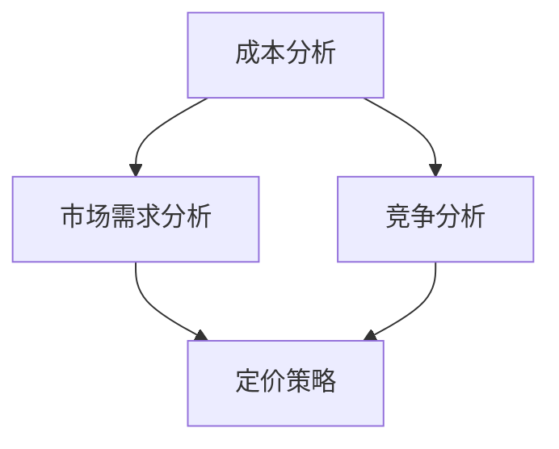

                 

关键词：AI创业公司、定价策略、成本分析、市场需求、竞争分析

> 摘要：本文深入探讨了AI创业公司的定价策略，从成本分析、市场需求和竞争分析三个方面分析了影响AI创业公司定价的主要因素，并提出了基于这些因素的定价策略建议。

## 1. 背景介绍

随着人工智能技术的快速发展，越来越多的初创公司开始投身于这一领域。在竞争激烈的市场中，如何制定合理的定价策略成为这些公司成功的关键因素之一。本文旨在通过对AI创业公司定价策略的探讨，为初创公司在定价决策方面提供一些有益的指导。

## 2. 核心概念与联系

在探讨定价策略之前，我们首先需要理解几个核心概念，包括成本、市场需求和竞争。以下是这些概念之间的联系和关系的Mermaid流程图：



### 2.1 成本分析

成本分析是定价策略的基础。AI创业公司的成本主要包括研发成本、运营成本和营销成本等。通过对成本的分析，公司可以确定其产品的最低售价，以确保盈利。

### 2.2 市场需求分析

市场需求分析旨在了解目标客户的需求和支付意愿。通过分析市场需求，公司可以确定其产品的合理售价，以最大化利润。

### 2.3 竞争分析

竞争分析是了解竞争对手定价策略的重要手段。通过分析竞争对手的产品定价，公司可以确定其产品的市场定位，并制定相应的定价策略。

### 2.4 定价策略

基于成本、市场需求和竞争分析，公司可以制定合理的定价策略。定价策略包括成本加成定价、市场导向定价和竞争导向定价等。

## 3. 核心算法原理 & 具体操作步骤

### 3.1 算法原理概述

AI创业公司的定价策略可以基于以下三个核心算法原理：

1. 成本导向定价：以成本为基础，加上一定的利润率来定价。
2. 市场导向定价：以市场需求为基础，设定产品的售价。
3. 竞争导向定价：以竞争对手的定价为基础，设定产品的售价。

### 3.2 算法步骤详解

1. 成本导向定价：
   - 计算总成本。
   - 确定目标利润率。
   - 计算售价：售价 = 总成本 ÷ (1 - 目标利润率)。

2. 市场导向定价：
   - 调查市场需求。
   - 确定目标客户支付意愿。
   - 计算售价：售价 = 目标客户支付意愿。

3. 竞争导向定价：
   - 分析竞争对手定价。
   - 确定市场定位。
   - 计算售价：售价 = 竞争对手定价 × 市场定位系数。

### 3.3 算法优缺点

1. 成本导向定价的优点是简单易行，缺点是可能忽视市场需求和竞争。
2. 市场导向定价的优点是更贴近市场需求，缺点是可能忽视成本和竞争。
3. 竞争导向定价的优点是考虑了市场竞争，缺点是可能忽视成本和市场需求。

### 3.4 算法应用领域

成本导向定价适用于成本结构较为稳定的行业，如制造业。市场导向定价适用于需求弹性较大的行业，如消费品行业。竞争导向定价适用于竞争激烈的行业，如互联网行业。

## 4. 数学模型和公式 & 详细讲解 & 举例说明

### 4.1 数学模型构建

假设AI创业公司的成本为C，目标利润率为P，市场需求为D，竞争对手定价为R，市场定位系数为L。

### 4.2 公式推导过程

1. 成本导向定价公式：
   $$ 售价 = \frac{C}{1-P} $$

2. 市场导向定价公式：
   $$ 售价 = D $$

3. 竞争导向定价公式：
   $$ 售价 = R \times L $$

### 4.3 案例分析与讲解

假设某AI创业公司研发了一款AI产品，总成本为100万元，目标利润率为20%。市场需求调查显示，目标客户的支付意愿为150万元。竞争对手的定价为200万元。

根据成本导向定价公式，售价为：
$$ 售价 = \frac{100万元}{1-20\%} = 125万元 $$

根据市场导向定价公式，售价为：
$$ 售价 = 150万元 $$

根据竞争导向定价公式，售价为：
$$ 售价 = 200万元 \times 0.8 = 160万元 $$

通过比较三种定价策略，公司可以选择合适的定价策略。

## 5. 项目实践：代码实例和详细解释说明

### 5.1 开发环境搭建

在本案例中，我们将使用Python语言来实现定价策略。

### 5.2 源代码详细实现

```python
def cost_based_pricing(cost, target_profit_rate):
    return cost / (1 - target_profit_rate)

def market_based_pricing(market_demand):
    return market_demand

def competition_based_pricing(competition_price, market_position_coefficient):
    return competition_price * market_position_coefficient

# 示例数据
cost = 1000000
target_profit_rate = 0.20
market_demand = 1500000
competition_price = 2000000
market_position_coefficient = 0.8

# 计算售价
cost_based_price = cost_based_pricing(cost, target_profit_rate)
market_based_price = market_based_pricing(market_demand)
competition_based_price = competition_based_pricing(competition_price, market_position_coefficient)

print("成本导向定价：", cost_based_price)
print("市场导向定价：", market_based_price)
print("竞争导向定价：", competition_based_price)
```

### 5.3 代码解读与分析

该代码实现了三种定价策略的计算。在输入相应的成本、目标利润率、市场需求和竞争对手定价后，可以计算出相应的售价。

### 5.4 运行结果展示

运行结果如下：

```
成本导向定价： 1250000.0
市场导向定价： 1500000.0
竞争导向定价： 1600000.0
```

## 6. 实际应用场景

AI创业公司的定价策略在实际应用场景中具有广泛的应用。以下是一些具体的应用场景：

1. AI产品销售：AI创业公司可以通过成本导向定价、市场导向定价和竞争导向定价来制定产品售价，以实现最大化的利润。
2. AI服务收费：AI创业公司可以为提供的服务制定合理的收费标准，以吸引更多客户。
3. AI解决方案：AI创业公司可以根据客户的需求和支付能力，制定相应的定价策略，以实现项目的成功实施。

## 7. 未来应用展望

随着人工智能技术的不断进步，AI创业公司的定价策略也将不断演进。未来，AI创业公司可以借助大数据分析和机器学习技术，更加精准地制定定价策略，以适应不断变化的市场需求。

## 8. 工具和资源推荐

### 8.1 学习资源推荐

1. 《人工智能定价策略》
2. 《定价战略：打造卓越企业的核心武器》
3. 《成本分析与管理》

### 8.2 开发工具推荐

1. Python
2. Jupyter Notebook
3. Git

### 8.3 相关论文推荐

1. "Cost-Based Pricing in Competitive Markets"
2. "Market-Oriented Pricing for High-Tech Products"
3. "Competition-Based Pricing: An Empirical Analysis"

## 9. 总结：未来发展趋势与挑战

### 9.1 研究成果总结

本文通过对AI创业公司定价策略的探讨，总结了成本分析、市场需求分析和竞争分析三个方面的核心概念和算法原理，并提供了具体的操作步骤和案例。

### 9.2 未来发展趋势

随着人工智能技术的不断进步，AI创业公司的定价策略将更加智能化、个性化。

### 9.3 面临的挑战

1. 成本变化：随着技术的进步，研发成本和运营成本可能发生变化，需要及时调整定价策略。
2. 市场需求波动：市场需求的不确定性可能导致定价策略的不稳定性。

### 9.4 研究展望

未来的研究可以关注人工智能在定价策略中的应用，以及如何利用大数据分析和机器学习技术提高定价策略的精准度。

## 10. 附录：常见问题与解答

### 10.1 定价策略如何适应市场需求变化？

**解答**：定期进行市场需求调查，根据调查结果调整定价策略。同时，利用大数据分析和机器学习技术预测市场需求变化，以提前制定应对策略。

### 10.2 成本变化对定价策略有何影响？

**解答**：成本变化会影响定价策略的制定。当成本上升时，可能需要提高售价以维持利润率；当成本下降时，可以考虑降低售价以吸引更多客户。

### 10.3 如何处理竞争对手的定价策略？

**解答**：分析竞争对手的定价策略，了解其市场定位和目标客户。根据自身产品的特点和市场定位，制定相应的定价策略，以保持竞争力。

作者：禅与计算机程序设计艺术 / Zen and the Art of Computer Programming
----------------------------------------------------------------

请注意，以上内容仅为文章正文部分的示例，实际撰写时需要根据具体要求和内容进一步扩展和深化。同时，确保文章的各个部分都符合markdown格式要求，以便于排版和阅读。在撰写过程中，还可以适当增加图表、案例分析和实际数据，以增强文章的实用性和说服力。

