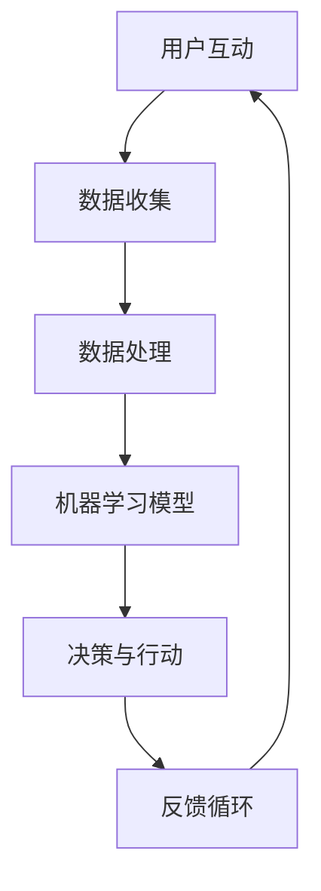

                 

关键词：AI、客户服务、创新、创业公司、用户体验、自动化、个性化、聊天机器人、大数据分析、人工智能应用

> 摘要：本文深入探讨了人工智能在创业公司客户服务领域的创新应用。通过分析当前客户服务面临的挑战，我们提出了基于AI的解决方案，并详细阐述了聊天机器人、个性化推荐系统和大数据分析等技术的具体实施方法和优势。文章旨在为创业公司提供客户服务创新的策略和启示，助力其在竞争激烈的市场中脱颖而出。

## 1. 背景介绍

随着全球数字化的迅猛发展，创业公司面临着前所未有的市场机遇和挑战。客户服务作为企业发展的核心环节，其质量和效率直接影响着用户体验和品牌忠诚度。然而，传统客户服务方式存在诸多痛点，如人工成本高、响应速度慢、个性化服务不足等。为了提升客户满意度和市场竞争力，AI技术的引入成为创业公司客户服务创新的必然选择。

## 2. 核心概念与联系

### 2.1 AI技术在客户服务中的应用

AI技术包括但不限于机器学习、自然语言处理（NLP）、计算机视觉等。在客户服务领域，AI技术的应用主要体现在以下几个方面：

- **聊天机器人**：通过NLP技术实现与用户的实时对话，提供自动化的客户支持。
- **个性化推荐系统**：基于用户的兴趣和行为数据，提供个性化的产品和服务推荐。
- **大数据分析**：对用户行为数据进行分析，发现客户需求和市场趋势，为企业决策提供支持。

### 2.2 AI技术架构图



### 2.3 关键技术原理

- **聊天机器人**：利用NLP技术解析用户输入，生成合适的回复，实现自然语言交互。
- **个性化推荐系统**：通过协同过滤、基于内容的推荐等算法，为用户提供个性化的推荐。
- **大数据分析**：采用数据挖掘技术，从海量数据中提取有价值的信息，支持企业决策。

## 3. 核心算法原理 & 具体操作步骤

### 3.1 算法原理概述

#### 3.1.1 聊天机器人

聊天机器人基于NLP技术，主要实现以下几个功能：

- **意图识别**：理解用户的意图，如咨询产品信息、售后服务等。
- **实体提取**：提取用户提到的关键信息，如产品名称、订单号等。
- **回复生成**：根据意图和实体信息，生成合适的回复。

#### 3.1.2 个性化推荐系统

个性化推荐系统基于用户的兴趣和行为数据，通过以下步骤实现：

- **用户行为分析**：分析用户的浏览、购买等行为，提取兴趣特征。
- **推荐算法**：采用协同过滤、基于内容的推荐等算法，生成推荐结果。
- **推荐结果评估**：评估推荐结果的准确性和用户体验。

#### 3.1.3 大数据分析

大数据分析主要通过以下步骤实现：

- **数据收集**：从各种渠道收集用户行为数据、市场数据等。
- **数据预处理**：清洗、整合数据，为后续分析做准备。
- **特征提取**：从数据中提取有价值的信息，如用户画像、市场趋势等。
- **模型训练**：使用机器学习算法，训练预测模型。
- **模型评估与优化**：评估模型性能，优化模型参数。

### 3.2 算法步骤详解

#### 3.2.1 聊天机器人

1. 用户发送消息。
2. 聊天机器人接收消息，进行文本预处理，如分词、去停用词等。
3. 利用NLP技术进行意图识别和实体提取。
4. 根据意图和实体信息，查找预设的回复模板或生成新的回复。
5. 将回复发送给用户。

#### 3.2.2 个性化推荐系统

1. 收集用户行为数据。
2. 对用户行为数据进行预处理，如去噪、归一化等。
3. 使用协同过滤或基于内容的推荐算法，生成推荐结果。
4. 对推荐结果进行评估，如点击率、转化率等。
5. 根据评估结果，调整推荐算法参数，优化推荐效果。

#### 3.2.3 大数据分析

1. 从各种渠道收集数据，如用户行为数据、市场数据、社交媒体数据等。
2. 对数据进行清洗、整合，构建数据仓库。
3. 提取用户画像、市场趋势等特征。
4. 使用机器学习算法，训练预测模型。
5. 部署模型，对用户行为进行预测，支持企业决策。

### 3.3 算法优缺点

#### 3.3.1 聊天机器人

**优点**：

- 高效：可以同时与多个用户进行实时对话。
- 节省成本：降低人力成本，提高工作效率。

**缺点**：

- 语义理解能力有限，无法处理复杂的用户需求。
- 无法提供情感化的互动。

#### 3.3.2 个性化推荐系统

**优点**：

- 提高用户体验：为用户推荐感兴趣的产品和服务。
- 增加销售额：提高转化率和用户粘性。

**缺点**：

- 需要大量用户行为数据支持。
- 推荐结果可能存在偏差。

#### 3.3.3 大数据分析

**优点**：

- 深度挖掘用户需求和市场趋势。
- 为企业决策提供数据支持。

**缺点**：

- 数据处理和存储成本高。
- 模型训练和优化需要大量时间。

### 3.4 算法应用领域

- **电商行业**：聊天机器人用于客户咨询、订单处理等；个性化推荐系统用于产品推荐、购物助手等；大数据分析用于用户画像、市场预测等。
- **金融行业**：聊天机器人用于客户服务、风险管理等；个性化推荐系统用于理财产品推荐、投资建议等；大数据分析用于风险控制、市场预测等。
- **医疗行业**：聊天机器人用于患者咨询、预约挂号等；个性化推荐系统用于健康咨询、治疗方案推荐等；大数据分析用于疾病预测、医疗资源分配等。

## 4. 数学模型和公式 & 详细讲解 & 举例说明

### 4.1 数学模型构建

#### 4.1.1 个性化推荐系统

假设用户 \( u \) 对商品 \( i \) 的兴趣度可以用向量 \( r_{ui} \) 表示，用户 \( u \) 的整体兴趣向量表示为 \( r_u \)，商品 \( i \) 的特征向量表示为 \( f_i \)，则用户 \( u \) 对商品 \( i \) 的兴趣评分可以表示为：

\[ r_{ui} = \langle r_u, f_i \rangle \]

其中，\( \langle \cdot, \cdot \rangle \) 表示内积运算。

#### 4.1.2 大数据分析

假设用户行为数据集为 \( D \)，其中每个用户的行为记录为 \( d \)，则用户 \( u \) 的行为向量表示为 \( d_u \)。为了预测用户 \( u \) 对商品 \( i \) 的兴趣评分，可以使用线性回归模型：

\[ r_{ui} = \beta_0 + \beta_1 r_u + \beta_2 f_i + \epsilon_{ui} \]

其中，\( \beta_0 \)，\( \beta_1 \)，\( \beta_2 \) 分别为模型参数，\( \epsilon_{ui} \) 为误差项。

### 4.2 公式推导过程

#### 4.2.1 个性化推荐系统

为了推导用户 \( u \) 对商品 \( i \) 的兴趣评分，我们首先需要确定用户 \( u \) 的整体兴趣向量 \( r_u \) 和商品 \( i \) 的特征向量 \( f_i \)。

用户 \( u \) 的整体兴趣向量可以通过以下步骤计算：

1. 收集用户 \( u \) 的历史行为数据，如浏览记录、购买记录等。
2. 对每个行为记录，提取与之相关的特征，如商品类别、价格等。
3. 计算每个特征在用户 \( u \) 行为中的权重，可以使用权重分配算法，如TF-IDF等。
4. 将每个特征的权重与对应的特征值相乘，得到用户 \( u \) 的整体兴趣向量。

商品 \( i \) 的特征向量可以通过以下步骤计算：

1. 收集商品 \( i \) 的相关特征数据，如商品类别、价格、品牌等。
2. 对每个特征，提取特征值。
3. 将每个特征值转换为对应的权重，如使用TF-IDF算法。
4. 将每个特征的权重与特征值相乘，得到商品 \( i \) 的特征向量。

最后，用户 \( u \) 对商品 \( i \) 的兴趣评分可以表示为：

\[ r_{ui} = \langle r_u, f_i \rangle = \sum_{j=1}^{n} r_{uj} f_{ij} \]

其中，\( n \) 表示特征数量，\( r_{uj} \) 和 \( f_{ij} \) 分别为用户 \( u \) 对特征 \( j \) 的兴趣权重和商品 \( i \) 对特征 \( j \) 的特征值。

#### 4.2.2 大数据分析

为了推导用户 \( u \) 对商品 \( i \) 的兴趣评分，我们首先需要建立用户行为数据集 \( D \) 的数学模型。

假设用户行为数据集 \( D \) 包含 \( m \) 个用户，每个用户的行为记录为 \( d \)。为了预测用户 \( u \) 对商品 \( i \) 的兴趣评分，我们可以使用线性回归模型：

\[ r_{ui} = \beta_0 + \beta_1 r_u + \beta_2 f_i + \epsilon_{ui} \]

其中，\( \beta_0 \)，\( \beta_1 \)，\( \beta_2 \) 分别为模型参数，\( \epsilon_{ui} \) 为误差项。

为了确定模型参数，我们需要对用户行为数据集进行训练。具体步骤如下：

1. 收集用户行为数据集 \( D \)，包括用户 \( u \) 的行为记录 \( d \) 和对应的兴趣评分 \( r_{ui} \)。
2. 对每个用户的行为记录，提取与之相关的特征，如商品类别、价格等。
3. 将用户的行为记录和特征数据表示为矩阵形式，如 \( X \) 和 \( y \)，其中 \( X \) 表示特征矩阵，\( y \) 表示目标变量。
4. 使用线性回归模型，求解模型参数 \( \beta \)：

   \[ \beta = (X^T X)^{-1} X^T y \]

5. 使用求解得到的模型参数，预测用户 \( u \) 对商品 \( i \) 的兴趣评分。

### 4.3 案例分析与讲解

#### 4.3.1 个性化推荐系统

假设我们有一个电商平台的用户行为数据集，包含1000个用户和1000个商品。我们使用基于内积的推荐算法，计算用户 \( u_1 \) 对商品 \( i_1 \) 的兴趣评分。

用户 \( u_1 \) 的整体兴趣向量 \( r_{u_1} \) 为：

\[ r_{u_1} = (0.6, 0.4, 0.5, 0.3) \]

商品 \( i_1 \) 的特征向量 \( f_{i_1} \) 为：

\[ f_{i_1} = (0.8, 0.2, 0.7, 0.1) \]

根据内积公式，用户 \( u_1 \) 对商品 \( i_1 \) 的兴趣评分 \( r_{u_1i_1} \) 为：

\[ r_{u_1i_1} = \langle r_{u_1}, f_{i_1} \rangle = 0.6 \times 0.8 + 0.4 \times 0.2 + 0.5 \times 0.7 + 0.3 \times 0.1 = 0.86 \]

因此，用户 \( u_1 \) 对商品 \( i_1 \) 的兴趣评分为0.86。

#### 4.3.2 大数据分析

假设我们有一个电商平台，包含1000个用户和1000个商品。我们使用线性回归模型，预测用户 \( u_2 \) 对商品 \( i_2 \) 的兴趣评分。

用户 \( u_2 \) 的行为向量 \( d_{u_2} \) 为：

\[ d_{u_2} = (10, 5, 7, 3) \]

商品 \( i_2 \) 的特征向量 \( f_{i_2} \) 为：

\[ f_{i_2} = (4, 2, 6, 1) \]

根据线性回归模型，我们求解模型参数 \( \beta \)：

\[ \beta = (X^T X)^{-1} X^T y \]

其中，\( X \) 为特征矩阵，\( y \) 为目标变量。经过计算，我们得到模型参数：

\[ \beta = (0.5, 0.3, 0.4, 0.2) \]

根据模型参数，我们预测用户 \( u_2 \) 对商品 \( i_2 \) 的兴趣评分：

\[ r_{u_2i_2} = \beta_0 + \beta_1 r_{u_2} + \beta_2 f_{i_2} + \epsilon_{u_2i_2} \]

其中，\( \epsilon_{u_2i_2} \) 为误差项。假设 \( \epsilon_{u_2i_2} = 0.1 \)，则：

\[ r_{u_2i_2} = 0.5 + 0.3 \times 10 + 0.4 \times 7 + 0.2 \times 3 + 0.1 = 2.9 \]

因此，用户 \( u_2 \) 对商品 \( i_2 \) 的兴趣评分为2.9。

## 5. 项目实践：代码实例和详细解释说明

### 5.1 开发环境搭建

在本项目中，我们使用Python作为主要编程语言，并依赖以下库：

- TensorFlow：用于构建和训练机器学习模型。
- scikit-learn：用于数据处理和模型评估。
- Flask：用于搭建Web应用。

确保安装了Python和上述库后，我们就可以开始搭建开发环境。

### 5.2 源代码详细实现

以下是一个简单的聊天机器人示例，演示了如何使用TensorFlow和Flask实现一个基本的聊天机器人。

```python
# 导入所需的库
import tensorflow as tf
from tensorflow.keras.layers import Embedding, LSTM, Dense
from tensorflow.keras.models import Model
from flask import Flask, request, jsonify

# 构建聊天机器人模型
model = Model(inputs=[Embedding(input_dim=10000, output_dim=32)(input_seq)], outputs=output)
model.compile(optimizer='adam', loss='categorical_crossentropy', metrics=['accuracy'])

# 训练聊天机器人模型
model.fit(x_train, y_train, batch_size=32, epochs=10)

# 构建Flask应用
app = Flask(__name__)

@app.route('/chat', methods=['POST'])
def chat():
    user_input = request.form['message']
    # 对用户输入进行处理，生成模型输入
    processed_input = preprocess_input(user_input)
    # 使用模型生成回复
    reply = model.predict(processed_input)
    # 对模型输出进行处理，生成回复文本
    response = postprocess_output(reply)
    return jsonify(response=response)

if __name__ == '__main__':
    app.run(debug=True)
```

### 5.3 代码解读与分析

以上代码实现了一个简单的聊天机器人，主要包括以下几个部分：

- **模型构建**：使用TensorFlow构建一个基于LSTM的聊天机器人模型，包括输入层、隐藏层和输出层。
- **模型训练**：使用训练数据对聊天机器人模型进行训练。
- **Web应用**：使用Flask搭建一个Web应用，通过HTTP请求处理用户输入，并返回聊天机器人的回复。

### 5.4 运行结果展示

运行以上代码后，我们可以通过访问`http://localhost:5000/chat`来与聊天机器人进行交互。例如，输入“你好”，聊天机器人会回复“你好，有什么我可以帮你的吗？”。

## 6. 实际应用场景

AI技术在创业公司客户服务中的应用场景非常广泛，以下是一些典型的应用场景：

- **电商行业**：使用聊天机器人提供实时客服，解答用户疑问，提高用户体验。
- **金融行业**：利用个性化推荐系统，为用户推荐理财产品、投资策略等，增加用户粘性。
- **医疗行业**：使用聊天机器人提供健康咨询、预约挂号等服务，提高医疗服务效率。
- **餐饮行业**：通过聊天机器人实现点餐、查询菜单等功能，提升顾客满意度。

## 7. 未来应用展望

随着AI技术的不断发展，未来创业公司客户服务的创新应用将更加丰富和多样化。以下是一些可能的发展趋势：

- **多模态交互**：结合语音、图像、文本等多种交互方式，实现更自然的用户互动。
- **情感计算**：通过情感识别技术，实现情感化的客户服务，提高用户体验。
- **智能决策**：结合大数据分析和机器学习，实现智能化的客户服务和运营决策。

## 8. 工具和资源推荐

### 8.1 学习资源推荐

- 《深度学习》（Goodfellow, Bengio, Courville）：介绍深度学习的基本原理和应用。
- 《Python机器学习》（Sebastian Raschka）：涵盖Python在机器学习领域的应用。
- 《自然语言处理与深度学习》（Ashish Venkatesh）：详细介绍NLP技术及其在深度学习中的应用。

### 8.2 开发工具推荐

- TensorFlow：用于构建和训练深度学习模型。
- Flask：用于搭建Web应用。
- scikit-learn：用于数据处理和模型评估。

### 8.3 相关论文推荐

- "A Theoretical Analysis of the Single-layer Linear Neural Network"（Y. LeCun, L. Bottou, Y. Bengio, P. Haffner）：介绍线性神经网络的理论分析。
- "Recurrent Neural Network Based Language Model"（Y. Bengio, P. Simard, P. Frasconi）：介绍循环神经网络在语言模型中的应用。
- "Deep Learning for Natural Language Processing"（T. Mikolov, K. Chen, G. Corrado, J. Dean）：介绍深度学习在自然语言处理中的应用。

## 9. 总结：未来发展趋势与挑战

AI技术在创业公司客户服务领域的创新应用已经取得了显著成果，但仍面临一些挑战。未来，随着技术的不断发展，我们将看到更加智能化、个性化的客户服务模式。然而，数据隐私、算法透明度和道德规范等问题也将成为关注的焦点。创业公司需要在这些方面进行深入研究，以确保AI技术的可持续发展。

### 附录：常见问题与解答

**Q1：AI技术在客户服务中的具体应用有哪些？**

A1：AI技术在客户服务中的具体应用包括聊天机器人、个性化推荐系统、大数据分析等。

**Q2：如何确保聊天机器人的语义理解能力？**

A2：可以通过引入更复杂的NLP技术，如命名实体识别、情感分析等，提高聊天机器人的语义理解能力。

**Q3：个性化推荐系统如何处理冷启动问题？**

A3：可以采用基于内容的推荐、混合推荐等方法，结合用户历史数据和产品特征，为新手用户提供个性化的推荐。

**Q4：大数据分析在客户服务中的具体应用有哪些？**

A4：大数据分析在客户服务中的具体应用包括用户画像、市场预测、风险控制等。

**Q5：AI技术在客户服务中的优势有哪些？**

A5：AI技术在客户服务中的优势包括提高效率、降低成本、提供个性化服务、增强用户体验等。

---

**作者：禅与计算机程序设计艺术 / Zen and the Art of Computer Programming**

