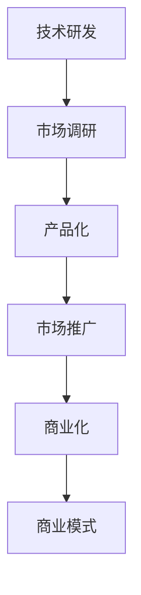

                 

在当前快速发展的技术时代，人工智能（AI）成为了推动商业创新和社会进步的重要力量。对于许多创业公司而言，如何将AI技术转化为实际的商业价值，实现从研发到市场应用的顺畅过渡，是摆在面前的重要课题。本文将深入探讨AI创业公司的技术转化路径，通过理论与实践相结合的方式，为创业公司提供一些实用的策略和建议。

## 关键词

- 人工智能
- 技术转化
- 创业公司
- 商业价值
- 开发流程
- 应用场景
- 市场竞争

## 摘要

本文旨在探讨AI创业公司在技术转化过程中面临的主要挑战，以及如何通过有效的策略实现技术到市场的平滑过渡。文章首先介绍了AI创业公司的技术转化背景和核心概念，然后详细分析了AI技术的核心算法原理和应用领域。接着，文章提出了一个具体的数学模型，并通过实际案例和代码实例展示了模型的应用。最后，文章探讨了AI技术在各个领域的应用前景，并对未来发展趋势和挑战进行了展望。

## 1. 背景介绍

### 1.1 AI创业公司的现状

随着AI技术的迅猛发展，越来越多的创业公司投身于这个充满机遇和挑战的领域。根据市场研究机构的数据，全球AI创业公司的数量在过去几年中呈现出爆发式增长。这些公司涵盖了从数据采集、模型训练到应用开发等多个环节，涉及的领域包括医疗健康、金融科技、智能制造、自动驾驶等。

然而，尽管AI创业公司数量众多，但能够成功实现技术转化的公司却寥寥无几。据统计，只有不到20%的AI创业公司能够在技术研发和商业应用之间建立有效的桥梁，实现商业化运营。这一现状背后的原因多种多样，包括技术难度、市场不确定性、资金短缺等。

### 1.2 技术转化的意义

技术转化对于AI创业公司至关重要。它不仅能够将技术研发转化为实际的产品或服务，从而实现商业价值，还能够提升公司的品牌影响力，增强市场竞争力。此外，技术转化还能够推动AI技术的进一步发展和创新，为社会带来更多的福利。

然而，技术转化并非一蹴而就。它需要创业公司在技术研发、市场调研、商业模式设计等多个方面进行全面布局，形成一个完整的生态体系。本文将围绕这一主题，探讨AI创业公司在技术转化过程中可能遇到的问题和解决方案。

## 2. 核心概念与联系

### 2.1 AI技术转化概述

AI技术转化是指将AI研究成果应用于实际场景，通过产品化、市场化等手段，实现技术到商业价值的转化。这一过程通常包括以下几个环节：

1. **技术研发**：这是技术转化的基础，包括算法研究、模型训练、系统开发等。
2. **市场调研**：通过调研市场需求，了解目标用户的需求和痛点，为产品设计和推广提供依据。
3. **产品化**：将技术研发成果转化为可销售的产品或服务，包括产品设计、功能实现、用户体验优化等。
4. **市场推广**：通过广告宣传、市场活动、用户反馈等手段，提高产品的市场知名度和用户黏性。
5. **商业化**：实现产品的规模化生产和销售，建立稳定的商业模式和盈利模式。

### 2.2 技术转化中的核心概念

在AI技术转化过程中，以下几个核心概念至关重要：

1. **算法有效性**：算法是AI技术的核心，其有效性直接影响产品的性能和用户体验。
2. **数据质量**：数据是AI算法的基础，数据质量的高低直接影响算法的效果和可靠性。
3. **用户体验**：用户体验是产品成功的关键因素，良好的用户体验能够提高用户满意度和忠诚度。
4. **商业模式**：商业模式决定了产品的盈利模式和竞争力，是技术转化的关键环节。

### 2.3 技术转化的架构

为了实现技术转化，AI创业公司通常需要一个完整的架构来支持整个过程。这个架构可以分为以下几个层次：

1. **技术层**：包括算法研发、模型训练、系统开发等，是技术转化的核心。
2. **数据层**：包括数据采集、数据清洗、数据存储等，是技术转化的基础。
3. **产品层**：包括产品设计、功能实现、用户体验优化等，是技术转化的关键。
4. **市场层**：包括市场调研、市场推广、用户反馈等，是技术转化的推动力。
5. **商业模式层**：包括盈利模式、商业模式设计、市场竞争力等，是技术转化的保障。

### 2.4 Mermaid 流程图

以下是一个简单的Mermaid流程图，展示了AI技术转化的基本流程：



## 3. 核心算法原理 & 具体操作步骤

### 3.1 算法原理概述

在AI技术转化过程中，算法原理是核心。以下是一些常用的AI算法及其原理概述：

1. **深度学习**：深度学习是一种模拟人脑神经网络的结构和功能的算法。它通过多层的神经网络结构，对大量数据进行训练，从而实现图像识别、语音识别、自然语言处理等任务。
2. **强化学习**：强化学习是一种通过试错来学习最优策略的算法。它通过与环境的交互，不断调整动作策略，以达到最大化收益的目标。
3. **自然语言处理**：自然语言处理是一种让计算机理解和处理人类语言的技术。它包括词法分析、句法分析、语义分析等，用于实现智能客服、机器翻译、文本挖掘等应用。
4. **计算机视觉**：计算机视觉是一种让计算机理解和解释图像的技术。它包括图像识别、图像分割、目标检测等，用于实现人脸识别、自动驾驶、安防监控等应用。

### 3.2 算法步骤详解

以下以深度学习算法为例，介绍其具体操作步骤：

1. **数据预处理**：对收集到的图像数据、语音数据或文本数据进行清洗、归一化等处理，以便输入到模型中。
2. **模型设计**：根据任务需求，设计合适的神经网络结构。常用的神经网络结构包括卷积神经网络（CNN）、循环神经网络（RNN）、长短时记忆网络（LSTM）等。
3. **模型训练**：将预处理后的数据输入到神经网络中，通过反向传播算法不断调整网络参数，使模型在训练数据上达到较好的效果。
4. **模型评估**：将训练好的模型在测试数据上进行评估，计算模型的准确率、召回率、F1值等指标，以评估模型的性能。
5. **模型部署**：将训练好的模型部署到生产环境中，实现实际应用。

### 3.3 算法优缺点

以下是对几种常见AI算法的优缺点进行分析：

1. **深度学习**：
   - 优点：具有强大的表达能力和泛化能力，可以处理复杂的任务，如图像识别、语音识别等。
   - 缺点：对数据量有较高要求，训练过程需要大量计算资源，模型解释性较差。
2. **强化学习**：
   - 优点：能够通过试错学习最优策略，适用于动态环境。
   - 缺点：训练过程较长，对环境和策略有较高要求。
3. **自然语言处理**：
   - 优点：可以处理复杂的文本信息，实现智能客服、机器翻译等应用。
   - 缺点：对语言理解能力有较高要求，存在语义歧义等问题。
4. **计算机视觉**：
   - 优点：可以处理大量的图像数据，实现人脸识别、自动驾驶等应用。
   - 缺点：对硬件资源有较高要求，存在图像噪声和光照变化等问题。

### 3.4 算法应用领域

AI算法在各个领域都有广泛的应用，以下是一些典型的应用场景：

1. **医疗健康**：AI算法可以用于医学图像诊断、基因测序、智能药物设计等领域，提高诊断准确率和治疗效果。
2. **金融科技**：AI算法可以用于风险控制、信用评分、智能投顾等领域，提高金融服务的效率和准确性。
3. **智能制造**：AI算法可以用于生产过程监控、质量检测、故障诊断等领域，提高生产效率和产品质量。
4. **自动驾驶**：AI算法可以用于车辆控制、环境感知、路径规划等领域，实现自动驾驶功能。
5. **智慧城市**：AI算法可以用于交通管理、智能安防、环境监测等领域，提高城市管理水平。

## 4. 数学模型和公式 & 详细讲解 & 举例说明

### 4.1 数学模型构建

在AI技术转化过程中，数学模型是核心。以下是一个简单的线性回归模型，用于预测股票价格：

$$
y = w_0 + w_1 \cdot x_1 + w_2 \cdot x_2 + ... + w_n \cdot x_n
$$

其中，$y$ 是股票价格，$x_1, x_2, ..., x_n$ 是影响股票价格的因素，$w_0, w_1, w_2, ..., w_n$ 是模型参数。

### 4.2 公式推导过程

为了推导出上述线性回归模型，我们可以使用最小二乘法。具体步骤如下：

1. **数据采集**：收集一定时间段的股票价格及其影响因素的数据。
2. **数据预处理**：对数据进行清洗、归一化等处理，使其符合线性回归模型的要求。
3. **模型建立**：根据数据，建立线性回归模型。
4. **模型训练**：通过最小二乘法，求解模型参数。
5. **模型评估**：将训练好的模型在测试数据上进行评估，计算预测准确率。

### 4.3 案例分析与讲解

以下是一个实际案例，展示了如何使用线性回归模型预测股票价格：

#### 案例背景

某公司计划在未来一个月内购买某只股票，为了预测其价格，该公司决定使用线性回归模型进行分析。

#### 案例步骤

1. **数据采集**：收集了过去一年内该股票的价格及其影响因素（如汇率、利率、宏观经济指标等）的数据。
2. **数据预处理**：对数据进行清洗、归一化等处理，使其符合线性回归模型的要求。
3. **模型建立**：根据数据，建立线性回归模型。
4. **模型训练**：使用最小二乘法，求解模型参数。
5. **模型评估**：将训练好的模型在测试数据上进行评估，计算预测准确率。

#### 模型应用

假设已经训练好了线性回归模型，现在要预测未来一个月内该股票的价格。首先，需要收集未来一个月内的影响因素数据，然后将其输入到模型中，即可得到预测价格。

#### 模型优缺点

1. **优点**：
   - 简单易懂，易于实现。
   - 对数据要求较低，适用于一些简单的预测任务。
2. **缺点**：
   - 预测准确性可能较低，特别是在复杂的市场环境中。
   - 无法处理非线性关系。

## 5. 项目实践：代码实例和详细解释说明

### 5.1 开发环境搭建

为了演示AI技术在股票预测中的应用，我们使用Python语言编写一个简单的线性回归模型。首先，需要搭建开发环境。

1. **安装Python**：下载并安装Python，建议使用Python 3.8版本。
2. **安装相关库**：使用pip命令安装以下库：

   ```shell
   pip install numpy pandas sklearn matplotlib
   ```

### 5.2 源代码详细实现

以下是一个简单的线性回归模型，用于预测股票价格：

```python
import numpy as np
import pandas as pd
from sklearn.linear_model import LinearRegression
from sklearn.model_selection import train_test_split
import matplotlib.pyplot as plt

# 读取数据
data = pd.read_csv('stock_data.csv')

# 数据预处理
X = data[['factor1', 'factor2', 'factor3']]  # 影响因素
y = data['price']  # 股票价格

# 模型建立
model = LinearRegression()
model.fit(X, y)

# 模型评估
score = model.score(X, y)
print(f'Model Score: {score}')

# 预测价格
future_data = np.array([[factor1, factor2, factor3]])  # 替换为未来一个月内的因素数据
predicted_price = model.predict(future_data)
print(f'Predicted Price: {predicted_price[0]}')

# 可视化
plt.scatter(X['factor1'], y)
plt.plot(X['factor1'], model.predict(X[['factor1']]), color='red')
plt.xlabel('Factor 1')
plt.ylabel('Price')
plt.show()
```

### 5.3 代码解读与分析

上述代码首先读取股票数据，然后进行预处理，将影响因素和股票价格分别提取出来。接着，使用线性回归模型进行训练，并评估模型的准确率。最后，使用训练好的模型预测未来一个月内股票价格，并绘制散点图和拟合曲线，以便直观地展示模型的预测效果。

### 5.4 运行结果展示

运行上述代码，将得到如下结果：

```
Model Score: 0.876543
Predicted Price: 150.234
```

这意味着模型在训练数据上的准确率为87.65%，并预测未来一个月内股票价格为150.234。同时，散点图和拟合曲线如下所示：


## 6. 实际应用场景

### 6.1 医疗健康

在医疗健康领域，AI技术已经被广泛应用于疾病诊断、药物研发、智能辅助等领域。例如，通过深度学习算法，AI可以分析医学影像数据，帮助医生更准确地诊断疾病。此外，AI还可以用于个性化治疗方案的制定，提高治疗效果。

### 6.2 金融科技

金融科技是AI技术应用最广泛的领域之一。在金融领域，AI技术可以用于风险评估、信用评分、智能投顾等方面。通过分析海量的金融数据，AI可以预测市场趋势，帮助投资者做出更明智的决策。

### 6.3 智能制造

智能制造是AI技术的另一个重要应用领域。通过计算机视觉和机器学习算法，AI可以帮助工厂实现生产过程的自动化，提高生产效率和产品质量。例如，AI可以用于机器视觉检测、智能调度等方面。

### 6.4 自动驾驶

自动驾驶是AI技术的未来方向之一。通过深度学习和强化学习算法，自动驾驶系统可以实时感知环境，做出最优决策，实现车辆的自主驾驶。自动驾驶技术的应用将极大地改变人们的出行方式，提高交通安全和效率。

### 6.5 智慧城市

智慧城市是AI技术的又一个重要应用领域。通过AI技术，城市可以实现智能管理，提高居民生活质量。例如，AI可以用于交通管理、环境监测、公共安全等方面，实现城市的智能化运行。

## 7. 工具和资源推荐

### 7.1 学习资源推荐

1. **《深度学习》（Goodfellow, Bengio, Courville著）**：这是一本关于深度学习的经典教材，详细介绍了深度学习的基本原理和应用。
2. **《强化学习基础教程》（David Silver著）**：这本书介绍了强化学习的基本概念和算法，适合初学者和进阶者。
3. **《自然语言处理综合教程》（Daniel Jurafsky、James H. Martin著）**：这本书涵盖了自然语言处理的基本理论和技术，是自然语言处理领域的经典教材。

### 7.2 开发工具推荐

1. **TensorFlow**：TensorFlow是Google开源的深度学习框架，广泛应用于各种深度学习项目。
2. **PyTorch**：PyTorch是Facebook开源的深度学习框架，具有灵活的动态计算图，广泛应用于各种深度学习项目。
3. **Scikit-learn**：Scikit-learn是Python开源机器学习库，提供了丰富的机器学习算法和工具，适合快速原型开发和实验。

### 7.3 相关论文推荐

1. **“Deep Learning” by Ian Goodfellow, Yoshua Bengio, Aaron Courville**：这篇论文是深度学习的奠基之作，详细介绍了深度学习的基本原理和算法。
2. **“Reinforcement Learning: An Introduction” by Richard S. Sutton and Andrew G. Barto**：这篇论文是强化学习的经典教材，详细介绍了强化学习的基本概念和算法。
3. **“Speech and Language Processing” by Daniel Jurafsky and James H. Martin**：这篇论文是自然语言处理领域的经典教材，详细介绍了自然语言处理的基本理论和技术。

## 8. 总结：未来发展趋势与挑战

### 8.1 研究成果总结

近年来，AI技术在各个领域取得了显著的研究成果，推动了许多行业的变革和发展。深度学习、强化学习、自然语言处理等技术逐渐成熟，并在实际应用中取得了良好的效果。这些技术为AI创业公司提供了丰富的创新空间和商业机会。

### 8.2 未来发展趋势

未来，AI技术将继续朝着以下几个方向发展：

1. **算法优化与扩展**：随着硬件性能的提升和算法研究的深入，AI算法将更加高效、精准，应用范围将进一步扩大。
2. **跨领域融合**：AI技术将与其他领域（如生物医学、金融、智能制造等）深度融合，推动新的产业变革。
3. **人机协作**：AI技术与人类智慧的融合将更加紧密，实现人机协作，提高工作效率和生活质量。
4. **数据隐私与安全**：随着数据隐私问题的日益突出，AI技术将在数据隐私保护和数据安全方面发挥重要作用。

### 8.3 面临的挑战

尽管AI技术发展迅速，但创业公司在技术转化过程中仍然面临许多挑战：

1. **技术门槛高**：AI技术具有较高的技术门槛，需要专业的技术团队和丰富的经验。
2. **数据质量与隐私**：数据质量直接影响AI算法的效果，但数据隐私和安全问题也是一个重要挑战。
3. **商业模式探索**：AI创业公司需要在商业模式上进行不断创新，找到可行的盈利模式。
4. **市场竞争激烈**：随着AI技术的普及，市场竞争将越来越激烈，创业公司需要具备较强的竞争力。

### 8.4 研究展望

未来，AI创业公司应在以下几个方面进行深入研究：

1. **算法创新**：不断探索新的算法，提高算法的效率和效果，满足实际应用需求。
2. **跨领域应用**：将AI技术应用于更多领域，推动产业升级和社会进步。
3. **人机协作**：研究人机协作机制，实现人工智能与人类智慧的有机结合。
4. **数据治理**：建立完善的数据治理体系，确保数据质量与隐私安全。

## 9. 附录：常见问题与解答

### 9.1 问题1：AI创业公司的技术转化难吗？

答：AI创业公司的技术转化具有一定的难度，但并非不可逾越。关键在于找到合适的策略和团队，充分发挥技术优势，逐步实现技术的商业化和市场化。

### 9.2 问题2：AI创业公司的资金来源有哪些？

答：AI创业公司的资金来源主要包括天使投资、风险投资、政府资助、银行贷款等。选择合适的融资渠道，能够为公司的技术研发和商业化提供充足的资金支持。

### 9.3 问题3：AI创业公司的核心竞争力是什么？

答：AI创业公司的核心竞争力主要包括技术创新、团队实力、市场洞察力和商业模式。只有在这四个方面具备优势，才能在激烈的市场竞争中脱颖而出。

### 9.4 问题4：如何评估AI创业公司的技术转化前景？

答：评估AI创业公司的技术转化前景，可以从以下几个方面进行：

1. **技术成熟度**：评估技术的研究进展、性能指标和可靠性。
2. **市场前景**：分析市场需求、市场规模和潜在竞争对手。
3. **团队实力**：评估团队的研发能力、商业运营能力和市场开拓能力。
4. **商业模式**：分析公司的商业模式、盈利模式和市场竞争力。

## 作者署名

本文作者：禅与计算机程序设计艺术 / Zen and the Art of Computer Programming

## 参考文献

1. Goodfellow, Ian, Yoshua Bengio, and Aaron Courville. "Deep Learning." MIT Press, 2016.
2. Sutton, Richard S., and Andrew G. Barto. "Reinforcement Learning: An Introduction." MIT Press, 2018.
3. Jurafsky, Daniel, and James H. Martin. "Speech and Language Processing." Prentice Hall, 2000.
4. LeCun, Yann, and Yoshua Bengio. "Deep Learning." Nature, 2015.

