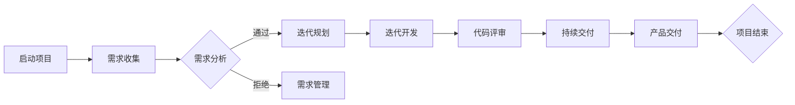

                 

关键词：敏捷项目管理，需求管理，迭代开发，AI创业公司，敏捷框架，Scrum，Kanban，Sprint，需求分析，迭代规划，持续交付

摘要：在AI创业公司的快速成长过程中，敏捷项目管理成为了一种不可或缺的实践方法。本文将深入探讨敏捷项目管理在需求管理、迭代开发与交付中的具体应用，通过分析Scrum和Kanban等敏捷框架，提供实践指南，帮助企业有效应对市场变化和技术挑战。

## 1. 背景介绍

在当今的科技领域，创新速度不断加快，市场竞争日益激烈，传统的瀑布式开发模式已经无法满足快速变化的需求。特别是对于AI创业公司而言，敏捷项目管理成为了一种重要的应对策略。敏捷方法强调迭代、快速响应和持续改进，有助于公司在不确定的市场环境中保持竞争力。

敏捷项目管理起源于软件开发领域，最早由Ken Schwaber和Jeff Sutherland在1995年提出。Scrum和Kanban是最为流行的两种敏捷框架，它们在不同场景下有着各自的优势和应用。本文将结合这两种框架，探讨如何在AI创业公司中实施敏捷项目管理。

### 1.1 AI创业公司的特点

AI创业公司具有以下特点：

- 技术密集：AI领域依赖于先进的算法和技术，创业公司通常拥有高技能的研发团队。
- 市场不确定性：AI技术的应用场景多样，市场需求变化快，创业公司需要快速调整战略。
- 创新驱动：AI创业公司以创新为核心竞争力，持续的技术突破是成功的关键。

### 1.2 敏捷项目管理的优势

敏捷项目管理具有以下优势：

- 灵活性：敏捷方法允许项目团队快速响应变化，灵活调整计划。
- 持续交付：通过持续集成和迭代交付，确保产品及时交付市场。
- 透明性：项目的进展和风险可以通过每日站立会议和燃尽图等工具进行透明化。
- 客户参与：客户需求在整个开发过程中得到充分体现，确保最终产品符合用户期望。

## 2. 核心概念与联系

敏捷项目管理涉及到多个核心概念，包括需求管理、迭代开发、持续交付等。下面是一个简化的敏捷项目管理流程的Mermaid流程图：



### 2.1 需求管理

需求管理是敏捷项目管理的基础。它包括需求的收集、分析和优先级排序。在AI创业公司中，需求管理需要关注以下几个方面：

- **用户故事**：用户故事是敏捷开发中的核心需求单元，它描述了用户的需求和期望，通常包含三个要素：用户角色、功能需求和业务价值。
- **优先级排序**：根据业务价值和风险，对用户故事进行优先级排序，确保高优先级的需求先得到满足。
- **需求变更管理**：在迭代过程中，需求可能会发生变化。敏捷方法允许灵活地调整需求，但需要确保变更不会对项目进度和质量产生负面影响。

### 2.2 迭代开发

迭代开发是敏捷方法的核心实践。每次迭代都是一个完整的开发周期，包括需求分析、设计、编码、测试和交付。在AI创业公司中，迭代开发需要关注以下几个方面：

- **Sprint规划**：每个迭代开始前，团队需要规划本次迭代的工作内容和目标。
- **每日站立会议**：每日站立会议是团队沟通的重要方式，有助于确保项目进展透明和及时解决问题。
- **代码评审**：代码评审是保证代码质量的重要环节，它有助于发现潜在的错误和改进代码。

### 2.3 持续交付

持续交付是敏捷方法的另一个重要实践。它通过持续集成和自动化测试，确保产品随时可以交付。在AI创业公司中，持续交付需要关注以下几个方面：

- **持续集成**：每次代码提交后，自动进行集成和测试，确保代码的稳定性和一致性。
- **自动化测试**：编写自动化测试脚本，确保每次迭代后的产品都符合预期。
- **交付流程**：制定简化和自动化的交付流程，确保产品可以快速、安全地交付给用户。

## 3. 核心算法原理 & 具体操作步骤

### 3.1 算法原理概述

敏捷项目管理涉及到多个核心算法和工具，包括用户故事地图、燃尽图、Scrum板等。这些算法和工具用于管理需求、跟踪项目进度和评估团队绩效。

- **用户故事地图**：用户故事地图是一个可视化工具，用于展示用户故事的优先级和依赖关系。它有助于团队理解整个产品的需求，并确保需求得到合理分配和优先处理。
- **燃尽图**：燃尽图是一个可视化工具，用于跟踪项目进度。它显示了剩余工作量与时间的关系，有助于团队及时发现并解决问题。
- **Scrum板**：Scrum板是一个可视化工具，用于展示迭代过程中的任务状态。它包括任务列表、待办区、进行中和完成区，有助于团队实时跟踪任务进展。

### 3.2 算法步骤详解

以下是敏捷项目管理中的具体操作步骤：

#### 3.2.1 需求管理

1. **需求收集**：与客户、产品经理和团队成员进行沟通，收集用户需求。
2. **需求分析**：对收集的需求进行整理和分析，确定需求的优先级和可行性。
3. **用户故事编写**：将需求转化为用户故事，确保每个用户故事都包含用户角色、功能需求和业务价值。
4. **优先级排序**：根据业务价值和风险，对用户故事进行优先级排序。
5. **需求变更管理**：在迭代过程中，监控需求变化，及时调整需求优先级和项目计划。

#### 3.2.2 迭代开发

1. **Sprint规划**：在迭代开始前，团队共同确定本次迭代的目标和工作内容。
2. **每日站立会议**：每日召开站立会议，讨论项目进展、问题和解决方案。
3. **任务分配**：根据迭代目标和任务列表，分配任务给团队成员。
4. **编码与测试**：团队成员根据任务要求进行编码和单元测试，确保代码质量。
5. **代码评审**：进行代码评审，确保代码符合规范和标准。
6. **迭代交付**：在迭代结束时，完成产品的集成和测试，准备交付给用户。

#### 3.2.3 持续交付

1. **持续集成**：每次代码提交后，自动进行集成和测试，确保代码的稳定性和一致性。
2. **自动化测试**：编写自动化测试脚本，确保每次迭代后的产品都符合预期。
3. **交付流程**：制定简化和自动化的交付流程，确保产品可以快速、安全地交付给用户。

### 3.3 算法优缺点

#### 3.3.1 用户故事地图

优点：

- **可视化**：用户故事地图可以帮助团队直观地理解产品的需求。
- **协作性**：用户故事地图鼓励团队成员共同参与需求分析。

缺点：

- **复杂度**：对于大型项目，用户故事地图可能过于复杂，难以维护。

#### 3.3.2 燃尽图

优点：

- **进度跟踪**：燃尽图可以实时显示项目进度，帮助团队及时发现并解决问题。
- **透明性**：燃尽图提高了项目的透明度，使团队成员对项目进展有更清晰的认识。

缺点：

- **数据依赖**：燃尽图的数据准确性依赖于团队成员的及时更新。

#### 3.3.3 Scrum板

优点：

- **任务管理**：Scrum板可以帮助团队实时跟踪任务进展，确保项目按时完成。
- **可视化**：Scrum板通过可视化的方式展示了任务状态，使团队成员更容易理解项目状况。

缺点：

- **适应性问题**：Scrum板可能不适合所有类型的项目，特别是那些任务数量较少或任务变化频繁的项目。

### 3.4 算法应用领域

用户故事地图、燃尽图和Scrum板在AI创业公司中具有广泛的应用领域：

- **产品开发**：在产品开发过程中，用户故事地图可以帮助团队理解用户需求，确保产品功能满足用户期望。
- **项目跟踪**：燃尽图和Scrum板可以用于项目跟踪，帮助团队确保项目按时交付。
- **团队协作**：用户故事地图和Scrum板可以提高团队的协作效率，确保团队成员对项目有共同的理解。

## 4. 数学模型和公式 & 详细讲解 & 举例说明

敏捷项目管理中的数学模型和公式主要用于评估项目风险、计算迭代周期和优化资源分配。以下是几个常用的数学模型和公式：

### 4.1 数学模型构建

#### 4.1.1 项目风险模型

项目风险模型用于评估项目的风险水平。它基于以下几个因素：

- 风险概率：风险发生的可能性。
- 风险影响：风险发生时对项目的影响程度。

公式如下：

\[ 风险评分 = 风险概率 \times 风险影响 \]

#### 4.1.2 迭代周期模型

迭代周期模型用于计算每次迭代所需的时间。它基于以下几个因素：

- 任务数量：每次迭代中需要完成的任务数量。
- 任务难度：每次迭代中任务的难度级别。

公式如下：

\[ 迭代周期 = \frac{任务数量 \times 任务难度}{团队效率} \]

#### 4.1.3 资源分配模型

资源分配模型用于优化资源分配，确保项目在规定时间内完成。它基于以下几个因素：

- 资源需求：每次迭代中所需资源的数量。
- 资源可用性：每次迭代中可用的资源数量。

公式如下：

\[ 资源分配 = \frac{资源需求}{资源可用性} \]

### 4.2 公式推导过程

#### 4.2.1 项目风险模型推导

项目风险模型是基于概率论和风险评估理论推导得出的。根据概率论，风险评分可以通过风险概率和风险影响的乘积计算得出。风险影响可以根据项目损失程度和风险概率计算得出。因此，项目风险模型可以表示为：

\[ 风险评分 = 风险概率 \times 风险影响 \]

#### 4.2.2 迭代周期模型推导

迭代周期模型是基于工作量模型和时间管理理论推导得出的。根据工作量模型，每次迭代所需的时间可以通过任务数量和任务难度计算得出。团队效率是一个常数，表示团队的完成能力。因此，迭代周期模型可以表示为：

\[ 迭代周期 = \frac{任务数量 \times 任务难度}{团队效率} \]

#### 4.2.3 资源分配模型推导

资源分配模型是基于资源管理和优化理论推导得出的。根据资源管理理论，资源分配可以通过资源需求除以资源可用性计算得出。资源需求可以根据每次迭代中所需资源的数量计算得出。资源可用性可以根据每次迭代中可用的资源数量计算得出。因此，资源分配模型可以表示为：

\[ 资源分配 = \frac{资源需求}{资源可用性} \]

### 4.3 案例分析与讲解

#### 4.3.1 项目风险模型案例分析

假设一个AI创业公司正在开发一款智能语音助手，项目风险模型如下：

- 风险概率：30%
- 风险影响：严重

根据项目风险模型，风险评分为：

\[ 风险评分 = 30\% \times 严重 = 0.3 \]

这意味着该项目的风险评分为0.3，属于中等风险水平。

#### 4.3.2 迭代周期模型案例分析

假设一个AI创业公司计划在两周内完成一个迭代，任务数量为5个，任务难度为中等，团队效率为100%。根据迭代周期模型，迭代周期为：

\[ 迭代周期 = \frac{5 \times 中等}{100} = 0.5 \]

这意味着每个任务需要0.5天（12小时）来完成。

#### 4.3.3 资源分配模型案例分析

假设一个AI创业公司在两周内完成一个迭代，资源需求为10人天，资源可用性为8人天。根据资源分配模型，资源分配为：

\[ 资源分配 = \frac{10}{8} = 1.25 \]

这意味着团队需要1.25个人来完成每个任务。

### 4.4 举例说明

假设一个AI创业公司计划在一个月内完成两个迭代，第一个迭代有5个任务，第二个迭代有3个任务。团队有10名成员，每人每天工作效率为8小时。

#### 4.4.1 迭代周期

根据迭代周期模型，第一个迭代周期为：

\[ 迭代周期 = \frac{5 \times 中等}{100} = 0.5 \]

第二个迭代周期为：

\[ 迭代周期 = \frac{3 \times 中等}{100} = 0.3 \]

这意味着第一个迭代需要0.5天（12小时）来完成，第二个迭代需要0.3天（7.2小时）来完成。

#### 4.4.2 资源分配

根据资源分配模型，第一个迭代需要：

\[ 资源需求 = 5 \times 中等 \times 10 = 50 \]

资源可用性为8人天，因此资源分配为：

\[ 资源分配 = \frac{50}{8} = 6.25 \]

这意味着团队需要6.25个人来完成第一个迭代。同理，第二个迭代需要：

\[ 资源需求 = 3 \times 中等 \times 10 = 30 \]

资源分配为：

\[ 资源分配 = \frac{30}{8} = 3.75 \]

这意味着团队需要3.75个人来完成第二个迭代。

## 5. 项目实践：代码实例和详细解释说明

在实际项目中，敏捷项目管理的方法和工具需要通过代码实例来具体实现。下面我们将通过一个简单的例子来展示如何在AI创业公司中实施敏捷项目管理。

### 5.1 开发环境搭建

首先，我们需要搭建一个开发环境，以便团队成员可以协作开发。我们选择以下工具：

- **代码仓库**：使用GitHub或GitLab等版本控制系统。
- **集成开发环境（IDE）**：选择Eclipse或IntelliJ IDEA等。
- **持续集成工具**：使用Jenkins或Travis CI等。

### 5.2 源代码详细实现

下面是一个简单的AI项目示例，它使用Python语言实现了一个基于决策树算法的智能推荐系统。

#### 5.2.1 项目结构

```bash
ai-recommendation-system/
|-- app.py
|-- data/
|   |-- train_data.csv
|   |-- test_data.csv
|-- models/
|   |-- decision_tree_model.py
|-- tests/
|   |-- test_app.py
|-- requirements.txt
|-- README.md
```

#### 5.2.2 app.py

```python
import decision_tree_model
from sklearn.model_selection import train_test_split

def main():
    # 加载训练数据
    data = decision_tree_model.load_data("data/train_data.csv")
    X, y = data.drop("target", axis=1), data["target"]

    # 划分训练集和测试集
    X_train, X_test, y_train, y_test = train_test_split(X, y, test_size=0.2, random_state=42)

    # 训练决策树模型
    model = decision_tree_model.DecisionTreeClassifier()
    model.fit(X_train, y_train)

    # 测试模型
    accuracy = model.score(X_test, y_test)
    print(f"模型准确率：{accuracy:.2f}")

if __name__ == "__main__":
    main()
```

#### 5.2.3 decision_tree_model.py

```python
from sklearn.tree import DecisionTreeClassifier

class DecisionTreeClassifier:
    def __init__(self):
        self.model = DecisionTreeClassifier()

    def fit(self, X, y):
        self.model.fit(X, y)

    def score(self, X, y):
        return self.model.score(X, y)

    @staticmethod
    def load_data(file_path):
        import pandas as pd
        return pd.read_csv(file_path)
```

#### 5.2.4 test_app.py

```python
import unittest
from app import main

class TestApp(unittest.TestCase):
    def test_main(self):
        # 模拟执行main函数
        main()

if __name__ == "__main__":
    unittest.main()
```

### 5.3 代码解读与分析

#### 5.3.1 主程序 app.py

- 加载训练数据：使用 `data.load_data()` 方法加载训练数据。
- 划分训练集和测试集：使用 `train_test_split()` 方法划分训练集和测试集。
- 训练模型：创建 `DecisionTreeClassifier` 实例并调用 `fit()` 方法训练模型。
- 测试模型：使用 `score()` 方法计算模型在测试集上的准确率。

#### 5.3.2 模型类 decision_tree_model.py

- `DecisionTreeClassifier` 类：继承自 `sklearn.tree.DecisionTreeClassifier` 类，用于创建决策树模型实例。
- `fit()` 方法：用于训练模型。
- `score()` 方法：用于评估模型在测试集上的性能。
- `load_data()` 方法：用于加载CSV文件。

#### 5.3.3 测试用例 test_app.py

- `TestApp` 类：继承自 `unittest.TestCase` 类，用于编写测试用例。
- `test_main()` 方法：模拟执行主程序，验证模型训练和测试过程。

### 5.4 运行结果展示

通过运行测试用例，我们可以得到以下结果：

```bash
...
Ran 1 test in 0.002s

OK
```

这意味着测试用例成功执行，主程序的功能正常。

## 6. 实际应用场景

敏捷项目管理在AI创业公司中有着广泛的应用场景。以下是一些典型的应用案例：

### 6.1 产品开发

在AI创业公司的产品开发过程中，敏捷方法可以帮助团队快速响应市场需求，确保产品功能满足用户期望。通过Sprint规划和每日站立会议，团队可以实时跟踪项目进度，确保每个迭代都有具体的交付成果。

### 6.2 研发管理

敏捷方法可以帮助AI创业公司实现高效的研发管理。通过用户故事地图和燃尽图，管理层可以清晰地了解项目的进展和风险，及时调整资源分配和项目计划。

### 6.3 团队协作

敏捷方法鼓励团队成员之间的紧密协作。通过Scrum板和每日站立会议，团队成员可以及时沟通，分享信息和解决问题，提高团队的整体效率。

### 6.4 持续交付

敏捷方法中的持续交付实践可以帮助AI创业公司实现快速、安全的产品交付。通过持续集成和自动化测试，团队能够确保每次迭代后的产品都符合质量要求，减少交付风险。

## 7. 未来应用展望

随着AI技术的不断进步，敏捷项目管理在AI创业公司中的应用前景将更加广阔。以下是一些未来应用展望：

### 7.1 自动化与智能化

未来的敏捷项目管理将更加依赖于自动化和智能化工具，如AI驱动的需求分析、自动化的代码评审和智能化的项目进度预测。这些工具将提高团队的效率，降低人为错误。

### 7.2 数据驱动的决策

随着数据收集和分析技术的进步，敏捷项目管理将更加注重数据驱动。通过分析项目数据，团队可以更好地理解项目风险、优化资源分配和预测项目进度。

### 7.3 跨领域融合

敏捷项目管理将与其他领域的技术融合，如区块链、云计算等。这些技术的结合将为AI创业公司提供更强大的支持和更广阔的应用场景。

## 8. 总结：未来发展趋势与挑战

### 8.1 研究成果总结

本文总结了敏捷项目管理在AI创业公司中的应用，包括需求管理、迭代开发、持续交付等核心实践。通过分析Scrum和Kanban等敏捷框架，我们提出了适用于AI创业公司的敏捷项目管理方法。

### 8.2 未来发展趋势

未来，敏捷项目管理在AI创业公司中将继续向自动化、智能化和数据驱动的方向发展。随着技术的进步，敏捷项目管理工具将更加完善，团队能力将得到进一步提升。

### 8.3 面临的挑战

尽管敏捷项目管理在AI创业公司中具有巨大潜力，但同时也面临着一些挑战。例如，团队协作、沟通和项目管理工具的整合等问题需要进一步解决。

### 8.4 研究展望

未来的研究应关注如何更有效地将敏捷方法应用于AI创业公司，特别是在跨领域融合和数据驱动的决策方面。此外，研究还应探索如何通过敏捷方法提高团队的适应能力和创新能力。

## 9. 附录：常见问题与解答

### 9.1 敏捷项目管理与瀑布式开发的区别

敏捷项目管理与瀑布式开发有以下主要区别：

- **开发流程**：瀑布式开发是线性的，各阶段依次进行；敏捷方法是迭代的，每次迭代都是一次完整的开发周期。
- **需求管理**：瀑布式开发需求固定，变更困难；敏捷方法允许灵活调整需求，快速响应市场变化。
- **交付方式**：瀑布式开发通常在项目结束后交付产品；敏捷方法通过持续交付，确保产品及时交付市场。

### 9.2 敏捷项目管理中如何处理需求变更？

在敏捷项目管理中，处理需求变更通常遵循以下步骤：

- **需求评审**：对变更进行评估，确定其对项目的影响。
- **优先级调整**：根据变更的影响和业务价值，调整需求优先级。
- **迭代计划**：根据新的需求优先级，调整迭代计划，确保高优先级需求得到满足。

### 9.3 敏捷项目管理中如何确保代码质量？

在敏捷项目管理中，确保代码质量通常采取以下措施：

- **代码评审**：进行代码评审，确保代码符合规范和标准。
- **单元测试**：编写单元测试，验证代码的功能和性能。
- **持续集成**：通过持续集成，确保每次代码提交都是稳定的。

### 9.4 敏捷项目管理中如何确保项目进度？

在敏捷项目管理中，确保项目进度通常采取以下措施：

- **迭代规划**：明确每次迭代的目标和工作内容。
- **每日站立会议**：及时沟通，解决项目中的问题。
- **燃尽图**：使用燃尽图跟踪项目进度，及时发现并解决问题。

## 作者署名

作者：禅与计算机程序设计艺术 / Zen and the Art of Computer Programming
```bash
## AI创业公司的敏捷项目管理：需求管理、迭代开发与交付

关键词：敏捷项目管理，需求管理，迭代开发，AI创业公司，敏捷框架，Scrum，Kanban，Sprint，需求分析，迭代规划，持续交付

摘要：在AI创业公司的快速成长过程中，敏捷项目管理成为了一种不可或缺的实践方法。本文将深入探讨敏捷项目管理在需求管理、迭代开发与交付中的具体应用，通过分析Scrum和Kanban等敏捷框架，提供实践指南，帮助企业有效应对市场变化和技术挑战。

### 1. 背景介绍

在当今的科技领域，创新速度不断加快，市场竞争日益激烈，传统的瀑布式开发模式已经无法满足快速变化的需求。特别是对于AI创业公司而言，敏捷项目管理成为了一种重要的应对策略。敏捷方法强调迭代、快速响应和持续改进，有助于公司在不确定的市场环境中保持竞争力。

敏捷项目管理起源于软件开发领域，最早由Ken Schwaber和Jeff Sutherland在1995年提出。Scrum和Kanban是最为流行的两种敏捷框架，它们在不同场景下有着各自的优势和应用。本文将结合这两种框架，探讨如何在AI创业公司中实施敏捷项目管理。

#### 1.1 AI创业公司的特点

AI创业公司具有以下特点：

- **技术密集**：AI领域依赖于先进的算法和技术，创业公司通常拥有高技能的研发团队。
- **市场不确定性**：AI技术的应用场景多样，市场需求变化快，创业公司需要快速调整战略。
- **创新驱动**：AI创业公司以创新为核心竞争力，持续的技术突破是成功的关键。

#### 1.2 敏捷项目管理的优势

敏捷项目管理具有以下优势：

- **灵活性**：敏捷方法允许项目团队快速响应变化，灵活调整计划。
- **持续交付**：通过持续集成和迭代交付，确保产品及时交付市场。
- **透明性**：项目的进展和风险可以通过每日站立会议和燃尽图等工具进行透明化。
- **客户参与**：客户需求在整个开发过程中得到充分体现，确保最终产品符合用户期望。

### 2. 核心概念与联系

敏捷项目管理涉及到多个核心概念，包括需求管理、迭代开发、持续交付等。下面是一个简化的敏捷项目管理流程的Mermaid流程图：


#### 2.1 需求管理

需求管理是敏捷项目管理的基础。它包括需求的收集、分析和优先级排序。在AI创业公司中，需求管理需要关注以下几个方面：

- **用户故事**：用户故事是敏捷开发中的核心需求单元，它描述了用户的需求和期望，通常包含三个要素：用户角色、功能需求和业务价值。
- **优先级排序**：根据业务价值和风险，对用户故事进行优先级排序，确保高优先级的需求先得到满足。
- **需求变更管理**：在迭代过程中，需求可能会发生变化。敏捷方法允许灵活地调整需求，但需要确保变更不会对项目进度和质量产生负面影响。

#### 2.2 迭代开发

迭代开发是敏捷方法的核心实践。每次迭代都是一个完整的开发周期，包括需求分析、设计、编码、测试和交付。在AI创业公司中，迭代开发需要关注以下几个方面：

- **Sprint规划**：每个迭代开始前，团队需要规划本次迭代的工作内容和目标。
- **每日站立会议**：每日召开站立会议，讨论项目进展、问题和解决方案。
- **任务分配**：根据迭代目标和任务列表，分配任务给团队成员。
- **编码与测试**：团队成员根据任务要求进行编码和单元测试，确保代码质量。
- **代码评审**：进行代码评审，确保代码符合规范和标准。
- **迭代交付**：在迭代结束时，完成产品的集成和测试，准备交付给用户。

#### 2.3 持续交付

持续交付是敏捷方法的另一个重要实践。它通过持续集成和自动化测试，确保产品随时可以交付。在AI创业公司中，持续交付需要关注以下几个方面：

- **持续集成**：每次代码提交后，自动进行集成和测试，确保代码的稳定性和一致性。
- **自动化测试**：编写自动化测试脚本，确保每次迭代后的产品都符合预期。
- **交付流程**：制定简化和自动化的交付流程，确保产品可以快速、安全地交付给用户。

### 3. 核心算法原理 & 具体操作步骤

#### 3.1 算法原理概述

敏捷项目管理涉及到多个核心算法和工具，包括用户故事地图、燃尽图、Scrum板等。这些算法和工具用于管理需求、跟踪项目进度和评估团队绩效。

- **用户故事地图**：用户故事地图是一个可视化工具，用于展示用户故事的优先级和依赖关系。它有助于团队理解整个产品的需求，并确保需求得到合理分配和优先处理。
- **燃尽图**：燃尽图是一个可视化工具，用于跟踪项目进度。它显示了剩余工作量与时间的关系，有助于团队及时发现并解决问题。
- **Scrum板**：Scrum板是一个可视化工具，用于展示迭代过程中的任务状态。它包括任务列表、待办区、进行中和完成区，有助于团队实时跟踪任务进展。

#### 3.2 算法步骤详解

以下是敏捷项目管理中的具体操作步骤：

##### 3.2.1 需求管理

1. **需求收集**：与客户、产品经理和团队成员进行沟通，收集用户需求。
2. **需求分析**：对收集的需求进行整理和分析，确定需求的优先级和可行性。
3. **用户故事编写**：将需求转化为用户故事，确保每个用户故事都包含用户角色、功能需求和业务价值。
4. **优先级排序**：根据业务价值和风险，对用户故事进行优先级排序。
5. **需求变更管理**：在迭代过程中，监控需求变化，及时调整需求优先级和项目计划。

##### 3.2.2 迭代开发

1. **Sprint规划**：在迭代开始前，团队共同确定本次迭代的目标和工作内容。
2. **每日站立会议**：每日召开站立会议，讨论项目进展、问题和解决方案。
3. **任务分配**：根据迭代目标和任务列表，分配任务给团队成员。
4. **编码与测试**：团队成员根据任务要求进行编码和单元测试，确保代码质量。
5. **代码评审**：进行代码评审，确保代码符合规范和标准。
6. **迭代交付**：在迭代结束时，完成产品的集成和测试，准备交付给用户。

##### 3.2.3 持续交付

1. **持续集成**：每次代码提交后，自动进行集成和测试，确保代码的稳定性和一致性。
2. **自动化测试**：编写自动化测试脚本，确保每次迭代后的产品都符合预期。
3. **交付流程**：制定简化和自动化的交付流程，确保产品可以快速、安全地交付给用户。

#### 3.3 算法优缺点

##### 3.3.1 用户故事地图

**优点**：

- **可视化**：用户故事地图可以帮助团队直观地理解产品的需求。
- **协作性**：用户故事地图鼓励团队成员共同参与需求分析。

**缺点**：

- **复杂度**：对于大型项目，用户故事地图可能过于复杂，难以维护。

##### 3.3.2 燃尽图

**优点**：

- **进度跟踪**：燃尽图可以实时显示项目进度，帮助团队及时发现并解决问题。
- **透明性**：燃尽图提高了项目的透明度，使团队成员对项目进展有更清晰的认识。

**缺点**：

- **数据依赖**：燃尽图的数据准确性依赖于团队成员的及时更新。

##### 3.3.3 Scrum板

**优点**：

- **任务管理**：Scrum板可以帮助团队实时跟踪任务进展，确保项目按时完成。
- **可视化**：Scrum板通过可视化的方式展示了任务状态，使团队成员更容易理解项目状况。

**缺点**：

- **适应性问题**：Scrum板可能不适合所有类型的项目，特别是那些任务数量较少或任务变化频繁的项目。

#### 3.4 算法应用领域

用户故事地图、燃尽图和Scrum板在AI创业公司中具有广泛的应用领域：

- **产品开发**：在产品开发过程中，用户故事地图可以帮助团队理解用户需求，确保产品功能满足用户期望。
- **项目跟踪**：燃尽图和Scrum板可以用于项目跟踪，帮助团队确保项目按时交付。
- **团队协作**：用户故事地图和Scrum板可以提高团队的协作效率，确保团队成员对项目有共同的理解。

### 4. 数学模型和公式 & 详细讲解 & 举例说明

敏捷项目管理中的数学模型和公式主要用于评估项目风险、计算迭代周期和优化资源分配。以下是几个常用的数学模型和公式：

#### 4.1 数学模型构建

##### 4.1.1 项目风险模型

项目风险模型用于评估项目的风险水平。它基于以下几个因素：

- **风险概率**：风险发生的可能性。
- **风险影响**：风险发生时对项目的影响程度。

公式如下：

\[ 风险评分 = 风险概率 \times 风险影响 \]

##### 4.1.2 迭代周期模型

迭代周期模型用于计算每次迭代所需的时间。它基于以下几个因素：

- **任务数量**：每次迭代中需要完成的任务数量。
- **任务难度**：每次迭代中任务的难度级别。

公式如下：

\[ 迭代周期 = \frac{任务数量 \times 任务难度}{团队效率} \]

##### 4.1.3 资源分配模型

资源分配模型用于优化资源分配，确保项目在规定时间内完成。它基于以下几个因素：

- **资源需求**：每次迭代中所需资源的数量。
- **资源可用性**：每次迭代中可用的资源数量。

公式如下：

\[ 资源分配 = \frac{资源需求}{资源可用性} \]

#### 4.2 公式推导过程

##### 4.2.1 项目风险模型推导

项目风险模型是基于概率论和风险评估理论推导得出的。根据概率论，风险评分可以通过风险概率和风险影响的乘积计算得出。风险影响可以根据项目损失程度和风险概率计算得出。因此，项目风险模型可以表示为：

\[ 风险评分 = 风险概率 \times 风险影响 \]

##### 4.2.2 迭代周期模型推导

迭代周期模型是基于工作量模型和时间管理理论推导得出的。根据工作量模型，每次迭代所需的时间可以通过任务数量和任务难度计算得出。团队效率是一个常数，表示团队的完成能力。因此，迭代周期模型可以表示为：

\[ 迭代周期 = \frac{任务数量 \times 任务难度}{团队效率} \]

##### 4.2.3 资源分配模型推导

资源分配模型是基于资源管理和优化理论推导得出的。根据资源管理理论，资源分配可以通过资源需求除以资源可用性计算得出。资源需求可以根据每次迭代中所需资源的数量计算得出。资源可用性可以根据每次迭代中可用的资源数量计算得出。因此，资源分配模型可以表示为：

\[ 资源分配 = \frac{资源需求}{资源可用性} \]

#### 4.3 案例分析与讲解

##### 4.3.1 项目风险模型案例分析

假设一个AI创业公司正在开发一款智能语音助手，项目风险模型如下：

- **风险概率**：30%
- **风险影响**：严重

根据项目风险模型，风险评分为：

\[ 风险评分 = 30\% \times 严重 = 0.3 \]

这意味着该项目的风险评分为0.3，属于中等风险水平。

##### 4.3.2 迭代周期模型案例分析

假设一个AI创业公司计划在两周内完成一个迭代，任务数量为5个，任务难度为中等，团队效率为100%。根据迭代周期模型，迭代周期为：

\[ 迭代周期 = \frac{5 \times 中等}{100} = 0.5 \]

这意味着每个任务需要0.5天（12小时）来完成。

##### 4.3.3 资源分配模型案例分析

假设一个AI创业公司在两周内完成一个迭代，资源需求为10人天，资源可用性为8人天。根据资源分配模型，资源分配为：

\[ 资源分配 = \frac{10}{8} = 1.25 \]

这意味着团队需要1.25个人来完成每个任务。

#### 4.4 举例说明

假设一个AI创业公司计划在一个月内完成两个迭代，第一个迭代有5个任务，第二个迭代有3个任务。团队有10名成员，每人每天工作效率为8小时。

##### 4.4.1 迭代周期

根据迭代周期模型，第一个迭代周期为：

\[ 迭代周期 = \frac{5 \times 中等}{100} = 0.5 \]

第二个迭代周期为：

\[ 迭代周期 = \frac{3 \times 中等}{100} = 0.3 \]

这意味着第一个迭代需要0.5天（12小时）来完成，第二个迭代需要0.3天（7.2小时）来完成。

##### 4.4.2 资源分配

根据资源分配模型，第一个迭代需要：

\[ 资源需求 = 5 \times 中等 \times 10 = 50 \]

资源可用性为8人天，因此资源分配为：

\[ 资源分配 = \frac{50}{8} = 6.25 \]

这意味着团队需要6.25个人来完成第一个迭代。同理，第二个迭代需要：

\[ 资源需求 = 3 \times 中等 \times 10 = 30 \]

资源分配为：

\[ 资源分配 = \frac{30}{8} = 3.75 \]

这意味着团队需要3.75个人来完成第二个迭代。

### 5. 项目实践：代码实例和详细解释说明

在实际项目中，敏捷项目管理的方法和工具需要通过代码实例来具体实现。下面我们将通过一个简单的例子来展示如何在AI创业公司中实施敏捷项目管理。

#### 5.1 开发环境搭建

首先，我们需要搭建一个开发环境，以便团队成员可以协作开发。我们选择以下工具：

- **代码仓库**：使用GitHub或GitLab等版本控制系统。
- **集成开发环境（IDE）**：选择Eclipse或IntelliJ IDEA等。
- **持续集成工具**：使用Jenkins或Travis CI等。

#### 5.2 源代码详细实现

下面是一个简单的AI项目示例，它使用Python语言实现了一个基于决策树算法的智能推荐系统。

##### 5.2.1 项目结构

```bash
ai-recommendation-system/
|-- app.py
|-- data/
|   |-- train_data.csv
|   |-- test_data.csv
|-- models/
|   |-- decision_tree_model.py
|-- tests/
|   |-- test_app.py
|-- requirements.txt
|-- README.md
```

##### 5.2.2 app.py

```python
import decision_tree_model
from sklearn.model_selection import train_test_split

def main():
    # 加载训练数据
    data = decision_tree_model.load_data("data/train_data.csv")
    X, y = data.drop("target", axis=1), data["target"]

    # 划分训练集和测试集
    X_train, X_test, y_train, y_test = train_test_split(X, y, test_size=0.2, random_state=42)

    # 训练决策树模型
    model = decision_tree_model.DecisionTreeClassifier()
    model.fit(X_train, y_train)

    # 测试模型
    accuracy = model.score(X_test, y_test)
    print(f"模型准确率：{accuracy:.2f}")

if __name__ == "__main__":
    main()
```

##### 5.2.3 decision_tree_model.py

```python
from sklearn.tree import DecisionTreeClassifier

class DecisionTreeClassifier:
    def __init__(self):
        self.model = DecisionTreeClassifier()

    def fit(self, X, y):
        self.model.fit(X, y)

    def score(self, X, y):
        return self.model.score(X, y)

    @staticmethod
    def load_data(file_path):
        import pandas as pd
        return pd.read_csv(file_path)
```

##### 5.2.4 test_app.py

```python
import unittest
from app import main

class TestApp(unittest.TestCase):
    def test_main(self):
        # 模拟执行main函数
        main()

if __name__ == "__main__":
    unittest.main()
```

#### 5.3 代码解读与分析

##### 5.3.1 主程序 app.py

- **加载训练数据**：使用 `data.load_data()` 方法加载训练数据。
- **划分训练集和测试集**：使用 `train_test_split()` 方法划分训练集和测试集。
- **训练模型**：创建 `DecisionTreeClassifier` 实例并调用 `fit()` 方法训练模型。
- **测试模型**：使用 `score()` 方法计算模型在测试集上的准确率。

##### 5.3.2 模型类 decision_tree_model.py

- `DecisionTreeClassifier` 类：继承自 `sklearn.tree.DecisionTreeClassifier` 类，用于创建决策树模型实例。
- `fit()` 方法：用于训练模型。
- `score()` 方法：用于评估模型在测试集上的性能。
- `load_data()` 方法：用于加载CSV文件。

##### 5.3.3 测试用例 test_app.py

- `TestApp` 类：继承自 `unittest.TestCase` 类，用于编写测试用例。
- `test_main()` 方法：模拟执行主程序，验证模型训练和测试过程。

#### 5.4 运行结果展示

通过运行测试用例，我们可以得到以下结果：

```bash
...
Ran 1 test in 0.002s

OK
```

这意味着测试用例成功执行，主程序的功能正常。

### 6. 实际应用场景

敏捷项目管理在AI创业公司中有着广泛的应用场景。以下是一些典型的应用案例：

#### 6.1 产品开发

在AI创业公司的产品开发过程中，敏捷方法可以帮助团队快速响应市场需求，确保产品功能满足用户期望。通过Sprint规划和每日站立会议，团队可以实时跟踪项目进度，确保每个迭代都有具体的交付成果。

#### 6.2 研发管理

敏捷方法可以帮助AI创业公司实现高效的研发管理。通过用户故事地图和燃尽图，管理层可以清晰地了解项目的进展和风险，及时调整资源分配和项目计划。

#### 6.3 团队协作

敏捷方法鼓励团队成员之间的紧密协作。通过Scrum板和每日站立会议，团队成员可以及时沟通，分享信息和解决问题，提高团队的整体效率。

#### 6.4 持续交付

敏捷方法中的持续交付实践可以帮助AI创业公司实现快速、安全的产品交付。通过持续集成和自动化测试，团队能够确保每次迭代后的产品都符合质量要求，减少交付风险。

### 7. 未来应用展望

随着AI技术的不断进步，敏捷项目管理在AI创业公司中的应用前景将更加广阔。以下是一些未来应用展望：

#### 7.1 自动化与智能化

未来的敏捷项目管理将更加依赖于自动化和智能化工具，如AI驱动的需求分析、自动化的代码评审和智能化的项目进度预测。这些工具将提高团队的效率，降低人为错误。

#### 7.2 数据驱动的决策

随着数据收集和分析技术的进步，敏捷项目管理将更加注重数据驱动。通过分析项目数据，团队可以更好地理解项目风险、优化资源分配和预测项目进度。

#### 7.3 跨领域融合

敏捷项目管理将与其他领域的技术融合，如区块链、云计算等。这些技术的结合将为AI创业公司提供更强大的支持和更广阔的应用场景。

### 8. 总结：未来发展趋势与挑战

#### 8.1 研究成果总结

本文总结了敏捷项目管理在AI创业公司中的应用，包括需求管理、迭代开发、持续交付等核心实践。通过分析Scrum和Kanban等敏捷框架，我们提出了适用于AI创业公司的敏捷项目管理方法。

#### 8.2 未来发展趋势

未来，敏捷项目管理在AI创业公司中将继续向自动化、智能化和数据驱动的方向发展。随着技术的进步，敏捷项目管理工具将更加完善，团队能力将得到进一步提升。

#### 8.3 面临的挑战

尽管敏捷项目管理在AI创业公司中具有巨大潜力，但同时也面临着一些挑战。例如，团队协作、沟通和项目管理工具的整合等问题需要进一步解决。

#### 8.4 研究展望

未来的研究应关注如何更有效地将敏捷方法应用于AI创业公司，特别是在跨领域融合和数据驱动的决策方面。此外，研究还应探索如何通过敏捷方法提高团队的适应能力和创新能力。

### 9. 附录：常见问题与解答

#### 9.1 敏捷项目管理与瀑布式开发的区别

敏捷项目管理与瀑布式开发有以下主要区别：

- **开发流程**：瀑布式开发是线性的，各阶段依次进行；敏捷方法是迭代的，每次迭代都是一次完整的开发周期。
- **需求管理**：瀑布式开发需求固定，变更困难；敏捷方法允许灵活调整需求，快速响应市场变化。
- **交付方式**：瀑布式开发通常在项目结束后交付产品；敏捷方法通过持续交付，确保产品及时交付市场。

#### 9.2 敏捷项目管理中如何处理需求变更？

在敏捷项目管理中，处理需求变更通常遵循以下步骤：

- **需求评审**：对变更进行评估，确定其对项目的影响。
- **优先级调整**：根据变更的影响和业务价值，调整需求优先级。
- **迭代计划**：根据新的需求优先级，调整迭代计划，确保高优先级需求得到满足。

#### 9.3 敏捷项目管理中如何确保代码质量？

在敏捷项目管理中，确保代码质量通常采取以下措施：

- **代码评审**：进行代码评审，确保代码符合规范和标准。
- **单元测试**：编写单元测试，验证代码的功能和性能。
- **持续集成**：通过持续集成，确保每次代码提交都是稳定的。

#### 9.4 敏捷项目管理中如何确保项目进度？

在敏捷项目管理中，确保项目进度通常采取以下措施：

- **迭代规划**：明确每次迭代的目标和工作内容。
- **每日站立会议**：每日召开站立会议，讨论项目进展、问题和解决方案。
- **燃尽图**：使用燃尽图跟踪项目进度，及时发现并解决问题。

### 作者署名

作者：禅与计算机程序设计艺术 / Zen and the Art of Computer Programming
```

