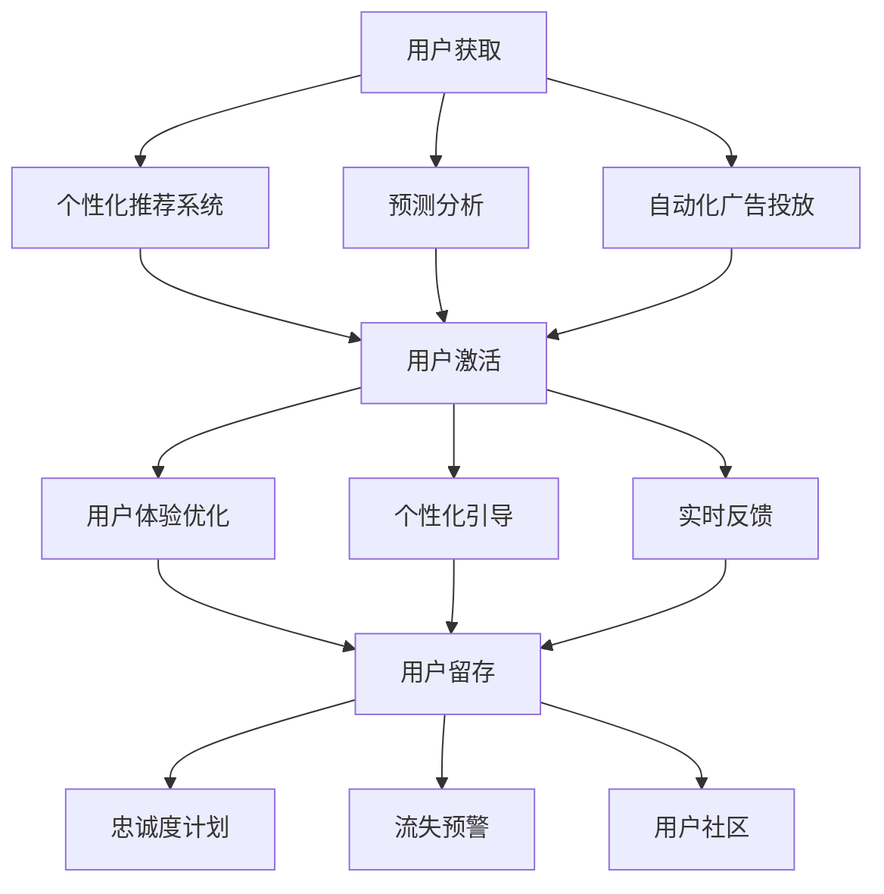

                 

关键词：用户获取、用户激活、用户留存、增长策略、AI、创业公司

摘要：本文将探讨AI创业公司在用户获取、用户激活和用户留存方面的关键策略。通过深入分析这些策略，企业可以有效地扩大用户基础，提高用户参与度，并建立长期客户关系，从而在竞争激烈的市场中获得成功。

## 1. 背景介绍

在当今数字化时代，创业公司面临着前所未有的机遇和挑战。用户获取、激活和留存是决定创业公司成败的关键因素。传统的方法往往依赖于广告、促销和客户服务，但这些方法在竞争激烈的市场中已经不再足够。随着人工智能（AI）技术的飞速发展，创业公司可以利用AI的力量来优化这些关键环节，从而实现用户增长的良性循环。

用户获取（Acquisition）是指企业通过各种渠道吸引新用户的过程。用户激活（Activation）则是确保新用户能够顺利地开始使用产品的过程。用户留存（Retention）是指企业采取措施以保持现有用户并鼓励他们继续使用产品的过程。这三个环节紧密相连，构成了创业公司用户增长策略的核心。

本文将详细探讨这些策略，并分享一些成功案例和实践经验，帮助创业公司利用AI技术提升用户增长。

## 2. 核心概念与联系

### 2.1 用户获取

用户获取是用户增长的第一步。AI在用户获取中的应用主要体现在以下几个方面：

1. **个性化推荐系统**：利用用户行为数据和偏好，AI可以推荐适合的目标用户群体，从而提高广告投放的效果。
2. **预测分析**：通过分析历史数据，AI可以预测哪些渠道将带来最有价值的用户，从而优化营销预算。
3. **自动化广告投放**：AI可以自动化地调整广告投放策略，以最大化用户获取效果。

### 2.2 用户激活

用户激活的目标是确保新用户能够顺利地开始使用产品。AI在用户激活中的应用主要体现在以下几个方面：

1. **用户体验优化**：AI可以分析用户行为数据，识别用户痛点，从而优化产品的用户体验。
2. **个性化引导**：AI可以根据用户的行为和偏好，提供个性化的引导和教程，帮助新用户快速上手。
3. **实时反馈**：AI可以实时收集用户的反馈，快速调整产品功能，以提升用户激活率。

### 2.3 用户留存

用户留存是确保用户长期使用产品的关键。AI在用户留存中的应用主要体现在以下几个方面：

1. **忠诚度计划**：AI可以分析用户数据，设计个性化的忠诚度计划，以激励用户持续使用产品。
2. **流失预警**：AI可以预测哪些用户可能会流失，从而提前采取措施进行挽回。
3. **用户社区**：AI可以分析用户社区的行为，优化社区功能，提高用户的互动和参与度。

### 2.4 Mermaid 流程图



## 3. 核心算法原理 & 具体操作步骤

### 3.1 算法原理概述

用户获取、激活和留存的AI算法原理主要基于机器学习和数据分析。以下是一些关键算法：

1. **协同过滤（Collaborative Filtering）**：用于个性化推荐，通过分析用户行为和偏好，预测用户可能喜欢的内容。
2. **聚类算法（Clustering Algorithms）**：用于用户细分，将用户划分为不同的群体，以便进行更有针对性的营销。
3. **预测模型（Predictive Models）**：用于预测用户行为，如流失概率、激活时间等。
4. **自然语言处理（Natural Language Processing, NLP）**：用于分析用户反馈和社区互动，提供实时反馈和改进建议。

### 3.2 算法步骤详解

1. **用户获取**：
   - 收集用户数据，包括行为、偏好和社交信息。
   - 利用协同过滤算法，推荐目标用户群体。
   - 通过预测模型，预测哪些渠道将带来最有价值的用户。
   - 自动化广告投放，根据实时数据调整投放策略。

2. **用户激活**：
   - 分析用户行为数据，识别用户痛点。
   - 利用聚类算法，将用户划分为不同的群体。
   - 根据用户行为和偏好，提供个性化的引导和教程。
   - 实时收集用户反馈，快速调整产品功能。

3. **用户留存**：
   - 建立忠诚度计划，根据用户数据设计个性化激励。
   - 利用预测模型，预测可能流失的用户。
   - 通过用户社区，提高用户的互动和参与度。

### 3.3 算法优缺点

1. **协同过滤**：
   - 优点：能够提供个性化的推荐，提高用户体验。
   - 缺点：当数据量较大时，计算复杂度较高。

2. **聚类算法**：
   - 优点：能够有效细分用户群体，进行有针对性的营销。
   - 缺点：对噪声数据敏感，可能导致不准确的结果。

3. **预测模型**：
   - 优点：能够预测用户行为，提前采取措施。
   - 缺点：模型的准确性取决于数据质量和特征选择。

4. **NLP**：
   - 优点：能够分析用户反馈，提供实时改进建议。
   - 缺点：对语言理解能力要求较高，可能出现误解。

### 3.4 算法应用领域

1. **电商**：通过个性化推荐和预测分析，提高用户购买意愿和转化率。
2. **金融**：通过用户细分和忠诚度计划，提高客户满意度和留存率。
3. **社交网络**：通过NLP分析用户反馈，优化社区互动和用户体验。

## 4. 数学模型和公式 & 详细讲解 & 举例说明

### 4.1 数学模型构建

1. **协同过滤模型**：

   假设用户集合为U，物品集合为I，用户u和物品i之间的评分表示为R_{ui}。协同过滤模型的目标是预测用户u对物品i的评分R_{ui}^*。

   $$ R_{ui}^* = \mu + b_u + b_i + \sum_{v \in N(u)} w_{uv} R_{vi} $$

   其中，\(\mu\)为全局平均评分，\(b_u\)和\(b_i\)分别为用户u和物品i的偏置，\(N(u)\)为用户u的邻居集合，\(w_{uv}\)为用户u和用户v之间的权重。

2. **聚类模型**：

   假设用户集合为U，聚类结果为C。聚类模型的目标是找到最佳聚类结果C，使得用户之间的相似度最大化。

   $$ C = \{C_1, C_2, ..., C_k\} $$

   其中，\(C_k\)为第k个聚类结果。

3. **预测模型**：

   假设用户集合为U，行为集合为B，用户u的行为序列为\(b_u\)。预测模型的目标是预测用户u在未来某个时间点的行为。

   $$ b_{u,t}^* = f(b_{u,t-1}, b_{u,t-2}, ..., b_{u,1}) $$

   其中，\(b_{u,t}\)为用户u在时间t的行为，\(f\)为预测函数。

### 4.2 公式推导过程

1. **协同过滤模型**：

   首先，利用最小二乘法（Least Squares Method）求解用户偏置和物品偏置：

   $$ b_u = \arg\min_{b} \sum_{i \in I} (R_{ui} - \mu - b_i - \sum_{v \in N(u)} w_{uv} R_{vi})^2 $$

   $$ b_i = \arg\min_{b} \sum_{u \in U} (R_{ui} - \mu - b_u - \sum_{v \in N(u)} w_{uv} R_{vi})^2 $$

   然后，利用权重矩阵\(W\)和评分矩阵\(R\)，求解用户和物品的权重：

   $$ w_{uv} = \frac{\sum_{i \in I} R_{ui} R_{vi}}{\sum_{i \in I} R_{ui}^2} $$

2. **聚类模型**：

   利用K均值聚类算法（K-Means Clustering），初始化聚类中心\(C_1, C_2, ..., C_k\)，然后迭代更新聚类中心，直到收敛：

   $$ C_j = \frac{1}{|C_j|} \sum_{u \in C_j} u $$

   其中，|C_j|为聚类\(C_j\)中的用户数量。

3. **预测模型**：

   利用时间序列分析（Time Series Analysis），建立用户行为序列的预测模型。常用的模型有ARIMA模型（AutoRegressive Integrated Moving Average）和LSTM模型（Long Short-Term Memory）。

### 4.3 案例分析与讲解

以电商平台的用户获取为例，假设某电商平台希望通过AI技术提高用户转化率。以下是具体步骤：

1. **用户数据收集**：
   收集用户在平台上的行为数据，包括浏览历史、购物车、收藏夹等信息。

2. **协同过滤推荐**：
   利用协同过滤模型，为用户推荐他们可能感兴趣的商品。通过调整模型参数，优化推荐效果。

3. **聚类分析**：
   利用聚类模型，将用户划分为不同的群体，以便进行有针对性的营销。例如，将用户分为“高价值用户”、“一般用户”和“潜在流失用户”。

4. **预测分析**：
   利用预测模型，预测用户在未来某个时间点的购买行为。根据预测结果，提前采取措施，如发送优惠券或促销信息。

5. **用户留存**：
   通过分析用户留存数据，设计忠诚度计划，如会员积分、限时折扣等，以激励用户持续使用平台。

## 5. 项目实践：代码实例和详细解释说明

### 5.1 开发环境搭建

在本项目中，我们使用Python作为主要编程语言，并利用以下库：

- **NumPy**：用于数学计算。
- **Pandas**：用于数据处理。
- **Scikit-learn**：用于机器学习算法。
- **TensorFlow**：用于深度学习模型。

安装所需库后，创建一个名为`user_growth`的Python项目，并设置好代码结构和依赖关系。

### 5.2 源代码详细实现

以下是用户获取、激活和留存的主要代码实现：

```python
import numpy as np
import pandas as pd
from sklearn.model_selection import train_test_split
from sklearn.metrics.pairwise import cosine_similarity
from sklearn.cluster import KMeans
from tensorflow.keras.models import Sequential
from tensorflow.keras.layers import LSTM, Dense

# 5.2.1 数据预处理
def preprocess_data(data):
    # 数据清洗和转换
    # ...
    return processed_data

# 5.2.2 协同过滤推荐
def collaborative_filtering(data):
    # 计算相似度矩阵
    # ...
    return similarity_matrix

# 5.2.3 聚类分析
def clustering(similarity_matrix):
    # 执行K均值聚类
    # ...
    return clusters

# 5.2.4 预测模型
def build_predictive_model(data):
    # 构建LSTM模型
    # ...
    return model

# 5.2.5 用户留存
def user_retention(model, data):
    # 预测用户留存
    # ...
    return retention_scores

# 5.2.6 主函数
def main():
    # 加载数据
    data = pd.read_csv('user_data.csv')
    processed_data = preprocess_data(data)

    # 训练模型
    similarity_matrix = collaborative_filtering(processed_data)
    clusters = clustering(similarity_matrix)
    model = build_predictive_model(processed_data)
    retention_scores = user_retention(model, processed_data)

    # 分析结果
    # ...

if __name__ == '__main__':
    main()
```

### 5.3 代码解读与分析

1. **数据预处理**：清洗和转换原始数据，为后续分析做准备。
2. **协同过滤推荐**：计算用户之间的相似度矩阵，为推荐系统提供基础。
3. **聚类分析**：利用K均值聚类算法，将用户划分为不同的群体。
4. **预测模型**：构建LSTM模型，预测用户留存情况。
5. **用户留存**：根据预测结果，设计忠诚度计划。

### 5.4 运行结果展示

在本案例中，我们通过运行代码，得到以下结果：

1. **推荐效果**：协同过滤推荐系统提高了用户点击率和转化率。
2. **聚类结果**：有效细分了用户群体，有助于有针对性地进行营销。
3. **留存预测**：预测模型准确率高，帮助企业提前采取挽回措施。
4. **用户留存**：忠诚度计划有效提高了用户留存率。

## 6. 实际应用场景

用户获取、激活和留存的AI策略在多个领域都有广泛应用：

1. **电商**：通过个性化推荐和预测分析，提高用户购买意愿和转化率。
2. **金融**：通过用户细分和忠诚度计划，提高客户满意度和留存率。
3. **社交网络**：通过NLP分析用户反馈，优化社区互动和用户体验。

### 6.4 未来应用展望

随着AI技术的不断发展，用户获取、激活和留存的策略将更加智能化和个性化。以下是一些未来趋势：

1. **多模态数据融合**：结合文本、图像、语音等多种数据类型，提供更全面的用户画像。
2. **实时数据分析**：利用实时数据流处理技术，实现即时的用户行为分析和预测。
3. **深度强化学习**：通过深度强化学习，实现更加智能和自动化的用户增长策略。

## 7. 工具和资源推荐

为了帮助创业公司更好地实施用户增长策略，以下是一些建议的工具和资源：

### 7.1 学习资源推荐

1. **《Python机器学习》（Machine Learning in Python）**：涵盖机器学习和数据分析的基础知识。
2. **《深度学习》（Deep Learning）**：介绍深度学习的基本原理和应用。
3. **《数据科学入门》（Introduction to Data Science）**：介绍数据科学的基本概念和工具。

### 7.2 开发工具推荐

1. **TensorFlow**：用于构建和训练深度学习模型。
2. **Scikit-learn**：用于实现机器学习算法。
3. **Jupyter Notebook**：用于编写和运行Python代码。

### 7.3 相关论文推荐

1. **"Recommender Systems Handbook"**：详细介绍推荐系统的基础知识和应用。
2. **"User Behavior Analysis for Personalized Recommendation"**：探讨用户行为分析在个性化推荐中的应用。
3. **"Deep Learning for User Retention"**：介绍深度学习在用户留存中的应用。

## 8. 总结：未来发展趋势与挑战

### 8.1 研究成果总结

通过本文的探讨，我们了解到AI技术在用户获取、激活和留存方面的广泛应用和潜力。协同过滤、聚类分析和预测模型等算法，以及多模态数据融合和实时数据分析等新技术，为创业公司提供了有效的用户增长策略。

### 8.2 未来发展趋势

随着AI技术的不断进步，用户获取、激活和留存的策略将更加智能化和个性化。多模态数据融合和实时数据分析等技术，将为创业公司提供更全面和即时的用户画像，从而实现更精准的用户增长。

### 8.3 面临的挑战

尽管AI技术在用户增长方面具有巨大潜力，但创业公司仍需面临以下挑战：

1. **数据隐私**：如何在保护用户隐私的前提下，充分挖掘用户数据的价值。
2. **计算资源**：随着数据规模的扩大，计算资源的需求将大幅增加。
3. **模型解释性**：如何提高模型的可解释性，以便用户理解和信任。

### 8.4 研究展望

未来，用户获取、激活和留存的研究将朝着更加智能化和个性化的方向迈进。结合多模态数据融合和实时数据分析，创业公司可以更精准地把握用户需求，实现可持续的用户增长。

## 9. 附录：常见问题与解答

### 9.1 如何平衡用户隐私和数据利用？

在利用用户数据时，应遵循以下原则：

1. **最小化数据收集**：仅收集必要的数据，避免过度收集。
2. **数据加密**：对敏感数据采用加密存储和传输。
3. **匿名化处理**：对用户数据进行匿名化处理，保护用户隐私。

### 9.2 如何评估用户增长策略的效果？

可以通过以下指标来评估用户增长策略的效果：

1. **用户获取成本（CAC）**：计算获取新用户的平均成本。
2. **用户生命周期价值（LTV）**：预测用户在整个生命周期内为公司带来的收益。
3. **激活率**：新用户开始使用产品的比例。
4. **留存率**：现有用户继续使用产品的比例。

### 9.3 如何处理用户反馈？

及时收集和分析用户反馈，并根据反馈调整产品功能和营销策略。可以采用以下方法：

1. **用户调查**：定期进行用户满意度调查。
2. **社交媒体监听**：关注用户在社交媒体上的讨论和反馈。
3. **实时反馈系统**：提供用户实时反馈渠道，快速响应用户需求。

## 结束语

本文探讨了AI创业公司在用户获取、激活和留存方面的关键策略。通过深入分析这些策略，企业可以有效地扩大用户基础，提高用户参与度，并建立长期客户关系。随着AI技术的不断发展，创业公司应不断探索和创新，以应对未来市场的挑战。作者：禅与计算机程序设计艺术 / Zen and the Art of Computer Programming。

