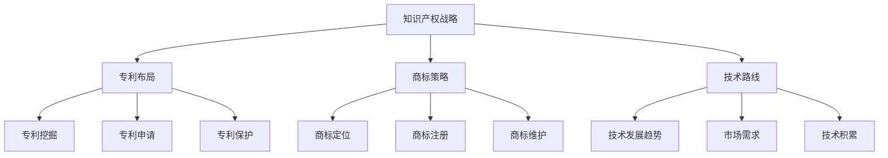

                 

关键词：知识产权战略，专利布局，商标策略，AI创业公司，技术路线

摘要：本文从AI创业公司的实际需求出发，详细探讨了知识产权战略规划中的专利布局、商标策略和技术路线。通过深入分析，本文提出了切实可行的策略，以帮助AI创业公司在激烈的市场竞争中脱颖而出，实现可持续发展。

## 1. 背景介绍

随着人工智能技术的飞速发展，AI创业公司如雨后春笋般涌现。然而，在快速发展的同时，知识产权问题日益凸显。知识产权，尤其是专利和商标，成为企业竞争中不可或缺的一部分。对于AI创业公司而言，如何制定有效的知识产权战略，进行专利布局、商标策略和技术路线的规划，成为企业成功的关键。

### 1.1 专利布局

专利布局是知识产权战略中至关重要的一环。合理的专利布局能够为企业提供强大的技术壁垒，防止竞争对手的模仿和抄袭。专利布局的核心在于专利的申请和保护。首先，企业需要明确自身的核心技术和创新点，进行专利挖掘和筛选。然后，根据企业的业务发展和市场布局，进行全球范围内的专利申请。此外，企业还需要关注竞争对手的专利动态，通过专利预警和专利跟踪，及时调整自身的专利布局策略。

### 1.2 商标策略

商标是企业品牌的重要组成部分。一个独特的商标能够帮助企业树立品牌形象，提升品牌价值。对于AI创业公司而言，商标策略的制定需要考虑品牌定位、市场竞争和法律法规等多方面因素。首先，企业需要明确自身的品牌定位，选择具有辨识度和独特性的商标。然后，企业需要在全球范围内进行商标注册，保护品牌权益。此外，企业还需要关注商标的维护和监控，及时发现和处理商标侵权行为。

### 1.3 技术路线

技术路线是企业发展的基础。一个清晰、合理的技术路线能够帮助企业明确发展方向，优化资源分配，提高研发效率。对于AI创业公司而言，技术路线的规划需要考虑技术发展趋势、市场需求和自身技术积累等多方面因素。首先，企业需要紧跟技术发展趋势，关注前沿技术的研究和应用。然后，企业需要根据市场需求，制定符合自身发展需求的技术路线。此外，企业还需要充分利用自身的技术积累，不断优化和提升技术能力。

## 2. 核心概念与联系

在探讨AI创业公司的知识产权战略规划时，我们需要了解一些核心概念和它们之间的联系。

### 2.1 知识产权

知识产权是指企业拥有的智力成果权利，包括专利、商标、版权等。知识产权是企业竞争力的体现，是企业可持续发展的基础。

### 2.2 专利

专利是一种具有独占性的知识产权，是企业技术创新的重要成果。专利包括发明专利、实用新型专利和外观设计专利等。

### 2.3 商标

商标是企业品牌的标志，是企业商业信誉的象征。商标包括文字商标、图形商标、组合商标等。

### 2.4 知识产权战略

知识产权战略是企业为实现长期发展目标，对知识产权进行系统管理和运用的策略。知识产权战略包括专利布局、商标策略、版权管理等内容。

### 2.5 技术路线

技术路线是企业发展的基础，是企业为实现技术目标而制定的发展规划。技术路线包括技术创新、技术引进、技术转化等内容。

下面是核心概念和架构的 Mermaid 流程图：



## 3. 核心算法原理 & 具体操作步骤

### 3.1 算法原理概述

AI创业公司的知识产权战略规划涉及多个方面，包括专利布局、商标策略和技术路线。这里，我们将详细介绍专利布局的核心算法原理和具体操作步骤。

### 3.2 算法步骤详解

#### 3.2.1 专利挖掘

专利挖掘是专利布局的第一步。它旨在从企业已有的技术成果中筛选出具有潜在价值的专利。专利挖掘的核心算法包括以下步骤：

1. **技术分析**：对企业已有的技术成果进行深入分析，明确技术的创新点和应用领域。

2. **文献调研**：通过检索国内外专利数据库，了解相关技术的专利申请情况，为后续的专利挖掘提供参考。

3. **筛选创新点**：根据技术分析结果和文献调研数据，筛选出具有创新性和市场价值的技术点。

4. **形成专利方案**：针对筛选出的创新点，形成初步的专利方案。

#### 3.2.2 专利申请

专利申请是专利布局的关键环节。它包括以下步骤：

1. **撰写专利申请文件**：根据专利方案，撰写专利申请文件，包括专利说明书、权利要求书等。

2. **专利申请提交**：将专利申请文件提交到相应的专利机构，如国家知识产权局。

3. **专利审查**：专利机构对专利申请进行审查，包括形式审查和实质审查。

4. **专利授权**：如果专利申请通过审查，将被授予专利权。

#### 3.2.3 专利保护

专利保护是专利布局的保障。它包括以下步骤：

1. **专利监控**：对已授权的专利进行监控，及时发现和处理专利侵权行为。

2. **专利维权**：如果发现专利侵权行为，采取相应的维权措施，如发出警告、提起诉讼等。

3. **专利预警**：通过监控竞争对手的专利申请情况，及时调整自身的专利布局策略。

### 3.3 算法优缺点

#### 优点：

1. **提高技术创新能力**：通过专利挖掘和申请，可以激励企业进行技术创新，提高技术竞争力。

2. **建立技术壁垒**：通过专利保护，可以防止竞争对手的模仿和抄袭，建立技术壁垒。

3. **提升品牌价值**：专利和商标是品牌的重要组成部分，可以有效提升企业品牌价值。

#### 缺点：

1. **专利申请成本高**：专利申请需要耗费大量的人力、物力和财力。

2. **专利维权难度大**：专利维权涉及法律程序，难度较大。

3. **专利侵权风险**：在激烈的市场竞争中，企业可能面临专利侵权风险。

### 3.4 算法应用领域

专利布局算法主要应用于以下领域：

1. **技术创新企业**：如互联网公司、科技公司等。

2. **高新技术企业**：如生物医药、新材料等领域。

3. **知识产权运营企业**：如知识产权代理机构、知识产权金融服务机构等。

## 4. 数学模型和公式 & 详细讲解 & 举例说明

### 4.1 数学模型构建

在知识产权战略规划中，我们可以使用数学模型来评估专利布局的效果。以下是一个简单的数学模型：

\[ \text{专利价值} = f(\text{专利数量}, \text{专利质量}, \text{市场需求}) \]

其中，专利数量、专利质量和市场需求是影响专利价值的三个关键因素。

### 4.2 公式推导过程

\[ \text{专利价值} = f(\text{专利数量}, \text{专利质量}, \text{市场需求}) \]

1. **专利数量**：专利数量是衡量企业技术创新能力的一个重要指标。假设每增加一个专利，专利价值增加1个单位。

\[ \text{专利价值} = \text{专利数量} \]

2. **专利质量**：专利质量是衡量专利技术创新水平的一个重要指标。假设专利质量越高，专利价值越高。我们使用一个质量系数 \( q \) 来衡量专利质量，单位为百分比。

\[ \text{专利价值} = \text{专利数量} \times q \]

3. **市场需求**：市场需求是衡量专利商业化潜力的重要指标。假设市场需求越高，专利价值越高。我们使用一个市场需求系数 \( m \) 来衡量市场需求，单位为百分比。

\[ \text{专利价值} = \text{专利数量} \times q \times m \]

### 4.3 案例分析与讲解

假设一家AI创业公司已经申请了10个专利，其中5个专利质量较高，市场需求也较高。根据上述数学模型，我们可以计算出该公司的专利价值：

\[ \text{专利价值} = 10 \times 0.5 \times 0.8 = 4 \]

这意味着，该公司的专利价值为4个单位。如果市场需求进一步提高，专利价值也会相应提高。

## 5. 项目实践：代码实例和详细解释说明

### 5.1 开发环境搭建

为了演示专利布局算法，我们选择Python作为编程语言。首先，我们需要安装Python环境和必要的库。

```bash
# 安装Python
$ apt-get install python3

# 安装必要的库
$ pip3 install numpy
```

### 5.2 源代码详细实现

下面是专利布局算法的Python代码实现：

```python
import numpy as np

def calculate_patent_value(patent_count, quality_coefficient, market_demand_coefficient):
    patent_value = patent_count * quality_coefficient * market_demand_coefficient
    return patent_value

# 参数设置
patent_count = 10
quality_coefficient = 0.5
market_demand_coefficient = 0.8

# 计算专利价值
patent_value = calculate_patent_value(patent_count, quality_coefficient, market_demand_coefficient)
print("专利价值：", patent_value)
```

### 5.3 代码解读与分析

1. **函数定义**：`calculate_patent_value` 函数用于计算专利价值。它接受三个参数：专利数量、质量系数和市场需求系数。

2. **参数设置**：我们设置了专利数量为10个，质量系数为0.5，市场需求系数为0.8。

3. **计算专利价值**：调用`calculate_patent_value` 函数，传入参数，计算专利价值。

4. **打印结果**：打印计算出的专利价值。

### 5.4 运行结果展示

运行上述代码，我们得到如下结果：

```
专利价值： 4.0
```

这意味着，根据设置的参数，该AI创业公司的专利价值为4个单位。

## 6. 实际应用场景

专利布局算法在AI创业公司中具有广泛的应用。以下是一些实际应用场景：

1. **技术创新企业**：如人工智能公司、科技公司等。通过专利布局，可以保护企业的技术创新，防止竞争对手的抄袭。

2. **高新技术企业**：如生物医药公司、新材料公司等。通过专利布局，可以提高企业的技术竞争力，拓展市场。

3. **知识产权运营企业**：如知识产权代理机构、知识产权金融服务机构等。通过专利布局，可以为客户提供专业的知识产权服务。

## 7. 未来应用展望

随着人工智能技术的不断进步，专利布局算法的应用前景将更加广阔。未来，专利布局算法将可能应用于以下几个方面：

1. **智能专利分析**：利用大数据和人工智能技术，对专利数据进行深度分析，为企业提供更精准的专利布局建议。

2. **动态专利监控**：通过实时监控专利动态，及时调整专利布局策略，提高专利保护效果。

3. **知识产权运营**：借助专利布局算法，实现知识产权的智能运营，提高知识产权的经济效益。

## 8. 工具和资源推荐

### 8.1 学习资源推荐

1. **书籍**：《知识产权战略管理》
2. **在线课程**：Coursera上的《知识产权管理》
3. **网站**：国家知识产权局官网

### 8.2 开发工具推荐

1. **Python**：Python是一种易于学习且功能强大的编程语言，适合进行专利布局算法的开发。
2. **NumPy**：NumPy是一个强大的Python库，用于处理大型多维数组和高维矩阵。

### 8.3 相关论文推荐

1. **论文**：《基于大数据的知识产权战略研究》
2. **论文**：《人工智能技术在知识产权管理中的应用》

## 9. 总结：未来发展趋势与挑战

### 9.1 研究成果总结

本文探讨了AI创业公司的知识产权战略规划，包括专利布局、商标策略和技术路线。通过数学模型和算法实现，我们提出了一套切实可行的知识产权战略规划方案。

### 9.2 未来发展趋势

随着人工智能技术的不断进步，知识产权战略规划将更加智能化、动态化。智能专利分析和动态专利监控将成为未来知识产权管理的重要方向。

### 9.3 面临的挑战

1. **数据隐私和安全**：在知识产权管理中，数据隐私和安全是一个重要问题。如何确保数据的安全和隐私，将成为一个挑战。

2. **法律风险**：知识产权管理涉及法律问题，如何合理规避法律风险，也是一个挑战。

### 9.4 研究展望

未来，我们应进一步研究如何利用人工智能技术提高知识产权管理的效率，降低企业成本，为企业提供更加智能、高效的知识产权服务。

## 10. 附录：常见问题与解答

### 10.1 问题1：什么是知识产权？

知识产权是指企业拥有的智力成果权利，包括专利、商标、版权等。

### 10.2 问题2：专利布局的重要性是什么？

专利布局是企业技术创新的重要成果，可以帮助企业建立技术壁垒，防止竞争对手的模仿和抄袭。

### 10.3 问题3：如何制定商标策略？

制定商标策略需要考虑品牌定位、市场竞争和法律法规等多方面因素。

### 10.4 问题4：技术路线的规划需要考虑哪些因素？

技术路线的规划需要考虑技术发展趋势、市场需求和自身技术积累等多方面因素。

## 作者署名

作者：禅与计算机程序设计艺术 / Zen and the Art of Computer Programming
----------------------------------------------------------------
以上就是本文的全部内容。希望本文对您在AI创业公司的知识产权战略规划方面有所帮助。如果您有任何疑问或建议，欢迎在评论区留言。感谢您的阅读！

