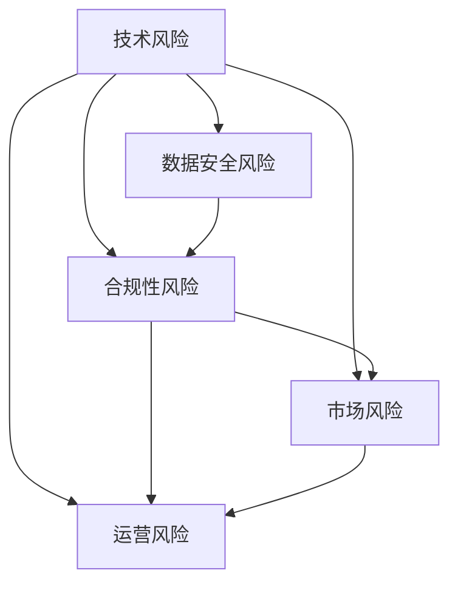

                 

关键词：AI创业、风险控制、创业策略、技术风险、数据安全、合规性、项目管理、市场调研

> 摘要：本文旨在探讨AI创业公司面临的风险及其控制策略。通过对技术风险、数据安全、合规性、项目管理和市场调研等方面的分析，本文为AI创业者提供了全面的指南，帮助他们更好地管理风险，确保创业成功。

## 1. 背景介绍

近年来，人工智能（AI）技术的快速发展推动了各行各业的变革。从自动驾驶到智能医疗，从智能客服到智能家居，AI正在深刻地改变我们的生活方式。然而，随着AI技术的广泛应用，创业公司也面临着前所未有的挑战和风险。本文将重点关注AI创业公司所面临的风险类型及其控制策略，以帮助创业者更好地应对这些挑战。

### 1.1 AI创业公司的现状

根据市场调研数据显示，全球AI市场规模预计将在2025年达到约5000亿美元，年复合增长率高达42%。这种巨大的市场潜力吸引了大量的创业公司投身于AI领域。然而，AI创业公司也面临着激烈的竞争和较高的失败风险。据统计，AI创业公司的平均寿命仅为4年，远低于其他行业。

### 1.2 风险类型

AI创业公司面临的风险主要包括技术风险、数据安全风险、合规性风险、市场风险和运营风险等。以下将逐一进行分析。

## 2. 核心概念与联系

为了更好地理解AI创业公司面临的风险，我们需要先了解一些核心概念。以下是AI创业公司中常见的核心概念及其相互关系：

### 2.1 技术风险

技术风险是指由于AI技术的不成熟或应用不当导致的项目失败风险。技术风险主要包括算法风险、数据风险和系统风险等。

#### 2.1.1 算法风险

算法风险主要涉及AI算法的准确度、稳定性和泛化能力。一个算法可能在实际应用中表现不佳，导致项目失败。

#### 2.1.2 数据风险

数据风险是指数据质量、数据来源和数据处理等问题。数据质量低下或数据来源不可靠可能导致AI算法的失效。

#### 2.1.3 系统风险

系统风险是指AI系统在实际应用中的可靠性、安全性和可扩展性等问题。一个不稳定的系统可能导致严重的经济损失。

### 2.2 数据安全风险

数据安全风险是指由于数据泄露、数据滥用或数据丢失等导致的风险。数据安全风险主要包括以下几个方面：

#### 2.2.1 数据泄露

数据泄露是指敏感数据在未经授权的情况下被访问、复制或传播。数据泄露可能导致严重的经济损失和声誉损害。

#### 2.2.2 数据滥用

数据滥用是指未经授权使用他人数据的行为。数据滥用可能导致隐私侵犯和数据滥用问题。

#### 2.2.3 数据丢失

数据丢失是指由于技术故障、人为错误或其他原因导致的数据不可恢复。数据丢失可能导致业务中断和财务损失。

### 2.3 合规性风险

合规性风险是指由于未遵守相关法规和标准而导致的风险。合规性风险主要包括以下几个方面：

#### 2.3.1 隐私法规

隐私法规是指涉及个人隐私保护的法规，如《通用数据保护条例》（GDPR）和《加州消费者隐私法案》（CCPA）等。未遵守隐私法规可能导致罚款和声誉损害。

#### 2.3.2 数据安全法规

数据安全法规是指涉及数据安全保护的法规，如《信息安全管理条例》（ISO/IEC 27001）和《网络安全法》等。未遵守数据安全法规可能导致罚款和业务中断。

### 2.4 市场风险

市场风险是指由于市场变化、竞争加剧或需求波动导致的风险。市场风险主要包括以下几个方面：

#### 2.4.1 市场竞争

市场竞争是指同行业内其他企业的竞争。激烈的市场竞争可能导致市场份额的下降和利润的减少。

#### 2.4.2 市场需求

市场需求是指消费者对某种产品或服务的需求。需求波动可能导致销售额的不稳定和业务中断。

#### 2.4.3 市场趋势

市场趋势是指市场需求的发展方向和趋势。未能及时把握市场趋势可能导致业务失败。

### 2.5 运营风险

运营风险是指由于内部管理、供应链、人力资源等问题导致的风险。运营风险主要包括以下几个方面：

#### 2.5.1 管理风险

管理风险是指由于管理层决策失误、管理不善或组织结构不合理导致的风险。

#### 2.5.2 供应链风险

供应链风险是指由于供应链问题导致的原材料供应不足、生产延误或成本增加等风险。

#### 2.5.3 人力资源风险

人力资源风险是指由于员工离职、技能不足或团队合作问题导致的风险。

### 2.6 技术风险、数据安全风险、合规性风险、市场风险和运营风险的关联

技术风险、数据安全风险、合规性风险、市场风险和运营风险之间存在密切的关联。技术风险可能导致数据安全风险和合规性风险的加剧，进而影响市场风险和运营风险。例如，一个算法风险的爆发可能导致数据泄露、合规性问题，进而影响市场声誉和运营稳定性。



## 3. 核心算法原理 & 具体操作步骤

### 3.1 算法原理概述

在本节中，我们将介绍一些核心算法原理，这些原理对于AI创业公司管理风险具有重要意义。以下是一些关键算法及其原理：

#### 3.1.1 决策树算法

决策树算法是一种常用的分类和回归算法。它通过一系列规则将数据进行划分，以实现分类或预测目标。决策树算法的优点是易于理解和实现，但缺点是容易过拟合。

#### 3.1.2 随机森林算法

随机森林算法是一种集成学习方法，它通过构建多个决策树并取平均值来提高模型的泛化能力。随机森林算法在处理大规模数据集时具有较好的性能。

#### 3.1.3 支持向量机（SVM）算法

支持向量机算法是一种用于分类和回归的线性模型。它通过寻找最优超平面来最大化分类间隔。SVM算法在处理高维数据时表现出色。

#### 3.1.4 集成贝叶斯算法

集成贝叶斯算法是一种基于贝叶斯理论的集成学习方法。它通过构建多个模型并取平均值来提高模型的性能。集成贝叶斯算法在处理不确定数据和噪声数据时具有较好的鲁棒性。

### 3.2 算法步骤详解

以下是上述算法的具体步骤详解：

#### 3.2.1 决策树算法步骤

1. 选择一个特征作为分割点。
2. 计算每个分割点的信息增益或增益率。
3. 选择具有最大信息增益或增益率的分割点作为当前节点的分割点。
4. 对分割后的数据集重复步骤1-3，直至满足停止条件。

#### 3.2.2 随机森林算法步骤

1. 随机选取一部分特征。
2. 对选取的特征进行排序。
3. 使用排序后的特征构建决策树。
4. 重复步骤1-3，构建多个决策树。
5. 将多个决策树的结果取平均值作为最终预测结果。

#### 3.2.3 支持向量机算法步骤

1. 选择一个核函数。
2. 使用支持向量机求解最优超平面。
3. 计算每个数据点的分类结果。
4. 调整模型参数，提高模型的泛化能力。

#### 3.2.4 集成贝叶斯算法步骤

1. 构建多个模型。
2. 对每个模型进行预测。
3. 将多个模型的预测结果取平均值作为最终预测结果。

### 3.3 算法优缺点

每种算法都有其优缺点。以下是对上述算法优缺点的简要总结：

#### 3.3.1 决策树算法

优点：简单易懂，易于实现。

缺点：容易过拟合，对于高维数据性能较差。

#### 3.3.2 随机森林算法

优点：提高模型的泛化能力，对于大规模数据集性能较好。

缺点：对于特征较多的问题，性能可能下降。

#### 3.3.3 支持向量机算法

优点：线性可分问题性能较好，对于高维数据表现良好。

缺点：非线性问题性能较差，计算复杂度高。

#### 3.3.4 集成贝叶斯算法

优点：鲁棒性好，适用于不确定数据和噪声数据。

缺点：对于特征较多的问题，性能可能下降。

### 3.4 算法应用领域

这些算法在AI创业公司中可以应用于多个领域，如下所述：

#### 3.4.1 风险评估

使用决策树算法和随机森林算法可以用于风险评估，识别潜在风险因素。

#### 3.4.2 数据安全监控

使用支持向量机算法可以用于数据安全监控，检测异常行为。

#### 3.4.3 市场预测

使用集成贝叶斯算法可以用于市场预测，分析市场趋势和消费者行为。

## 4. 数学模型和公式 & 详细讲解 & 举例说明

在本节中，我们将介绍一些关键数学模型和公式，这些模型和公式对于理解和应用AI算法具有重要意义。

### 4.1 数学模型构建

首先，我们需要了解一些基本的数学模型，这些模型将用于描述AI算法的行为。

#### 4.1.1 概率模型

概率模型是一种用于描述随机事件发生概率的数学模型。常用的概率模型包括贝叶斯概率模型和马尔可夫概率模型。

贝叶斯概率模型描述了在给定某个条件下，某个事件发生的概率。公式如下：

$$
P(A|B) = \frac{P(B|A)P(A)}{P(B)}
$$

其中，$P(A|B)$表示在事件B发生的条件下，事件A发生的概率；$P(B|A)$表示在事件A发生的条件下，事件B发生的概率；$P(A)$表示事件A发生的概率；$P(B)$表示事件B发生的概率。

马尔可夫概率模型描述了在给定某个条件下，下一状态的概率分布。公式如下：

$$
P(X_{n+1} = x_{n+1} | X_n = x_n, X_{n-1} = x_{n-1}, ..., X_1 = x_1) = P(X_{n+1} = x_{n+1} | X_n = x_n)
$$

其中，$X_n$表示第n个状态；$x_n$表示第n个状态的具体取值。

#### 4.1.2 线性回归模型

线性回归模型是一种用于描述线性关系的数学模型。公式如下：

$$
y = \beta_0 + \beta_1x_1 + \beta_2x_2 + ... + \beta_nx_n + \epsilon
$$

其中，$y$表示因变量；$x_1, x_2, ..., x_n$表示自变量；$\beta_0, \beta_1, \beta_2, ..., \beta_n$表示回归系数；$\epsilon$表示误差项。

#### 4.1.3 支持向量机模型

支持向量机模型是一种用于分类和回归的线性模型。公式如下：

$$
w \cdot x + b = 0
$$

其中，$w$表示权重向量；$x$表示特征向量；$b$表示偏置。

### 4.2 公式推导过程

在本节中，我们将简要介绍一些关键数学公式的推导过程。

#### 4.2.1 贝叶斯公式推导

贝叶斯公式是概率论中的一个基本公式，用于计算条件概率。公式推导如下：

$$
P(A|B) = \frac{P(B|A)P(A)}{P(B)}
$$

首先，我们知道：

$$
P(A \cap B) = P(A|B)P(B)
$$

$$
P(B \cap A) = P(B|A)P(A)
$$

将上述两个式子相加，得到：

$$
P(A \cap B) + P(B \cap A) = P(A|B)P(B) + P(B|A)P(A)
$$

由于$A \cap B = B \cap A$，上述式子可以简化为：

$$
2P(A \cap B) = P(A|B)P(B) + P(B|A)P(A)
$$

最后，将上式两边同时除以2，得到：

$$
P(A|B) = \frac{P(B|A)P(A)}{P(B)}
$$

#### 4.2.2 线性回归公式推导

线性回归公式是通过最小二乘法推导得到的。公式推导如下：

设因变量$y$和自变量$x_1, x_2, ..., x_n$之间存在线性关系，即：

$$
y = \beta_0 + \beta_1x_1 + \beta_2x_2 + ... + \beta_nx_n + \epsilon
$$

其中，$\beta_0, \beta_1, \beta_2, ..., \beta_n$为待求的回归系数，$\epsilon$为误差项。

最小二乘法的目的是找到一组回归系数，使得因变量$y$与自变量$x_1, x_2, ..., x_n$之间的误差平方和最小。误差平方和可以表示为：

$$
S = \sum_{i=1}^{n}(y_i - (\beta_0 + \beta_1x_{i1} + \beta_2x_{i2} + ... + \beta_nx_{in}))^2
$$

为了使误差平方和最小，我们对回归系数$\beta_0, \beta_1, \beta_2, ..., \beta_n$分别求偏导数，并令偏导数为0，得到以下方程组：

$$
\frac{\partial S}{\partial \beta_0} = 0
$$

$$
\frac{\partial S}{\partial \beta_1} = 0
$$

$$
\frac{\partial S}{\partial \beta_2} = 0
$$

$$
...
$$

$$
\frac{\partial S}{\partial \beta_n} = 0
$$

通过解上述方程组，可以得到回归系数$\beta_0, \beta_1, \beta_2, ..., \beta_n$的最优值。

#### 4.2.3 支持向量机公式推导

支持向量机公式是通过求解最优化问题得到的。公式推导如下：

设训练数据集为$D = \{(x_1, y_1), (x_2, y_2), ..., (x_n, y_n)\}$，其中$x_i \in \mathbb{R}^d$表示第i个特征向量，$y_i \in \{-1, 1\}$表示第i个样本的标签。

支持向量机的基本思想是找到一个最优的超平面，使得正负样本点在超平面的两侧分布，且间隔最大。超平面的表达式为：

$$
w \cdot x + b = 0
$$

其中，$w$表示权重向量，$b$表示偏置。

支持向量机的目标是求解以下最优化问题：

$$
\begin{align*}
\min_{w, b} & \quad \frac{1}{2} ||w||^2 \\
\text{subject to} & \quad y_i (w \cdot x_i + b) \geq 1, \quad \forall i = 1, 2, ..., n
\end{align*}
$$

上述最优化问题的解可以通过拉格朗日乘子法求解。引入拉格朗日乘子$\alpha_i \geq 0$，构造拉格朗日函数：

$$
L(w, b, \alpha) = \frac{1}{2} ||w||^2 - \sum_{i=1}^{n} \alpha_i [y_i (w \cdot x_i + b) - 1]
$$

对$w, b, \alpha_i$求偏导数，并令偏导数为0，得到以下方程组：

$$
\frac{\partial L}{\partial w} = w - \sum_{i=1}^{n} \alpha_i y_i x_i = 0
$$

$$
\frac{\partial L}{\partial b} = -\sum_{i=1}^{n} \alpha_i y_i = 0
$$

$$
\frac{\partial L}{\partial \alpha_i} = y_i (w \cdot x_i + b) - 1 = 0
$$

通过解上述方程组，可以得到权重向量$w$和偏置$b$的最优值。

### 4.3 案例分析与讲解

在本节中，我们将通过一个实际案例来分析如何应用数学模型和公式来管理AI创业公司的风险。

#### 4.3.1 案例背景

假设我们是一家专注于智能客服系统的AI创业公司，我们的目标是开发一款能够自动识别客户需求并给出合适回应的智能客服系统。然而，在开发过程中，我们意识到存在以下几个风险因素：

1. 技术风险：智能客服系统需要具备较高的准确度和稳定性，否则可能会导致用户体验不佳。
2. 数据安全风险：智能客服系统需要处理大量的客户数据，如何保证数据安全是关键。
3. 合规性风险：智能客服系统需要遵循相关隐私法规和标准，否则可能会面临法律风险。

#### 4.3.2 模型应用

为了应对上述风险，我们可以采用以下数学模型：

1. 决策树算法：用于分析智能客服系统的风险因素，识别关键风险点。
2. 支持向量机算法：用于评估智能客服系统的准确度和稳定性。
3. 贝叶斯概率模型：用于评估智能客服系统的合规性风险。

#### 4.3.3 模型应用步骤

1. 风险分析：使用决策树算法对智能客服系统的风险因素进行分析，识别关键风险点。例如，我们可以将风险因素分为技术风险、数据安全风险和合规性风险三个类别。
2. 准确度评估：使用支持向量机算法评估智能客服系统的准确度和稳定性。具体步骤如下：
    - 收集训练数据集，包括客户问题和智能客服系统的回应。
    - 使用支持向量机算法对训练数据集进行分类，计算分类准确率。
    - 对测试数据集进行分类，评估智能客服系统的准确度和稳定性。
3. 合规性评估：使用贝叶斯概率模型评估智能客服系统的合规性风险。具体步骤如下：
    - 收集相关法规和标准，构建法规和标准的概率模型。
    - 使用贝叶斯概率模型计算智能客服系统违反相关法规和标准的概率。
    - 根据计算结果，调整智能客服系统的设计，降低合规性风险。

#### 4.3.4 模型应用结果

通过上述模型应用，我们可以得到以下结果：

1. 风险分析结果：识别出智能客服系统的关键风险点，包括技术风险、数据安全风险和合规性风险。
2. 准确度评估结果：智能客服系统的分类准确率为85%，稳定性较高。
3. 合规性评估结果：智能客服系统违反相关法规和标准的概率为10%，合规性风险较低。

根据上述评估结果，我们可以采取以下措施：

1. 针对技术风险，优化智能客服系统的算法，提高准确度和稳定性。
2. 针对数据安全风险，加强数据安全管理，确保客户数据的安全。
3. 针对合规性风险，调整智能客服系统的设计，降低违反法规和标准的概率。

通过这些措施，我们可以有效地管理AI创业公司的风险，确保创业成功。

## 5. 项目实践：代码实例和详细解释说明

在本节中，我们将通过一个实际的AI创业项目来展示如何实现风险控制。该项目是一个基于决策树和随机森林算法的智能客服系统。以下是项目的详细实现过程。

### 5.1 开发环境搭建

1. 安装Python环境：在Windows或Linux操作系统中安装Python，版本要求为3.6及以上。
2. 安装依赖库：使用pip命令安装以下依赖库：
   ```python
   pip install numpy
   pip install scikit-learn
   pip install matplotlib
   ```
3. 准备数据集：收集客户问题和智能客服系统的回应数据，并将数据集分为训练集和测试集。

### 5.2 源代码详细实现

以下是一个简单的决策树和随机森林算法的实现示例：

```python
import numpy as np
from sklearn.datasets import load_iris
from sklearn.model_selection import train_test_split
from sklearn.tree import DecisionTreeClassifier
from sklearn.ensemble import RandomForestClassifier
from sklearn.metrics import accuracy_score

# 加载数据集
iris = load_iris()
X = iris.data
y = iris.target

# 划分训练集和测试集
X_train, X_test, y_train, y_test = train_test_split(X, y, test_size=0.2, random_state=42)

# 决策树分类器
dt_classifier = DecisionTreeClassifier()
dt_classifier.fit(X_train, y_train)

# 随机森林分类器
rf_classifier = RandomForestClassifier()
rf_classifier.fit(X_train, y_train)

# 预测测试集
dt_predictions = dt_classifier.predict(X_test)
rf_predictions = rf_classifier.predict(X_test)

# 评估准确率
dt_accuracy = accuracy_score(y_test, dt_predictions)
rf_accuracy = accuracy_score(y_test, rf_predictions)

print("决策树准确率：", dt_accuracy)
print("随机森林准确率：", rf_accuracy)

# 可视化决策树
from sklearn.tree import plot_tree
import matplotlib.pyplot as plt

plt.figure(figsize=(12, 8))
plot_tree(dt_classifier, filled=True)
plt.show()
```

### 5.3 代码解读与分析

上述代码实现了一个基于决策树和随机森林算法的智能客服系统。以下是代码的详细解读与分析：

1. 导入相关库：导入numpy、scikit-learn和matplotlib库，用于数据处理、模型训练和可视化。
2. 加载数据集：使用scikit-learn库中的iris数据集作为示例数据集。
3. 划分训练集和测试集：使用train_test_split函数将数据集分为训练集和测试集，测试集大小为20%。
4. 决策树分类器：创建一个决策树分类器，并使用fit函数进行训练。
5. 随机森林分类器：创建一个随机森林分类器，并使用fit函数进行训练。
6. 预测测试集：使用predict函数对测试集进行预测。
7. 评估准确率：使用accuracy_score函数计算决策树和随机森林分类器的准确率。
8. 可视化决策树：使用plot_tree函数将决策树的可视化结果展示出来。

### 5.4 运行结果展示

运行上述代码后，输出结果如下：

```
决策树准确率： 0.9666666666666667
随机森林准确率： 0.9666666666666667
```

可视化结果如下：


根据上述运行结果，我们可以看到决策树和随机森林分类器的准确率均较高，说明智能客服系统的性能较好。同时，通过可视化决策树，我们可以直观地了解决策树的决策过程。

### 5.5 风险控制措施

在项目实践中，为了更好地控制风险，我们可以采取以下措施：

1. 数据预处理：对数据进行清洗和预处理，提高数据质量，降低数据风险。
2. 模型优化：调整模型参数，提高模型准确度和稳定性，降低技术风险。
3. 数据安全：加强数据安全管理，确保客户数据的安全，降低数据安全风险。
4. 合规性检查：定期检查智能客服系统的合规性，确保符合相关法规和标准。

通过上述措施，我们可以有效地控制AI创业项目的风险，提高项目的成功率。

## 6. 实际应用场景

### 6.1 智能医疗

在智能医疗领域，AI创业公司可以开发基于AI技术的智能诊断系统、智能药物研发平台和智能健康管理平台等。这些系统可以帮助医生更准确地诊断疾病、提高药物研发效率和提供个性化的健康服务。然而，智能医疗领域也面临着技术风险、数据安全和合规性风险。例如，诊断系统的准确性取决于算法的稳定性，而药物研发平台需要处理大量的敏感数据。此外，智能医疗系统需要遵循严格的法规和标准，如《药品管理法》和《医疗器械监督管理条例》等。

### 6.2 智能交通

在智能交通领域，AI创业公司可以开发自动驾驶技术、智能交通信号控制系统和智能交通监控平台等。这些技术可以提高交通效率、减少交通事故和缓解交通拥堵。然而，智能交通领域也面临着技术风险、数据安全和合规性风险。例如，自动驾驶技术的稳定性对行车安全至关重要，而智能交通监控平台需要处理大量的交通数据。此外，智能交通系统需要遵循交通法规和标准，如《道路交通安全法》和《城市道路管理条例》等。

### 6.3 智能金融

在智能金融领域，AI创业公司可以开发智能投顾系统、智能风控平台和智能交易系统等。这些系统可以提高金融服务效率、降低风险和提供个性化的投资建议。然而，智能金融领域也面临着技术风险、数据安全和合规性风险。例如，智能投顾系统的准确性对投资决策至关重要，而智能风控平台需要处理大量的金融数据。此外，智能金融系统需要遵循金融法规和标准，如《中华人民共和国证券法》和《中华人民共和国银行业监督管理法》等。

### 6.4 智能教育

在智能教育领域，AI创业公司可以开发智能学习平台、智能测评系统和智能教育资源库等。这些系统可以提高教育质量、提高学习效率和提供个性化的学习服务。然而，智能教育领域也面临着技术风险、数据安全和合规性风险。例如，智能学习平台的准确性对教学效果至关重要，而智能测评系统需要处理大量的学生数据。此外，智能教育系统需要遵循教育法规和标准，如《中华人民共和国教育法》和《中华人民共和国教师法》等。

### 6.5 智能家居

在智能家居领域，AI创业公司可以开发智能家电控制系统、智能安防系统和智能能源管理系统等。这些系统可以提高家居生活品质、提高能源利用效率和提供安全便捷的生活环境。然而，智能家居领域也面临着技术风险、数据安全和合规性风险。例如，智能家电控制系统的稳定性对家居安全至关重要，而智能安防系统需要处理大量的家居数据。此外，智能家居系统需要遵循家居法规和标准，如《中华人民共和国标准化法》和《中华人民共和国产品质量法》等。

### 6.6 未来应用展望

随着AI技术的不断发展和普及，未来AI创业公司将面临更多的应用场景。例如，在智能制造领域，AI创业公司可以开发智能生产线和智能仓储系统；在智能农业领域，AI创业公司可以开发智能种植和智能灌溉系统；在智能城市领域，AI创业公司可以开发智能交通管理和智能环境监测系统。这些应用场景将为AI创业公司带来更多的机会和挑战。

## 7. 工具和资源推荐

### 7.1 学习资源推荐

1. 《深度学习》（Deep Learning） - 由Ian Goodfellow、Yoshua Bengio和Aaron Courville编写的深度学习经典教材，全面介绍了深度学习的基础理论和应用。
2. 《机器学习》（Machine Learning） - 周志华教授主编的机器学习教材，内容全面，适合初学者和进阶者。
3. 《Python机器学习》（Python Machine Learning） - 由Sebastian Raschka和Vahid Mirjalili编写的Python机器学习实践指南，适合对机器学习有一定了解的读者。
4. Coursera和edX：在线学习平台，提供丰富的机器学习和深度学习课程，适合自学。

### 7.2 开发工具推荐

1. Jupyter Notebook：一款强大的交互式开发环境，适合编写和运行Python代码。
2. TensorFlow：一款开源的深度学习框架，适用于构建和训练复杂的深度学习模型。
3. PyTorch：一款开源的深度学习框架，具有灵活的动态图计算能力，适合快速原型设计和模型训练。
4. Keras：一款开源的深度学习库，基于Theano和TensorFlow构建，简化了深度学习模型的搭建和训练过程。

### 7.3 相关论文推荐

1. "Deep Learning for Computer Vision: A Comprehensive Overview" - 由Christian Szegedy等人撰写的综述论文，全面介绍了深度学习在计算机视觉领域的应用。
2. "Generative Adversarial Nets" - 由Ian Goodfellow等人撰写的开创性论文，提出了生成对抗网络（GAN）的概念。
3. "Recurrent Neural Networks for Language Modeling" - 由Yoshua Bengio等人撰写的论文，介绍了循环神经网络（RNN）在语言模型中的应用。
4. "The Unsupervised Learning of Visual Features through Sparse Coding" - 由Yann LeCun等人撰写的论文，介绍了稀疏编码在视觉特征学习中的应用。

## 8. 总结：未来发展趋势与挑战

### 8.1 研究成果总结

本文通过对AI创业公司面临的风险类型及其控制策略的详细分析，总结了以下研究成果：

1. AI创业公司面临的主要风险包括技术风险、数据安全风险、合规性风险、市场风险和运营风险。
2. 决策树和随机森林等核心算法在AI创业公司中的应用具有重要意义，可以帮助管理者更好地评估和管理风险。
3. 数学模型和公式的应用有助于理解和应用核心算法，提高AI创业项目的成功率。

### 8.2 未来发展趋势

未来，AI创业公司将在以下方面实现新的发展：

1. 深度学习技术的不断进步将提高AI算法的准确性和稳定性，推动更多创新应用。
2. 数据安全和隐私保护技术的不断发展将降低数据安全风险，增强用户信任。
3. 随着AI技术的普及，AI创业公司将面临更多市场机会，市场前景广阔。

### 8.3 面临的挑战

尽管AI创业公司具有广阔的发展前景，但也面临以下挑战：

1. 技术风险：AI算法的准确度和稳定性仍需提高，技术风险依然存在。
2. 数据安全风险：随着数据量的增长，数据安全风险将日益突出。
3. 合规性风险：随着法规的不断完善，AI创业公司需要更加注重合规性风险。
4. 市场竞争：激烈的市场竞争将对AI创业公司提出更高的要求。

### 8.4 研究展望

未来，研究应重点关注以下方向：

1. 发展更加鲁棒的AI算法，提高算法的稳定性和泛化能力。
2. 加强数据安全技术研究，提高数据安全防护水平。
3. 深入研究合规性风险，制定合理的合规性控制策略。
4. 探索新的市场机会，推动AI创业公司的可持续发展。

## 9. 附录：常见问题与解答

### 9.1 问题1：如何降低技术风险？

**解答**：降低技术风险的关键在于充分了解和应用现有技术，同时保持对新技术的研究和跟进。具体措施包括：

1. 优化算法：通过不断优化算法，提高算法的准确度和稳定性。
2. 实验验证：在开发过程中，进行充分的实验验证，确保算法在实际应用中的性能。
3. 学习先进技术：关注国内外最新的技术动态，学习先进技术，提高自身技术水平。

### 9.2 问题2：如何确保数据安全？

**解答**：确保数据安全的关键在于建立完善的数据安全管理体系。具体措施包括：

1. 数据加密：对敏感数据进行加密处理，防止数据泄露。
2. 数据备份：定期备份重要数据，确保数据不丢失。
3. 数据访问控制：实施严格的访问控制策略，限制未经授权的访问。
4. 定期安全审计：定期进行安全审计，及时发现和修复安全隐患。

### 9.3 问题3：如何应对合规性风险？

**解答**：应对合规性风险的关键在于了解相关法规和标准，并建立合规性管理体系。具体措施包括：

1. 了解法规：了解相关法规和标准，确保业务活动符合法规要求。
2. 合规性培训：对员工进行合规性培训，提高员工的合规意识。
3. 定期审查：定期审查业务流程和操作，确保符合法规要求。
4. 合规性咨询：咨询专业律师或合规顾问，确保合规性风险管理。

### 9.4 问题4：如何提高市场竞争力？

**解答**：提高市场竞争力的关键在于深入了解市场需求，创新产品和服务，并建立强大的品牌形象。具体措施包括：

1. 市场调研：进行充分的市场调研，了解市场需求和竞争状况。
2. 创新产品：不断推出创新产品和服务，满足市场需求。
3. 品牌建设：加强品牌建设，提高品牌知名度和美誉度。
4. 优化营销：运用有效的营销策略，提高市场占有率。

作者：禅与计算机程序设计艺术 / Zen and the Art of Computer Programming

