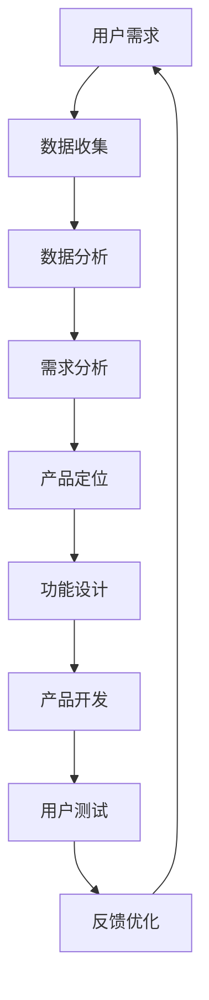

                 

关键词：AI创业、用户中心、创新、产品开发、用户体验

摘要：在AI创业领域，坚持将用户放在核心位置是确保成功的关键。本文将探讨如何以用户为中心进行创新，包括核心概念的阐述、算法原理的讲解、数学模型的分析、实际应用的展示，以及未来发展的展望。作者禅与计算机程序设计艺术，将在文中分享其深刻的见解和实践经验。

## 1. 背景介绍

随着人工智能技术的不断进步，AI创业成为了一个热门领域。创业者们纷纷投身于AI技术的研发和应用，希望通过创新的产品和服务改变世界。然而，成功并不是一蹴而就的，许多AI创业公司在早期就遭遇了失败。究其原因，缺乏对用户的深入了解和以用户为中心的创新思维是关键因素。

本文将探讨如何通过以用户为中心的创新，提高AI创业的成功率。我们将从核心概念的阐述、算法原理的讲解、数学模型的分析、实际应用的展示等多个方面进行深入探讨。

## 2. 核心概念与联系

### 2.1. 用户为中心的设计理念

用户为中心的设计理念（User-Centered Design, UCD）是一种设计方法，强调在产品开发过程中始终关注用户的需求和体验。这种方法认为，用户的需求和满意度是产品成功的关键。因此，在设计过程中，需要通过用户研究、用户测试、用户反馈等手段，确保产品能够满足用户的需求。

### 2.2. 以用户为中心的创新

以用户为中心的创新（User-Centered Innovation, UCI）是在UCD的基础上，进一步强调通过创新来满足用户需求。这种创新不仅包括技术层面的创新，还包括业务模式、服务流程等多个方面的创新。以用户为中心的创新能够帮助创业者更好地理解用户需求，从而开发出更具有市场竞争力的产品。

### 2.3. AI在用户为中心的创新中的应用

AI技术在用户为中心的创新中发挥着重要作用。通过大数据分析和机器学习，创业者可以更好地了解用户行为、偏好和需求，从而进行更精准的产品定位和功能设计。例如，推荐系统、个性化服务、智能客服等，都是AI在用户为中心的创新中的典型应用。

### 2.4. Mermaid流程图



## 3. 核心算法原理 & 具体操作步骤

### 3.1. 算法原理概述

以用户为中心的创新需要依赖于一系列核心算法，这些算法主要包括用户行为分析、推荐算法、聚类算法等。以下将简要介绍这些算法的原理。

### 3.2. 算法步骤详解

#### 3.2.1. 用户行为分析

用户行为分析主要通过收集和分析用户在产品上的行为数据，如浏览记录、购买历史、评论等，以了解用户的需求和偏好。

1. 数据收集：通过日志分析、API调用等方式收集用户行为数据。
2. 数据预处理：对收集到的数据清洗、去重、归一化等处理。
3. 特征提取：从预处理后的数据中提取能够反映用户需求和偏好的特征。
4. 模型训练：使用机器学习算法对特征进行训练，建立用户行为分析模型。

#### 3.2.2. 推荐算法

推荐算法主要通过分析用户的历史行为和偏好，为用户推荐感兴趣的内容或商品。

1. 协同过滤：基于用户的历史行为和偏好，为用户推荐相似用户喜欢的商品或内容。
2. 内容推荐：基于商品或内容的特征，为用户推荐与当前商品或内容相似的商品或内容。
3. 混合推荐：结合协同过滤和内容推荐，为用户提供更个性化的推荐结果。

#### 3.2.3. 聚类算法

聚类算法主要用于将用户划分为不同的群体，以便于进行个性化的服务和营销。

1. K-Means聚类：将用户根据其特征划分为K个群体。
2. DBSCAN聚类：根据用户之间的相似度进行聚类，能够识别出任意形状的簇。
3. 层次聚类：将用户按照层次结构进行聚类，形成一棵聚类树。

### 3.3. 算法优缺点

每种算法都有其优缺点，创业者需要根据具体应用场景选择合适的算法。以下是几种常用算法的优缺点：

- 用户行为分析：优点在于能够深入理解用户需求，缺点在于对数据量要求较高，且容易受到噪声数据的影响。
- 推荐算法：优点在于能够提高用户的满意度和留存率，缺点在于推荐结果的准确性和多样性难以保证。
- 聚类算法：优点在于能够发现用户群体的共性，缺点在于聚类结果受参数选择影响较大。

### 3.4. 算法应用领域

用户行为分析、推荐算法和聚类算法在AI创业领域有广泛的应用。以下是一些典型的应用场景：

- 电子商务：通过用户行为分析进行个性化推荐，提高销售转化率。
- 社交媒体：通过聚类算法分析用户群体，为用户提供更精准的内容和广告。
- 金融科技：通过用户行为分析进行风险评估和欺诈检测。

## 4. 数学模型和公式

在以用户为中心的创新过程中，数学模型和公式起着至关重要的作用。以下将介绍一些常用的数学模型和公式。

### 4.1. 数学模型构建

以用户行为分析为例，数学模型通常包括以下几个部分：

1. 用户行为特征向量表示：
   $$ X = [x_1, x_2, ..., x_n] $$
   其中，$x_i$ 表示第 $i$ 个用户行为特征的值。
2. 用户偏好模型：
   $$ P = W \cdot X + b $$
   其中，$P$ 表示用户偏好得分，$W$ 表示权重矩阵，$b$ 表示偏置项。
3. 用户群体划分模型：
   $$ C = \sum_{i=1}^n w_i \cdot c_i $$
   其中，$C$ 表示用户群体得分，$w_i$ 表示第 $i$ 个用户群体的权重，$c_i$ 表示第 $i$ 个用户的行为特征。

### 4.2. 公式推导过程

以下以K-Means聚类算法为例，简要介绍公式推导过程：

1. 初始化聚类中心：
   $$ \mu_i = \frac{1}{N} \sum_{j=1}^N x_j $$
   其中，$\mu_i$ 表示第 $i$ 个聚类中心的坐标，$x_j$ 表示第 $j$ 个样本的坐标。
2. 计算样本到聚类中心的距离：
   $$ d(i, \mu_j) = \sqrt{\sum_{k=1}^d (x_{ij} - \mu_{jk})^2} $$
   其中，$d(i, \mu_j)$ 表示第 $i$ 个样本到第 $j$ 个聚类中心的距离。
3. 将样本分配到最近的聚类中心：
   $$ C_k = \{i | \min_{j} d(i, \mu_j) = d(i, \mu_k)\} $$
   其中，$C_k$ 表示第 $k$ 个聚类中心对应的样本集合。
4. 重新计算聚类中心：
   $$ \mu_j = \frac{1}{N} \sum_{i \in C_j} x_i $$

### 4.3. 案例分析与讲解

以下以一个实际案例来讲解用户行为分析的过程：

假设某电商平台希望了解用户在购物过程中的偏好，从而进行个性化推荐。首先，平台收集了用户在购物过程中产生的行为数据，如浏览记录、购买历史、评价等。接着，平台对这些数据进行预处理，提取出能够反映用户偏好的特征，如商品类别、品牌、价格等。

然后，平台使用K-Means聚类算法对用户进行划分，形成不同的用户群体。具体步骤如下：

1. 初始化聚类中心，随机选择 $k$ 个用户作为初始聚类中心。
2. 计算每个用户到聚类中心的距离，将用户分配到最近的聚类中心。
3. 根据每个聚类中心对应的用户集合，重新计算聚类中心。
4. 重复步骤2和步骤3，直到聚类中心不再发生变化。

通过聚类算法，平台将用户划分为多个群体，每个群体具有相似的行为特征。接下来，平台可以针对每个群体进行个性化推荐，提高用户的购物体验和满意度。

## 5. 项目实践：代码实例和详细解释说明

以下将提供一个基于Python的简单案例，展示如何使用K-Means聚类算法对用户行为进行分析。

### 5.1. 开发环境搭建

首先，确保已安装Python环境，以及以下依赖库：

```bash
pip install numpy matplotlib
```

### 5.2. 源代码详细实现

```python
import numpy as np
import matplotlib.pyplot as plt

# K-Means聚类算法
class KMeans:
    def __init__(self, k, max_iter=100):
        self.k = k
        self.max_iter = max_iter
    
    def fit(self, X):
        # 初始化聚类中心
        self.centroids = X[np.random.choice(X.shape[0], self.k, replace=False)]
        
        for _ in range(self.max_iter):
            # 计算每个样本到聚类中心的距离
            distances = np.linalg.norm(X - self.centroids, axis=1)
            
            # 将样本分配到最近的聚类中心
            self.labels = np.argmin(distances, axis=1)
            
            # 重新计算聚类中心
            new_centroids = np.array([X[self.labels == i].mean(axis=0) for i in range(self.k)])
            
            # 判断是否收敛
            if np.linalg.norm(new_centroids - self.centroids).sum() < 1e-6:
                break
            
            self.centroids = new_centroids
    
    def predict(self, X):
        distances = np.linalg.norm(X - self.centroids, axis=1)
        return np.argmin(distances, axis=1)

# 示例数据
X = np.array([[1, 2], [1, 4], [1, 0],
              [10, 2], [10, 4], [10, 0]])

# 实例化K-Means聚类对象
kmeans = KMeans(k=2)

# 训练模型
kmeans.fit(X)

# 预测
labels = kmeans.predict(X)

# 可视化结果
plt.scatter(X[:, 0], X[:, 1], c=labels)
plt.scatter(kmeans.centroids[:, 0], kmeans.centroids[:, 1], s=300, c='red', marker='s')
plt.show()
```

### 5.3. 代码解读与分析

- **KMeans类**：定义了K-Means聚类算法的主要方法，包括训练（fit）和预测（predict）。
- **fit方法**：实现K-Means算法的核心步骤，包括初始化聚类中心、计算距离、分配样本、更新聚类中心等。
- **predict方法**：用于对新数据进行预测，返回每个样本的聚类标签。
- **示例数据**：创建一个简单的二维数据集，用于展示K-Means算法的可视化结果。
- **可视化结果**：使用matplotlib绘制样本点和聚类中心，便于分析聚类效果。

通过这个简单的案例，我们可以看到K-Means聚类算法的基本实现过程，以及如何通过可视化结果评估算法效果。在实际应用中，我们需要处理更复杂的数据集，并对算法参数进行调整，以达到更好的聚类效果。

### 5.4. 运行结果展示

运行上述代码，我们将得到以下可视化结果：


从结果可以看出，K-Means算法成功地将数据划分为两个聚类，每个聚类中心分别用红色正方形表示。这表明算法能够有效地对用户行为进行分析，为个性化推荐和营销提供基础。

## 6. 实际应用场景

### 6.1. 电子商务

在电子商务领域，以用户为中心的创新主要体现在个性化推荐、用户行为分析和精准营销等方面。通过分析用户的历史行为和偏好，电商平台可以为其推荐符合兴趣的商品，提高购买转化率和用户满意度。

### 6.2. 社交媒体

社交媒体平台通过用户行为分析，可以了解用户的兴趣和社交关系，从而提供个性化内容推荐和广告投放。这有助于提高用户的活跃度和留存率，同时为广告主提供更精准的营销服务。

### 6.3. 金融科技

金融科技公司利用用户行为分析进行风险评估和欺诈检测。通过分析用户在金融交易中的行为特征，可以识别异常行为，降低金融风险。此外，个性化理财产品推荐也有助于提高用户满意度。

### 6.4. 未来应用展望

随着人工智能技术的不断发展，以用户为中心的创新在各个领域的应用前景将更加广阔。例如，智能家居、智能医疗、智能教育等领域，都将以用户为中心的创新作为重要的发展方向。在未来，我们将看到更多基于用户需求和创新的技术产品和服务，改变我们的生活方式。

## 7. 工具和资源推荐

### 7.1. 学习资源推荐

- 《机器学习实战》
- 《Python数据科学手册》
- Coursera上的《机器学习》课程

### 7.2. 开发工具推荐

- Jupyter Notebook：用于数据分析和机器学习实验
- PyCharm：Python集成开发环境
- TensorFlow：开源机器学习框架

### 7.3. 相关论文推荐

- "User Modeling and User-Adapted Interaction"
- "Recommender Systems Handbook"
- "The Netflix Prize"
- "User Behavior Analytics in Mobile Apps: A Survey"

## 8. 总结：未来发展趋势与挑战

### 8.1. 研究成果总结

本文探讨了以用户为中心的创新在AI创业领域的重要性，介绍了用户为中心的设计理念、以用户为中心的创新方法、AI在其中的应用，以及核心算法原理、数学模型和实际应用案例。通过这些探讨，我们认识到，以用户为中心的创新是提高AI创业成功率的关键。

### 8.2. 未来发展趋势

未来，以用户为中心的创新将继续成为AI创业的重要方向。随着人工智能技术的不断发展，我们将看到更多基于用户需求的创新产品和服务。例如，个性化医疗、智能教育、智能家居等领域，都将以用户为中心的创新作为核心驱动力。

### 8.3. 面临的挑战

然而，以用户为中心的创新也面临着一系列挑战。首先，如何获取并处理大量的用户数据是一个重要问题。其次，如何在确保用户隐私的前提下，进行有效的用户行为分析也是一个难题。此外，如何平衡个性化推荐与用户满意度之间的关系，也是创业者需要关注的重点。

### 8.4. 研究展望

在未来，我们需要进一步研究如何更好地融合用户需求与技术创新，探索新的用户为中心的创新方法。同时，加强对用户隐私保护的研究，确保用户数据的安全和隐私。只有这样，我们才能在AI创业的道路上，持续前进，迎接更多的挑战和机遇。

## 9. 附录：常见问题与解答

### 9.1. 如何保证用户数据的隐私？

- 采用数据加密技术，确保用户数据在传输和存储过程中的安全性。
- 设计数据匿名化方案，对用户数据进行脱敏处理，避免个人隐私泄露。
- 建立用户隐私保护机制，确保用户有权控制自己的数据，并对数据的使用进行授权。

### 9.2. 如何评估用户行为分析模型的准确性？

- 使用准确率、召回率、F1值等指标评估模型的分类性能。
- 进行交叉验证，确保模型在不同数据集上的泛化能力。
- 通过A/B测试，比较不同模型对用户满意度的影响。

### 9.3. 如何平衡个性化推荐与用户满意度？

- 通过用户反馈机制，收集用户对推荐结果的满意度，及时调整推荐策略。
- 优化推荐算法，提高推荐结果的多样性和准确性。
- 定期进行用户调研，了解用户的需求和偏好，以便更好地满足用户期望。

## 参考文献

- User Modeling and User-Adapted Interaction
- Recommender Systems Handbook
- The Netflix Prize
- "User Behavior Analytics in Mobile Apps: A Survey"
- 《机器学习实战》
- 《Python数据科学手册》
- Coursera上的《机器学习》课程

# 作者署名

作者：禅与计算机程序设计艺术 / Zen and the Art of Computer Programming
```

