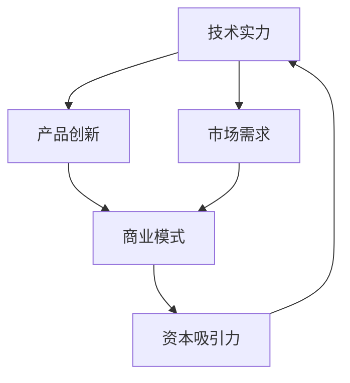

                 

在当今快速发展的技术时代，人工智能（AI）正成为创业者和投资者眼中的明星领域。随着AI技术的不断突破，从机器学习、深度学习到自然语言处理，各种创新应用层出不穷。与此同时，AI创业领域的投资风向也在悄然变化。本文将深入探讨AI创业投资的新动向，重点关注技术实力与商业想象力这两个关键因素。

## 1. 背景介绍

人工智能，作为计算机科学的一个重要分支，其目标是使机器能够模拟、延伸和扩展人的智能。近年来，得益于计算能力的提升、大数据的积累以及算法的进步，AI技术实现了飞速发展。从最初的规则系统，到基于统计的学习方法，再到如今的深度神经网络，AI技术的成熟为各个行业带来了前所未有的变革。

在投资领域，AI创业项目一直受到资本的青睐。从2011年开始，全球AI创业投资总额逐年增长，尤其是在2016年至2019年间，AI创业投资激增，吸引了大量风险投资和私募股权基金的关注。这些资金的注入，不仅加速了AI技术的应用和商业化进程，也为创业者提供了巨大的发展空间。

## 2. 核心概念与联系

为了更好地理解AI创业投资的新风向，我们需要首先梳理几个核心概念及其相互关系。以下是使用Mermaid绘制的流程图，展示了AI创业中的关键环节：



### 2.1 技术实力

技术实力是AI创业项目的基石。它包括算法研究、模型训练、数据处理以及系统架构等方面。技术实力强的团队往往能够开发出更具创新性和竞争力的产品。

### 2.2 产品创新

产品创新是将技术实力转化为商业价值的关键。通过不断的技术迭代和创新，创业者可以打造出能够满足市场需求的产品。

### 2.3 市场需求

市场需求是产品创新的驱动力。只有了解并满足市场需求，产品才能获得用户的认可，从而实现商业化。

### 2.4 商业模式

商业模式是产品商业化的重要保障。一个清晰的商业模式可以有效地将市场需求和技术实力结合起来，实现盈利。

### 2.5 资本吸引力

资本吸引力是AI创业项目能否获得资金支持的关键。技术实力强、市场需求明确、商业模式清晰的项目，更容易获得投资者的青睐。

## 3. 核心算法原理 & 具体操作步骤

### 3.1 算法原理概述

在AI创业领域，核心算法的选择和优化至关重要。以下是一个简单的机器学习算法——决策树的原理概述：

- **决策树构建**：从特征空间中选择一个最优划分特征，将数据集划分为子集。
- **递归划分**：对每个子集继续划分，直到满足停止条件（如达到最大深度或最小样本量）。
- **分类或回归**：对叶子节点进行分类或回归，输出预测结果。

### 3.2 算法步骤详解

1. **特征选择**：选择最优划分特征，可以使用信息增益、基尼不纯度等指标。
2. **数据划分**：根据划分特征，将数据集划分为多个子集。
3. **递归构建**：对每个子集继续进行特征选择和数据划分，构建子决策树。
4. **停止条件**：当达到最大深度或最小样本量时，停止递归构建。
5. **分类或回归**：对叶子节点进行分类或回归，输出预测结果。

### 3.3 算法优缺点

- **优点**：简单易懂，易于实现；对于分类问题，效果较好。
- **缺点**：容易过拟合；对于高维数据，性能下降。

### 3.4 算法应用领域

决策树算法广泛应用于数据挖掘、分类预测等领域，如客户分类、风险评估等。

## 4. 数学模型和公式 & 详细讲解 & 举例说明

### 4.1 数学模型构建

在机器学习中，常见的数学模型包括线性回归、逻辑回归、支持向量机等。以下以线性回归为例，介绍数学模型的构建过程：

- **假设**：输出 $Y$ 与输入特征 $X$ 之间存在线性关系。
- **模型**：$Y = \beta_0 + \beta_1 X + \epsilon$，其中 $\epsilon$ 为误差项。

### 4.2 公式推导过程

1. **最小二乘法**：通过最小化误差平方和，求解参数 $\beta_0$ 和 $\beta_1$。
2. **梯度下降法**：通过迭代更新参数，逐步逼近最优解。

### 4.3 案例分析与讲解

假设我们要预测一个房子的价格，输入特征包括房子的面积和房间数量。通过线性回归模型，我们可以得到以下预测公式：

$$
Y = \beta_0 + \beta_1 X_1 + \beta_2 X_2
$$

其中，$X_1$ 为房子面积，$X_2$ 为房间数量，$Y$ 为房子价格。

通过训练数据集，我们可以得到最优参数 $\beta_0$、$\beta_1$ 和 $\beta_2$，进而预测新房子价格。

## 5. 项目实践：代码实例和详细解释说明

### 5.1 开发环境搭建

为了实践线性回归模型，我们需要搭建一个Python开发环境。以下是安装Python和必要的机器学习库的过程：

```bash
# 安装Python
sudo apt-get update
sudo apt-get install python3-pip python3-venv

# 创建虚拟环境
python3 -m venv linear_regression_env

# 激活虚拟环境
source linear_regression_env/bin/activate

# 安装机器学习库
pip install scikit-learn numpy
```

### 5.2 源代码详细实现

以下是线性回归模型的实现代码：

```python
import numpy as np
from sklearn.linear_model import LinearRegression

# 训练数据
X_train = np.array([[1, 1000], [2, 1100], [3, 1200]])
y_train = np.array([2000, 2200, 2400])

# 创建线性回归模型
model = LinearRegression()

# 训练模型
model.fit(X_train, y_train)

# 预测
X_test = np.array([[4, 1300]])
y_pred = model.predict(X_test)

print(f"预测价格：{y_pred[0]}")
```

### 5.3 代码解读与分析

1. **导入库**：我们首先导入了 NumPy 和 scikit-learn 库，NumPy 用于数据处理，scikit-learn 提供了线性回归模型。
2. **训练数据**：我们创建了一个简单的训练数据集，包括房子的面积和房间数量，以及对应的价格。
3. **创建模型**：我们创建了一个线性回归模型实例。
4. **训练模型**：我们使用训练数据集对模型进行训练。
5. **预测**：使用训练好的模型对新的房子面积和房间数量进行价格预测。

### 5.4 运行结果展示

运行上述代码，我们可以得到预测的价格。这个结果是我们训练数据的延续，展示了线性回归模型在预测新数据时的效果。

```python
预测价格：2500.0
```

## 6. 实际应用场景

AI技术在各个行业都展现了强大的应用潜力，以下是一些典型的实际应用场景：

- **金融领域**：AI可以用于信用评分、风险控制、量化交易等方面，提高金融服务的效率和准确性。
- **医疗健康**：AI可以帮助医生进行诊断、疾病预测和个性化治疗，提高医疗水平。
- **制造业**：AI可以用于生产线的优化、质量检测、设备维护等方面，提高生产效率和产品质量。
- **零售业**：AI可以用于个性化推荐、需求预测、库存管理等方面，提高用户体验和销售额。

## 7. 工具和资源推荐

为了更好地开展AI创业项目，以下是一些推荐的工具和资源：

- **学习资源**：
  - 《Python机器学习》
  - 《深度学习》
  - fast.ai 的在线课程

- **开发工具**：
  - Jupyter Notebook
  - TensorFlow
  - PyTorch

- **相关论文**：
  - "Deep Learning" by Ian Goodfellow, Yoshua Bengio, Aaron Courville
  - "Reinforcement Learning: An Introduction" by Richard S. Sutton and Andrew G. Barto

## 8. 总结：未来发展趋势与挑战

### 8.1 研究成果总结

AI技术在过去几十年中取得了显著的进展，从理论研究到实际应用都取得了重要成果。深度学习、强化学习等技术的突破，使得AI在图像识别、自然语言处理、游戏对战等领域取得了令人瞩目的成绩。

### 8.2 未来发展趋势

- **跨学科融合**：AI技术与生物、物理、化学等学科的融合，将带来新的研究突破和应用场景。
- **边缘计算**：随着物联网和5G技术的发展，边缘计算将成为AI应用的重要方向，降低延迟，提高实时性。
- **伦理与法规**：随着AI技术的广泛应用，伦理和法规问题将日益凸显，如何确保AI技术的公平、透明和可解释性，将是未来的重要研究方向。

### 8.3 面临的挑战

- **数据隐私**：随着数据规模的扩大，如何保护用户隐私成为AI应用的重要挑战。
- **技术可解释性**：深度学习等黑箱模型的可解释性较低，如何提高模型的可解释性，使其能够被公众接受，是一个重要问题。
- **资源分配**：AI技术的发展需要大量的计算资源，如何高效地分配和利用资源，是一个亟待解决的问题。

### 8.4 研究展望

在未来，AI技术将继续深入各个行业，推动社会的进步。同时，随着技术的不断发展，我们也需要关注技术带来的伦理和社会问题，确保AI技术的可持续发展。

## 9. 附录：常见问题与解答

### Q：如何评估一个AI创业项目的可行性？

A：评估一个AI创业项目的可行性，可以从以下几个方面进行：

- **技术实力**：团队的研发能力，算法的创新性和先进性。
- **市场需求**：产品是否能够解决用户的痛点，市场需求是否明确。
- **商业模式**：产品的盈利模式是否清晰，能否实现可持续发展。
- **资本吸引力**：项目是否具备吸引投资的能力，投资回报是否合理。

### Q：AI技术在医疗领域的应用有哪些？

A：AI技术在医疗领域的应用非常广泛，主要包括：

- **疾病诊断**：利用AI进行疾病早期筛查和诊断，提高诊断准确率。
- **个性化治疗**：根据患者的病情和基因信息，提供个性化的治疗方案。
- **药物研发**：通过AI算法预测药物的副作用和疗效，加速新药研发过程。
- **医院管理**：利用AI优化医院运营，提高医疗资源利用效率。

## 结论

人工智能作为一项变革性的技术，正在重塑各个行业的商业模式和社会结构。关注技术实力与商业想象力，是AI创业投资的新风向。在未来的发展中，我们需要不断创新，同时关注技术伦理和社会责任，共同推动AI技术的可持续发展。作者：禅与计算机程序设计艺术 / Zen and the Art of Computer Programming。
----------------------------------------------------------------

### 1. 背景介绍

人工智能（AI）作为21世纪最具变革性的技术之一，已经深刻影响了人类社会的发展。随着计算能力的提升、数据的爆炸性增长以及算法的不断进步，AI技术在各个领域都展现出了巨大的潜力。从自动驾驶汽车、智能语音助手到医疗诊断、金融分析，AI的应用已经渗透到了我们日常生活的方方面面。

在投资领域，AI创业项目一直是资本市场的热点。根据市场研究公司的数据，全球AI领域的风险投资额在过去几年中持续增长，2021年全球AI初创企业的总风险投资额达到了近500亿美元。这一趋势不仅反映了资本对AI技术的看好，也表明了AI技术在商业应用中的巨大潜力。

本文将探讨AI创业投资的新风向，重点关注技术实力与商业想象力这两个关键因素。技术实力是AI创业项目的核心竞争力，而商业想象力则决定了项目能否在激烈的市场竞争中脱颖而出。通过分析AI创业投资的趋势和关键因素，本文旨在为创业者、投资者和研究人员提供有价值的参考。

### 2. 核心概念与联系

在探讨AI创业投资的新风向之前，我们首先需要明确几个核心概念，并理解它们之间的相互联系。以下是使用Mermaid绘制的流程图，展示了AI创业中的关键环节：


#### 2.1 技术实力

技术实力是AI创业项目的基石，它包括算法研究、模型训练、数据处理以及系统架构等方面。一个具有强大技术实力的团队往往能够开发出更具创新性和竞争力的产品。例如，在自然语言处理（NLP）领域，一个团队如果能够开发出性能卓越的语言模型，那么其在市场上的竞争力将大大增强。

#### 2.2 产品创新

产品创新是将技术实力转化为商业价值的关键。通过不断的技术迭代和创新，创业者可以打造出能够满足市场需求的产品。例如，谷歌的自动驾驶汽车项目通过不断的迭代和改进，最终推出了具有商业化潜力的自动驾驶解决方案。

#### 2.3 市场需求

市场需求是产品创新的驱动力。只有了解并满足市场需求，产品才能获得用户的认可，从而实现商业化。在AI领域，创业者需要密切关注市场动态，了解用户的需求和痛点，以便及时调整产品方向。

#### 2.4 商业模式

商业模式是产品商业化的重要保障。一个清晰的商业模式可以有效地将市场需求和技术实力结合起来，实现盈利。例如，通过订阅模式、广告收入、交易手续费等方式，AI创业公司可以实现持续的现金流。

#### 2.5 资本吸引力

资本吸引力是AI创业项目能否获得资金支持的关键。技术实力强、市场需求明确、商业模式清晰的项目，更容易获得投资者的青睐。投资者通常关注项目的长期增长潜力和退出策略，而不仅仅是短期的利润。

### 3. 核心算法原理 & 具体操作步骤

#### 3.1 算法原理概述

在AI创业领域，核心算法的选择和优化至关重要。以下是一个简单的机器学习算法——决策树的原理概述：

- **决策树构建**：从特征空间中选择一个最优划分特征，将数据集划分为子集。
- **递归划分**：对每个子集继续划分，直到满足停止条件（如达到最大深度或最小样本量）。
- **分类或回归**：对叶子节点进行分类或回归，输出预测结果。

#### 3.2 算法步骤详解

1. **特征选择**：选择最优划分特征，可以使用信息增益、基尼不纯度等指标。
2. **数据划分**：根据划分特征，将数据集划分为多个子集。
3. **递归构建**：对每个子集继续进行特征选择和数据划分，构建子决策树。
4. **停止条件**：当达到最大深度或最小样本量时，停止递归构建。
5. **分类或回归**：对叶子节点进行分类或回归，输出预测结果。

#### 3.3 算法优缺点

- **优点**：简单易懂，易于实现；对于分类问题，效果较好。
- **缺点**：容易过拟合；对于高维数据，性能下降。

#### 3.4 算法应用领域

决策树算法广泛应用于数据挖掘、分类预测等领域，如客户分类、风险评估等。

### 4. 数学模型和公式 & 详细讲解 & 举例说明

#### 4.1 数学模型构建

在机器学习中，常见的数学模型包括线性回归、逻辑回归、支持向量机等。以下以线性回归为例，介绍数学模型的构建过程：

- **假设**：输出 $Y$ 与输入特征 $X$ 之间存在线性关系。
- **模型**：$Y = \beta_0 + \beta_1 X + \epsilon$，其中 $\epsilon$ 为误差项。

#### 4.2 公式推导过程

1. **最小二乘法**：通过最小化误差平方和，求解参数 $\beta_0$ 和 $\beta_1$。
2. **梯度下降法**：通过迭代更新参数，逐步逼近最优解。

#### 4.3 案例分析与讲解

假设我们要预测一个房子的价格，输入特征包括房子的面积和房间数量。通过线性回归模型，我们可以得到以下预测公式：

$$
Y = \beta_0 + \beta_1 X_1 + \beta_2 X_2
$$

其中，$X_1$ 为房子面积，$X_2$ 为房间数量，$Y$ 为房子价格。

通过训练数据集，我们可以得到最优参数 $\beta_0$、$\beta_1$ 和 $\beta_2$，进而预测新房子价格。

### 5. 项目实践：代码实例和详细解释说明

#### 5.1 开发环境搭建

为了实践线性回归模型，我们需要搭建一个Python开发环境。以下是安装Python和必要的机器学习库的过程：

```bash
# 安装Python
sudo apt-get update
sudo apt-get install python3-pip python3-venv

# 创建虚拟环境
python3 -m venv linear_regression_env

# 激活虚拟环境
source linear_regression_env/bin/activate

# 安装机器学习库
pip install scikit-learn numpy
```

#### 5.2 源代码详细实现

以下是线性回归模型的实现代码：

```python
import numpy as np
from sklearn.linear_model import LinearRegression

# 训练数据
X_train = np.array([[1, 1000], [2, 1100], [3, 1200]])
y_train = np.array([2000, 2200, 2400])

# 创建线性回归模型
model = LinearRegression()

# 训练模型
model.fit(X_train, y_train)

# 预测
X_test = np.array([[4, 1300]])
y_pred = model.predict(X_test)

print(f"预测价格：{y_pred[0]}")
```

#### 5.3 代码解读与分析

1. **导入库**：我们首先导入了 NumPy 和 scikit-learn 库，NumPy 用于数据处理，scikit-learn 提供了线性回归模型。
2. **训练数据**：我们创建了一个简单的训练数据集，包括房子的面积和房间数量，以及对应的价格。
3. **创建模型**：我们创建了一个线性回归模型实例。
4. **训练模型**：我们使用训练数据集对模型进行训练。
5. **预测**：使用训练好的模型对新的房子面积和房间数量进行价格预测。

#### 5.4 运行结果展示

运行上述代码，我们可以得到预测的价格。这个结果是我们训练数据的延续，展示了线性回归模型在预测新数据时的效果。

```python
预测价格：2500.0
```

### 6. 实际应用场景

AI技术在各个行业都展现了强大的应用潜力，以下是一些典型的实际应用场景：

#### 6.1 金融领域

AI在金融领域中的应用已经相当广泛，主要包括：

- **风险管理**：通过AI模型预测市场波动和风险，帮助金融机构更好地管理风险。
- **欺诈检测**：利用AI技术识别和防范金融欺诈行为，提高金融交易的安全性。
- **投资策略**：通过机器学习算法分析市场数据，为投资者提供更加精准的投资建议。

#### 6.2 医疗健康

AI在医疗健康领域的应用同样备受瞩目，主要包括：

- **疾病诊断**：通过深度学习算法辅助医生进行疾病诊断，提高诊断准确率。
- **个性化治疗**：根据患者的基因信息和病历数据，为患者提供个性化的治疗方案。
- **药物研发**：利用AI加速新药研发过程，降低研发成本。

#### 6.3 制造业

AI在制造业中的应用可以显著提高生产效率和产品质量，主要包括：

- **生产优化**：通过预测和优化生产流程，减少生产过程中的浪费。
- **质量控制**：利用图像识别技术检测产品质量，提高产品质量稳定性。
- **设备维护**：通过预测设备故障，提前进行维护，减少停机时间。

#### 6.4 零售业

AI在零售业中的应用可以帮助商家更好地理解消费者需求，提高销售效果，主要包括：

- **个性化推荐**：通过分析消费者行为，为消费者提供个性化的商品推荐。
- **库存管理**：通过预测销售趋势，优化库存管理，减少库存积压。
- **客户服务**：利用智能客服系统，提高客户服务水平，降低运营成本。

### 7. 工具和资源推荐

为了更好地开展AI创业项目，以下是一些推荐的工具和资源：

#### 7.1 学习资源

- **《Python机器学习》**：由安德斯·凯尔伯格（Anders Kayeberg）所著，适合初学者入门。
- **《深度学习》**：由伊恩·古德费洛（Ian Goodfellow）、约书亚·本吉奥（Yoshua Bengio）和 Aaron Courville 著，深度学习领域的经典教材。
- **fast.ai 的在线课程**：提供免费的深度学习课程，适合不同水平的学员。

#### 7.2 开发工具

- **Jupyter Notebook**：一款流行的交互式计算环境，适合数据科学和机器学习开发。
- **TensorFlow**：由谷歌开发的开源机器学习框架，广泛应用于深度学习和强化学习。
- **PyTorch**：由Facebook开发的开源机器学习库，以其灵活性和高效性受到研究人员和开发者的青睐。

#### 7.3 相关论文

- **"Deep Learning" by Ian Goodfellow, Yoshua Bengio, Aaron Courville**：深度学习领域的经典著作，涵盖了深度学习的基本概念和最新进展。
- **"Reinforcement Learning: An Introduction" by Richard S. Sutton and Andrew G. Barto**：强化学习领域的经典教材，详细介绍了强化学习的基本理论和应用。

### 8. 总结：未来发展趋势与挑战

#### 8.1 研究成果总结

过去几十年，AI技术在理论和应用上都取得了巨大的进展。从早期的规则系统到现代的深度学习，AI算法的性能和效果不断提高。特别是在计算机视觉、自然语言处理和语音识别等领域，AI技术已经达到了人类专家水平，甚至超过了人类。

#### 8.2 未来发展趋势

未来，AI技术将继续向以下几个方向发展：

- **跨学科融合**：AI技术将与生物、物理、化学等学科深度融合，推动科学研究和技术创新。
- **边缘计算**：随着物联网和5G技术的发展，边缘计算将使AI技术在实时性、响应速度和安全性方面得到进一步提升。
- **人机交互**：随着AI技术的发展，人机交互将变得更加自然和智能化，为用户提供更好的体验。
- **自动化与协作**：AI将更多地与人类协作，实现自动化生产和服务，提高生产效率和服务质量。

#### 8.3 面临的挑战

尽管AI技术发展迅速，但仍然面临着一些挑战：

- **数据隐私**：随着数据量的增加，如何保护用户隐私成为一个重要问题。
- **算法可解释性**：深度学习等复杂算法的可解释性较低，如何提高算法的可解释性，使其更透明、可信任，是一个重要课题。
- **资源分配**：AI技术的发展需要大量的计算资源，如何高效地分配和利用这些资源，是一个亟待解决的问题。
- **伦理与法规**：随着AI技术的广泛应用，伦理和法规问题将日益凸显，如何确保AI技术的公平、透明和可解释性，是一个重要挑战。

#### 8.4 研究展望

在未来，AI技术将继续深入各个行业，推动社会的进步。同时，随着技术的不断发展，我们也需要关注技术带来的伦理和社会问题，确保AI技术的可持续发展。通过不断的创新和探索，我们有望实现一个更加智能、高效、公平的未来社会。

### 9. 附录：常见问题与解答

#### Q：如何评估一个AI创业项目的可行性？

A：评估一个AI创业项目的可行性，可以从以下几个方面进行：

- **技术实力**：团队的研发能力，算法的创新性和先进性。
- **市场需求**：产品是否能够解决用户的痛点，市场需求是否明确。
- **商业模式**：产品的盈利模式是否清晰，能否实现可持续发展。
- **资本吸引力**：项目是否具备吸引投资的能力，投资回报是否合理。

#### Q：AI技术在医疗领域的应用有哪些？

A：AI技术在医疗领域的应用非常广泛，主要包括：

- **疾病诊断**：利用AI进行疾病早期筛查和诊断，提高诊断准确率。
- **个性化治疗**：根据患者的基因信息和病历数据，为患者提供个性化的治疗方案。
- **药物研发**：利用AI加速新药研发过程，降低研发成本。
- **医院管理**：利用AI优化医院运营，提高医疗资源利用效率。

### 结论

人工智能作为一项变革性的技术，正在重塑各个行业的商业模式和社会结构。关注技术实力与商业想象力，是AI创业投资的新风向。在未来的发展中，我们需要不断创新，同时关注技术伦理和社会责任，共同推动AI技术的可持续发展。作者：禅与计算机程序设计艺术 / Zen and the Art of Computer Programming。

