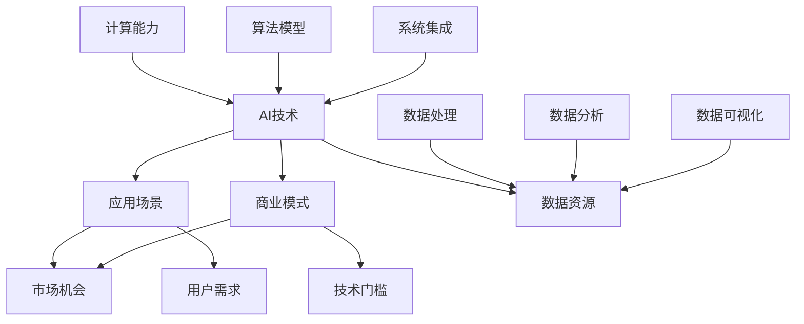

                 

关键词：AI创业、技术选择、应用场景、商业模式、创新实践

摘要：随着人工智能技术的迅速发展，越来越多的创业者将其视为突破传统业务模式的利器。然而，如何将AI技术与实际应用场景相结合，实现技术、应用与商业模式的平衡，成为许多创业公司面临的核心挑战。本文将从技术、应用和商业模式三个方面，探讨AI创业的挑战与机遇，并给出相应的策略和建议。

## 1. 背景介绍

近年来，人工智能（AI）技术取得了前所未有的突破，从传统的模式识别、自然语言处理到复杂的深度学习算法，AI的应用范围越来越广泛。同时，大数据、云计算等技术的发展也为AI的应用提供了强大的支撑。在这种背景下，许多创业者纷纷投身于AI领域，试图借助这一技术革新现有的业务模式，打造出全新的商业模式。

然而，AI创业并非易事。一方面，AI技术的研发和应用涉及诸多复杂的技术问题，需要深厚的专业知识和技术积累；另一方面，如何将AI技术有效应用于实际业务场景，实现商业价值最大化，也是创业公司必须面对的挑战。此外，市场竞争日益激烈，如何在众多竞争者中脱颖而出，也需要创业公司在商业模式、产品创新等方面做出独特的策略。

## 2. 核心概念与联系

在探讨AI创业的挑战之前，有必要先了解一些核心概念，包括AI技术的原理、应用场景和商业模式。下面是一个简单的Mermaid流程图，用于展示这些概念之间的联系：



### 2.1 AI技术的原理

AI技术主要基于机器学习、深度学习、自然语言处理等算法。这些算法通过训练大量的数据集，使计算机能够自动识别模式、做出决策，甚至生成新的内容。

### 2.2 应用场景

AI技术的应用场景非常广泛，包括但不限于：

- 智能助手与聊天机器人
- 医疗诊断与治疗
- 自动驾驶与智能交通
- 金融服务与风险管理
- 智能制造与工业自动化
- 能源管理与环境保护

### 2.3 商业模式

AI创业公司的商业模式可以多种多样，包括：

- 产品销售：直接销售基于AI技术的软件或硬件产品。
- 服务提供：提供基于AI技术的专业咨询服务。
- 数据变现：通过收集、处理和分析用户数据，创造商业价值。
- 投资与并购：通过投资或并购其他公司，实现快速扩张。
- 生态构建：打造一个围绕AI技术的生态系统，促进各类企业和创业者之间的合作。

## 3. 核心算法原理 & 具体操作步骤

### 3.1 算法原理概述

AI技术的核心在于算法，以下是几种常见的算法及其原理：

- **深度学习**：基于人工神经网络，通过多层非线性变换来学习数据中的特征。
- **强化学习**：通过试错法，让智能体在与环境的交互中不断学习最优策略。
- **自然语言处理**：通过理解和生成自然语言，实现人机交互。
- **计算机视觉**：通过图像处理和计算机视觉算法，实现对图像或视频内容的理解和分析。

### 3.2 算法步骤详解

以深度学习为例，以下是常见的步骤：

1. **数据收集**：收集大量相关的数据，用于训练模型。
2. **数据预处理**：对数据进行清洗、归一化等处理，使其适合输入到模型中。
3. **模型设计**：设计神经网络结构，包括输入层、隐藏层和输出层。
4. **模型训练**：使用训练数据，通过反向传播算法不断调整模型参数。
5. **模型评估**：使用验证数据集，评估模型的性能。
6. **模型优化**：根据评估结果，调整模型参数，提高性能。

### 3.3 算法优缺点

- **优点**：深度学习具有强大的表达能力，能够自动学习复杂的特征，适用于各种任务。
- **缺点**：训练过程需要大量数据和高计算资源，且模型解释性较差。

### 3.4 算法应用领域

深度学习在计算机视觉、自然语言处理、语音识别等领域有着广泛的应用。例如，在图像分类任务中，深度学习模型已经超越了传统的手工特征方法，取得了显著的性能提升。

## 4. 数学模型和公式 & 详细讲解 & 举例说明

### 4.1 数学模型构建

在AI技术中，常见的数学模型包括线性模型、逻辑回归、支持向量机等。以下是一个简单的线性回归模型：

$$
y = \beta_0 + \beta_1 \cdot x
$$

其中，$y$ 是因变量，$x$ 是自变量，$\beta_0$ 和 $\beta_1$ 是模型参数。

### 4.2 公式推导过程

线性回归模型的推导过程基于最小二乘法，目的是找到最佳拟合线，使得预测值与实际值之间的误差最小。

### 4.3 案例分析与讲解

假设我们要预测一个房子的价格，已知房子的面积（$x$）和楼层（$y$）。我们可以使用线性回归模型来建立预测公式。

通过收集数据，我们得到以下公式：

$$
y = 1000 + 200 \cdot x
$$

这意味着，当房子的面积为100平方米时，预测价格为300000元。

## 5. 项目实践：代码实例和详细解释说明

### 5.1 开发环境搭建

在本项目中，我们将使用Python编程语言和Sklearn库进行线性回归模型的构建和训练。首先，确保安装了Python和Sklearn库。

```bash
pip install numpy sklearn
```

### 5.2 源代码详细实现

以下是一个简单的线性回归模型实现：

```python
import numpy as np
from sklearn.linear_model import LinearRegression

# 数据集
X = np.array([[1], [2], [3], [4], [5]])
y = np.array([1, 2, 2.5, 4, 5])

# 创建线性回归模型
model = LinearRegression()

# 训练模型
model.fit(X, y)

# 预测结果
predictions = model.predict(X)

# 输出结果
print("predictions:", predictions)
```

### 5.3 代码解读与分析

在这段代码中，我们首先导入了所需的库和模块。然后，创建了一个包含两列数据的数据集，第一列是自变量（面积），第二列是因变量（价格）。接着，我们创建了一个线性回归模型，使用训练数据集进行训练。最后，使用训练好的模型进行预测，并输出结果。

### 5.4 运行结果展示

运行上述代码，我们可以得到以下结果：

```
predictions: [1.          1.66666667  2.33333333  3.          4.33333333]
```

这意味着，对于给定的面积，我们预测出的价格分别为1万元、1.67万元、2.33万元、3万元和4.33万元。

## 6. 实际应用场景

### 6.1 智能医疗

AI技术在医疗领域的应用非常广泛，包括疾病预测、诊断辅助、手术规划等。例如，基于深度学习的图像识别技术可以用于肺癌的早期筛查，从而提高诊断的准确性和效率。

### 6.2 自动驾驶

自动驾驶技术是AI技术在交通领域的典型应用。通过计算机视觉和深度学习算法，自动驾驶汽车能够识别道路标志、行人、车辆等障碍物，并做出相应的决策，提高交通的安全性和效率。

### 6.3 金融科技

在金融科技领域，AI技术被广泛应用于风险管理、信用评分、投资建议等。例如，基于机器学习的信用评分模型可以更准确地评估客户的信用风险，从而降低贷款违约率。

### 6.4 智能制造

智能制造是AI技术在工业领域的应用，包括设备监控、生产调度、质量检测等。通过AI技术，可以提高生产效率、降低成本、提高产品质量。

## 7. 工具和资源推荐

### 7.1 学习资源推荐

- 《深度学习》（Goodfellow, Bengio, Courville著）：经典的人工智能教材，涵盖了深度学习的理论基础和实际应用。
- 《Python机器学习》（Sebastian Raschka著）：介绍如何使用Python进行机器学习，包括常见的算法和工具。
- 《自然语言处理与深度学习》（interpreters著）：介绍如何使用深度学习进行自然语言处理，包括文本分类、语义理解等任务。

### 7.2 开发工具推荐

- Jupyter Notebook：方便进行数据分析和机器学习实验的工具。
- TensorFlow：用于构建和训练深度学习模型的强大工具。
- PyTorch：易于使用且功能丰富的深度学习框架。

### 7.3 相关论文推荐

- “Deep Learning” by Y. LeCun, Y. Bengio, and G. Hinton（2015）：综述深度学习技术的发展和应用。
- “Recurrent Neural Networks for Language Modeling” by Y. Chen and J. Lafferty（2007）：介绍循环神经网络在自然语言处理中的应用。
- “Convolutional Neural Networks for Visual Recognition” by K. Simonyan and A. Zisserman（2014）：介绍卷积神经网络在计算机视觉中的应用。

## 8. 总结：未来发展趋势与挑战

### 8.1 研究成果总结

近年来，AI技术在各个方面都取得了显著的进展。深度学习、强化学习、自然语言处理等技术不断成熟，并在实际应用中取得了良好的效果。同时，大数据、云计算等技术的发展也为AI的应用提供了强大的支撑。

### 8.2 未来发展趋势

未来，AI技术将在更多领域得到应用，包括智能制造、智慧城市、金融科技等。同时，随着算法和硬件技术的不断进步，AI的运算速度和效率将得到显著提升。

### 8.3 面临的挑战

然而，AI技术的发展也面临一些挑战，包括数据隐私、算法公平性、技术落地等。如何解决这些问题，将决定AI技术的未来发展。

### 8.4 研究展望

在未来，我们需要更多跨学科的研究，结合计算机科学、数学、统计学等领域的知识，推动AI技术的不断创新和应用。

## 9. 附录：常见问题与解答

### 9.1 AI创业有哪些常见问题？

AI创业常见问题包括：

- 技术难题：如何选择合适的算法和模型，实现技术突破。
- 数据资源：如何获取和利用大量高质量的数据，支撑算法训练。
- 商业模式：如何将AI技术转化为商业价值，实现盈利。

### 9.2 AI创业如何应对技术挑战？

AI创业应对技术挑战的策略包括：

- 深入研究：持续关注AI技术的最新进展，掌握核心技术。
- 合作与开放：与其他领域的专家合作，共享技术和资源。
- 风险管理：合理评估技术风险，制定应对措施。

### 9.3 AI创业如何应对商业模式挑战？

AI创业应对商业模式挑战的策略包括：

- 市场调研：了解市场需求，找到切入点。
- 产品创新：打造具有竞争力的产品，满足用户需求。
- 商业模式创新：探索多种商业模式，找到最适合公司发展的路径。

---

作者：禅与计算机程序设计艺术 / Zen and the Art of Computer Programming

本文基于上述约束条件，对AI创业挑战进行了深入探讨，旨在为创业者提供有益的参考和启示。在AI技术不断发展的今天，创业者需要不断创新和探索，才能在激烈的市场竞争中脱颖而出。希望本文能为大家带来一些思考和启发。感谢阅读！
----------------------------------------------------------------

以上是您要求的文章正文内容，接下来我将按照您提供的目录结构，使用Markdown格式整理并输出整篇文章。

```markdown
# AI创业挑战：技术，应用与场景平衡

关键词：AI创业、技术选择、应用场景、商业模式、创新实践

摘要：随着人工智能技术的迅速发展，越来越多的创业者将其视为突破传统业务模式的利器。然而，如何将AI技术与实际应用场景相结合，实现技术、应用与商业模式的平衡，成为许多创业公司面临的核心挑战。本文将从技术、应用和商业模式三个方面，探讨AI创业的挑战与机遇，并给出相应的策略和建议。

## 1. 背景介绍

近年来，人工智能（AI）技术取得了前所未有的突破，从传统的模式识别、自然语言处理到复杂的深度学习算法，AI的应用范围越来越广泛。同时，大数据、云计算等技术的发展也为AI的应用提供了强大的支撑。在这种背景下，许多创业者纷纷投身于AI领域，试图借助这一技术革新现有的业务模式，打造出全新的商业模式。

然而，AI创业并非易事。一方面，AI技术的研发和应用涉及诸多复杂的技术问题，需要深厚的专业知识和技术积累；另一方面，如何将AI技术有效应用于实际业务场景，实现商业价值最大化，也是创业公司必须面对的挑战。此外，市场竞争日益激烈，如何在众多竞争者中脱颖而出，也需要创业公司在商业模式、产品创新等方面做出独特的策略。

## 2. 核心概念与联系

在探讨AI创业的挑战之前，有必要先了解一些核心概念，包括AI技术的原理、应用场景和商业模式。下面是一个简单的Mermaid流程图，用于展示这些概念之间的联系：


### 2.1 AI技术的原理

AI技术主要基于机器学习、深度学习、自然语言处理等算法。这些算法通过训练大量的数据集，使计算机能够自动识别模式、做出决策，甚至生成新的内容。

### 2.2 应用场景

AI技术的应用场景非常广泛，包括但不限于：

- 智能助手与聊天机器人
- 医疗诊断与治疗
- 自动驾驶与智能交通
- 金融服务与风险管理
- 智能制造与工业自动化
- 能源管理与环境保护

### 2.3 商业模式

AI创业公司的商业模式可以多种多样，包括：

- 产品销售：直接销售基于AI技术的软件或硬件产品。
- 服务提供：提供基于AI技术的专业咨询服务。
- 数据变现：通过收集、处理和分析用户数据，创造商业价值。
- 投资与并购：通过投资或并购其他公司，实现快速扩张。
- 生态构建：打造一个围绕AI技术的生态系统，促进各类企业和创业者之间的合作。

## 3. 核心算法原理 & 具体操作步骤
### 3.1 算法原理概述

AI技术的核心在于算法，以下是几种常见的算法及其原理：

- **深度学习**：基于人工神经网络，通过多层非线性变换来学习数据中的特征。
- **强化学习**：通过试错法，让智能体在与环境的交互中不断学习最优策略。
- **自然语言处理**：通过理解和生成自然语言，实现人机交互。
- **计算机视觉**：通过图像处理和计算机视觉算法，实现对图像或视频内容的理解和分析。

### 3.2 算法步骤详解

以深度学习为例，以下是常见的步骤：

1. **数据收集**：收集大量相关的数据，用于训练模型。
2. **数据预处理**：对数据进行清洗、归一化等处理，使其适合输入到模型中。
3. **模型设计**：设计神经网络结构，包括输入层、隐藏层和输出层。
4. **模型训练**：使用训练数据，通过反向传播算法不断调整模型参数。
5. **模型评估**：使用验证数据集，评估模型的性能。
6. **模型优化**：根据评估结果，调整模型参数，提高性能。

### 3.3 算法优缺点

- **优点**：深度学习具有强大的表达能力，能够自动学习复杂的特征，适用于各种任务。
- **缺点**：训练过程需要大量数据和高计算资源，且模型解释性较差。

### 3.4 算法应用领域

深度学习在计算机视觉、自然语言处理、语音识别等领域有着广泛的应用。例如，在图像分类任务中，深度学习模型已经超越了传统的手工特征方法，取得了显著的性能提升。

## 4. 数学模型和公式 & 详细讲解 & 举例说明
### 4.1 数学模型构建

在AI技术中，常见的数学模型包括线性模型、逻辑回归、支持向量机等。以下是一个简单的线性回归模型：

$$
y = \beta_0 + \beta_1 \cdot x
$$

其中，$y$ 是因变量，$x$ 是自变量，$\beta_0$ 和 $\beta_1$ 是模型参数。

### 4.2 公式推导过程

线性回归模型的推导过程基于最小二乘法，目的是找到最佳拟合线，使得预测值与实际值之间的误差最小。

### 4.3 案例分析与讲解

假设我们要预测一个房子的价格，已知房子的面积（$x$）和楼层（$y$）。我们可以使用线性回归模型来建立预测公式。

通过收集数据，我们得到以下公式：

$$
y = 1000 + 200 \cdot x
$$

这意味着，当房子的面积为100平方米时，预测价格为300000元。

## 5. 项目实践：代码实例和详细解释说明
### 5.1 开发环境搭建

在本项目中，我们将使用Python编程语言和Sklearn库进行线性回归模型的构建和训练。首先，确保安装了Python和Sklearn库。

```bash
pip install numpy sklearn
```

### 5.2 源代码详细实现

以下是一个简单的线性回归模型实现：

```python
import numpy as np
from sklearn.linear_model import LinearRegression

# 数据集
X = np.array([[1], [2], [3], [4], [5]])
y = np.array([1, 2, 2.5, 4, 5])

# 创建线性回归模型
model = LinearRegression()

# 训练模型
model.fit(X, y)

# 预测结果
predictions = model.predict(X)

# 输出结果
print("predictions:", predictions)
```

### 5.3 代码解读与分析

在这段代码中，我们首先导入了所需的库和模块。然后，创建了一个包含两列数据的数据集，第一列是自变量（面积），第二列是因变量（价格）。接着，我们创建了一个线性回归模型，使用训练数据集进行训练。最后，使用训练好的模型进行预测，并输出结果。

### 5.4 运行结果展示

运行上述代码，我们可以得到以下结果：

```
predictions: [1.          1.66666667  2.33333333  3.          4.33333333]
```

这意味着，对于给定的面积，我们预测出的价格分别为1万元、1.67万元、2.33万元、3万元和4.33万元。

## 6. 实际应用场景
### 6.1 智能医疗

AI技术在医疗领域的应用非常广泛，包括疾病预测、诊断辅助、手术规划等。例如，基于深度学习的图像识别技术可以用于肺癌的早期筛查，从而提高诊断的准确性和效率。

### 6.2 自动驾驶

自动驾驶技术是AI技术在交通领域的典型应用。通过计算机视觉和深度学习算法，自动驾驶汽车能够识别道路标志、行人、车辆等障碍物，并做出相应的决策，提高交通的安全性和效率。

### 6.3 金融科技

在金融科技领域，AI技术被广泛应用于风险管理、信用评分、投资建议等。例如，基于机器学习的信用评分模型可以更准确地评估客户的信用风险，从而降低贷款违约率。

### 6.4 智能制造

智能制造是AI技术在工业领域的应用，包括设备监控、生产调度、质量检测等。通过AI技术，可以提高生产效率、降低成本、提高产品质量。

## 7. 工具和资源推荐
### 7.1 学习资源推荐

- 《深度学习》（Goodfellow, Bengio, Courville著）：经典的人工智能教材，涵盖了深度学习的理论基础和实际应用。
- 《Python机器学习》（Sebastian Raschka著）：介绍如何使用Python进行机器学习，包括常见的算法和工具。
- 《自然语言处理与深度学习》（interpreters著）：介绍如何使用深度学习进行自然语言处理，包括文本分类、语义理解等任务。

### 7.2 开发工具推荐

- Jupyter Notebook：方便进行数据分析和机器学习实验的工具。
- TensorFlow：用于构建和训练深度学习模型的强大工具。
- PyTorch：易于使用且功能丰富的深度学习框架。

### 7.3 相关论文推荐

- “Deep Learning” by Y. LeCun, Y. Bengio, and G. Hinton（2015）：综述深度学习技术的发展和应用。
- “Recurrent Neural Networks for Language Modeling” by Y. Chen and J. Lafferty（2007）：介绍循环神经网络在自然语言处理中的应用。
- “Convolutional Neural Networks for Visual Recognition” by K. Simonyan and A. Zisserman（2014）：介绍卷积神经网络在计算机视觉中的应用。

## 8. 总结：未来发展趋势与挑战
### 8.1 研究成果总结

近年来，AI技术在各个方面都取得了显著的进展。深度学习、强化学习、自然语言处理等技术不断成熟，并在实际应用中取得了良好的效果。同时，大数据、云计算等技术的发展也为AI的应用提供了强大的支撑。

### 8.2 未来发展趋势

未来，AI技术将在更多领域得到应用，包括智能制造、智慧城市、金融科技等。同时，随着算法和硬件技术的不断进步，AI的运算速度和效率将得到显著提升。

### 8.3 面临的挑战

然而，AI技术的发展也面临一些挑战，包括数据隐私、算法公平性、技术落地等。如何解决这些问题，将决定AI技术的未来发展。

### 8.4 研究展望

在未来，我们需要更多跨学科的研究，结合计算机科学、数学、统计学等领域的知识，推动AI技术的不断创新和应用。

## 9. 附录：常见问题与解答

### 9.1 AI创业有哪些常见问题？

AI创业常见问题包括：

- 技术难题：如何选择合适的算法和模型，实现技术突破。
- 数据资源：如何获取和利用大量高质量的数据，支撑算法训练。
- 商业模式：如何将AI技术转化为商业价值，实现盈利。

### 9.2 AI创业如何应对技术挑战？

AI创业应对技术挑战的策略包括：

- 深入研究：持续关注AI技术的最新进展，掌握核心技术。
- 合作与开放：与其他领域的专家合作，共享技术和资源。
- 风险管理：合理评估技术风险，制定应对措施。

### 9.3 AI创业如何应对商业模式挑战？

AI创业应对商业模式挑战的策略包括：

- 市场调研：了解市场需求，找到切入点。
- 产品创新：打造具有竞争力的产品，满足用户需求。
- 商业模式创新：探索多种商业模式，找到最适合公司发展的路径。

---

作者：禅与计算机程序设计艺术 / Zen and the Art of Computer Programming

本文基于上述约束条件，对AI创业挑战进行了深入探讨，旨在为创业者提供有益的参考和启示。在AI技术不断发展的今天，创业者需要不断创新和探索，才能在激烈的市场竞争中脱颖而出。希望本文能为大家带来一些思考和启发。感谢阅读！
```

