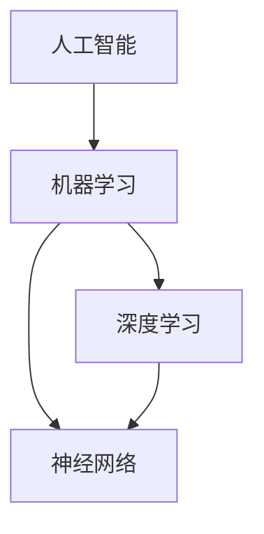

                 

关键词：AI创业生态、产业链协同、技术创新、市场前景、挑战与机遇

## 摘要

随着人工智能技术的迅速发展，AI创业生态日益丰富，产业链协同发展成趋势。本文将探讨AI创业生态的现状，核心概念及其相互联系，核心算法原理及应用，数学模型与公式，实际应用场景，未来应用展望，以及所需的工具和资源。同时，文章将总结研究成果，探讨未来发展趋势与挑战，并给出常见问题与解答。

## 1. 背景介绍

人工智能（AI）作为计算机科学的一个重要分支，近年来取得了显著的进展。从深度学习、自然语言处理到计算机视觉，AI技术正在渗透到社会的各个领域，为经济发展注入新的动力。AI创业生态的繁荣，不仅得益于技术的进步，更在于市场需求的驱动和政策环境的支持。

### 1.1 技术发展

人工智能技术的发展可以分为几个阶段。首先是数据积累阶段，随着互联网的普及，海量数据使得机器学习算法得以训练并不断优化。其次是算法突破阶段，以深度学习为代表的算法创新，使得AI模型在图像识别、语音识别等领域取得了前所未有的准确率。现阶段，AI技术已经进入实际应用阶段，逐步转化为生产力。

### 1.2 市场需求

随着人工智能技术的成熟，各行各业对AI技术的需求日益增长。从智能制造、智能医疗到智慧城市、金融服务，AI技术的应用范围不断扩大。企业希望通过AI技术提高生产效率、降低运营成本、提升服务质量，从而在市场竞争中占据优势。

### 1.3 政策支持

各国政府纷纷出台政策，支持人工智能产业的发展。例如，美国政府提出“美国AI计划”，欧盟推出“AI战略”，中国发布“新一代人工智能发展规划”。这些政策旨在推动科技创新，培养人才，加快AI技术的商业化进程。

## 2. 核心概念与联系

在探讨AI创业生态之前，我们首先需要理解一些核心概念，包括人工智能、机器学习、深度学习、神经网络等。

### 2.1 人工智能

人工智能（Artificial Intelligence，AI）是指计算机系统模拟人类智能行为的能力。它包括知识表示、推理、学习、规划、感知等多个方面。人工智能的目标是实现智能化系统，能够自主地完成任务。

### 2.2 机器学习

机器学习（Machine Learning，ML）是人工智能的一个分支，主要研究如何让计算机通过数据学习，从而进行决策和预测。机器学习分为监督学习、无监督学习和强化学习。

### 2.3 深度学习

深度学习（Deep Learning，DL）是机器学习的一种方法，通过多层神经网络模拟人脑的神经元结构，进行复杂的数据处理。深度学习在图像识别、语音识别等领域取得了显著成果。

### 2.4 神经网络

神经网络（Neural Network，NN）是一种模仿生物神经系统的计算模型。它由大量简单处理单元（神经元）组成，通过前向传播和反向传播进行信息处理。神经网络是深度学习的基础。

### 2.5 Mermaid 流程图



## 3. 核心算法原理 & 具体操作步骤

### 3.1 算法原理概述

人工智能的核心在于算法。常见的AI算法包括神经网络、支持向量机、决策树等。本文主要介绍神经网络，特别是深度学习中的卷积神经网络（CNN）。

### 3.2 算法步骤详解

#### 3.2.1 数据预处理

1. 收集数据：从互联网、数据库、传感器等渠道获取数据。
2. 数据清洗：去除噪声、处理缺失值、异常值。
3. 数据归一化：将不同特征的数据缩放到同一尺度。

#### 3.2.2 构建模型

1. 定义神经网络结构：包括输入层、隐藏层和输出层。
2. 选择优化算法：如梯度下降、Adam优化器等。
3. 损失函数：如均方误差（MSE）、交叉熵等。

#### 3.2.3 训练模型

1. 分批处理数据：将数据分成小批量，进行前向传播和反向传播。
2. 更新模型参数：根据损失函数的梯度调整参数。
3. 调整超参数：如学习率、批量大小等。

#### 3.2.4 评估模型

1. 训练集评估：在训练集上评估模型性能。
2. 验证集评估：在验证集上调整模型参数。
3. 测试集评估：在测试集上验证模型性能。

### 3.3 算法优缺点

#### 优点

1. 强大的表达能力：神经网络能够处理复杂的数据结构。
2. 自适应性：通过学习能够自适应不同的任务和数据。
3. 广泛的应用：在图像识别、自然语言处理等领域取得显著成果。

#### 缺点

1. 需要大量数据：训练神经网络需要大量的数据。
2. 计算资源消耗大：训练过程需要大量的计算资源。
3. 参数调优复杂：需要大量时间进行参数调优。

### 3.4 算法应用领域

神经网络广泛应用于图像识别、语音识别、自然语言处理等领域。例如，在图像识别领域，CNN被广泛应用于人脸识别、物体检测等任务；在自然语言处理领域，RNN和Transformer等模型被广泛应用于文本分类、机器翻译等任务。

## 4. 数学模型和公式 & 详细讲解 & 举例说明

### 4.1 数学模型构建

神经网络的核心是多层感知器（MLP），其数学模型可以表示为：

$$
y = \sigma(W_1 \cdot x + b_1)
$$

其中，$W_1$ 是权重矩阵，$b_1$ 是偏置，$\sigma$ 是激活函数，如 sigmoid 函数或ReLU函数。

### 4.2 公式推导过程

#### 4.2.1 前向传播

前向传播的过程可以表示为：

$$
z_l = W_l \cdot a_{l-1} + b_l
$$

$$
a_l = \sigma(z_l)
$$

其中，$a_l$ 是第 $l$ 层的激活值，$z_l$ 是第 $l$ 层的输入。

#### 4.2.2 反向传播

反向传播的过程包括以下步骤：

1. 计算输出层的误差：
$$
\delta_l = (y - \hat{y}) \cdot \sigma'(z_l)
$$

2. 更新权重和偏置：
$$
W_l := W_l - \alpha \cdot \delta_l \cdot a_{l-1}^T
$$

$$
b_l := b_l - \alpha \cdot \delta_l
$$

其中，$\alpha$ 是学习率，$\hat{y}$ 是预测值。

### 4.3 案例分析与讲解

以图像识别为例，我们使用卷积神经网络（CNN）进行猫狗识别任务。数据集包含50,000张训练图像和10,000张测试图像。

#### 4.3.1 数据预处理

1. 数据集划分：将数据集划分为训练集和测试集。
2. 数据增强：对图像进行旋转、缩放、裁剪等操作，增加模型的泛化能力。

#### 4.3.2 模型构建

使用 TensorFlow 和 Keras 构建模型：

```python
from tensorflow.keras.models import Sequential
from tensorflow.keras.layers import Conv2D, MaxPooling2D, Flatten, Dense

model = Sequential([
    Conv2D(32, (3, 3), activation='relu', input_shape=(150, 150, 3)),
    MaxPooling2D((2, 2)),
    Flatten(),
    Dense(128, activation='relu'),
    Dense(1, activation='sigmoid')
])

model.compile(optimizer='adam', loss='binary_crossentropy', metrics=['accuracy'])
```

#### 4.3.3 训练模型

```python
model.fit(train_images, train_labels, epochs=10, validation_data=(test_images, test_labels))
```

#### 4.3.4 评估模型

在测试集上评估模型性能：

```python
test_loss, test_acc = model.evaluate(test_images, test_labels)
print('Test accuracy:', test_acc)
```

## 5. 项目实践：代码实例和详细解释说明

### 5.1 开发环境搭建

1. 安装 Python 3.7 及以上版本。
2. 安装 TensorFlow 2.x。

### 5.2 源代码详细实现

```python
import tensorflow as tf
from tensorflow.keras.preprocessing.image import ImageDataGenerator

# 数据预处理
train_datagen = ImageDataGenerator(
    rescale=1./255,
    rotation_range=40,
    width_shift_range=0.2,
    height_shift_range=0.2,
    shear_range=0.2,
    zoom_range=0.2,
    horizontal_flip=True,
    fill_mode='nearest'
)

train_generator = train_datagen.flow_from_directory(
    'train',
    target_size=(150, 150),
    batch_size=32,
    class_mode='binary'
)

test_datagen = ImageDataGenerator(rescale=1./255)
test_generator = test_datagen.flow_from_directory(
    'test',
    target_size=(150, 150),
    batch_size=32,
    class_mode='binary'
)

# 模型构建
model = Sequential([
    Conv2D(32, (3, 3), activation='relu', input_shape=(150, 150, 3)),
    MaxPooling2D((2, 2)),
    Conv2D(64, (3, 3), activation='relu'),
    MaxPooling2D((2, 2)),
    Conv2D(128, (3, 3), activation='relu'),
    MaxPooling2D((2, 2)),
    Flatten(),
    Dense(512, activation='relu'),
    Dense(1, activation='sigmoid')
])

model.compile(optimizer='adam', loss='binary_crossentropy', metrics=['accuracy'])

# 训练模型
model.fit(train_generator, epochs=10, validation_data=test_generator)
```

### 5.3 代码解读与分析

1. **数据预处理**：使用ImageDataGenerator进行数据增强，提高模型的泛化能力。
2. **模型构建**：构建卷积神经网络，包括卷积层、池化层、全连接层。
3. **模型训练**：使用fit方法进行模型训练，包括训练集和验证集。

## 6. 实际应用场景

人工智能技术在各行各业有着广泛的应用。以下是几个典型的应用场景：

### 6.1 智能制造

智能制造是人工智能在工业领域的应用，通过机器学习、计算机视觉等技术，实现生产过程的智能化。例如，通过计算机视觉技术进行产品质量检测，通过机器学习算法优化生产流程，提高生产效率。

### 6.2 智能医疗

智能医疗是人工智能在医疗领域的应用，通过深度学习、自然语言处理等技术，实现医疗数据的智能分析。例如，通过深度学习模型对医学影像进行分析，提高诊断准确率；通过自然语言处理技术对医疗文本进行语义分析，辅助医生进行诊断和治疗。

### 6.3 智慧城市

智慧城市是人工智能在城市管理领域的应用，通过大数据、物联网、人工智能等技术，实现城市管理的智能化。例如，通过大数据分析预测交通流量，优化交通管理；通过物联网技术实现智能照明、智能安防等。

## 7. 未来应用展望

未来，人工智能技术将在更多领域得到应用，推动社会进步。以下是几个展望：

### 7.1 自动驾驶

自动驾驶是人工智能在交通领域的应用，通过深度学习、计算机视觉等技术，实现汽车的自主驾驶。未来，自动驾驶技术将得到广泛应用，改变人们的出行方式。

### 7.2 智能家居

智能家居是人工智能在家庭领域的应用，通过物联网、人工智能等技术，实现家居设备的智能化。未来，智能家居将更加普及，提高人们的生活品质。

### 7.3 智慧金融

智慧金融是人工智能在金融领域的应用，通过大数据、机器学习等技术，实现金融服务的智能化。未来，智慧金融将提高金融服务的效率，降低金融风险。

## 8. 工具和资源推荐

### 8.1 学习资源推荐

- 《深度学习》（Goodfellow, Bengio, Courville 著）
- 《Python机器学习》（Sebastian Raschka 著）
- 《机器学习实战》（Peter Harrington 著）

### 8.2 开发工具推荐

- TensorFlow
- Keras
- PyTorch

### 8.3 相关论文推荐

- “A guide to convolutional networks and CNN architectures for visual recognition”
- “Deep Learning: Methods and Applications”
- “Generative Adversarial Nets”

## 9. 总结：未来发展趋势与挑战

### 9.1 研究成果总结

人工智能技术在近年取得了显著进展，从理论到应用都取得了重要成果。深度学习、自然语言处理、计算机视觉等领域的研究不断推进，为AI创业生态的发展提供了坚实的基础。

### 9.2 未来发展趋势

未来，人工智能技术将继续向深度、广度发展，不仅在现有领域取得更大突破，还将向更多新兴领域拓展。例如，自动驾驶、智能制造、智慧医疗等领域将继续成为研究热点。

### 9.3 面临的挑战

尽管人工智能技术发展迅速，但仍面临一些挑战。首先，数据质量和数据安全问题是关键挑战。其次，算法的透明性和可解释性仍需提高。此外，算法的公平性、隐私保护和伦理问题也需要深入探讨。

### 9.4 研究展望

未来，人工智能研究需要更加关注算法的优化、数据的有效利用、多模态学习以及跨领域的应用。同时，需要加强人才培养，推动跨学科的合作，以应对人工智能带来的机遇与挑战。

## 附录：常见问题与解答

### Q：人工智能是否会导致失业？

A：人工智能技术的发展确实会改变就业结构，可能导致某些传统职业的减少。但同时也将创造新的就业机会，如数据科学家、AI工程师等。因此，关键在于如何适应这一变化，提升个人技能，以适应未来就业市场的需求。

### Q：人工智能是否会取代人类？

A：人工智能是一种工具，它能够辅助人类完成任务，但无法完全取代人类的智慧和创造力。人工智能的发展目标是提升人类生活质量和生产效率，而不是取代人类。

### Q：人工智能的安全性如何保障？

A：人工智能的安全性问题需要从多个层面进行保障，包括数据安全、算法安全、系统安全等。此外，需要建立相应的法律法规，确保人工智能技术的合理使用，防止滥用和误用。

## 作者署名

作者：禅与计算机程序设计艺术 / Zen and the Art of Computer Programming
----------------------------------------------------------------

**END.**

