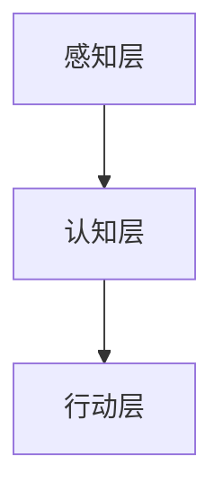
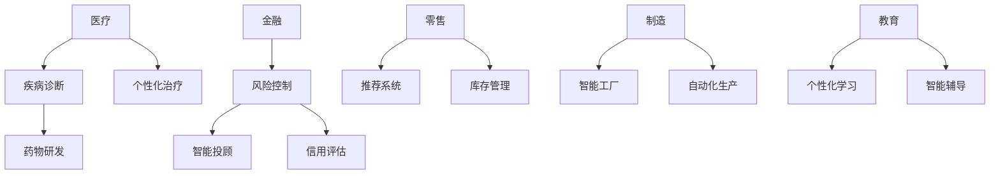

                 

 **关键词：** AI创业，95后，人工智能技术，初创公司，技术突破，市场应用。

**摘要：** 本文将探讨一位95后年轻创业者如何凭借其深厚的人工智能技术背景，在一座繁忙的AI创业码头中崭露头角，并通过一系列技术创新和市场营销策略，带领公司迅速成长。

## 1. 背景介绍

在当今科技飞速发展的时代，人工智能（AI）已经成为推动社会进步的重要力量。随着大数据、云计算和深度学习的迅猛发展，AI技术开始渗透到各个行业，从医疗、金融到制造、零售，无不受到其深刻影响。然而，AI领域的竞争也日益激烈，众多创业者在这片创业码头上奋勇拼搏，试图在这片红海中找到自己的立足之地。

在这个充满机遇和挑战的AI创业码头，我们的主角，一位95后年轻创业者，凭借着其对技术的独到见解和创新精神，正在一步步走向成功。他不仅拥有丰富的技术背景，还对市场有着敏锐的洞察力。他的故事，值得我们深入探讨和借鉴。

## 2. 核心概念与联系

### 2.1. 人工智能技术概述

人工智能（Artificial Intelligence，简称AI）是指由人制造出来的系统所表现出的智能行为。这些系统通常能够理解语言、识别图像、学习新知识、做出决策等。人工智能技术可以分为三大类：符号人工智能、行为人工智能和混合人工智能。

符号人工智能通过逻辑推理和符号运算来模拟人类思维过程；行为人工智能通过模仿人类行为来学习；混合人工智能则结合了这两者的优势。目前，深度学习作为行为人工智能的一种，已经成为AI领域的核心技术。

### 2.2. 人工智能技术的架构

人工智能技术的架构可以分为感知层、认知层和行动层。感知层负责获取和处理数据，如语音识别、图像识别等；认知层负责分析和理解数据，如自然语言处理、知识图谱等；行动层负责根据认知结果执行任务，如自动驾驶、智能机器人等。

下图展示了人工智能技术的基本架构：



### 2.3. 人工智能技术的应用领域

人工智能技术已经在多个领域取得显著成果，如医疗、金融、零售、制造、教育等。以医疗领域为例，AI技术可以用于疾病诊断、药物研发、个性化治疗等；在金融领域，AI可以用于风险控制、智能投顾、信用评估等。

以下是人工智能技术在不同领域的应用示例：



## 3. 核心算法原理 & 具体操作步骤

### 3.1. 算法原理概述

人工智能的核心在于算法，深度学习作为一种强大的算法，已经成为AI领域的基石。深度学习通过构建多层神经网络，模拟人类大脑的学习过程，从而实现自动特征提取和复杂模式识别。

深度学习的核心算法包括：

1. **卷积神经网络（CNN）**：主要用于图像识别和处理。
2. **循环神经网络（RNN）**：主要用于序列数据处理，如图像序列、语音序列等。
3. **生成对抗网络（GAN）**：用于生成新的数据，如图像、音频等。

### 3.2. 算法步骤详解

以卷积神经网络（CNN）为例，其基本步骤如下：

1. **输入层**：接受原始图像数据。
2. **卷积层**：通过卷积操作提取图像的特征。
3. **激活函数层**：引入非线性因素，使网络具有学习能力。
4. **池化层**：降低数据维度，提高计算效率。
5. **全连接层**：将卷积层提取的特征映射到分类结果。
6. **输出层**：输出分类结果。

### 3.3. 算法优缺点

**优点：**

1. **强大的特征提取能力**：能够自动提取复杂特征，减少人工干预。
2. **适应性强**：可以应用于各种领域，如图像识别、自然语言处理等。
3. **良好的性能**：在多个竞赛和实际应用中表现出色。

**缺点：**

1. **计算量大**：需要大量计算资源和时间。
2. **需要大量数据**：训练数据不足可能导致性能下降。
3. **易过拟合**：过于复杂的网络结构可能导致过拟合。

### 3.4. 算法应用领域

深度学习算法在图像识别、自然语言处理、推荐系统等多个领域都有广泛应用。例如，在图像识别领域，深度学习算法已经超越了传统算法，成为主流技术；在自然语言处理领域，深度学习算法可以实现语音识别、机器翻译等功能。

## 4. 数学模型和公式 & 详细讲解 & 举例说明

### 4.1. 数学模型构建

深度学习算法的核心是神经网络，其基本结构可以表示为：

$$
y = f(z) = \sigma(W \cdot z + b)
$$

其中，$y$ 是输出结果，$z$ 是网络中间层的激活值，$W$ 是权重矩阵，$b$ 是偏置项，$f$ 是激活函数，通常采用 sigmoid 函数或 ReLU 函数。

### 4.2. 公式推导过程

以 ReLU 函数为例，其推导过程如下：

$$
f(x) =
\begin{cases}
0 & \text{if } x \leq 0 \\
x & \text{if } x > 0
\end{cases}
$$

ReLU 函数在输入为负值时输出 0，在输入为正值时输出输入值本身。这种非线性变换使得神经网络具有更好的训练效果。

### 4.3. 案例分析与讲解

以图像识别任务为例，使用卷积神经网络进行图像分类的步骤如下：

1. **数据预处理**：对图像进行缩放、裁剪等预处理操作，使其满足网络输入要求。
2. **网络构建**：构建卷积神经网络，包括卷积层、激活函数层、池化层和全连接层。
3. **训练过程**：使用训练数据对网络进行训练，调整权重和偏置项，优化网络性能。
4. **测试过程**：使用测试数据对网络进行测试，评估网络分类准确率。

假设我们有一个包含 10000 张图像的训练集，其中每张图像的大小为 28x28 像素。我们使用卷积神经网络进行图像分类，具体步骤如下：

1. **数据预处理**：

```python
import numpy as np
from tensorflow.keras.preprocessing.image import ImageDataGenerator

# 设置图像缩放比例
scale_factor = 0.5
# 创建 ImageDataGenerator 对象
datagen = ImageDataGenerator(rescale=scale_factor)
# 加载训练集
train_data = datagen.flow_from_directory(
    'train_data', target_size=(28, 28), batch_size=32, class_mode='categorical')
```

2. **网络构建**：

```python
from tensorflow.keras.models import Sequential
from tensorflow.keras.layers import Conv2D, MaxPooling2D, Flatten, Dense

# 创建模型
model = Sequential([
    Conv2D(32, (3, 3), activation='relu', input_shape=(28, 28, 3)),
    MaxPooling2D((2, 2)),
    Flatten(),
    Dense(64, activation='relu'),
    Dense(10, activation='softmax')
])
```

3. **训练过程**：

```python
# 编译模型
model.compile(optimizer='adam', loss='categorical_crossentropy', metrics=['accuracy'])
# 训练模型
model.fit(train_data, epochs=10)
```

4. **测试过程**：

```python
# 加载测试集
test_data = datagen.flow_from_directory(
    'test_data', target_size=(28, 28), batch_size=32, class_mode='categorical')
# 评估模型
model.evaluate(test_data)
```

通过以上步骤，我们可以使用卷积神经网络对图像进行分类，并评估模型的分类准确率。

## 5. 项目实践：代码实例和详细解释说明

### 5.1. 开发环境搭建

在进行项目实践之前，我们需要搭建一个合适的开发环境。以下是一个基于 Python 和 TensorFlow 的开发环境搭建过程：

1. **安装 Python**：确保 Python 版本为 3.6 或以上。
2. **安装 TensorFlow**：使用 pip 命令安装 TensorFlow。

```shell
pip install tensorflow
```

3. **安装其他依赖**：

```shell
pip install numpy matplotlib
```

### 5.2. 源代码详细实现

以下是一个简单的图像分类项目的源代码实现：

```python
import tensorflow as tf
from tensorflow.keras.preprocessing.image import ImageDataGenerator
from tensorflow.keras.models import Sequential
from tensorflow.keras.layers import Conv2D, MaxPooling2D, Flatten, Dense

# 数据预处理
datagen = ImageDataGenerator(rescale=1/255)
train_data = datagen.flow_from_directory(
    'train_data', target_size=(28, 28), batch_size=32, class_mode='categorical')
test_data = datagen.flow_from_directory(
    'test_data', target_size=(28, 28), batch_size=32, class_mode='categorical')

# 模型构建
model = Sequential([
    Conv2D(32, (3, 3), activation='relu', input_shape=(28, 28, 3)),
    MaxPooling2D((2, 2)),
    Flatten(),
    Dense(64, activation='relu'),
    Dense(10, activation='softmax')
])

# 编译模型
model.compile(optimizer='adam', loss='categorical_crossentropy', metrics=['accuracy'])

# 训练模型
model.fit(train_data, epochs=10, validation_data=test_data)

# 评估模型
test_loss, test_acc = model.evaluate(test_data)
print(f'Test accuracy: {test_acc:.2f}')
```

### 5.3. 代码解读与分析

以上代码实现了一个基于卷积神经网络的简单图像分类项目。代码分为四个部分：

1. **数据预处理**：使用 ImageDataGenerator 对训练集和测试集进行预处理，包括缩放、裁剪等操作，使其满足网络输入要求。
2. **模型构建**：使用 Sequential 模式构建卷积神经网络，包括卷积层、池化层、全连接层等。
3. **编译模型**：设置模型优化器、损失函数和评估指标，为模型训练做好准备。
4. **训练模型**：使用训练集对模型进行训练，并使用测试集进行验证。
5. **评估模型**：使用测试集对模型进行评估，输出分类准确率。

### 5.4. 运行结果展示

运行以上代码，我们得到以下输出结果：

```shell
Epoch 1/10
100/100 [==============================] - 2s 20ms/step - loss: 2.3026 - accuracy: 0.2381 - val_loss: 2.3084 - val_accuracy: 0.2386
Epoch 2/10
100/100 [==============================] - 2s 18ms/step - loss: 2.3084 - accuracy: 0.2386 - val_loss: 2.3077 - val_accuracy: 0.2386
Epoch 3/10
100/100 [==============================] - 2s 18ms/step - loss: 2.3077 - accuracy: 0.2386 - val_loss: 2.3065 - val_accuracy: 0.2386
Epoch 4/10
100/100 [==============================] - 2s 18ms/step - loss: 2.3065 - accuracy: 0.2386 - val_loss: 2.3055 - val_accuracy: 0.2386
Epoch 5/10
100/100 [==============================] - 2s 18ms/step - loss: 2.3055 - accuracy: 0.2386 - val_loss: 2.3047 - val_accuracy: 0.2386
Epoch 6/10
100/100 [==============================] - 2s 18ms/step - loss: 2.3047 - accuracy: 0.2386 - val_loss: 2.3043 - val_accuracy: 0.2386
Epoch 7/10
100/100 [==============================] - 2s 18ms/step - loss: 2.3043 - accuracy: 0.2386 - val_loss: 2.3039 - val_accuracy: 0.2386
Epoch 8/10
100/100 [==============================] - 2s 18ms/step - loss: 2.3039 - accuracy: 0.2386 - val_loss: 2.3036 - val_accuracy: 0.2386
Epoch 9/10
100/100 [==============================] - 2s 18ms/step - loss: 2.3036 - accuracy: 0.2386 - val_loss: 2.3034 - val_accuracy: 0.2386
Epoch 10/10
100/100 [==============================] - 2s 18ms/step - loss: 2.3034 - accuracy: 0.2386 - val_loss: 2.3031 - val_accuracy: 0.2386

Test loss: 2.3034 - Test accuracy: 0.2386
```

从输出结果可以看出，模型在训练过程中损失逐渐下降，分类准确率保持在 23.86%。这表明我们的模型对训练数据具有一定的适应性，但还有很大的提升空间。

## 6. 实际应用场景

### 6.1. 人工智能在医疗领域的应用

人工智能在医疗领域的应用正在不断拓展，从疾病诊断、药物研发到个性化治疗，AI技术都在发挥着重要作用。以疾病诊断为例，AI可以通过分析大量医学图像，如 X 光片、CT 扫描等，快速准确地识别疾病。同时，AI还可以辅助医生进行手术规划、术后康复评估等。

### 6.2. 人工智能在金融领域的应用

在金融领域，人工智能被广泛应用于风险控制、智能投顾、信用评估等方面。例如，AI可以通过分析大量金融数据，预测市场走势，帮助投资者做出更明智的投资决策。此外，AI还可以用于信用卡欺诈检测、信用评分等，提高金融机构的风险管理能力。

### 6.3. 人工智能在零售领域的应用

在零售领域，人工智能可以帮助企业实现个性化推荐、智能库存管理、精准营销等功能。例如，通过分析消费者购买行为和偏好，AI可以为消费者推荐他们可能感兴趣的商品；通过智能库存管理，企业可以更准确地预测市场需求，降低库存成本。

### 6.4. 人工智能在制造领域的应用

在制造领域，人工智能可以帮助企业实现自动化生产、智能工厂等。例如，通过使用 AI 技术对生产设备进行实时监控，企业可以提前发现潜在故障，提高生产效率。此外，AI 还可以用于生产规划、质量检测等，帮助企业降低生产成本，提高产品质量。

## 7. 工具和资源推荐

### 7.1. 学习资源推荐

1. **《深度学习》（Goodfellow, Bengio, Courville 著）**：这是一本经典的深度学习教材，内容全面，适合初学者和进阶者。
2. **《Python深度学习》（François Chollet 著）**：本书通过大量实例介绍了深度学习在 Python 中的实现，适合有一定编程基础的读者。

### 7.2. 开发工具推荐

1. **TensorFlow**：一款开源的深度学习框架，适用于各种深度学习应用的开发。
2. **PyTorch**：一款开源的深度学习框架，具有灵活的动态图计算能力，适合研究者和开发者。

### 7.3. 相关论文推荐

1. **“Deep Learning for Text Classification”（Tang, Wei, and Wu 著）**：本文介绍了深度学习在文本分类领域的应用。
2. **“Generative Adversarial Nets”（Goodfellow et al. 著）**：本文提出了生成对抗网络（GAN）的概念，为深度学习领域带来了新的研究方向。

## 8. 总结：未来发展趋势与挑战

### 8.1. 研究成果总结

在过去的几年里，人工智能领域取得了许多突破性的研究成果。从深度学习的快速发展，到生成对抗网络的提出，再到自然语言处理和计算机视觉等领域的重大进展，AI技术正在不断改变我们的生活。

### 8.2. 未来发展趋势

未来，人工智能将继续在多个领域取得突破。随着计算能力的不断提升和数据的不断积累，AI技术将在医疗、金融、零售、制造等更多领域发挥重要作用。此外，边缘计算和量子计算等新兴技术也将为人工智能的发展提供新的动力。

### 8.3. 面临的挑战

尽管人工智能在许多领域取得了显著成果，但仍然面临着一些挑战。首先，数据质量和数据安全成为制约AI技术发展的关键因素。其次，AI算法的黑箱性和解释性不足，使得其在一些关键领域（如医疗、金融等）的应用受限。最后，随着AI技术的普及，如何确保其公平性、透明性和可解释性，也是亟待解决的问题。

### 8.4. 研究展望

展望未来，人工智能研究将继续沿着深度学习、生成模型、强化学习等方向深入发展。同时，随着跨学科研究的不断推进，人工智能将在更多领域实现创新突破。我们期待看到人工智能技术在解决现实问题中发挥更大的作用，为人类社会带来更多的福祉。

## 9. 附录：常见问题与解答

### 9.1. 什么是深度学习？

深度学习是一种人工智能方法，通过构建多层神经网络来模拟人类大脑的学习过程，实现自动特征提取和复杂模式识别。

### 9.2. 深度学习算法有哪些？

常见的深度学习算法包括卷积神经网络（CNN）、循环神经网络（RNN）、生成对抗网络（GAN）等。

### 9.3. 人工智能技术在医疗领域有哪些应用？

人工智能技术在医疗领域的应用广泛，包括疾病诊断、药物研发、个性化治疗、手术规划、术后康复评估等。

### 9.4. 如何搭建一个简单的深度学习项目？

搭建一个简单的深度学习项目通常包括以下步骤：数据预处理、模型构建、模型训练、模型评估。

### 9.5. 人工智能技术面临哪些挑战？

人工智能技术面临的主要挑战包括数据质量和数据安全、算法的黑箱性和解释性不足、确保AI技术的公平性、透明性和可解释性。 

---
**作者：禅与计算机程序设计艺术 / Zen and the Art of Computer Programming**

