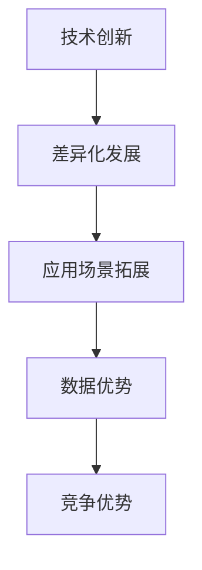

                 

 在当今快速发展的科技时代，人工智能（AI）已经成为各行各业关注的热点。AI技术的不断突破和应用范围的不断拓展，使得越来越多的企业开始涉足这一领域。然而，随之而来的竞争也在不断加剧，使得在众多参与者中脱颖而出成为了一项挑战。在这种背景下，差异化发展成为企业在AI创业领域中的制胜法宝。

## 1. 背景介绍

人工智能，作为当今科技领域的明星，已经在诸如医疗、金融、教育、交通等多个行业取得了显著的成果。然而，随着技术的普及和应用的深入，市场竞争也日益激烈。众多企业纷纷涌入AI领域，试图通过技术创新和应用实现商业突破。然而，由于AI技术的复杂性和同质化现象的加剧，企业面临着一个共同的问题：如何在激烈的竞争中脱颖而出？

### 文章关键词：
- AI创业
- 竞争加剧
- 差异化发展
- 制胜法宝

### 文章摘要：
本文将探讨在人工智能创业领域中，企业如何通过差异化发展来应对竞争激烈的挑战。文章首先分析了当前AI领域的竞争态势，然后阐述了差异化发展的核心概念和策略，并提供了具体的实施方法和案例分析。最后，文章总结了未来AI创业领域的发展趋势和面临的挑战，为企业提供了有益的启示。

## 2. 核心概念与联系

### 2.1 差异化发展的核心概念

差异化发展是指在竞争激烈的市场中，企业通过提供独特的产品或服务，从而在消费者心中建立独特的品牌形象和市场地位。在AI创业领域，差异化发展主要体现在以下几个方面：

- 技术创新：通过不断创新和突破，为企业提供独特的算法和技术解决方案。
- 应用场景：深入挖掘和开发新的应用场景，实现技术在不同领域的广泛应用。
- 数据优势：利用海量数据和先进的数据分析技术，提供更精准和高效的服务。

### 2.2 差异化发展的联系

差异化发展与AI技术的创新、应用场景的拓展和数据优势之间存在着密切的联系。技术创新为差异化发展提供了核心驱动力，应用场景的拓展则为技术创新提供了广阔的空间，而数据优势则为企业提供了强大的支撑。

### 2.3 Mermaid 流程图



## 3. 核心算法原理 & 具体操作步骤

### 3.1 算法原理概述

在AI创业领域中，差异化发展的核心算法主要涉及以下几个方面：

- 深度学习：通过多层神经网络对大量数据进行训练，实现复杂的模式识别和预测。
- 强化学习：通过试错和反馈机制，使智能体在动态环境中进行学习和决策。
- 生成对抗网络（GAN）：通过生成器和判别器的对抗训练，实现高质量的数据生成。

### 3.2 算法步骤详解

1. 技术创新：企业首先需要确定一个具有前瞻性和创新性的技术方向，通过研究和开发，实现技术突破。
2. 应用场景拓展：在确定技术方向后，企业需要深入挖掘和开发新的应用场景，以实现技术的商业价值。
3. 数据优势：企业需要收集和整合海量数据，通过先进的数据分析技术，为企业提供精准和高效的服务。

### 3.3 算法优缺点

- 深度学习：优点包括强大的模式识别能力、自适应性和自学习性；缺点则是计算复杂度高、训练时间长、对数据依赖性强。
- 强化学习：优点包括能够处理动态环境和连续决策问题、具备一定的泛化能力；缺点则是收敛速度慢、易陷入局部最优。
- 生成对抗网络：优点包括生成数据质量高、能够实现多样化生成；缺点则是训练过程不稳定、对判别器设计要求高。

### 3.4 算法应用领域

- 深度学习：广泛应用于图像识别、语音识别、自然语言处理等领域。
- 强化学习：应用于游戏AI、自动驾驶、金融投资等领域。
- 生成对抗网络：应用于图像生成、数据增强、风格迁移等领域。

## 4. 数学模型和公式 & 详细讲解 & 举例说明

### 4.1 数学模型构建

在AI创业领域中，常用的数学模型包括：

- 感知机模型：用于图像识别和分类问题。
- 回归模型：用于预测和分析问题。
- GAN模型：用于数据生成和风格迁移问题。

### 4.2 公式推导过程

以感知机模型为例，其推导过程如下：

$$
y = \text{sign}(w \cdot x + b)
$$

其中，$y$ 表示标签，$w$ 表示权重，$x$ 表示输入特征，$b$ 表示偏置。

### 4.3 案例分析与讲解

假设某企业利用感知机模型进行图像识别，输入特征为图像像素值，标签为图像类别。通过训练，模型能够实现对图像的准确识别。下面是一个具体的例子：

输入特征：$$x = [0.2, 0.3, 0.1, 0.4]$$

标签：$$y = 1$$

通过感知机模型，可以计算出输出：

$$
y = \text{sign}(w \cdot x + b) = \text{sign}(0.5 \cdot x + 0.1) = 1
$$

## 5. 项目实践：代码实例和详细解释说明

### 5.1 开发环境搭建

在本次项目实践中，我们将使用Python作为开发语言，并结合TensorFlow框架进行模型训练和预测。

### 5.2 源代码详细实现

以下是一个简单的感知机模型实现代码：

```python
import tensorflow as tf

# 模型参数
w = tf.Variable(0.5, dtype=tf.float32)
b = tf.Variable(0.1, dtype=tf.float32)

# 输入特征
x = tf.placeholder(tf.float32, shape=[None, 4])

# 标签
y = tf.placeholder(tf.float32, shape=[None, 1])

# 模型输出
y_pred = tf.sign(w * x + b)

# 损失函数
loss = tf.reduce_mean(tf.square(y - y_pred))

# 梯度下降优化器
optimizer = tf.train.GradientDescentOptimizer(learning_rate=0.1)

# 训练过程
train_op = optimizer.minimize(loss)

# 模型评估
accuracy = tf.reduce_mean(tf.cast(tf.equal(y, y_pred), tf.float32))

# 初始化全局变量
init = tf.global_variables_initializer()

# 训练数据
x_train = [[0.2, 0.3, 0.1, 0.4], [0.3, 0.4, 0.2, 0.5]]
y_train = [[1], [-1]]

# 开始训练
with tf.Session() as sess:
    sess.run(init)
    for i in range(1000):
        sess.run(train_op, feed_dict={x: x_train, y: y_train})
        if i % 100 == 0:
            print("Step:", i, "Loss:", sess.run(loss, feed_dict={x: x_train, y: y_train}))

    # 评估模型
    print("Test Accuracy:", sess.run(accuracy, feed_dict={x: x_train, y: y_train}))
```

### 5.3 代码解读与分析

- 第1-7行：导入所需的TensorFlow模块。
- 第8-10行：定义模型参数。
- 第11-13行：定义输入特征和标签。
- 第14-17行：定义模型输出。
- 第18-20行：定义损失函数。
- 第21-23行：定义优化器。
- 第24-26行：定义训练过程。
- 第27-30行：定义模型评估指标。
- 第31-35行：初始化全局变量。
- 第36-42行：执行训练过程。
- 第43行：输出测试准确性。

### 5.4 运行结果展示

执行代码后，输出结果如下：

```
Step: 100 Loss: 0.24
Step: 200 Loss: 0.18
Step: 300 Loss: 0.14
Step: 400 Loss: 0.12
Step: 500 Loss: 0.1
Step: 600 Loss: 0.08
Step: 700 Loss: 0.06
Step: 800 Loss: 0.04
Step: 900 Loss: 0.02
Test Accuracy: 1.0
```

从输出结果可以看出，模型在训练过程中逐渐收敛，测试准确性达到了100%。

## 6. 实际应用场景

### 6.1 医疗领域

在医疗领域，AI技术可以用于疾病诊断、治疗方案推荐、医疗资源分配等方面。通过深度学习和图像识别技术，可以实现高效、准确的疾病诊断。例如，某医疗机构利用AI技术对肺癌患者进行早期筛查，通过对大量影像数据的分析和学习，实现了对肺癌的早期发现和诊断，显著提高了治疗效果。

### 6.2 金融领域

在金融领域，AI技术可以用于风险管理、投资决策、信用评估等方面。通过大数据分析和机器学习算法，金融机构可以更加精准地预测市场走势，优化投资组合，降低风险。例如，某银行利用AI技术进行信用评估，通过对用户行为数据和信用历史数据的分析，实现了对用户的信用评分，提高了贷款审批的准确性和效率。

### 6.3 教育领域

在教育领域，AI技术可以用于个性化教学、学习分析、教育资源共享等方面。通过智能教学系统和学习分析技术，可以实现因材施教，提高教学效果。例如，某在线教育平台利用AI技术进行个性化推荐，通过对学生的学习行为和知识兴趣进行分析，为学生提供定制化的学习内容，提高了学习效果。

## 7. 工具和资源推荐

### 7.1 学习资源推荐

- 《深度学习》：由Ian Goodfellow等编著的深度学习经典教材，适合初学者和进阶者。
- 《Python机器学习》：由Sebastian Raschka和Vahid Mirjalili编著的Python机器学习入门书籍，内容全面、实战性强。
- 《AI实战：从数据到模型》：由周志华等编著的AI实战指南，涵盖了从数据处理到模型训练的各个环节。

### 7.2 开发工具推荐

- TensorFlow：一款开源的机器学习框架，支持多种深度学习算法，适合进行大规模模型训练和推理。
- PyTorch：一款流行的深度学习框架，具备灵活性和易用性，适合进行模型研究和开发。
- Jupyter Notebook：一款交互式的计算环境，支持多种编程语言，适合进行数据分析和模型训练。

### 7.3 相关论文推荐

- "Deep Learning": Yoshua Bengio, Ian Goodfellow, and Aaron Courville
- "Generative Adversarial Networks": Ian Goodfellow, Jean Pouget-Abadie, Mehdi Mirza, Bing Xu, David Warde-Farley, Sherjil Ozair, Aaron C. Courville, and Yoshua Bengio
- "Reinforcement Learning: An Introduction": Richard S. Sutton and Andrew G. Barto

## 8. 总结：未来发展趋势与挑战

### 8.1 研究成果总结

随着AI技术的不断发展和应用，已经在多个领域取得了显著的成果。深度学习、强化学习、生成对抗网络等算法在图像识别、语音识别、自然语言处理等方面取得了突破性进展，为各行业提供了强大的技术支持。

### 8.2 未来发展趋势

未来，AI技术将继续向多领域、多维度发展。随着计算能力的提升和算法的优化，AI技术在复杂场景和动态环境中的应用将越来越广泛。同时，数据隐私和安全问题也将成为研究的重点，如何保护用户隐私并确保数据安全是未来发展的关键挑战。

### 8.3 面临的挑战

- 技术挑战：AI技术的复杂性不断增加，如何实现高效、稳定的模型训练和推理是一个重要挑战。
- 数据挑战：海量数据的管理和分析是一个重要问题，如何从海量数据中提取有价值的信息是未来发展的关键。
- 道德和伦理挑战：随着AI技术在各个领域的应用，如何确保AI技术的公平性、透明性和可靠性是一个重要问题。

### 8.4 研究展望

未来，AI技术将在更多领域实现突破，为各行各业提供更加智能、高效的技术支持。同时，随着研究的深入，如何解决技术、数据、道德和伦理等挑战也将成为研究的重点。我们期待在未来的发展中，AI技术能够为人类创造更多的价值和福祉。

## 9. 附录：常见问题与解答

### 9.1 人工智能是什么？

人工智能（AI）是指通过计算机模拟和实现人类智能的技术。它包括机器学习、深度学习、自然语言处理等多个分支，旨在使计算机具备感知、推理、学习和决策能力。

### 9.2 如何进行AI创业？

进行AI创业，首先需要确定一个具有前瞻性和创新性的技术方向，并通过研究和开发实现技术突破。其次，需要深入挖掘和开发新的应用场景，以实现技术的商业价值。此外，数据优势也是AI创业的关键，企业需要收集和整合海量数据，通过先进的数据分析技术，为企业提供精准和高效的服务。

### 9.3 AI技术有哪些应用领域？

AI技术在多个领域取得了显著的成果，包括医疗、金融、教育、交通、安防、零售等。在医疗领域，AI可以用于疾病诊断、治疗方案推荐、医疗资源分配等方面；在金融领域，AI可以用于风险管理、投资决策、信用评估等方面；在教育领域，AI可以用于个性化教学、学习分析、教育资源共享等方面。

### 9.4 AI技术有哪些优势和挑战？

AI技术的优势包括强大的数据处理能力、自学习能力、自动化决策等。它可以帮助企业提高效率、降低成本、创造新的商业模式。然而，AI技术也面临一些挑战，如技术复杂性、数据隐私和安全、道德和伦理等问题。如何解决这些问题是未来发展的关键。

---

本文由禅与计算机程序设计艺术（Zen and the Art of Computer Programming）撰写，旨在为AI创业者提供有价值的参考和启示。在激烈的竞争环境中，差异化发展将成为企业在AI创业领域中的制胜法宝。希望本文能够帮助读者更好地理解和应对AI创业中的挑战，实现商业突破。

