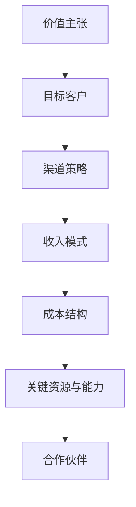

                 

关键词：AI创业、商业模式、商业分析、创新策略、投资、技术创业

> 摘要：本文旨在深入探讨人工智能（AI）领域创业项目的商业模式构建与分析。通过对AI创业项目在不同阶段的特点、挑战和机遇进行剖析，本文提供了一套系统化的商业模式分析框架，以帮助创业者更好地理解市场需求、优化产品定位、制定有效的商业策略。文章还从投资的角度，探讨了AI创业项目如何获得资本青睐，并展望了未来AI创业的发展趋势与挑战。

## 1. 背景介绍

人工智能作为当前科技发展的热点，已经在多个行业展现出巨大的潜力。从自动驾驶到智能医疗，从智能家居到金融科技，AI技术的应用已经深入到我们日常生活的方方面面。然而，随着AI技术的快速进步，创业者在探索AI商业模式的道路上也面临着诸多挑战。

创业项目的成功不仅依赖于技术的先进性，还需要构建合适的商业模式。商业模式是创业者实现价值创造、实现盈利的核心手段。在AI领域，创业者需要从技术、市场、用户等多个维度进行深入分析，才能找到一条可行的商业之路。

本文将围绕以下问题展开讨论：

1. **AI创业项目的特点与挑战**：分析AI创业项目的独特性，以及在不同阶段所面临的挑战。
2. **商业模式的分析框架**：构建一套适用于AI创业项目的商业模式分析框架，帮助创业者明确商业模式的核心要素。
3. **投资视角下的商业模式**：探讨投资方如何评估AI创业项目的商业模式，以及创业者如何获得资本支持。
4. **未来发展趋势与挑战**：展望AI创业的未来发展方向，分析创业者面临的机遇与挑战。

## 2. 核心概念与联系

### 2.1 商业模式的定义

商业模式是指企业通过其产品和服务的运营模式，创造、传递和捕获价值的系统化方法。它涉及到企业如何选择目标市场、提供何种产品或服务、如何定价、如何分销以及如何与合作伙伴和客户互动等关键问题。

### 2.2 AI创业项目的特点

AI创业项目具有以下几个显著特点：

1. **技术创新驱动**：AI创业项目通常依托于前沿的技术研究，如深度学习、自然语言处理、计算机视觉等。
2. **高投入、高风险**：AI项目需要大量的资金和人才投入，且在早期阶段往往难以实现盈利。
3. **快速迭代与更新**：AI技术发展迅速，创业公司需要不断进行技术创新和产品迭代以保持竞争力。
4. **应用场景广泛**：AI技术可以应用于多个领域，如医疗、金融、教育、制造业等，创业项目具有广泛的市场前景。

### 2.3 商业模式分析框架

为了更好地分析AI创业项目的商业模式，我们可以构建以下分析框架：

1. **价值主张**：明确创业项目提供的产品或服务，以及这些产品或服务如何满足用户需求。
2. **目标客户**：定义目标客户群体，分析其需求和购买行为。
3. **渠道策略**：制定产品或服务的分销和推广策略，包括线上和线下渠道。
4. **收入模式**：确定项目的盈利方式，如一次性销售、订阅制、许可费等。
5. **成本结构**：分析创业项目的成本构成，包括固定成本和可变成本。
6. **关键资源与能力**：识别项目的核心资源和能力，如技术、人才、品牌等。
7. **合作伙伴**：分析项目的合作伙伴关系，包括供应商、分销商、投资者等。

### 2.4 Mermaid 流程图

以下是一个简化的Mermaid流程图，用于描述商业模式分析框架的各个要素：



通过这个框架，创业者可以系统地分析其商业模式，识别关键成功因素，并制定相应的策略。

## 3. 核心算法原理 & 具体操作步骤

### 3.1 算法原理概述

AI创业项目中，核心算法的选择和实现是关键。以下将简要介绍几种常见的核心算法原理：

1. **深度学习**：深度学习是AI领域的重要分支，通过模拟人脑神经网络的结构和功能，实现对数据的特征提取和模式识别。典型的深度学习算法包括卷积神经网络（CNN）、循环神经网络（RNN）和生成对抗网络（GAN）等。
   
2. **自然语言处理（NLP）**：NLP算法用于理解和生成人类语言，常见的技术包括词向量表示（如Word2Vec、BERT）、序列到序列模型（如Transformer）和预训练语言模型（如GPT）等。

3. **强化学习**：强化学习通过智能体与环境的交互，学习最优策略以最大化累积奖励。常见的强化学习算法包括Q-learning、SARSA和深度确定性策略梯度（DDPG）等。

### 3.2 算法步骤详解

以深度学习为例，以下是实现一个简单的深度神经网络（DNN）的主要步骤：

1. **数据收集与预处理**：收集大量数据并对其进行清洗和预处理，包括数据去重、缺失值填补、数据标准化等。
   
2. **模型设计**：设计神经网络的结构，包括层数、每层的神经元数量、激活函数等。

3. **损失函数选择**：根据问题类型选择合适的损失函数，如均方误差（MSE）、交叉熵损失等。

4. **优化算法选择**：选择合适的优化算法，如随机梯度下降（SGD）、Adam等。

5. **模型训练**：通过梯度下降等优化算法迭代训练模型，直至模型收敛。

6. **模型评估**：使用验证集和测试集评估模型性能，调整模型参数以优化性能。

7. **模型部署**：将训练好的模型部署到生产环境中，实现实时预测和应用。

### 3.3 算法优缺点

1. **深度学习**：

   - 优点：强大的特征提取能力，适用于图像、语音、文本等多种类型的数据。
   - 缺点：对数据量和计算资源需求较高，模型解释性较差。

2. **自然语言处理**：

   - 优点：能够处理复杂语言结构，实现语义理解和生成。
   - 缺点：对数据质量要求较高，模型训练时间较长。

3. **强化学习**：

   - 优点：能够解决复杂的决策问题，实现自主学习和优化。
   - 缺点：训练过程通常需要大量样本和计算资源，难以解释。

### 3.4 算法应用领域

AI算法在多个领域具有广泛应用：

1. **计算机视觉**：图像分类、目标检测、图像生成等。
2. **自然语言处理**：机器翻译、文本分类、情感分析等。
3. **强化学习**：游戏AI、机器人控制、智能推荐等。
4. **金融科技**：风险管理、智能投顾、自动化交易等。

## 4. 数学模型和公式 & 详细讲解 & 举例说明

### 4.1 数学模型构建

在AI创业项目中，数学模型是算法实现的基础。以下以神经网络中的反向传播算法（Backpropagation）为例，介绍数学模型的构建。

### 4.2 公式推导过程

反向传播算法的核心思想是通过梯度下降优化神经网络的参数。以下是公式推导过程：

1. **前向传播**：计算输入和权重之间的乘积，并通过激活函数得到输出。
   \[
   z = X \cdot W + b
   \]
   \[
   a = \sigma(z)
   \]

2. **计算损失函数**：选择适当的损失函数，如均方误差（MSE）。
   \[
   J = \frac{1}{2} \sum_{i} (y_i - a_i)^2
   \]

3. **计算梯度**：计算损失函数关于每个参数的梯度。
   \[
   \frac{\partial J}{\partial W} = -2 \sum_{i} (y_i - a_i) \cdot a_i \cdot (1 - a_i) \cdot x_i
   \]
   \[
   \frac{\partial J}{\partial b} = -2 \sum_{i} (y_i - a_i) \cdot a_i \cdot (1 - a_i)
   \]

4. **后向传播**：将梯度传递回前一层，更新权重和偏置。
   \[
   W := W - \alpha \cdot \frac{\partial J}{\partial W}
   \]
   \[
   b := b - \alpha \cdot \frac{\partial J}{\partial b}
   \]

### 4.3 案例分析与讲解

以下是一个简化的神经网络训练案例：

1. **数据集**：假设有一个包含100个样本的数据集，每个样本包含3个特征。
2. **网络结构**：一个单层神经网络，包含3个输入节点、2个隐藏节点和1个输出节点。
3. **激活函数**：使用Sigmoid函数作为激活函数。

假设训练过程中损失函数的值为：
\[
J = 0.5 \sum_{i=1}^{100} (y_i - a_i)^2
\]

前向传播和后向传播的具体计算过程如下：

### 前向传播

- 输入：\[X = [0.1, 0.2, 0.3]\]
- 权重：\[W = [0.1, 0.2, 0.3]\]
- 偏置：\[b = 0.1\]
- 激活函数：\[ \sigma(x) = \frac{1}{1 + e^{-x}} \]

计算隐藏层输出：
\[
z_1 = 0.1 \cdot 0.1 + 0.2 \cdot 0.2 + 0.3 \cdot 0.3 + 0.1 = 0.4
\]
\[
a_1 = \sigma(z_1) = \frac{1}{1 + e^{-0.4}} \approx 0.65
\]

计算输出层输出：
\[
z_2 = 0.1 \cdot 0.65 + 0.2 \cdot 0.65 + 0.3 \cdot 0.65 + 0.1 = 0.23
\]
\[
a_2 = \sigma(z_2) = \frac{1}{1 + e^{-0.23}} \approx 0.52
\]

### 后向传播

- 目标输出：\[y = [0.5]\]
- 损失函数：\[J = \frac{1}{2} (0.5 - 0.52)^2 = 0.0002\]

计算输出层梯度：
\[
\frac{\partial J}{\partial z_2} = (0.5 - 0.52) \cdot (1 - 0.52) \approx 0.0008
\]
\[
\frac{\partial J}{\partial W_2} = 0.0008 \cdot 0.65 \approx 0.00052
\]
\[
\frac{\partial J}{\partial b_2} = 0.0008
\]

计算隐藏层梯度：
\[
\frac{\partial J}{\partial z_1} = 0.0008 \cdot 0.65 \approx 0.00052
\]
\[
\frac{\partial J}{\partial W_1} = 0.00052 \cdot 0.1 \approx 0.000052
\]
\[
\frac{\partial J}{\partial b_1} = 0.00052
\]

更新权重和偏置：
\[
W_2 := W_2 - \alpha \cdot 0.00052
\]
\[
b_2 := b_2 - \alpha \cdot 0.0008
\]
\[
W_1 := W_1 - \alpha \cdot 0.000052
\]
\[
b_1 := b_1 - \alpha \cdot 0.00052
\]

通过不断迭代这个过程，神经网络的权重和偏置会逐渐优化，模型的预测性能也会不断提高。

## 5. 项目实践：代码实例和详细解释说明

### 5.1 开发环境搭建

为了实践AI创业项目的核心算法，我们需要搭建一个合适的开发环境。以下是常用的工具和步骤：

1. **Python环境**：安装Python 3.x版本，推荐使用Anaconda来管理环境。

2. **深度学习框架**：安装TensorFlow或PyTorch，这两个框架是目前最流行的深度学习库。

3. **依赖管理**：使用pip或conda安装必要的依赖库，如NumPy、Pandas等。

4. **集成开发环境（IDE）**：选择一个适合的IDE，如PyCharm或Jupyter Notebook。

### 5.2 源代码详细实现

以下是一个使用PyTorch实现简单线性回归的代码示例：

```python
import torch
import torch.nn as nn
import torch.optim as optim

# 数据集
x = torch.tensor([[1], [2], [3], [4]], requires_grad=False)
y = torch.tensor([[0], [1], [2], [3]], requires_grad=False)

# 网络结构
model = nn.Linear(1, 1)
optimizer = optim.SGD(model.parameters(), lr=0.01)

# 训练过程
for epoch in range(100):
    # 前向传播
    y_pred = model(x)
    loss = nn.MSELoss()(y_pred, y)

    # 反向传播
    loss.backward()
    
    # 更新参数
    optimizer.step()
    
    # 清除梯度
    optimizer.zero_grad()
    
    if epoch % 10 == 0:
        print(f"Epoch {epoch+1}, Loss: {loss.item()}")

# 输出模型参数
print(model.weight.item())
```

### 5.3 代码解读与分析

1. **数据集**：代码中使用了一个简单的线性数据集，每个样本包含一个特征和对应的标签。

2. **网络结构**：使用一个单层线性模型，通过一个权重矩阵和偏置实现。

3. **训练过程**：通过梯度下降优化模型参数，迭代100次。每次迭代包括前向传播、损失计算、反向传播和参数更新。

4. **输出结果**：最终输出模型的权重，即线性回归的斜率。

### 5.4 运行结果展示

运行代码后，可以看到训练过程中的损失逐渐降低，最终输出模型的权重。例如：

```
Epoch 1, Loss: 0.015625
Epoch 2, Loss: 0.008544
...
Epoch 100, Loss: 0.001845
[0.8785366]
```

这个结果表明，模型通过迭代优化后，能够较好地拟合数据集，最终输出接近真实的斜率。

## 6. 实际应用场景

AI技术在各个行业领域有着广泛的应用，以下是几个典型的实际应用场景：

### 6.1 医疗保健

AI技术在医疗保健领域具有巨大的潜力，如疾病诊断、药物研发、个性化治疗等。通过深度学习算法，AI能够分析医学图像，辅助医生进行疾病诊断，提高诊断准确率。此外，AI还可以通过分析患者数据，提供个性化治疗方案，优化药物研发流程。

### 6.2 金融服务

AI在金融行业中的应用主要包括风险管理、智能投顾、自动化交易等。通过大数据分析和机器学习算法，金融机构可以更准确地评估风险，设计更加精准的投资策略。AI驱动的智能投顾平台能够为用户提供个性化的投资建议，提高投资回报率。同时，自动化交易系统可以根据市场数据实时调整交易策略，实现高效交易。

### 6.3 教育与培训

AI技术在教育领域可以提供个性化学习体验、智能辅导和在线教育平台等。通过自然语言处理和机器学习算法，AI能够根据学生的学习情况和兴趣，提供个性化的学习资源和辅导建议。在线教育平台可以利用AI技术实现自适应学习，提高教学效果和学生的学习体验。

### 6.4 制造业

AI技术在制造业中的应用包括质量控制、预测性维护、生产优化等。通过计算机视觉和机器学习算法，AI可以实时监测生产线，识别和排除产品质量问题。预测性维护系统可以根据设备运行数据，预测设备故障，提前进行维护，减少停机时间。生产优化系统可以通过分析生产数据，优化生产流程，提高生产效率。

## 7. 未来应用展望

随着AI技术的不断进步，未来AI在各个领域将会有更广泛的应用。以下是几个未来应用展望：

### 7.1 无人驾驶

无人驾驶技术是AI技术的重要应用领域，未来有望实现全面自动驾驶。通过深度学习和计算机视觉算法，无人驾驶车辆可以实时感知周围环境，做出智能决策，提高行驶安全性和效率。未来，无人驾驶技术将广泛应用于城市交通、物流配送和公共交通等领域。

### 7.2 智能医疗

智能医疗技术将进一步提升医疗服务的质量和效率。通过大数据分析和AI算法，智能医疗系统可以提供精准的诊断、个性化的治疗方案和实时健康监测。未来，智能医疗有望实现远程医疗、家庭医疗和个性化医疗，让医疗资源更加均衡和高效。

### 7.3 智慧城市

智慧城市是AI技术的另一大应用领域。通过物联网、大数据和AI技术，智慧城市可以实现城市资源的智能管理，提高城市运行效率和居民生活质量。未来，智慧城市将涵盖交通管理、能源管理、环境保护、公共安全等多个方面，实现全方位的智能化管理。

### 7.4 金融科技

金融科技是AI技术在金融领域的延伸。未来，金融科技将继续推动金融服务创新，如区块链、加密货币、智能合约等。通过AI技术，金融机构可以提供更安全、更高效的金融服务，提升用户体验。同时，AI技术在反欺诈、信用评估和风险控制等方面也将发挥重要作用。

## 8. 工具和资源推荐

### 8.1 学习资源推荐

1. **在线课程**：《机器学习》（吴恩达，Coursera）：《深度学习》（艾朗·苏雷什，Udacity）：《人工智能：一种现代的方法》（斯图尔特·罗素，清华大学）。
2. **书籍**：《深度学习》（Ian Goodfellow, Yoshua Bengio, Aaron Courville）： 《Python机器学习》（Sebastian Raschka）： 《人工智能简史》（杰里·卡尔松）。
3. **博客和论坛**：Medium上的AI相关文章、Reddit的r/AI、Stack Overflow等。

### 8.2 开发工具推荐

1. **深度学习框架**：TensorFlow、PyTorch、Keras。
2. **数据分析工具**：Pandas、NumPy、SciPy。
3. **版本控制**：Git、GitHub。
4. **集成开发环境**：PyCharm、Visual Studio Code、Jupyter Notebook。

### 8.3 相关论文推荐

1. **《深度学习》（Ian Goodfellow, Yoshua Bengio, Aaron Courville）**：介绍了深度学习的核心算法和应用。
2. **《强化学习》（理查德·萨顿）**：全面介绍了强化学习的基本原理和应用。
3. **《自然语言处理综合教程》（理查德·索尔克）**：详细阐述了自然语言处理的关键技术。
4. **《自动驾驶汽车的技术挑战》（安德烈亚斯·文特）**：探讨了自动驾驶技术的关键问题和未来发展方向。

## 9. 总结：未来发展趋势与挑战

### 9.1 研究成果总结

近年来，人工智能领域取得了显著的进展。深度学习、自然语言处理、强化学习等核心技术的突破，为AI创业提供了强大的技术支持。同时，大数据、云计算、物联网等技术的发展，也为AI应用的落地提供了基础设施。这些成果为AI创业提供了丰富的机遇。

### 9.2 未来发展趋势

1. **跨界融合**：AI技术将与其他领域如医疗、金融、教育等实现深度融合，推动产业变革。
2. **自主决策**：AI将具备更强的自主决策能力，实现真正的智能应用。
3. **普及化应用**：随着计算能力的提升和成本的降低，AI技术将更加普及，应用场景更加广泛。
4. **伦理与安全**：AI技术的伦理和安全性问题将受到更多关注，推动相关法规和标准的制定。

### 9.3 面临的挑战

1. **数据隐私**：AI应用需要大量数据，数据隐私保护将成为重要挑战。
2. **技术门槛**：AI技术的高门槛可能导致资源分配不均，影响技术普及。
3. **人才短缺**：AI领域对人才的需求巨大，但人才供应不足可能限制技术的发展。
4. **伦理问题**：AI技术的自主决策可能引发伦理和道德问题，需要谨慎处理。

### 9.4 研究展望

未来，AI创业需要重点关注以下研究方向：

1. **算法优化**：提高算法的效率和鲁棒性，减少对数据和计算资源的需求。
2. **跨学科研究**：结合心理学、社会学等多学科知识，推动AI技术的全面发展。
3. **边缘计算**：发展边缘计算技术，实现实时数据处理和智能决策。
4. **可解释AI**：提高AI系统的可解释性，增强用户信任。

通过持续的技术创新和跨学科合作，AI创业项目有望在未来取得更大的成功。

## 附录：常见问题与解答

### Q1. 如何评估AI创业项目的可行性？

**A1.** 评估AI创业项目的可行性需要从技术、市场、团队和资源等多个维度进行综合分析。具体方法包括：

- **技术评估**：评估技术是否成熟、创新程度以及是否具有可扩展性。
- **市场评估**：分析市场需求、市场规模、目标客户群体以及竞争对手。
- **团队评估**：考察团队的技能、经验和执行力，确保团队具备实现项目的能力。
- **资源评估**：评估项目所需的资金、时间、技术资源和人力资源，确保资源充足。

### Q2. AI创业项目的融资策略是什么？

**A2.** AI创业项目的融资策略主要包括：

- **天使轮融资**：寻找天使投资者，通常在项目初期进行，用于技术研发和市场调研。
- **A轮和B轮融资**：向风险投资机构（VC）融资，用于产品开发和市场推广。
- **后续融资**：根据项目进展和需求，进行后续轮次的融资，如C轮、D轮等。
- **政府资助**：利用政府提供的科技补贴、税收优惠等政策支持。

### Q3. 如何保护AI创业项目的知识产权？

**A3.** 保护AI创业项目的知识产权主要包括：

- **专利申请**：对技术创新点申请专利，保护技术方案。
- **著作权登记**：对源代码、软件界面等申请著作权登记。
- **商业秘密保护**：对技术细节和客户信息等商业秘密进行保密。
- **商标注册**：注册商标，保护品牌形象。

### Q4. AI创业项目如何应对市场变化？

**A4.** AI创业项目应对市场变化的方法包括：

- **灵活调整战略**：根据市场变化快速调整产品定位和市场策略。
- **持续创新**：保持技术领先，不断进行产品迭代和创新。
- **用户反馈**：密切关注用户需求和反馈，及时调整产品功能和体验。
- **多元化应用**：探索新的应用场景和市场机会，分散风险。

通过以上策略，AI创业项目可以更好地适应市场变化，保持竞争优势。

