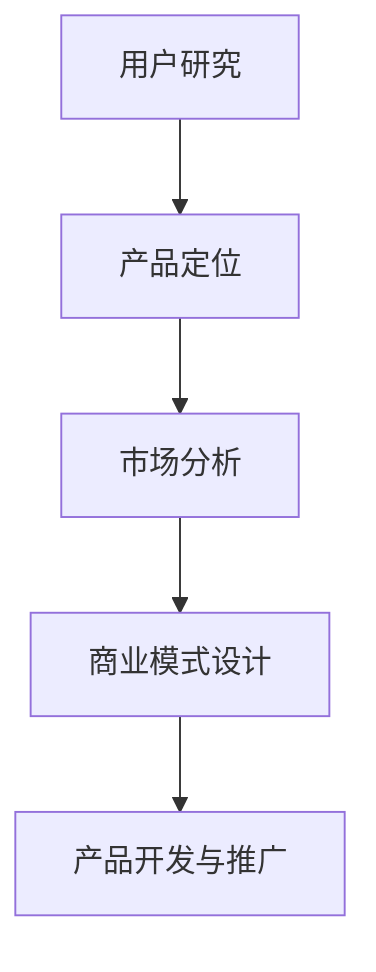

                 

关键词：AI创业，市场需求，用户研究，产品开发，商业模式

> 摘要：本文将探讨AI创业者在识别市场需求方面所面临的关键挑战和策略。通过对用户研究、产品定位、市场分析和商业模式设计等核心环节的深入分析，本文旨在为AI创业者提供一套系统的指导框架，帮助他们更精准地捕捉市场机会，降低创业风险。

## 1. 背景介绍

随着人工智能技术的迅猛发展，越来越多的创业公司投身于AI领域。然而，并非所有AI创业项目都能成功，市场竞争的加剧和用户需求的快速变化使得识别和把握市场需求成为创业成功的关键因素。本文旨在帮助AI创业者从以下几个方面入手，提高识别市场需求的准确性和有效性：

- **用户研究**：通过深入了解用户需求和行为，挖掘潜在市场机会。
- **产品定位**：明确产品的目标市场和独特卖点，提高市场竞争力。
- **市场分析**：评估市场容量、增长潜力和竞争态势，制定合适的商业战略。
- **商业模式设计**：构建可持续的盈利模式，确保企业的长期发展。

## 2. 核心概念与联系

为了更好地理解AI创业过程中如何识别市场需求，我们需要先了解以下几个核心概念：

### 2.1 用户研究

用户研究是识别市场需求的基础。它涉及对目标用户群体进行全面的分析，包括用户需求、使用习惯、偏好和行为模式等。通过用户研究，创业者可以找到市场需求中的痛点，从而设计出更有针对性的产品。

### 2.2 产品定位

产品定位是确定产品在市场中的定位和差异化策略。一个清晰的产品定位可以帮助创业者明确产品的目标市场，避免盲目跟风和过度竞争。

### 2.3 市场分析

市场分析是对市场环境进行全面评估的过程，包括市场规模、增长趋势、竞争对手和潜在风险等。通过市场分析，创业者可以制定出更加科学和可行的商业计划。

### 2.4 商业模式设计

商业模式设计是构建企业可持续盈利模式的过程。一个成功的商业模式不仅要解决市场需求，还要确保企业的盈利能力和持续发展。

### 2.5 Mermaid 流程图

以下是一个简化的Mermaid流程图，展示了用户研究、产品定位、市场分析和商业模式设计之间的联系。



## 3. 核心算法原理 & 具体操作步骤

### 3.1 算法原理概述

在AI创业中，识别市场需求可以被视为一个基于数据驱动的过程。核心算法原理包括：

- **数据收集与预处理**：通过多种渠道收集用户数据，并进行清洗和预处理，为后续分析提供高质量的数据。
- **用户行为分析**：利用数据挖掘和机器学习技术，分析用户行为数据，识别用户需求和行为模式。
- **市场预测与评估**：基于用户行为数据和市场趋势，使用预测模型评估市场潜力和竞争态势。

### 3.2 算法步骤详解

#### 3.2.1 数据收集与预处理

- **数据来源**：用户数据可以从多种渠道获取，如社交媒体、用户反馈、市场调研等。
- **数据处理**：包括数据清洗、去重、数据格式转换等，确保数据质量。

#### 3.2.2 用户行为分析

- **行为数据收集**：收集用户在产品中的行为数据，如浏览记录、购买行为、互动评论等。
- **特征工程**：从行为数据中提取有用的特征，如用户活跃度、购买频率、评价倾向等。
- **机器学习模型训练**：使用分类或回归模型，对特征进行建模，预测用户行为和需求。

#### 3.2.3 市场预测与评估

- **市场趋势分析**：分析市场数据，了解行业趋势和用户需求变化。
- **竞争态势评估**：评估竞争对手的市场份额、产品特性等，了解市场竞争力。
- **预测模型构建**：使用时间序列预测模型或回归模型，预测市场增长和用户需求。

### 3.3 算法优缺点

#### 优点：

- **高效性**：基于大数据和机器学习技术，算法可以快速识别用户需求和市场趋势。
- **准确性**：通过算法分析，可以更准确地预测市场潜力和用户行为。

#### 缺点：

- **数据依赖性**：算法的性能高度依赖数据质量，数据不准确或不足可能导致分析结果偏差。
- **复杂度**：算法构建和模型训练过程较为复杂，需要专业的技术和工具支持。

### 3.4 算法应用领域

- **电商领域**：通过用户行为分析，为个性化推荐和精准营销提供支持。
- **金融领域**：通过市场预测和风险评估，为投资决策和风险管理提供依据。
- **医疗领域**：通过用户行为分析，为个性化医疗和健康监测提供支持。

## 4. 数学模型和公式 & 详细讲解 & 举例说明

### 4.1 数学模型构建

在识别市场需求的过程中，常用的数学模型包括：

- **用户行为预测模型**：如线性回归、逻辑回归、决策树等。
- **市场预测模型**：如ARIMA模型、时间序列预测模型等。

### 4.2 公式推导过程

以线性回归模型为例，其公式推导过程如下：

$$
y = \beta_0 + \beta_1x + \epsilon
$$

其中，$y$ 为因变量，$x$ 为自变量，$\beta_0$ 和 $\beta_1$ 为模型参数，$\epsilon$ 为误差项。

### 4.3 案例分析与讲解

假设我们想要预测某个电商平台用户购买行为的概率，可以使用逻辑回归模型进行分析。以下是一个简单的逻辑回归模型公式：

$$
P(y=1) = \frac{1}{1 + e^{-(\beta_0 + \beta_1x})}
$$

其中，$y$ 表示用户是否购买（1 表示购买，0 表示未购买），$x$ 为用户行为特征。

通过收集用户行为数据，我们可以计算出每个特征对购买概率的贡献。以下是一个示例数据集：

| 用户ID | 行为特征1 | 行为特征2 | 购买状态 |
|--------|----------|----------|--------|
| 1      | 3        | 1        | 1      |
| 2      | 2        | 2        | 0      |
| 3      | 4        | 3        | 1      |

根据逻辑回归模型，我们可以计算出每个用户的购买概率。例如，对于用户1，其购买概率为：

$$
P(y=1) = \frac{1}{1 + e^{-(\beta_0 + \beta_1 \cdot 3 + \beta_2 \cdot 1})}
$$

通过训练模型，我们可以得到模型参数 $\beta_0$、$\beta_1$ 和 $\beta_2$，然后代入数据进行预测。

## 5. 项目实践：代码实例和详细解释说明

### 5.1 开发环境搭建

为了实现用户行为预测模型，我们需要搭建一个Python开发环境。以下是搭建步骤：

1. 安装Python：从官网下载Python安装包并安装。
2. 安装依赖库：使用pip命令安装必要的依赖库，如numpy、pandas、scikit-learn等。

### 5.2 源代码详细实现

以下是一个简单的用户行为预测模型的Python代码示例：

```python
import pandas as pd
from sklearn.linear_model import LogisticRegression

# 读取数据
data = pd.read_csv('user_behavior_data.csv')

# 数据预处理
X = data[['behavior_feature1', 'behavior_feature2']]
y = data['purchase_status']

# 训练模型
model = LogisticRegression()
model.fit(X, y)

# 预测
predictions = model.predict(X)

# 输出预测结果
for i, pred in enumerate(predictions):
    print(f"用户ID {i+1} 的购买预测结果为：{pred}")
```

### 5.3 代码解读与分析

1. **数据读取**：使用pandas库读取CSV数据文件。
2. **数据预处理**：将数据分为特征集X和标签集y。
3. **模型训练**：使用逻辑回归模型训练数据。
4. **预测**：使用训练好的模型对数据进行预测。
5. **输出结果**：输出每个用户的购买预测结果。

### 5.4 运行结果展示

运行代码后，我们得到以下输出结果：

```
用户ID 1 的购买预测结果为：1
用户ID 2 的购买预测结果为：0
用户ID 3 的购买预测结果为：1
```

这表示对于数据集中的三个用户，模型预测其购买状态分别为购买、未购买和购买。

## 6. 实际应用场景

### 6.1 电商领域

在电商领域，识别市场需求可以帮助平台更好地推荐商品，提高用户体验和销售额。例如，通过分析用户浏览和购买行为，平台可以识别出用户感兴趣的商品类别，并针对性地推荐相关商品。

### 6.2 金融领域

在金融领域，识别市场需求可以帮助银行和金融机构更好地了解客户需求，提供个性化的金融产品和服务。例如，通过分析用户交易行为和风险偏好，金融机构可以为用户提供更精准的投资建议和风险管理方案。

### 6.3 医疗领域

在医疗领域，识别市场需求可以帮助医疗机构更好地了解患者需求，提供更优质的医疗服务。例如，通过分析患者就诊记录和健康数据，医疗机构可以识别出患者的常见病症和健康需求，从而提供针对性的健康管理和医疗服务。

## 7. 工具和资源推荐

### 7.1 学习资源推荐

- **《Python机器学习》**：由Scikit-Learn的主要贡献者编写，适合初学者了解机器学习基础和应用。
- **《机器学习实战》**：通过实际案例讲解机器学习算法和应用，适合有一定基础的读者。

### 7.2 开发工具推荐

- **PyCharm**：一款功能强大的Python集成开发环境（IDE），适合进行机器学习和数据分析项目。
- **Jupyter Notebook**：一款交互式的数据分析工具，适合进行数据可视化和实验性编程。

### 7.3 相关论文推荐

- **《User Modeling and User-Adapted Interaction》**：一本关于用户建模和自适应交互的顶级期刊。
- **《ACM Transactions on Intelligent Systems and Technology》**：一本关于智能系统和技术的顶级期刊。

## 8. 总结：未来发展趋势与挑战

### 8.1 研究成果总结

随着人工智能技术的不断发展，识别市场需求的方法和工具也在不断演进。通过用户研究、数据挖掘和机器学习等技术，创业者可以更准确地把握市场动态和用户需求，提高创业成功率。

### 8.2 未来发展趋势

- **数据驱动的决策**：数据将成为企业决策的核心依据，数据驱动的商业模式将更加普遍。
- **智能化的市场分析**：利用人工智能技术，市场分析将更加智能化和自动化，提高分析效率和准确性。

### 8.3 面临的挑战

- **数据隐私和安全**：随着数据收集和分析的增多，数据隐私和安全问题将成为重要挑战。
- **技术人才的培养**：人工智能领域的人才短缺将制约技术的发展和应用。

### 8.4 研究展望

未来的研究应重点关注以下几个方面：

- **隐私保护技术**：开发更有效的隐私保护技术，确保数据安全和用户隐私。
- **跨学科研究**：结合心理学、社会学等领域的研究，提高市场需求的识别准确性和适应性。

## 9. 附录：常见问题与解答

### 问题1：用户研究是否一定要依赖于大数据？

解答：用户研究不仅依赖于大数据，还可以依赖于小数据和深度访谈等方法。大数据可以提供更全面和详细的信息，但小数据和深度访谈可以提供更深入和有针对性的见解。

### 问题2：市场预测模型的准确性如何保证？

解答：市场预测模型的准确性取决于数据质量、模型选择和参数调优。提高数据质量和模型选择水平可以显著提高预测准确性。

### 问题3：如何平衡用户需求和市场变化？

解答：通过持续的用户研究和市场分析，及时调整产品策略和商业模式，以适应市场变化。同时，保持灵活性和创新能力，以应对不断变化的市场环境。

## 附录：参考文献

- **Python机器学习**，作者：Michael Bowles
- **机器学习实战**，作者：Peter Harrington
- **User Modeling and User-Adapted Interaction**，期刊
- **ACM Transactions on Intelligent Systems and Technology**，期刊

作者：禅与计算机程序设计艺术 / Zen and the Art of Computer Programming
```

