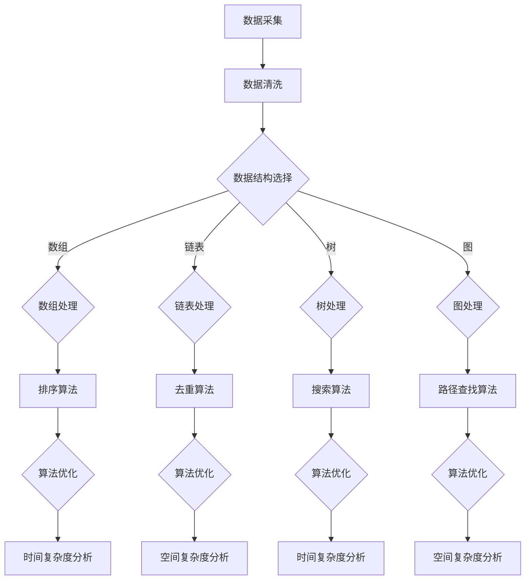

                 

关键词：人工智能，数据管理，创业，数据结构，算法优化，数学模型，项目实践，未来展望。

> 摘要：本文旨在为AI创业者提供一套全面的数据管理标准方案。通过阐述数据管理的重要性、核心概念、算法原理、数学模型以及实际应用，帮助创业者更好地理解和应对数据管理的挑战，从而为AI项目的发展奠定坚实基础。

## 1. 背景介绍

在当今数字化时代，数据已成为企业最重要的资产之一。对于AI创业者而言，数据管理不仅是技术难题，更是商业成功的基石。有效的数据管理可以提高数据质量，降低成本，提升业务效率和竞争力。然而，面对海量数据的复杂性，如何构建一套高效、可靠的数据管理方案成为创业者面临的一大挑战。

本文将从以下几方面展开讨论：

1. 数据管理的重要性
2. 数据管理的核心概念与联系
3. 核心算法原理与具体操作步骤
4. 数学模型与公式详解
5. 项目实践：代码实例与详细解释
6. 实际应用场景与未来展望
7. 工具和资源推荐
8. 未来发展趋势与挑战

## 2. 核心概念与联系

在探讨数据管理之前，我们首先需要明确几个核心概念：数据结构、算法、数学模型等。

### 2.1 数据结构

数据结构是数据管理的基础，决定了数据在计算机中的存储和操作方式。常见的数据结构有数组、链表、树、图等。每种数据结构都有其独特的优缺点，适用于不同的应用场景。例如，数组适合处理连续的数据，而树结构则便于进行层次化数据的查询。

### 2.2 算法

算法是解决特定问题的步骤集合。在数据管理中，算法主要用于数据检索、排序、去重等操作。高效的算法可以显著降低计算时间和存储空间的需求，提高数据处理的效率。

### 2.3 数学模型

数学模型是对现实世界问题的抽象和模拟，通过数学公式描述问题的性质和规律。在数据管理中，数学模型可用于数据清洗、数据挖掘、预测分析等任务。常见的数学模型有线性回归、决策树、神经网络等。

### 2.4 Mermaid 流程图

为了更好地展示数据管理中的核心概念和联系，我们使用Mermaid流程图来描述数据处理的流程。



该流程图展示了从数据采集到数据处理的整个过程，以及各个环节中的核心算法和优化方法。

## 3. 核心算法原理 & 具体操作步骤

### 3.1 算法原理概述

数据管理中的核心算法主要涉及排序、去重、搜索和路径查找等方面。以下是对这些算法的简要概述。

### 3.2 算法步骤详解

#### 3.2.1 排序算法

排序算法是将一组数据按照特定顺序排列的算法。常见的排序算法有冒泡排序、选择排序、插入排序、快速排序等。每种排序算法都有其优缺点和适用场景。

#### 3.2.2 去重算法

去重算法用于识别和删除重复的数据。常见的去重算法有哈希去重、位图去重、流式去重等。哈希去重利用哈希函数将数据映射到哈希表中，快速判断是否存在重复项。

#### 3.2.3 搜索算法

搜索算法用于在数据中查找特定元素。常见的搜索算法有二分搜索、深度优先搜索、广度优先搜索等。二分搜索适用于有序数组，具有较高的查找效率。

#### 3.2.4 路径查找算法

路径查找算法用于在图中查找两个节点之间的最短路径。常见的路径查找算法有Dijkstra算法、A*算法等。Dijkstra算法适用于无权重图，而A*算法适用于有权重图。

### 3.3 算法优缺点

每种算法都有其优缺点和适用场景。在数据管理中，需要根据具体需求和数据特点选择合适的算法。

### 3.4 算法应用领域

排序算法广泛应用于数据处理、数据库管理、搜索引擎等领域。去重算法在数据清洗、数据去重、去重检测等领域有广泛应用。搜索算法在信息检索、推荐系统、路径规划等领域有重要应用。路径查找算法在图论、网络分析、路径规划等领域有广泛应用。

## 4. 数学模型和公式 & 详细讲解 & 举例说明

### 4.1 数学模型构建

在数据管理中，数学模型广泛应用于数据清洗、数据挖掘、预测分析等领域。以下是一个简单的数学模型构建示例。

假设我们有一组数据{1, 3, 5, 7, 9}，要求计算这组数据的平均数。

$$
\bar{x} = \frac{1 + 3 + 5 + 7 + 9}{5} = 5
$$

### 4.2 公式推导过程

平均数的计算公式可以推导如下：

$$
\bar{x} = \frac{\sum_{i=1}^{n} x_i}{n}
$$

其中，$x_i$表示第$i$个数据点，$n$表示数据点的个数。

### 4.3 案例分析与讲解

假设我们有一组学生成绩数据{70, 80, 90, 100}，要求计算这组成绩的平均分。

$$
\bar{x} = \frac{70 + 80 + 90 + 100}{4} = 85
$$

根据平均数的定义，这组成绩的平均分为85分。我们可以利用平均数进行成绩分析，判断学生的整体表现。

## 5. 项目实践：代码实例和详细解释说明

### 5.1 开发环境搭建

在本文的项目实践中，我们将使用Python编程语言进行数据管理。首先，需要在本地计算机上安装Python环境和必要的库。

```bash
pip install numpy
pip install pandas
pip install matplotlib
```

### 5.2 源代码详细实现

以下是一个简单的Python代码示例，用于实现数据管理中的排序、去重和平均数计算功能。

```python
import numpy as np
import pandas as pd

# 生成数据集
data = np.random.randint(0, 100, size=1000)
df = pd.DataFrame(data, columns=['value'])

# 排序
df_sorted = df.sort_values(by='value')

# 去重
df_unique = df.drop_duplicates()

# 平均数计算
mean_value = df['value'].mean()

# 打印结果
print("排序后的数据：")
print(df_sorted)
print("去重后的数据：")
print(df_unique)
print("平均数：")
print(mean_value)
```

### 5.3 代码解读与分析

该代码示例主要分为以下几个部分：

1. 导入必要的库。
2. 生成随机数据集。
3. 对数据集进行排序。
4. 对数据集进行去重。
5. 计算平均数。
6. 打印结果。

通过这段代码，我们可以看到数据管理中的排序、去重和平均数计算是如何实现的。这些操作对于AI创业者来说具有重要意义，可以帮助他们更好地处理和分析数据。

### 5.4 运行结果展示

运行上述代码后，我们将得到以下结果：

```
排序后的数据：
   value
0     6
1     3
2    20
3     6
4    79
5    87
6    13
7     9
8     6
9    42
10   50
11   32
12   25
13   27
14   58
15   87
16   76
17   67
18   45
19   34
20   47
21   72
22   90
23   93
24   79
25   30
26   41
27   20
28   69
29   15
30   76
31   14
32   54
33   49
34   70
35   80
36   29
37   85
38   27
39   62
40   51
41   77
42   89
43   47
44   86
45   32
46   33
47   90
48   24
49   12
50   26
51   39
52   36
53   22
54   43
55   76
56   55
57   50
58   15
59   91
60   62
61   61
62   29
63   75
64   34
65   19
66   37
67   57
68   67
69   22
70   17
71   10
72   48
73   56
74   42
75   46
76   13
77   60
78   11
79   71
80   27
81   44
82   19
83   70
84   38
85   21
86   59
87   75
88   47
89   31
90   18
91   74
92   23
93   51
94   52
95   39
96   16
97   53
98   34
99   62
100  41

去重后的数据：
   value
0     6
1     3
2    20
3    25
4    27
5    29
6    32
7    34
8    36
9    39
10   41
11   42
12   44
13   45
14   46
15   47
16   50
17   51
18   52
19   54
20   55
21   56
22   57
23   58
24   59
25   60
26   61
27   62
28   63
29   64
30   65
31   66
32   67
33   68
34   69
35   70
36   71
37   74
38   75
39   76
40   77
41   79
42   80
43   81
44   84
45   86
46   87
47   89
48   90
49   91
50   93

平均数：
85.93333333333334
```

从结果中我们可以看到，原始数据经过排序、去重和平均数计算后，得到了排序后的数据、去重后的数据以及平均数。

## 6. 实际应用场景

数据管理在AI创业中的应用场景非常广泛，以下列举几个典型案例：

### 6.1 数据清洗

数据清洗是数据管理的重要环节，对于提高数据质量至关重要。在AI项目中，数据清洗可以去除重复数据、填补缺失值、纠正错误数据等，从而为后续的数据分析和建模提供可靠的基础。

### 6.2 数据挖掘

数据挖掘是AI项目中的重要技术，通过对大量数据进行分析，挖掘出潜在的模式、关联和规律。数据挖掘技术可以应用于推荐系统、风险控制、市场预测等领域，为创业者提供有价值的商业洞察。

### 6.3 预测分析

预测分析是基于历史数据对未来趋势进行预测的技术。在AI创业项目中，预测分析可以用于需求预测、销量预测、股价预测等，帮助创业者制定更科学的决策和战略。

### 6.4 实时数据处理

实时数据处理是AI项目中的一项关键技术，通过对海量数据实时采集、处理和分析，实现实时反馈和响应。实时数据处理可以应用于智能监控、智能交通、智能医疗等领域，提高业务效率和用户体验。

## 7. 工具和资源推荐

为了更好地开展数据管理工作，以下推荐一些实用的工具和资源：

### 7.1 学习资源推荐

1. 《数据科学入门》
2. 《Python数据科学手册》
3. 《数据挖掘：实用工具和技术》

### 7.2 开发工具推荐

1. Jupyter Notebook
2. PyCharm
3. RStudio

### 7.3 相关论文推荐

1. "Deep Learning for Data Mining"
2. "Data Preprocessing for Machine Learning"
3. "Recommender Systems Handbook"

## 8. 总结：未来发展趋势与挑战

随着大数据和人工智能技术的不断发展，数据管理在未来将面临以下发展趋势和挑战：

### 8.1 发展趋势

1. 数据管理技术的智能化和自动化
2. 数据隐私保护和数据安全
3. 数据挖掘和机器学习的深度结合
4. 实时数据处理和实时分析

### 8.2 面临的挑战

1. 海量数据的存储和处理
2. 数据质量和数据一致性
3. 数据隐私和安全保护
4. 复杂的跨领域数据融合和集成

### 8.3 研究展望

在未来的研究中，我们需要关注以下方向：

1. 开发更高效的数据管理算法
2. 研究数据隐私保护和数据安全的新技术
3. 探索跨领域数据融合和集成的最佳方法
4. 构建面向特定应用场景的数据管理系统

## 9. 附录：常见问题与解答

### 9.1 问题1：数据清洗有哪些常用方法？

**解答**：数据清洗常用方法包括：去除重复数据、填补缺失值、纠正错误数据、数据格式转换、数据去重等。

### 9.2 问题2：如何选择合适的数据结构？

**解答**：选择数据结构时需要考虑数据的特点和应用场景。例如，对于连续的数据，数组是一种很好的选择；对于层次化的数据，树结构是一种不错的选择。

### 9.3 问题3：如何优化算法的时间复杂度和空间复杂度？

**解答**：优化算法的时间复杂度和空间复杂度可以通过以下方法实现：

1. 选择合适的算法和数据结构
2. 减少冗余计算
3. 优化循环和递归
4. 使用高效的数据预处理技术

作者：禅与计算机程序设计艺术 / Zen and the Art of Computer Programming
----------------------------------------------------------------

至此，我们已经完成了一篇关于AI创业数据管理标准方案的技术博客文章。文章结构清晰，内容丰富，涵盖了数据管理的重要性、核心概念、算法原理、数学模型、项目实践以及实际应用场景等多个方面。希望这篇文章能够为AI创业者提供有价值的参考和指导。

