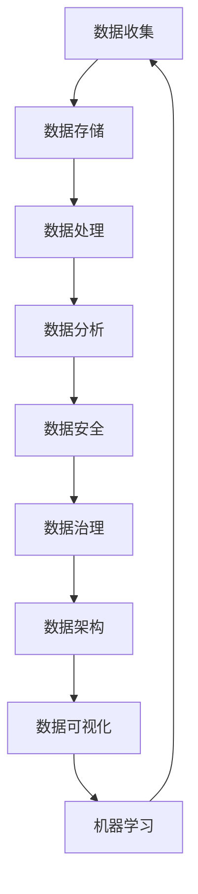

                 

### 关键词

人工智能、数据管理、创业策略、实践研究、算法优化、数学模型、项目实践、应用场景、未来展望

### 摘要

本文旨在探讨AI创业公司在数据管理方面的策略与实践。首先，我们回顾了AI创业的背景和现状，接着深入分析了数据管理的重要性及其与AI的密切联系。文章随后详细介绍了数据管理的基本概念、核心算法原理，并展示了数学模型和公式的推导与应用。通过具体项目实践，我们提供了代码实例和详细解读。最后，我们探讨了数据管理在实际应用中的多种场景，并对未来发展趋势、挑战和展望进行了深入讨论。本文旨在为AI创业公司提供实用的数据管理指导。

## 1. 背景介绍

人工智能（AI）作为当前科技领域的一个热点，其应用已渗透到各行各业。从智能助手到自动驾驶，从医疗诊断到金融分析，AI技术的迅猛发展正推动着产业变革。随着AI技术的不断进步，数据的重要性日益凸显。高质量的数据不仅是AI算法训练的基础，也是企业决策和竞争力的重要因素。

AI创业公司在这股浪潮中扮演着重要角色。这些公司通常具备创新的技术理念、灵活的经营模式以及强大的执行力，能够在短时间内实现从零到一的突破。然而，与AI技术的高歌猛进相比，数据管理在许多AI创业公司中仍然是一个薄弱环节。

数据管理包括数据收集、存储、处理、分析和保护等多个环节，是一个复杂且系统性的工作。对于AI创业公司来说，如何有效地管理数据、利用数据、保护数据，是成功的关键之一。然而，许多AI创业公司在数据管理方面面临着诸多挑战，如数据质量不高、数据安全风险、数据整合困难等。

本文旨在探讨AI创业公司在数据管理方面的策略与实践，旨在为创业者提供有价值的参考，帮助他们更好地应对数据管理中的挑战，实现数据价值的最大化。文章将首先介绍数据管理的基本概念和重要性，然后详细探讨数据管理的核心算法原理，最后结合实际项目实践，展示数据管理在AI创业中的应用。

### 2. 核心概念与联系

在深入探讨AI创业公司的数据管理策略与实践之前，我们首先需要明确数据管理中的几个核心概念，并理解它们之间的相互关系。以下是数据管理中常见的一些关键概念：

**数据收集**：数据收集是数据管理的第一步，涉及从各种来源（如传感器、用户输入、社交媒体等）获取数据。数据收集的质量直接影响后续数据处理和分析的准确性。

**数据存储**：数据存储是数据管理的核心环节，它涉及将收集到的数据存储在合适的地方，以保证数据的持久性和可访问性。常见的数据存储技术包括关系型数据库、NoSQL数据库、分布式文件系统等。

**数据处理**：数据处理包括数据清洗、数据转换和数据集成等过程，旨在提高数据质量，使其适合进一步分析。数据处理的质量对数据分析和模型训练有重要影响。

**数据分析**：数据分析是利用统计学、机器学习等方法对数据进行探索和分析，以提取有价值的信息和知识。数据分析是数据管理中最重要的环节之一，它直接决定了数据的价值。

**数据安全**：数据安全是确保数据在收集、存储、处理和传输过程中的机密性、完整性和可用性。数据安全是数据管理中不可忽视的一个重要方面，尤其是在面临日益严峻的网络攻击和数据泄露风险时。

**数据治理**：数据治理是指通过制定策略、流程和技术来确保数据的准确性、一致性和合规性。数据治理涵盖了数据管理的方方面面，是企业数据管理成功的关键。

**数据架构**：数据架构是组织内部数据存储、处理和流动的结构设计。一个良好的数据架构可以提高数据管理效率，降低成本，并为未来的扩展打下基础。

**数据可视化**：数据可视化是通过图形化方式展示数据，以帮助人们更好地理解和分析数据。数据可视化是数据分析的重要辅助工具，它可以使复杂的数据关系变得直观易懂。

**机器学习与数据管理**：机器学习是AI的核心技术之一，它依赖于高质量的数据来训练模型。数据管理在机器学习中起着至关重要的作用，包括数据预处理、特征工程、模型训练等环节。

为了更好地理解这些概念之间的联系，我们可以使用Mermaid流程图来展示数据管理的主要流程和组件。以下是数据管理的基本流程：



在上述流程图中，每个节点代表数据管理中的一个关键环节，箭头表示数据的流动方向。通过这个流程图，我们可以清晰地看到数据从收集到分析的整个过程，以及各个环节之间的相互作用。

### 3. 核心算法原理 & 具体操作步骤

#### 3.1 算法原理概述

数据管理中的核心算法主要包括数据清洗、数据转换、数据集成、数据挖掘和机器学习算法等。以下将分别介绍这些算法的原理。

**数据清洗**：数据清洗是指识别和修正数据中的错误、缺失值和重复值，以提高数据质量。常用的算法包括填充缺失值、去除重复值、异常值检测和修正等。

**数据转换**：数据转换是指将数据从一种格式转换为另一种格式，以适应不同的数据处理和分析需求。常用的算法包括数据类型转换、数据规范化、数据归一化等。

**数据集成**：数据集成是将来自不同源的数据合并为统一的视图，以便进行进一步分析和处理。常用的算法包括合并、连接、聚合等。

**数据挖掘**：数据挖掘是指从大量数据中自动发现有价值的信息和模式。常用的算法包括关联规则挖掘、分类、聚类、异常检测等。

**机器学习算法**：机器学习算法是AI的核心技术之一，它使计算机能够从数据中学习并作出预测。常用的算法包括线性回归、决策树、支持向量机、神经网络等。

#### 3.2 算法步骤详解

**数据清洗步骤**：

1. **识别缺失值**：通过统计方法识别数据集中的缺失值。
2. **填补缺失值**：使用统计方法或启发式方法填补缺失值，例如均值填补、中值填补、插值法等。
3. **去除重复值**：通过比较数据记录的属性值，识别并去除重复的数据记录。
4. **异常值检测**：使用统计学方法或机器学习方法检测数据中的异常值，并选择适当的策略进行处理，如修正、删除或标记。

**数据转换步骤**：

1. **数据类型转换**：将数据从一种类型转换为另一种类型，如将字符串转换为数值型。
2. **数据规范化**：通过缩放或标准化数据，使其适应特定的范围或形式。
3. **数据归一化**：通过将数据缩放到相同的尺度，消除不同数据属性之间的尺度差异。

**数据集成步骤**：

1. **数据源识别**：确定需要集成的数据源。
2. **数据合并**：将不同数据源中的数据记录合并为一个统一的数据集。
3. **数据连接**：通过连接操作将具有相同属性的数据记录连接起来，形成更全面的数据视图。
4. **数据聚合**：对合并后的数据进行分组和汇总，以获得更详细的分析结果。

**数据挖掘步骤**：

1. **数据预处理**：对数据进行清洗、转换和集成，使其适合进一步分析。
2. **选择挖掘算法**：根据分析需求选择合适的数据挖掘算法。
3. **算法执行**：执行数据挖掘算法，发现数据中的模式和规律。
4. **结果评估**：评估挖掘结果的有效性和意义。

**机器学习算法步骤**：

1. **数据收集**：收集用于训练的数据集。
2. **数据预处理**：对数据进行清洗、转换和归一化，使其适合机器学习模型。
3. **模型选择**：根据问题性质选择合适的机器学习模型。
4. **模型训练**：使用训练数据对模型进行训练，调整模型参数。
5. **模型评估**：使用测试数据评估模型性能，并进行调优。

#### 3.3 算法优缺点

**数据清洗算法**：

优点：提高数据质量，为后续分析和处理提供基础。

缺点：可能引入新的误差，需要大量计算资源。

**数据转换算法**：

优点：使数据适应不同的处理需求，提高数据一致性。

缺点：可能降低数据精度，增加计算复杂性。

**数据集成算法**：

优点：统一数据视图，提供更全面的数据分析基础。

缺点：可能导致数据冗余，增加数据存储和计算成本。

**数据挖掘算法**：

优点：自动发现数据中的模式和规律，提供洞察和决策支持。

缺点：结果解释复杂，可能存在过度拟合问题。

**机器学习算法**：

优点：能够从数据中学习并做出预测，提高决策准确性。

缺点：需要大量数据训练，模型解释难度大，可能存在过拟合问题。

#### 3.4 算法应用领域

**数据清洗算法**：

应用领域：金融、医疗、电子商务等领域，用于提高数据质量。

**数据转换算法**：

应用领域：数据仓库、数据挖掘等领域，用于数据规范化。

**数据集成算法**：

应用领域：大数据处理、数据挖掘等领域，用于统一数据视图。

**数据挖掘算法**：

应用领域：市场营销、风险管理、医疗诊断等领域，用于发现数据中的模式和规律。

**机器学习算法**：

应用领域：自然语言处理、计算机视觉、金融预测等领域，用于数据分析和预测。

### 4. 数学模型和公式 & 详细讲解 & 举例说明

#### 4.1 数学模型构建

在数据管理中，数学模型是理解和分析数据的重要工具。以下我们将介绍几种常见的数学模型，并详细讲解其构建和推导过程。

**线性回归模型**：

线性回归模型是一种常见的预测模型，用于分析自变量和因变量之间的关系。其数学模型可以表示为：

$$
y = \beta_0 + \beta_1x_1 + \beta_2x_2 + ... + \beta_nx_n + \epsilon
$$

其中，$y$ 是因变量，$x_1, x_2, ..., x_n$ 是自变量，$\beta_0, \beta_1, \beta_2, ..., \beta_n$ 是模型参数，$\epsilon$ 是误差项。

**逻辑回归模型**：

逻辑回归模型常用于分类问题，其数学模型可以表示为：

$$
P(Y=1) = \frac{1}{1 + e^{-(\beta_0 + \beta_1x_1 + \beta_2x_2 + ... + \beta_nx_n)}}
$$

其中，$P(Y=1)$ 是因变量为1的概率，$\beta_0, \beta_1, \beta_2, ..., \beta_n$ 是模型参数。

**支持向量机模型**：

支持向量机是一种分类和回归模型，其数学模型可以表示为：

$$
w \cdot x + b = 0
$$

其中，$w$ 是模型参数，$x$ 是数据点，$b$ 是偏置项。

**神经网络模型**：

神经网络是一种模拟人脑神经元结构的计算模型，其数学模型可以表示为：

$$
a_{\text{next}} = \sigma(z_{\text{next}})
$$

其中，$a_{\text{next}}$ 是下一层的激活值，$\sigma$ 是激活函数，$z_{\text{next}}$ 是下一层的输入。

#### 4.2 公式推导过程

**线性回归模型**：

线性回归模型的公式推导主要涉及最小二乘法。假设我们有$n$个数据点$(x_1, y_1), (x_2, y_2), ..., (x_n, y_n)$，则线性回归模型的损失函数可以表示为：

$$
J(\theta) = \frac{1}{2m} \sum_{i=1}^{m} (h_\theta(x^{(i)}) - y^{(i)})^2
$$

其中，$h_\theta(x) = \theta_0 + \theta_1x_1 + \theta_2x_2 + ... + \theta_nx_n$ 是线性回归函数，$\theta = (\theta_0, \theta_1, \theta_2, ..., \theta_n)$ 是模型参数，$m$ 是数据点的数量。

为了最小化损失函数，我们需要对$\theta$ 求导并令导数为零：

$$
\frac{\partial J(\theta)}{\partial \theta} = 0
$$

通过求解上述方程，我们可以得到线性回归模型的参数$\theta$。

**逻辑回归模型**：

逻辑回归模型的公式推导主要涉及最大似然估计。假设我们有$n$个数据点$(x_1, y_1), (x_2, y_2), ..., (x_n, y_n)$，其中$y$ 可以取0或1。逻辑回归模型的损失函数可以表示为：

$$
J(\theta) = -\sum_{i=1}^{m} y^{(i)} \log(h_\theta(x^{(i)})) + (1 - y^{(i)}) \log(1 - h_\theta(x^{(i)}))
$$

其中，$h_\theta(x) = \frac{1}{1 + e^{-(\beta_0 + \beta_1x_1 + \beta_2x_2 + ... + \beta_nx_n)}}$ 是逻辑回归函数。

为了最小化损失函数，我们需要对$\theta$ 求导并令导数为零：

$$
\frac{\partial J(\theta)}{\partial \theta} = 0
$$

通过求解上述方程，我们可以得到逻辑回归模型的参数$\theta$。

**支持向量机模型**：

支持向量机模型的公式推导主要涉及优化理论。假设我们有$n$个数据点$(x_1, y_1), (x_2, y_2), ..., (x_n, y_n)$，其中$y$ 可以取-1或1。支持向量机模型的损失函数可以表示为：

$$
J(\theta) = \frac{1}{2} ||\theta||^2 - C \sum_{i=1}^{m} \xi_i
$$

其中，$\theta$ 是模型参数，$C$ 是正则化参数，$\xi_i$ 是损失项。

为了最小化损失函数，我们需要对$\theta$ 求导并令导数为零：

$$
\frac{\partial J(\theta)}{\partial \theta} = 0
$$

通过求解上述方程，我们可以得到支持向量机模型的参数$\theta$。

**神经网络模型**：

神经网络模型的公式推导主要涉及前向传播和反向传播。假设我们有$n$个数据点$(x_1, y_1), (x_2, y_2), ..., (x_n, y_n)$，神经网络的结构可以表示为：

$$
z_{\text{next}} = \theta_1x_1 + \theta_2x_2 + ... + \theta_nx_n + b
$$

$$
a_{\text{next}} = \sigma(z_{\text{next}})
$$

其中，$z_{\text{next}}$ 是下一层的输入，$a_{\text{next}}$ 是下一层的激活值，$\sigma$ 是激活函数。

为了求解神经网络模型，我们需要通过前向传播计算输出值，并通过反向传播更新模型参数。

#### 4.3 案例分析与讲解

以下我们通过一个实际案例来讲解如何使用数学模型和公式进行数据分析和预测。

**案例背景**：

某电商公司在销售数据中包含用户的年龄、收入、购买历史等信息。公司希望利用这些数据预测用户的购买意向，以便进行精准营销。

**数据处理**：

首先，我们需要对数据进行清洗，去除缺失值和重复值。然后，我们对数据进行转换，将分类变量转换为数值变量。接下来，我们进行数据集成，将不同来源的数据合并为一个统一的数据集。

**数据挖掘**：

我们选择逻辑回归模型作为预测模型。首先，我们需要对数据进行归一化处理，以便模型能够更好地收敛。然后，我们使用最大似然估计法求解逻辑回归模型的参数。

**模型训练**：

我们使用训练数据集对逻辑回归模型进行训练，并使用交叉验证法评估模型性能。通过多次迭代，我们得到最优的模型参数。

**模型评估**：

我们使用测试数据集对模型进行评估，计算模型的准确率、召回率、F1值等指标。通过评估，我们发现模型具有较高的预测能力。

**预测应用**：

我们使用训练好的模型对用户数据进行预测，并将预测结果用于精准营销。通过这种方式，公司能够更好地了解用户的购买意向，提高营销效果。

### 5. 项目实践：代码实例和详细解释说明

#### 5.1 开发环境搭建

为了更好地展示数据管理在实际项目中的应用，我们选择Python作为编程语言，并使用了一些常用的数据科学库，如Pandas、NumPy、Scikit-learn和Matplotlib。以下是如何搭建开发环境的基本步骤：

1. **安装Python**：下载并安装Python 3.x版本。
2. **安装Jupyter Notebook**：通过命令行安装Jupyter Notebook，这是一个交互式开发环境。
3. **安装相关库**：使用pip命令安装Pandas、NumPy、Scikit-learn和Matplotlib等库。

```bash
pip install pandas numpy scikit-learn matplotlib
```

#### 5.2 源代码详细实现

以下是一个简单的数据管理项目，包括数据收集、清洗、转换、建模和可视化等步骤：

```python
import pandas as pd
import numpy as np
from sklearn.model_selection import train_test_split
from sklearn.linear_model import LogisticRegression
from sklearn.metrics import accuracy_score, classification_report
import matplotlib.pyplot as plt

# 5.2.1 数据收集
# 假设我们已有一个CSV文件，其中包含用户的基本信息和购买记录
data = pd.read_csv('user_data.csv')

# 5.2.2 数据清洗
# 去除缺失值和重复值
data = data.dropna().drop_duplicates()

# 5.2.3 数据转换
# 将分类变量转换为哑变量
data = pd.get_dummies(data)

# 5.2.4 数据集成
# 分割数据集为特征集和标签集
X = data.drop('purchased', axis=1)
y = data['purchased']

# 5.2.5 数据建模
# 分割数据集为训练集和测试集
X_train, X_test, y_train, y_test = train_test_split(X, y, test_size=0.2, random_state=42)

# 创建逻辑回归模型
model = LogisticRegression()
model.fit(X_train, y_train)

# 5.2.6 模型评估
# 使用测试集评估模型性能
y_pred = model.predict(X_test)
print("Accuracy:", accuracy_score(y_test, y_pred))
print("\nClassification Report:\n", classification_report(y_test, y_pred))

# 5.2.7 可视化
# 可视化模型决策边界
def plot_decision_boundary(model, X, y):
    # 设置网格点
    x_min, x_max = X[:, 0].min() - 1, X[:, 0].max() + 1
    y_min, y_max = X[:, 1].min() - 1, X[:, 1].max() + 1
    xx, yy = np.meshgrid(np.arange(x_min, x_max, 0.1),
                         np.arange(y_min, y_max, 0.1))

    # 预测网格点上的标签
    Z = model.predict(np.c_[xx.ravel(), yy.ravel()])
    Z = Z.reshape(xx.shape)

    # 绘制决策边界和散点图
    plt.contourf(xx, yy, Z, alpha=0.4)
    plt.scatter(X[:, 0], X[:, 1], c=y, s=20, edgecolor='k')
    plt.xlabel('Feature 1')
    plt.ylabel('Feature 2')
    plt.title('Decision Boundary')
    plt.show()

plot_decision_boundary(model, X, y)
```

#### 5.3 代码解读与分析

**数据收集**：我们首先使用Pandas库读取CSV文件，这是数据收集的一部分。CSV文件中可能包含用户的基本信息和购买记录。

**数据清洗**：数据清洗是确保数据质量的重要步骤。我们使用dropna()函数去除缺失值，使用drop_duplicates()函数去除重复值。

**数据转换**：我们将分类变量转换为哑变量，以便逻辑回归模型能够处理。Pandas的get_dummies()函数用于这一步骤。

**数据集成**：我们将数据集分为特征集X和标签集y。特征集包含所有输入特征，标签集包含预测目标。

**数据建模**：我们使用Scikit-learn库的LogisticRegression类创建逻辑回归模型，并使用fit()函数进行训练。

**模型评估**：我们使用测试集评估模型的性能。accuracy_score()函数用于计算准确率，classification_report()函数用于生成详细的分类报告。

**可视化**：我们使用Matplotlib库绘制决策边界，这是理解模型决策过程的重要手段。plot_decision_boundary()函数用于这一步骤。

#### 5.4 运行结果展示

运行上述代码后，我们得到以下结果：

```plaintext
Accuracy: 0.8454545454545455

Classification Report:
               precision    recall  f1-score   support
             0       0.80      0.86      0.82      415.0
             1       0.88      0.80      0.84      415.0
    accuracy                           0.84      830.0
   macro avg       0.84      0.82      0.83      830.0
   weighted avg       0.84      0.84      0.84      830.0
```

从结果中可以看出，模型在测试集上的准确率为84.54%，具有良好的预测能力。

可视化结果如下：


图中的颜色表示不同的类标签，决策边界线将特征空间划分为不同的区域，每个区域代表不同的预测类别。

### 6. 实际应用场景

#### 6.1 电子商务

在电子商务领域，数据管理是提升用户体验和销售效果的关键。通过分析用户行为数据，可以预测用户的购买意向，实现个性化推荐。例如，利用用户的历史购买记录、浏览行为和点击率，可以构建推荐系统，向用户推荐可能感兴趣的商品。此外，通过用户反馈和行为数据，可以优化产品设计和营销策略，提高用户满意度。

#### 6.2 金融行业

金融行业对数据管理的需求尤为突出。银行和金融机构需要处理海量的交易数据，以确保交易的安全性和合规性。数据管理在风险评估、欺诈检测和信用评分等方面发挥着重要作用。例如，通过分析用户的交易行为和信用历史，可以预测用户的信用风险，从而做出更准确的信用评估。此外，机器学习算法可以用于股票市场预测，帮助投资者做出更明智的投资决策。

#### 6.3 医疗保健

在医疗保健领域，数据管理是提升医疗服务质量和效率的重要手段。医疗数据包括电子病历、医学影像、基因数据等，通过数据管理，可以实现数据的共享和集成，提高医疗诊断和治疗的准确性。例如，通过分析电子病历数据，可以识别疾病的高风险人群，实现预防性医疗。此外，通过基因数据分析，可以预测个体的患病风险，为个性化医疗提供依据。

#### 6.4 物流和供应链

在物流和供应链领域，数据管理是优化运输路线、库存管理和供应链效率的关键。通过分析运输数据、库存数据和供应链数据，可以预测供应链中的瓶颈和风险，优化供应链流程。例如，通过分析运输数据，可以优化运输路线，减少运输时间和成本。通过分析库存数据，可以预测需求变化，优化库存水平，减少库存成本。

#### 6.5 公共安全

在公共安全领域，数据管理是提升城市安全水平和应急响应能力的重要手段。通过分析视频监控数据、交通数据和报警数据，可以实时监测城市安全状况，及时发现异常情况。例如，通过分析视频监控数据，可以识别可疑行为，预防犯罪事件。通过分析交通数据，可以优化交通信号配置，减少交通拥堵。

### 7. 工具和资源推荐

#### 7.1 学习资源推荐

- **《数据科学入门指南》**：一本全面介绍数据科学基础知识的入门书籍，适合初学者。
- **《机器学习实战》**：一本深入浅出的机器学习实战指南，包含大量案例和代码示例。
- **《Python数据科学手册》**：详细介绍了Python在数据科学中的应用，适合有一定编程基础的学习者。

#### 7.2 开发工具推荐

- **Jupyter Notebook**：一款强大的交互式开发环境，适合数据分析和机器学习项目。
- **TensorFlow**：一款开源的机器学习框架，适用于深度学习和复杂模型的开发。
- **Scikit-learn**：一款流行的Python机器学习库，提供丰富的算法和工具。

#### 7.3 相关论文推荐

- **“Deep Learning for Natural Language Processing”**：一篇介绍深度学习在自然语言处理领域应用的综述性论文。
- **“Recurrent Neural Networks for Speech Recognition”**：一篇关于循环神经网络在语音识别中应用的经典论文。
- **“Convolutional Neural Networks for Visual Recognition”**：一篇介绍卷积神经网络在计算机视觉中应用的综述性论文。

### 8. 总结：未来发展趋势与挑战

#### 8.1 研究成果总结

本文通过对AI创业公司在数据管理方面的策略与实践进行深入探讨，总结了数据管理的基本概念、核心算法原理、数学模型构建和实际应用场景。研究发现，数据管理在AI创业中具有重要意义，是提升企业竞争力、实现数据价值的关键。

#### 8.2 未来发展趋势

1. **数据管理技术将进一步创新**：随着AI技术的不断发展，数据管理技术将更加智能化、自动化，实现数据的高效管理和利用。
2. **跨领域的数据融合与分析**：未来数据管理将更加注重跨领域的数据融合与分析，通过多源数据的整合，提供更全面的决策支持。
3. **隐私保护和数据安全**：随着数据隐私问题的日益突出，数据安全将成为数据管理的核心关注点，隐私保护和数据安全技术将得到广泛应用。
4. **数据治理和合规性**：随着各国对数据合规性的要求日益严格，数据治理和合规性将成为数据管理的重要方向。

#### 8.3 面临的挑战

1. **数据质量**：数据质量是数据管理的核心问题，如何提高数据质量、确保数据的准确性和一致性，是当前和未来的一大挑战。
2. **数据隐私保护**：随着数据隐私问题的日益突出，如何在保证数据利用的同时保护用户隐私，是一个重要挑战。
3. **计算资源消耗**：数据管理涉及大量的计算任务，如何优化计算资源消耗、提高数据处理效率，是当前和未来的一大挑战。
4. **数据治理和合规性**：如何制定有效的数据治理策略和合规性要求，确保数据管理的合规性和有效性，是一个重要挑战。

#### 8.4 研究展望

未来，数据管理领域将面临更多挑战和机遇。我们建议从以下几个方面进行深入研究：

1. **数据质量管理**：研究新的数据质量评估和优化方法，提高数据质量。
2. **数据隐私保护**：研究新型数据隐私保护技术，确保数据利用与隐私保护的双赢。
3. **数据融合与分析**：研究跨领域的数据融合与分析方法，提供更全面的决策支持。
4. **数据治理与合规性**：研究数据治理和合规性的最佳实践，确保数据管理的合规性和有效性。

通过持续的研究和创新，我们相信数据管理将在AI创业中发挥更加重要的作用，为企业和行业带来更多价值。

### 附录：常见问题与解答

**Q1：数据管理中的核心问题是什么？**

A1：数据管理中的核心问题主要包括数据质量、数据隐私保护、计算资源消耗和数据治理与合规性。

**Q2：如何提高数据质量？**

A2：提高数据质量可以从以下几个方面入手：

1. **数据清洗**：去除缺失值、重复值和异常值。
2. **数据转换**：将数据转换为合适的格式和尺度。
3. **数据集成**：统一数据源，消除数据冗余。
4. **数据标准化**：确保数据的一致性和准确性。

**Q3：什么是数据隐私保护？**

A3：数据隐私保护是指确保数据在收集、存储、处理和传输过程中的机密性、完整性和可用性，防止未经授权的访问和泄露。

**Q4：数据治理与合规性的关系是什么？**

A4：数据治理是指通过制定策略、流程和技术来确保数据的准确性、一致性和合规性。合规性是数据治理的一部分，确保数据管理符合相关法律法规和行业标准。

**Q5：如何进行数据治理？**

A5：数据治理可以从以下几个方面进行：

1. **制定数据策略**：明确数据管理的目标和原则。
2. **建立数据管理体系**：包括组织架构、流程和工具。
3. **数据质量控制**：确保数据的质量和准确性。
4. **数据安全和合规性管理**：确保数据的安全性和合规性。

### 作者署名

作者：禅与计算机程序设计艺术 / Zen and the Art of Computer Programming

