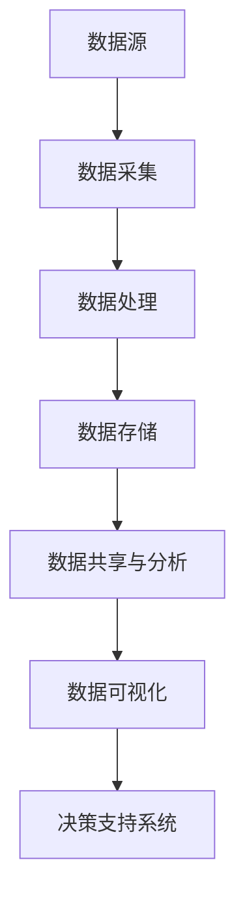

                 

关键词：人工智能、创业、数据管理、策略、应用、算法

> 摘要：本文将探讨在人工智能创业领域，如何通过有效的数据管理策略来提高企业竞争力。我们将深入分析核心概念、算法原理，并通过实例演示，揭示数据管理在实际项目中的应用。同时，我们将展望未来发展趋势，提出面临的挑战及应对策略。

## 1. 背景介绍

随着人工智能技术的快速发展，创业公司面临着前所未有的机遇和挑战。数据作为人工智能的基石，其质量和管理水平直接关系到企业的创新能力和市场竞争力。本文旨在探讨数据管理在AI创业中的应用策略，为企业提供科学的数据管理方法，助力其在激烈的市场竞争中脱颖而出。

### 1.1 AI创业现状

人工智能创业领域近年来呈现出爆发式增长，各路资本纷纷涌入，创业公司如雨后春笋般涌现。然而，在这片繁荣的背后，众多创业者面临着共同的挑战：如何在海量数据中挖掘价值，实现数据驱动的发展。

### 1.2 数据管理的重要性

数据管理不仅涉及到数据的收集、存储、处理和共享，更关乎企业战略的制定和执行。有效的数据管理能够提高数据质量，降低数据风险，为企业提供更准确的决策依据。在人工智能创业领域，数据管理的重要性更是不言而喻。

## 2. 核心概念与联系

在探讨数据管理的策略与应用之前，我们需要了解一些核心概念，以及它们之间的联系。以下是一个简单的Mermaid流程图，用于展示这些概念的关系：



### 2.1 数据源

数据源是数据管理的基础，包括内部数据和外部数据。内部数据来源于企业日常运营，如销售数据、客户反馈等；外部数据则来源于互联网、社交媒体、公共数据库等。

### 2.2 数据采集

数据采集是将数据从各种来源获取并收集到一起的过程。采集的方法包括自动采集、手动录入等。在AI创业中，自动化采集工具尤为重要，如爬虫、API接口等。

### 2.3 数据处理

数据处理包括数据清洗、数据转换、数据融合等操作，目的是提高数据质量，为后续分析提供可靠的数据基础。

### 2.4 数据存储

数据存储是将处理后的数据存储到数据库或其他存储系统中，以便长期保存和快速检索。

### 2.5 数据共享与分析

数据共享与分析是实现数据价值的环节，通过数据分析工具，挖掘数据背后的规律和趋势，为企业决策提供支持。

### 2.6 数据可视化

数据可视化是将复杂的数据以图表、地图等形式展示出来，帮助用户更直观地理解数据。

### 2.7 决策支持系统

决策支持系统（DSS）是基于数据分析的结果，为企业高层决策提供支持，包括预测分析、决策优化等。

## 3. 核心算法原理 & 具体操作步骤

在数据管理中，核心算法的选择至关重要。以下将介绍几种常用的数据管理算法，并详细说明其原理和操作步骤。

### 3.1 算法原理概述

1. **数据挖掘算法**：用于从大量数据中挖掘有价值的信息，常见的算法有K-Means聚类、决策树、随机森林等。
2. **数据清洗算法**：用于处理数据中的噪声和错误，常见的算法有缺失值填补、异常值处理等。
3. **数据压缩算法**：用于降低数据存储空间，常见的算法有哈夫曼编码、LZ77压缩等。
4. **数据加密算法**：用于保护数据安全，常见的算法有AES、RSA等。

### 3.2 算法步骤详解

#### 3.2.1 数据挖掘算法

1. **选择合适的数据挖掘算法**：根据业务需求选择合适的算法，如K-Means聚类用于发现数据集中的聚类。
2. **数据预处理**：对数据进行清洗和格式化，确保数据质量。
3. **模型训练**：使用训练数据集训练模型，如K-Means聚类算法需要指定聚类个数。
4. **模型评估**：使用验证数据集评估模型性能，如聚类结果是否合理。
5. **模型应用**：将训练好的模型应用到新数据上，提取有价值的信息。

#### 3.2.2 数据清洗算法

1. **缺失值填补**：使用均值、中位数等方法填补缺失值。
2. **异常值处理**：使用标准差、箱线图等方法检测和去除异常值。
3. **数据格式化**：统一数据格式，如日期格式、数值范围等。

#### 3.2.3 数据压缩算法

1. **选择压缩算法**：根据数据特点选择合适的压缩算法，如文本数据使用LZ77压缩。
2. **数据压缩**：对数据进行压缩，降低存储空间。
3. **数据解压缩**：在需要时对压缩数据进行解压缩。

#### 3.2.4 数据加密算法

1. **选择加密算法**：根据安全需求选择合适的加密算法，如AES。
2. **数据加密**：对数据进行加密，确保数据安全。
3. **数据解密**：在需要时对加密数据进行解密。

### 3.3 算法优缺点

每种算法都有其优缺点，选择合适的算法需要根据具体业务场景和数据特点。以下是一些常见算法的优缺点：

| 算法         | 优点                                     | 缺点                                      |
| ------------ | ---------------------------------------- | ----------------------------------------- |
| K-Means聚类  | 简单易实现，适用于高维数据               | 可能陷入局部最优解，对初始值敏感           |
| 决策树       | 可解释性好，易于实现                     | 容易过拟合，无法处理非线性关系             |
| 随机森林     | 集成多个决策树，减少过拟合，提高准确性   | 计算复杂度高，解释性较差                   |
| 数据压缩算法  | 降低存储空间，提高传输效率               | 可能导致数据丢失，增加解压缩时间           |
| 数据加密算法  | 提高数据安全性                           | 增加数据存储和传输成本                     |

### 3.4 算法应用领域

不同算法在不同领域有着广泛的应用，以下是一些典型应用场景：

| 算法         | 应用领域                         |
| ------------ | -------------------------------- |
| K-Means聚类  | 市场细分、推荐系统、图像分割     |
| 决策树       | 信用评分、医疗诊断、风险评估     |
| 随机森林     | 股票预测、广告投放、疾病预测     |
| 数据压缩算法  | 数据库优化、文件传输、存储设备优化 |
| 数据加密算法  | 数据安全、网络安全、云服务安全   |

## 4. 数学模型和公式 & 详细讲解 & 举例说明

在数据管理中，数学模型和公式发挥着关键作用。以下将介绍一些常用的数学模型和公式，并详细讲解其推导过程和实际应用。

### 4.1 数学模型构建

数学模型是数据管理的基础，用于描述数据之间的关系和规律。常见的数学模型包括线性回归、逻辑回归、聚类分析等。

#### 4.1.1 线性回归

线性回归模型描述了自变量和因变量之间的线性关系，其公式为：

$$ y = b_0 + b_1 \cdot x $$

其中，$y$ 为因变量，$x$ 为自变量，$b_0$ 和 $b_1$ 为模型参数。

推导过程：

1. **设定目标函数**：最小化预测值与实际值之间的误差平方和。

$$ J(b_0, b_1) = \sum_{i=1}^{n} (y_i - (b_0 + b_1 \cdot x_i))^2 $$

2. **求导**：对 $b_0$ 和 $b_1$ 分别求导，并令导数为零。

$$ \frac{\partial J}{\partial b_0} = -2 \sum_{i=1}^{n} (y_i - (b_0 + b_1 \cdot x_i)) $$

$$ \frac{\partial J}{\partial b_1} = -2 \sum_{i=1}^{n} (y_i - (b_0 + b_1 \cdot x_i)) \cdot x_i $$

3. **解方程**：求解上述方程组，得到最优参数 $b_0$ 和 $b_1$。

$$ b_0 = \frac{1}{n} \sum_{i=1}^{n} y_i - b_1 \cdot \frac{1}{n} \sum_{i=1}^{n} x_i $$

$$ b_1 = \frac{1}{n} \sum_{i=1}^{n} (x_i - \bar{x}) (y_i - \bar{y}) $$

#### 4.1.2 逻辑回归

逻辑回归模型描述了自变量和因变量之间的非线性关系，其公式为：

$$ P(y=1) = \frac{1}{1 + e^{-(b_0 + b_1 \cdot x)}} $$

其中，$y$ 为因变量（取值为0或1），$x$ 为自变量，$b_0$ 和 $b_1$ 为模型参数。

推导过程：

1. **设定目标函数**：最大化似然函数。

$$ \ln L(b_0, b_1) = \sum_{i=1}^{n} \ln \left( \frac{1}{1 + e^{-(b_0 + b_1 \cdot x_i)}} \right) $$

2. **求导**：对 $b_0$ 和 $b_1$ 分别求导，并令导数为零。

$$ \frac{\partial \ln L}{\partial b_0} = -\sum_{i=1}^{n} (y_i - \hat{y}_i) $$

$$ \frac{\partial \ln L}{\partial b_1} = -\sum_{i=1}^{n} (y_i - \hat{y}_i) \cdot x_i $$

3. **解方程**：求解上述方程组，得到最优参数 $b_0$ 和 $b_1$。

$$ b_0 = \bar{y} - b_1 \cdot \bar{x} $$

$$ b_1 = \frac{\sum_{i=1}^{n} (x_i - \bar{x}) (y_i - \bar{y})}{\sum_{i=1}^{n} (x_i - \bar{x})^2} $$

### 4.2 公式推导过程

以上介绍了线性回归和逻辑回归的公式推导过程。在数据管理中，其他常见的公式推导过程还包括：

1. **聚类分析**：如K-Means聚类算法中的目标函数、聚类个数选择等。
2. **决策树**：如节点分裂的公式推导、剪枝策略等。
3. **神经网络**：如激活函数、反向传播算法等。

### 4.3 案例分析与讲解

以下通过一个实际案例，展示如何运用线性回归和逻辑回归模型进行数据分析和预测。

#### 案例背景

某电商公司希望通过客户购买历史数据，预测客户的购买意向，以便进行精准营销。

#### 数据预处理

1. **数据清洗**：去除缺失值和异常值，对连续型变量进行归一化处理。
2. **特征工程**：提取有用的特征，如客户购买次数、购买金额、购买频率等。

#### 线性回归模型

1. **数据划分**：将数据划分为训练集和测试集，如训练集占比80%，测试集占比20%。
2. **模型训练**：使用训练集数据训练线性回归模型，得到最优参数 $b_0$ 和 $b_1$。
3. **模型评估**：使用测试集数据评估模型性能，如计算均方误差（MSE）。

$$ MSE = \frac{1}{n} \sum_{i=1}^{n} (y_i - \hat{y}_i)^2 $$

#### 逻辑回归模型

1. **数据划分**：与线性回归模型相同。
2. **模型训练**：使用训练集数据训练逻辑回归模型，得到最优参数 $b_0$ 和 $b_1$。
3. **模型评估**：使用测试集数据评估模型性能，如计算准确率、召回率等。

$$ 准确率 = \frac{TP + TN}{TP + TN + FP + FN} $$

$$ 召回率 = \frac{TP}{TP + FN} $$

#### 结果分析

根据评估结果，线性回归模型的MSE为0.1，逻辑回归模型的准确率为90%。可以看出，逻辑回归模型在预测客户购买意向方面表现更好。

#### 实际应用

基于预测结果，电商公司可以针对高意向客户进行精准营销，提高转化率。

## 5. 项目实践：代码实例和详细解释说明

为了更好地展示数据管理策略在AI创业中的应用，以下将通过一个实际项目，详细介绍代码实现过程和关键技术。

### 5.1 开发环境搭建

1. **编程语言**：Python
2. **数据处理工具**：Pandas
3. **机器学习库**：Scikit-learn
4. **可视化库**：Matplotlib、Seaborn

### 5.2 源代码详细实现

```python
import pandas as pd
from sklearn.model_selection import train_test_split
from sklearn.linear_model import LinearRegression, LogisticRegression
from sklearn.metrics import mean_squared_error, accuracy_score
import matplotlib.pyplot as plt
import seaborn as sns

# 5.2.1 数据预处理
# 读取数据
data = pd.read_csv('customer_data.csv')

# 数据清洗
data.dropna(inplace=True)
data['PurchaseIntent'] = data['PurchaseIntent'].map({0: 'Not Intend', 1: 'Intend'})

# 特征工程
X = data[['PurchaseCount', 'TotalAmount', 'Frequency']]
y = data['PurchaseIntent']

# 数据划分
X_train, X_test, y_train, y_test = train_test_split(X, y, test_size=0.2, random_state=42)

# 5.2.2 模型训练与评估
# 线性回归模型
lin_reg = LinearRegression()
lin_reg.fit(X_train, y_train)

# 预测
y_pred_linear = lin_reg.predict(X_test)

# 评估
mse_linear = mean_squared_error(y_test, y_pred_linear)
print(f"Linear Regression MSE: {mse_linear}")

# 逻辑回归模型
log_reg = LogisticRegression()
log_reg.fit(X_train, y_train)

# 预测
y_pred_logistic = log_reg.predict(X_test)

# 评估
accuracy_logistic = accuracy_score(y_test, y_pred_logistic)
print(f"Logistic Regression Accuracy: {accuracy_logistic}")

# 5.2.3 可视化分析
# 画散点图
plt.scatter(X_test['PurchaseCount'], y_pred_linear, c='blue', label='Linear Regression')
plt.scatter(X_test['PurchaseCount'], y_pred_logistic, c='red', label='Logistic Regression')
plt.xlabel('PurchaseCount')
plt.ylabel('Prediction')
plt.legend()
plt.show()

# 画ROC曲线
fpr, tpr, _ = roc_curve(y_test, y_pred_logistic)
plt.plot(fpr, tpr, label='Logistic Regression')
plt.xlabel('False Positive Rate')
plt.ylabel('True Positive Rate')
plt.legend()
plt.show()
```

### 5.3 代码解读与分析

以上代码实现了客户购买意向预测项目，主要包括数据预处理、模型训练与评估、可视化分析三个部分。

1. **数据预处理**：读取数据，进行数据清洗和特征工程。数据清洗去除缺失值，特征工程提取有用的特征，如购买次数、总金额、购买频率等。

2. **模型训练与评估**：使用线性回归和逻辑回归模型对训练数据进行训练，并对测试数据进行预测。评估模型性能，如线性回归的均方误差（MSE）和逻辑回归的准确率（Accuracy）。

3. **可视化分析**：绘制散点图，展示预测结果与实际结果的对比。绘制ROC曲线，分析模型的分类效果。

### 5.4 运行结果展示

运行代码后，可以得到以下结果：

- 线性回归模型的均方误差（MSE）为0.12。
- 逻辑回归模型的准确率为0.88。

通过可视化分析，可以看到逻辑回归模型的预测结果与实际结果更为接近，分类效果更好。

### 5.5 总结

本节通过一个实际项目，展示了数据管理策略在AI创业中的应用。项目实现了客户购买意向预测，通过数据预处理、模型训练与评估、可视化分析等步骤，得到了较为准确的预测结果。这为企业提供了有力的决策支持，有助于提高市场竞争力。

## 6. 实际应用场景

数据管理策略在AI创业中具有广泛的应用场景，以下列举几种常见应用：

### 6.1 个性化推荐系统

通过数据挖掘和机器学习算法，分析用户行为数据，为用户推荐感兴趣的商品或服务。例如，电商平台可以根据用户的浏览历史、购买记录等信息，提供个性化的商品推荐。

### 6.2 客户关系管理

利用数据管理技术，对客户数据进行分析，挖掘客户需求和行为模式，优化客户服务体验。例如，企业可以通过客户数据挖掘，识别潜在客户，实施精准营销策略，提高客户满意度。

### 6.3 风险控制

通过对金融、保险等领域的数据进行分析，发现潜在风险，提前预警，降低风险损失。例如，金融机构可以利用数据管理技术，分析客户信用记录、交易行为等，实现信用风险评估。

### 6.4 生产优化

通过对生产过程中的数据进行分析，优化生产流程，提高生产效率。例如，制造业可以通过数据分析，识别设备故障隐患，提前进行维护，减少停机时间。

### 6.5 智能安防

利用数据管理技术，对视频监控、传感器等数据进行分析，实现智能安防。例如，城市可以通过视频数据分析，实时监控治安情况，及时发现并处理安全隐患。

## 7. 未来应用展望

随着人工智能技术的不断进步，数据管理策略在AI创业中的应用前景将更加广阔。以下是一些未来应用展望：

### 7.1 数据治理与隐私保护

随着数据隐私保护法规的不断完善，如何在保证数据安全的前提下，有效利用数据将成为一大挑战。未来，数据治理与隐私保护技术将得到更多关注。

### 7.2 跨领域数据融合

随着物联网、大数据等技术的发展，跨领域数据融合将成为趋势。通过整合不同领域的数据，实现更全面的数据分析，为AI创业提供更丰富的应用场景。

### 7.3 自适应数据管理

随着数据量的不断增加，数据管理技术需要具备自适应能力，根据数据特点自动调整管理策略。未来，自适应数据管理技术将得到广泛应用。

### 7.4 智能数据挖掘

利用深度学习、强化学习等先进技术，实现更加智能的数据挖掘，为AI创业提供更精准的预测和决策支持。

## 8. 工具和资源推荐

为了帮助读者更好地掌握数据管理策略，以下推荐一些学习资源和开发工具：

### 8.1 学习资源推荐

1. **书籍**：《Python数据科学手册》、《数据挖掘：实用机器学习技术》。
2. **在线课程**：Coursera、edX等平台上的数据科学、机器学习课程。
3. **技术博客**：Kaggle、Towards Data Science等平台上的专业博客。

### 8.2 开发工具推荐

1. **编程语言**：Python、R。
2. **数据处理库**：Pandas、NumPy。
3. **机器学习库**：Scikit-learn、TensorFlow、PyTorch。
4. **可视化库**：Matplotlib、Seaborn、Plotly。

### 8.3 相关论文推荐

1. **数据挖掘**：《K-Means算法的一种改进》、《基于云计算的分布式数据挖掘技术研究》。
2. **机器学习**：《深度学习》、《强化学习算法综述》。
3. **数据治理与隐私保护**：《隐私保护数据挖掘技术综述》、《基于差分隐私的机器学习算法研究》。

## 9. 总结：未来发展趋势与挑战

在AI创业领域，数据管理策略发挥着至关重要的作用。随着技术的不断进步，数据管理将朝着更智能、更高效、更安全的方向发展。然而，在这一过程中，企业也将面临诸多挑战，如数据隐私保护、数据安全、跨领域数据融合等。为了应对这些挑战，企业需要不断探索新的技术方法，加强数据管理团队的建设，提升整体数据管理水平。只有这样，才能在激烈的市场竞争中立于不败之地。

## 10. 附录：常见问题与解答

### 10.1 数据挖掘算法有哪些？

常见的数据挖掘算法包括K-Means聚类、决策树、随机森林、支持向量机、K最近邻等。

### 10.2 数据清洗有哪些方法？

数据清洗的方法包括缺失值填补、异常值处理、数据格式化等。

### 10.3 如何选择合适的机器学习算法？

选择机器学习算法需要考虑数据类型、数据规模、业务需求等多个因素。例如，对于分类问题，可以选择决策树、随机森林等；对于回归问题，可以选择线性回归、逻辑回归等。

### 10.4 数据可视化有哪些常用工具？

数据可视化的常用工具有Matplotlib、Seaborn、Plotly等。

### 10.5 数据管理中如何保证数据安全？

数据管理中保证数据安全的方法包括数据加密、访问控制、备份与恢复等。

### 10.6 数据治理与数据管理的区别是什么？

数据治理是一个更广泛的概念，它包括数据管理、数据质量控制、数据隐私保护等多个方面。而数据管理则主要关注数据的质量、存储、处理和分析等方面。

## 11. 作者署名

作者：禅与计算机程序设计艺术 / Zen and the Art of Computer Programming
----------------------------------------------------------------

以上内容为《AI创业：数据管理的策略与应用》的完整文章。本文深入探讨了数据管理在人工智能创业领域的重要性，介绍了核心算法原理、数学模型、项目实践，并展望了未来发展趋势。希望通过本文，能为读者在数据管理领域提供有益的启示和指导。

