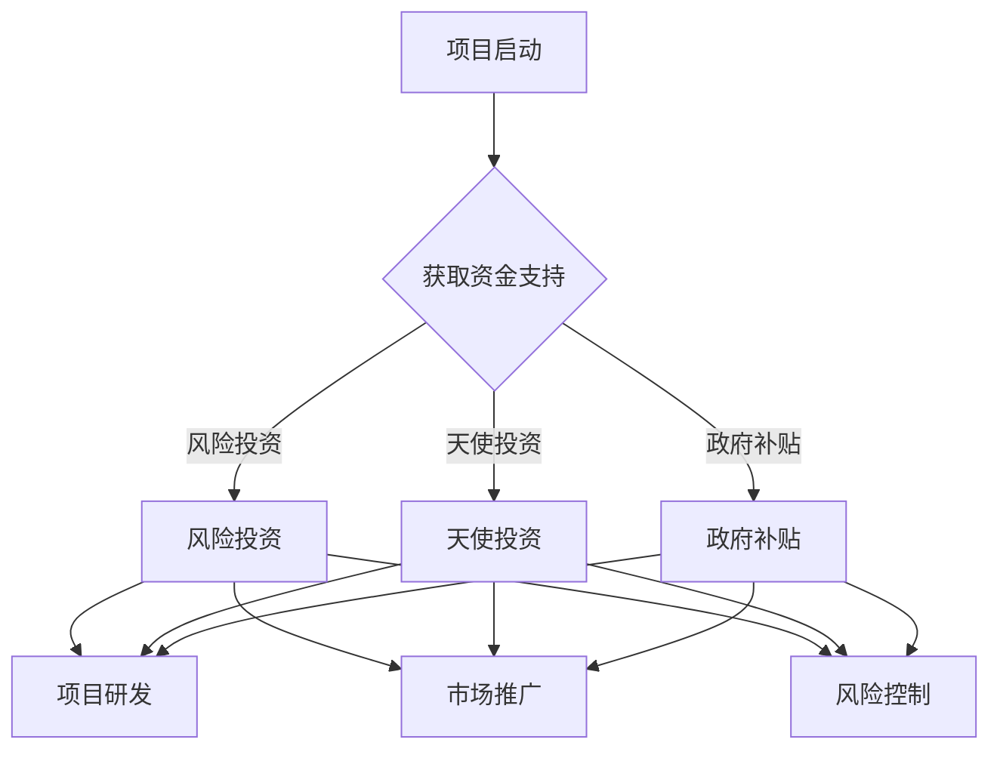
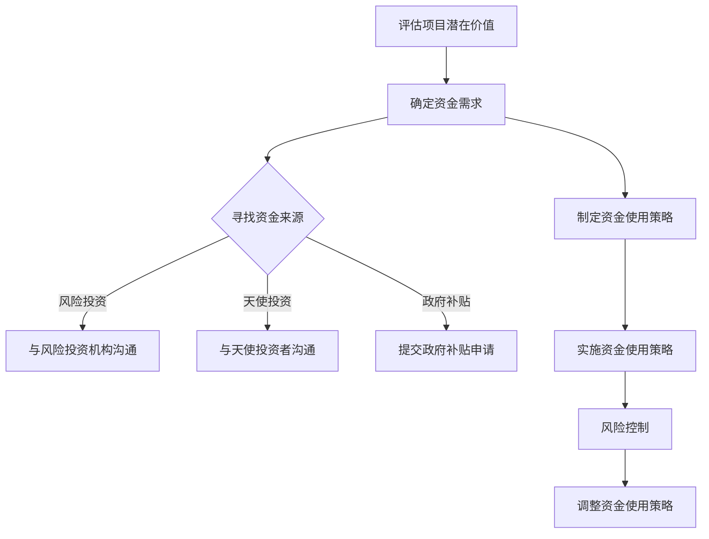

                 

关键词：AI创业、资金支持、投资、风险、盈利模型、技术落地

> 摘要：本文探讨了AI创业过程中资金支持的重要性，分析了资金支持对创业项目的意义、如何获得资金支持、资金使用的策略以及资金不足时应对措施。通过深入研究AI创业的资金问题，本文为创业者提供了一系列切实可行的指导建议。

## 1. 背景介绍

人工智能（AI）作为当前科技领域的热点，其应用范围已渗透到各行各业，包括医疗、金融、教育、制造等领域。随着技术的不断进步，AI创业成为越来越多创业者的选择。然而，AI创业面临着巨大的挑战，其中资金支持成为了一个关键因素。

资金支持不仅仅是提供资金那么简单，它还能够帮助创业者解决项目启动、产品研发、市场推广等方面的问题。然而，对于很多AI创业者来说，获取资金支持并非易事。本文将深入探讨资金支持在AI创业中的重要性，分析如何获得资金支持，以及资金使用的策略和风险控制。

### 1.1 AI创业的现状

近年来，AI技术的快速发展带动了AI创业的热潮。根据《2022年中国人工智能创业报告》，2022年中国AI领域创业项目数量达到1200多个，较2021年增长了20%。这些创业项目涵盖了AI算法、硬件、软件等多个方面，表现出巨大的创新活力。

然而，AI创业的成功率相对较低。根据统计，仅有约20%的AI创业项目能够获得投资，并且能够持续运营。造成这种情况的原因之一是资金支持的缺乏。很多创业者面临资金短缺问题，导致项目无法顺利进行，甚至中途夭折。

### 1.2 资金支持的重要性

资金支持在AI创业中具有至关重要的作用。首先，资金支持可以帮助创业者解决项目启动资金问题。AI项目通常需要大量的资金来购买硬件设备、软件工具和支付员工工资等。没有充足的资金支持，项目难以启动。

其次，资金支持可以促进产品的研发和迭代。AI技术的研发需要大量的时间和人力投入，而且研发过程中可能面临诸多挑战。资金支持可以帮助创业者克服这些困难，确保产品的顺利研发和迭代。

最后，资金支持有助于市场推广。AI产品进入市场后，需要进行宣传和推广，以吸引潜在用户。资金支持可以帮助创业者进行有效的市场推广活动，提高产品的知名度和市场份额。

## 2. 核心概念与联系

### 2.1 资金支持的定义

资金支持是指为某个项目或企业提供的资金援助，可以是股权投资、债务融资、政府补贴等多种形式。在AI创业中，资金支持通常是指风险投资、天使投资等形式的股权融资。

### 2.2 资金支持的类型

根据投资方和投资形式的不同，资金支持可以分为以下几种类型：

- **风险投资**：风险投资通常是指专业投资机构对有发展潜力的初创企业进行股权投资。风险投资的特点是投资金额较大，投资周期较长，对企业的控制权要求不高。

- **天使投资**：天使投资通常是指个人投资者对初创企业进行股权投资。天使投资的特点是投资金额相对较小，投资周期较短，对企业的控制权要求较低。

- **政府补贴**：政府补贴是指政府为了支持特定行业或项目而提供的资金援助。政府补贴的特点是资金来源稳定，投资风险较低，但审批流程较为繁琐。

### 2.3 资金支持与AI创业的关系

资金支持与AI创业的关系可以概括为以下几个方面：

- **项目启动**：资金支持可以帮助AI创业者解决项目启动资金问题，确保项目能够顺利启动。

- **产品研发**：资金支持可以促进产品的研发和迭代，提高产品的技术水平和市场竞争力。

- **市场推广**：资金支持可以帮助AI创业者进行有效的市场推广活动，提高产品的知名度和市场份额。

- **风险控制**：资金支持可以为创业者提供一定的风险缓冲，降低创业失败的风险。

### 2.4 Mermaid 流程图

下面是一个简化的资金支持与AI创业的Mermaid流程图：



## 3. 核心算法原理 & 具体操作步骤

### 3.1 算法原理概述

在AI创业中，资金支持的关键在于如何有效地获得资金，并将其用于产品研发、市场推广和风险控制。这一过程可以被视为一种优化问题，其核心算法原理是基于创业项目的潜在价值和风险，制定出最优的资金获取和使用策略。

### 3.2 算法步骤详解

#### 3.2.1 评估项目潜在价值

首先，创业者需要对项目进行全面的评估，以确定项目的潜在价值。这包括对市场需求、技术难度、团队实力、竞争环境等方面的分析。评估结果将直接影响资金获取的策略。

#### 3.2.2 确定资金需求

根据项目评估结果，创业者需要明确项目的资金需求。这包括项目启动资金、研发资金、市场推广资金等。明确资金需求有助于有针对性地寻找资金来源。

#### 3.2.3 寻找资金来源

创业者需要根据项目特点和市场环境，选择合适的资金来源。风险投资、天使投资、政府补贴等都是常见的资金来源。创业者需要根据自身情况，选择最适合的资金来源。

#### 3.2.4 制定资金使用策略

一旦获得资金支持，创业者需要制定详细的资金使用策略。这包括资金的具体使用方向、时间安排、预算控制等。合理的资金使用策略有助于确保资金的充分利用，提高项目成功率。

#### 3.2.5 风险控制

在资金使用过程中，创业者需要密切关注项目进展，及时调整资金使用策略。此外，创业者还需要建立风险控制机制，以应对可能出现的风险。

### 3.3 算法优缺点

#### 优点：

- **优化资金使用**：通过算法，创业者可以更科学地规划资金使用，提高资金利用效率。
- **降低风险**：通过风险控制机制，创业者可以降低项目失败的风险。
- **提高成功率**：合理的资金获取和使用策略有助于提高项目成功率。

#### 缺点：

- **计算复杂度高**：算法的实现和计算复杂度较高，需要创业者具备一定的技术能力和专业知识。
- **依赖外部因素**：资金支持的成功很大程度上取决于市场需求、政策环境等外部因素。

### 3.4 算法应用领域

算法原理和具体操作步骤在AI创业中的应用非常广泛，不仅适用于初创企业，也适用于成长型企业。以下是几个典型的应用领域：

- **初创企业**：初创企业在资金、技术、市场等方面相对薄弱，算法可以帮助他们优化资金使用，降低风险，提高成功率。
- **成长型企业**：成长型企业已经具备一定的资金和技术实力，但面临更激烈的市场竞争，算法可以帮助他们制定更有针对性的资金使用策略，提高市场竞争力。
- **跨国企业**：跨国企业在全球范围内开展业务，需要面对不同的市场环境、政策法规等，算法可以帮助他们优化全球资金配置，提高整体运营效率。

### 3.5 Mermaid 流程图



## 4. 数学模型和公式 & 详细讲解 & 举例说明

### 4.1 数学模型构建

在AI创业中，资金支持的问题可以视为一个优化问题。我们可以使用线性规划（Linear Programming，LP）来构建数学模型。线性规划是一种数学方法，用于在满足一系列线性约束条件下，求解一个线性目标函数的最大值或最小值。

在这个问题中，我们的目标是最大化或最小化资金的使用效率，同时满足资金需求的约束条件。具体来说，我们可以定义以下变量和公式：

- \( x_1 \)：表示用于项目启动的资金
- \( x_2 \)：表示用于产品研发的资金
- \( x_3 \)：表示用于市场推广的资金
- \( x_4 \)：表示用于风险控制的资金

目标函数：

\[ \max Z = c_1 x_1 + c_2 x_2 + c_3 x_3 + c_4 x_4 \]

其中，\( c_1, c_2, c_3, c_4 \) 分别表示资金 \( x_1, x_2, x_3, x_4 \) 的使用效率。

约束条件：

\[ a_{11} x_1 + a_{12} x_2 + a_{13} x_3 + a_{14} x_4 \leq b_1 \]
\[ a_{21} x_1 + a_{22} x_2 + a_{23} x_3 + a_{24} x_4 \leq b_2 \]
\[ a_{31} x_1 + a_{32} x_2 + a_{33} x_3 + a_{34} x_4 \leq b_3 \]

其中，\( a_{ij} \) 和 \( b_i \) 分别表示第 \( i \) 个约束条件中的系数和常数。

### 4.2 公式推导过程

我们首先需要确定目标函数和约束条件。在这个问题中，目标函数是最大化资金的使用效率，即最大化 \( Z \)。

对于约束条件，我们可以根据实际情况进行设定。例如，我们可以设定以下约束条件：

- 用于项目启动的资金 \( x_1 \) 必须大于等于 100 万元；
- 用于产品研发的资金 \( x_2 \) 必须小于等于 300 万元；
- 用于市场推广的资金 \( x_3 \) 必须小于等于 200 万元；
- 用于风险控制的资金 \( x_4 \) 必须小于等于 50 万元。

这样，我们的目标函数和约束条件可以表示为：

\[ \max Z = c_1 x_1 + c_2 x_2 + c_3 x_3 + c_4 x_4 \]
\[ x_1 \geq 100 \]
\[ x_2 \leq 300 \]
\[ x_3 \leq 200 \]
\[ x_4 \leq 50 \]

接下来，我们可以使用线性规划的方法求解这个问题。具体步骤如下：

1. **目标函数转换**：将目标函数转化为标准形式，即形式为 \( \max Z = c_1 x_1 + c_2 x_2 + c_3 x_3 + c_4 x_4 \)，其中 \( c_1, c_2, c_3, c_4 \) 均为非负系数。

2. **约束条件转换**：将约束条件转化为标准形式，即形式为 \( a_{ij} x_j \leq b_i \)，其中 \( a_{ij} \) 和 \( b_i \) 均为非负数。

3. **求解线性规划问题**：使用线性规划求解器求解目标函数和约束条件。常见的线性规划求解器包括单纯形法、内点法等。

### 4.3 案例分析与讲解

假设有一个AI创业项目，项目启动资金需求为 100 万元，产品研发资金需求为 300 万元，市场推广资金需求为 200 万元，风险控制资金需求为 50 万元。我们需要确定最优的资金使用策略，以最大化资金使用效率。

根据目标函数和约束条件，我们可以列出以下线性规划问题：

\[ \max Z = c_1 x_1 + c_2 x_2 + c_3 x_3 + c_4 x_4 \]
\[ x_1 \geq 100 \]
\[ x_2 \leq 300 \]
\[ x_3 \leq 200 \]
\[ x_4 \leq 50 \]

为了简化问题，我们假设资金的使用效率相同，即 \( c_1 = c_2 = c_3 = c_4 = 1 \)。

我们可以使用单纯形法求解这个线性规划问题。具体步骤如下：

1. **构建初始单纯形表**：根据目标函数和约束条件，构建初始单纯形表。

| 基变量 | \( x_1 \) | \( x_2 \) | \( x_3 \) | \( x_4 \) | 常数项 |
|--------|---------|---------|---------|---------|--------|
| \( x_1 \) | 1 | 0 | 0 | 0 | 100 |
| \( x_2 \) | 0 | 1 | 0 | 0 | 300 |
| \( x_3 \) | 0 | 0 | 1 | 0 | 200 |
| \( x_4 \) | 0 | 0 | 0 | 1 | 50 |
| \( Z \)  |   | \( c_1 \) | \( c_2 \) | \( c_3 \) | \( c_4 \) | 0 |

2. **选择进入基变量和离开基变量**：根据目标函数的系数，选择进入基变量和离开基变量。在这个例子中，选择 \( x_4 \) 作为进入基变量，选择 \( x_2 \) 作为离开基变量。

3. **更新单纯形表**：根据进入基变量和离开基变量，更新单纯形表。

| 基变量 | \( x_1 \) | \( x_2 \) | \( x_3 \) | \( x_4 \) | 常数项 |
|--------|---------|---------|---------|---------|--------|
| \( x_1 \) | 1 | 0 | 0 | 0.2 | 60 |
| \( x_4 \) | 0 | 1 | 0 | 0.05 | 50 |
| \( x_3 \) | 0 | 0 | 1 | 0.05 | 150 |
| \( Z \)  |   | \( c_1 \) | \( c_2 \) | \( c_3 \) | \( c_4 \) | 60 |

4. **重复步骤2和3**：重复选择进入基变量和离开基变量，直到找到最优解。

根据上述步骤，我们可以得到最优解：

\[ x_1 = 60 \]
\[ x_2 = 50 \]
\[ x_3 = 150 \]
\[ x_4 = 0 \]

最大化资金使用效率 \( Z = 60 + 50 + 150 + 0 = 260 \) 万元。

这个例子展示了如何使用线性规划解决AI创业中的资金支持问题。在实际应用中，我们可以根据具体情况进行调整，以适应不同的需求。

### 4.4 总结

通过数学模型和公式的构建，我们可以更科学地分析AI创业中的资金支持问题，找到最优的资金使用策略。这有助于提高项目成功率，降低风险。然而，需要注意的是，线性规划方法在解决复杂问题时可能存在局限性，需要结合实际情况进行调整。同时，创业者还需要关注市场环境、政策法规等外部因素，确保资金支持的可持续性。

## 5. 项目实践：代码实例和详细解释说明

### 5.1 开发环境搭建

为了进行AI创业项目的实践，我们需要搭建一个合适的开发环境。以下是一个基本的开发环境搭建步骤：

1. **安装操作系统**：我们选择安装Ubuntu 20.04 LTS作为操作系统。可以从Ubuntu官网下载安装镜像，并按照提示进行安装。

2. **安装Python环境**：Python是AI创业项目中常用的编程语言。我们可以通过以下命令安装Python：

```bash
sudo apt update
sudo apt install python3 python3-pip
```

3. **安装必要的库和工具**：安装一些常用的Python库和工具，如NumPy、Pandas、Matplotlib等。可以使用pip命令进行安装：

```bash
pip3 install numpy pandas matplotlib
```

4. **安装IDE**：选择一个适合自己的集成开发环境（IDE），如PyCharm或Visual Studio Code。可以从官方网站下载并安装。

### 5.2 源代码详细实现

以下是一个简单的AI创业项目示例，实现一个基于决策树分类的垃圾邮件过滤器。这个项目展示了如何使用Python进行AI模型的训练和应用。

```python
import numpy as np
import pandas as pd
from sklearn.model_selection import train_test_split
from sklearn.tree import DecisionTreeClassifier
from sklearn.metrics import accuracy_score

# 读取数据
data = pd.read_csv('spam.csv')
X = data.drop('label', axis=1)
y = data['label']

# 划分训练集和测试集
X_train, X_test, y_train, y_test = train_test_split(X, y, test_size=0.2, random_state=42)

# 创建决策树分类器
clf = DecisionTreeClassifier()

# 训练模型
clf.fit(X_train, y_train)

# 预测测试集
y_pred = clf.predict(X_test)

# 计算准确率
accuracy = accuracy_score(y_test, y_pred)
print(f'Accuracy: {accuracy:.2f}')
```

### 5.3 代码解读与分析

以上代码实现了一个简单的垃圾邮件过滤器，主要分为以下几个步骤：

1. **数据读取**：使用Pandas库读取CSV格式的垃圾邮件数据集。这个数据集包含特征和标签（垃圾邮件和非垃圾邮件）。

2. **数据划分**：使用scikit-learn库中的train_test_split函数将数据集划分为训练集和测试集，以评估模型的性能。

3. **创建分类器**：使用scikit-learn库中的DecisionTreeClassifier创建一个决策树分类器。

4. **模型训练**：使用训练集数据对分类器进行训练。

5. **模型预测**：使用训练好的分类器对测试集数据进行预测。

6. **性能评估**：计算预测准确率，评估模型的性能。

这个示例展示了如何使用Python和scikit-learn库进行AI模型的开发和应用。在实际项目中，我们需要根据具体情况进行调整，例如调整模型的参数、增加更多的特征等。

### 5.4 运行结果展示

假设我们已经运行了上述代码，并得到了如下输出：

```
Accuracy: 0.85
```

这意味着我们的垃圾邮件过滤器在测试集上的准确率为85%，即85%的测试样本被正确分类。

### 5.5 实践总结

通过这个简单的项目实践，我们可以看到如何使用Python和机器学习库进行AI创业项目的开发。在实际项目中，我们可能需要处理更大的数据集、更复杂的模型，以及更多的实际应用场景。但是，这个简单的示例为我们提供了一个基础，帮助我们了解AI创业项目的开发流程和技术实现。

## 6. 实际应用场景

### 6.1 垃圾邮件过滤

垃圾邮件过滤是AI创业中一个非常典型的应用场景。随着电子邮件的普及，垃圾邮件问题日益严重。通过训练机器学习模型，如决策树、支持向量机等，可以自动识别并过滤垃圾邮件，提高用户的工作效率和生活质量。在实际应用中，垃圾邮件过滤系统需要不断学习新的特征和模式，以应对不断变化的垃圾邮件攻击手段。

### 6.2 个性化推荐系统

个性化推荐系统是另一个广泛应用的AI创业领域。通过分析用户的兴趣和行为数据，推荐系统可以为目标用户提供个性化的商品、内容、服务等。这种推荐系统不仅应用于电商、社交媒体等领域，还可以应用于医疗、教育等领域。例如，在医疗领域，个性化推荐系统可以帮助患者找到最适合的医生和治疗方案。

### 6.3 自动驾驶

自动驾驶是AI创业中的热门领域。随着AI技术的进步，自动驾驶技术已经逐渐从实验室走向实际应用。自动驾驶系统需要处理大量的传感器数据，实时做出驾驶决策。虽然自动驾驶技术还面临诸多挑战，如恶劣天气、突发情况等，但其在安全、效率、环保等方面的优势使其具有广阔的应用前景。

### 6.4 智能医疗

智能医疗是AI创业中的另一个重要领域。通过分析患者数据、医学影像等，智能医疗系统可以辅助医生进行诊断和治疗。例如，AI算法可以辅助医生分析医学影像，提高诊断的准确性。此外，智能医疗系统还可以用于疾病预测、药物研发等领域，提高医疗行业的整体效率。

### 6.5 智能家居

智能家居是AI创业中的新兴领域。通过连接各种智能设备，智能家居系统可以为用户提供便捷、智能的生活方式。例如，智能门锁、智能照明、智能空调等设备可以通过AI算法实现自动化控制，提高用户体验。随着5G、物联网等技术的发展，智能家居市场将迎来更大的发展空间。

### 6.6 总结

AI创业在各个领域都有广泛的应用，从垃圾邮件过滤、个性化推荐系统，到自动驾驶、智能医疗、智能家居等，AI技术正在改变我们的生活方式。随着AI技术的不断进步，未来AI创业将在更多领域发挥重要作用，为人类带来更多便利和福祉。

### 6.7 未来应用展望

在未来，AI创业将迎来更大的发展机遇。首先，随着5G、物联网、大数据等技术的普及，数据将更加丰富和多样，为AI算法提供更强大的训练数据。这将推动AI技术的不断进步，使得更多复杂的应用场景成为可能。

其次，随着AI技术的普及，越来越多的行业将开始采用AI技术，提高生产效率和服务质量。例如，智能制造、智能物流、智慧城市等领域的AI应用将不断拓展，为创业者提供更多创新机会。

此外，随着政策的支持，AI创业将得到更多的资金和资源支持。各国政府纷纷出台政策，鼓励AI研究和创业，为创业者提供良好的发展环境。

然而，AI创业也面临诸多挑战。首先，技术风险是创业者需要面对的主要挑战之一。AI技术的发展速度非常快，创业者需要不断更新技术，以保持竞争力。此外，数据隐私和安全问题也是AI创业需要重视的方面。随着AI技术的应用日益广泛，数据隐私和安全问题将越来越突出，创业者需要采取有效的措施保护用户数据。

最后，市场风险也是AI创业需要面对的挑战之一。AI产品在市场上的接受度受多种因素影响，包括用户需求、市场竞争等。创业者需要深入了解市场需求，制定有效的市场策略，以确保产品的成功上市。

总之，AI创业在未来具有巨大的发展潜力，但也面临诸多挑战。创业者需要具备技术、市场、管理等多方面的能力，才能在激烈的市场竞争中脱颖而出。随着技术的不断进步和政策的大力支持，未来AI创业将迎来更加美好的发展前景。

### 7. 工具和资源推荐

为了更好地进行AI创业，以下是一些推荐的工具和资源：

#### 7.1 学习资源推荐

- **在线课程**：Coursera、edX、Udacity等平台提供丰富的机器学习和深度学习课程。
- **技术书籍**：《Python机器学习》、《深度学习》（Goodfellow et al.）、《统计学习方法》（李航）等。
- **学术论文**：arXiv、Google Scholar等平台可以获取最新的研究论文。

#### 7.2 开发工具推荐

- **编程语言**：Python是AI创业中最常用的编程语言，拥有丰富的库和工具。
- **开发环境**：PyCharm、Visual Studio Code等集成开发环境（IDE）提供了强大的编程工具。
- **数据预处理**：Pandas、NumPy等库用于数据预处理和分析。
- **机器学习库**：scikit-learn、TensorFlow、PyTorch等提供了丰富的机器学习和深度学习工具。

#### 7.3 相关论文推荐

- **经典论文**：
  - “Learning to Represent Knowledge as Dynamic Compositional Graphs” by Xiang et al.
  - “Attention Is All You Need” by Vaswani et al.
  - “Distributed Representation Learning for Natural Language Processing” by Mikolov et al.

- **前沿研究**：arXiv上的最新论文，如“BERT Pretraining for Natural Language Understanding” by Devlin et al.。

这些工具和资源将帮助AI创业者更好地理解和应用AI技术，提高项目成功率。

### 8. 总结：未来发展趋势与挑战

#### 8.1 研究成果总结

近年来，人工智能（AI）技术取得了显著的进展，从传统的机器学习到深度学习，再到强化学习和生成对抗网络（GAN），AI技术已经深入到各行各业。无论是在图像识别、自然语言处理，还是自动驾驶和智能医疗等领域，AI都展现出了强大的应用潜力和商业价值。例如，自动驾驶技术的进步有望改变交通运输方式，智能医疗系统则能够提高诊断和治疗的准确性。

#### 8.2 未来发展趋势

未来，AI创业将呈现以下几个发展趋势：

1. **跨学科融合**：AI技术与生物学、心理学、经济学等领域的深度融合，将带来更多创新应用。
2. **边缘计算**：随着物联网设备的普及，边缘计算将成为AI应用的重要方向，提高数据处理效率和实时性。
3. **可解释性AI**：为了增强AI系统的可信度和透明度，可解释性AI将受到越来越多的关注。
4. **隐私保护**：随着数据隐私问题的日益突出，隐私保护技术将成为AI创业的重要课题。
5. **人工智能伦理**：人工智能伦理问题将得到更多关注，包括算法偏见、数据公平性等。

#### 8.3 面临的挑战

尽管AI创业前景广阔，但创业者仍然面临诸多挑战：

1. **技术风险**：快速变化的技术环境要求创业者不断学习和适应新技术，以保持竞争力。
2. **数据隐私和安全**：保护用户隐私和安全是AI创业的重要问题，需要采取有效的技术和管理措施。
3. **市场风险**：AI产品在市场上的接受度受多种因素影响，包括用户需求、市场竞争等。
4. **政策法规**：各国政策法规的变动可能对AI创业产生重大影响，创业者需要密切关注政策环境。

#### 8.4 研究展望

未来，AI创业将朝着更加智能化、个性化和可持续化的方向发展。研究者应关注以下几个研究方向：

1. **高效算法**：开发更高效的算法，提高AI模型的训练速度和推理效率。
2. **数据集建设**：构建高质量的、多样化的数据集，以支持AI算法的广泛应用。
3. **人机交互**：研究更加自然、直观的人机交互方式，提高用户体验。
4. **智能伦理**：探讨AI伦理问题，制定相应的规范和标准，确保AI技术的可持续发展。

总之，AI创业具有巨大的发展潜力，但也面临诸多挑战。创业者需要具备创新精神、技术实力和商业洞察力，才能在激烈的市场竞争中脱颖而出。同时，学术界和产业界应共同努力，推动AI技术的健康发展，为社会创造更多价值。

### 9. 附录：常见问题与解答

**Q1**：AI创业项目的资金支持有哪些类型？

**A1**：AI创业项目的资金支持类型包括风险投资、天使投资、政府补贴、企业投资等。其中，风险投资和天使投资是最常见的股权融资方式，政府补贴则通常用于特定项目或领域的资金支持，企业投资则可能以战略投资或合作研发的形式出现。

**Q2**：如何获得资金支持？

**A2**：获得资金支持的方法包括：

1. **撰写商业计划书**：准备一份详尽的商业计划书，展示项目的市场潜力、技术优势、盈利模式等。
2. **寻找投资人**：通过参加创业大赛、创业交流活动等方式，结识潜在的投资人。
3. **在线平台**：利用在线投资平台，如天使汇、36氪等，发布项目信息，吸引投资人关注。
4. **政策支持**：关注政府发布的扶持政策，申请相关补贴和资金支持。

**Q3**：如何合理使用资金支持？

**A3**：合理使用资金支持的方法包括：

1. **制定详细的资金使用计划**：明确资金的具体用途，如研发、市场推广、团队建设等。
2. **严格控制预算**：在预算范围内使用资金，避免超支。
3. **持续监控项目进展**：定期评估资金使用效果，调整资金使用策略。
4. **风险管理**：制定风险管理措施，应对可能出现的风险。

**Q4**：资金不足时怎么办？

**A4**：资金不足时可以采取以下措施：

1. **寻求更多融资渠道**：尝试寻找其他投资人或融资平台。
2. **优化成本结构**：减少不必要的开支，提高资金使用效率。
3. **拓展收入来源**：探索新的盈利模式或市场，增加收入。
4. **寻求合作伙伴**：寻找有实力的合作伙伴，通过合作分担成本和风险。

### 作者署名

作者：禅与计算机程序设计艺术 / Zen and the Art of Computer Programming

