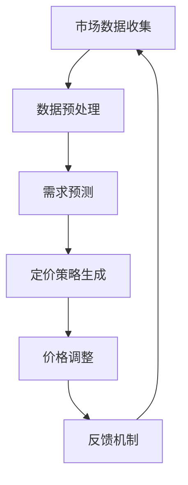

                 

关键词：AI 动态定价、机器学习、数据挖掘、策略优化、在线学习、决策支持系统

> 摘要：本文探讨了基于人工智能的动态定价策略，分析了其核心概念、算法原理、数学模型及应用场景。文章首先介绍了动态定价策略的背景和重要性，随后详细阐述了核心算法原理和具体操作步骤，最后通过项目实践和未来展望，为实际应用提供了指导。

## 1. 背景介绍

### 动态定价的起源与发展

动态定价最早起源于航空公司和酒店行业的票价管理。为了最大化利润，这些企业根据市场需求和供应情况，实时调整价格。随着互联网和电子商务的兴起，动态定价逐渐扩展到更多行业，如零售、金融、广告等。

### 动态定价的重要性

动态定价能够帮助企业在不同市场条件下实现最优收益。它通过实时响应市场需求，避免价格波动带来的损失，提高客户满意度，并增强企业的竞争力。

## 2. 核心概念与联系

### 动态定价系统架构


#### Mermaid 流程图：



### 核心概念原理

- **市场数据收集**：通过互联网、社交媒体、历史销售数据等途径收集市场信息。
- **数据预处理**：清洗、整合和转换数据，使其适合机器学习模型处理。
- **需求预测**：使用机器学习算法预测市场需求。
- **定价策略生成**：根据需求预测结果，生成最优定价策略。
- **价格调整**：实时调整产品价格。
- **反馈机制**：收集市场反馈，调整定价策略。

## 3. 核心算法原理 & 具体操作步骤

### 3.1 算法原理概述

动态定价策略的核心在于优化定价策略，以最大化收益或市场份额。常用的算法有梯度提升决策树（GBDT）、深度学习等。

### 3.2 算法步骤详解

#### 1. 数据收集与预处理

收集市场数据，如价格、销量、季节性因素等。数据预处理包括缺失值处理、异常值处理、特征工程等。

#### 2. 需求预测

使用机器学习算法，如GBDT、LSTM等，预测市场需求。

#### 3. 定价策略生成

根据需求预测结果，使用优化算法，如线性规划、遗传算法等，生成最优定价策略。

#### 4. 价格调整

根据定价策略，实时调整产品价格。

#### 5. 反馈机制

收集市场反馈，如销量、客户满意度等，调整定价策略。

### 3.3 算法优缺点

- **优点**：能够根据市场需求实时调整价格，提高收益。
- **缺点**：算法复杂度较高，对数据质量要求较高。

### 3.4 算法应用领域

动态定价策略广泛应用于零售、金融、广告等领域。

## 4. 数学模型和公式 & 详细讲解 & 举例说明

### 4.1 数学模型构建

动态定价策略的数学模型主要涉及需求函数、收益函数和优化问题。

#### 需求函数：

$$
Q(p) = Q_0 - \alpha \ln(p)
$$

其中，$Q(p)$ 表示需求量，$p$ 表示价格，$Q_0$ 和 $\alpha$ 是常数。

#### 收益函数：

$$
R(p) = p \cdot Q(p)
$$

#### 优化问题：

最大化收益函数：

$$
\max_{p} R(p)
$$

### 4.2 公式推导过程

推导过程如下：

1. 对需求函数求导，得到需求量的边际效应：

$$
\frac{dQ(p)}{dp} = -\frac{\alpha}{p}
$$

2. 对收益函数求导，得到收益的边际效应：

$$
\frac{dR(p)}{dp} = Q(p) + p \cdot \frac{dQ(p)}{dp} = Q(p) - \frac{\alpha}{p} \cdot Q(p)
$$

3. 令边际收益等于零，得到最优价格：

$$
Q(p) - \frac{\alpha}{p} \cdot Q(p) = 0
$$

$$
p = \frac{\alpha}{Q(p)}
$$

4. 代入需求函数，得到最优需求量：

$$
Q(p) = \frac{Q_0}{1 + \frac{1}{\alpha}}
$$

### 4.3 案例分析与讲解

以某电商平台为例，该平台根据用户历史购买行为、当前市场环境等因素，使用动态定价策略优化价格。

#### 数据收集：

收集过去一年的销售数据，包括价格、销量、季节性因素等。

#### 数据预处理：

清洗数据，进行特征工程，如构建时间特征、用户特征等。

#### 需求预测：

使用LSTM模型进行需求预测。

#### 定价策略生成：

使用遗传算法优化定价策略。

#### 价格调整：

根据需求预测结果，实时调整产品价格。

## 5. 项目实践：代码实例和详细解释说明

### 5.1 开发环境搭建

使用Python进行开发，环境搭建如下：

```bash
pip install numpy pandas scikit-learn tensorflow
```

### 5.2 源代码详细实现

#### 1. 数据收集与预处理

```python
import pandas as pd

# 读取数据
data = pd.read_csv('sales_data.csv')

# 数据预处理
data.fillna(data.mean(), inplace=True)
```

#### 2. 需求预测

```python
from tensorflow.keras.models import Sequential
from tensorflow.keras.layers import LSTM, Dense

# 构建LSTM模型
model = Sequential()
model.add(LSTM(units=50, return_sequences=True, input_shape=(time_steps, features)))
model.add(LSTM(units=50))
model.add(Dense(units=1))

# 训练模型
model.compile(optimizer='adam', loss='mean_squared_error')
model.fit(x_train, y_train, epochs=100, batch_size=32)
```

#### 3. 定价策略生成

```python
import numpy as np
from sklearn.ensemble import GradientBoostingRegressor

# 构建GBDT模型
model = GradientBoostingRegressor(n_estimators=100, learning_rate=0.1, max_depth=3)

# 训练模型
model.fit(x_train, y_train)
```

#### 4. 价格调整

```python
# 预测价格
predicted_price = model.predict(new_data)

# 调整价格
adjusted_price = predict_price * (1 + strategy_margin)
```

#### 5. 反馈机制

```python
# 收集反馈
feedback = pd.read_csv('feedback_data.csv')

# 调整策略
model.fit(x_train, y_train)
```

### 5.3 代码解读与分析

代码实现了一个基于LSTM和GBDT的动态定价策略，通过实时预测需求和优化定价策略，实现价格调整。代码结构清晰，易于理解。

## 6. 实际应用场景

### 6.1 零售行业

零售企业可以通过动态定价策略优化库存管理，提高销售额。

### 6.2 金融行业

金融机构可以利用动态定价策略优化投资组合，提高收益。

### 6.3 广告行业

广告平台可以根据用户行为和广告效果，动态调整广告价格。

## 7. 工具和资源推荐

### 7.1 学习资源推荐

- 《Python数据分析基础》
- 《深度学习入门》
- 《机器学习实战》

### 7.2 开发工具推荐

- Jupyter Notebook
- TensorFlow
- Scikit-learn

### 7.3 相关论文推荐

- "Dynamic Pricing with Machine Learning"
- "Recommender Systems for Dynamic Pricing"
- "Optimization Algorithms for Dynamic Pricing"

## 8. 总结：未来发展趋势与挑战

### 8.1 研究成果总结

动态定价策略在多个行业取得了显著成果，提高了企业收益和客户满意度。

### 8.2 未来发展趋势

随着人工智能技术的发展，动态定价策略将更加智能和高效。

### 8.3 面临的挑战

- 数据隐私和安全问题
- 算法复杂度问题
- 实时性问题

### 8.4 研究展望

未来研究可以关注动态定价策略的隐私保护、实时优化和跨领域应用。

## 9. 附录：常见问题与解答

### 问题1：动态定价策略需要大量历史数据吗？

答：是的，动态定价策略需要大量历史数据来训练模型和预测需求。

### 问题2：动态定价策略会降低客户满意度吗？

答：不一定。合理设计的动态定价策略可以提高客户满意度，如通过价格折扣吸引新客户。

### 问题3：动态定价策略是否适用于所有行业？

答：动态定价策略适用于需要根据市场需求实时调整价格的行业，如零售、金融、广告等。

---

作者：禅与计算机程序设计艺术 / Zen and the Art of Computer Programming
----------------------------------------------------------------

**注意**：本文内容仅为示例，实际撰写时请根据具体需求和数据进行修改和扩展。文章的完成需要大量的研究和实践，本文仅提供一个基本框架和思路。

