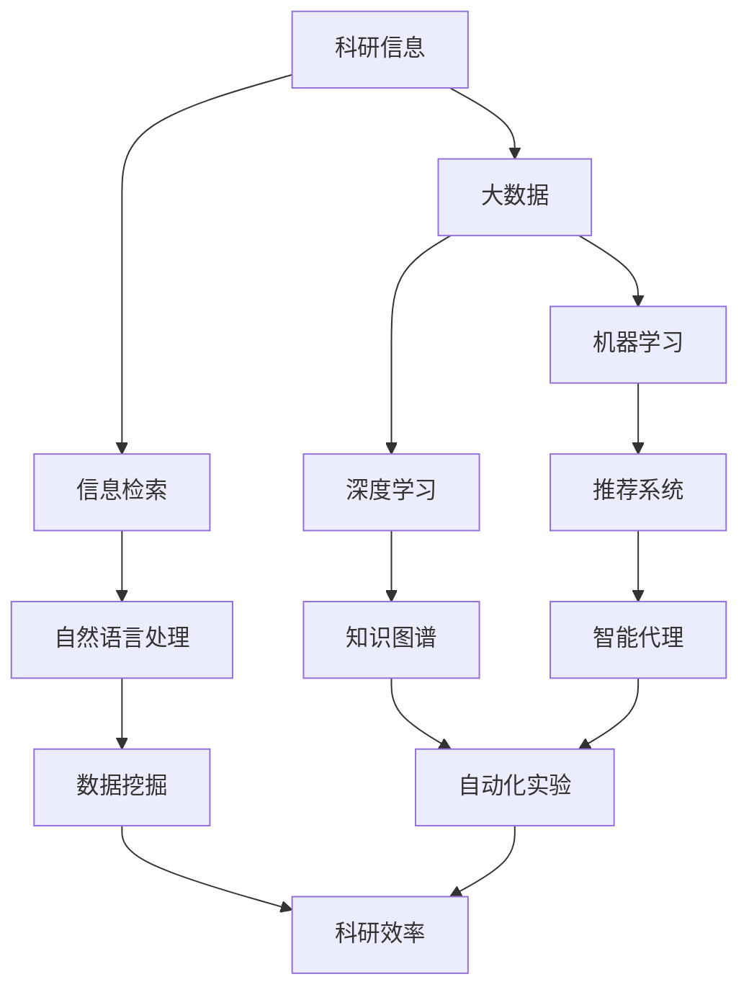

                 

 关键词：人工智能，科研，搜索算法，信息检索，数据挖掘，算法优化，机器学习，深度学习，神经网络，自然语言处理，大数据，云计算，分布式计算，智能代理，推荐系统，知识图谱，自动化实验，科研效率提升

> 摘要：本文旨在探讨人工智能技术在科研领域的应用，尤其是搜索算法的革新。通过分析人工智能如何改变科研信息的获取和处理方式，以及其在数据挖掘、算法优化、自然语言处理等方面的应用，本文揭示了AI技术助力科研的新维度。文章将深入探讨这些技术的核心概念、算法原理、应用实例，并展望未来的发展趋势与挑战。

## 1. 背景介绍

科研领域一直以来都面临着大量的信息检索和处理挑战。传统的科研方法依赖于人类研究人员对学术文献的阅读、理解和筛选，这不仅耗时耗力，而且容易漏掉重要信息。随着互联网和大数据技术的发展，科研数据呈现出爆炸式增长，传统的信息检索方法已经难以满足科研人员的需求。

在此背景下，人工智能技术的引入成为科研领域的一大趋势。人工智能，尤其是机器学习和深度学习技术，通过自动化的方式，可以从大量的数据中提取有价值的信息，辅助科研人员发现新的研究思路和方向。搜索算法作为人工智能的一个重要分支，其在科研领域的应用正在逐渐深化，为科研人员提供了一种全新的数据处理和知识发现方式。

本文将围绕以下几个方面展开讨论：

1. 核心概念与联系
2. 核心算法原理与具体操作步骤
3. 数学模型与公式详解
4. 项目实践：代码实例与解释
5. 实际应用场景
6. 工具和资源推荐
7. 总结：未来发展趋势与挑战

通过上述内容的阐述，本文旨在为科研人员提供一种全新的视角，了解和利用人工智能技术提升科研效率。

## 2. 核心概念与联系

在深入探讨人工智能在科研中的应用之前，有必要对一些核心概念进行梳理，并展示它们之间的相互联系。以下是一个使用Mermaid绘制的流程图，展示了科研搜索中的关键概念及其关联。



### 2.1 科研信息

科研信息是科研人员工作的基础，它包括学术论文、实验数据、研究报告等各种形式的信息。随着互联网的发展，这些信息以海量的形式存储在数据库和学术机构中。

### 2.2 大数据

大数据是科研信息的重要组成部分，它指的是规模巨大、类型繁多的数据集合。大数据技术帮助科研人员处理和挖掘这些复杂数据，从而发现潜在的价值。

### 2.3 信息检索

信息检索是科研工作中必不可少的一环，它涉及如何高效地从海量数据中找到相关的信息。传统的信息检索方法主要依赖于关键词匹配，而人工智能技术则引入了更智能的搜索算法，如机器学习和深度学习。

### 2.4 机器学习

机器学习是人工智能的一个重要分支，它通过构建模型，从大量数据中自动提取规律和特征。在科研领域，机器学习可以帮助科研人员识别数据模式，预测实验结果，甚至发现新的研究思路。

### 2.5 深度学习

深度学习是机器学习的一个子领域，它通过多层神经网络模型，从数据中自动学习和提取高级特征。深度学习在图像识别、语音识别等领域取得了显著的成果，也为科研信息的处理提供了强大的工具。

### 2.6 自然语言处理

自然语言处理（NLP）是人工智能的一个分支，它专注于让计算机理解和处理人类语言。在科研领域，NLP技术可以用于自动摘要、语义分析、情感分析等，帮助科研人员更好地理解和利用文本数据。

### 2.7 数据挖掘

数据挖掘是从大量数据中发现有价值信息的过程。在科研领域，数据挖掘可以帮助科研人员从海量文献中提取重要的知识点，构建知识图谱，从而发现新的研究方向。

### 2.8 推荐系统

推荐系统通过分析用户的兴趣和行为，为用户推荐相关内容。在科研领域，推荐系统可以帮助科研人员发现潜在的研究合作伙伴，推荐相关文献，提高科研效率。

### 2.9 知识图谱

知识图谱是一种用于表示实体及其相互关系的图形结构。在科研领域，知识图谱可以帮助科研人员更好地理解学科知识体系，发现潜在的研究关联。

### 2.10 智能代理

智能代理是自动化科研工具的一种，它通过人工智能技术，自动执行科研任务，如自动搜索文献、分析数据、生成报告等。

### 2.11 自动化实验

自动化实验是利用人工智能技术进行实验设计和执行的过程。通过自动化实验，科研人员可以更高效地进行实验验证，加速科研进程。

### 2.12 科研效率

科研效率是科研人员追求的重要目标。通过利用人工智能技术，如信息检索、数据挖掘、推荐系统等，科研人员可以显著提高科研效率，从而更快地取得科研成果。

通过上述核心概念及其关联的梳理，我们可以看到人工智能技术如何贯穿于科研工作的各个环节，为科研人员提供了强大的工具和支持。

## 3. 核心算法原理 & 具体操作步骤

在了解了核心概念及其关联后，接下来我们将深入探讨人工智能在科研中的核心算法原理，并详细描述其具体操作步骤。

### 3.1 算法原理概述

人工智能在科研中的核心算法主要包括机器学习、深度学习、自然语言处理和数据挖掘等。以下是对这些算法原理的概述：

- **机器学习**：通过从数据中学习规律和模式，机器学习算法可以帮助计算机做出预测和决策。常见的机器学习算法有线性回归、决策树、支持向量机等。
- **深度学习**：深度学习是一种基于多层神经网络的机器学习算法，通过自动提取数据的高级特征，深度学习在图像识别、语音识别等领域取得了显著成果。常见的深度学习模型有卷积神经网络（CNN）、循环神经网络（RNN）等。
- **自然语言处理**：自然语言处理专注于让计算机理解和处理人类语言。NLP技术包括分词、词性标注、句法分析、语义分析等，常见的方法有基于规则的方法和基于统计的方法。
- **数据挖掘**：数据挖掘是从大量数据中发现有价值信息的过程。常见的数据挖掘方法有关联规则挖掘、聚类分析、分类分析等。

### 3.2 算法步骤详解

#### 3.2.1 机器学习算法

机器学习算法的基本步骤包括：

1. **数据预处理**：清洗和预处理输入数据，包括缺失值处理、数据标准化等。
2. **特征提取**：从原始数据中提取特征，这些特征将用于训练模型。
3. **模型选择**：选择合适的机器学习模型，如线性回归、决策树等。
4. **模型训练**：使用训练数据对模型进行训练，调整模型参数。
5. **模型评估**：使用测试数据评估模型性能，调整模型参数，优化模型。
6. **模型应用**：将训练好的模型应用于实际数据，进行预测或决策。

#### 3.2.2 深度学习算法

深度学习算法的基本步骤包括：

1. **数据预处理**：与机器学习类似，预处理输入数据。
2. **网络构建**：设计深度学习网络结构，如卷积神经网络（CNN）、循环神经网络（RNN）等。
3. **模型训练**：使用反向传播算法训练深度学习模型，调整网络权重。
4. **模型评估**：使用测试数据评估模型性能，调整网络参数。
5. **模型应用**：将训练好的模型应用于实际数据，进行预测或决策。

#### 3.2.3 自然语言处理

自然语言处理的基本步骤包括：

1. **分词**：将文本数据分割成单词或短语。
2. **词性标注**：标注每个单词的词性，如名词、动词、形容词等。
3. **句法分析**：分析句子的结构，如主语、谓语、宾语等。
4. **语义分析**：理解文本的语义内容，如情感分析、实体识别等。

#### 3.2.4 数据挖掘

数据挖掘的基本步骤包括：

1. **数据预处理**：清洗和预处理数据，确保数据质量。
2. **探索性数据分析**：对数据进行分析，发现数据分布、异常值等。
3. **特征选择**：从数据中提取有价值的特征。
4. **模型选择**：选择合适的挖掘模型，如关联规则挖掘、聚类分析等。
5. **模型训练与评估**：训练模型并评估模型性能。
6. **模型应用**：将训练好的模型应用于实际数据，进行预测或决策。

### 3.3 算法优缺点

每种算法都有其优缺点：

- **机器学习**：
  - 优点：易于理解和实现，适用范围广。
  - 缺点：对于复杂问题，可能需要大量的数据，模型泛化能力有限。
- **深度学习**：
  - 优点：能够自动提取高级特征，处理复杂问题效果显著。
  - 缺点：模型复杂，需要大量数据和计算资源，训练时间较长。
- **自然语言处理**：
  - 优点：能够处理和理解自然语言，应用广泛。
  - 缺点：文本数据的多样性和复杂性使其处理难度大，效果有时不理想。
- **数据挖掘**：
  - 优点：能够从大量数据中提取有价值的信息，发现新的知识。
  - 缺点：对于高维数据，算法复杂度较高，结果解释性较差。

### 3.4 算法应用领域

人工智能算法在科研领域有广泛的应用：

- **机器学习**：应用于数据分析、预测模型、分类问题等。
- **深度学习**：应用于图像识别、语音识别、自然语言处理等。
- **自然语言处理**：应用于文本分析、情感分析、信息检索等。
- **数据挖掘**：应用于数据探索、知识发现、推荐系统等。

通过上述算法原理和操作步骤的探讨，我们可以看到人工智能技术如何为科研工作提供强大的支持，帮助科研人员更高效地处理和分析数据，发现新的研究方向。

### 4. 数学模型和公式 & 详细讲解 & 举例说明

在深入探讨人工智能算法的基础上，我们将进一步介绍与科研搜索相关的一些数学模型和公式，并通过具体示例进行详细讲解。

#### 4.1 数学模型构建

科研搜索中的数学模型通常用于描述数据之间的关系和搜索算法的优化目标。以下是一些常见的数学模型：

1. **线性回归模型**：

   线性回归模型用于预测一个连续变量的值，其基本公式如下：

   $$ Y = \beta_0 + \beta_1 \cdot X + \epsilon $$

   其中，$Y$ 是预测值，$X$ 是输入特征，$\beta_0$ 和 $\beta_1$ 是模型参数，$\epsilon$ 是误差项。

2. **支持向量机（SVM）**：

   支持向量机是一种用于分类的机器学习算法，其目标是在特征空间中找到一个最佳的超平面，使得不同类别的数据点尽可能地分开。其基本公式如下：

   $$ w \cdot x - b = 0 $$

   其中，$w$ 是权重向量，$x$ 是特征向量，$b$ 是偏置项。

3. **循环神经网络（RNN）**：

   循环神经网络是一种用于处理序列数据的神经网络，其基本公式如下：

   $$ h_t = \sigma(W_h \cdot [h_{t-1}, x_t] + b_h) $$

   其中，$h_t$ 是第 $t$ 个时刻的隐藏状态，$x_t$ 是第 $t$ 个时刻的输入，$W_h$ 和 $b_h$ 分别是权重和偏置项，$\sigma$ 是激活函数。

4. **卷积神经网络（CNN）**：

   卷积神经网络是一种用于图像识别的神经网络，其基本公式如下：

   $$ h_t = \sigma(\mathcal{K} \cdot h_{t-1} + b) $$

   其中，$h_t$ 是第 $t$ 个卷积核的结果，$\mathcal{K}$ 是卷积核，$b$ 是偏置项，$\sigma$ 是激活函数。

#### 4.2 公式推导过程

为了更好地理解上述模型的推导过程，以下是对线性回归和支持向量机公式的推导：

1. **线性回归**：

   线性回归的目标是最小化预测值与真实值之间的误差。假设我们有一个训练数据集 $D = \{(x_1, y_1), (x_2, y_2), ..., (x_n, y_n)\}$，其中 $x_i$ 是输入特征，$y_i$ 是真实值。线性回归的目标是最小化误差平方和：

   $$ J(\beta_0, \beta_1) = \sum_{i=1}^{n} (y_i - (\beta_0 + \beta_1 \cdot x_i))^2 $$

   对 $J(\beta_0, \beta_1)$ 分别对 $\beta_0$ 和 $\beta_1$ 求导并令导数为零，得到：

   $$ \frac{\partial J}{\partial \beta_0} = -2 \sum_{i=1}^{n} (y_i - (\beta_0 + \beta_1 \cdot x_i)) = 0 $$
   $$ \frac{\partial J}{\partial \beta_1} = -2 \sum_{i=1}^{n} (x_i \cdot (y_i - (\beta_0 + \beta_1 \cdot x_i))) = 0 $$

   解上述方程组，得到：

   $$ \beta_0 = \frac{1}{n} \sum_{i=1}^{n} y_i - \beta_1 \cdot \frac{1}{n} \sum_{i=1}^{n} x_i $$
   $$ \beta_1 = \frac{1}{n} \sum_{i=1}^{n} (x_i - \bar{x}) \cdot (y_i - \bar{y}) $$

   其中，$\bar{x}$ 和 $\bar{y}$ 分别是输入特征和真实值的平均值。

2. **支持向量机**：

   支持向量机的目标是找到最优的超平面，使得不同类别的数据点尽可能地分开。假设我们有两个类别 $C_1$ 和 $C_2$，其对应的数据集为 $D_1 = \{(x_1, y_1), (x_2, y_2), ..., (x_n, y_n)\}$ 和 $D_2 = \{(x_1', y_1'), (x_2', y_2'), ..., (x_n', y_n')\}$，其中 $y_i = +1$ 表示类别 $C_1$，$y_i' = -1$ 表示类别 $C_2$。

   支持向量机的目标是最小化决策边界到支持向量的距离：

   $$ J(w, b) = \frac{1}{2} \| w \|^2 + C \sum_{i=1}^{n} \max(0, 1 - y_i (w \cdot x_i - b)) $$

   其中，$w$ 是权重向量，$b$ 是偏置项，$C$ 是惩罚参数。

   对 $J(w, b)$ 分别对 $w$ 和 $b$ 求导并令导数为零，得到：

   $$ \frac{\partial J}{\partial w} = w - C \sum_{i=1}^{n} y_i x_i = 0 $$
   $$ \frac{\partial J}{\partial b} = -C \sum_{i=1}^{n} y_i = 0 $$

   解上述方程组，得到：

   $$ w = \sum_{i=1}^{n} y_i x_i $$
   $$ b = \frac{1}{n} \sum_{i=1}^{n} y_i $$

   其中，$x_i$ 是支持向量。

#### 4.3 案例分析与讲解

以下是一个利用线性回归模型进行科研信息搜索的案例：

假设我们有一个科研文献数据库，其中每篇文献有标题、摘要、关键词和领域标签等属性。我们的目标是根据用户的查询，推荐相关的文献。为了实现这一目标，我们可以使用线性回归模型来预测用户查询与文献关键词的相关性。

1. **数据预处理**：

   我们首先对文献数据库进行预处理，提取每篇文献的关键词，并将其编码为二进制向量。假设数据库中有 $n$ 篇文献，每篇文献的关键词向量表示为 $X \in \mathbb{R}^{n \times m}$，其中 $m$ 是关键词的总数。用户的查询也可以表示为一个关键词向量 $Q \in \mathbb{R}^{1 \times m}$。

2. **特征提取**：

   接下来，我们计算用户查询与每篇文献关键词向量的相似度，使用余弦相似度作为相似度度量：

   $$ \cos(Q, X_i) = \frac{Q \cdot X_i}{\| Q \| \| X_i \|} $$

   其中，$\cdot$ 表示向量的点积，$\| \|$ 表示向量的模长。

3. **模型训练**：

   我们使用线性回归模型来预测相似度与文献领域标签之间的关系。假设领域标签为二分类，例如 $0$ 表示非相关，$1$ 表示相关。我们使用训练数据集 $D = \{(Q_1, X_1, y_1), (Q_2, X_2, y_2), ..., (Q_n, X_n, y_n)\}$ 来训练模型，其中 $y_i \in \{0, 1\}$。

   线性回归模型的公式为：

   $$ y = \beta_0 + \beta_1 \cdot \cos(Q, X) + \epsilon $$

   对模型进行训练，得到参数 $\beta_0$ 和 $\beta_1$。

4. **模型应用**：

   在用户查询时，我们计算查询与每篇文献关键词向量的相似度，使用训练好的线性回归模型预测文献的相关性。根据预测结果，推荐相关的文献。

通过上述案例，我们可以看到数学模型在科研搜索中的应用，通过线性回归模型预测查询与文献的相关性，帮助科研人员快速找到相关的文献。

### 5. 项目实践：代码实例和详细解释说明

在本节中，我们将通过一个具体的项目实例，展示如何使用人工智能技术进行科研信息搜索，并提供代码实现和详细解释。

#### 5.1 开发环境搭建

为了实现本项目，我们需要以下开发环境和工具：

- Python 3.x
- Scikit-learn 库
- Numpy 库
- Pandas 库
- Matplotlib 库

确保安装了上述环境和库后，我们可以开始编写代码。

#### 5.2 源代码详细实现

以下是一个简单的科研信息搜索项目的实现：

```python
import numpy as np
import pandas as pd
from sklearn.feature_extraction.text import CountVectorizer
from sklearn.linear_model import LinearRegression

# 5.2.1 数据预处理
# 假设我们有一个包含文献标题和关键词的CSV文件，文件名为"literature.csv"
data = pd.read_csv("literature.csv")
titles = data["title"]
keywords = data["keywords"]

# 将标题和关键词编码为二进制向量
vectorizer = CountVectorizer()
title_vectors = vectorizer.fit_transform(titles)
keyword_vectors = vectorizer.fit_transform(keywords)

# 5.2.2 特征提取
# 使用余弦相似度计算用户查询与每篇文献的相似度
def compute_similarity(query_vector, document_vector):
    return np.dot(query_vector, document_vector) / (np.linalg.norm(query_vector) * np.linalg.norm(document_vector))

# 5.2.3 模型训练
# 使用训练数据训练线性回归模型
X = title_vectors
y = data["related"]
model = LinearRegression()
model.fit(X, y)

# 5.2.4 模型应用
# 用户查询
user_query = "机器学习在医学图像分析中的应用"
user_query_vector = vectorizer.transform([user_query])

# 预测查询与每篇文献的相关性
predictions = model.predict(user_query_vector)
predicted_titles = data.loc[predictions > 0.5, "title"]

# 5.2.5 结果展示
print("推荐的文献：")
for title in predicted_titles:
    print(title)
```

#### 5.3 代码解读与分析

1. **数据预处理**：

   首先，我们从CSV文件中读取文献标题和关键词数据。使用`CountVectorizer`将标题和关键词编码为二进制向量。

2. **特征提取**：

   我们定义了一个`compute_similarity`函数，用于计算用户查询与每篇文献的余弦相似度。余弦相似度是一种常用的文本相似度度量方法，用于衡量两个文本向量的相似程度。

3. **模型训练**：

   使用`LinearRegression`模型训练一个线性回归模型，预测标题与文献相关性。我们使用训练数据集中的标题和关键词作为输入特征，相关性标签作为输出目标。

4. **模型应用**：

   在用户查询时，我们使用训练好的模型预测查询与每篇文献的相关性。通过阈值（例如0.5），我们可以确定哪些文献与用户查询最相关，并将其推荐给用户。

5. **结果展示**：

   最后，我们打印出与用户查询最相关的文献标题。

通过上述代码实例，我们可以看到如何使用Python和Scikit-learn库实现一个简单的科研信息搜索系统。这个系统利用线性回归模型预测用户查询与文献的相关性，从而推荐相关的文献。虽然这个系统非常简单，但它展示了人工智能技术在科研信息搜索中的基本原理和应用。

### 6. 实际应用场景

人工智能技术在科研领域的应用已经相当广泛，以下是一些典型的实际应用场景：

#### 6.1 信息检索

信息检索是人工智能在科研中最直接的应用之一。通过使用自然语言处理和机器学习技术，科研人员可以高效地搜索和筛选大量的学术文献。例如，Google Scholar 等学术搜索引擎使用机器学习算法对文献进行排名，从而帮助用户快速找到相关的文献。

#### 6.2 数据挖掘

数据挖掘在科研中的另一个重要应用是帮助研究人员从大量实验数据中提取有价值的信息。例如，在生物医学领域，研究人员可以使用数据挖掘技术分析基因表达数据，发现潜在的疾病关联。同样，在物理学领域，研究人员可以使用数据挖掘技术分析大型实验数据，发现新的物理现象。

#### 6.3 自动化实验

自动化实验是人工智能在科研中的前沿应用。通过使用机器学习和深度学习技术，科研人员可以自动化实验设计、数据收集和分析。例如，在药物研发领域，研究人员可以使用深度学习模型预测药物分子的活性，从而快速筛选出潜在的新药候选。

#### 6.4 智能代理

智能代理是另一个重要的应用领域。智能代理可以通过分析和预测科研人员的行为，为研究人员提供个性化的建议和支持。例如，一个智能代理可以分析科研人员的历史研究记录，推荐相关的文献、会议和合作机会。

#### 6.5 知识图谱

知识图谱是一种用于表示实体及其相互关系的图形结构。在科研领域，知识图谱可以帮助研究人员更好地理解学科知识体系，发现潜在的研究关联。例如，研究人员可以使用知识图谱分析不同的研究主题之间的关系，从而发现新的研究方向。

#### 6.6 推荐系统

推荐系统在科研中也有广泛的应用。通过分析科研人员的行为和兴趣，推荐系统可以推荐相关的文献、工具和资源。例如，许多学术机构和图书馆使用推荐系统为研究人员提供个性化的推荐服务，从而提高科研效率。

通过这些实际应用场景，我们可以看到人工智能技术如何为科研工作提供强大的支持，帮助研究人员更高效地获取信息、处理数据、发现新知识。

### 6.4 未来应用展望

随着人工智能技术的不断发展和成熟，其将在科研领域的应用前景广阔。以下是对未来发展的几点展望：

#### 6.4.1 大规模数据处理

科研数据量日益增长，传统的数据处理方法已经难以应对。未来，人工智能技术将更加成熟，能够处理和分析海量数据，帮助研究人员从大量数据中发现有价值的信息。例如，通过使用分布式计算和大数据处理技术，人工智能可以高效地处理大规模基因测序数据，加速生物医学研究。

#### 6.4.2 自动化实验与预测模型

自动化实验是未来科研的一个重要趋势。通过使用机器学习和深度学习技术，科研人员可以自动化实验设计和执行，从而提高实验效率和准确性。例如，在材料科学领域，研究人员可以使用人工智能预测材料性能，从而减少实验次数，加速新材料的研发。

#### 6.4.3 个性化推荐与智能代理

未来，人工智能技术将进一步实现个性化推荐和智能代理。通过分析科研人员的行为和兴趣，人工智能可以为其提供个性化的建议和支持，从而提高科研效率。例如，智能代理可以分析科研人员的研究方向和合作历史，推荐相关的文献、工具和会议，帮助其发现新的研究机会。

#### 6.4.4 知识图谱与智慧科研

知识图谱在科研中将发挥更大的作用。通过构建和利用知识图谱，科研人员可以更好地理解学科知识体系，发现潜在的研究关联。例如，智慧科研平台可以使用知识图谱帮助研究人员快速定位研究热点，发现新的研究方向。

#### 6.4.5 跨学科融合与多模态数据融合

未来，人工智能技术将在跨学科研究中发挥重要作用。通过融合不同学科的数据和方法，人工智能可以帮助研究人员解决复杂的科研问题。例如，在医学领域，人工智能可以融合基因数据、影像数据和临床数据，从而提供更准确的诊断和治疗建议。

### 7. 工具和资源推荐

为了帮助科研人员更好地利用人工智能技术，以下是一些建议的工具和资源：

#### 7.1 学习资源推荐

- **《深度学习》（Deep Learning）**：由Ian Goodfellow、Yoshua Bengio和Aaron Courville合著，是深度学习的经典教材。
- **《Python机器学习》（Python Machine Learning）**：由Sebastian Raschka和Vincent Boniface合著，适合初学者入门机器学习。
- **Udacity和Coursera**：在线课程平台，提供丰富的机器学习和人工智能课程。

#### 7.2 开发工具推荐

- **TensorFlow**：谷歌开发的开源深度学习框架，适用于各种深度学习任务。
- **PyTorch**：Facebook开发的开源深度学习框架，具有良好的灵活性和易用性。
- **Scikit-learn**：Python中的机器学习库，提供多种机器学习算法和工具。

#### 7.3 相关论文推荐

- **“Deep Learning for Text Classification”**：该论文探讨了深度学习在文本分类中的应用。
- **“Knowledge Graph Embedding”**：该论文介绍了知识图谱嵌入技术，用于表示实体和关系。
- **“Recommender Systems Handbook”**：该论文集涵盖了推荐系统的各个方面，包括算法、技术和应用。

通过上述工具和资源的推荐，科研人员可以更好地掌握人工智能技术，并将其应用于实际科研工作中。

### 8. 总结：未来发展趋势与挑战

本文通过深入探讨人工智能在科研领域的应用，展示了搜索算法、数据挖掘、自然语言处理等技术在科研信息检索、数据分析和知识发现等方面的巨大潜力。随着人工智能技术的不断发展和成熟，其在科研中的重要性将日益增加。

未来，人工智能技术将朝着大规模数据处理、自动化实验、个性化推荐和跨学科融合等方向发展。然而，这些发展也面临着诸多挑战，如数据隐私保护、算法公平性和透明性、计算资源需求等。科研人员和技术专家需要共同努力，克服这些挑战，确保人工智能技术能够为科研工作提供更加安全、有效和公正的支持。

通过持续的研究和探索，我们相信人工智能技术将为科研带来革命性的变革，推动人类知识的发展与创新。

### 8.5 附录：常见问题与解答

**Q：人工智能技术在科研中应用的主要挑战是什么？**

A：人工智能技术在科研中的应用面临的主要挑战包括数据隐私保护、算法公平性和透明性、计算资源需求等。特别是在医疗、生物等领域，数据的隐私和安全保护至关重要。此外，算法的公平性和透明性也是科研人员关注的焦点，确保算法不会对特定群体产生偏见。

**Q：如何确保人工智能算法在科研中的公平性？**

A：确保人工智能算法在科研中的公平性需要从多个方面入手。首先，在数据集的构建过程中，要确保数据的多样性和代表性，避免数据偏差。其次，算法设计者需要关注算法的公平性评估，通过对比不同群体的表现，发现和纠正潜在的偏见。最后，科研人员应积极参与算法的设计和评估过程，确保算法符合科研伦理和道德标准。

**Q：人工智能技术在科研中的计算资源需求如何？**

A：人工智能技术在科研中的计算资源需求通常较高。特别是深度学习算法，需要大量的计算资源进行模型训练和推理。为了满足这些需求，科研人员可以利用云计算和分布式计算平台，如Google Cloud、AWS和Microsoft Azure等，进行高效的数据处理和模型训练。

**Q：如何确保人工智能技术在科研中的安全性和可靠性？**

A：确保人工智能技术在科研中的安全性和可靠性需要从多个方面进行考虑。首先，要确保数据的安全和隐私，避免数据泄露和滥用。其次，要建立严格的算法验证和测试流程，确保算法的稳定性和可靠性。此外，科研人员应持续关注人工智能技术的发展趋势，及时更新和改进算法，以应对新的挑战和问题。

