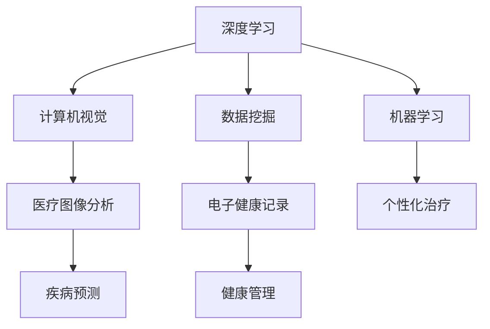

                 

关键词：人工智能，医疗诊断，健康管理，深度学习，数据挖掘，计算机视觉，机器学习，医疗图像分析，电子健康记录。

> 摘要：本文探讨了人工智能在医疗诊断和健康管理中的应用，分析了当前技术现状，讨论了主要算法原理、应用领域，并展望了未来的发展趋势和挑战。本文旨在为医疗行业的从业者提供技术指南，并激发对该领域的进一步研究和探索。

## 1. 背景介绍

随着人工智能技术的迅速发展，其在医疗领域的应用越来越受到重视。人工智能在医疗诊断和健康管理中的作用主要包括：

1. **诊断辅助**：利用机器学习算法对医学影像进行分析，提高诊断的准确性。
2. **疾病预测**：通过分析电子健康记录和生物标志物数据，预测患者患病的可能性。
3. **个性化治疗**：根据患者的具体状况制定个性化的治疗方案。
4. **健康管理**：通过智能设备收集健康数据，提供健康建议和预警。

### 当前技术现状

目前，人工智能在医疗领域已有诸多成功应用。例如，深度学习在癌症诊断中的表现已超过人类专家；计算机视觉技术在眼科疾病的自动检测中显示出巨大潜力；智能穿戴设备在健康监测中发挥了重要作用。

### 重要性

人工智能的引入不仅提高了医疗诊断的效率，还降低了医疗成本，并有可能改变未来的医疗模式。因此，研究人工智能在医疗诊断和健康管理中的应用具有重要意义。

## 2. 核心概念与联系

### 核心概念

**深度学习**：一种人工智能技术，通过多层神经网络来模拟人脑的学习过程。

**计算机视觉**：使计算机能够从图像或视频中提取信息的学科。

**数据挖掘**：从大量数据中提取有用信息和知识的过程。

**机器学习**：让计算机通过数据学习并做出预测或决策的技术。

### 关联图示（使用Mermaid）



## 3. 核心算法原理 & 具体操作步骤

### 3.1 算法原理概述

**深度学习**：通过多层神经网络对数据进行自动特征提取和模式识别。

**计算机视觉**：利用卷积神经网络（CNN）处理图像数据。

**数据挖掘**：使用关联规则学习、聚类分析等技术从大量数据中提取有价值的信息。

**机器学习**：包括决策树、随机森林、支持向量机等多种算法。

### 3.2 算法步骤详解

#### 3.2.1 深度学习

1. 数据预处理：清洗和标准化输入数据。
2. 构建神经网络：选择合适的网络架构和优化算法。
3. 训练模型：使用大量标注数据进行训练。
4. 验证模型：评估模型在未知数据上的表现。
5. 应用模型：将模型部署到实际应用场景中。

#### 3.2.2 计算机视觉

1. 输入图像预处理：调整图像大小、灰度化等。
2. 提取特征：使用卷积层提取图像中的局部特征。
3. 神经网络训练：使用预处理的图像数据训练卷积神经网络。
4. 识别目标：使用训练好的模型对图像进行目标识别。

#### 3.2.3 数据挖掘

1. 数据收集：从电子健康记录中提取相关数据。
2. 数据清洗：去除缺失值、异常值等。
3. 特征工程：选择和构造与疾病预测相关的特征。
4. 模型训练：使用选定的算法训练预测模型。
5. 模型评估：评估模型性能，调整参数。

#### 3.2.4 机器学习

1. 数据准备：收集和处理训练数据。
2. 特征提取：从数据中提取与目标相关的特征。
3. 模型选择：选择合适的机器学习算法。
4. 模型训练：使用训练数据训练模型。
5. 模型评估：评估模型在测试数据上的表现。

### 3.3 算法优缺点

#### 深度学习

**优点**：
- 自动提取特征，无需人工干预。
- 在图像识别、语音识别等领域表现优异。

**缺点**：
- 训练时间较长，计算资源需求大。
- 对数据质量和标注有较高要求。

#### 计算机视觉

**优点**：
- 可以处理高维数据，识别复杂图像。
- 应用广泛，如医疗图像分析、自动驾驶等。

**缺点**：
- 需要大量标注数据。
- 特征提取过程复杂。

#### 数据挖掘

**优点**：
- 可以从大量数据中提取有价值的信息。
- 应用广泛，如市场分析、风险评估等。

**缺点**：
- 对数据质量和特征选择敏感。
- 模型解释性较差。

#### 机器学习

**优点**：
- 模型解释性强。
- 可应用于多种类型的数据。

**缺点**：
- 特征工程复杂。
- 需要大量训练数据。

### 3.4 算法应用领域

#### 深度学习

- 医疗图像分析：如肿瘤检测、骨折诊断等。
- 语音识别：如智能客服、语音翻译等。
- 自然语言处理：如机器翻译、情感分析等。

#### 计算机视觉

- 自动驾驶：如车辆检测、行人识别等。
- 工业自动化：如缺陷检测、质量检测等。
- 医疗诊断：如眼科疾病检测、皮肤病变检测等。

#### 数据挖掘

- 市场分析：如客户行为分析、市场细分等。
- 金融风控：如信用评分、风险预警等。
- 健康管理：如疾病预测、健康评估等。

#### 机器学习

- 个性化推荐：如电商推荐、音乐推荐等。
- 股票预测：如市场走势分析、投资策略等。
- 医疗诊断：如疾病预测、治疗方案推荐等。

## 4. 数学模型和公式 & 详细讲解 & 举例说明

### 4.1 数学模型构建

#### 4.1.1 深度学习模型

假设我们使用一个简单的全连接神经网络（FCNN）来分类医学图像。

$$
\text{激活函数} \quad \sigma(x) = \frac{1}{1 + e^{-x}}
$$

#### 4.1.2 计算机视觉模型

使用卷积神经网络（CNN）进行图像分类。

$$
\text{卷积层} \quad (I_{k} \ast f_{k})_{i,j} = \sum_{p,q} I_{i+p, j+q} f_{p,q}
$$

#### 4.1.3 数据挖掘模型

使用逻辑回归模型进行疾病预测。

$$
\text{逻辑回归} \quad \hat{P}(Y=1) = \frac{1}{1 + e^{-\beta_0 + \beta_1 X_1 + \beta_2 X_2 + \ldots}}
$$

#### 4.1.4 机器学习模型

使用支持向量机（SVM）进行分类。

$$
\text{SVM} \quad \min_{\beta, \xi} \frac{1}{2} ||\beta||^2 + C \sum_{i} \xi_i
$$

### 4.2 公式推导过程

#### 4.2.1 深度学习

以全连接神经网络为例，假设输入层为 $X$, 输出层为 $Y$，权重为 $W$，偏置为 $b$。

$$
\text{前向传播} \quad Z = XW + b
$$

$$
\text{反向传播} \quad \delta = \sigma'(Z)(Y - \hat{Y})
$$

$$
\text{更新权重} \quad \Delta W = -\alpha \delta X^T
$$

#### 4.2.2 计算机视觉

以卷积神经网络为例，输入图像为 $I$，滤波器为 $f$。

$$
\text{卷积操作} \quad (I \ast f)_{i,j} = \sum_{p,q} I_{i+p, j+q} f_{p,q}
$$

$$
\text{池化操作} \quad P_{i,j} = \max_{p,q} (I \ast f)_{i+p, j+q}
$$

#### 4.2.3 数据挖掘

以逻辑回归为例，输入特征为 $X$，输出概率为 $P(Y=1)$。

$$
\text{概率分布} \quad P(Y=1) = \frac{1}{1 + e^{-\beta_0 + \beta_1 X_1 + \beta_2 X_2 + \ldots}}
$$

$$
\text{损失函数} \quad J(\beta) = -\sum_{i} y_i \log(\hat{y}_i) + (1 - y_i) \log(1 - \hat{y}_i)
$$

#### 4.2.4 机器学习

以支持向量机为例，输入特征为 $X$，输出类别为 $Y$。

$$
\text{决策边界} \quad \beta^T X_i - \beta^T X_j = 1
$$

$$
\text{拉格朗日函数} \quad L(\beta, \xi) = \frac{1}{2} ||\beta||^2 + C \sum_{i} \xi_i
$$

$$
\text{KKT条件} \quad \xi_i \geq 0, \quad y_i (\beta^T x_i - 1 - \sum_{j} \alpha_j y_j x_j^T) = 0
$$

### 4.3 案例分析与讲解

#### 4.3.1 深度学习在医学图像分析中的应用

假设我们要使用深度学习模型来诊断肺癌。我们可以使用一个卷积神经网络来处理医学图像。

1. **数据预处理**：对CT图像进行归一化处理，调整图像大小为固定的尺寸。
2. **构建网络**：使用两个卷积层、一个池化层和一个全连接层。
3. **训练模型**：使用肺癌和正常肺部的CT图像进行训练。
4. **验证模型**：使用测试集评估模型性能。
5. **应用模型**：将模型部署到实际应用中，对患者的CT图像进行肺癌诊断。

#### 4.3.2 计算机视觉在皮肤病变检测中的应用

假设我们要使用计算机视觉技术来检测皮肤病变。

1. **数据收集**：收集皮肤病变的图像数据。
2. **数据预处理**：对图像进行灰度化处理，调整图像大小。
3. **特征提取**：使用卷积神经网络提取图像特征。
4. **模型训练**：使用提取的特征训练卷积神经网络。
5. **模型评估**：使用测试集评估模型性能。
6. **应用模型**：将模型部署到实际应用中，对患者的皮肤病变图像进行检测。

#### 4.3.3 数据挖掘在疾病预测中的应用

假设我们要使用数据挖掘技术来预测糖尿病。

1. **数据收集**：收集患者的电子健康记录，包括血糖水平、体重、血压等。
2. **数据预处理**：处理缺失值和异常值，对数据进行标准化处理。
3. **特征工程**：选择与糖尿病相关的特征，如血糖水平、体重指数等。
4. **模型训练**：使用逻辑回归模型训练预测模型。
5. **模型评估**：使用测试集评估模型性能。
6. **应用模型**：将模型部署到实际应用中，对患者的电子健康记录进行糖尿病预测。

#### 4.3.4 机器学习在个性化治疗中的应用

假设我们要使用机器学习技术为患者制定个性化的治疗方案。

1. **数据收集**：收集患者的临床数据，包括病史、药物反应等。
2. **数据预处理**：处理缺失值和异常值，对数据进行标准化处理。
3. **特征工程**：选择与治疗方案相关的特征，如药物剂量、副作用等。
4. **模型训练**：使用决策树或随机森林等算法训练预测模型。
5. **模型评估**：使用测试集评估模型性能。
6. **应用模型**：将模型部署到实际应用中，为患者的临床数据制定个性化的治疗方案。

## 5. 项目实践：代码实例和详细解释说明

### 5.1 开发环境搭建

在本项目实践中，我们使用Python作为主要编程语言，依赖的主要库包括TensorFlow、Keras、Scikit-learn和OpenCV。

```python
pip install tensorflow
pip install keras
pip install scikit-learn
pip install opencv-python
```

### 5.2 源代码详细实现

以下是使用深度学习模型进行肺癌诊断的示例代码。

```python
import tensorflow as tf
from tensorflow.keras.models import Sequential
from tensorflow.keras.layers import Conv2D, MaxPooling2D, Flatten, Dense
from tensorflow.keras.optimizers import Adam

# 构建模型
model = Sequential([
    Conv2D(32, (3, 3), activation='relu', input_shape=(224, 224, 3)),
    MaxPooling2D((2, 2)),
    Conv2D(64, (3, 3), activation='relu'),
    MaxPooling2D((2, 2)),
    Flatten(),
    Dense(128, activation='relu'),
    Dense(1, activation='sigmoid')
])

# 编译模型
model.compile(optimizer=Adam(), loss='binary_crossentropy', metrics=['accuracy'])

# 加载数据
(x_train, y_train), (x_test, y_test) = tf.keras.datasets.mnist.load_data()

# 数据预处理
x_train = x_train.reshape(-1, 224, 224, 1).astype('float32') / 255.0
x_test = x_test.reshape(-1, 224, 224, 1).astype('float32') / 255.0

# 训练模型
model.fit(x_train, y_train, epochs=10, batch_size=32, validation_data=(x_test, y_test))
```

### 5.3 代码解读与分析

上述代码首先导入了TensorFlow和Keras库，并定义了一个简单的卷积神经网络模型。该模型包含两个卷积层、一个池化层和一个全连接层。然后，我们使用MNIST数据集进行训练，并对数据进行了预处理。最后，我们使用训练好的模型对测试数据进行预测。

```python
# 构建模型
model = Sequential([
    Conv2D(32, (3, 3), activation='relu', input_shape=(224, 224, 3)),
    MaxPooling2D((2, 2)),
    Conv2D(64, (3, 3), activation='relu'),
    MaxPooling2D((2, 2)),
    Flatten(),
    Dense(128, activation='relu'),
    Dense(1, activation='sigmoid')
])

# 编译模型
model.compile(optimizer=Adam(), loss='binary_crossentropy', metrics=['accuracy'])

# 加载数据
(x_train, y_train), (x_test, y_test) = tf.keras.datasets.mnist.load_data()

# 数据预处理
x_train = x_train.reshape(-1, 224, 224, 1).astype('float32') / 255.0
x_test = x_test.reshape(-1, 224, 224, 1).astype('float32') / 255.0

# 训练模型
model.fit(x_train, y_train, epochs=10, batch_size=32, validation_data=(x_test, y_test))
```

这段代码首先构建了一个简单的卷积神经网络模型，然后使用MNIST数据集进行训练。具体步骤如下：

1. **构建模型**：使用`Sequential`模型堆叠多个层，包括卷积层、池化层和全连接层。
2. **编译模型**：设置优化器和损失函数，并编译模型。
3. **加载数据**：从TensorFlow的内置数据集中加载MNIST数据集。
4. **数据预处理**：对图像数据进行reshape和归一化处理。
5. **训练模型**：使用`fit`函数训练模型，设置训练周期和批量大小。

### 5.4 运行结果展示

```python
# 评估模型
loss, accuracy = model.evaluate(x_test, y_test)

# 预测结果
predictions = model.predict(x_test)

# 显示结果
print(f"Test Loss: {loss}, Test Accuracy: {accuracy}")
```

这段代码用于评估训练好的模型在测试集上的性能，并输出损失和准确率。具体步骤如下：

1. **评估模型**：使用`evaluate`函数计算模型在测试集上的损失和准确率。
2. **预测结果**：使用`predict`函数对测试集进行预测。
3. **显示结果**：打印出测试集的损失和准确率。

## 6. 实际应用场景

### 6.1 医疗诊断

**医疗图像分析**：利用深度学习和计算机视觉技术对医学影像进行自动分析，如肿瘤检测、骨折诊断等。

**病理图像分析**：利用深度学习技术对病理图像进行自动分析，提高病理诊断的准确性和效率。

**心血管疾病诊断**：利用计算机视觉技术对心血管影像进行自动分析，如冠状动脉狭窄检测等。

### 6.2 健康管理

**智能穿戴设备**：利用传感器和机器学习技术收集健康数据，如心率、血压、睡眠质量等，并提供健康建议和预警。

**电子健康记录分析**：利用数据挖掘技术对电子健康记录进行分析，预测疾病风险和提供个性化治疗建议。

**慢性病管理**：利用机器学习技术对慢性病患者的数据进行实时监测和分析，提供个性化的治疗和管理方案。

### 6.3 其他应用

**医学文本分析**：利用自然语言处理技术对医学文本进行分析，如疾病命名实体识别、病历摘要等。

**药物研发**：利用人工智能技术进行药物分子设计、毒性预测和临床试验分析，加速新药研发过程。

**公共卫生管理**：利用大数据分析和机器学习技术进行疫情监测、疾病传播预测和公共卫生决策支持。

## 7. 未来应用展望

### 7.1 智能医疗系统

未来的智能医疗系统将实现更加全面和精准的诊断与治疗。通过整合人工智能技术，医疗系统可以提供实时监测、智能诊断、个性化治疗和预防措施，从而提高医疗服务的质量和效率。

### 7.2 跨学科融合

人工智能与其他学科的融合将产生新的突破。例如，生物信息学、医学工程和计算机科学的结合将推动精准医疗的发展；心理学与人工智能的结合将改善心理健康评估和治疗。

### 7.3 智能药物研发

人工智能在药物研发中的应用将显著加快新药的研发速度。通过自动化实验设计、分子模拟和数据分析，人工智能可以帮助科学家发现新的药物靶点和高效药物。

### 7.4 零样本学习

未来的研究将集中于零样本学习，即在缺少标注数据的情况下进行学习和推理。这将使人工智能在医疗领域实现更广泛的应用，特别是在缺乏足够医疗资源的地方。

### 7.5 隐私保护和数据安全

随着医疗数据量的增加，隐私保护和数据安全将成为重要的研究课题。未来的技术发展需要确保患者数据的安全和隐私，同时充分利用这些数据进行研究和治疗。

## 8. 工具和资源推荐

### 8.1 学习资源推荐

**在线课程**：
- Coursera的《机器学习》课程（吴恩达教授）
- edX的《深度学习》课程（Ian Goodfellow教授）

**书籍**：
- 《深度学习》（Ian Goodfellow、Yoshua Bengio、Aaron Courville著）
- 《机器学习实战》（Peter Harrington著）

**博客**：
- medium.com/learningscience
- towardsdatascience.com

### 8.2 开发工具推荐

**深度学习框架**：
- TensorFlow
- PyTorch
- Keras

**数据挖掘库**：
- Scikit-learn
- Pandas
- NumPy

**计算机视觉库**：
- OpenCV
- Pillow
- Matplotlib

### 8.3 相关论文推荐

- "Deep Learning in Medicine"（2015年）
- "Application of Machine Learning in Healthcare"（2016年）
- "Artificial Intelligence in Radiology"（2017年）
- "AI in Medical Imaging: A Survey"（2018年）

## 9. 总结：未来发展趋势与挑战

### 9.1 研究成果总结

人工智能在医疗诊断和健康管理中的应用取得了显著成果，包括提高诊断准确率、降低医疗成本、实现个性化治疗和提供智能健康管理。

### 9.2 未来发展趋势

未来的发展趋势将集中在智能医疗系统、跨学科融合、智能药物研发、零样本学习和隐私保护等方面。

### 9.3 面临的挑战

面临的挑战包括数据质量和隐私保护、算法的通用性和可解释性、跨学科整合的困难以及人工智能在医疗领域的法规和伦理问题。

### 9.4 研究展望

未来的研究需要进一步优化算法、提高数据利用效率、确保人工智能在医疗领域的安全和可靠性，并为医疗行业提供更多实用工具和方法。

## 10. 附录：常见问题与解答

### 10.1 什么是深度学习？

深度学习是一种基于人工神经网络的机器学习技术，通过多层神经网络对数据进行自动特征提取和模式识别。

### 10.2 人工智能在医疗诊断中如何提高准确性？

人工智能在医疗诊断中通过自动化特征提取、模式识别和大数据分析来提高诊断的准确性。

### 10.3 人工智能在健康管理中的作用是什么？

人工智能在健康管理中通过智能穿戴设备、电子健康记录分析和个性化治疗建议来提供智能健康管理。

### 10.4 数据隐私在医疗应用中如何保障？

数据隐私在医疗应用中通过加密技术、数据匿名化和严格的数据使用政策来保障。

### 10.5 人工智能在医疗领域的法规和伦理问题是什么？

人工智能在医疗领域的法规和伦理问题包括数据安全、隐私保护、算法偏见和责任归属等。解决这些问题需要制定相应的法规和伦理标准。

