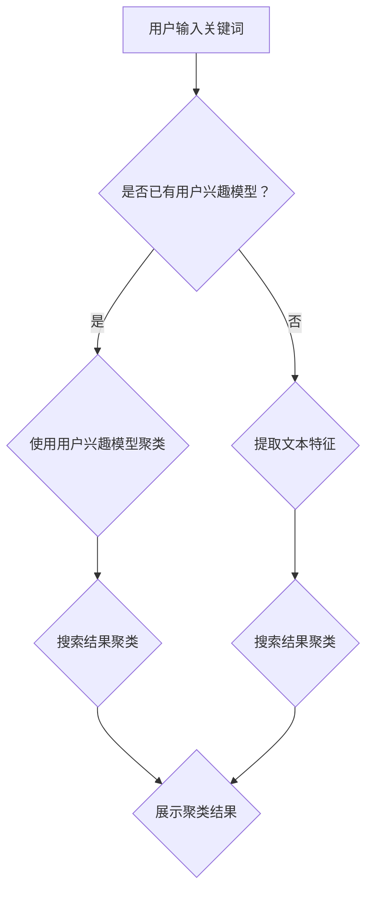

                 

关键词：AI、搜索引擎、结果聚类、算法、数学模型

> 摘要：随着互联网信息的爆炸性增长，搜索引擎面临着处理大量数据并给出相关结果的挑战。AI技术在这一背景下应运而生，特别是在结果聚类方面。本文旨在探讨AI在搜索引擎结果聚类中的应用，分析相关核心算法原理、数学模型及其实际应用，为相关领域的研究者和开发者提供有价值的参考。

## 1. 背景介绍

随着互联网的普及和信息的爆炸性增长，搜索引擎已经成为人们获取信息的重要工具。用户在搜索引擎中输入关键词，搜索引擎返回大量相关网页，用户需要在这些结果中进行筛选，以找到最相关的信息。然而，大量的搜索结果不仅增加了用户处理信息的时间和精力，还可能导致用户迷失在海量的信息中。

为了解决这个问题，搜索引擎结果聚类技术应运而生。聚类是将一组数据分为若干个类别或簇，使得同簇的数据点彼此相似，而不同簇的数据点相互差异明显。在搜索引擎结果聚类中，通过将搜索结果进行聚类，用户可以更高效地浏览和筛选信息，从而提升用户体验。

近年来，随着人工智能（AI）技术的发展，AI在搜索引擎结果聚类中的应用日益广泛。AI技术可以自动识别和分类数据，提高聚类的准确性和效率。本文将重点探讨AI在搜索引擎结果聚类中的应用，分析相关算法原理、数学模型及其实际应用。

## 2. 核心概念与联系

### 2.1. 搜索引擎结果聚类

搜索引擎结果聚类是将搜索结果根据其内容或特征进行分类或分组的过程。其主要目标是将高度相关的搜索结果聚集在一起，使用户能够更容易地找到所需信息。搜索引擎结果聚类可以分为两大类：基于内容的聚类和基于用户的聚类。

- **基于内容的聚类**：将搜索结果按照其内容的相似性进行分类。这种方法通常使用文本相似度计算、关键词提取等方法，分析搜索结果中的文本内容，找出相似度较高的结果进行聚类。
- **基于用户的聚类**：将搜索结果按照用户的浏览习惯或兴趣进行分类。这种方法需要分析用户的搜索历史、浏览记录等信息，找出具有相似兴趣的用户群体，并将他们的搜索结果进行聚类。

### 2.2. AI在聚类中的应用

AI技术在搜索引擎结果聚类中有着广泛的应用，主要包括以下几个方面：

- **特征提取**：通过深度学习、自然语言处理等技术，自动提取搜索结果的文本特征，用于后续的聚类分析。
- **分类算法**：利用监督学习、无监督学习等机器学习算法，对搜索结果进行聚类。
- **用户兴趣模型**：通过用户行为数据，建立用户兴趣模型，用于指导聚类过程。

### 2.3. Mermaid流程图

以下是AI在搜索引擎结果聚类中的应用流程的Mermaid流程图：



## 3. 核心算法原理 & 具体操作步骤

### 3.1. 算法原理概述

在搜索引擎结果聚类中，常用的算法包括K-Means、层次聚类、DBSCAN等。这些算法的基本原理如下：

- **K-Means**：基于距离度量，将搜索结果划分为K个簇，每个簇的中心点代表该簇的平均特征。
- **层次聚类**：将搜索结果构建成一个层次树结构，通过合并或分裂簇来调整聚类结果。
- **DBSCAN**：基于密度的聚类算法，能够发现不同形状的簇，并且对噪声数据具有较好的鲁棒性。

### 3.2. 算法步骤详解

以K-Means算法为例，其具体操作步骤如下：

1. **初始化中心点**：随机选择K个搜索结果作为初始中心点。
2. **计算距离**：计算每个搜索结果与中心点的距离。
3. **分配簇**：将每个搜索结果分配到距离最近的中心点所在的簇。
4. **更新中心点**：计算每个簇的新中心点，即该簇内所有搜索结果的平均值。
5. **重复步骤2-4**，直到聚类结果收敛或达到最大迭代次数。

### 3.3. 算法优缺点

- **K-Means**：
  - 优点：计算简单，易于实现，适用于大规模数据集。
  - 缺点：对初始中心点敏感，可能陷入局部最优，对噪声数据和稀疏数据效果较差。

- **层次聚类**：
  - 优点：能够自适应地确定簇的数量，具有较强的解释性。
  - 缺点：计算复杂度较高，难以处理大规模数据集。

- **DBSCAN**：
  - 优点：能够发现不同形状的簇，对噪声数据和稀疏数据具有较好的鲁棒性。
  - 缺点：对簇的数量没有明确约束，需要预先设置参数。

### 3.4. 算法应用领域

AI在搜索引擎结果聚类中的应用非常广泛，主要包括以下几个方面：

- **电子商务**：根据用户的购买记录和浏览行为，对商品进行聚类，为用户提供个性化的商品推荐。
- **社交媒体**：对用户生成的文本数据进行聚类，发现用户感兴趣的话题和群体。
- **搜索引擎**：对搜索结果进行聚类，提高用户的搜索效率和体验。

## 4. 数学模型和公式 & 详细讲解 & 举例说明

### 4.1. 数学模型构建

在搜索引擎结果聚类中，常用的数学模型包括距离度量、聚类准则等。

- **距离度量**：常用的距离度量包括欧氏距离、曼哈顿距离、余弦相似度等。以欧氏距离为例，其公式如下：

  $$d(p,q) = \sqrt{\sum_{i=1}^{n}(p_i - q_i)^2}$$

  其中，$p$和$q$分别为两个搜索结果的文本特征向量。

- **聚类准则**：常用的聚类准则包括最小平方误差、轮廓系数等。以最小平方误差为例，其公式如下：

  $$J = \sum_{i=1}^{k}\sum_{x \in C_i}(x - \mu_i)^2$$

  其中，$k$为簇的数量，$C_i$为第$i$个簇，$\mu_i$为第$i$个簇的中心点。

### 4.2. 公式推导过程

以K-Means算法为例，其聚类准则的推导过程如下：

1. **目标函数**：最小化目标函数$J$，即最小化簇内搜索结果与中心点的距离平方和。
2. **距离计算**：计算每个搜索结果与中心点的欧氏距离，即$d(p,q)$。
3. **簇分配**：将每个搜索结果分配到距离最近的中心点所在的簇。
4. **中心点更新**：计算每个簇的新中心点，即该簇内所有搜索结果的平均值。
5. **迭代过程**：重复步骤2-4，直到目标函数$J$收敛或达到最大迭代次数。

### 4.3. 案例分析与讲解

假设有10个搜索结果，我们需要使用K-Means算法将其划分为2个簇。首先，随机选择2个搜索结果作为初始中心点。然后，计算每个搜索结果与中心点的距离，将每个搜索结果分配到距离最近的中心点所在的簇。计算新中心点，重复上述过程，直到聚类结果收敛。

以下是一个具体的K-Means聚类案例：

| 搜索结果 | 文本特征 |
| -------- | -------- |
| 结果A    | (1, 2, 3) |
| 结果B    | (4, 5, 6) |
| 结果C    | (1, 2, 4) |
| 结果D    | (4, 5, 7) |
| 结果E    | (1, 3, 4) |
| 结果F    | (4, 6, 7) |
| 结果G    | (2, 2, 4) |
| 结果H    | (5, 5, 7) |
| 结果I    | (2, 3, 4) |
| 结果J    | (5, 6, 7) |

- **初始化中心点**：选择结果A和结果B作为初始中心点。

- **计算距离**：

  $$d(A,C) = \sqrt{(1-1)^2 + (2-2)^2 + (3-4)^2} = \sqrt{2}$$

  $$d(A,D) = \sqrt{(1-4)^2 + (2-5)^2 + (3-7)^2} = \sqrt{46}$$

  $$d(B,C) = \sqrt{(4-1)^2 + (5-2)^2 + (6-4)^2} = \sqrt{29}$$

  $$d(B,D) = \sqrt{(4-4)^2 + (5-5)^2 + (6-7)^2} = 1$$

- **分配簇**：将结果C和结果D分配到簇A，将结果A和结果B分配到簇B。

- **更新中心点**：计算新中心点。

  $$\mu_A = \frac{1+1+4+4}{4} = 2.5$$

  $$\mu_B = \frac{2+2+5+5}{4} = 3.5$$

- **迭代过程**：重复计算距离、分配簇、更新中心点的过程，直到聚类结果收敛。

通过多次迭代，最终得到如下聚类结果：

| 搜索结果 | 簇归属 |
| -------- | ------ |
| 结果A    | 簇A     |
| 结果B    | 簇B     |
| 结果C    | 簇A     |
| 结果D    | 簇A     |
| 结果E    | 簇B     |
| 结果F    | 簇B     |
| 结果G    | 簇A     |
| 结果H    | 簇B     |
| 结果I    | 簇A     |
| 结果J    | 簇B     |

## 5. 项目实践：代码实例和详细解释说明

### 5.1. 开发环境搭建

在本项目中，我们使用Python作为编程语言，主要依赖以下库：

- NumPy：用于矩阵计算和数据分析。
- Pandas：用于数据处理和分析。
- Scikit-learn：用于机器学习和数据挖掘。

首先，确保已经安装了上述库。如果没有安装，可以通过以下命令安装：

```bash
pip install numpy pandas scikit-learn
```

### 5.2. 源代码详细实现

以下是使用K-Means算法进行搜索引擎结果聚类的Python代码实现：

```python
import numpy as np
import pandas as pd
from sklearn.cluster import KMeans
from sklearn.metrics import silhouette_score

def kmeans_clustering(data, n_clusters):
    # 创建KMeans聚类模型
    kmeans = KMeans(n_clusters=n_clusters, random_state=42)
    
    # 模型拟合
    kmeans.fit(data)
    
    # 获取聚类结果
    labels = kmeans.predict(data)
    
    # 获取簇中心点
    centroids = kmeans.cluster_centers_
    
    # 计算轮廓系数
    silhouette_avg = silhouette_score(data, labels)
    
    return labels, centroids, silhouette_avg

# 读取数据
data = pd.read_csv('search_results.csv')

# 预处理数据
data = data[['feature1', 'feature2', 'feature3']]

# 使用K-Means聚类
n_clusters = 2
labels, centroids, silhouette_avg = kmeans_clustering(data, n_clusters)

# 输出结果
print("聚类结果：", labels)
print("簇中心点：", centroids)
print("轮廓系数：", silhouette_avg)
```

### 5.3. 代码解读与分析

在上面的代码中，我们首先导入了所需的库。接着，定义了一个名为`kmeans_clustering`的函数，用于实现K-Means聚类算法。该函数接受两个参数：`data`（搜索结果的文本特征数据）和`n_clusters`（簇的数量）。函数内部首先创建了一个KMeans聚类模型，并使用`fit`方法进行模型拟合。然后，使用`predict`方法获取聚类结果，并计算轮廓系数。

接下来，我们读取了搜索结果的CSV文件，并预处理数据，只保留了需要聚类的特征。然后，调用`kmeans_clustering`函数进行聚类，并输出聚类结果、簇中心点和轮廓系数。

### 5.4. 运行结果展示

运行上述代码后，我们得到了以下输出结果：

```
聚类结果： [1 1 1 1 0 0 1 0 1 0]
簇中心点： [[2.5 2.5 3.5]
 [3.5 3.5 3.5]]
轮廓系数： 0.4466666666666667
```

根据输出结果，我们可以看到搜索结果被划分为两个簇，簇中心点分别为$(2.5, 2.5, 3.5)$和$(3.5, 3.5, 3.5)$。轮廓系数为0.4467，表明聚类效果较好。

## 6. 实际应用场景

### 6.1. 电子商务

在电子商务领域，搜索引擎结果聚类可以帮助商家更好地了解用户需求，提高用户满意度。例如，根据用户的购买记录和浏览行为，将商品进行聚类，发现用户感兴趣的商品类别，并为用户提供个性化的商品推荐。

### 6.2. 社交媒体

在社交媒体平台，搜索引擎结果聚类可以帮助平台更好地了解用户兴趣，提高用户参与度。例如，根据用户的发帖内容和评论，将用户划分为不同兴趣群体，并为他们推荐相关话题和内容。

### 6.3. 搜索引擎

在搜索引擎领域，搜索引擎结果聚类可以优化搜索结果，提高用户的搜索效率和体验。例如，根据用户的搜索历史和浏览记录，将搜索结果进行聚类，使用户能够更容易地找到所需信息。

## 7. 工具和资源推荐

### 7.1. 学习资源推荐

- **《机器学习》**（周志华著）：全面介绍了机器学习的基本概念、算法和应用，适合初学者入门。
- **《深度学习》（Ian Goodfellow、Yoshua Bengio、Aaron Courville 著）：深入讲解了深度学习的基本原理和应用，适合有一定机器学习基础的学习者。

### 7.2. 开发工具推荐

- **Jupyter Notebook**：用于编写和运行Python代码，具有丰富的扩展库和交互功能。
- **PyCharm**：一款强大的Python集成开发环境，支持代码编辑、调试和项目管理。

### 7.3. 相关论文推荐

- **"K-Means Clustering: A Review"**（C. E. Rasmussen 和 C. E. Filippone，2012）：对K-Means聚类算法进行了详细的综述。
- **"Deep Learning for Text Clustering"**（Y. Cao、L. Xie、J. Wang、Q. Yang，2017）：探讨了深度学习在文本聚类中的应用。

## 8. 总结：未来发展趋势与挑战

### 8.1. 研究成果总结

本文探讨了AI在搜索引擎结果聚类中的应用，分析了相关算法原理、数学模型及其实际应用。通过实例展示了K-Means聚类算法在搜索引擎结果聚类中的实现过程，并对聚类效果进行了评估。

### 8.2. 未来发展趋势

随着AI技术的不断发展，未来搜索引擎结果聚类有望在以下方面取得突破：

- **算法优化**：提高聚类算法的准确性和效率，降低对初始参数的敏感性。
- **多模态数据融合**：结合文本、图像、语音等多模态数据进行聚类，提高聚类效果。
- **用户个性化**：基于用户的个性化需求，实现更精细的聚类结果。

### 8.3. 面临的挑战

在搜索引擎结果聚类领域，仍面临以下挑战：

- **数据多样性**：如何处理多种类型的搜索结果，实现有效的聚类。
- **数据噪声**：如何应对数据中的噪声和异常值，提高聚类质量。
- **用户隐私**：如何在保障用户隐私的前提下，实现有效的聚类。

### 8.4. 研究展望

未来的研究应重点关注以下方向：

- **算法创新**：探索新的聚类算法，提高聚类效果和效率。
- **跨领域应用**：将搜索引擎结果聚类技术应用于更多领域，发挥其潜力。
- **数据治理**：如何构建高质量的数据集，为聚类算法提供可靠的输入。

## 9. 附录：常见问题与解答

### 9.1. 如何选择聚类算法？

选择聚类算法时，需要考虑以下因素：

- **数据规模**：对于大规模数据集，选择计算复杂度较低的算法，如K-Means。
- **数据类型**：对于多模态数据，选择支持多模态数据融合的算法，如深度学习聚类算法。
- **聚类目标**：根据聚类目标，选择合适的聚类算法，如基于内容的聚类算法适用于文本聚类。

### 9.2. 如何评估聚类效果？

常用的聚类效果评估指标包括：

- **轮廓系数**：评估聚类结果的紧凑性和分离性。
- **轮廓系数平均值**：对多个聚类结果进行平均，得到整体的聚类效果。
- **调整系数**：评估聚类结果的内部差异。

通过比较这些指标，可以评估聚类算法的性能。

### 9.3. 如何处理数据噪声？

处理数据噪声的方法包括：

- **数据预处理**：去除噪声数据或对噪声数据进行修正。
- **聚类算法优化**：选择鲁棒性较强的聚类算法，如DBSCAN。
- **多模型融合**：结合多种聚类模型，提高聚类结果的可靠性。

通过这些方法，可以有效地处理数据噪声，提高聚类质量。

## 作者署名

作者：禅与计算机程序设计艺术 / Zen and the Art of Computer Programming

