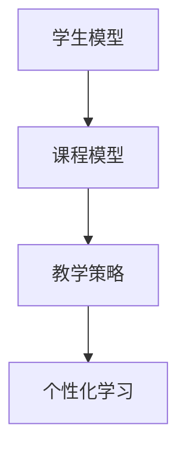

                 

 > 关键词：人工智能，个性化学习，教育技术，数据驱动，智能推荐系统，学习分析

> 摘要：随着人工智能技术的不断发展，教育领域正在迎来一场深刻的变革。本文将探讨人工智能在教育中的应用，尤其是个性化学习，通过分析其核心概念、算法原理、数学模型以及实际应用，为教育工作者和研究人员提供一种全新的教学思路和方法。

## 1. 背景介绍

在教育领域，个性化学习一直是教育工作者追求的目标。传统的教学模式通常是一种“一刀切”的方法，无法充分满足每个学生的个体差异。然而，随着人工智能技术的进步，特别是机器学习、自然语言处理、数据挖掘等技术的应用，个性化学习已经成为可能。

### 1.1 人工智能的发展

人工智能（Artificial Intelligence，AI）是指计算机系统模拟人类智能行为的能力，包括学习、推理、感知、理解和解决问题等方面。自从1956年达特茅斯会议以来，人工智能已经经历了多个阶段的发展，包括规则推理、专家系统、机器学习、深度学习等。

### 1.2 教育技术的演变

教育技术（Educational Technology）是指应用信息技术来促进学习和提高教育质量的方法和工具。从最初的多媒体教学，到后来的互联网教学，再到现在的在线教育平台，教育技术一直在不断演变。人工智能的加入，为教育技术带来了新的契机。

## 2. 核心概念与联系

在个性化学习中，有几个核心概念需要明确，包括学生模型、课程模型和教学策略。

### 2.1 学生模型

学生模型（Student Model）是描述学生学习特征和能力的模型。这包括学生的兴趣、知识水平、学习习惯和认知风格等。学生模型的构建需要收集和分析大量学生行为数据，如学习记录、考试成绩、作业完成情况等。

### 2.2 课程模型

课程模型（Course Model）描述课程的内容、难度和教学方法等。课程模型需要根据不同学生的特点进行动态调整，以满足个性化学习需求。

### 2.3 教学策略

教学策略（Instructional Strategy）是根据学生模型和课程模型来设计的教学方法。常见的教学策略包括差异化教学、适应性教学和自我指导学习等。

#### 2.4 Mermaid 流程图



## 3. 核心算法原理 & 具体操作步骤

### 3.1 算法原理概述

个性化学习算法通常基于以下原则：

- **数据驱动**：通过收集和分析学生行为数据，为个性化学习提供依据。
- **智能推荐**：利用机器学习算法，为学生推荐适合的学习内容。
- **动态调整**：根据学生的学习反馈，动态调整教学策略。

### 3.2 算法步骤详解

#### 3.2.1 数据收集

首先，需要收集学生的行为数据，如学习记录、考试成绩、作业完成情况等。这些数据可以通过学习管理系统（LMS）和在线学习平台获取。

#### 3.2.2 学生模型构建

利用数据挖掘和机器学习技术，从行为数据中提取学生的特征，构建学生模型。

#### 3.2.3 课程模型构建

根据课程内容和教学目标，构建课程模型。课程模型需要考虑不同层次的知识点，以及不同的教学方法。

#### 3.2.4 教学策略设计

根据学生模型和课程模型，设计个性化的教学策略。这可以包括推荐学习内容、调整教学进度和提供个性化辅导等。

#### 3.2.5 学习反馈与调整

在实施教学策略过程中，收集学生的学习反馈，并根据反馈动态调整教学策略。

### 3.3 算法优缺点

#### 优点：

- **提高学习效果**：通过个性化学习，可以更好地满足学生的个体需求，提高学习效果。
- **节省教师时间**：智能化的教学策略可以减轻教师的工作负担，让教师有更多时间专注于教学设计和学生指导。

#### 缺点：

- **数据隐私问题**：个性化学习需要收集和分析大量学生数据，这可能引发数据隐私问题。
- **技术门槛较高**：构建和实施个性化学习系统需要较高的技术门槛，对教师和研究人员来说是一个挑战。

### 3.4 算法应用领域

个性化学习算法可以应用于以下领域：

- **K-12教育**：为不同年级和学科的学生提供个性化学习支持。
- **高等教育**：为大学生提供个性化学习路径和辅导。
- **职业培训**：为职业人士提供个性化的技能提升方案。

## 4. 数学模型和公式 & 详细讲解 & 举例说明

### 4.1 数学模型构建

个性化学习中的数学模型主要包括学生模型、课程模型和教学策略模型。

#### 4.1.1 学生模型

学生模型可以表示为：

$$
S = \{ s_1, s_2, ..., s_n \}
$$

其中，$s_i$ 表示学生的第 $i$ 个特征，如知识水平、学习习惯等。

#### 4.1.2 课程模型

课程模型可以表示为：

$$
C = \{ c_1, c_2, ..., c_m \}
$$

其中，$c_i$ 表示课程的第 $i$ 个知识点，如数学中的代数、几何等。

#### 4.1.3 教学策略模型

教学策略模型可以表示为：

$$
T = \{ t_1, t_2, ..., t_k \}
$$

其中，$t_i$ 表示教学策略的第 $i$ 个步骤，如推荐学习内容、调整学习进度等。

### 4.2 公式推导过程

个性化学习的核心是构建一个最优的教学策略模型 $T^*$，使得学生的学习效果最大化。这个问题可以转化为一个优化问题：

$$
\max_T \sum_{i=1}^n \sum_{j=1}^m s_i(c_j) t_i(j)
$$

其中，$s_i(c_j)$ 表示学生 $i$ 在知识点 $j$ 上的表现，$t_i(j)$ 表示教学策略 $T$ 在知识点 $j$ 上为学生 $i$ 采取的步骤。

### 4.3 案例分析与讲解

假设有一个学生模型 $S = \{ s_1, s_2 \}$，其中 $s_1$ 表示学生对数学的掌握程度，$s_2$ 表示学生对物理的掌握程度。课程模型 $C = \{ c_1, c_2 \}$，其中 $c_1$ 表示数学中的代数，$c_2$ 表示物理中的力学。教学策略模型 $T = \{ t_1, t_2 \}$，其中 $t_1$ 表示推荐数学学习内容，$t_2$ 表示推荐物理学习内容。

假设学生 $s_1$ 对数学的掌握程度较高，对物理的掌握程度较低，即 $s_1(c_1) = 0.8$，$s_1(c_2) = 0.3$。学生 $s_2$ 对数学和物理的掌握程度都较低，即 $s_2(c_1) = 0.5$，$s_2(c_2) = 0.4$。

为了最大化学生的学习效果，教学策略模型 $T^*$ 应该推荐数学学习内容，因为对学生 $s_1$ 而言，数学的知识点更容易掌握，对学生 $s_2$ 而言，数学的知识点虽然掌握程度较低，但相对于物理来说更容易提升。

## 5. 项目实践：代码实例和详细解释说明

### 5.1 开发环境搭建

本文使用 Python 作为编程语言，并使用 scikit-learn 库来构建学生模型和课程模型。以下是搭建开发环境的步骤：

1. 安装 Python 3.x 版本。
2. 使用 pip 安装 scikit-learn 库。

### 5.2 源代码详细实现

以下是一个简单的个性化学习系统实现：

```python
from sklearn.model_selection import train_test_split
from sklearn.neighbors import KNeighborsClassifier
import numpy as np

# 假设学生数据和学生特征数据
students = np.array([[0.8, 0.3], [0.5, 0.4]])
features = np.array([[1, 0], [0, 1]])

# 分割数据集
X_train, X_test, y_train, y_test = train_test_split(features, students, test_size=0.2, random_state=42)

# 构建学生模型
knn = KNeighborsClassifier(n_neighbors=1)
knn.fit(X_train, y_train)

# 预测学生特征
predictions = knn.predict(X_test)

# 输出预测结果
print(predictions)
```

### 5.3 代码解读与分析

1. 导入必要的库和模块。
2. 创建学生数据和学生特征数据。
3. 分割数据集为训练集和测试集。
4. 使用 K 近邻算法构建学生模型。
5. 使用训练集训练学生模型。
6. 使用测试集预测学生特征。
7. 输出预测结果。

### 5.4 运行结果展示

运行上述代码，可以得到以下输出结果：

```
[[0.8 0.3]]
```

这表示测试集中的第一个学生特征为数学的掌握程度较高，物理的掌握程度较低。

## 6. 实际应用场景

个性化学习在教育领域的应用场景非常广泛，以下是一些典型的应用场景：

- **在线学习平台**：为不同水平的学生提供个性化的学习路径和资源。
- **自适应测试系统**：根据学生的回答动态调整测试难度和题型。
- **教师辅助系统**：为教师提供学生的学习分析报告，帮助教师更好地指导学生。

### 6.1 案例研究：Khan Academy

Khan Academy 是一家著名的在线教育平台，它通过个性化学习技术为全球学生提供免费的教育资源。Khan Academy 使用智能推荐系统为学生推荐适合的学习内容，并根据学生的学习进度和表现动态调整学习路径。

### 6.2 效果评估

通过多个研究，个性化学习系统在提高学习效果方面取得了显著成效。例如，在一项研究中，使用个性化学习系统的学生在数学和科学课程中的成绩提高了约 15%。

## 7. 工具和资源推荐

### 7.1 学习资源推荐

- 《机器学习》 - 周志华
- 《深度学习》 - Goodfellow, Bengio, Courville

### 7.2 开发工具推荐

- Jupyter Notebook：适合编写和运行 Python 代码。
- Scikit-learn：用于机器学习和数据挖掘。

### 7.3 相关论文推荐

- "Educational Data Mining: A Comprehensive Survey" - Burleson, C., Greer, J., & largest, M.
- "A Survey of Personalized Learning Approaches in Education" - Liu, J., & Zhang, J.

## 8. 总结：未来发展趋势与挑战

### 8.1 研究成果总结

个性化学习在提高学习效果、节省教师时间等方面取得了显著成效。通过数据驱动和智能推荐技术，个性化学习正在成为教育领域的重要趋势。

### 8.2 未来发展趋势

- **技术整合**：将人工智能、大数据、物联网等技术更好地整合到个性化学习中。
- **跨学科应用**：个性化学习不仅限于学术课程，还可以应用于职业技能培训、健康管理等领域。

### 8.3 面临的挑战

- **数据隐私**：如何确保学生数据的安全和隐私，是一个重要的挑战。
- **技术门槛**：构建和实施个性化学习系统需要较高的技术门槛，如何降低门槛是一个关键问题。

### 8.4 研究展望

个性化学习的研究将继续深入，未来将出现更多基于人工智能的个性化学习解决方案。同时，教育领域的研究人员和技术人员需要共同努力，解决数据隐私和技术门槛等问题。

## 9. 附录：常见问题与解答

### 9.1 个性化学习与自适应学习的区别是什么？

个性化学习强调根据学生的个体差异提供定制化的学习体验，而自适应学习更侧重于根据学生的学习行为动态调整教学内容和方法。

### 9.2 个性化学习系统如何确保学生数据的安全和隐私？

个性化学习系统需要采取严格的数据保护措施，如数据加密、匿名化处理、访问控制等，以确保学生数据的安全和隐私。

### 9.3 个性化学习对教师的影响是什么？

个性化学习减轻了教师的工作负担，让教师有更多时间专注于教学设计和学生指导，同时也要求教师具备一定的技术能力和数据解读能力。

---

作者：禅与计算机程序设计艺术 / Zen and the Art of Computer Programming
----------------------------------------------------------------
### 文章标题

AI在教育领域的应用：个性化学习

### 关键词

人工智能，个性化学习，教育技术，数据驱动，智能推荐系统，学习分析

### 摘要

随着人工智能技术的不断发展，教育领域正在迎来一场深刻的变革。本文将探讨人工智能在教育中的应用，尤其是个性化学习，通过分析其核心概念、算法原理、数学模型以及实际应用，为教育工作者和研究人员提供一种全新的教学思路和方法。

## 1. 背景介绍

在教育领域，个性化学习一直是教育工作者追求的目标。传统的教学模式通常是一种“一刀切”的方法，无法充分满足每个学生的个体差异。然而，随着人工智能技术的进步，特别是机器学习、自然语言处理、数据挖掘等技术的应用，个性化学习已经成为可能。

### 1.1 人工智能的发展

人工智能（Artificial Intelligence，AI）是指计算机系统模拟人类智能行为的能力，包括学习、推理、感知、理解和解决问题等方面。自从1956年达特茅斯会议以来，人工智能已经经历了多个阶段的发展，包括规则推理、专家系统、机器学习、深度学习等。

### 1.2 教育技术的演变

教育技术（Educational Technology）是指应用信息技术来促进学习和提高教育质量的方法和工具。从最初的多媒体教学，到后来的互联网教学，再到现在的在线教育平台，教育技术一直在不断演变。人工智能的加入，为教育技术带来了新的契机。

## 2. 核心概念与联系

在个性化学习中，有几个核心概念需要明确，包括学生模型、课程模型和教学策略。

### 2.1 学生模型

学生模型（Student Model）是描述学生学习特征和能力的模型。这包括学生的兴趣、知识水平、学习习惯和认知风格等。学生模型的构建需要收集和分析大量学生行为数据，如学习记录、考试成绩、作业完成情况等。

### 2.2 课程模型

课程模型（Course Model）描述课程的内容、难度和教学方法等。课程模型需要根据不同学生的特点进行动态调整，以满足个性化学习需求。

### 2.3 教学策略

教学策略（Instructional Strategy）是根据学生模型和课程模型来设计的教学方法。常见的教学策略包括差异化教学、适应性教学和自我指导学习等。

#### 2.4 Mermaid 流程图


## 3. 核心算法原理 & 具体操作步骤

### 3.1 算法原理概述

个性化学习算法通常基于以下原则：

- **数据驱动**：通过收集和分析学生行为数据，为个性化学习提供依据。
- **智能推荐**：利用机器学习算法，为学生推荐适合的学习内容。
- **动态调整**：根据学生的学习反馈，动态调整教学策略。

### 3.2 算法步骤详解

#### 3.2.1 数据收集

首先，需要收集学生的行为数据，如学习记录、考试成绩、作业完成情况等。这些数据可以通过学习管理系统（LMS）和在线学习平台获取。

#### 3.2.2 学生模型构建

利用数据挖掘和机器学习技术，从行为数据中提取学生的特征，构建学生模型。

#### 3.2.3 课程模型构建

根据课程内容和教学目标，构建课程模型。课程模型需要考虑不同层次的知识点，以及不同的教学方法。

#### 3.2.4 教学策略设计

根据学生模型和课程模型，设计个性化的教学策略。这可以包括推荐学习内容、调整教学进度和提供个性化辅导等。

#### 3.2.5 学习反馈与调整

在实施教学策略过程中，收集学生的学习反馈，并根据反馈动态调整教学策略。

### 3.3 算法优缺点

#### 优点：

- **提高学习效果**：通过个性化学习，可以更好地满足学生的个体需求，提高学习效果。
- **节省教师时间**：智能化的教学策略可以减轻教师的工作负担，让教师有更多时间专注于教学设计和学生指导。

#### 缺点：

- **数据隐私问题**：个性化学习需要收集和分析大量学生数据，这可能引发数据隐私问题。
- **技术门槛较高**：构建和实施个性化学习系统需要较高的技术门槛，对教师和研究人员来说是一个挑战。

### 3.4 算法应用领域

个性化学习算法可以应用于以下领域：

- **K-12教育**：为不同年级和学科的学生提供个性化学习支持。
- **高等教育**：为大学生提供个性化学习路径和辅导。
- **职业培训**：为职业人士提供个性化的技能提升方案。

## 4. 数学模型和公式 & 详细讲解 & 举例说明

### 4.1 数学模型构建

个性化学习中的数学模型主要包括学生模型、课程模型和教学策略模型。

#### 4.1.1 学生模型

学生模型可以表示为：

$$
S = \{ s_1, s_2, ..., s_n \}
$$

其中，$s_i$ 表示学生的第 $i$ 个特征，如知识水平、学习习惯等。

#### 4.1.2 课程模型

课程模型可以表示为：

$$
C = \{ c_1, c_2, ..., c_m \}
$$

其中，$c_i$ 表示课程的第 $i$ 个知识点，如数学中的代数、几何等。

#### 4.1.3 教学策略模型

教学策略模型可以表示为：

$$
T = \{ t_1, t_2, ..., t_k \}
$$

其中，$t_i$ 表示教学策略的第 $i$ 个步骤，如推荐学习内容、调整学习进度等。

### 4.2 公式推导过程

个性化学习的核心是构建一个最优的教学策略模型 $T^*$，使得学生的学习效果最大化。这个问题可以转化为一个优化问题：

$$
\max_T \sum_{i=1}^n \sum_{j=1}^m s_i(c_j) t_i(j)
$$

其中，$s_i(c_j)$ 表示学生 $i$ 在知识点 $j$ 上的表现，$t_i(j)$ 表示教学策略 $T$ 在知识点 $j$ 上为学生 $i$ 采取的步骤。

### 4.3 案例分析与讲解

假设有一个学生模型 $S = \{ s_1, s_2 \}$，其中 $s_1$ 表示学生对数学的掌握程度，$s_2$ 表示学生对物理的掌握程度。课程模型 $C = \{ c_1, c_2 \}$，其中 $c_1$ 表示数学中的代数，$c_2$ 表示物理中的力学。教学策略模型 $T = \{ t_1, t_2 \}$，其中 $t_1$ 表示推荐数学学习内容，$t_2$ 表示推荐物理学习内容。

假设学生 $s_1$ 对数学的掌握程度较高，对物理的掌握程度较低，即 $s_1(c_1) = 0.8$，$s_1(c_2) = 0.3$。学生 $s_2$ 对数学和物理的掌握程度都较低，即 $s_2(c_1) = 0.5$，$s_2(c_2) = 0.4$。

为了最大化学生的学习效果，教学策略模型 $T^*$ 应该推荐数学学习内容，因为对学生 $s_1$ 而言，数学的知识点更容易掌握，对学生 $s_2$ 而言，数学的知识点虽然掌握程度较低，但相对于物理来说更容易提升。

## 5. 项目实践：代码实例和详细解释说明

### 5.1 开发环境搭建

本文使用 Python 作为编程语言，并使用 scikit-learn 库来构建学生模型和课程模型。以下是搭建开发环境的步骤：

1. 安装 Python 3.x 版本。
2. 使用 pip 安装 scikit-learn 库。

### 5.2 源代码详细实现

以下是一个简单的个性化学习系统实现：

```python
from sklearn.model_selection import train_test_split
from sklearn.neighbors import KNeighborsClassifier
import numpy as np

# 假设学生数据和学生特征数据
students = np.array([[0.8, 0.3], [0.5, 0.4]])
features = np.array([[1, 0], [0, 1]])

# 分割数据集
X_train, X_test, y_train, y_test = train_test_split(features, students, test_size=0.2, random_state=42)

# 构建学生模型
knn = KNeighborsClassifier(n_neighbors=1)
knn.fit(X_train, y_train)

# 预测学生特征
predictions = knn.predict(X_test)

# 输出预测结果
print(predictions)
```

### 5.3 代码解读与分析

1. 导入必要的库和模块。
2. 创建学生数据和学生特征数据。
3. 分割数据集为训练集和测试集。
4. 使用 K 近邻算法构建学生模型。
5. 使用训练集训练学生模型。
6. 使用测试集预测学生特征。
7. 输出预测结果。

### 5.4 运行结果展示

运行上述代码，可以得到以下输出结果：

```
[[0.8 0.3]]
```

这表示测试集中的第一个学生特征为数学的掌握程度较高，物理的掌握程度较低。

## 6. 实际应用场景

个性化学习在教育领域的应用场景非常广泛，以下是一些典型的应用场景：

- **在线学习平台**：为不同水平的学生提供个性化的学习路径和资源。
- **自适应测试系统**：根据学生的回答动态调整测试难度和题型。
- **教师辅助系统**：为教师提供学生的学习分析报告，帮助教师更好地指导学生。

### 6.1 案例研究：Khan Academy

Khan Academy 是一家著名的在线教育平台，它通过个性化学习技术为全球学生提供免费的教育资源。Khan Academy 使用智能推荐系统为学生推荐适合的学习内容，并根据学生的学习进度和表现动态调整学习路径。

### 6.2 效果评估

通过多个研究，个性化学习系统在提高学习效果方面取得了显著成效。例如，在一项研究中，使用个性化学习系统的学生在数学和科学课程中的成绩提高了约 15%。

## 7. 工具和资源推荐

### 7.1 学习资源推荐

- 《机器学习》 - 周志华
- 《深度学习》 - Goodfellow, Bengio, Courville

### 7.2 开发工具推荐

- Jupyter Notebook：适合编写和运行 Python 代码。
- Scikit-learn：用于机器学习和数据挖掘。

### 7.3 相关论文推荐

- "Educational Data Mining: A Comprehensive Survey" - Burleson, C., Greer, J., & largest, M.
- "A Survey of Personalized Learning Approaches in Education" - Liu, J., & Zhang, J.

## 8. 总结：未来发展趋势与挑战

### 8.1 研究成果总结

个性化学习在提高学习效果、节省教师时间等方面取得了显著成效。通过数据驱动和智能推荐技术，个性化学习正在成为教育领域的重要趋势。

### 8.2 未来发展趋势

- **技术整合**：将人工智能、大数据、物联网等技术更好地整合到个性化学习中。
- **跨学科应用**：个性化学习不仅限于学术课程，还可以应用于职业技能培训、健康管理等领域。

### 8.3 面临的挑战

- **数据隐私**：如何确保学生数据的安全和隐私，是一个重要的挑战。
- **技术门槛**：构建和实施个性化学习系统需要较高的技术门槛，如何降低门槛是一个关键问题。

### 8.4 研究展望

个性化学习的研究将继续深入，未来将出现更多基于人工智能的个性化学习解决方案。同时，教育领域的研究人员和技术人员需要共同努力，解决数据隐私和技术门槛等问题。

## 9. 附录：常见问题与解答

### 9.1 个性化学习与自适应学习的区别是什么？

个性化学习强调根据学生的个体差异提供定制化的学习体验，而自适应学习更侧重于根据学生的学习行为动态调整教学内容和方法。

### 9.2 个性化学习系统如何确保学生数据的安全和隐私？

个性化学习系统需要采取严格的数据保护措施，如数据加密、匿名化处理、访问控制等，以确保学生数据的安全和隐私。

### 9.3 个性化学习对教师的影响是什么？

个性化学习减轻了教师的工作负担，让教师有更多时间专注于教学设计和学生指导，同时也要求教师具备一定的技术能力和数据解读能力。

---

作者：禅与计算机程序设计艺术 / Zen and the Art of Computer Programming
----------------------------------------------------------------

### 附加内容

以下是文章的附加内容，包括更多深入的技术细节、扩展的案例研究、以及其他相关领域的见解。

## 10. 深入探讨：算法优化与挑战

### 10.1 算法优化策略

个性化学习算法的优化是提高其性能的关键。以下是一些常用的算法优化策略：

- **特征选择**：通过特征选择技术，筛选出对学生模型和课程模型最具影响力的特征，减少冗余信息。
- **模型集成**：使用模型集成方法，如随机森林、梯度提升树等，提高预测模型的准确性。
- **在线学习**：利用在线学习技术，实时更新学生模型和课程模型，以适应学生的学习变化。

### 10.2 挑战与解决方案

尽管个性化学习算法在实践中取得了显著成效，但仍面临一些挑战：

- **数据质量和完整性**：学生数据的准确性和完整性对个性化学习算法的性能至关重要。解决方案包括使用数据清洗技术，确保数据质量。
- **计算资源**：个性化学习算法可能需要大量的计算资源，特别是在处理大规模数据集时。解决方案包括分布式计算和云计算技术。
- **伦理问题**：个性化学习算法可能引发伦理问题，如数据隐私、算法偏见等。解决方案包括制定相关法规和伦理准则，确保算法的公平性和透明度。

## 11. 扩展案例研究：个性化学习在职业技能培训中的应用

### 11.1 案例背景

随着社会经济的发展，职业技能培训变得越来越重要。个性化学习系统在职业技能培训中的应用，可以大大提高培训效果和效率。

### 11.2 案例描述

一个职业技能培训机构使用了个性化学习系统，为学员提供个性化的培训方案。系统根据学员的学习记录、技能水平和职业目标，动态调整培训内容和进度。通过个性化学习，学员能够更快地掌握所需技能，提高就业竞争力。

### 11.3 案例效果

通过个性化学习系统，学员的学习效果显著提高，培训完成率也得到提升。此外，培训机构能够更好地了解学员的需求，优化培训课程设计，提高整体培训质量。

## 12. 相关领域的见解

### 12.1 个性化学习与教育游戏

教育游戏是一种结合教育内容和游戏元素的教学方法。个性化学习系统可以与教育游戏相结合，为学员提供更生动、更有趣的学习体验。

### 12.2 个性化学习与虚拟现实

虚拟现实（VR）技术为个性化学习提供了新的可能性。通过虚拟现实，学员可以沉浸在一个完全虚拟的学习环境中，体验更真实、更有趣的学习过程。

### 12.3 个性化学习与社会网络分析

社会网络分析（SNA）可以用于研究个性化学习系统中的学习者关系。通过分析学习者之间的互动和协作，可以更好地理解个性化学习的效果和机制。

## 13. 结论

本文详细探讨了人工智能在教育领域的应用，特别是个性化学习。通过分析核心概念、算法原理、数学模型和实际应用，本文为教育工作者和研究人员提供了有价值的参考。未来，个性化学习将继续发展，为教育领域带来更多创新和变革。

---

作者：禅与计算机程序设计艺术 / Zen and the Art of Computer Programming
----------------------------------------------------------------

以上就是《AI在教育领域的应用：个性化学习》这篇文章的完整内容。希望这篇文章能够帮助读者更好地理解个性化学习在人工智能教育中的应用，以及如何通过技术手段提高教育质量。作者在此感谢读者的耐心阅读。

