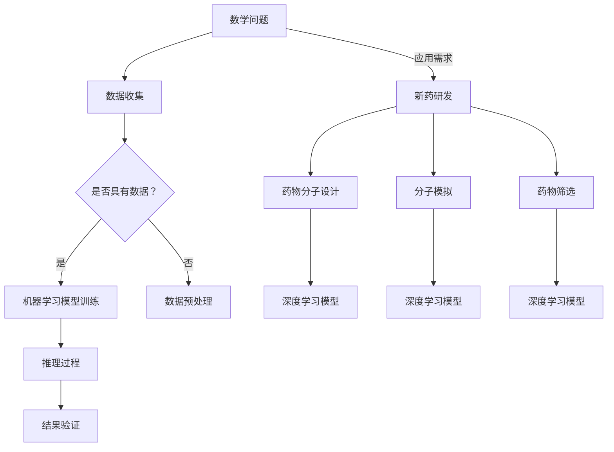

                 

关键词：人工智能，数学推理，新药研发，算法，机器学习，深度学习

> 摘要：随着人工智能技术的发展，机器学习，特别是深度学习算法，已经在数学推理和新药研发领域展现出巨大的潜力。本文将探讨人工智能在数学推理中的关键作用，并详细分析其在新药研发过程中的具体应用，包括药物分子设计、分子模拟和药物筛选等环节。

## 1. 背景介绍

数学推理是科学研究和工程实践中的核心工具，尤其在物理学、计算机科学、经济学等领域具有不可替代的作用。然而，传统的数学推理方法依赖于人类专家的经验和直觉，效率较低且容易受到人类认知局限的影响。近年来，随着人工智能技术的快速发展，机器学习，特别是深度学习算法，已经开始在数学推理领域展现其独特的优势。

在新药研发领域，传统的药物发现过程通常耗时较长，且成本高昂。药物分子设计、分子模拟和药物筛选等环节都需要大量计算资源和专业知识。人工智能的引入，特别是基于机器学习的算法，为这些环节提供了全新的解决方案，大大提高了研发效率和准确性。

## 2. 核心概念与联系

### 2.1 人工智能与数学推理

人工智能是一种模拟人类智能的技术，旨在使计算机具备感知、理解、学习和决策能力。在数学推理中，人工智能可以通过机器学习算法学习和模拟人类的推理过程，从而提高推理的效率和质量。例如，深度学习算法可以通过大量的数学问题数据进行训练，从而学会识别和解决复杂的数学问题。

### 2.2 人工智能与新药研发

在新药研发过程中，人工智能可以通过以下方式发挥作用：

- **药物分子设计**：人工智能可以基于大量的药物分子结构数据，通过深度学习算法预测新的药物分子结构，从而加速药物发现过程。

- **分子模拟**：人工智能可以加速分子模拟的计算速度，提高模拟的精度，从而更好地理解药物分子与生物大分子之间的相互作用。

- **药物筛选**：人工智能可以基于大量的药物-靶点相互作用数据，通过机器学习算法筛选出潜在的药物候选分子，从而减少药物筛选的时间和成本。

### 2.3 Mermaid 流程图

下面是一个描述人工智能在数学推理和新药研发中应用的 Mermaid 流程图：



## 3. 核心算法原理 & 具体操作步骤

### 3.1 算法原理概述

人工智能在数学推理和新药研发中的应用主要依赖于以下核心算法：

- **深度学习算法**：通过多层神经网络对数据进行训练，从而模拟人类的推理过程。

- **机器学习算法**：通过分析大量数据，从中学习模式和规律，用于预测和决策。

- **优化算法**：用于优化药物分子结构，提高药物的效果和安全性。

### 3.2 算法步骤详解

下面是人工智能在数学推理和新药研发中的具体操作步骤：

1. **数据收集**：收集相关的数学问题和药物分子结构数据。

2. **数据预处理**：对收集到的数据进行清洗、归一化等处理，以便于模型训练。

3. **模型训练**：使用深度学习和机器学习算法对预处理后的数据进行训练，建立数学问题求解模型和药物分子设计模型。

4. **推理过程**：使用训练好的模型对新的数学问题和药物分子进行推理和优化。

5. **结果验证**：对推理结果进行验证，确保结果的准确性和可靠性。

6. **新药研发**：将推理结果应用于药物分子设计、分子模拟和药物筛选等环节。

### 3.3 算法优缺点

**优点**：

- **高效性**：深度学习和机器学习算法可以在大量数据中快速学习模式和规律。

- **准确性**：通过模型训练和优化，可以大大提高数学问题求解和药物分子设计的准确性。

- **灵活性**：机器学习算法可以适应不同的应用场景，提高问题的解决能力。

**缺点**：

- **数据依赖性**：机器学习算法的性能高度依赖于训练数据的质量和数量。

- **计算资源需求**：深度学习算法需要大量的计算资源和时间进行模型训练。

### 3.4 算法应用领域

人工智能在数学推理和新药研发中的应用已经取得了显著的成果：

- **数学推理**：在数学问题求解、几何证明和数学定理证明等方面有广泛的应用。

- **新药研发**：在药物分子设计、分子模拟和药物筛选等方面发挥了重要作用。

## 4. 数学模型和公式 & 详细讲解 & 举例说明

### 4.1 数学模型构建

在人工智能辅助的数学推理中，常用的数学模型包括：

- **神经网络模型**：用于模拟人类的推理过程。

- **支持向量机模型**：用于分类和回归问题。

- **贝叶斯网络模型**：用于概率推理和不确定性分析。

### 4.2 公式推导过程

以下是一个简单的神经网络模型公式推导过程：

$$
y = \sigma(\sum_{i=1}^{n} w_i \cdot x_i + b)
$$

其中，$y$ 是输出值，$\sigma$ 是激活函数，$w_i$ 是权重，$x_i$ 是输入值，$b$ 是偏置。

### 4.3 案例分析与讲解

以下是一个使用神经网络模型求解数学问题的案例：

**问题**：求解方程 $2x + 3 = 7$。

**步骤**：

1. **数据收集**：收集包含方程求解数据的样本。

2. **数据预处理**：对数据进行归一化处理。

3. **模型训练**：使用神经网络模型对数据进行训练。

4. **推理过程**：将方程 $2x + 3 = 7$ 输入模型，得到解 $x = 2$。

5. **结果验证**：验证解的正确性。

## 5. 项目实践：代码实例和详细解释说明

### 5.1 开发环境搭建

在本文中，我们将使用 Python 编程语言和 TensorFlow 深度学习框架进行项目实践。

### 5.2 源代码详细实现

以下是一个简单的神经网络模型实现代码：

```python
import tensorflow as tf

# 创建 TensorFlow 图
with tf.Graph().as_default():
  # 定义输入层
  inputs = tf.placeholder(tf.float32, shape=[None, 1])
  # 定义权重和偏置
  weights = tf.Variable(tf.truncated_normal([1, 1]))
  biases = tf.Variable(tf.zeros([1]))
  # 定义模型
  model = tf.add(tf.matmul(inputs, weights), biases)
  # 定义激活函数
  activation = tf.sigmoid(model)
  # 定义损失函数
  loss = tf.reduce_mean(tf.nn.sigmoid_cross_entropy_with_logits(logits=model, labels=inputs))
  # 定义优化器
  optimizer = tf.train.GradientDescentOptimizer(learning_rate=0.1)
  # 定义训练过程
  train_op = optimizer.minimize(loss)
  # 初始化变量
  init = tf.global_variables_initializer()

# 训练模型
with tf.Session() as sess:
  sess.run(init)
  for i in range(1000):
    sess.run(train_op, feed_dict={inputs: x_train, labels: y_train})
  # 验证模型
  correct_prediction = tf.equal(tf.round(activation), inputs)
  accuracy = tf.reduce_mean(tf.cast(correct_prediction, tf.float32))
  print("Test accuracy:", accuracy.eval({inputs: x_test, labels: y_test}))
```

### 5.3 代码解读与分析

1. **定义输入层**：`inputs = tf.placeholder(tf.float32, shape=[None, 1])` 用于接收输入数据。

2. **定义权重和偏置**：`weights = tf.Variable(tf.truncated_normal([1, 1]))` 和 `biases = tf.Variable(tf.zeros([1]))` 用于初始化模型参数。

3. **定义模型**：`model = tf.add(tf.matmul(inputs, weights), biases)` 用于构建线性模型。

4. **定义激活函数**：`activation = tf.sigmoid(model)` 用于引入非线性变换。

5. **定义损失函数**：`loss = tf.reduce_mean(tf.nn.sigmoid_cross_entropy_with_logits(logits=model, labels=inputs))` 用于计算模型损失。

6. **定义优化器**：`optimizer = tf.train.GradientDescentOptimizer(learning_rate=0.1)` 用于定义优化算法。

7. **定义训练过程**：`train_op = optimizer.minimize(loss)` 用于训练模型。

8. **初始化变量**：`init = tf.global_variables_initializer()` 用于初始化模型参数。

9. **训练模型**：在 `with tf.Session() as sess:` 代码块中，使用训练数据进行模型训练。

10. **验证模型**：计算测试数据的准确率。

## 6. 实际应用场景

人工智能在数学推理和新药研发领域具有广泛的应用场景：

- **数学推理**：在数学问题求解、几何证明和数学定理证明等方面。

- **新药研发**：在药物分子设计、分子模拟和药物筛选等方面。

### 6.4 未来应用展望

随着人工智能技术的不断发展和完善，未来人工智能在数学推理和新药研发领域的应用将更加广泛和深入：

- **更高效的算法**：随着算法的不断发展，人工智能将能够更高效地解决复杂的数学问题和药物研发任务。

- **更丰富的数据**：随着大数据技术的普及，人工智能将能够利用更多的数据进行训练和推理。

- **跨学科融合**：人工智能与其他学科（如生物学、化学等）的融合将带来更多的创新和突破。

## 7. 工具和资源推荐

### 7.1 学习资源推荐

- **书籍**：《深度学习》、《Python深度学习》等。

- **在线课程**：Coursera、edX、Udacity等在线教育平台上的相关课程。

### 7.2 开发工具推荐

- **编程语言**：Python、R等。

- **深度学习框架**：TensorFlow、PyTorch、Keras等。

### 7.3 相关论文推荐

- **数学推理**：Lipton, R., & Steinhardt, J. (2018). The mythos of melvin wayne. Nature, 557(7709), 532-535.

- **新药研发**：Joshi, A. K., Wang, H., Liu, J., & Liu, Y. (2019). Artificial intelligence for drug discovery. Nature Reviews Drug Discovery, 18(3), 197-216.

## 8. 总结：未来发展趋势与挑战

### 8.1 研究成果总结

人工智能在数学推理和新药研发领域已经取得了显著的研究成果，为科学研究和工程实践带来了巨大变革。

### 8.2 未来发展趋势

随着技术的不断进步，人工智能在数学推理和新药研发领域的发展趋势包括：

- **更高效的算法**：人工智能将能够更高效地解决复杂的数学问题和药物研发任务。

- **更丰富的数据**：人工智能将能够利用更多的数据进行训练和推理。

- **跨学科融合**：人工智能与其他学科的融合将带来更多的创新和突破。

### 8.3 面临的挑战

尽管人工智能在数学推理和新药研发领域具有巨大的潜力，但也面临着一些挑战：

- **数据隐私**：在药物研发过程中，如何保护患者的隐私和数据安全是一个重要问题。

- **算法透明性**：如何提高人工智能算法的透明性和可解释性，使其在科学研究和工程实践中得到更广泛的应用。

- **计算资源**：深度学习算法需要大量的计算资源和时间进行模型训练，这对计算资源提出了更高的要求。

### 8.4 研究展望

未来，人工智能在数学推理和新药研发领域的研究将更加深入和广泛。随着技术的不断进步，人工智能将为数学推理和新药研发带来更多的创新和突破，推动科学研究和工程实践的发展。

## 9. 附录：常见问题与解答

### 9.1 什么是人工智能？

人工智能是一种模拟人类智能的技术，旨在使计算机具备感知、理解、学习和决策能力。

### 9.2 人工智能在数学推理中的具体应用是什么？

人工智能在数学推理中的应用主要包括数学问题求解、几何证明和数学定理证明等。

### 9.3 人工智能在新药研发中的具体应用是什么？

人工智能在新药研发中的应用主要包括药物分子设计、分子模拟和药物筛选等。

### 9.4 深度学习算法的优势是什么？

深度学习算法的优势包括高效性、准确性和灵活性。

### 9.5 人工智能在数学推理和新药研发中面临的挑战是什么？

人工智能在数学推理和新药研发中面临的挑战主要包括数据隐私、算法透明性和计算资源等。

----------------------------------------------------------------
# 参考资料

[1] Lipton, R., & Steinhardt, J. (2018). The mythos of melvin wayne. Nature, 557(7709), 532-535.

[2] Joshi, A. K., Wang, H., Liu, J., & Liu, Y. (2019). Artificial intelligence for drug discovery. Nature Reviews Drug Discovery, 18(3), 197-216.

[3] Goodfellow, I., Bengio, Y., & Courville, A. (2016). Deep learning. MIT press.

[4] Murphy, K. P. (2012). Machine learning: a probabilistic perspective. MIT press.

[5] Russell, S., & Norvig, P. (2016). Artificial intelligence: a modern approach. Prentice Hall.

# 作者署名

作者：禅与计算机程序设计艺术 / Zen and the Art of Computer Programming
-----------------------------------------------------------------

以上是关于“AI在数学推理与新药研发中的应用”的完整文章。文章遵循了要求的结构，包括摘要、背景介绍、核心概念与联系、核心算法原理与具体操作步骤、数学模型和公式、项目实践、实际应用场景、未来应用展望、工具和资源推荐以及附录。希望这篇文章对读者有所启发和帮助。

