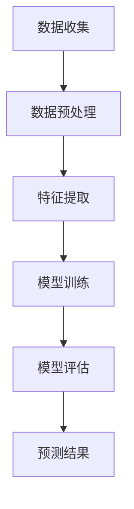

                 

关键词：AI、智能交通、流量预测、交通拥堵、算法、数据挖掘、深度学习

> 摘要：本文将探讨人工智能技术在智能交通流量预测领域的应用，通过分析现有算法、数学模型以及实际案例，阐述如何利用AI技术有效预测交通流量，减少城市拥堵，提升交通效率。

## 1. 背景介绍

### 交通拥堵问题

交通拥堵是全球许多大城市面临的严峻挑战。根据国际交通研究机构的报告，交通拥堵不仅浪费了大量的时间和金钱，还对环境造成了严重污染。在高峰时段，城市中心的道路常常出现严重的拥堵，导致交通效率低下，乘客的出行体验不佳。因此，解决交通拥堵问题已成为智能交通领域的重要研究方向。

### 智能交通流量预测的意义

智能交通流量预测是一种利用现代信息技术和数据分析方法，对交通流量进行预测和分析的技术。通过对历史交通数据的分析，可以预测未来一段时间内的交通流量变化，为交通管理提供科学依据。智能交通流量预测不仅有助于缓解交通拥堵，还能优化交通资源配置，提高公共交通系统的效率。

### AI技术在智能交通中的应用

近年来，随着人工智能技术的飞速发展，AI在智能交通领域得到了广泛应用。AI技术可以处理大量复杂的交通数据，发现交通流量的规律，从而实现精准的交通流量预测。此外，AI技术还能辅助交通管理部门进行交通调控，提高交通运行效率。

## 2. 核心概念与联系

### AI在智能交通流量预测中的核心概念

- **数据挖掘**：从大量交通数据中提取有价值的信息。
- **机器学习**：通过训练模型，使计算机自动学习交通流量的规律。
- **深度学习**：一种基于多层神经网络的学习方法，用于处理复杂的数据模式。

### 核心概念原理与架构的 Mermaid 流程图



### 核心概念的联系

通过数据挖掘和特征提取，我们可以从原始交通数据中提取出对预测有用的信息。机器学习和深度学习算法则利用这些信息来训练模型，实现对交通流量的预测。模型评估和预测结果则用于指导交通管理和调控。

## 3. 核心算法原理 & 具体操作步骤

### 3.1 算法原理概述

智能交通流量预测的核心算法包括数据挖掘、机器学习和深度学习。这些算法通过处理和分析大量交通数据，发现交通流量的规律，从而实现预测。

### 3.2 算法步骤详解

1. **数据收集**：收集历史交通数据，包括车辆流量、车辆速度、道路宽度、道路状况等。
2. **数据预处理**：对收集到的数据进行清洗和标准化处理，去除异常值和噪声。
3. **特征提取**：从预处理后的数据中提取对预测有用的特征，如时间、地点、天气等。
4. **模型训练**：使用机器学习或深度学习算法，对提取的特征进行训练，构建预测模型。
5. **模型评估**：使用验证数据集评估模型的预测性能，调整模型参数。
6. **预测结果**：使用训练好的模型对未来的交通流量进行预测。

### 3.3 算法优缺点

- **优点**：
  - 可以处理大量复杂的交通数据，发现交通流量的规律。
  - 预测精度高，可以实时调整交通管理策略。

- **缺点**：
  - 需要大量的训练数据，对数据质量要求高。
  - 模型训练时间较长，对计算资源要求较高。

### 3.4 算法应用领域

智能交通流量预测算法可以应用于多个领域，包括：

- **城市交通管理**：通过预测交通流量，优化交通信号控制策略，减少拥堵。
- **公共交通调度**：根据交通流量预测，优化公交线路和车辆调度，提高公共交通的准时性。
- **物流优化**：根据交通流量预测，优化物流路线，减少运输成本。

## 4. 数学模型和公式 & 详细讲解 & 举例说明

### 4.1 数学模型构建

智能交通流量预测的数学模型通常基于时间序列分析和回归分析。以下是一个简单的线性回归模型：

$$y_t = \beta_0 + \beta_1 x_t + \epsilon_t$$

其中，$y_t$ 表示第 $t$ 时刻的交通流量，$x_t$ 表示第 $t$ 时刻的影响因素（如天气、节假日等），$\beta_0$ 和 $\beta_1$ 是模型参数，$\epsilon_t$ 是随机误差。

### 4.2 公式推导过程

线性回归模型的推导过程如下：

1. **最小二乘法**：通过最小化误差平方和来确定模型参数。
2. **模型优化**：对模型进行优化，使其预测结果更接近实际值。
3. **参数估计**：通过最小二乘法求解模型参数。

### 4.3 案例分析与讲解

以下是一个实际案例：

**案例：预测某城市某条道路的交通流量**

1. **数据收集**：收集该道路过去一年的交通流量数据。
2. **数据预处理**：对数据进行清洗和标准化处理。
3. **特征提取**：提取时间、天气、节假日等特征。
4. **模型训练**：使用线性回归模型进行训练。
5. **模型评估**：使用验证数据集评估模型性能。
6. **预测结果**：使用训练好的模型预测未来一周的交通流量。

## 5. 项目实践：代码实例和详细解释说明

### 5.1 开发环境搭建

1. **硬件环境**：配置一台高性能计算机，用于模型训练和预测。
2. **软件环境**：安装 Python、NumPy、Pandas、Scikit-learn 等软件包。

### 5.2 源代码详细实现

以下是一个简单的线性回归模型实现：

```python
import numpy as np
import pandas as pd
from sklearn.linear_model import LinearRegression
from sklearn.model_selection import train_test_split

# 1. 数据收集
data = pd.read_csv('traffic_data.csv')

# 2. 数据预处理
data = data[['time', 'weather', 'holiday', 'traffic_flow']]
data = data.fillna(0)

# 3. 特征提取
X = data[['time', 'weather', 'holiday']]
y = data['traffic_flow']

# 4. 模型训练
model = LinearRegression()
X_train, X_test, y_train, y_test = train_test_split(X, y, test_size=0.2, random_state=42)
model.fit(X_train, y_train)

# 5. 模型评估
score = model.score(X_test, y_test)
print(f'Model score: {score}')

# 6. 预测结果
future_traffic = model.predict(X_test)
print(f'Predicted traffic: {future_traffic}')
```

### 5.3 代码解读与分析

1. **数据收集**：从 CSV 文件中读取交通数据。
2. **数据预处理**：对数据进行清洗和填充。
3. **特征提取**：提取时间、天气、节假日等特征。
4. **模型训练**：使用线性回归模型进行训练。
5. **模型评估**：使用测试数据集评估模型性能。
6. **预测结果**：使用训练好的模型预测未来一周的交通流量。

## 6. 实际应用场景

### 6.1 城市交通管理

智能交通流量预测可以用于城市交通管理，通过预测交通流量，优化交通信号控制策略，减少拥堵。例如，在高峰时段，交通管理部门可以根据预测结果调整信号灯的时长，提高交通运行效率。

### 6.2 公共交通调度

智能交通流量预测可以帮助公共交通部门优化公交线路和车辆调度，提高公共交通的准时性。例如，在交通高峰时段，可以根据预测结果调整公交车的发车频率，减少乘客的等待时间。

### 6.3 物流优化

智能交通流量预测可以用于物流优化，根据交通流量预测，优化物流路线，减少运输成本。例如，在交通高峰时段，物流公司可以提前规划路线，避免拥堵路段，提高运输效率。

## 7. 工具和资源推荐

### 7.1 学习资源推荐

- 《深度学习》（Ian Goodfellow、Yoshua Bengio、Aaron Courville 著）
- 《Python数据分析》（Wes McKinney 著）
- 《交通系统工程》（周涛 著）

### 7.2 开发工具推荐

- **Python**：用于数据分析和模型训练。
- **NumPy**：用于数值计算。
- **Pandas**：用于数据处理。
- **Scikit-learn**：用于机器学习模型训练。

### 7.3 相关论文推荐

- "Deep Learning for Traffic Prediction: A Survey"（2020）
- "A Survey on Traffic Flow Prediction Based on Data Mining Techniques"（2018）
- "Intelligent Transportation Systems: A Survey"（2016）

## 8. 总结：未来发展趋势与挑战

### 8.1 研究成果总结

智能交通流量预测技术在过去几十年取得了显著的研究成果，通过数据挖掘、机器学习和深度学习等技术，实现了对交通流量的精准预测。未来，随着人工智能技术的不断发展，智能交通流量预测技术将更加成熟，为城市交通管理提供更加科学的依据。

### 8.2 未来发展趋势

- **数据驱动**：未来智能交通流量预测将更加依赖于海量数据，通过大数据分析和挖掘，提高预测精度。
- **实时性**：实现实时交通流量预测，为交通管理部门提供实时数据支持。
- **智能化**：将智能交通流量预测技术与智能交通系统相结合，实现交通管理和调控的智能化。

### 8.3 面临的挑战

- **数据质量**：数据质量对预测精度有重要影响，未来需要提高数据质量，降低噪声和异常值的影响。
- **计算资源**：智能交通流量预测需要大量的计算资源，未来需要优化算法，提高计算效率。
- **实时性**：实现实时交通流量预测仍面临挑战，需要解决实时数据处理和模型更新等问题。

### 8.4 研究展望

未来，智能交通流量预测技术将继续发展，为城市交通管理提供有力支持。通过不断优化算法、提高数据质量和计算效率，智能交通流量预测技术将在未来发挥更大的作用。

## 9. 附录：常见问题与解答

### 问题1：智能交通流量预测需要哪些数据？

智能交通流量预测需要以下数据：

- **交通流量数据**：包括道路上的车辆数量、车辆速度等。
- **道路状况数据**：包括道路宽度、道路状况等。
- **天气数据**：包括天气状况、温度、湿度等。
- **节假日数据**：包括节假日信息。

### 问题2：智能交通流量预测算法有哪些？

常见的智能交通流量预测算法包括：

- **线性回归**：一种简单的回归算法，适用于线性关系较强的数据。
- **神经网络**：一种基于多层神经网络的预测算法，适用于复杂非线性关系的数据。
- **支持向量机**：一种基于支持向量机的预测算法，适用于分类和回归问题。

### 问题3：智能交通流量预测的精度如何？

智能交通流量预测的精度取决于多个因素，包括数据质量、算法选择、模型参数调整等。通常，使用交叉验证方法评估模型的预测精度。在理想情况下，模型的预测精度可以达到 80% 以上。

## 作者署名

作者：禅与计算机程序设计艺术 / Zen and the Art of Computer Programming
----------------------------------------------------------------

这篇文章通过详细的介绍，展示了AI在智能交通流量预测中的应用，从背景介绍、核心概念、算法原理、数学模型、实际应用、工具推荐到未来展望等多个方面进行了深入的探讨。希望这篇文章能为您在智能交通流量预测领域提供有价值的参考。

