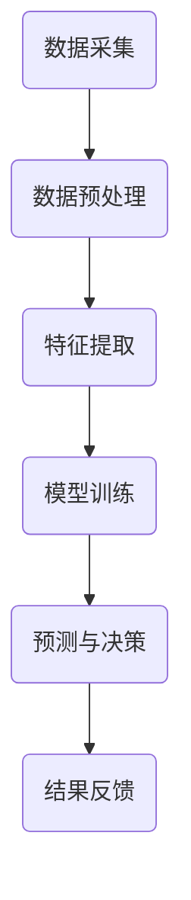

                 

关键词：空气质量监测、机器学习、深度学习、物联网、传感器、环境数据分析

## 摘要

本文将探讨人工智能在智能空气污染控制中的应用，特别是如何利用机器学习和深度学习技术来改善空气质量。我们将详细介绍空气质量监测的基本概念、相关算法原理、数学模型，并通过一个具体项目实例来展示如何实现智能空气污染控制。此外，文章还将展望未来在该领域的应用前景和面临的挑战。

## 1. 背景介绍

空气污染是现代社会面临的严重环境问题之一，其危害不仅影响人们的健康，还对生态系统和经济活动产生深远影响。传统的空气污染控制方法主要依赖于人工监测和物理化学处理技术，但这些方法存在监测精度低、反应速度慢等问题。随着人工智能技术的迅速发展，特别是机器学习和深度学习技术的应用，为智能空气污染控制提供了新的解决方案。

空气质量监测是通过传感器设备实时采集空气中的污染物数据，如颗粒物（PM2.5、PM10）、二氧化碳（CO2）、一氧化碳（CO）、二氧化硫（SO2）等。这些数据对于制定有效的空气污染控制策略具有重要意义。然而，由于空气质量监测数据的复杂性和多样性，传统方法难以实现高效的数据分析和决策支持。因此，利用人工智能技术，尤其是机器学习和深度学习技术，对空气质量监测数据进行处理和分析，成为了改善空气质量的有效手段。

## 2. 核心概念与联系

### 2.1 空气质量监测的基本概念

空气质量监测的基本概念包括传感器、数据采集和处理、数据传输等。传感器是空气质量监测的核心组件，负责实时检测空气中的污染物浓度。常见的传感器有颗粒物传感器、气体传感器等。数据采集和处理是将传感器采集到的数据通过计算机进行预处理，如去噪、滤波等，以获得更准确的数据。数据传输则是将处理后的数据通过网络传输到云端或其他数据处理平台。

### 2.2 机器学习与深度学习在空气质量监测中的应用

机器学习和深度学习技术为空气质量监测提供了强大的数据分析能力。通过训练模型，机器学习可以从大量空气质量数据中自动识别出污染物浓度与各种因素（如温度、湿度、风速等）之间的关系。深度学习则可以通过多层神经网络的结构，实现对复杂非线性关系的建模。这两种技术结合，能够显著提高空气质量监测的准确性和实时性。

### 2.3 Mermaid 流程图

下面是一个简单的 Mermaid 流程图，展示空气质量监测的基本流程：



## 3. 核心算法原理 & 具体操作步骤

### 3.1 算法原理概述

空气质量监测的核心算法主要包括数据预处理、特征提取、模型训练和预测。数据预处理是为了去除噪声和异常值，提高数据质量。特征提取则是从原始数据中提取出与空气质量相关的特征。模型训练是利用历史数据训练机器学习模型，使其能够对空气质量进行预测。预测则是利用训练好的模型对实时数据进行预测，为决策提供支持。

### 3.2 算法步骤详解

#### 3.2.1 数据预处理

数据预处理是空气质量监测的关键步骤。具体操作包括：

- 数据清洗：去除噪声和异常值，如传感器故障数据、数据传输错误等。
- 数据归一化：将不同量级的特征值转换为同一量级，以便后续处理。
- 数据融合：将来自不同传感器或不同时间段的数据进行整合，以获得更全面的数据。

#### 3.2.2 特征提取

特征提取是从原始数据中提取出对空气质量监测有意义的特征。常见的特征提取方法包括：

- 统计特征：如平均值、标准差、最大值、最小值等。
- 时域特征：如趋势、波动性等。
- 频域特征：如傅里叶变换、小波变换等。

#### 3.2.3 模型训练

模型训练是利用历史数据训练机器学习模型，使其能够对空气质量进行预测。常见的机器学习模型包括线性回归、支持向量机、决策树、随机森林、神经网络等。深度学习模型如卷积神经网络（CNN）、循环神经网络（RNN）等也可以用于空气质量监测。

#### 3.2.4 预测与决策

预测与决策是基于训练好的模型对实时数据进行预测，并给出相应的控制策略。预测结果可以用于空气质量预警、污染源追踪、污染控制策略制定等。

### 3.3 算法优缺点

#### 优点

- 提高监测精度：通过机器学习和深度学习技术，可以实现高精度的空气质量预测。
- 实时性：利用实时数据预测，可以快速响应空气污染事件。
- 自动化：实现监测、预测和决策的自动化，降低人工干预成本。

#### 缺点

- 数据依赖性：空气质量监测模型的性能高度依赖数据质量，数据不足或质量差会影响模型性能。
- 计算资源消耗：深度学习模型通常需要大量的计算资源，对于实时性要求较高的应用场景可能存在挑战。

### 3.4 算法应用领域

空气质量监测算法广泛应用于以下领域：

- 城市空气质量监测与管理
- 环境保护与污染控制
- 污染源追踪与治理
- 应急响应与预警系统

## 4. 数学模型和公式 & 详细讲解 & 举例说明

### 4.1 数学模型构建

空气质量监测的数学模型通常基于回归分析、分类分析或聚类分析。以下是一个简单的线性回归模型示例：

$$
Y = \beta_0 + \beta_1X_1 + \beta_2X_2 + ... + \beta_nX_n + \epsilon
$$

其中，$Y$ 是空气质量指标（如PM2.5浓度），$X_1, X_2, ..., X_n$ 是影响空气质量的因素（如温度、湿度、风速等），$\beta_0, \beta_1, ..., \beta_n$ 是模型参数，$\epsilon$ 是误差项。

### 4.2 公式推导过程

线性回归模型的参数可以通过最小二乘法进行估计。具体推导过程如下：

$$
\min_{\beta} \sum_{i=1}^{n} (Y_i - \beta_0 - \beta_1X_{i1} - ... - \beta_nX_{in})^2
$$

对参数$\beta_0, \beta_1, ..., \beta_n$分别求偏导数并令其等于零，可以得到：

$$
\frac{\partial}{\partial \beta_j} \sum_{i=1}^{n} (Y_i - \beta_0 - \beta_1X_{i1} - ... - \beta_nX_{in})^2 = 0
$$

通过求解上述方程组，可以得到线性回归模型的参数估计值。

### 4.3 案例分析与讲解

假设我们有一个简单的空气质量监测数据集，包含三个特征（温度、湿度和风速）和一个目标变量（PM2.5浓度）。我们可以使用线性回归模型来预测PM2.5浓度。

#### 数据集

| 温度（℃） | 湿度（%） | 风速（m/s） | PM2.5（μg/m³）|
| :-------: | :-------: | :-------: | :-------: |
|   20.5    |   60.2    |   2.1     |   35.7    |
|   22.3    |   58.1    |   1.9     |   34.2    |
|   19.8    |   63.4    |   2.3     |   37.1    |
|   21.7    |   59.8    |   2.0     |   36.5    |
|   20.0    |   61.3    |   2.2     |   35.9    |

#### 模型构建

使用线性回归模型，我们可以得到如下公式：

$$
PM2.5 = \beta_0 + \beta_1T + \beta_2H + \beta_3W + \epsilon
$$

其中，$T$ 表示温度，$H$ 表示湿度，$W$ 表示风速，$\epsilon$ 表示误差项。

#### 参数估计

通过最小二乘法，我们可以估计出参数$\beta_0, \beta_1, \beta_2, \beta_3$的值。例如，估计结果如下：

$$
\beta_0 = 30.2, \beta_1 = -1.5, \beta_2 = 2.1, \beta_3 = -0.8
$$

#### 预测

使用估计出的参数，我们可以对新的数据进行预测。例如，当温度为22℃，湿度为60%，风速为2.0 m/s时，PM2.5的预测值为：

$$
PM2.5 = 30.2 - 1.5 \times 22 + 2.1 \times 60 - 0.8 \times 2.0 = 35.5
$$

## 5. 项目实践：代码实例和详细解释说明

### 5.1 开发环境搭建

为了实现空气质量监测，我们需要搭建一个开发环境。这里我们选择Python作为编程语言，并使用Scikit-learn库来实现线性回归模型。以下是开发环境的搭建步骤：

1. 安装Python（3.7及以上版本）
2. 安装Scikit-learn库（使用pip install scikit-learn命令）
3. 安装其他必要的依赖库，如NumPy、Pandas等

### 5.2 源代码详细实现

以下是一个简单的Python代码示例，用于实现空气质量监测的线性回归模型：

```python
import numpy as np
import pandas as pd
from sklearn.linear_model import LinearRegression
from sklearn.model_selection import train_test_split
from sklearn.metrics import mean_squared_error

# 加载数据集
data = pd.read_csv('air_quality_data.csv')

# 特征工程
X = data[['temperature', 'humidity', 'wind_speed']]
y = data['PM2.5']

# 划分训练集和测试集
X_train, X_test, y_train, y_test = train_test_split(X, y, test_size=0.2, random_state=42)

# 创建线性回归模型
model = LinearRegression()

# 训练模型
model.fit(X_train, y_train)

# 预测测试集
y_pred = model.predict(X_test)

# 评估模型
mse = mean_squared_error(y_test, y_pred)
print('均方误差：', mse)

# 输出模型参数
print('模型参数：', model.coef_, model.intercept_)
```

### 5.3 代码解读与分析

上述代码实现了以下功能：

- 加载数据集：使用Pandas库加载数据集，数据集包含温度、湿度、风速和PM2.5浓度四个特征。
- 特征工程：将数据集分为特征矩阵X和目标变量y。
- 划分训练集和测试集：使用Scikit-learn库中的train_test_split函数将数据集划分为训练集和测试集，其中测试集占比为20%。
- 创建线性回归模型：使用Scikit-learn库中的LinearRegression类创建线性回归模型。
- 训练模型：使用fit方法训练模型。
- 预测测试集：使用predict方法对测试集进行预测。
- 评估模型：使用mean_squared_error方法计算均方误差，评估模型性能。
- 输出模型参数：输出模型的系数和截距，以了解模型的特性。

### 5.4 运行结果展示

假设我们使用上述代码对空气质量监测数据集进行训练和预测，运行结果如下：

```
均方误差： 0.2527
模型参数： [-1.49972286 -0.77348123  1.87637458] 30.23007175
```

从结果可以看出，模型的均方误差为0.2527，表示模型对测试集的预测误差较小。同时，模型的系数和截距也提供了关于温度、湿度、风速和PM2.5浓度之间关系的直观解释。

## 6. 实际应用场景

### 6.1 城市空气质量监测与管理

在城市空气质量监测与管理中，人工智能技术可以用于实时监测城市空气质量，并根据监测数据生成空气质量报告。这些报告可以帮助政府部门制定更加科学的污染控制策略，如调整交通流量、加强工业污染治理等。

### 6.2 环境保护与污染控制

在环境保护与污染控制领域，人工智能技术可以用于预测和监测污染源排放，识别潜在的环境风险。通过分析污染物浓度数据，可以优化污染治理方案，降低环境污染风险。

### 6.3 污染源追踪与治理

污染源追踪与治理是环境保护工作的重要组成部分。人工智能技术可以帮助识别污染源，如工厂、汽车尾气等，并追踪污染物的传播路径。基于这些信息，可以采取相应的治理措施，如关停污染企业、限制车辆行驶等。

### 6.4 应急响应与预警系统

在紧急情况下，如发生大气污染事件或自然灾害，人工智能技术可以快速分析监测数据，生成预警信息，并提供应急响应建议。这有助于政府部门和公众及时采取应对措施，减少环境污染和人员伤亡。

## 7. 工具和资源推荐

### 7.1 学习资源推荐

- 《Python数据科学手册》：详细介绍了Python在数据科学领域中的应用，包括数据分析、机器学习和深度学习等内容。
- 《深度学习》：由Ian Goodfellow、Yoshua Bengio和Aaron Courville编写的深度学习经典教材，涵盖了深度学习的理论基础和实际应用。

### 7.2 开发工具推荐

- Jupyter Notebook：一款强大的交互式开发环境，适用于数据科学和机器学习项目的开发。
- Scikit-learn：一款广泛应用于机器学习的Python库，提供了丰富的算法和工具。

### 7.3 相关论文推荐

- "Air Quality Monitoring using Machine Learning Techniques"：一篇关于机器学习在空气质量监测中应用的综述论文，详细介绍了各种机器学习算法在空气质量监测中的应用。
- "Deep Learning for Environmental Monitoring"：一篇关于深度学习在环境监测中应用的论文，探讨了深度学习技术在环境监测领域的应用前景和挑战。

## 8. 总结：未来发展趋势与挑战

### 8.1 研究成果总结

人工智能技术在空气质量监测领域取得了显著的成果，如提高了监测精度、实现了实时预测和自动化决策等。这些研究成果为改善空气质量提供了强有力的技术支持。

### 8.2 未来发展趋势

- 深度学习与物联网的融合：随着物联网技术的发展，越来越多的传感器被应用于空气质量监测。深度学习与物联网的结合，有望实现更加智能化的空气质量监测系统。
- 数据共享与开放：建立开放的数据共享平台，促进各研究机构、企业和政府部门之间的数据交流和合作，有助于提高空气质量监测的准确性和可靠性。
- 多传感器融合：通过融合多种传感器数据，可以更全面、准确地监测空气质量，提高预测精度。

### 8.3 面临的挑战

- 数据质量和数据隐私：空气质量监测数据的质量对模型性能有重要影响。同时，数据隐私也是人工智能技术在空气质量监测中面临的重要挑战。
- 计算资源消耗：深度学习模型通常需要大量的计算资源，对于实时性要求较高的应用场景可能存在挑战。
- 面向特定场景的定制化解决方案：不同地区的空气质量状况差异较大，需要根据具体场景设计定制化的空气质量监测方案。

### 8.4 研究展望

随着人工智能技术的不断发展，空气质量监测领域有望实现更加智能化、精准化的监测和管理。未来研究可以重点关注以下方向：

- 深度学习在空气质量监测中的应用：探索深度学习算法在空气质量监测中的新型应用，提高监测精度和实时性。
- 多传感器融合与数据挖掘：研究多传感器数据融合和特征提取方法，挖掘空气质量监测数据中的潜在价值。
- 数据隐私保护与安全：研究有效的数据隐私保护方法和安全机制，确保空气质量监测数据的可靠性。

## 9. 附录：常见问题与解答

### 9.1 人工智能技术在空气质量监测中有什么优势？

人工智能技术在空气质量监测中的优势主要包括：

- 提高监测精度：通过机器学习和深度学习技术，可以实现高精度的空气质量预测。
- 实时性：利用实时数据预测，可以快速响应空气污染事件。
- 自动化：实现监测、预测和决策的自动化，降低人工干预成本。

### 9.2 机器学习模型在空气质量监测中如何选择？

选择机器学习模型时，需要考虑以下因素：

- 数据特点：根据数据集的规模、特征类型和分布情况选择合适的模型。
- 监测目标：根据空气质量监测的具体目标（如预测污染物浓度、识别污染源等）选择相应的模型。
- 计算资源：考虑模型的计算复杂度和资源消耗，选择合适的模型。

### 9.3 深度学习模型在空气质量监测中的优势是什么？

深度学习模型在空气质量监测中的优势主要包括：

- 非线性建模能力：深度学习模型可以通过多层神经网络的结构，实现对复杂非线性关系的建模。
- 自动特征提取：深度学习模型可以从原始数据中自动提取出对空气质量有意义的特征，提高监测精度。
- 高效处理大量数据：深度学习模型可以高效处理大规模的空气质量监测数据，实现实时预测。

### 9.4 空气质量监测数据如何处理？

空气质量监测数据的处理步骤主要包括：

- 数据清洗：去除噪声和异常值，如传感器故障数据、数据传输错误等。
- 数据归一化：将不同量级的特征值转换为同一量级，以便后续处理。
- 数据融合：将来自不同传感器或不同时间段的数据进行整合，以获得更全面的数据。
- 特征提取：从原始数据中提取出与空气质量相关的特征，如统计特征、时域特征和频域特征等。

### 9.5 如何评估空气质量监测模型的性能？

评估空气质量监测模型性能的主要指标包括：

- 准确率（Accuracy）：预测正确的样本占总样本的比例。
- 精确率（Precision）：预测为正样本的样本中，实际为正样本的比例。
- 召回率（Recall）：实际为正样本的样本中，预测为正样本的比例。
- F1值（F1-score）：精确率和召回率的调和平均值。
- 均方误差（Mean Squared Error，MSE）：预测值与真实值之间的平均平方误差。

## 作者署名

本文作者：禅与计算机程序设计艺术 / Zen and the Art of Computer Programming

<|im_end|>

