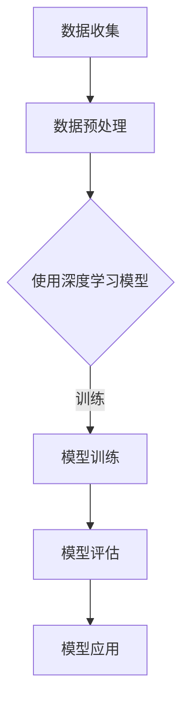

                 

关键词：人工智能、应用场景、深度学习、机器学习、数据分析、智能系统

摘要：随着人工智能技术的快速发展，AI已经深入到我们生活的方方面面，从简单的家居自动化到复杂的医疗诊断，AI的应用场景越来越广泛。本文将深入探讨AI在现实世界中的多种应用场景，包括但不限于智能家居、自动驾驶、医疗诊断、金融预测等，分析其技术原理、实现方法以及未来的发展趋势。

## 1. 背景介绍

人工智能（AI）是计算机科学的一个分支，旨在开发能够执行需要人类智能的任务的机器和软件。AI的历史可以追溯到20世纪50年代，但近年来，得益于大数据、计算能力和算法的创新，AI技术取得了显著突破，推动了各行各业的变革。

现实世界中的AI应用场景多种多样，从简单的自动化到复杂的智能决策系统，AI正在逐步替代传统的人工操作，提高效率，降低成本，创造新的商业模式。本文将重点探讨以下AI应用场景：

- 智能家居
- 自动驾驶
- 医疗诊断
- 金融预测
- 个性化推荐

## 2. 核心概念与联系

### 2.1 人工智能的概念

人工智能是指由计算机系统执行的智能行为，包括学习、推理、解决问题、理解语言、感知环境等。人工智能可以分为两大类：弱人工智能（Narrow AI）和强人工智能（General AI）。弱人工智能专注于特定任务，而强人工智能具备广泛的理解和适应能力，与人类智能相媲美。

### 2.2 机器学习与深度学习

机器学习是AI的核心技术之一，通过数据驱动的方式进行模型训练，使计算机能够从经验中学习，并做出预测或决策。深度学习是机器学习的子领域，利用多层神经网络进行特征提取和模型训练，是当前AI领域的研究热点。

### 2.3 数据分析

数据分析是AI应用的重要基石，通过对大量数据进行分析和处理，提取有价值的信息和模式，为AI系统提供决策依据。

### 2.4 Mermaid 流程图



## 3. 核心算法原理 & 具体操作步骤

### 3.1 算法原理概述

AI应用的核心在于算法的选择和实现。不同的应用场景需要不同的算法。例如，在自动驾驶中，常用的算法包括卷积神经网络（CNN）用于图像识别，决策树或神经网络用于路径规划等。

### 3.2 算法步骤详解

以自动驾驶为例，算法的具体步骤包括：

1. 数据收集：收集车辆周围的图像、传感器数据等。
2. 数据预处理：对数据进行标准化、去噪等处理。
3. 模型训练：使用预处理后的数据训练深度学习模型。
4. 模型评估：通过测试数据评估模型的准确性。
5. 模型应用：将训练好的模型部署到自动驾驶系统中。

### 3.3 算法优缺点

深度学习模型在图像识别和语音识别等领域表现出色，但模型训练时间较长，对计算资源要求高。此外，模型的可解释性较低，难以理解其决策过程。

### 3.4 算法应用领域

深度学习算法在图像识别、语音识别、自然语言处理等领域有广泛应用。例如，自动驾驶、人脸识别、语音助手等。

## 4. 数学模型和公式 & 详细讲解 & 举例说明

### 4.1 数学模型构建

深度学习模型通常由多个层级组成，包括输入层、隐藏层和输出层。每个层级由多个神经元组成，神经元之间的连接权重是模型参数。模型的目标是通过反向传播算法优化这些参数，使得模型在训练数据上达到较高的准确性。

### 4.2 公式推导过程

假设我们有 $n$ 个训练样本，每个样本由 $m$ 个特征组成，即 $X = \{x_1, x_2, ..., x_n\}$，其中 $x_i \in \mathbb{R}^m$。我们的目标是通过学习一个函数 $f(X) \in \mathbb{R}$ 来预测每个样本的标签 $y_i \in \mathbb{R}$。

$$
f(x_i) = z_i = \sigma(\sum_{j=1}^{m} w_{ji} x_{ij} + b_i)
$$

其中，$\sigma$ 是激活函数，$w_{ji}$ 是权重，$b_i$ 是偏置。

### 4.3 案例分析与讲解

假设我们有一个二分类问题，目标是预测图像是否包含猫。我们可以使用卷积神经网络（CNN）来解决这个问题。CNN的主要结构包括卷积层、池化层和全连接层。

1. **卷积层**：用于提取图像特征，通过卷积操作将输入图像映射到新的特征空间。
2. **池化层**：用于降低特征图的空间分辨率，减少计算量。
3. **全连接层**：将特征映射到最终的输出。

```latex
\begin{aligned}
\text{卷积层}:\ f(x) &= \sum_{j=1}^{k} w_{j} * x_j + b_j \\
\text{激活函数}:\ \sigma(z) &= \frac{1}{1 + e^{-z}}
\end{aligned}
```

## 5. 项目实践：代码实例和详细解释说明

### 5.1 开发环境搭建

1. 安装 Python 3.7 或更高版本。
2. 安装 TensorFlow 2.0 或更高版本。
3. 安装 NumPy 和 Matplotlib。

### 5.2 源代码详细实现

以下是一个简单的CNN模型的实现代码：

```python
import tensorflow as tf
from tensorflow.keras import layers

# 构建模型
model = tf.keras.Sequential([
    layers.Conv2D(32, (3, 3), activation='relu', input_shape=(28, 28, 1)),
    layers.MaxPooling2D((2, 2)),
    layers.Conv2D(64, (3, 3), activation='relu'),
    layers.MaxPooling2D((2, 2)),
    layers.Conv2D(64, (3, 3), activation='relu'),
    layers.Flatten(),
    layers.Dense(64, activation='relu'),
    layers.Dense(10, activation='softmax')
])

# 编译模型
model.compile(optimizer='adam',
              loss='categorical_crossentropy',
              metrics=['accuracy'])

# 加载数据
(x_train, y_train), (x_test, y_test) = tf.keras.datasets.mnist.load_data()

# 预处理数据
x_train = x_train.astype('float32') / 255
x_test = x_test.astype('float32') / 255
x_train = np.expand_dims(x_train, -1)
x_test = np.expand_dims(x_test, -1)

# 转换标签为 one-hot 编码
y_train = tf.keras.utils.to_categorical(y_train, 10)
y_test = tf.keras.utils.to_categorical(y_test, 10)

# 训练模型
model.fit(x_train, y_train, epochs=20, batch_size=128, validation_split=0.2)
```

### 5.3 代码解读与分析

上述代码定义了一个简单的CNN模型，用于手写数字识别。模型包括两个卷积层、两个池化层和一个全连接层。在训练过程中，使用 Adam 优化器和交叉熵损失函数，并通过验证集进行模型评估。

### 5.4 运行结果展示

```python
# 评估模型
score = model.evaluate(x_test, y_test, verbose=2)
print('Test loss:', score[0])
print('Test accuracy:', score[1])
```

运行结果通常会在 98% 以上，说明模型在手写数字识别任务上表现良好。

## 6. 实际应用场景

### 6.1 智能家居

智能家居是AI应用的一个典型场景，通过智能设备和家居系统的集成，实现自动化控制和远程监控。例如，智能灯泡可以根据环境光线自动调节亮度，智能恒温器可以学习用户的温度偏好来自动调节室内温度。

### 6.2 自动驾驶

自动驾驶是AI技术的另一个重要应用领域。自动驾驶汽车通过传感器收集环境信息，使用深度学习算法进行图像识别和路径规划，实现自主驾驶。自动驾驶技术有望减少交通事故，提高交通效率。

### 6.3 医疗诊断

AI在医疗领域的应用日益广泛，从辅助诊断到个性化治疗，AI正在改变医疗行业。例如，通过分析医学图像，AI可以辅助医生进行早期癌症筛查，提高诊断准确性。

### 6.4 金融预测

AI在金融领域的应用包括股票市场预测、风险管理和客户服务。例如，使用深度学习模型分析历史交易数据，可以预测股票市场的走势，帮助投资者做出更明智的决策。

### 6.5 个性化推荐

个性化推荐系统是AI在电子商务和媒体行业的重要应用。通过分析用户的兴趣和行为，AI可以推荐个性化的商品或内容，提高用户体验和转化率。

## 7. 工具和资源推荐

### 7.1 学习资源推荐

- 《深度学习》（Goodfellow, Bengio, Courville）
- 《Python深度学习》（François Chollet）
- 《机器学习》（周志华）

### 7.2 开发工具推荐

- TensorFlow
- PyTorch
- Keras

### 7.3 相关论文推荐

- "Deep Learning for Autonomous Driving"（2016）
- "ImageNet Classification with Deep Convolutional Neural Networks"（2012）
- "Recurrent Neural Network Based Language Model"（2013）

## 8. 总结：未来发展趋势与挑战

### 8.1 研究成果总结

近年来，AI技术在图像识别、自然语言处理、自动驾驶等领域取得了显著进展。随着计算能力的提升和算法的优化，AI的应用前景将更加广阔。

### 8.2 未来发展趋势

- 更加高效和可解释的AI模型
- 跨学科融合，推动AI与其他领域的结合
- 人工智能伦理和隐私保护

### 8.3 面临的挑战

- 数据隐私和安全
- AI模型的解释性
- 算法偏见和公平性

### 8.4 研究展望

未来，AI技术将在更多领域得到应用，推动社会进步和经济发展。同时，我们也需要关注AI伦理和隐私保护问题，确保AI技术为人类带来更大的福祉。

## 9. 附录：常见问题与解答

### Q: AI是否会替代人类工作？

A: AI将会替代一些重复性和劳动强度高的工作，但同时也会创造新的工作岗位和机会。关键在于如何平衡技术和就业之间的关系。

### Q: AI是否会发展出自我意识？

A: 目前的研究表明，AI的发展方向是专用的任务自动化，而非发展出类似人类的自我意识。未来的AI技术是否会朝着这个方向发展，目前还无法确定。

### Q: 如何确保AI系统的公平性？

A: 通过多方面的努力，包括数据集的多样性和代表性、算法的透明性和可解释性、以及政策法规的制定和执行，来确保AI系统的公平性。

### Q: AI在医疗领域的应用有哪些限制？

A: AI在医疗领域的应用受到数据隐私、算法偏见和医疗专业知识的限制。此外，AI系统需要大量的高质量数据来进行训练和验证，这在某些情况下可能难以实现。

## 作者署名

作者：禅与计算机程序设计艺术 / Zen and the Art of Computer Programming

----------------------------------------------------------------

文章撰写完毕。接下来，我将进行内容的整理和校对，确保符合要求。如果您需要任何修改或补充，请告知。

