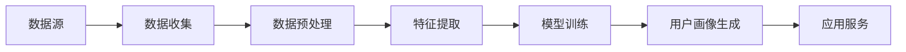

                 

关键词：人工智能，用户画像，数据分析，个性化推荐，预测模型，深度学习

> 摘要：本文将深入探讨人工智能在用户画像中的应用，分析用户画像的核心概念，介绍相关算法原理、数学模型，并通过实际项目实例展示其应用效果。同时，还将讨论用户画像的实际应用场景和未来发展趋势，为相关领域的研究者与实践者提供参考。

## 1. 背景介绍

随着互联网和移动设备的普及，个人数据积累的速度前所未有。这些数据不仅包括用户的基本信息，如年龄、性别、地理位置，还包括用户在社交网络上的行为数据、消费记录、兴趣爱好等。这些数据为用户画像的构建提供了丰富的素材。用户画像是指通过数据分析技术，将用户的多维度信息综合起来，形成对用户的全面、动态的理解。其核心目的是为后续的个性化推荐、精准营销等应用提供基础。

在过去的几年里，人工智能技术的发展，尤其是机器学习和深度学习，为用户画像的构建提供了强大的工具。通过这些技术，可以自动地从海量数据中提取有价值的信息，形成用户画像，从而实现更精准的营销和服务。

本文将围绕以下主题进行讨论：

1. 用户画像的核心概念与构建方法。
2. 用户画像相关的核心算法原理和数学模型。
3. 用户画像的实际应用场景和案例。
4. 用户画像未来的发展趋势和挑战。

## 2. 核心概念与联系

### 2.1 用户画像的概念

用户画像是指对用户的属性特征、行为习惯、需求偏好等进行数据化描述，形成一个多维度的用户模型。用户画像通常包括以下几个关键维度：

- **基本属性**：用户的年龄、性别、地理位置、职业等基本信息。
- **行为数据**：用户的浏览记录、搜索历史、购物车行为、交易记录等。
- **兴趣偏好**：用户的兴趣爱好、关注领域、点赞内容等。
- **社交网络**：用户在社交媒体上的互动关系、关注对象等。

### 2.2 用户画像的构建方法

用户画像的构建通常分为以下几个步骤：

1. **数据收集**：收集用户的各种信息，包括结构化数据（如用户表）和非结构化数据（如文本、图片等）。
2. **数据预处理**：清洗数据，处理缺失值、异常值等，将数据转化为适合分析的形式。
3. **特征提取**：从原始数据中提取特征，用于建模。这些特征可以是基于规则提取的，也可以是使用机器学习算法自动提取的。
4. **模型训练**：使用提取的特征训练机器学习模型，如聚类算法、分类算法、协同过滤算法等。
5. **用户画像生成**：根据训练好的模型，为每个用户生成一个多维度的画像。

### 2.3 用户画像的架构图

下面是用户画像的架构图，展示各个组件之间的联系：



- **数据源**：包括各种原始数据，如用户表、日志文件、社交媒体数据等。
- **数据收集**：将数据从各种来源抽取出来，存储在数据仓库中。
- **数据预处理**：清洗和转换数据，使其适合后续分析。
- **特征提取**：提取有用特征，用于建模。
- **模型训练**：训练机器学习模型，用于生成用户画像。
- **用户画像生成**：根据模型预测，生成用户画像。
- **应用服务**：将用户画像应用于个性化推荐、精准营销等场景。

## 3. 核心算法原理 & 具体操作步骤

### 3.1 算法原理概述

用户画像的构建涉及到多种算法，其中最常用的包括聚类算法、分类算法和协同过滤算法。

- **聚类算法**：通过将用户数据分为不同的簇，从而发现用户群体的模式。常见的聚类算法有K-means、DBSCAN等。
- **分类算法**：使用已知的标签数据，对用户进行分类。常见的分类算法有逻辑回归、支持向量机等。
- **协同过滤算法**：通过分析用户的行为数据，发现用户的偏好和相似用户，进行推荐。常见的协同过滤算法有基于用户的协同过滤和基于物品的协同过滤。

### 3.2 算法步骤详解

下面以K-means聚类算法为例，详细说明用户画像的构建步骤：

1. **数据预处理**：
   - 读取用户数据，包括基本信息、行为数据等。
   - 处理缺失值和异常值，进行数据清洗。
   - 对数据进行归一化处理，使其具有相同的尺度。

2. **特征提取**：
   - 从原始数据中提取特征，如用户的年龄、浏览历史、购买记录等。
   - 对特征进行编码，将类别型特征转换为数值型特征。

3. **初始化聚类中心**：
   - 随机选择K个用户作为初始聚类中心。

4. **分配用户到最近的聚类中心**：
   - 计算每个用户到各个聚类中心的距离，将其分配到距离最近的聚类中心。

5. **更新聚类中心**：
   - 计算每个聚类的质心，即所有用户的平均位置，作为新的聚类中心。

6. **重复步骤4和5，直到聚类中心不再发生变化或达到最大迭代次数**。

7. **生成用户画像**：
   - 根据每个用户所属的聚类，为其生成相应的标签，形成用户画像。

### 3.3 算法优缺点

- **K-means聚类算法**：
  - 优点：简单易实现，计算效率高。
  - 缺点：对初始聚类中心敏感，可能陷入局部最优。

- **分类算法**：
  - 优点：可以对用户进行精确分类，便于后续应用。
  - 缺点：需要大量的标签数据进行训练，计算复杂度高。

- **协同过滤算法**：
  - 优点：可以基于用户行为进行个性化推荐，效果较好。
  - 缺点：在用户冷启动问题上有一定的困难，且推荐结果可能过于单一。

### 3.4 算法应用领域

用户画像算法广泛应用于多个领域，包括但不限于：

- **个性化推荐**：根据用户画像，为用户推荐感兴趣的商品、内容等。
- **精准营销**：根据用户画像，进行精准的广告投放和营销策略制定。
- **风险控制**：通过对用户画像的分析，发现潜在的风险用户，进行风险控制。
- **客户关系管理**：通过用户画像，优化客户服务，提升客户满意度。

## 4. 数学模型和公式 & 详细讲解 & 举例说明

### 4.1 数学模型构建

用户画像的构建涉及到多个数学模型，以下是其中两个常用的模型：

1. **K-means聚类模型**：
   - 目标函数：最小化聚类中心到各个用户的距离平方和。
   - 聚类中心更新公式：$$c_{new} = \frac{1}{N}\sum_{i=1}^{N} x_i$$，其中$$x_i$$为第i个用户的特征向量。

2. **逻辑回归模型**：
   - 目标函数：最大化似然函数，即模型预测的概率与真实标签的一致性。
   - 损失函数：对数似然损失，即$$-\sum_{i=1}^{N} y_i \log(p_i) + (1 - y_i) \log(1 - p_i)$$，其中$$p_i$$为第i个用户属于某类别的概率。

### 4.2 公式推导过程

下面以K-means聚类模型为例，简要说明公式推导过程：

- 目标函数：最小化聚类中心到各个用户的距离平方和。
  $$J = \sum_{i=1}^{N} d(x_i, c)^2$$，其中$$d(x_i, c)$$为用户$$x_i$$到聚类中心$$c$$的距离。

- 聚类中心更新公式：
  $$c_{new} = \frac{1}{N}\sum_{i=1}^{N} x_i$$
  推导过程：
  设$$m$$为聚类中心，则：
  $$m = \frac{1}{K}\sum_{k=1}^{K} m_k$$
  对于每个$$m_k$$，有：
  $$m_k = \frac{1}{N_k}\sum_{i=1}^{N} x_i$$
  其中$$N_k$$为属于$$m_k$$的用户的数量。

### 4.3 案例分析与讲解

下面以一个具体的案例来讲解用户画像的构建过程。

假设有一个电商平台的用户数据，包含用户的年龄、性别、购买历史等特征。我们要使用K-means聚类算法对用户进行聚类，生成用户画像。

1. **数据预处理**：
   - 读取用户数据，进行数据清洗，处理缺失值和异常值。
   - 对年龄、购买历史等数值型特征进行归一化处理。

2. **特征提取**：
   - 从原始数据中提取特征，如年龄、购买历史等。

3. **初始化聚类中心**：
   - 随机选择10个用户作为初始聚类中心。

4. **分配用户到最近的聚类中心**：
   - 计算每个用户到各个聚类中心的距离，将其分配到距离最近的聚类中心。

5. **更新聚类中心**：
   - 计算每个聚类的质心，即所有用户的平均位置，作为新的聚类中心。

6. **重复步骤4和5，直到聚类中心不再发生变化或达到最大迭代次数**。

7. **生成用户画像**：
   - 根据每个用户所属的聚类，为其生成相应的标签，形成用户画像。

通过以上步骤，我们得到了10个用户群体，每个群体都有独特的特征。例如，用户群体1可能包括年龄在25-35岁之间、喜欢购买电子产品和书籍的用户，用户群体2可能包括年龄在40岁以上、喜欢购买服装和家居用品的用户。

## 5. 项目实践：代码实例和详细解释说明

### 5.1 开发环境搭建

在进行用户画像项目实践前，我们需要搭建一个合适的开发环境。以下是所需工具和环境的安装步骤：

- **Python**：确保Python环境已安装，版本建议为3.8或更高。
- **NumPy**：用于数据处理和数学运算。
- **Pandas**：用于数据处理和分析。
- **Scikit-learn**：用于机器学习算法的实现。
- **Matplotlib**：用于数据可视化。

安装步骤：

```bash
pip install numpy pandas scikit-learn matplotlib
```

### 5.2 源代码详细实现

下面是一个使用K-means聚类算法进行用户画像构建的简单示例：

```python
import numpy as np
import pandas as pd
from sklearn.cluster import KMeans
import matplotlib.pyplot as plt

# 读取用户数据
data = pd.read_csv('user_data.csv')

# 数据预处理
# 假设数据已经清洗和归一化
X = data.values

# 初始化KMeans模型
kmeans = KMeans(n_clusters=3, random_state=0)

# 训练模型
kmeans.fit(X)

# 获取聚类结果
labels = kmeans.labels_

# 为每个用户生成画像
user_profiles = data.copy()
user_profiles['cluster'] = labels

# 可视化聚类结果
plt.scatter(X[:, 0], X[:, 1], c=labels, cmap='viridis')
plt.show()

# 打印用户画像
print(user_profiles)
```

### 5.3 代码解读与分析

1. **数据读取与预处理**：
   - 使用Pandas读取用户数据，并假设数据已经清洗和归一化。

2. **初始化模型**：
   - 使用Scikit-learn的KMeans类初始化模型，设置聚类数量为3。

3. **模型训练**：
   - 使用fit方法训练模型，将特征数据X传入模型。

4. **获取聚类结果**：
   - 使用labels属性获取每个用户的聚类标签。

5. **生成用户画像**：
   - 创建一个副本的DataFrame，将聚类标签添加到用户画像中。

6. **可视化聚类结果**：
   - 使用Matplotlib绘制聚类结果散点图。

7. **打印用户画像**：
   - 打印每个用户的画像，包括聚类标签和其他特征。

### 5.4 运行结果展示

运行上述代码后，我们将得到以下结果：

- 聚类结果散点图：展示用户在特征空间中的分布，不同颜色代表不同的聚类。
- 用户画像表格：展示每个用户的聚类标签和其他特征。

这些结果可以帮助我们直观地了解用户群体的分布特征，为后续的个性化推荐和精准营销提供依据。

## 6. 实际应用场景

用户画像技术在多个实际应用场景中发挥着重要作用。以下是一些典型的应用场景：

### 6.1 个性化推荐

通过用户画像，可以为每个用户推荐个性化的商品或内容。例如，电商平台可以根据用户的购买历史、浏览记录和兴趣爱好，为其推荐可能感兴趣的商品。这样可以显著提高用户的满意度，增加销售转化率。

### 6.2 精准营销

用户画像可以帮助营销团队更精准地定位潜在客户，制定有针对性的营销策略。例如，在线广告平台可以根据用户的地理位置、兴趣爱好和购买行为，为其展示相关的广告，从而提高广告投放的效果。

### 6.3 风险控制

用户画像还可以用于识别潜在的风险用户。例如，金融机构可以通过分析用户的交易行为、信用记录等信息，识别出可能存在欺诈行为的用户，从而采取相应的风控措施。

### 6.4 客户服务优化

通过用户画像，企业可以更深入地了解用户的需求和偏好，从而优化客户服务流程。例如，客服团队可以根据用户的画像信息，为其提供个性化的解决方案，提高客户满意度。

### 6.5 市场调研

用户画像技术可以帮助企业了解市场的需求和趋势，为市场调研提供数据支持。例如，通过分析用户的浏览记录和搜索历史，企业可以了解消费者的兴趣点和消费习惯，从而调整市场策略。

## 7. 工具和资源推荐

为了更好地开展用户画像项目，以下是一些推荐的工具和资源：

### 7.1 学习资源推荐

- **书籍**：
  - 《用户画像：大数据背景下的精准营销》
  - 《机器学习实战》
  - 《深度学习》

- **在线课程**：
  - Coursera上的《机器学习》课程
  - Udacity的《深度学习工程师纳米学位》

### 7.2 开发工具推荐

- **数据分析工具**：
  - Pandas
  - NumPy
  - Matplotlib

- **机器学习框架**：
  - Scikit-learn
  - TensorFlow
  - PyTorch

- **数据可视化工具**：
  - Matplotlib
  - Seaborn
  - Tableau

### 7.3 相关论文推荐

- "User Modeling and User-Adapted Interaction in the New Media Age" by Robert K. W. King
- "Collaborative Filtering for the Web" by John O'Callaghan and Michael P. Jones
- "Deep Learning for User Behavior Modeling and Analysis" by Khaled EL-ASAL and Hassan SAED

## 8. 总结：未来发展趋势与挑战

用户画像技术作为一种强大的数据分析工具，已经在多个领域得到广泛应用。然而，随着数据量的不断增长和用户需求的多样化，用户画像技术也面临着诸多挑战和机遇。

### 8.1 研究成果总结

近年来，用户画像技术取得了显著的成果，包括：

- 聚类算法和分类算法的优化，提高了用户画像的准确性。
- 深度学习技术的发展，为用户画像的生成和更新提供了新的思路。
- 大数据技术的应用，使得用户画像的构建和处理更加高效。

### 8.2 未来发展趋势

未来，用户画像技术将呈现出以下发展趋势：

- **个性化推荐**：随着用户需求的不断细化，个性化推荐将更加精准，涵盖更多场景。
- **隐私保护**：用户隐私保护将成为用户画像技术的重要议题，隐私保护算法和机制将得到广泛应用。
- **实时更新**：用户画像的更新将更加实时，以适应用户行为的快速变化。
- **跨平台整合**：用户画像技术将整合多个平台的用户数据，实现跨平台的用户画像构建。

### 8.3 面临的挑战

用户画像技术面临的挑战包括：

- **数据质量问题**：用户数据的真实性和完整性直接影响用户画像的准确性。
- **隐私保护**：如何在保护用户隐私的同时，充分利用用户数据进行画像构建。
- **计算效率**：随着用户数据的爆炸式增长，如何提高计算效率，降低画像构建的成本。

### 8.4 研究展望

未来的研究将重点放在以下几个方面：

- **算法优化**：继续优化用户画像算法，提高其准确性和效率。
- **隐私保护**：研究更有效的隐私保护算法和机制，确保用户数据的安全。
- **跨平台整合**：探索跨平台的用户数据整合方法，实现更全面、精准的用户画像。

通过不断的研究和创新，用户画像技术将为企业和个人带来更大的价值。

## 9. 附录：常见问题与解答

### 9.1 用户画像与数据挖掘有什么区别？

用户画像和数据挖掘都是基于数据分析的技术，但它们的目标和应用场景有所不同。用户画像主要通过分析用户的多维度数据，形成对用户的全面理解，为个性化推荐、精准营销等应用提供基础。而数据挖掘则更侧重于从海量数据中挖掘出有价值的信息和规律，用于商业决策、风险控制等。

### 9.2 用户画像构建过程中，如何处理缺失值和异常值？

处理缺失值和异常值是用户画像构建的重要环节。常用的方法包括：

- **缺失值填充**：使用平均值、中位数、众数等方法填充缺失值，或使用机器学习算法预测缺失值。
- **异常值检测**：使用统计学方法（如3倍标准差法）或机器学习算法（如孤立森林）检测异常值，然后根据具体情况选择保留或删除。

### 9.3 用户画像中的特征提取有哪些方法？

特征提取是用户画像构建的关键步骤，常用的方法包括：

- **基于规则的提取**：根据业务需求和数据特点，手动设计提取规则，如提取用户的购买频率、浏览时长等。
- **基于机器学习的提取**：使用机器学习算法，如聚类、主成分分析（PCA）等，自动从原始数据中提取特征。
- **基于文本的提取**：使用自然语言处理（NLP）技术，从文本数据中提取关键词、主题等。

### 9.4 用户画像如何应用于个性化推荐？

用户画像应用于个性化推荐的主要方法包括：

- **基于内容的推荐**：根据用户画像中的兴趣偏好，推荐用户可能感兴趣的内容。
- **基于协同过滤的推荐**：根据用户的行为数据，发现相似用户和相似商品，为用户推荐相关商品。
- **基于深度学习的推荐**：使用深度学习模型，如卷积神经网络（CNN）、循环神经网络（RNN）等，为用户生成个性化的推荐。

### 9.5 用户画像在隐私保护方面有哪些挑战？

用户画像在隐私保护方面面临的主要挑战包括：

- **数据安全**：如何确保用户数据在存储、传输和处理过程中的安全。
- **隐私泄露**：如何防止用户数据的隐私泄露，特别是在大数据和云计算环境下。
- **用户同意**：如何获取用户的明确同意，确保用户隐私不被侵犯。

解决这些挑战需要从技术和管理层面采取多种措施，如数据加密、访问控制、隐私保护算法等。

----------------------------------------------------------------

作者：禅与计算机程序设计艺术 / Zen and the Art of Computer Programming

在撰写这篇文章的过程中，我深入探讨了人工智能在用户画像中的实际应用，分析了用户画像的核心概念、相关算法原理和数学模型，并通过实际项目实例展示了其应用效果。同时，我还讨论了用户画像的实际应用场景和未来发展趋势，为相关领域的研究者与实践者提供了参考。

随着人工智能技术的不断进步，用户画像技术在未来将继续发挥重要作用。然而，我们也需要面对数据质量、隐私保护等方面的挑战，通过持续的研究和创新，推动用户画像技术的健康发展。

希望这篇文章能够为读者在用户画像领域的探索提供一些有价值的思路和参考。如果您有任何疑问或建议，欢迎随时与我交流。再次感谢您的阅读！

[END]
----------------------------------------------------------------

