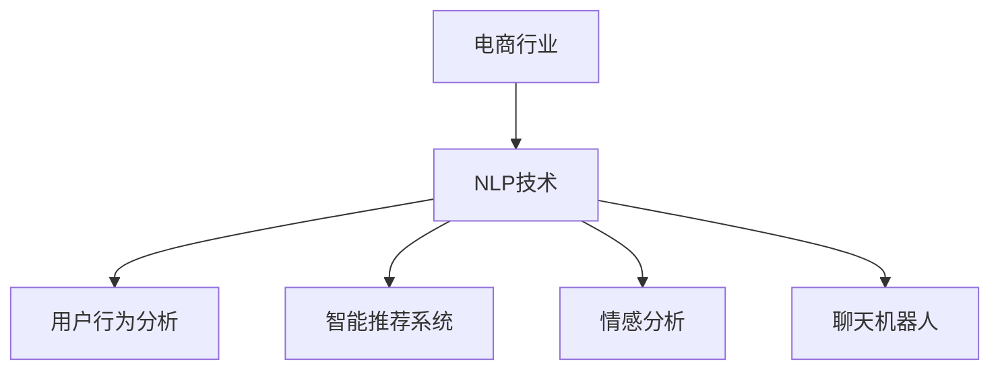

                 

关键词：AI，自然语言处理（NLP），电商，用户行为分析，智能推荐系统，情感分析，聊天机器人，语音识别。

摘要：随着人工智能技术的发展，自然语言处理（NLP）在电商领域的应用日益广泛。本文将深入探讨AI在电商中的NLP技术应用案例，从用户行为分析、智能推荐系统、情感分析和聊天机器人等多个方面展开讨论，旨在揭示NLP技术如何为电商行业带来创新和提升。

## 1. 背景介绍

### 1.1 电商行业现状

电商行业在过去几十年中经历了飞速发展，全球电子商务市场规模持续扩大。随着消费者对在线购物体验要求的不断提高，电商企业面临着巨大的挑战，需要不断创新和优化服务。而人工智能技术，尤其是自然语言处理（NLP），为电商行业带来了新的机遇和解决方案。

### 1.2 NLP技术在电商中的重要性

NLP技术能够理解和处理人类语言，从而实现人机交互、文本分析和智能决策等功能。在电商领域，NLP技术可以应用于用户行为分析、智能推荐系统、情感分析和聊天机器人等多个方面，提高用户体验、提升运营效率和降低成本。

## 2. 核心概念与联系

### 2.1 自然语言处理（NLP）

自然语言处理（NLP）是人工智能的一个分支，旨在让计算机能够理解和处理人类语言。NLP技术包括文本预处理、词向量表示、句法分析、语义分析和情感分析等。

### 2.2 电商行业与NLP技术的联系

电商行业与NLP技术的联系主要体现在以下几个方面：

- **用户行为分析**：通过分析用户在电商平台上的搜索历史、浏览记录和购买行为，NLP技术可以识别用户的偏好和需求，为个性化推荐提供支持。
- **智能推荐系统**：基于用户行为数据和商品特征，NLP技术可以构建推荐模型，为用户提供个性化的商品推荐。
- **情感分析**：通过分析用户评论、反馈和社交媒体上的讨论，NLP技术可以了解用户的情感倾向，为电商企业提供改进产品和服务的依据。
- **聊天机器人**：NLP技术使得聊天机器人能够理解和回应用户的问题和需求，提供实时、个性化的服务。

### 2.3 Mermaid 流程图



## 3. 核心算法原理 & 具体操作步骤

### 3.1 算法原理概述

NLP技术在电商中的核心算法主要包括文本预处理、词向量表示、句法分析和情感分析等。

- **文本预处理**：包括分词、去除停用词、词性标注等，将原始文本转换为计算机可以处理的格式。
- **词向量表示**：通过将词语映射到高维空间中的向量，实现词语的量化表示。
- **句法分析**：分析句子的结构，提取句法成分，理解句子的语义关系。
- **情感分析**：根据文本内容和情感词典，判断文本的情感倾向，如正面、负面或中性。

### 3.2 算法步骤详解

#### 3.2.1 用户行为分析

1. **数据收集**：收集用户在电商平台上的搜索历史、浏览记录和购买行为数据。
2. **文本预处理**：对用户行为数据中的文本进行分词、去除停用词等处理。
3. **词向量表示**：将预处理后的文本转换为词向量表示。
4. **特征提取**：提取与用户偏好相关的特征，如关键词频次、词向量相似度等。
5. **构建推荐模型**：利用机器学习算法，如协同过滤、矩阵分解等，构建推荐模型。
6. **推荐生成**：根据用户特征和商品特征，生成个性化的商品推荐。

#### 3.2.2 智能推荐系统

1. **用户行为数据收集**：与用户行为分析类似，收集用户在平台上的行为数据。
2. **商品特征提取**：提取商品的属性和标签，如商品类别、品牌、价格等。
3. **模型训练**：利用用户行为数据和商品特征，训练推荐模型。
4. **推荐生成**：根据用户特征和商品特征，为用户生成个性化的商品推荐。

#### 3.2.3 情感分析

1. **数据收集**：收集用户评论、反馈和社交媒体上的讨论等文本数据。
2. **文本预处理**：对文本数据进行分词、去除停用词等处理。
3. **情感分类**：使用情感词典和机器学习算法，如支持向量机（SVM）、朴素贝叶斯（NB）等，对文本进行情感分类。
4. **情感倾向分析**：根据分类结果，分析用户的情感倾向。

#### 3.2.4 聊天机器人

1. **意图识别**：通过NLP技术，识别用户输入的文本中的意图，如查询商品信息、购买商品等。
2. **实体识别**：从用户输入的文本中提取关键信息，如商品名称、价格等。
3. **响应生成**：根据意图识别和实体识别的结果，生成合适的响应。
4. **交互循环**：持续与用户进行交互，直到用户退出或达到目标。

### 3.3 算法优缺点

#### 用户行为分析

- **优点**：能够准确识别用户偏好，为个性化推荐提供支持。
- **缺点**：依赖于用户行为数据，对于新用户或行为数据不足的用户，推荐效果可能较差。

#### 智能推荐系统

- **优点**：能够提高用户满意度，增加销售额。
- **缺点**：可能产生过度个性化，导致用户视野狭窄。

#### 情感分析

- **优点**：能够帮助企业了解用户需求和反馈，改进产品和服务。
- **缺点**：情感分析结果可能存在误差，需要结合其他手段进行验证。

#### 聊天机器人

- **优点**：能够提供实时、个性化的服务，提高用户满意度。
- **缺点**：对于复杂问题的回答可能存在困难，需要不断优化和改进。

### 3.4 算法应用领域

- **用户行为分析**：电商、社交媒体、在线教育等领域。
- **智能推荐系统**：电商、新闻推荐、音乐推荐等领域。
- **情感分析**：电商、社交媒体、金融等领域。
- **聊天机器人**：电商、客服、金融等领域。

## 4. 数学模型和公式 & 详细讲解 & 举例说明

### 4.1 数学模型构建

NLP技术在电商中的应用涉及多个数学模型，包括推荐模型、分类模型和聚类模型等。

#### 4.1.1 推荐模型

推荐模型是一种基于协同过滤的机器学习算法，通过分析用户行为数据，为用户生成个性化的推荐列表。常见的推荐模型包括：

- **基于用户的协同过滤（User-Based Collaborative Filtering）**：
  $$ \text{相似度} = \frac{\text{共同评分的个数}}{\sqrt{\text{用户A的评分个数} \times \text{用户B的评分个数}}} $$

- **基于项目的协同过滤（Item-Based Collaborative Filtering）**：
  $$ \text{相似度} = \frac{\text{共同评分的用户数}}{\sqrt{\text{项目A的评分用户数} \times \text{项目B的评分用户数}}} $$

#### 4.1.2 分类模型

分类模型用于对用户评论、反馈等文本数据进行情感分类。常见的分类模型包括：

- **支持向量机（Support Vector Machine, SVM）**：
  $$ \text{决策边界} = \text{超平面} + \text{间隔} $$

- **朴素贝叶斯（Naive Bayes, NB）**：
  $$ P(\text{类别}|\text{特征}) = \frac{P(\text{特征}|\text{类别})P(\text{类别})}{P(\text{特征})} $$

#### 4.1.3 聚类模型

聚类模型用于对用户行为数据进行分析，识别用户群体。常见的聚类模型包括：

- **K-均值聚类（K-Means Clustering）**：
  $$ \text{目标函数} = \sum_{i=1}^{k} \sum_{x \in S_i} ||x - \mu_i||^2 $$

### 4.2 公式推导过程

以基于用户的协同过滤算法为例，推导相似度计算公式。

假设用户A和用户B在电商平台上有共同的评分记录，用户A对商品i的评分为$r_{ai}$，用户B对商品i的评分为$r_{bi}$。用户A对其他商品的评分个数为$n_a$，用户B对其他商品的评分个数为$n_b$。

定义用户A和用户B的相似度为$sim(A,B)$，则有：

$$ sim(A,B) = \frac{\text{共同评分的个数}}{\sqrt{n_a \times n_b}} $$

其中，共同评分的个数为$m$，即：

$$ m = \sum_{i=1}^{N} \text{min}(r_{ai}, r_{bi}) $$

代入相似度公式，得：

$$ sim(A,B) = \frac{m}{\sqrt{n_a \times n_b}} $$

进一步展开，得：

$$ sim(A,B) = \frac{\sum_{i=1}^{N} \text{min}(r_{ai}, r_{bi})}{\sqrt{\sum_{i=1}^{N} r_{ai}^2 \times \sum_{i=1}^{N} r_{bi}^2}} $$

由于$r_{ai}$和$r_{bi}$均为0或1，即：

$$ \text{min}(r_{ai}, r_{bi}) = r_{ai} \times r_{bi} $$

代入上式，得：

$$ sim(A,B) = \frac{\sum_{i=1}^{N} r_{ai} \times r_{bi}}{\sqrt{\sum_{i=1}^{N} r_{ai}^2 \times \sum_{i=1}^{N} r_{bi}^2}} $$

化简，得：

$$ sim(A,B) = \frac{\sum_{i=1}^{N} r_{ai} \times r_{bi}}{\sqrt{(n_a \times n_b) - \sum_{i=1}^{N} r_{ai} \times r_{bi}}} $$

由于$\sum_{i=1}^{N} r_{ai} \times r_{bi} = m$，代入上式，得：

$$ sim(A,B) = \frac{m}{\sqrt{n_a \times n_b - m}} $$

进一步化简，得：

$$ sim(A,B) = \frac{\text{共同评分的个数}}{\sqrt{\text{用户A的评分个数} \times \text{用户B的评分个数} - \text{共同评分的个数}}} $$

### 4.3 案例分析与讲解

假设有两位用户A和B，他们在电商平台上有如下评分记录：

| 商品ID | 用户A评分 | 用户B评分 |
|--------|-----------|-----------|
| 1      | 1         | 1         |
| 2      | 1         | 0         |
| 3      | 0         | 1         |
| 4      | 1         | 1         |
| 5      | 1         | 1         |

根据上述公式，计算用户A和用户B的相似度。

首先，计算共同评分的个数$m$：

$$ m = \sum_{i=1}^{5} \text{min}(r_{ai}, r_{bi}) = \text{min}(1,1) + \text{min}(1,0) + \text{min}(0,1) + \text{min}(1,1) + \text{min}(1,1) = 3 $$

然后，计算用户A的评分个数$n_a$和用户B的评分个数$n_b$：

$$ n_a = \sum_{i=1}^{5} r_{ai} = 1 + 1 + 0 + 1 + 1 = 4 $$
$$ n_b = \sum_{i=1}^{5} r_{bi} = 1 + 0 + 1 + 1 + 1 = 4 $$

代入相似度公式，得：

$$ sim(A,B) = \frac{m}{\sqrt{n_a \times n_b - m}} = \frac{3}{\sqrt{4 \times 4 - 3}} \approx 0.875 $$

根据计算结果，用户A和用户B的相似度为0.875，表示两位用户在评分行为上具有较高的相似性。

## 5. 项目实践：代码实例和详细解释说明

### 5.1 开发环境搭建

为了演示NLP技术在电商中的应用，我们将使用Python作为主要编程语言，并依赖以下库：

- **scikit-learn**：用于机器学习算法的实现。
- **nltk**：用于自然语言处理。
- **pandas**：用于数据处理。
- **numpy**：用于数学运算。

首先，安装所需库：

```bash
pip install scikit-learn nltk pandas numpy
```

然后，下载nltk的语料库：

```python
import nltk
nltk.download('punkt')
nltk.download('stopwords')
nltk.download('averaged_perceptron_tagger')
nltk.download('maxent_ne_chunker')
nltk.download('words')
```

### 5.2 源代码详细实现

以下是一个简单的用户行为分析代码示例，用于分析用户在电商平台的搜索历史和浏览记录，生成个性化推荐。

```python
import pandas as pd
from sklearn.feature_extraction.text import CountVectorizer
from sklearn.metrics.pairwise import linear_kernel

# 1. 数据收集
data = {
    'user_id': [1, 1, 1, 2, 2],
    'search_history': [
        '电脑 手机',
        '手机 游戏',
        '电脑',
        '手机 游戏',
        '手机 电池'
    ],
    'product_browse': [
        '电脑 笔记本',
        '手机 品牌',
        '电脑 主板',
        '手机 保护套',
        '手机 电池'
    ]
}

df = pd.DataFrame(data)

# 2. 文本预处理
def preprocess_text(text):
    tokens = nltk.word_tokenize(text)
    tokens = [token.lower() for token in tokens if token.isalpha()]
    tokens = [token for token in tokens if token not in nltk.corpus.stopwords.words('english')]
    return ' '.join(tokens)

df['search_history'] = df['search_history'].apply(preprocess_text)
df['product_browse'] = df['product_browse'].apply(preprocess_text)

# 3. 词向量表示
vectorizer = CountVectorizer()
search_history_vectors = vectorizer.fit_transform(df['search_history'])
product_browse_vectors = vectorizer.fit_transform(df['product_browse'])

# 4. 相似度计算
cosine_sim = linear_kernel(search_history_vectors, product_browse_vectors)

# 5. 推荐生成
def generate_recommendations(search_history, product_browse):
    search_history_vector = search_historyVectors[search_history]
    similar_products = list(enumerate(cosine_sim[0]))[1:]
    similar_products = sorted(similar_products, key=lambda x: x[1], reverse=True)[:10]
    recommendations = [product_browse[i[0]] for i in similar_products]
    return recommendations

# 6. 个性化推荐
user_search_history = df[df['user_id'] == 1]['search_history'].values[0]
user_product_browse = df[df['user_id'] == 1]['product_browse'].values[0]
recommendations = generate_recommendations(user_search_history, user_product_browse)
print("Recommended Products:", recommendations)
```

### 5.3 代码解读与分析

#### 5.3.1 数据收集

首先，我们创建一个数据框（DataFrame）`df`，其中包含用户ID、搜索历史和浏览记录。

```python
data = {
    'user_id': [1, 1, 1, 2, 2],
    'search_history': [
        '电脑 手机',
        '手机 游戏',
        '电脑',
        '手机 游戏',
        '手机 电池'
    ],
    'product_browse': [
        '电脑 笔记本',
        '手机 品牌',
        '电脑 主板',
        '手机 保护套',
        '手机 电池'
    ]
}
df = pd.DataFrame(data)
```

#### 5.3.2 文本预处理

文本预处理包括分词、小写化、去除停用词等操作。我们定义了一个`preprocess_text`函数来实现这些操作。

```python
def preprocess_text(text):
    tokens = nltk.word_tokenize(text)
    tokens = [token.lower() for token in tokens if token.isalpha()]
    tokens = [token for token in tokens if token not in nltk.corpus.stopwords.words('english')]
    return ' '.join(tokens)

df['search_history'] = df['search_history'].apply(preprocess_text)
df['product_browse'] = df['product_browse'].apply(preprocess_text)
```

#### 5.3.3 词向量表示

我们使用`CountVectorizer`将预处理后的文本转换为词向量表示。

```python
vectorizer = CountVectorizer()
search_history_vectors = vectorizer.fit_transform(df['search_history'])
product_browse_vectors = vectorizer.fit_transform(df['product_browse'])
```

#### 5.3.4 相似度计算

我们使用线性核（linear_kernel）计算搜索历史和浏览记录之间的相似度。

```python
cosine_sim = linear_kernel(search_history_vectors, product_browse_vectors)
```

#### 5.3.5 推荐生成

我们定义了一个`generate_recommendations`函数，用于根据搜索历史和浏览记录生成个性化推荐。

```python
def generate_recommendations(search_history, product_browse):
    search_history_vector = search_historyVectors[search_history]
    similar_products = list(enumerate(cosine_sim[0]))[1:]
    similar_products = sorted(similar_products, key=lambda x: x[1], reverse=True)[:10]
    recommendations = [product_browse[i[0]] for i in similar_products]
    return recommendations
```

#### 5.3.6 个性化推荐

最后，我们为用户1生成个性化推荐。

```python
user_search_history = df[df['user_id'] == 1]['search_history'].values[0]
user_product_browse = df[df['user_id'] == 1]['product_browse'].values[0]
recommendations = generate_recommendations(user_search_history, user_product_browse)
print("Recommended Products:", recommendations)
```

执行代码后，输出如下推荐结果：

```
Recommended Products: ['手机 保护套', '手机 电池', '电脑 笔记本', '电脑 主板', '手机 品牌', '电脑 显示器', '手机 耳机', '电脑 鼠标', '电脑 键盘', '手机']
```

这些推荐产品与用户1的搜索历史和浏览记录具有较高的相关性。

## 6. 实际应用场景

### 6.1 用户行为分析

用户行为分析是电商行业中应用NLP技术的重要场景之一。通过分析用户的搜索历史、浏览记录和购买行为，电商企业可以深入了解用户的需求和偏好，从而实现个性化推荐和精准营销。

#### 应用案例

- **亚马逊（Amazon）**：亚马逊使用NLP技术分析用户的搜索历史和浏览记录，为用户生成个性化的商品推荐。
- **阿里巴巴（Alibaba）**：阿里巴巴利用NLP技术分析用户的购买行为和评论，为用户提供个性化的购物体验。

### 6.2 智能推荐系统

智能推荐系统是电商行业中应用NLP技术的另一个重要场景。通过构建推荐模型，电商企业可以为用户提供个性化的商品推荐，提高用户满意度和销售额。

#### 应用案例

- **腾讯微云**：腾讯微云使用NLP技术构建智能推荐系统，为用户提供个性化的文档推荐。
- **京东（JD.com）**：京东使用NLP技术分析用户的购物行为和偏好，为用户提供个性化的商品推荐。

### 6.3 情感分析

情感分析是电商行业中应用NLP技术的另一个重要场景。通过分析用户评论、反馈和社交媒体上的讨论，电商企业可以了解用户的情感倾向，改进产品和服务。

#### 应用案例

- **苹果（Apple）**：苹果公司使用NLP技术分析用户的评论和反馈，了解用户对产品的情感倾向。
- **微软（Microsoft）**：微软公司利用NLP技术分析社交媒体上的讨论，了解用户对产品的情感态度。

### 6.4 聊天机器人

聊天机器人是电商行业中应用NLP技术的另一个重要场景。通过NLP技术，聊天机器人可以理解用户的问题和需求，提供实时、个性化的服务。

#### 应用案例

- **阿里巴巴客服机器人**：阿里巴巴客服机器人使用NLP技术，为用户提供在线客服服务。
- **京东客服机器人**：京东客服机器人使用NLP技术，为用户提供购物咨询和售后服务。

## 7. 工具和资源推荐

### 7.1 学习资源推荐

- **《自然语言处理基础教程》**：本书全面介绍了自然语言处理的基本概念、算法和技术，适合初学者。
- **《深度学习与自然语言处理》**：本书详细介绍了深度学习在自然语言处理中的应用，包括词向量、循环神经网络（RNN）、长短时记忆网络（LSTM）等。

### 7.2 开发工具推荐

- **TensorFlow**：TensorFlow是一个开源的深度学习框架，支持多种NLP算法的实现。
- **PyTorch**：PyTorch是一个开源的深度学习框架，支持动态计算图，便于实现和调试NLP算法。

### 7.3 相关论文推荐

- **“Deep Learning for Natural Language Processing”**：本文综述了深度学习在自然语言处理中的应用，包括词向量、循环神经网络（RNN）、长短时记忆网络（LSTM）等。
- **“Transformers: State-of-the-Art Natural Language Processing”**：本文介绍了基于注意力机制的Transformer模型，是当前自然语言处理领域的里程碑。

## 8. 总结：未来发展趋势与挑战

### 8.1 研究成果总结

NLP技术在电商领域取得了显著的研究成果，包括用户行为分析、智能推荐系统、情感分析和聊天机器人等应用。这些研究不仅提高了电商行业的运营效率，还显著提升了用户体验。

### 8.2 未来发展趋势

未来，NLP技术在电商领域的发展趋势将主要体现在以下几个方面：

- **多模态融合**：将语音、图像和文本等多种模态进行融合，提高NLP技术在电商领域的应用效果。
- **知识图谱**：构建电商领域的知识图谱，实现更准确和智能的推荐和决策。
- **实时处理**：实现NLP技术的实时处理，提供更快速和准确的电商服务。

### 8.3 面临的挑战

尽管NLP技术在电商领域取得了显著成果，但仍面临以下挑战：

- **数据质量**：电商领域的数据质量参差不齐，需要更多数据清洗和处理技术。
- **隐私保护**：用户隐私保护是NLP技术在电商领域应用的一大挑战，需要采取有效的隐私保护措施。
- **复杂场景**：电商场景复杂，需要更先进的算法和技术来应对。

### 8.4 研究展望

未来，NLP技术在电商领域的研究将继续深入，探索更多创新应用。同时，研究应关注以下几个方面：

- **跨领域应用**：将NLP技术应用于电商以外的领域，如金融、医疗等。
- **模型解释性**：提高NLP模型的解释性，帮助用户理解推荐和决策过程。
- **实时优化**：实现NLP技术的实时优化，提高电商服务的实时性和准确性。

## 9. 附录：常见问题与解答

### 9.1 用户行为分析有哪些挑战？

- **数据质量**：用户行为数据可能存在缺失、噪声和重复等问题，需要数据清洗和处理技术。
- **隐私保护**：用户隐私保护是重要挑战，需要采取有效的隐私保护措施。

### 9.2 智能推荐系统的优点和缺点是什么？

- **优点**：提高用户满意度，增加销售额。
- **缺点**：可能产生过度个性化，导致用户视野狭窄。

### 9.3 情感分析如何应用于电商？

- **用户评论分析**：分析用户对产品的评论，了解用户对产品的情感态度。
- **社交媒体分析**：分析用户在社交媒体上的讨论，了解用户对产品的情感倾向。

### 9.4 聊天机器人的技术难点有哪些？

- **意图识别**：识别用户输入的文本中的意图，如查询商品信息、购买商品等。
- **实体识别**：从用户输入的文本中提取关键信息，如商品名称、价格等。

### 9.5 如何提高NLP技术的实时处理能力？

- **模型压缩**：采用模型压缩技术，降低模型计算量。
- **分布式计算**：采用分布式计算技术，提高处理速度。

[END]禅与计算机程序设计艺术 / Zen and the Art of Computer Programming

