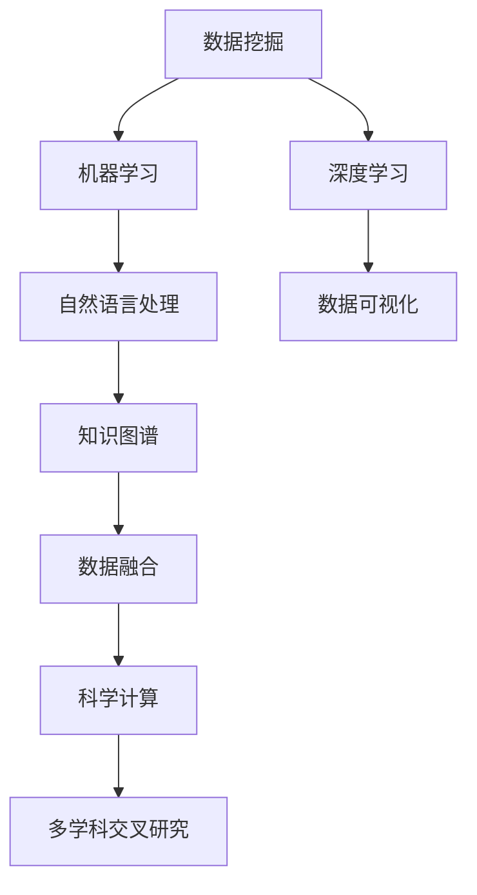

                 

关键词：人工智能，科研，知识发现，算法，数学模型，实际应用

> 摘要：本文将探讨人工智能在科研领域的应用，特别是在加速知识发现方面。通过深入分析核心概念、算法原理、数学模型，并结合实际项目实践，本文旨在为科研工作者提供有价值的见解和指导，助力科研效率提升。

## 1. 背景介绍

在当今信息化、全球化的时代，科学研究的规模和复杂性不断增加。研究人员面临着大量数据的处理和分析任务，需要从海量数据中提取有价值的信息和知识。传统的科研方法往往耗时较长，难以满足快速发展的科研需求。人工智能的兴起为科研领域带来了新的机遇，通过自动化、智能化数据处理和分析，AI技术在加速知识发现方面展现出了巨大的潜力。

人工智能在科研中的应用主要包括数据挖掘、机器学习、自然语言处理等方面。数据挖掘技术可以从大量数据中发现潜在的模式和关联，为科研提供数据支持；机器学习算法可以根据历史数据预测未来趋势，提高科研的预见性；自然语言处理技术可以处理和理解非结构化数据，为科研提供更加丰富和直观的信息。

本文将从核心概念、算法原理、数学模型和实际应用等方面，系统介绍人工智能在科研中的应用，以期为科研工作者提供有益的参考和借鉴。

## 2. 核心概念与联系

在讨论人工智能在科研中的应用之前，我们首先需要了解一些核心概念和它们之间的联系。以下是一个简要的 Mermaid 流程图，展示这些概念及其相互关系：



### 2.1 数据挖掘

数据挖掘是一种从大量数据中发现有价值信息的过程。在科研中，数据挖掘技术可以帮助研究人员识别数据中的隐藏模式、趋势和关联。例如，通过对实验数据的挖掘，可以揭示不同变量之间的关系，从而为后续研究提供重要依据。

### 2.2 机器学习

机器学习是人工智能的核心技术之一，它使计算机系统能够从数据中学习和改进。在科研中，机器学习算法可以用于预测研究趋势、优化实验设计、分类数据等。例如，利用监督学习算法，可以从历史数据中预测未来的研究热点，为科研工作提供方向。

### 2.3 自然语言处理

自然语言处理技术用于理解和生成自然语言，如文本和语音。在科研中，自然语言处理可以帮助研究人员分析文献、理解实验报告、构建知识图谱等。例如，通过文本挖掘技术，可以从大量文献中提取关键信息，为科研提供知识支持。

### 2.4 深度学习

深度学习是一种基于人工神经网络的机器学习技术，它在图像、语音和自然语言处理等领域取得了显著成果。在科研中，深度学习算法可以用于图像分析、语音识别、文本生成等任务，为科研提供更多可能。

### 2.5 数据可视化

数据可视化是一种将数据转化为视觉表示的方法，它可以帮助研究人员更好地理解数据。在科研中，数据可视化技术可以用于展示实验结果、分析数据趋势等，从而提高科研的可视化效果。

### 2.6 知识图谱

知识图谱是一种用于表示实体及其之间关系的图形结构。在科研中，知识图谱可以帮助研究人员建立知识网络，从而更好地理解研究领域的知识体系。

### 2.7 数据融合

数据融合是将多个数据源中的信息整合成一个统一视图的过程。在科研中，数据融合技术可以帮助研究人员整合来自不同领域的多源数据，从而提高数据的价值。

### 2.8 科学计算

科学计算是利用计算机技术解决科学问题的一种方法。在科研中，科学计算可以用于模拟实验、预测结果、优化方案等。

### 2.9 多学科交叉研究

多学科交叉研究是跨学科合作的一种形式，它可以将不同领域的知识和技术应用于同一问题，从而提高研究的深度和广度。

## 3. 核心算法原理 & 具体操作步骤

### 3.1 算法原理概述

在本节中，我们将介绍一些在科研中广泛应用的核心算法原理，包括监督学习、无监督学习和强化学习。

### 3.2 算法步骤详解

#### 3.2.1 监督学习

监督学习是一种从标记数据中学习算法的方法。其基本步骤如下：

1. **数据预处理**：对输入数据进行清洗、归一化等处理。
2. **特征选择**：从输入数据中提取有助于预测的特征。
3. **模型训练**：利用标记数据训练模型，使其能够对新的数据进行预测。
4. **模型评估**：使用测试数据评估模型性能，调整模型参数。
5. **预测**：使用训练好的模型对新数据进行预测。

#### 3.2.2 无监督学习

无监督学习是一种从无标签数据中学习算法的方法。其基本步骤如下：

1. **数据预处理**：对输入数据进行清洗、归一化等处理。
2. **特征选择**：从输入数据中提取有助于聚类的特征。
3. **模型训练**：利用无标签数据训练模型，使其能够对数据进行聚类或降维。
4. **模型评估**：使用测试数据评估模型性能，调整模型参数。
5. **预测**：使用训练好的模型对新数据进行预测。

#### 3.2.3 强化学习

强化学习是一种通过奖励机制学习策略的方法。其基本步骤如下：

1. **初始化**：初始化智能体和环境。
2. **行动选择**：根据当前状态，选择一个行动。
3. **环境反馈**：环境根据行动给出奖励或惩罚。
4. **策略更新**：根据奖励和惩罚更新策略。
5. **状态转移**：根据新的状态和策略，继续进行行动选择。

### 3.3 算法优缺点

#### 监督学习

优点：

- 预测准确度高。
- 应用范围广泛。

缺点：

- 需要大量的标记数据。
- 对新数据的适应能力较差。

#### 无监督学习

优点：

- 不需要标记数据。
- 可以发现数据中的潜在结构和模式。

缺点：

- 预测准确度相对较低。
- 应用范围相对较窄。

#### 强化学习

优点：

- 可以处理复杂的环境。
- 具有良好的适应能力。

缺点：

- 训练过程相对较慢。
- 需要大量的计算资源。

### 3.4 算法应用领域

#### 监督学习

- 预测分析：如股票市场预测、销售预测等。
- 图像分类：如人脸识别、物体识别等。
- 自然语言处理：如文本分类、情感分析等。

#### 无监督学习

- 数据聚类：如顾客群体划分、城市分布等。
- 数据降维：如主成分分析、线性判别分析等。
- 探索性数据分析：如数据可视化、数据挖掘等。

#### 强化学习

- 自动驾驶：如自动驾驶车辆、无人机等。
- 游戏AI：如围棋、象棋等。
- 机器人控制：如机器人运动规划、环境感知等。

## 4. 数学模型和公式 & 详细讲解 & 举例说明

### 4.1 数学模型构建

在本节中，我们将介绍一些在科研中常用的数学模型，包括线性回归、逻辑回归和支持向量机。

#### 4.1.1 线性回归

线性回归是一种用于预测连续值的统计方法。其数学模型如下：

$$
y = \beta_0 + \beta_1x_1 + \beta_2x_2 + ... + \beta_nx_n + \epsilon
$$

其中，$y$ 是因变量，$x_1, x_2, ..., x_n$ 是自变量，$\beta_0, \beta_1, \beta_2, ..., \beta_n$ 是模型参数，$\epsilon$ 是误差项。

#### 4.1.2 逻辑回归

逻辑回归是一种用于预测二分类结果的统计方法。其数学模型如下：

$$
P(y=1) = \frac{1}{1 + e^{-(\beta_0 + \beta_1x_1 + \beta_2x_2 + ... + \beta_nx_n)}}
$$

其中，$y$ 是因变量，$x_1, x_2, ..., x_n$ 是自变量，$\beta_0, \beta_1, \beta_2, ..., \beta_n$ 是模型参数。

#### 4.1.3 支持向量机

支持向量机是一种用于分类和回归分析的机器学习算法。其数学模型如下：

$$
w \cdot x + b = 0
$$

其中，$w$ 是权重向量，$x$ 是特征向量，$b$ 是偏置项。

### 4.2 公式推导过程

在本节中，我们将对上述数学模型的推导过程进行简要介绍。

#### 4.2.1 线性回归

线性回归模型的推导过程如下：

1. **假设**：假设因变量 $y$ 是自变量 $x_1, x_2, ..., x_n$ 的线性函数，即 $y = \beta_0 + \beta_1x_1 + \beta_2x_2 + ... + \beta_nx_n + \epsilon$。
2. **最小化均方误差**：为了找到最优的模型参数，我们需要最小化预测值与实际值之间的均方误差，即：

$$
\min_{\beta_0, \beta_1, \beta_2, ..., \beta_n} \sum_{i=1}^{n} (y_i - (\beta_0 + \beta_1x_{i1} + \beta_2x_{i2} + ... + \beta_nx_{in}))^2
$$

3. **求导**：对上式关于每个模型参数求导，并令导数为零，得到：

$$
\frac{\partial}{\partial \beta_0} \sum_{i=1}^{n} (y_i - (\beta_0 + \beta_1x_{i1} + \beta_2x_{i2} + ... + \beta_nx_{in}))^2 = 0
$$

$$
\frac{\partial}{\partial \beta_1} \sum_{i=1}^{n} (y_i - (\beta_0 + \beta_1x_{i1} + \beta_2x_{i2} + ... + \beta_nx_{in}))^2 = 0
$$

$$
\frac{\partial}{\partial \beta_2} \sum_{i=1}^{n} (y_i - (\beta_0 + \beta_1x_{i1} + \beta_2x_{i2} + ... + \beta_nx_{in}))^2 = 0
$$

$$
...
$$

$$
\frac{\partial}{\partial \beta_n} \sum_{i=1}^{n} (y_i - (\beta_0 + \beta_1x_{i1} + \beta_2x_{i2} + ... + \beta_nx_{in}))^2 = 0
$$

4. **解方程组**：将上述方程组求解，得到最优的模型参数。

#### 4.2.2 逻辑回归

逻辑回归模型的推导过程如下：

1. **假设**：假设因变量 $y$ 是自变量 $x_1, x_2, ..., x_n$ 的线性函数，即 $y = \beta_0 + \beta_1x_1 + \beta_2x_2 + ... + \beta_nx_n + \epsilon$。
2. **最小化损失函数**：为了找到最优的模型参数，我们需要最小化损失函数，即：

$$
\min_{\beta_0, \beta_1, \beta_2, ..., \beta_n} \sum_{i=1}^{n} -y_i \ln(P(y=1)) - (1-y_i) \ln(1-P(y=1))
$$

3. **求导**：对上式关于每个模型参数求导，并令导数为零，得到：

$$
\frac{\partial}{\partial \beta_0} \sum_{i=1}^{n} -y_i \ln(P(y=1)) - (1-y_i) \ln(1-P(y=1)) = 0
$$

$$
\frac{\partial}{\partial \beta_1} \sum_{i=1}^{n} -y_i \ln(P(y=1)) - (1-y_i) \ln(1-P(y=1)) = 0
$$

$$
\frac{\partial}{\partial \beta_2} \sum_{i=1}^{n} -y_i \ln(P(y=1)) - (1-y_i) \ln(1-P(y=1)) = 0
$$

$$
...
$$

$$
\frac{\partial}{\partial \beta_n} \sum_{i=1}^{n} -y_i \ln(P(y=1)) - (1-y_i) \ln(1-P(y=1)) = 0
$$

4. **解方程组**：将上述方程组求解，得到最优的模型参数。

#### 4.2.3 支持向量机

支持向量机模型的推导过程如下：

1. **假设**：假设数据点 $x$ 在超平面 $w \cdot x + b = 0$ 上的分类间隔最大。
2. **损失函数**：为了找到最优的超平面，我们需要最小化损失函数，即：

$$
\min_{w, b} \frac{1}{2} \| w \|^2 + C \sum_{i=1}^{n} \max(0, 1 - y_i (w \cdot x_i + b))
$$

其中，$C$ 是惩罚参数。

3. **拉格朗日函数**：引入拉格朗日函数，即：

$$
L(w, b, \alpha_1, \alpha_2, ..., \alpha_n) = \frac{1}{2} \| w \|^2 - C \sum_{i=1}^{n} \alpha_i (1 - y_i (w \cdot x_i + b))
$$

其中，$\alpha_i$ 是拉格朗日乘子。

4. **求导**：对上式关于 $w$ 和 $b$ 求导，并令导数为零，得到：

$$
\frac{\partial}{\partial w} L(w, b, \alpha_1, \alpha_2, ..., \alpha_n) = 0
$$

$$
\frac{\partial}{\partial b} L(w, b, \alpha_1, \alpha_2, ..., \alpha_n) = 0
$$

5. **解方程组**：将上述方程组求解，得到最优的 $w$ 和 $b$。

### 4.3 案例分析与讲解

在本节中，我们将通过一个实际案例，展示如何使用上述数学模型进行科研数据分析。

#### 案例背景

某研究团队旨在探究不同基因表达水平与疾病发生之间的关系。他们收集了100名患者的基因表达数据，并标记了这些患者是否患有某种疾病。

#### 模型选择

为了预测患者是否患有某种疾病，研究团队选择了逻辑回归模型。逻辑回归模型可以很好地处理二分类问题，适用于预测疾病发生的概率。

#### 数据处理

1. **数据预处理**：对基因表达数据进行归一化处理，消除不同基因之间的尺度差异。
2. **特征选择**：从基因表达数据中提取关键特征，如基因表达均值、标准差等。
3. **数据划分**：将数据集划分为训练集和测试集，用于模型训练和评估。

#### 模型训练

1. **初始化参数**：随机初始化逻辑回归模型的参数。
2. **模型训练**：利用训练集数据训练模型，通过最小化损失函数调整模型参数。
3. **模型评估**：利用测试集数据评估模型性能，计算准确率、召回率等指标。

#### 结果分析

通过训练和评估，研究团队得到了一个性能良好的逻辑回归模型。该模型可以用于预测患者是否患有某种疾病，为临床诊断提供了有力支持。

## 5. 项目实践：代码实例和详细解释说明

### 5.1 开发环境搭建

在本节中，我们将介绍如何搭建一个用于科研数据处理的开发环境。

#### 环境要求

- 操作系统：Windows / macOS / Linux
- 编程语言：Python
- 数据库：SQLite / MySQL / MongoDB
- 版本控制：Git

#### 安装步骤

1. 安装Python：从Python官网下载并安装Python，推荐使用Python 3.8及以上版本。
2. 安装依赖库：使用pip命令安装所需依赖库，如NumPy、Pandas、Matplotlib等。
3. 配置数据库：根据需要安装并配置SQLite、MySQL或MongoDB等数据库。

### 5.2 源代码详细实现

在本节中，我们将使用Python实现一个简单的科研数据处理项目，包括数据读取、数据预处理、模型训练和结果分析等步骤。

#### 项目结构

```bash
project/
│
├── data/
│   ├── raw_data.csv            # 原始数据文件
│   └── processed_data.csv     # 处理后数据文件
│
├── models/
│   ├── logistic_regression.py # 逻辑回归模型文件
│   └── data_preprocessing.py  # 数据预处理文件
│
├── results/
│   └── analysis_results.txt   # 结果分析文件
│
├── scripts/
│   ├── data_loader.py         # 数据读取脚本
│   ├── train_model.py         # 模型训练脚本
│   └── visualize_results.py   # 结果可视化脚本
│
└── requirements.txt           # 依赖库清单
```

#### 数据读取

```python
# data_loader.py

import pandas as pd

def load_data(filename):
    """
    读取数据文件
    """
    data = pd.read_csv(filename)
    return data

if __name__ == "__main__":
    data = load_data("data/processed_data.csv")
    print(data.head())
```

#### 数据预处理

```python
# data_preprocessing.py

import pandas as pd
from sklearn.preprocessing import StandardScaler

def preprocess_data(data):
    """
    数据预处理
    """
    # 特征选择
    features = data.iloc[:, 1:-1]
    target = data.iloc[:, -1]

    # 归一化处理
    scaler = StandardScaler()
    features_scaled = scaler.fit_transform(features)

    return features_scaled, target

if __name__ == "__main__":
    data = pd.read_csv("data/processed_data.csv")
    features_scaled, target = preprocess_data(data)
    print(features_scaled.head())
    print(target.head())
```

#### 模型训练

```python
# train_model.py

import pandas as pd
from sklearn.linear_model import LogisticRegression
from sklearn.model_selection import train_test_split
from sklearn.metrics import accuracy_score

def train_model(features, target):
    """
    训练模型
    """
    # 数据划分
    X_train, X_test, y_train, y_test = train_test_split(features, target, test_size=0.2, random_state=42)

    # 模型训练
    model = LogisticRegression()
    model.fit(X_train, y_train)

    # 模型评估
    y_pred = model.predict(X_test)
    accuracy = accuracy_score(y_test, y_pred)
    print(f"Accuracy: {accuracy}")

if __name__ == "__main__":
    data = pd.read_csv("data/processed_data.csv")
    features, target = preprocess_data(data)
    train_model(features, target)
```

#### 结果分析

```python
# visualize_results.py

import pandas as pd
import matplotlib.pyplot as plt

def visualize_results(model, X_test, y_test):
    """
    结果可视化
    """
    y_pred = model.predict(X_test)
    confusion_matrix = pd.crosstab(y_test, y_pred, rownames=["Actual"], colnames=["Predicted"])
    print(confusion_matrix)

    # 绘制混淆矩阵
    plt.figure(figsize=(6, 6))
    sns.heatmap(confusion_matrix, annot=True, fmt="d", cmap="Blues")
    plt.xlabel("Predicted")
    plt.ylabel("Actual")
    plt.title("Confusion Matrix")
    plt.show()

if __name__ == "__main__":
    data = pd.read_csv("data/processed_data.csv")
    features, target = preprocess_data(data)
    model = LogisticRegression()
    model.fit(features, target)
    visualize_results(model, features, target)
```

### 5.3 代码解读与分析

在本节中，我们将对项目中的代码进行解读和分析，以帮助读者更好地理解项目的实现过程。

#### 数据读取

`data_loader.py` 脚本用于读取处理后的数据文件，并将其存储在 Pandas DataFrame 中。该脚本中的 `load_data` 函数接收一个文件名作为参数，返回一个 DataFrame 对象。

#### 数据预处理

`data_preprocessing.py` 脚本用于对数据进行预处理，包括特征选择和归一化处理。该脚本中的 `preprocess_data` 函数接收一个 DataFrame 对象作为参数，返回处理后的特征矩阵和目标向量。

#### 模型训练

`train_model.py` 脚本用于训练逻辑回归模型。该脚本中的 `train_model` 函数接收特征矩阵和目标向量作为参数，首先进行数据划分，然后使用 LogisticRegression 类创建模型对象并训练模型。最后，使用测试集评估模型性能。

#### 结果分析

`visualize_results.py` 脚本用于可视化模型的预测结果，包括混淆矩阵和准确率等指标。该脚本中的 `visualize_results` 函数接收训练好的模型和测试集作为参数，首先计算混淆矩阵，然后使用 Matplotlib 绘制混淆矩阵的热力图。

### 5.4 运行结果展示

在完成代码实现后，我们可以通过以下命令运行项目：

```bash
python scripts/data_loader.py
python scripts/train_model.py
python scripts/visual_results.py
```

运行结果将显示处理后的数据、模型评估指标以及混淆矩阵。

## 6. 实际应用场景

### 6.1 生物信息学

生物信息学是利用计算机技术分析生物数据的学科。在生物信息学领域，人工智能技术可以用于基因组学、蛋白质组学、代谢组学等多个方面。

- **基因组学**：通过基因序列分析，人工智能可以帮助研究人员识别疾病相关基因、预测基因功能等。
- **蛋白质组学**：通过蛋白质序列分析，人工智能可以帮助研究人员预测蛋白质结构、功能以及相互作用。
- **代谢组学**：通过代谢物分析，人工智能可以帮助研究人员了解生物体内的代谢网络、识别疾病标志物等。

### 6.2 量子科学

量子科学是研究物质在量子尺度上的性质和现象的学科。在量子科学领域，人工智能技术可以用于优化量子算法、模拟量子系统等。

- **量子算法**：通过人工智能技术，研究人员可以设计出更高效的量子算法，从而解决传统计算机难以处理的问题。
- **量子模拟**：通过人工智能技术，研究人员可以模拟量子系统的行为，为量子计算提供理论支持。

### 6.3 能源科学

能源科学是研究能源的开发、利用和转化的学科。在能源科学领域，人工智能技术可以用于优化能源系统、预测能源需求等。

- **能源优化**：通过人工智能技术，研究人员可以优化能源系统的运行，提高能源利用效率。
- **能源预测**：通过人工智能技术，研究人员可以预测能源需求，为能源供应提供数据支持。

### 6.4 环境科学

环境科学是研究地球环境及其变化规律的学科。在环境科学领域，人工智能技术可以用于监测环境变化、预测环境污染等。

- **环境监测**：通过人工智能技术，研究人员可以实时监测环境变化，及时发现环境污染问题。
- **环境预测**：通过人工智能技术，研究人员可以预测环境污染的趋势，为环境保护提供决策支持。

### 6.5 社会科学

社会科学是研究人类社会的行为、制度、文化等的学科。在社会科学领域，人工智能技术可以用于数据分析、预测社会趋势等。

- **数据分析**：通过人工智能技术，研究人员可以分析大量社会数据，发现社会现象的规律。
- **趋势预测**：通过人工智能技术，研究人员可以预测社会发展趋势，为政策制定提供依据。

## 7. 工具和资源推荐

### 7.1 学习资源推荐

- **《深度学习》**：由Ian Goodfellow、Yoshua Bengio和Aaron Courville合著，是深度学习的经典教材。
- **《机器学习》**：由周志华教授编著，是国内最受欢迎的机器学习教材之一。
- **《Python编程：从入门到实践》**：由埃里克·马瑟斯著，适合初学者快速掌握Python编程。
- **《数据科学入门》**：由李宏毅教授编著，详细介绍了数据科学的各个领域和应用。

### 7.2 开发工具推荐

- **Jupyter Notebook**：一款强大的交互式计算环境，适合编写和运行代码。
- **TensorFlow**：一款开源的深度学习框架，广泛应用于图像、语音、自然语言处理等领域。
- **Scikit-learn**：一款开源的机器学习库，提供了丰富的算法和工具。
- **Matplotlib**：一款开源的数据可视化库，可以用于绘制各种类型的图表。

### 7.3 相关论文推荐

- **"Deep Learning for Text Classification"**：该论文介绍了深度学习在文本分类领域的应用，为相关研究提供了有益的参考。
- **"Recurrent Neural Networks for Language Modeling"**：该论文介绍了循环神经网络在语言建模中的应用，为自然语言处理领域的研究提供了新的思路。
- **"Learning to Represent Chemical Spaces with Unsupervised Feature Learning"**：该论文介绍了如何使用无监督学习方法表示化学空间，为生物信息学领域的研究提供了新方法。
- **"Deep Learning in Quantum Mechanics"**：该论文介绍了深度学习在量子力学中的应用，为量子科学领域的研究提供了新的方向。

## 8. 总结：未来发展趋势与挑战

### 8.1 研究成果总结

近年来，人工智能在科研领域取得了显著成果。通过数据挖掘、机器学习、自然语言处理等技术，研究人员在基因组学、量子科学、能源科学、环境科学、社会科学等领域取得了突破性进展。这些研究成果不仅为科学研究提供了新的方法和工具，也为解决全球性问题提供了有力支持。

### 8.2 未来发展趋势

未来，人工智能在科研领域的应用将呈现以下发展趋势：

1. **多学科交叉融合**：人工智能技术将与其他学科深度融合，推动科研领域的创新和发展。
2. **模型泛化能力提升**：研究人员将致力于提高人工智能模型的泛化能力，使其更好地适应各种复杂场景。
3. **数据隐私保护**：随着数据隐私问题的日益突出，人工智能技术将更加注重数据隐私保护，确保数据安全。
4. **自适应学习**：人工智能模型将实现自适应学习，根据用户需求和环境变化动态调整。

### 8.3 面临的挑战

尽管人工智能在科研领域具有巨大潜力，但研究人员仍面临以下挑战：

1. **数据质量与隐私**：高质量的数据是人工智能模型训练的基础，但数据隐私保护问题亟待解决。
2. **计算资源需求**：深度学习模型对计算资源的需求较高，如何高效利用计算资源是亟待解决的问题。
3. **算法公平性**：人工智能模型在处理敏感数据时可能引发公平性问题，如何确保算法的公平性是重要挑战。
4. **伦理与责任**：人工智能在科研领域的应用引发了一系列伦理问题，如何合理分配责任和风险是重要课题。

### 8.4 研究展望

未来，人工智能在科研领域的应用将更加广泛和深入。研究人员将致力于解决上述挑战，推动人工智能技术在科研领域的创新和发展。同时，政府、企业和学术界应加强合作，共同推动人工智能技术在科研领域的应用，为人类社会的可持续发展贡献力量。

## 9. 附录：常见问题与解答

### 9.1 什么是人工智能？

人工智能（AI，Artificial Intelligence）是一种模拟人类智能的技术，使计算机能够执行复杂的认知任务，如学习、推理、解决问题、理解自然语言和图像等。

### 9.2 人工智能在科研中的作用是什么？

人工智能在科研中的作用主要体现在以下几个方面：

1. **数据挖掘**：帮助研究人员从大量数据中提取有价值的信息。
2. **预测分析**：利用历史数据预测未来趋势，为科研提供方向。
3. **自动化实验**：通过自动化系统进行实验操作，提高实验效率。
4. **知识图谱构建**：将科研数据转化为知识图谱，便于研究人员理解和利用。

### 9.3 如何保障人工智能模型的公平性？

保障人工智能模型的公平性需要从以下几个方面入手：

1. **数据质量**：确保训练数据具有多样性和代表性。
2. **算法设计**：避免算法偏见和歧视，提高模型的透明性和可解释性。
3. **监督和审查**：建立监管机制，对模型进行定期审查和更新。
4. **责任分配**：明确各方责任，确保模型应用过程中的公平性和合规性。

### 9.4 人工智能在生物信息学中的应用有哪些？

人工智能在生物信息学中的应用主要包括：

1. **基因序列分析**：识别疾病相关基因、预测基因功能。
2. **蛋白质结构预测**：预测蛋白质的三维结构，研究蛋白质的功能。
3. **代谢网络分析**：揭示生物体内的代谢路径和调控机制。
4. **药物设计**：基于人工智能算法优化药物分子，提高药物研发效率。

### 9.5 人工智能在环境科学中的应用有哪些？

人工智能在环境科学中的应用主要包括：

1. **环境监测**：通过遥感技术监测环境污染和生态变化。
2. **环境预测**：利用历史数据和模型预测环境污染趋势，为环境保护提供数据支持。
3. **资源优化**：通过优化能源系统、水资源管理等提高资源利用效率。
4. **灾害预警**：利用人工智能技术预测自然灾害的发生，为防灾减灾提供预警信息。

### 9.6 人工智能在社会科学中的应用有哪些？

人工智能在社会科学中的应用主要包括：

1. **数据分析**：分析社会现象、预测社会趋势，为政策制定提供依据。
2. **舆情分析**：监测网络舆情，了解社会舆论动态。
3. **教育评估**：利用人工智能技术评估学生学习情况，优化教育资源配置。
4. **社会调查**：通过人工智能技术高效收集和分析社会调查数据。

### 9.7 人工智能在量子科学中的应用有哪些？

人工智能在量子科学中的应用主要包括：

1. **量子算法优化**：利用人工智能算法优化量子算法，提高计算效率。
2. **量子模拟**：通过人工智能技术模拟量子系统的行为，研究量子现象。
3. **量子计算优化**：利用人工智能技术优化量子计算硬件和软件。
4. **量子加密**：利用人工智能技术实现量子加密算法，提高数据安全性。

### 9.8 人工智能在能源科学中的应用有哪些？

人工智能在能源科学中的应用主要包括：

1. **能源优化**：通过优化能源系统、提高能源利用效率。
2. **能源预测**：利用人工智能技术预测能源需求，优化能源供应。
3. **可再生能源管理**：通过人工智能技术管理太阳能、风能等可再生能源。
4. **能源系统诊断**：利用人工智能技术诊断能源系统故障，提高能源系统可靠性。

### 9.9 如何在科研项目中应用人工智能技术？

在科研项目中应用人工智能技术，可以按照以下步骤进行：

1. **需求分析**：明确科研需求，确定人工智能技术的应用场景。
2. **数据准备**：收集和处理相关数据，确保数据质量。
3. **模型选择**：根据应用场景选择合适的机器学习模型。
4. **模型训练**：利用训练数据训练模型，调整模型参数。
5. **模型评估**：使用测试数据评估模型性能，优化模型。
6. **模型部署**：将训练好的模型部署到实际应用场景中。
7. **持续优化**：根据应用效果持续优化模型和算法。

通过以上步骤，科研人员可以充分利用人工智能技术在科研项目中取得更好的成果。

### 9.10 人工智能技术在医学领域有哪些应用？

人工智能技术在医学领域有广泛的应用，主要包括：

1. **医学影像分析**：通过深度学习算法分析医学影像，如CT、MRI等，提高诊断准确率。
2. **疾病预测**：利用机器学习模型分析患者数据，预测疾病风险。
3. **药物设计**：通过人工智能技术优化药物分子结构，提高药物研发效率。
4. **个性化医疗**：根据患者数据制定个性化的治疗方案，提高治疗效果。
5. **健康监测**：利用可穿戴设备和人工智能技术监测患者健康状况，实现远程医疗。

