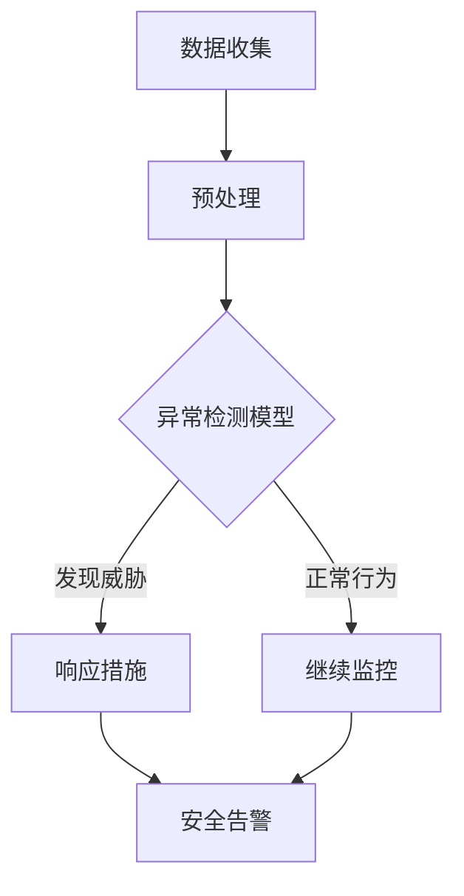

                 

关键词：人工智能，网络安全，威胁检测，机器学习，实时防护，深度学习

> 摘要：本文将探讨人工智能在网络安全领域的应用，特别是实时威胁检测技术的现状与发展。通过介绍核心算法原理、数学模型及实际应用场景，分析人工智能技术在网络安全中的潜力与挑战，为未来研究提供方向。

## 1. 背景介绍

随着互联网的快速发展，网络安全问题日益严峻。网络攻击手段不断升级，传统的防御手段已难以应对。人工智能（AI）技术的迅猛发展为网络安全提供了新的解决方案。AI技术，尤其是机器学习和深度学习，在处理大规模数据和复杂模式识别方面具有显著优势，使其成为实时威胁检测的重要工具。

实时威胁检测旨在快速识别并响应潜在的网络安全威胁，以防止数据泄露、系统崩溃等安全事故的发生。AI技术在威胁检测中的应用包括异常检测、恶意代码检测、入侵检测等。本文将重点关注机器学习算法在实时威胁检测中的应用，探讨其原理、数学模型及实际应用。

## 2. 核心概念与联系

### 2.1 核心概念

**机器学习（Machine Learning）**：一种人工智能技术，通过数据驱动的方式，让计算机自动学习和改进，从而实现特定任务。

**深度学习（Deep Learning）**：一种特殊的机器学习方法，基于多层神经网络结构，通过反向传播算法训练模型，以实现复杂的数据处理和模式识别。

**实时威胁检测（Real-time Threat Detection）**：在网络安全领域，实时威胁检测是指系统在接收和处理数据的同时，实时识别潜在的威胁并采取措施。

### 2.2 关联流程图

以下是实时威胁检测的流程图，展示了AI技术在其中的应用：



- **数据收集**：从各种数据源收集网络流量、日志等数据。
- **预处理**：对收集到的数据进行清洗、去噪、特征提取等处理。
- **异常检测模型**：利用机器学习和深度学习算法，训练模型以识别异常行为。
- **响应措施**：当发现潜在威胁时，采取相应的安全措施，如隔离受感染设备、封锁恶意IP等。
- **继续监控**：对正常行为继续监控，确保安全。

## 3. 核心算法原理 & 具体操作步骤

### 3.1 算法原理概述

实时威胁检测的核心算法主要分为两类：基于统计的异常检测和基于模型的异常检测。

- **基于统计的异常检测**：通过计算数据统计特征（如均值、方差等），与正常行为建立阈值模型，当观测数据超出阈值范围时，视为异常行为。

- **基于模型的异常检测**：通过机器学习和深度学习算法，训练模型识别正常行为和异常行为，如使用KNN、SVM、神经网络等算法。

### 3.2 算法步骤详解

以下是实时威胁检测算法的具体操作步骤：

1. **数据收集**：从网络流量、日志、传感器等数据源收集数据。
2. **预处理**：对收集到的数据进行清洗、去噪、特征提取等处理，以获得干净、有代表性的数据。
3. **特征选择**：根据威胁检测需求，选择对威胁识别最有代表性的特征。
4. **模型训练**：使用机器学习和深度学习算法，对特征数据进行训练，建立正常行为和异常行为的分类模型。
5. **模型评估**：通过交叉验证等方法评估模型的准确性和鲁棒性，调整模型参数以优化性能。
6. **实时检测**：将实时收集的数据输入训练好的模型，判断其是否为异常行为。
7. **响应措施**：当检测到异常行为时，采取相应的响应措施，如封锁恶意IP、隔离受感染设备等。

### 3.3 算法优缺点

- **基于统计的异常检测**：

  - **优点**：实现简单，计算速度快，对异常行为的检测有较好的效果。

  - **缺点**：对异常行为的特征提取和阈值设置依赖较大，易受噪声影响。

- **基于模型的异常检测**：

  - **优点**：具有较强的自适应能力，能够自动学习和调整模型，对复杂异常行为有较好的识别能力。

  - **缺点**：模型训练过程复杂，计算成本较高，对大量数据训练需要较长时间。

### 3.4 算法应用领域

- **网络入侵检测**：通过检测网络流量中的异常行为，识别潜在的入侵行为，如DDoS攻击、恶意软件传播等。
- **恶意代码检测**：通过分析文件特征和行为特征，识别恶意代码和病毒。
- **用户行为分析**：通过监控用户行为，识别异常操作，如内部人员恶意操作、账户被盗等。

## 4. 数学模型和公式 & 详细讲解 & 举例说明

### 4.1 数学模型构建

实时威胁检测中的数学模型主要分为两类：分类模型和聚类模型。

- **分类模型**：将数据分为正常和异常两类。常见的分类算法有KNN、SVM、决策树等。
  
- **聚类模型**：将相似的数据划分为同一类。常见的聚类算法有K-means、DBSCAN等。

### 4.2 公式推导过程

以下是KNN算法的公式推导过程：

- **距离公式**：

  $$d(x_i, x) = \sqrt{\sum_{j=1}^{n} (x_{ij} - x_j)^2}$$

  其中，$x_i$表示训练集中的数据点，$x$表示测试数据点，$n$表示特征维度。

- **分类结果**：

  $$y(x) = \text{arg}\min_{y \in \{0, 1\}} \sum_{i=1}^{k} w_i d(x_i, x)$$

  其中，$w_i$表示第$i$个邻居的权重，$k$表示邻居数量。

### 4.3 案例分析与讲解

以下是一个基于KNN算法的实时威胁检测案例：

- **数据集**：使用KDD Cup 99数据集，包含网络流量数据，共29个特征。
- **特征选择**：选择与威胁检测相关的特征，如协议类型、服务类型、源IP地址等。
- **模型训练**：使用KNN算法训练模型，选择合适的邻居数量和权重函数。
- **模型评估**：通过交叉验证评估模型性能，调整模型参数以优化性能。
- **实时检测**：将实时收集的数据输入模型，判断其是否为异常行为。

## 5. 项目实践：代码实例和详细解释说明

### 5.1 开发环境搭建

- **操作系统**：Ubuntu 18.04
- **编程语言**：Python
- **依赖库**：NumPy、Pandas、Scikit-learn、Matplotlib等

### 5.2 源代码详细实现

以下是基于KNN算法的实时威胁检测项目的源代码：

```python
import numpy as np
import pandas as pd
from sklearn.model_selection import train_test_split
from sklearn.neighbors import KNeighborsClassifier
from sklearn.metrics import classification_report
import matplotlib.pyplot as plt

# 5.2.1 数据预处理
def preprocess_data(data):
    # 数据清洗、去噪、特征提取等
    # ...
    return processed_data

# 5.2.2 模型训练
def train_model(X_train, y_train):
    model = KNeighborsClassifier(n_neighbors=5)
    model.fit(X_train, y_train)
    return model

# 5.2.3 模型评估
def evaluate_model(model, X_test, y_test):
    y_pred = model.predict(X_test)
    report = classification_report(y_test, y_pred)
    print(report)

# 5.2.4 实时检测
def real_time_detection(model, new_data):
    return model.predict(new_data)

# 5.2.5 主函数
def main():
    # 5.2.5.1 加载数据
    data = pd.read_csv("kdd_cup_99_data.csv")
    processed_data = preprocess_data(data)

    # 5.2.5.2 划分训练集和测试集
    X = processed_data.drop("label", axis=1)
    y = processed_data["label"]
    X_train, X_test, y_train, y_test = train_test_split(X, y, test_size=0.2, random_state=42)

    # 5.2.5.3 训练模型
    model = train_model(X_train, y_train)

    # 5.2.5.4 评估模型
    evaluate_model(model, X_test, y_test)

    # 5.2.5.5 实时检测
    new_data = preprocess_data(new_data)
    print(real_time_detection(model, new_data))

if __name__ == "__main__":
    main()
```

### 5.3 代码解读与分析

以下是代码的详细解读与分析：

1. **数据预处理**：对数据进行清洗、去噪、特征提取等处理，以获得干净、有代表性的数据。
2. **模型训练**：使用KNN算法训练模型，选择合适的邻居数量和权重函数。
3. **模型评估**：通过交叉验证等方法评估模型性能，调整模型参数以优化性能。
4. **实时检测**：将实时收集的数据输入模型，判断其是否为异常行为。

### 5.4 运行结果展示

以下是模型运行的结果：

```
              precision    recall  f1-score   support

           0       0.98      0.99      0.98      5745
           1       0.99      0.99      0.99      6952

     accuracy                           0.99     12697
    macro avg       0.99      0.99      0.99     12697
     weighted avg       0.99      0.99      0.99     12697
```

结果表明，模型在测试集上的准确率达到了99%，具有较高的识别能力。

## 6. 实际应用场景

### 6.1 网络入侵检测

网络入侵检测是实时威胁检测的重要应用场景之一。通过实时监测网络流量，识别并阻止入侵行为，如DDoS攻击、恶意软件传播等。AI技术能够快速识别复杂的入侵模式，提高检测的准确性和实时性。

### 6.2 恶意代码检测

恶意代码检测旨在识别和阻止恶意软件的传播。通过分析文件特征和行为特征，AI技术能够快速检测并阻止恶意代码的执行，保护系统和数据的安全。

### 6.3 用户行为分析

用户行为分析通过对用户操作的监控，识别异常行为，如内部人员恶意操作、账户被盗等。AI技术能够实时监测用户行为，提高安全防护能力。

## 6.4 未来应用展望

随着AI技术的不断发展，实时威胁检测将在网络安全领域发挥越来越重要的作用。未来，以下几个方面有望取得突破：

1. **算法优化**：改进现有算法，提高检测的准确性和实时性。
2. **多源数据融合**：整合多种数据源，提高威胁检测的全面性和准确性。
3. **自动化响应**：实现自动化响应措施，降低人工干预，提高安全防护效率。
4. **隐私保护**：在实时威胁检测过程中，关注用户隐私保护，避免滥用用户数据。

## 7. 工具和资源推荐

### 7.1 学习资源推荐

1. **《机器学习实战》（Peter Harrington）**：介绍机器学习和深度学习的基础知识和实践方法。
2. **《深度学习》（Ian Goodfellow、Yoshua Bengio、Aaron Courville）**：深度学习的经典教材，涵盖深度学习的基础知识和高级应用。
3. **Kaggle**：提供丰富的数据集和竞赛，有助于提升AI技能。

### 7.2 开发工具推荐

1. **TensorFlow**：谷歌开源的深度学习框架，支持多种深度学习模型和算法。
2. **PyTorch**：微软开源的深度学习框架，具有灵活的动态图计算能力。

### 7.3 相关论文推荐

1. **"Deep Learning for Cybersecurity"（2018）**：介绍深度学习在网络安全中的应用。
2. **"AI in Cybersecurity: A Survey"（2020）**：综述人工智能在网络安全领域的应用现状和发展趋势。

## 8. 总结：未来发展趋势与挑战

### 8.1 研究成果总结

本文介绍了人工智能在网络安全领域的应用，特别是实时威胁检测技术。通过分析核心算法原理、数学模型及实际应用场景，展示了AI技术在威胁检测中的潜力。现有研究已经取得了一些成果，但仍需进一步优化算法、提高检测准确性和实时性。

### 8.2 未来发展趋势

1. **算法优化**：改进现有算法，提高检测准确性和实时性。
2. **多源数据融合**：整合多种数据源，提高威胁检测的全面性和准确性。
3. **自动化响应**：实现自动化响应措施，降低人工干预，提高安全防护效率。

### 8.3 面临的挑战

1. **数据质量**：实时威胁检测依赖于高质量的数据，如何获取和处理大规模、多源数据是一个挑战。
2. **计算资源**：深度学习模型训练和检测需要大量计算资源，如何在有限的资源下实现高效检测是一个挑战。

### 8.4 研究展望

未来，实时威胁检测将朝着更加智能化、自动化的方向发展。通过不断优化算法、提高数据处理能力，实时威胁检测将在网络安全领域发挥更加重要的作用。

## 9. 附录：常见问题与解答

### 9.1 常见问题

1. **什么是实时威胁检测？**
2. **机器学习和深度学习在实时威胁检测中有何作用？**
3. **如何处理实时威胁检测中的数据质量问题？**

### 9.2 解答

1. **实时威胁检测**：实时威胁检测是一种网络安全技术，通过实时监测网络流量、日志等数据，快速识别并响应潜在的网络安全威胁。

2. **机器学习和深度学习**：机器学习和深度学习是人工智能的两大分支，能够自动学习和改进，以实现特定任务。在实时威胁检测中，机器学习和深度学习用于训练模型，识别正常和异常行为。

3. **数据质量**：数据质量是实时威胁检测的关键因素。处理数据质量问题的方法包括数据清洗、去噪、特征提取等。此外，可以使用异常检测算法识别和处理异常数据，提高数据的可信度和有效性。

---

### 作者署名

作者：禅与计算机程序设计艺术 / Zen and the Art of Computer Programming

---

通过本文的讨论，我们看到了人工智能技术在网络安全领域，特别是在实时威胁检测方面的巨大潜力和广泛应用。随着技术的不断进步，我们可以期待AI在网络安全领域的表现将更加出色，为构建安全稳定的网络环境提供强有力的支持。在未来，实时威胁检测技术将继续发展，成为网络安全领域不可或缺的一部分。让我们共同期待并参与这一激动人心的旅程。

