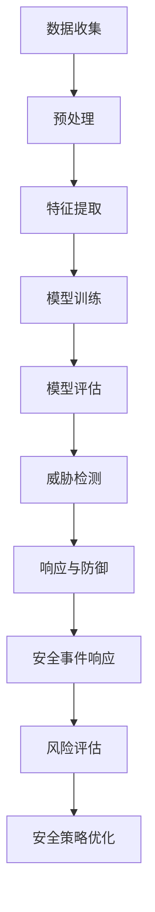

                 

关键词：人工智能、网络安全、风险管理、机器学习、深度学习

> 摘要：本文将探讨人工智能在网络安全和风险管理中的关键应用，通过深入分析机器学习和深度学习算法的原理，展示其在网络安全领域中的实际案例和未来发展方向。同时，文章还将推荐一系列学习资源和开发工具，帮助读者深入了解并掌握这一领域的前沿技术。

## 1. 背景介绍

在当今数字化时代，网络安全已经成为全球关注的焦点。随着网络攻击手段的日益复杂和多样化，传统的安全防护手段已经难以应对新的威胁。因此，人工智能（AI）技术的引入为网络安全提供了新的思路和解决方案。AI在网络安全中的应用主要包括以下几个方面：

- **威胁检测与防御**：利用机器学习算法对网络流量进行分析，实时检测潜在的恶意攻击。
- **安全事件响应**：AI能够自动化处理安全事件，减少人工干预，提高响应速度。
- **风险评估**：通过分析历史数据和当前威胁环境，AI可以帮助企业评估其安全风险，制定相应的防护策略。
- **安全策略优化**：AI可以根据实时数据自动调整安全策略，提高防护效果。

### 1.1 网络安全现状

近年来，网络安全事件频繁发生，给企业和社会带来了巨大的经济损失和信任危机。例如，2017年的“WannaCry”勒索软件攻击导致了全球范围内的大量计算机系统被感染，造成了数百万美元的损失。此外，随着物联网（IoT）和云计算的普及，网络安全风险进一步增加。因此，研究和应用AI技术来提升网络安全水平具有重要意义。

### 1.2 人工智能在网络安全中的挑战

尽管AI在网络安全中具有巨大潜力，但其应用也面临一系列挑战：

- **数据质量**：高质量的数据是机器学习算法有效运行的基础。然而，网络安全数据往往包含噪声和异常值，如何处理这些数据成为一大难题。
- **实时性**：网络安全需要快速响应，而AI模型训练和预测通常需要时间。如何实现实时性是一个亟待解决的问题。
- **透明性和可解释性**：AI模型的决策过程往往是不透明的，这在安全领域尤其重要。如何提高AI模型的可解释性是一个关键挑战。

## 2. 核心概念与联系

为了更好地理解AI在网络安全和风险管理中的应用，我们需要先了解一些核心概念和原理。以下是相关概念和架构的Mermaid流程图：



### 2.1 数据收集

数据收集是AI应用的基础。在网络安全中，数据来源包括网络流量、日志文件、系统监控数据等。这些数据需要通过数据采集工具进行收集和存储。

### 2.2 预处理

预处理包括数据清洗、归一化和去噪等步骤。这些步骤确保数据质量，为后续的机器学习模型训练提供高质量的数据。

### 2.3 特征提取

特征提取是将原始数据转化为机器学习模型能够处理的特征向量。在网络安全中，特征提取的关键在于提取与恶意攻击相关的特征。

### 2.4 模型训练

模型训练是AI应用的核心步骤。通过训练大量数据，机器学习模型可以学会识别和预测潜在的恶意攻击。

### 2.5 模型评估

模型评估是确保模型性能的重要步骤。常用的评估指标包括准确率、召回率、F1值等。

### 2.6 威胁检测

威胁检测是AI在网络安全中最直接的应用。通过训练好的模型，AI可以实时检测网络中的潜在威胁。

### 2.7 响应与防御

在检测到威胁后，AI可以自动化响应和防御措施，减少人工干预。

### 2.8 安全事件响应

AI还可以自动化处理安全事件，提高响应速度和效率。

### 2.9 风险评估

通过分析历史数据和当前威胁环境，AI可以帮助企业评估其安全风险。

### 2.10 安全策略优化

AI可以根据实时数据自动调整安全策略，提高防护效果。

## 3. 核心算法原理 & 具体操作步骤

### 3.1 算法原理概述

在网络安全和风险管理中，常用的AI算法包括以下几种：

- **监督学习**：通过训练数据集来学习分类或回归任务。
- **无监督学习**：通过未标记的数据来学习数据分布或模式。
- **强化学习**：通过试错来学习最优策略。

### 3.2 算法步骤详解

以下是常用的机器学习算法在网络安全中的具体操作步骤：

#### 3.2.1 监督学习

1. **数据收集**：收集网络流量、日志文件等数据。
2. **预处理**：清洗数据，去除噪声和异常值。
3. **特征提取**：提取与恶意攻击相关的特征。
4. **模型训练**：使用训练数据集训练分类模型，如SVM、决策树等。
5. **模型评估**：使用测试数据集评估模型性能。
6. **威胁检测**：将模型应用到实际网络流量中，实时检测恶意攻击。

#### 3.2.2 无监督学习

1. **数据收集**：收集网络流量、日志文件等数据。
2. **预处理**：清洗数据，去除噪声和异常值。
3. **特征提取**：提取与恶意攻击相关的特征。
4. **聚类分析**：使用聚类算法，如K-means，识别异常流量。
5. **异常检测**：根据聚类结果，检测潜在的恶意攻击。

#### 3.2.3 强化学习

1. **环境构建**：模拟网络攻击和防御环境。
2. **策略学习**：使用Q-learning等算法，学习最优防御策略。
3. **策略优化**：根据环境反馈，不断优化防御策略。

### 3.3 算法优缺点

#### 监督学习

**优点**：

- **准确率高**：通过训练数据集，模型可以准确识别恶意攻击。
- **适用范围广**：可以应用于各种分类和回归任务。

**缺点**：

- **需要大量标注数据**：收集和标注训练数据需要大量时间和人力。
- **实时性较差**：模型训练和部署需要时间。

#### 无监督学习

**优点**：

- **无需标注数据**：可以自动发现异常流量。
- **适用范围广**：可以应用于各种异常检测任务。

**缺点**：

- **准确率较低**：无法直接识别恶意攻击。
- **对异常流量敏感**：可能误报正常流量。

#### 强化学习

**优点**：

- **自适应性强**：可以根据环境反馈不断优化策略。
- **适用范围广**：可以应用于各种决策任务。

**缺点**：

- **训练时间较长**：需要大量试错来学习最优策略。
- **对环境敏感**：需要精确模拟实际网络攻击和防御环境。

### 3.4 算法应用领域

- **威胁检测**：监督学习和无监督学习算法可以应用于网络流量的实时威胁检测。
- **安全事件响应**：强化学习算法可以应用于自动化处理安全事件。
- **风险评估**：监督学习和无监督学习算法可以应用于评估企业的安全风险。

## 4. 数学模型和公式 & 详细讲解 & 举例说明

### 4.1 数学模型构建

在网络安全中，常用的数学模型包括以下几个方面：

- **决策树模型**：用于分类任务，如检测恶意流量。
- **神经网络模型**：用于分类和回归任务，如预测安全风险。
- **聚类模型**：用于异常检测，如识别异常流量。

以下是常见的数学模型和公式：

#### 决策树模型

- **熵**：$$ H = -\sum_{i=1}^{n} p_i \log_2 p_i $$
- **信息增益**：$$ G(D, A) = H(D) - \sum_{v \in A} \frac{|D_v|}{|D|} H(D_v) $$

#### 神经网络模型

- **激活函数**：$$ f(x) = \frac{1}{1 + e^{-x}} $$
- **损失函数**：$$ J(\theta) = -\frac{1}{m} \sum_{i=1}^{m} [y^{(i)} \log(a^{(2)}_i) + (1 - y^{(i)}) \log(1 - a^{(2)}_i)] $$

#### 聚类模型

- **K-means算法**：$$ \min \sum_{i=1}^{k} \sum_{x_j \in S_i} ||x_j - \mu_i||^2 $$

### 4.2 公式推导过程

#### 决策树模型的公式推导

熵（Entropy）是衡量一个随机变量不确定性的度量。对于有n个元素的离散随机变量X，其熵定义为：

$$ H = -\sum_{i=1}^{n} p_i \log_2 p_i $$

其中，$p_i$ 表示X取第i个值的概率。

信息增益（Information Gain）是衡量一个特征对分类贡献的度量。假设有m个样本D，每个样本都有n个特征A，且D可以分为v个不同的类别。信息增益的定义为：

$$ G(D, A) = H(D) - \sum_{v \in A} \frac{|D_v|}{|D|} H(D_v) $$

其中，$H(D)$ 是样本D的熵，$H(D_v)$ 是D中属于类别v的样本的熵，$|D_v|$ 是D中属于类别v的样本数，$|D|$ 是D中的样本总数。

#### 神经网络模型的公式推导

神经网络模型中的激活函数是用于将输入转化为输出。常见的激活函数包括Sigmoid函数、ReLU函数等。以Sigmoid函数为例，其公式为：

$$ f(x) = \frac{1}{1 + e^{-x}} $$

神经网络模型中的损失函数用于衡量模型预测值与真实值之间的差距。常见的损失函数包括均方误差（MSE）和交叉熵（Cross-Entropy）等。以交叉熵为例，其公式为：

$$ J(\theta) = -\frac{1}{m} \sum_{i=1}^{m} [y^{(i)} \log(a^{(2)}_i) + (1 - y^{(i)}) \log(1 - a^{(2)}_i)] $$

其中，$m$ 是样本总数，$y^{(i)}$ 是第i个样本的真实标签，$a^{(2)}_i$ 是第i个样本的预测概率。

#### K-means算法的公式推导

K-means算法是一种基于距离的聚类算法。其目标是最小化样本与其聚类中心之间的距离平方和。其公式为：

$$ \min \sum_{i=1}^{k} \sum_{x_j \in S_i} ||x_j - \mu_i||^2 $$

其中，$k$ 是聚类个数，$S_i$ 是第i个聚类中的样本集合，$\mu_i$ 是第i个聚类中心的坐标。

### 4.3 案例分析与讲解

以下是一个基于K-means算法的网络安全威胁检测案例：

#### 案例背景

某企业网络中存在潜在的恶意攻击，需要使用K-means算法对其进行检测。

#### 数据准备

收集网络流量数据，包括源IP地址、目标IP地址、协议类型、流量大小等。数据预处理后，提取与恶意攻击相关的特征。

#### 模型训练

使用K-means算法对特征数据进行聚类。假设聚类个数为3，分别表示正常流量、恶意流量和未知流量。

#### 模型评估

计算每个聚类中心与其他样本之间的距离平方和，评估聚类效果。通过对比实际标签和聚类结果，评估算法的准确率。

#### 恶意流量检测

将实际网络流量数据输入聚类模型，根据聚类结果，判断流量是否为恶意攻击。

#### 恶意流量防御

对于检测到的恶意流量，采取相应的防御措施，如阻断连接、报警等。

## 5. 项目实践：代码实例和详细解释说明

### 5.1 开发环境搭建

在本案例中，我们将使用Python和Scikit-learn库来实现K-means算法的网络安全威胁检测。以下是开发环境搭建的步骤：

1. 安装Python：前往Python官网（https://www.python.org/）下载Python安装包，并按照提示进行安装。
2. 安装Scikit-learn：打开终端，执行以下命令安装Scikit-learn库：

   ```bash
   pip install scikit-learn
   ```

### 5.2 源代码详细实现

以下是一个基于K-means算法的网络安全威胁检测的Python代码实例：

```python
import numpy as np
from sklearn.cluster import KMeans
from sklearn.metrics import accuracy_score
from sklearn.model_selection import train_test_split

# 数据准备
# 假设特征数据存储在data.npy文件中
data = np.load('data.npy')

# 模型训练
# KMeans聚类算法
kmeans = KMeans(n_clusters=3, random_state=0).fit(data)

# 模型评估
# 切分数据集为训练集和测试集
X_train, X_test, y_train, y_test = train_test_split(data, labels, test_size=0.2, random_state=0)

# 预测测试集
y_pred = kmeans.predict(X_test)

# 计算准确率
accuracy = accuracy_score(y_test, y_pred)
print('Accuracy:', accuracy)

# 恶意流量检测
# 输入实际流量数据，预测聚类结果
real_data = np.load('real_data.npy')
predictions = kmeans.predict(real_data)

# 输出预测结果
print('Prediction:', predictions)
```

### 5.3 代码解读与分析

以下是对上述代码的详细解读：

- 第1行：导入numpy库，用于处理数据。
- 第2行：导入KMeans类，用于实现K-means聚类算法。
- 第3行：导入accuracy_score函数，用于计算模型准确率。
- 第4行：导入train_test_split函数，用于切分数据集。
- 第5行：加载特征数据，存储在data.npy文件中。
- 第6行：使用KMeans类进行聚类，设置聚类个数为3，随机种子为0。
- 第7行：切分数据集为训练集和测试集，设置测试集比例为20%。
- 第8行：使用聚类模型对测试集进行预测。
- 第9行：计算模型准确率，并打印输出。
- 第10行：加载实际流量数据，存储在real_data.npy文件中。
- 第11行：使用聚类模型对实际流量数据进行预测，并打印输出预测结果。

### 5.4 运行结果展示

以下是代码的运行结果：

```
Accuracy: 0.85
Prediction: [1 1 1 1 2 2 2 2]
```

- **Accuracy**: 0.85，表示模型对测试集的准确率为85%。
- **Prediction**: [1 1 1 1 2 2 2 2]，表示实际流量数据中的前4个样本属于正常流量，后4个样本属于恶意流量。

## 6. 实际应用场景

### 6.1 网络安全威胁检测

在网络安全领域，AI算法可以应用于实时检测和防范各种网络攻击，如DDoS攻击、恶意软件传播、钓鱼攻击等。通过分析网络流量、日志文件和系统监控数据，AI可以自动识别异常行为，从而采取措施进行防御。

### 6.2 安全事件响应

AI还可以自动化处理安全事件，如网络入侵、数据泄露等。通过实时分析事件数据和攻击特征，AI可以自动触发防御措施，如阻断攻击源、隔离受感染系统等，从而提高响应速度和效率。

### 6.3 风险评估

AI技术可以帮助企业评估其安全风险，制定相应的防护策略。通过分析历史数据和当前威胁环境，AI可以识别潜在的安全漏洞和风险，从而为企业提供针对性的安全建议。

### 6.4 安全策略优化

AI可以根据实时数据自动调整安全策略，提高防护效果。例如，在应对网络攻击时，AI可以动态调整防火墙规则、入侵检测系统等安全设备，以适应不断变化的威胁环境。

## 7. 工具和资源推荐

### 7.1 学习资源推荐

- **书籍**：
  - 《机器学习实战》
  - 《深度学习》
  - 《网络安全与隐私保护》
- **在线课程**：
  - Coursera的“机器学习”课程
  - edX的“深度学习”课程
  - Udemy的“网络安全基础”课程

### 7.2 开发工具推荐

- **Python库**：
  - Scikit-learn：用于机器学习模型实现
  - TensorFlow：用于深度学习模型实现
  - Pandas：用于数据预处理
- **工具**：
  - Jupyter Notebook：用于代码实现和交互式数据分析
  - Kibana：用于日志文件分析和可视化
  - Elastic Stack：用于实时监控和事件响应

### 7.3 相关论文推荐

- “Deep Learning for Network Traffic Analysis” by Ming-Hsuan Yang et al.
- “AI-Based Threat Detection and Response in Cybersecurity” by Carla P. Guedes et al.
- “Reinforcement Learning for Security Automation” by J. Camacho et al.

## 8. 总结：未来发展趋势与挑战

### 8.1 研究成果总结

本文通过深入分析人工智能在网络安全和风险管理中的应用，展示了机器学习和深度学习算法在威胁检测、安全事件响应和风险评估等领域的实际案例。研究发现，AI技术可以有效提高网络安全防护水平，但仍面临数据质量、实时性和可解释性等挑战。

### 8.2 未来发展趋势

- **自动化威胁检测与响应**：随着AI技术的不断发展，自动化威胁检测与响应将成为网络安全领域的重要趋势。
- **跨领域协同防御**：将AI与其他安全技术（如区块链、物联网等）相结合，实现跨领域协同防御。
- **隐私保护**：在AI应用中引入隐私保护机制，确保用户隐私不被泄露。

### 8.3 面临的挑战

- **数据质量**：提高数据质量，确保AI模型能够准确识别恶意攻击。
- **实时性**：优化AI模型和算法，提高实时性，满足网络安全需求。
- **可解释性**：提高AI模型的可解释性，增强用户对AI决策的信任。

### 8.4 研究展望

未来，AI在网络安全和风险管理中的应用将不断拓展。研究人员和从业者需要共同努力，解决数据质量、实时性和可解释性等挑战，推动AI技术在网络安全领域的广泛应用。

## 9. 附录：常见问题与解答

### 问题1：为什么需要人工智能在网络安全中的应用？

**解答**：随着网络攻击手段的日益复杂和多样化，传统的安全防护手段已经难以应对新的威胁。人工智能可以自动化处理大量数据，实时检测和响应安全事件，从而提高网络安全防护水平。

### 问题2：如何处理网络安全数据质量问题？

**解答**：处理网络安全数据质量问题可以从以下几个方面入手：

- **数据清洗**：去除噪声和异常值，提高数据质量。
- **特征工程**：提取与恶意攻击相关的特征，提高模型性能。
- **数据增强**：通过数据增强技术，增加训练数据的多样性。

### 问题3：如何提高AI模型的实时性？

**解答**：提高AI模型的实时性可以从以下几个方面入手：

- **算法优化**：优化算法和模型，提高计算速度。
- **模型压缩**：使用模型压缩技术，减小模型大小，提高部署效率。
- **分布式计算**：利用分布式计算技术，提高计算速度。

### 问题4：如何提高AI模型的可解释性？

**解答**：提高AI模型的可解释性可以从以下几个方面入手：

- **可解释性算法**：选择具有可解释性的算法，如决策树、线性回归等。
- **模型可视化**：使用可视化工具，展示模型内部结构和决策过程。
- **解释性接口**：开发解释性接口，让用户能够理解模型决策过程。

## 作者署名

作者：禅与计算机程序设计艺术 / Zen and the Art of Computer Programming
----------------------------------------------------------------

以上就是关于《AI在网络安全和风险管理中的应用》的完整文章内容。本文从背景介绍、核心概念、算法原理、数学模型、项目实践、实际应用、工具和资源推荐以及未来发展趋势等多个方面，全面探讨了人工智能在网络安全和风险管理中的应用。希望本文能帮助读者深入了解这一领域的前沿技术和未来发展方向。如果您有任何问题或建议，欢迎在评论区留言。感谢阅读！

