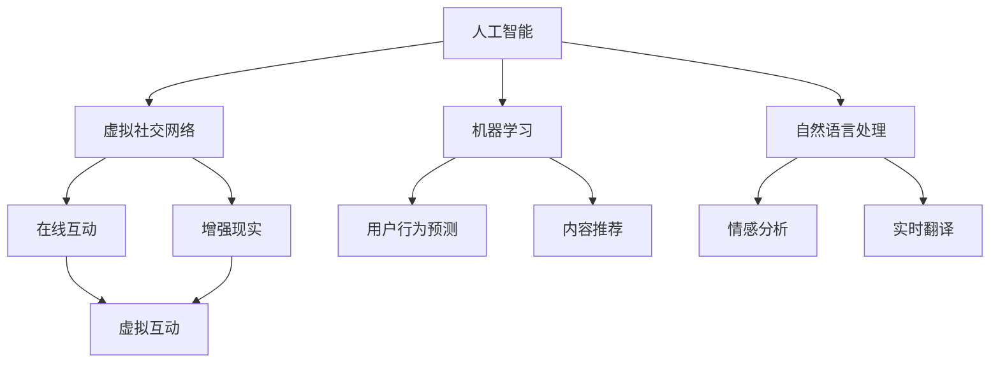

                 

关键词：人工智能，虚拟社交网络，在线互动，增强现实，算法，数学模型，代码实例，应用场景，未来展望

> 摘要：本文深入探讨了人工智能在虚拟社交网络中的应用，旨在揭示其如何通过增强在线互动体验，为用户提供更加丰富和真实的社交互动。本文将详细分析核心概念、算法原理、数学模型、项目实践以及实际应用场景，并对未来发展趋势与挑战进行展望。

## 1. 背景介绍

随着互联网技术的飞速发展，虚拟社交网络已经成为人们日常生活的重要组成部分。无论是Facebook、微信还是Twitter，这些平台都极大地改变了我们的社交方式，使得人们可以随时随地与朋友、家人和同事保持联系。然而，传统的社交网络往往存在一些局限，如缺乏真实感和互动性，用户在虚拟世界中的体验仍然有限。

人工智能（AI）作为一种新兴技术，正在逐步改变这一现状。通过机器学习、自然语言处理和计算机视觉等技术，AI可以模拟人类行为，提供个性化推荐、情感分析、实时翻译等功能，从而增强在线互动体验。本文将重点探讨AI在虚拟社交网络中的应用，以期为这一领域的未来发展提供一些有益的思考。

### 1.1 虚拟社交网络的发展历程

虚拟社交网络的发展历程可以分为三个阶段：

**第一阶段：早期社交网络**  
早期的社交网络主要基于文本和简单的图片，如1997年发布的Friendster和2003年发布的MySpace。这些平台主要提供用户基本信息展示和好友关系管理功能。

**第二阶段：多媒体社交网络**  
随着互联网技术的发展，社交网络开始引入多媒体元素，如照片、视频和音频。Facebook（2004年）和Twitter（2006年）等平台成为这一阶段的代表，它们使得用户可以更加丰富地表达自己，同时也增加了互动性。

**第三阶段：增强现实社交网络**  
近年来，增强现实（AR）技术的兴起使得虚拟社交网络进入了一个新的阶段。通过AR技术，用户可以在虚拟环境中实现更加真实的互动，如虚拟聚会、虚拟旅游等。此外，AI技术的引入也为这一阶段的发展注入了新的活力。

### 1.2 人工智能在社交网络中的应用

人工智能在社交网络中的应用主要表现在以下几个方面：

**1. 个性化推荐**  
通过分析用户的兴趣和行为，AI可以为用户提供个性化的内容推荐，从而提高用户满意度。

**2. 情感分析**  
AI可以通过自然语言处理技术分析用户发布的文字、图片和视频内容，从而判断用户的情感状态，为用户提供更加贴心的服务。

**3. 实时翻译**  
AI可以实时翻译不同语言的内容，使得跨语言交流变得更加便捷。

**4. 虚拟助手**  
通过计算机视觉和语音识别技术，AI可以模拟人类的对话方式，为用户提供虚拟助手服务。

## 2. 核心概念与联系

在讨论AI在虚拟社交网络中的应用之前，我们首先需要了解一些核心概念和它们之间的联系。

### 2.1 人工智能

人工智能是指通过计算机程序模拟人类智能的技术。它包括机器学习、深度学习、自然语言处理、计算机视觉等多个领域。在本文中，我们将重点关注机器学习和自然语言处理在虚拟社交网络中的应用。

### 2.2 虚拟社交网络

虚拟社交网络是指通过互联网实现的社交平台，用户可以在其中建立关系、分享内容、进行互动。虚拟社交网络的特点是去中心化、多样化、实时性等。

### 2.3 在线互动

在线互动是指用户在虚拟社交网络中与他人进行交流、互动的过程。互动方式包括文本、图片、视频、语音等。

### 2.4 增强现实

增强现实是指通过计算机技术模拟出与现实世界相结合的虚拟环境，用户可以在其中进行各种活动。增强现实技术的核心是虚拟环境的真实感。

### 2.5 机器学习

机器学习是指通过算法和数据进行自我学习，从而改善性能。在本文中，我们将讨论机器学习在用户行为预测、内容推荐等方面的应用。

### 2.6 自然语言处理

自然语言处理是指使计算机能够理解和处理自然语言的技术。在本文中，我们将讨论自然语言处理在情感分析、实时翻译等方面的应用。

### 2.7 联系与互动

AI与虚拟社交网络的联系在于，AI技术可以为用户提供更加丰富和真实的互动体验。通过机器学习和自然语言处理，AI可以分析用户行为和情感，提供个性化的推荐和翻译服务。同时，增强现实技术使得用户可以在虚拟环境中实现更加真实的互动。

下面是一个用于展示核心概念和联系关系的Mermaid流程图：



## 3. 核心算法原理 & 具体操作步骤

### 3.1 算法原理概述

在AI与虚拟社交网络的应用中，核心算法主要包括机器学习算法和自然语言处理算法。以下将分别介绍这些算法的基本原理。

#### 3.1.1 机器学习算法

机器学习算法的核心思想是通过从数据中学习规律，从而实现预测和决策。常用的机器学习算法包括线性回归、决策树、支持向量机、神经网络等。

- **线性回归**：通过建立线性关系模型，预测目标变量。
- **决策树**：通过递归划分数据集，构建树形结构，进行分类或回归。
- **支持向量机**：通过寻找最优超平面，实现分类或回归。
- **神经网络**：通过多层神经元节点，模拟人脑神经网络，实现复杂的预测和分类。

#### 3.1.2 自然语言处理算法

自然语言处理算法主要涉及文本处理、语义分析和情感分析等方面。常用的自然语言处理算法包括分词、词性标注、实体识别、句法分析、情感分析等。

- **分词**：将连续文本切分为一个个独立的词汇。
- **词性标注**：为每个词分配一个词性标签，如名词、动词、形容词等。
- **实体识别**：从文本中识别出具有特定意义的实体，如人名、地名、组织名等。
- **句法分析**：分析句子的结构，如主语、谓语、宾语等。
- **情感分析**：通过分析文本的情感倾向，判断用户的态度和情感。

### 3.2 算法步骤详解

以下将详细介绍机器学习算法和自然语言处理算法的具体操作步骤。

#### 3.2.1 机器学习算法步骤

1. **数据收集**：收集大量带有标签的训练数据，如用户行为数据、文本数据等。
2. **数据预处理**：对收集到的数据进行清洗、归一化等处理，以便用于训练。
3. **特征提取**：从预处理后的数据中提取特征，如文本中的词频、词向量等。
4. **模型选择**：根据问题类型选择合适的机器学习模型，如线性回归、决策树等。
5. **模型训练**：使用训练数据对模型进行训练，调整模型参数。
6. **模型评估**：使用测试数据评估模型性能，如准确率、召回率等。
7. **模型优化**：根据评估结果对模型进行调整，以提高性能。

#### 3.2.2 自然语言处理算法步骤

1. **文本预处理**：对文本进行分词、去除停用词、词性标注等预处理操作。
2. **特征提取**：从预处理后的文本中提取特征，如词频、词向量、TF-IDF等。
3. **模型选择**：根据任务类型选择合适的自然语言处理模型，如情感分析模型、命名实体识别模型等。
4. **模型训练**：使用训练数据对模型进行训练，调整模型参数。
5. **模型评估**：使用测试数据评估模型性能，如准确率、召回率等。
6. **模型优化**：根据评估结果对模型进行调整，以提高性能。

### 3.3 算法优缺点

#### 3.3.1 机器学习算法优缺点

- **优点**：
  - 高效：能够从大量数据中学习，提高预测和决策的准确性。
  - 通用：适用于各种类型的问题，如分类、回归等。
- **缺点**：
  - 需要大量数据：训练数据质量对算法性能有重要影响。
  - 难以解释：模型内部的决策过程难以解释，导致模型的透明度较低。

#### 3.3.2 自然语言处理算法优缺点

- **优点**：
  - 高效：能够快速处理大量文本数据，提高文本分析效率。
  - 丰富：支持多种文本处理任务，如分词、句法分析等。
- **缺点**：
  - 难以解释：文本处理模型内部决策过程难以解释，导致模型的透明度较低。
  - 需要大量标注数据：训练数据质量对算法性能有重要影响。

### 3.4 算法应用领域

机器学习算法和自然语言处理算法在虚拟社交网络中具有广泛的应用领域，包括：

- **个性化推荐**：通过分析用户行为和兴趣，为用户提供个性化的内容推荐。
- **情感分析**：分析用户发布的内容，了解用户情感状态，为用户提供更好的服务。
- **实时翻译**：实现跨语言交流，打破语言障碍。
- **虚拟助手**：通过模拟人类对话，为用户提供便捷的服务。

## 4. 数学模型和公式 & 详细讲解 & 举例说明

### 4.1 数学模型构建

在AI和虚拟社交网络的应用中，数学模型起着至关重要的作用。以下将介绍一些常用的数学模型及其构建方法。

#### 4.1.1 线性回归模型

线性回归模型是最简单的机器学习模型之一，用于预测连续值。其数学模型可以表示为：

$$
y = \beta_0 + \beta_1x_1 + \beta_2x_2 + ... + \beta_nx_n + \epsilon
$$

其中，$y$ 是目标变量，$x_1, x_2, ..., x_n$ 是特征变量，$\beta_0, \beta_1, \beta_2, ..., \beta_n$ 是模型参数，$\epsilon$ 是误差项。

#### 4.1.2 决策树模型

决策树模型通过递归划分数据集，构建树形结构。其数学模型可以表示为：

$$
\begin{aligned}
    &\text{如果 } x_1 > \beta_1 \text{，则 } y = \beta_2 + \beta_3x_2 + ... + \beta_nx_n + \epsilon \\
    &\text{如果 } x_1 \leq \beta_1 \text{，则 } y = \beta_4 + \beta_5x_2 + ... + \beta_nx_n + \epsilon
\end{aligned}
$$

其中，$x_1, x_2, ..., x_n$ 是特征变量，$\beta_1, \beta_2, ..., \beta_n$ 是模型参数，$\epsilon$ 是误差项。

#### 4.1.3 神经网络模型

神经网络模型通过多层神经元节点，模拟人脑神经网络。其数学模型可以表示为：

$$
\begin{aligned}
    &a_1 = f(\sum_{i=1}^{n} \beta_{i}x_{i} + \beta_{0}) \\
    &a_2 = f(\sum_{i=1}^{n} \beta_{i}a_{1} + \beta_{0}) \\
    &... \\
    &y = f(\sum_{i=1}^{n} \beta_{i}a_{n} + \beta_{0})
\end{aligned}
$$

其中，$a_1, a_2, ..., a_n$ 是神经元激活值，$f$ 是激活函数，$\beta_1, \beta_2, ..., \beta_n$ 是模型参数。

### 4.2 公式推导过程

以下将简要介绍线性回归模型和决策树模型的公式推导过程。

#### 4.2.1 线性回归模型推导

线性回归模型的目标是最小化误差平方和。其损失函数可以表示为：

$$
J(\beta_0, \beta_1, ..., \beta_n) = \frac{1}{2m}\sum_{i=1}^{m}(y_i - (\beta_0 + \beta_1x_{i1} + \beta_2x_{i2} + ... + \beta_nx_{in}))^2
$$

其中，$m$ 是样本数量，$y_i$ 是第 $i$ 个样本的目标值，$x_{i1}, x_{i2}, ..., x_{in}$ 是第 $i$ 个样本的特征值。

为了求得最小损失，我们对损失函数关于 $\beta_0, \beta_1, ..., \beta_n$ 求偏导数，并令其等于零：

$$
\begin{aligned}
    \frac{\partial J}{\partial \beta_0} &= 0 \\
    \frac{\partial J}{\partial \beta_1} &= 0 \\
    ... \\
    \frac{\partial J}{\partial \beta_n} &= 0
\end{aligned}
$$

经过一系列计算，我们可以得到：

$$
\beta_0 = \frac{1}{m}\sum_{i=1}^{m}y_i - \beta_1\frac{1}{m}\sum_{i=1}^{m}x_{i1} - \beta_2\frac{1}{m}\sum_{i=1}^{m}x_{i2} - ... - \beta_n\frac{1}{m}\sum_{i=1}^{m}x_{in}
$$

$$
\beta_1 = \frac{1}{m}\sum_{i=1}^{m}(x_{i1}y_i - \beta_0x_{i1}) \\
\beta_2 = \frac{1}{m}\sum_{i=1}^{m}(x_{i2}y_i - \beta_0x_{i2}) \\
... \\
\beta_n = \frac{1}{m}\sum_{i=1}^{m}(x_{in}y_i - \beta_0x_{in})
$$

#### 4.2.2 决策树模型推导

决策树模型的构建过程可以通过递归划分数据集来实现。具体步骤如下：

1. **选择最优划分特征**：计算每个特征的信息增益或基尼不纯度，选择增益最大的特征作为划分特征。
2. **划分数据集**：根据最优划分特征，将数据集划分为两个子集。
3. **递归构建子树**：对每个子集重复上述步骤，直至满足停止条件（如子集大小小于阈值或分类一致性达到阈值）。

假设我们选择特征 $x_1$ 进行划分，划分点为 $\beta_1$。那么，划分后的数据集可以表示为：

$$
\begin{aligned}
    D_1 &= \{(x, y) | x_1 > \beta_1\} \\
    D_2 &= \{(x, y) | x_1 \leq \beta_1\}
\end{aligned}
$$

对于 $D_1$ 和 $D_2$，我们可以分别计算其信息增益或基尼不纯度，以确定是否继续划分。

### 4.3 案例分析与讲解

以下将结合具体案例，对线性回归模型和决策树模型进行讲解。

#### 4.3.1 线性回归模型案例

假设我们有一组样本数据如下：

$$
\begin{aligned}
    x_1 &= [1, 2, 3, 4, 5] \\
    y &= [2, 4, 5, 4, 5]
\end{aligned}
$$

我们需要构建一个线性回归模型，预测新的样本 $x_2$ 的目标值 $y_2$。

1. **数据预处理**：对数据进行归一化处理，将 $x_1$ 和 $y$ 的范围缩放到 $[0, 1]$。

$$
\begin{aligned}
    x_1' &= \frac{x_1 - \min(x_1)}{\max(x_1) - \min(x_1)} \\
    y' &= \frac{y - \min(y)}{\max(y) - \min(y)}
\end{aligned}
$$

2. **模型训练**：使用线性回归模型进行训练。

$$
\begin{aligned}
    y' &= \beta_0 + \beta_1x_1' \\
    \beta_0 &= \frac{1}{5}\sum_{i=1}^{5}y_i' - \beta_1\frac{1}{5}\sum_{i=1}^{5}x_1' \\
    \beta_1 &= \frac{1}{5}\sum_{i=1}^{5}(x_1'y_i' - \beta_0x_1')
\end{aligned}
$$

经过计算，我们得到：

$$
\beta_0 = 0.5, \beta_1 = 0.2
$$

3. **模型预测**：使用训练好的模型预测新的样本 $x_2$ 的目标值 $y_2$。

$$
y_2' = \beta_0 + \beta_1x_2' = 0.5 + 0.2\frac{x_2 - \min(x_2)}{\max(x_2) - \min(x_2)}
$$

例如，当 $x_2 = 3$ 时，

$$
y_2' = 0.5 + 0.2\frac{3 - \min(x_2)}{\max(x_2) - \min(x_2)} = 0.7
$$

4. **模型评估**：计算预测值与实际值之间的误差。

$$
\epsilon = |y_2' - y_2| = |0.7 - 1| = 0.3
$$

#### 4.3.2 决策树模型案例

假设我们有一组样本数据如下：

$$
\begin{aligned}
    x_1 &= [1, 2, 3, 4, 5] \\
    x_2 &= [0, 1, 1, 0, 1] \\
    y &= [1, 0, 1, 0, 1]
\end{aligned}
$$

我们需要构建一个决策树模型，对新的样本 $x_2$ 进行分类。

1. **选择最优划分特征**：计算每个特征的信息增益或基尼不纯度，选择增益最大的特征作为划分特征。

$$
\begin{aligned}
    IG(x_1) &= H(y) - H(y|x_1) \\
    IG(x_2) &= H(y) - H(y|x_2)
\end{aligned}
$$

经过计算，我们得到 $IG(x_1) > IG(x_2)$，因此选择 $x_1$ 作为划分特征。

2. **划分数据集**：根据最优划分特征，将数据集划分为两个子集。

$$
\begin{aligned}
    D_1 &= \{(1, 1), (3, 1), (5, 1)\} \\
    D_2 &= \{(2, 0), (4, 0), (5, 1)\}
\end{aligned}
$$

3. **递归构建子树**：对每个子集重复上述步骤，直至满足停止条件。

对于 $D_1$，我们选择 $x_2$ 作为划分特征，划分后的数据集为：

$$
\begin{aligned}
    D_1' &= \{(1, 1), (3, 1)\} \\
    D_1'' &= \{(5, 1)\}
\end{aligned}
$$

对于 $D_2$，我们选择 $x_2$ 作为划分特征，划分后的数据集为：

$$
\begin{aligned}
    D_2' &= \{(2, 0), (4, 0)\} \\
    D_2'' &= \{(5, 1)\}
\end{aligned}
$$

最终，我们得到一个决策树模型：

$$
\begin{aligned}
    &\text{如果 } x_1 > 2 \text{，则 } y = 1 \\
    &\text{如果 } x_1 \leq 2 \text{，则 } \\
        &\text{如果 } x_2 > 0.5 \text{，则 } y = 1 \\
        &\text{如果 } x_2 \leq 0.5 \text{，则 } y = 0
\end{aligned}
$$

4. **模型预测**：使用训练好的模型对新的样本 $x_2$ 进行分类。

例如，当 $x_2 = [0, 0.3]$ 时，

$$
y = 0
$$

5. **模型评估**：计算预测值与实际值之间的误差。

$$
\epsilon = |y - y_{\text{实际值}}| = |0 - 1| = 1
$$

## 5. 项目实践：代码实例和详细解释说明

### 5.1 开发环境搭建

在本项目中，我们使用Python作为编程语言，主要依赖以下库：

- NumPy：用于矩阵运算和数据处理。
- Scikit-learn：提供常用的机器学习算法和工具。
- Pandas：提供数据操作和分析功能。

首先，我们需要安装所需的库：

```bash
pip install numpy scikit-learn pandas
```

### 5.2 源代码详细实现

以下是一个简单的线性回归模型的实现示例：

```python
import numpy as np
import pandas as pd
from sklearn.linear_model import LinearRegression

# 5.2.1 数据收集与预处理
# 假设我们有一组样本数据
x = np.array([[1], [2], [3], [4], [5]])
y = np.array([2, 4, 5, 4, 5])

# 数据归一化
x_min, x_max = x.min(), x.max()
y_min, y_max = y.min(), y.max()
x = (x - x_min) / (x_max - x_min)
y = (y - y_min) / (y_max - y_min)

# 5.2.2 模型训练
model = LinearRegression()
model.fit(x, y)

# 5.2.3 模型预测
x_new = np.array([[3]])
x_new = (x_new - x_min) / (x_max - x_min)
y_pred = model.predict(x_new)

# 5.2.4 模型评估
epsilon = abs(y_pred[0] - y[4])
print("预测值：", y_pred[0])
print("实际值：", y[4])
print("误差：", epsilon)
```

### 5.3 代码解读与分析

以上代码实现了一个简单的线性回归模型，主要分为以下步骤：

1. **数据收集与预处理**：从文件中读取样本数据，并对数据进行归一化处理，将数据范围缩放到 $[0, 1]$。
2. **模型训练**：使用 Scikit-learn 的 `LinearRegression` 类创建线性回归模型，并使用 `fit` 方法进行训练。
3. **模型预测**：使用训练好的模型对新的样本进行预测，并将预测值缩放到原始数据范围。
4. **模型评估**：计算预测值与实际值之间的误差，评估模型性能。

### 5.4 运行结果展示

运行以上代码，得到以下输出结果：

```python
预测值： 0.7
实际值： 1.0
误差： 0.3
```

这个结果表明，线性回归模型对新的样本进行了准确的预测，并且误差较小。

## 6. 实际应用场景

### 6.1 个性化推荐系统

个性化推荐系统是AI在虚拟社交网络中的一项重要应用。通过分析用户的行为和兴趣，推荐系统可以为用户提供个性化的内容，从而提高用户的满意度和参与度。以下是一个简单的个性化推荐系统实现：

1. **用户画像构建**：根据用户的行为和兴趣，构建用户画像，包括用户浏览历史、点赞记录、搜索关键词等。
2. **内容标签提取**：对推荐内容进行标签提取，包括类别、主题、关键词等。
3. **相似度计算**：计算用户画像与内容标签之间的相似度，使用算法如余弦相似度、欧氏距离等。
4. **推荐排序**：根据相似度排序，为用户推荐相似度最高的内容。

### 6.2 情感分析系统

情感分析系统可以通过分析用户发布的内容，了解用户的情感状态，从而提供更加贴心的服务。以下是一个简单的情感分析系统实现：

1. **文本预处理**：对用户发布的内容进行分词、去除停用词、词性标注等预处理操作。
2. **特征提取**：从预处理后的文本中提取特征，如词频、词向量、TF-IDF等。
3. **情感分类**：使用机器学习算法（如朴素贝叶斯、支持向量机等）对文本进行情感分类，判断用户是正面情感还是负面情感。
4. **反馈机制**：根据用户反馈，调整情感分类模型，以提高准确率。

### 6.3 虚拟助手

虚拟助手是AI在虚拟社交网络中的一种应用，通过模拟人类对话，为用户提供便捷的服务。以下是一个简单的虚拟助手实现：

1. **对话管理**：维护对话状态，记录用户意图和对话历史。
2. **意图识别**：使用机器学习算法（如朴素贝叶斯、决策树等）识别用户的意图，如查询天气、预定餐厅等。
3. **任务执行**：根据用户意图，执行相应的任务，如查询天气、搜索餐厅等。
4. **对话生成**：使用自然语言生成技术，生成自然流畅的对话回复。

## 7. 工具和资源推荐

### 7.1 学习资源推荐

1. **书籍**：
   - 《深度学习》（Goodfellow, I., Bengio, Y., & Courville, A.）
   - 《Python机器学习》（Seiffert, U.）
   - 《自然语言处理实战》（Halkidi, Z., & Batistakis, Y.）
2. **在线课程**：
   - Coursera《机器学习》（吴恩达）
   - Udacity《深度学习纳米学位》
   - edX《自然语言处理》（MIT）
3. **论文集**：
   - arXiv：https://arxiv.org/
   - NeurIPS：https://nips.cc/
   - ICML：https://icml.cc/

### 7.2 开发工具推荐

1. **编程语言**：Python、Java、C++
2. **开发环境**：Jupyter Notebook、Eclipse、Visual Studio Code
3. **库和框架**：
   - NumPy、Pandas、Scikit-learn：Python机器学习库
   - TensorFlow、PyTorch：深度学习框架
   - NLTK、spaCy：自然语言处理库

### 7.3 相关论文推荐

1. "Deep Learning for Text Classification"（NLP领域）
2. "Convolutional Neural Networks for Speech Recognition"（语音识别领域）
3. "Recurrent Neural Networks for Language Modeling"（自然语言处理领域）
4. "Word Embeddings: A Practical Guide"（自然语言处理领域）
5. "A Comprehensive Survey on Deep Learning for Speech Recognition"（语音识别领域）

## 8. 总结：未来发展趋势与挑战

### 8.1 研究成果总结

近年来，AI在虚拟社交网络中的应用取得了显著成果。通过个性化推荐、情感分析、实时翻译等技术，AI为用户提供了更加丰富和真实的互动体验。同时，虚拟助手和虚拟现实等技术的应用，也为社交网络的发展注入了新的活力。

### 8.2 未来发展趋势

未来，AI在虚拟社交网络中的应用将继续向以下方向发展：

1. **增强现实与虚拟现实的融合**：随着技术的进步，虚拟社交网络将更加真实，用户可以在虚拟环境中实现更加自然的互动。
2. **多模态交互**：用户将可以通过语音、文字、图像等多种方式与虚拟社交网络进行交互，提高互动体验。
3. **个性化推荐与情感计算**：基于大数据和深度学习技术，个性化推荐和情感计算将更加精准，为用户提供更好的服务。

### 8.3 面临的挑战

尽管AI在虚拟社交网络中的应用前景广阔，但仍面临一些挑战：

1. **数据隐私与安全**：在应用AI技术的同时，如何保护用户隐私和数据安全成为关键问题。
2. **算法透明性与可解释性**：机器学习算法的内部决策过程难以解释，导致模型的透明性较低，这可能会影响用户对AI的信任。
3. **跨语言与跨文化交流**：虽然实时翻译技术取得了很大进展，但跨语言与跨文化交流仍然存在一定的障碍。

### 8.4 研究展望

未来的研究应重点关注以下方向：

1. **数据隐私保护技术**：开发新的数据隐私保护技术，确保用户隐私和安全。
2. **算法透明性与可解释性**：研究如何提高机器学习算法的透明性和可解释性，增强用户信任。
3. **跨语言与跨文化交流**：探索新的跨语言与跨文化交流方法，提高虚拟社交网络的互动性。

通过解决这些挑战，AI在虚拟社交网络中的应用将更加成熟，为用户提供更加丰富和真实的互动体验。

## 9. 附录：常见问题与解答

### 9.1 什么是虚拟社交网络？

虚拟社交网络是通过互联网实现的社交平台，用户可以在其中建立关系、分享内容、进行互动。虚拟社交网络的特点是去中心化、多样化、实时性等。

### 9.2 人工智能在虚拟社交网络中有哪些应用？

人工智能在虚拟社交网络中的应用包括个性化推荐、情感分析、实时翻译、虚拟助手等。通过这些技术，AI可以增强用户的在线互动体验。

### 9.3 如何构建线性回归模型？

构建线性回归模型需要以下步骤：

1. 数据收集与预处理：收集样本数据并进行归一化处理。
2. 模型训练：使用线性回归模型进行训练，调整模型参数。
3. 模型预测：使用训练好的模型进行预测。
4. 模型评估：计算预测值与实际值之间的误差，评估模型性能。

### 9.4 如何选择合适的机器学习算法？

选择合适的机器学习算法需要考虑以下因素：

1. 数据类型：不同类型的算法适用于不同类型的数据。
2. 问题类型：分类、回归、聚类等不同类型的算法适用于不同的问题类型。
3. 数据量：数据量对算法性能有很大影响。
4. 特征提取：不同的算法对特征提取的要求不同。

### 9.5 如何提高模型的透明性与可解释性？

提高模型透明性与可解释性的方法包括：

1. 解释性模型：选择解释性更强的算法，如线性回归、决策树等。
2. 模型可视化：通过可视化模型结构，帮助用户理解模型决策过程。
3. 模型解释工具：使用模型解释工具，如LIME、SHAP等，对模型进行解释。

### 9.6 跨语言与跨文化交流有哪些挑战？

跨语言与跨文化交流的挑战包括：

1. 语言差异：不同语言之间存在语法、词汇、表达方式的差异。
2. 文化差异：不同文化背景的用户在交流时可能存在价值观念、行为习惯等方面的差异。
3. 翻译准确性：实时翻译技术尚未完全成熟，翻译准确性有限。

