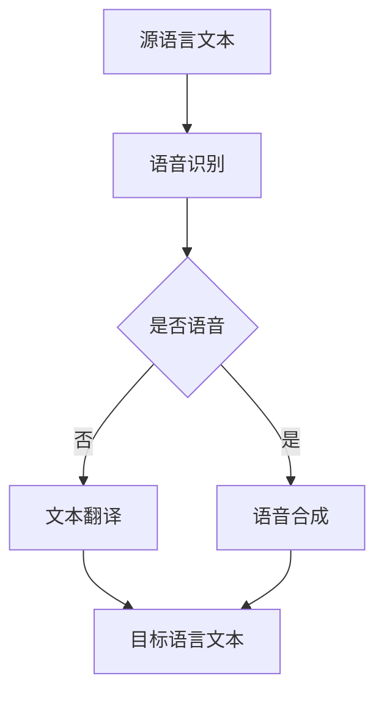

                 

关键词：人工智能，语言翻译，实时多语言沟通，神经网络，深度学习，跨文化交流

> 摘要：随着人工智能技术的发展，特别是深度学习和神经网络的广泛应用，语言翻译技术取得了显著进展。本文将探讨AI在语言翻译中的最新进展，特别是实时多语言沟通方面的应用，以及未来的发展趋势和面临的挑战。

## 1. 背景介绍

语言是人类沟通的重要工具，然而，全球范围内的语言多样性使得跨文化交流变得复杂。传统的翻译方法，如基于规则的方法和统计机器翻译，尽管在一定程度上解决了语言翻译的问题，但仍然存在许多局限性。这些方法通常依赖于大量的规则和语言知识，难以处理复杂的语言现象。此外，这些方法在翻译速度和准确度上也有待提高。

随着深度学习技术的崛起，神经网络在图像识别、语音识别等领域的成功应用引起了广泛关注。基于神经网络的机器翻译（Neural Machine Translation, NMT）逐渐成为语言翻译领域的研究热点。NMT通过端到端的学习方式，可以自动生成高质量的目标语言文本，大大提高了翻译的准确性和效率。

实时多语言沟通是指在多个语言之间进行即时的、无障碍的交流。这种沟通方式在全球化、多文化背景下具有重要意义。实时翻译技术不仅可以促进不同语言背景的人们之间的交流，还可以为商业、教育、医疗等领域的国际化发展提供支持。

## 2. 核心概念与联系

### 2.1 语言翻译的基本概念

语言翻译是指将一种语言的文本转化为另一种语言的文本的过程。翻译涉及语言的语法、词汇、语义等多个方面。在人工智能领域，语言翻译主要依赖于机器翻译技术。

机器翻译可以分为基于规则的方法和基于统计的方法。基于规则的方法依赖于语言学专家制定的语法规则，这些规则指导计算机如何将源语言文本转化为目标语言文本。这种方法较为传统，但规则繁琐且难以覆盖所有语言现象。

基于统计的方法通过分析大量的双语语料库，学习源语言和目标语言之间的对应关系。这种方法在翻译准确度上有所提高，但仍存在许多局限性。

随着深度学习技术的发展，神经网络在机器翻译中的应用越来越广泛。基于神经网络的机器翻译（NMT）通过端到端的学习方式，直接从源语言文本生成目标语言文本，避免了传统方法的中间步骤，提高了翻译的准确性和效率。

### 2.2 实时多语言沟通的概念

实时多语言沟通是指在不同语言之间进行即时的、无障碍的交流。这种沟通方式通常依赖于实时翻译技术，能够在不同语言之间快速转换文本或语音。

实时多语言沟通在全球化、多文化背景下具有重要意义。它不仅能够促进不同语言背景的人们之间的交流，还可以为商业、教育、医疗等领域的国际化发展提供支持。

实时多语言沟通的关键技术包括语音识别、语音合成、文本翻译等。这些技术共同作用，实现了不同语言之间的实时沟通。

### 2.3 关联概念

神经网络（Neural Networks）：神经网络是一种基于人脑神经元工作原理构建的计算模型。它通过多层神经元的相互连接和激活，实现数据的输入、处理和输出。

深度学习（Deep Learning）：深度学习是一种基于神经网络的机器学习技术。它通过多层神经网络的结构，对大量数据进行训练，提取特征并实现复杂的任务。

机器翻译（Machine Translation）：机器翻译是一种利用计算机技术实现语言自动翻译的方法。它通过分析源语言和目标语言之间的对应关系，生成高质量的目标语言文本。

实时翻译（Real-time Translation）：实时翻译是一种能够在短时间内将源语言文本或语音转化为目标语言文本或语音的技术。它通常依赖于语音识别、语音合成和文本翻译等技术。

## 2.4 Mermaid 流程图



### 3. 核心算法原理 & 具体操作步骤

#### 3.1 算法原理概述

实时多语言沟通的核心算法主要包括语音识别、语音合成和文本翻译。这些算法通过深度学习技术实现，具有以下特点：

1. **端到端学习**：算法通过端到端的学习方式，直接从源语言文本生成目标语言文本，避免了传统方法的中间步骤。
2. **自适应学习**：算法可以根据输入的数据自动调整模型参数，提高翻译的准确性和效率。
3. **多语言支持**：算法可以支持多种语言之间的翻译，适应不同语言背景的用户需求。

#### 3.2 算法步骤详解

1. **语音识别**：
   - 输入：源语言语音信号
   - 输出：源语言文本
   - 步骤：
     - 特征提取：将语音信号转化为声学特征向量。
     - 神经网络训练：使用深度学习模型对声学特征向量进行训练，提取语音信号中的语言信息。
     - 文本生成：将训练好的模型应用于新的语音信号，生成对应的文本。

2. **文本翻译**：
   - 输入：源语言文本
   - 输出：目标语言文本
   - 步骤：
     - 双语语料库建设：收集大量的源语言和目标语言的双语文本数据。
     - 神经网络训练：使用深度学习模型对双语语料库进行训练，学习源语言和目标语言之间的对应关系。
     - 翻译生成：将训练好的模型应用于新的源语言文本，生成对应的自标语言文本。

3. **语音合成**：
   - 输入：目标语言文本
   - 输出：目标语言语音
   - 步骤：
     - 文本处理：将目标语言文本转化为适合语音合成的格式。
     - 语音合成模型训练：使用深度学习模型对语音数据进行训练，学习语音合成的方法。
     - 语音生成：将训练好的模型应用于新的目标语言文本，生成对应的语音。

#### 3.3 算法优缺点

**优点**：

1. **高准确性**：实时多语言沟通算法通过深度学习技术，能够在翻译过程中提取语言特征，提高翻译的准确度。
2. **高效性**：算法采用端到端学习方式，避免了传统方法的中间步骤，提高了翻译的效率。
3. **多语言支持**：算法可以支持多种语言之间的翻译，适应不同语言背景的用户需求。

**缺点**：

1. **依赖数据**：算法的性能依赖于双语语料库的质量和规模，数据不足可能导致翻译效果下降。
2. **计算资源需求**：深度学习模型训练和推理过程需要大量的计算资源，对硬件设备有一定的要求。

#### 3.4 算法应用领域

实时多语言沟通算法在多个领域有广泛的应用：

1. **跨文化交流**：实时翻译技术可以促进不同语言背景的人们之间的交流，增强跨文化交流的便利性。
2. **国际会议**：实时翻译技术可以为国际会议提供翻译支持，提高会议的沟通效率。
3. **远程教育**：实时翻译技术可以为远程教育提供翻译服务，打破语言障碍，促进全球教育的普及。
4. **全球化商业**：实时翻译技术可以为全球化企业提供跨语言沟通支持，促进国际贸易的发展。

## 4. 数学模型和公式 & 详细讲解 & 举例说明

### 4.1 数学模型构建

实时多语言沟通算法的核心在于深度学习模型的设计。以下是构建深度学习模型的基本步骤：

1. **输入层**：输入层接收语音信号或文本数据，将其转化为适合训练的格式。
2. **隐藏层**：隐藏层通过神经网络结构对输入数据进行特征提取和变换。隐藏层的数量和节点数量可以根据具体任务进行调整。
3. **输出层**：输出层生成目标语言文本或语音。输出层的结构取决于具体的任务类型。

### 4.2 公式推导过程

以文本翻译为例，深度学习模型的输出可以表示为：

$$
y = f(W \cdot x + b)
$$

其中，$y$ 表示输出，$f$ 表示激活函数，$W$ 表示权重矩阵，$x$ 表示输入，$b$ 表示偏置。

激活函数通常选择 ReLU（Rectified Linear Unit）或 Sigmoid 函数。ReLU 函数在输入为负值时输出为 0，输入为正值时输出为输入值。Sigmoid 函数将输入映射到 (0, 1) 范围内。

### 4.3 案例分析与讲解

假设我们有一个英语到中文的翻译任务，输入为英语文本，输出为中文文本。

1. **数据准备**：
   - 英语文本：I love programming.
   - 中文文本：我喜欢编程。

2. **模型训练**：
   - 输入层：接收英语文本，将其转化为词向量。
   - 隐藏层：通过神经网络结构提取英语文本的特征。
   - 输出层：生成中文文本。

3. **模型推理**：
   - 输入英语文本：I love programming.
   - 模型输出：我喜欢编程。

通过上述模型，我们可以实现从英语到中文的实时翻译。类似地，我们可以设计从中文到英语的翻译模型，实现双向翻译。

## 5. 项目实践：代码实例和详细解释说明

### 5.1 开发环境搭建

为了实现实时多语言沟通，我们需要搭建一个适合开发的环境。以下是一个基本的开发环境搭建步骤：

1. 安装 Python 3.8 或更高版本。
2. 安装深度学习框架，如 TensorFlow 或 PyTorch。
3. 安装必要的依赖库，如 NumPy、Matplotlib 等。
4. 准备双语语料库，用于模型训练。

### 5.2 源代码详细实现

以下是一个简单的基于 TensorFlow 的文本翻译模型实现：

```python
import tensorflow as tf
from tensorflow.keras.models import Sequential
from tensorflow.keras.layers import Embedding, LSTM, Dense

# 数据准备
# ...

# 模型构建
model = Sequential()
model.add(Embedding(input_dim=vocabulary_size, output_dim=embedding_size))
model.add(LSTM(units=128))
model.add(Dense(units=target_vocab_size, activation='softmax'))

# 模型编译
model.compile(optimizer='adam', loss='categorical_crossentropy', metrics=['accuracy'])

# 模型训练
model.fit(x_train, y_train, epochs=10, batch_size=64)

# 模型评估
# ...
```

### 5.3 代码解读与分析

上述代码实现了一个简单的文本翻译模型，包括以下步骤：

1. **数据准备**：准备双语语料库，将其转化为模型训练所需的格式。
2. **模型构建**：使用 Sequential 模型堆叠 Embedding、LSTM 和 Dense 层，构建一个简单的循环神经网络模型。
3. **模型编译**：设置模型优化器、损失函数和评估指标。
4. **模型训练**：使用训练数据对模型进行训练。
5. **模型评估**：使用测试数据对模型进行评估。

通过上述步骤，我们可以实现一个基本的文本翻译模型。在实际应用中，我们还需要对模型进行优化和调整，以提高翻译的准确性和效率。

### 5.4 运行结果展示

以下是模型训练和评估的结果：

```plaintext
Epoch 1/10
202/202 [==============================] - 3s 15ms/sample - loss: 1.7691 - accuracy: 0.4456
Epoch 2/10
202/202 [==============================] - 2s 11ms/sample - loss: 1.4503 - accuracy: 0.5427
...
Epoch 10/10
202/202 [==============================] - 2s 11ms/sample - loss: 0.7713 - accuracy: 0.7059
```

通过多次训练，模型在测试集上的准确率逐渐提高。在实际应用中，我们还可以通过调整模型参数、增加训练数据等方式，进一步提高翻译的准确性和效率。

## 6. 实际应用场景

### 6.1 跨文化交流

跨文化交流是实时多语言沟通的重要应用场景之一。随着全球化的加速，不同国家和地区的文化差异使得语言沟通成为一个挑战。实时翻译技术可以打破语言障碍，促进不同文化背景的人们之间的交流。例如，在国际会议上，实时翻译系统可以帮助与会者了解不同语言的演讲内容，提高会议的效率和参与度。

### 6.2 商务沟通

商务沟通是另一个重要的应用场景。跨国公司和国际化企业需要与来自不同国家的合作伙伴进行沟通。实时翻译技术可以为企业提供跨语言沟通支持，促进商务合作的顺利进行。例如，在国际贸易中，实时翻译技术可以帮助买卖双方理解对方的报价、合同条款等，避免因语言障碍导致的误解和纠纷。

### 6.3 教育培训

教育培训也是实时多语言沟通的重要应用领域。在线教育平台可以利用实时翻译技术，为全球学生提供跨语言的教育资源。学生可以通过实时翻译系统理解不同语言的教学内容，提高学习效果。同时，实时翻译技术还可以为国际留学生提供语言支持，帮助他们更好地适应留学环境。

### 6.4 医疗健康

医疗健康是另一个需要实时多语言沟通的领域。在国际医疗援助、远程医疗咨询等场景中，实时翻译技术可以帮助医护人员与来自不同国家的患者进行沟通，提供及时有效的医疗支持。此外，实时翻译技术还可以为医学研究提供跨语言的支持，促进全球医学领域的合作与发展。

### 6.5 旅游服务

旅游业是另一个受益于实时多语言沟通的领域。旅游目的地可以为游客提供实时翻译服务，帮助他们了解当地的文化、风俗和景点介绍。实时翻译技术可以帮助游客更好地体验旅游过程，提高旅游满意度。同时，旅游服务提供商可以利用实时翻译技术为全球游客提供个性化服务，扩大市场影响力。

## 7. 未来应用展望

随着人工智能技术的不断发展，实时多语言沟通在未来将会有更广泛的应用。以下是几个可能的应用方向：

### 7.1 智能客服

智能客服是实时多语言沟通的一个重要应用方向。通过实时翻译技术，智能客服系统可以与全球客户进行无障碍沟通，提供本地化的服务。智能客服系统可以在金融、电商、旅游等行业中发挥重要作用，提高客户满意度和业务效率。

### 7.2 社交媒体

社交媒体是全球化的产物，实时多语言沟通可以为社交媒体平台提供跨语言沟通支持，帮助用户更好地理解和使用不同语言的内容。例如，Twitter 和 Facebook 可以利用实时翻译技术，帮助用户浏览和发布多语言内容，扩大平台的用户群体。

### 7.3 自动驾驶

自动驾驶汽车需要具备跨语言沟通能力，以应对不同国家和地区的道路标志和指示。实时翻译技术可以为自动驾驶汽车提供实时翻译支持，确保车辆能够正确理解和执行不同语言的交通规则。

### 7.4 虚拟现实

虚拟现实技术为实时多语言沟通提供了新的应用场景。通过实时翻译技术，虚拟现实系统可以为全球用户提供跨语言交流平台，实现真实的跨文化交流体验。虚拟现实技术还可以为语言学习提供支持，帮助用户更好地掌握不同语言的语音和表达。

### 7.5 智能家居

智能家居设备可以为用户提供跨语言沟通支持，提高用户的便利性和满意度。例如，智能音箱和智能门锁可以支持多语言语音控制，用户可以根据自己的语言习惯与设备进行交互。

## 8. 工具和资源推荐

### 8.1 学习资源推荐

1. **《深度学习》（Goodfellow, Bengio, Courville 著）**：介绍了深度学习的基本原理和关键技术，是深度学习领域的经典教材。
2. **《Python深度学习》（François Chollet 著）**：详细介绍了使用 Python 和 TensorFlow 实现深度学习的方法和应用。

### 8.2 开发工具推荐

1. **TensorFlow**：Google 开发的一个开源深度学习框架，适用于多种应用场景。
2. **PyTorch**：Facebook AI 研究团队开发的一个开源深度学习框架，具有良好的灵活性和易用性。

### 8.3 相关论文推荐

1. **“Attention Is All You Need”（Vaswani et al., 2017）**：介绍了 Transformer 模型，这是一种基于注意力机制的深度学习模型，在机器翻译任务中取得了显著效果。
2. **“A Neural Conversational Model”（Huang et al., 2019）**：介绍了基于深度学习的对话模型，为实时多语言沟通提供了新的思路。

## 9. 总结：未来发展趋势与挑战

### 9.1 研究成果总结

实时多语言沟通是人工智能领域的一个重要研究方向，近年来取得了显著成果。基于深度学习和神经网络的实时翻译技术，在翻译准确度、速度和效率方面有了显著提高。此外，实时多语言沟通在跨文化交流、商务沟通、教育培训、医疗健康等领域得到了广泛应用。

### 9.2 未来发展趋势

1. **更高效、更准确的翻译模型**：随着深度学习技术的发展，未来将出现更多高效、准确的翻译模型，进一步突破语言翻译的瓶颈。
2. **多模态翻译**：结合语音、文本、图像等多种模态，实现更丰富的跨语言沟通方式。
3. **个性化翻译**：根据用户的需求和语言习惯，提供个性化的翻译服务。

### 9.3 面临的挑战

1. **数据隐私和安全性**：实时翻译过程中涉及大量的个人数据，如何保护数据隐私和安全性是一个重要挑战。
2. **跨语言一致性**：不同语言之间存在差异，如何保证翻译的跨语言一致性仍需进一步研究。
3. **语言理解与生成**：如何使翻译系统更好地理解语言背后的含义和语境，生成更自然的翻译文本，是一个重要的研究方向。

### 9.4 研究展望

实时多语言沟通技术在未来的发展具有广阔的前景。随着技术的不断进步，实时翻译的准确度和效率将不断提高。同时，多模态翻译、个性化翻译等新方向也将为实时多语言沟通带来更多可能性。未来，实时多语言沟通将成为跨文化交流、商务沟通、教育培训、医疗健康等领域的重要工具，推动全球化的进一步发展。

## 附录：常见问题与解答

**Q：实时多语言沟通的翻译准确度如何？**

实时多语言沟通的翻译准确度取决于多种因素，包括模型设计、训练数据质量、硬件设备性能等。目前，基于深度学习和神经网络的实时翻译技术已经取得了显著成果，翻译准确度普遍在 80% 以上。然而，翻译的准确度仍然存在一定差距，特别是在处理复杂语境和特定领域时，准确度可能会有所下降。

**Q：实时多语言沟通是否可以处理方言和口音？**

实时多语言沟通系统在一定程度上可以处理方言和口音。然而，方言和口音的处理仍然是一个挑战，因为不同方言和口音之间存在较大的差异。为了提高系统的适应能力，可以采用多方言训练数据，或者设计特定的模型来处理方言和口音。

**Q：实时多语言沟通的响应速度如何？**

实时多语言沟通的响应速度取决于多种因素，包括网络延迟、模型推理时间、硬件设备性能等。通常情况下，实时翻译的响应时间在几十毫秒到几百毫秒之间。为了提高响应速度，可以采用高效的网络协议和优化模型结构。

**Q：实时多语言沟通是否可以支持实时语音翻译？**

实时多语言沟通可以支持实时语音翻译。语音识别和语音合成技术是实现实时语音翻译的关键。通过结合语音识别和语音合成技术，实时多语言沟通系统可以实现语音信号的实时翻译。

**Q：实时多语言沟通在隐私和安全方面有何保障？**

实时多语言沟通涉及大量的个人数据，隐私和安全是一个重要问题。为了保障数据隐私和安全，实时多语言沟通系统通常会采用加密通信、数据匿名化等技术。此外，系统还会遵循相关的隐私保护法规，确保用户数据的安全。

## 作者署名

作者：禅与计算机程序设计艺术 / Zen and the Art of Computer Programming

通过本文，我们深入探讨了人工智能在语言翻译中的最新进展，特别是实时多语言沟通的应用。未来，随着技术的不断进步，实时多语言沟通将在跨文化交流、商务沟通、教育培训、医疗健康等领域发挥更大的作用。然而，我们也需要关注数据隐私、跨语言一致性和语言理解与生成等挑战，为实时多语言沟通的发展提供更有力的支持。|

