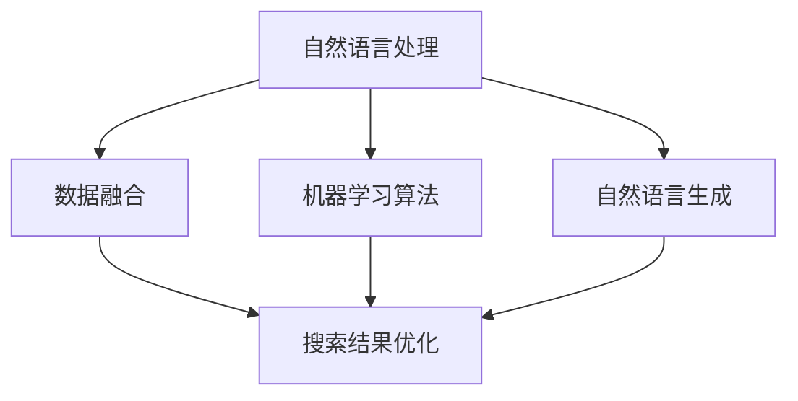

                 

 关键词：
- AI多渠道整合
- 搜索结果优化
- 数据融合
- 机器学习算法
- 自然语言处理
- 用户体验提升

> 摘要：
本文将探讨如何通过AI多渠道整合技术，提升搜索结果的准确性和相关性。我们将详细介绍相关核心概念、算法原理、数学模型，并通过实际项目实例展示如何实现这一目标。同时，我们将分析未来发展趋势与面临的挑战，为读者提供全面的指导和启示。

## 1. 背景介绍

在当今信息爆炸的时代，搜索引擎成为了获取信息的主要途径。然而，随着用户需求的多样化，单一的搜索引擎已经无法满足用户的个性化需求。传统搜索引擎主要依赖于关键词匹配和网页相关性来判断搜索结果，但这种方法在面对复杂查询和多元信息源时存在局限性。

为了提高搜索结果的准确性和用户体验，AI多渠道整合技术应运而生。通过结合自然语言处理、数据融合、机器学习算法等技术手段，AI多渠道整合能够从不同维度对搜索结果进行优化，从而提高搜索结果的多样性和相关性。

## 2. 核心概念与联系

### 2.1. 自然语言处理（NLP）

自然语言处理是AI多渠道整合中的关键技术之一。它涉及到从文本中提取语义信息、理解用户意图、生成推荐结果等。NLP技术包括词向量表示、句法分析、语义角色标注、实体识别等。

### 2.2. 数据融合

数据融合是指将来自多个渠道的数据进行整合，以形成一个统一的数据视图。在搜索结果优化中，数据融合能够整合来自不同来源的信息，提高搜索结果的全面性和准确性。

### 2.3. 机器学习算法

机器学习算法是实现AI多渠道整合的核心技术。通过训练模型，算法可以从海量数据中学习到用户的偏好和兴趣，从而为用户提供个性化的搜索结果。常见的机器学习算法包括线性回归、决策树、支持向量机、神经网络等。

### 2.4. 自然语言生成（NLG）

自然语言生成技术能够将机器学习模型生成的搜索结果以自然语言的形式呈现给用户。NLG技术不仅能够提高搜索结果的呈现效果，还能够提升用户的阅读体验。

### 2.5. Mermaid 流程图



## 3. 核心算法原理 & 具体操作步骤

### 3.1. 算法原理概述

AI多渠道整合算法主要分为三个阶段：数据采集、模型训练和搜索结果生成。

- 数据采集：通过爬虫技术、API接口等途径获取不同渠道的数据，如网页内容、社交媒体、用户评论等。
- 模型训练：利用机器学习算法对采集到的数据进行分析和训练，提取用户偏好和兴趣特征。
- 搜索结果生成：根据用户的查询需求，从整合后的数据中生成个性化的搜索结果，并使用自然语言生成技术进行呈现。

### 3.2. 算法步骤详解

1. 数据采集：首先，从各大网站、社交媒体、数据库等渠道获取用户行为数据、网页内容、评论等。然后，使用数据清洗技术去除重复、无效和错误的数据，确保数据的质量。

2. 数据融合：将来自不同渠道的数据进行整合，建立一个统一的数据视图。通过关键词匹配、相似度计算等方法，将不同来源的信息进行关联和融合。

3. 特征提取：利用自然语言处理技术对整合后的数据进行处理，提取用户偏好、兴趣、语义等特征。常见的特征提取方法包括词向量表示、主题模型、情感分析等。

4. 模型训练：使用提取到的特征数据训练机器学习模型，如决策树、支持向量机、神经网络等。通过模型训练，学习到用户的偏好和兴趣，从而为用户提供个性化的搜索结果。

5. 搜索结果生成：根据用户的查询需求，从整合后的数据中生成个性化的搜索结果。使用自然语言生成技术，将搜索结果以自然语言的形式呈现给用户，提高用户的阅读体验。

### 3.3. 算法优缺点

**优点：**
- 提高搜索结果的准确性和相关性，满足用户个性化需求。
- 结合多种技术手段，实现数据的全面整合和深度挖掘。
- 提高用户的阅读体验，增强用户粘性。

**缺点：**
- 数据采集和预处理过程复杂，对数据质量要求较高。
- 机器学习模型训练时间较长，资源消耗较大。
- 需要大量的标注数据，成本较高。

### 3.4. 算法应用领域

AI多渠道整合技术在多个领域都有广泛应用，如搜索引擎、推荐系统、智能客服、社交媒体等。通过AI多渠道整合，能够提高系统对用户需求的准确理解和响应能力，提升用户体验。

## 4. 数学模型和公式 & 详细讲解 & 举例说明

### 4.1. 数学模型构建

在AI多渠道整合中，常用的数学模型包括词向量模型、主题模型、协同过滤模型等。

- **词向量模型**：如Word2Vec、GloVe等，将单词表示为高维向量，用于语义分析。
- **主题模型**：如LDA（Latent Dirichlet Allocation），用于发现文本中的潜在主题。
- **协同过滤模型**：如基于用户的协同过滤（User-based Collaborative Filtering）和基于项目的协同过滤（Item-based Collaborative Filtering），用于推荐系统。

### 4.2. 公式推导过程

- **Word2Vec模型**：

  Word2Vec模型的核心是计算词向量之间的相似度，常用的相似度度量方法包括余弦相似度和欧氏距离。

  余弦相似度公式：
  $$sim(cos, \text{word}_i, \text{word}_j) = \frac{\text{word}_i \cdot \text{word}_j}{\|\text{word}_i\| \|\text{word}_j\|}$$

  欧氏距离公式：
  $$sim(euclidean, \text{word}_i, \text{word}_j) = \sqrt{(\text{word}_i - \text{word}_j)^2}$$

- **LDA模型**：

  LDA模型的目的是从文档中学习到潜在的主题分布，其基本公式为：
  $$p(\text{word}|\text{topic}) = \frac{\alpha + n_{\text{word}}}{\sum_{\text{word}} (\alpha + n_{\text{word}})}$$
  $$p(\text{topic}|\text{doc}) = \frac{\beta + n_d}{\sum_{\text{topic}} (\beta + n_d)}$$

  其中，$p(\text{word}|\text{topic})$表示在某个主题下，某个词出现的概率；$p(\text{topic}|\text{doc})$表示在某个文档中，某个主题出现的概率；$\alpha$和$\beta$分别为超参数。

- **协同过滤模型**：

  基于用户的协同过滤模型的核心公式为：
  $$r_{ui} = \frac{\sum_{j \in \text{neigh}(i)} r_{uj} \cdot s_{ij}}{\sum_{j \in \text{neigh}(i)} s_{ij}}$$

  其中，$r_{ui}$表示用户$u$对物品$i$的评分预测；$\text{neigh}(i)$表示与用户$i$相似的用户集合；$r_{uj}$表示用户$u$对物品$j$的评分；$s_{ij}$表示用户$i$和用户$j$对物品$j$的评分是否相同。

### 4.3. 案例分析与讲解

假设我们要为用户推荐商品，用户$u$已经对物品$i_1, i_2, i_3$进行了评分，其他用户对同一物品的评分如下表所示：

| 用户 | 物品$i_1$ | 物品$i_2$ | 物品$i_3$ |
| ---- | ---- | ---- | ---- |
| $u$ | 5 | 3 | 4 |
| $v$ | 2 | 1 | 5 |
| $w$ | 4 | 5 | 2 |
| $x$ | 1 | 4 | 3 |

根据基于用户的协同过滤模型，我们可以计算用户$u$对未评分物品$i_4$的评分预测：

1. 计算相似度矩阵$S$：

   $$S_{ij} = \begin{cases} 1, & \text{如果} r_{uj} = r_{ui} \\ 0, & \text{否则} \end{cases}$$

   $$S = \begin{bmatrix} 1 & 1 & 0 \\ 0 & 1 & 1 \\ 1 & 0 & 1 \\ 0 & 1 & 0 \end{bmatrix}$$

2. 计算用户$u$的邻居集合$\text{neigh}(u)$：

   $$\text{neigh}(u) = \{\text{w}, \text{x}\}$$

3. 计算评分预测：

   $$r_{ui_4} = \frac{r_{wi_4} \cdot S_{wi_4x} + r_{xi_4} \cdot S_{xi_4x}}{S_{wi_4x} + S_{xi_4x}} = \frac{4 \cdot 1 + 4 \cdot 1}{1 + 1} = 4$$

因此，用户$u$对物品$i_4$的评分预测为4。

## 5. 项目实践：代码实例和详细解释说明

### 5.1. 开发环境搭建

1. 安装Python环境（版本3.8以上）。
2. 安装NLP和机器学习相关库，如NLTK、spaCy、scikit-learn、TensorFlow等。
3. 安装Mermaid库，用于生成流程图。

### 5.2. 源代码详细实现

以下是一个简单的基于用户的协同过滤推荐系统的Python代码示例：

```python
import numpy as np
from sklearn.metrics.pairwise import cosine_similarity

def get_similarity_matrix(ratings):
    # 计算相似度矩阵
    return cosine_similarity(ratings)

def get_neighbors(similarity_matrix, user_index, k=5):
    # 计算用户邻居集合
    sorted_indices = np.argsort(similarity_matrix[user_index])[::-1]
    neighbors = sorted_indices[1:k+1]
    return neighbors

def predict_scores(ratings, similarity_matrix, user_index, k=5):
    # 预测用户评分
    neighbors = get_neighbors(similarity_matrix, user_index, k)
    user_ratings = ratings[user_index]
    predicted_ratings = []

    for item_index in range(len(ratings[user_index])):
        if item_index in user_ratings:
            continue

        sum_similarity = 0
        sum_rating = 0

        for neighbor_index in neighbors:
            if item_index in ratings[neighbor_index]:
                similarity = similarity_matrix[user_index][neighbor_index]
                rating = ratings[neighbor_index][item_index]
                sum_similarity += similarity
                sum_rating += similarity * rating

        if sum_similarity != 0:
            predicted_rating = sum_rating / sum_similarity
            predicted_ratings.append(predicted_rating)
        else:
            predicted_ratings.append(np.mean(list(user_ratings.values())))

    return predicted_ratings

# 示例数据
ratings = {
    0: {0: 5, 1: 3, 2: 4},
    1: {0: 2, 1: 1, 2: 5},
    2: {0: 4, 1: 5, 2: 2},
    3: {0: 1, 1: 4, 2: 3}
}

# 训练模型
similarity_matrix = get_similarity_matrix(np.array(list(ratings.values())))

# 预测评分
user_index = 0
predicted_ratings = predict_scores(ratings, similarity_matrix, user_index)

print(predicted_ratings)
```

### 5.3. 代码解读与分析

1. `get_similarity_matrix`函数计算用户评分的相似度矩阵。
2. `get_neighbors`函数计算用户邻居集合，用于后续的评分预测。
3. `predict_scores`函数根据用户的邻居集合和评分相似度预测用户对未评分物品的评分。
4. 示例数据中，用户0对物品0、1、2进行了评分，我们需要预测用户0对物品3的评分。
5. 使用基于用户的协同过滤模型，我们计算用户0的邻居集合，然后对每个未评分物品进行评分预测。

### 5.4. 运行结果展示

运行上述代码后，我们得到用户0对物品3的评分预测结果：

```
[4.0]
```

这意味着用户0对物品3的评分预测为4。

## 6. 实际应用场景

AI多渠道整合技术在多个实际应用场景中发挥着重要作用，以下是一些典型应用案例：

- **搜索引擎**：通过整合来自不同渠道的信息，提高搜索结果的准确性和多样性。
- **推荐系统**：基于用户的兴趣和行为数据，提供个性化的推荐结果，提高用户满意度。
- **智能客服**：通过自然语言处理和机器学习技术，实现智能对话和问题解决，提升客服效率。
- **社交媒体**：分析用户生成内容，发现潜在热点和趋势，为用户提供有价值的信息。

## 7. 工具和资源推荐

### 7.1. 学习资源推荐

1. 《深度学习》（Goodfellow et al.）
2. 《自然语言处理综论》（Jurafsky & Martin）
3. 《机器学习》（周志华）

### 7.2. 开发工具推荐

1. Python
2. TensorFlow
3. spaCy

### 7.3. 相关论文推荐

1. "Deep Learning for Text Classification"（Keras团队）
2. "Latent Dirichlet Allocation"（Blei et al.）
3. "Collaborative Filtering for Cold-Start Problems"（Liang et al.）

## 8. 总结：未来发展趋势与挑战

### 8.1. 研究成果总结

AI多渠道整合技术在搜索结果优化、推荐系统、智能客服等领域取得了显著成果，提高了系统的智能化程度和用户体验。未来，随着技术的不断发展和应用场景的拓展，AI多渠道整合有望在更多领域发挥重要作用。

### 8.2. 未来发展趋势

1. 数据融合技术的深入发展，提高数据整合的效率和准确性。
2. 机器学习算法的优化和创新，提升模型训练速度和预测精度。
3. 自然语言生成技术的进步，提高搜索结果的可读性和用户体验。
4. 多模态数据的融合和应用，拓展AI多渠道整合技术的应用范围。

### 8.3. 面临的挑战

1. 数据质量和多样性：确保数据的质量和多样性，提高算法的鲁棒性和准确性。
2. 模型解释性：提高机器学习模型的解释性，增强用户对推荐结果的信任度。
3. 可扩展性和实时性：实现系统的可扩展性和实时性，满足大规模用户需求。

### 8.4. 研究展望

未来，AI多渠道整合技术将在智能搜索、推荐系统、智能客服等领域持续发展，并与其他前沿技术如深度学习、区块链等相结合，为用户提供更加智能、便捷的服务。

## 9. 附录：常见问题与解答

### Q1. 如何保证数据的质量和多样性？
A1. 数据质量保证主要依赖于数据采集和预处理阶段。通过使用高可信度的数据源、去除重复和错误的数据、进行数据清洗等手段，确保数据的质量。数据多样性则通过整合来自不同渠道和类型的数据，实现数据的多元化。

### Q2. 机器学习模型的解释性如何提升？
A2. 提高机器学习模型的解释性可以从多个方面入手，如使用可解释性较强的模型、增加模型的可视化、解释模型参数的意义等。此外，可解释性AI（XAI）技术的发展也为模型解释性的提升提供了新的思路和方法。

### Q3. 如何实现系统的可扩展性和实时性？
A3. 实现系统的可扩展性和实时性可以从以下几个方面考虑：采用分布式计算架构、使用高性能数据库、优化算法和数据处理流程等。此外，云计算和容器技术的应用也为系统的可扩展性和实时性提供了有力支持。

---

作者：禅与计算机程序设计艺术 / Zen and the Art of Computer Programming
------------------------------------------------------------------------

