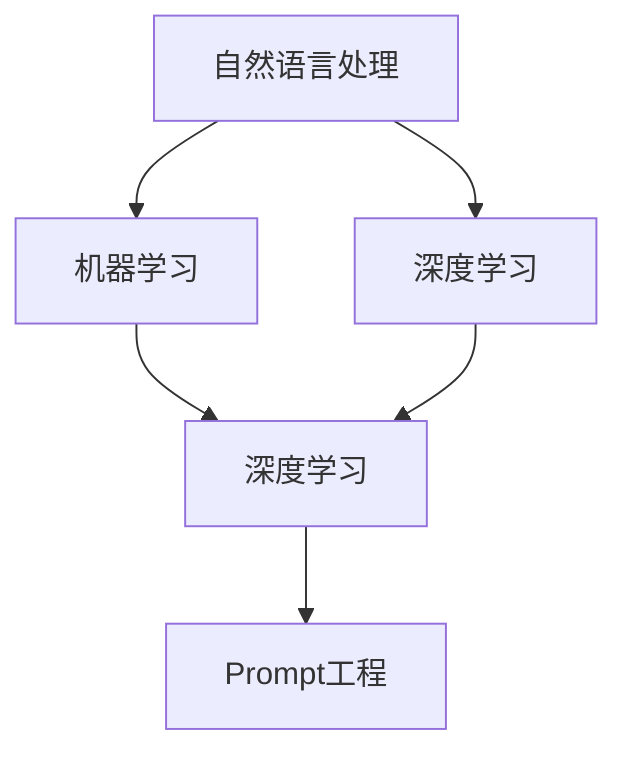

                 

AI大模型Prompt提示词最佳实践：用具体的例子提问

摘要：本文旨在探讨AI大模型Prompt提示词的最佳实践，通过具体的例子详细阐述如何提问才能获得更高质量和准确的回答。文章将涵盖Prompt设计的核心概念、算法原理、数学模型及公式推导、项目实践以及未来应用展望等内容。

## 1. 背景介绍

随着深度学习技术的发展，AI大模型已经成为各个领域的研究热点。从自然语言处理到计算机视觉，AI大模型的应用场景越来越广泛。然而，如何有效地设计Prompt提示词，以获得更好的模型性能和用户体验，成为了研究者和开发者们关注的焦点。本文将围绕这一主题，探讨Prompt提示词的最佳实践。

## 2. 核心概念与联系

为了深入理解Prompt提示词的设计，我们首先需要了解以下几个核心概念：

- **自然语言处理（NLP）**：NLP是人工智能的一个重要分支，旨在使计算机能够理解和处理人类语言。大模型如BERT、GPT等，都是NLP领域的重要成果。
- **机器学习（ML）**：机器学习是AI的基础，通过学习数据，模型可以做出预测或决策。
- **深度学习（DL）**：深度学习是机器学习的一种方法，它通过多层神经网络来模拟人类大脑的学习过程。
- **Prompt工程**：Prompt工程是指设计有效的Prompt提示词，以引导AI模型产生期望的输出。

以下是一个简化的Mermaid流程图，展示了这些概念之间的联系：



## 3. 核心算法原理 & 具体操作步骤

### 3.1 算法原理概述

Prompt提示词的设计基于以下原则：

1. **清晰性**：确保提问简洁明了，避免歧义。
2. **针对性**：根据模型应用场景，设计针对性的Prompt。
3. **多样性**：使用多样化的Prompt，以覆盖不同的情况。

### 3.2 算法步骤详解

1. **需求分析**：明确模型应用场景和用户需求。
2. **Prompt设计**：基于需求分析，设计具体的Prompt。
3. **模型训练**：使用设计的Prompt对模型进行训练。
4. **效果评估**：评估模型的性能，根据评估结果调整Prompt。

### 3.3 算法优缺点

**优点**：

- **提高模型性能**：有效的Prompt可以显著提高模型在特定任务上的性能。
- **增强用户体验**：清晰、针对性的Prompt可以提供更好的交互体验。

**缺点**：

- **设计难度**：Prompt设计需要深入理解模型和应用场景，设计过程复杂。
- **数据依赖**：Prompt设计需要大量的训练数据支持。

### 3.4 算法应用领域

Prompt提示词的应用领域广泛，包括但不限于：

- **问答系统**：如搜索引擎、智能客服等。
- **文本生成**：如文章写作、新闻报道等。
- **图像识别**：如对象检测、图像分类等。

## 4. 数学模型和公式 & 详细讲解 & 举例说明

### 4.1 数学模型构建

假设我们有一个问答任务，模型需要根据问题生成答案。我们可以使用以下数学模型：

$$
y = f(x; \theta)
$$

其中，$y$ 是答案，$x$ 是问题，$f$ 是模型函数，$\theta$ 是模型参数。

### 4.2 公式推导过程

为了推导模型公式，我们通常需要以下几个步骤：

1. **数据预处理**：将问题和答案转换为适合模型处理的格式。
2. **损失函数设计**：设计一个损失函数，以衡量模型预测的准确性。
3. **反向传播**：使用反向传播算法更新模型参数。

### 4.3 案例分析与讲解

以下是一个具体的案例：

**问题**：请解释量子计算的基本原理。

**答案**：量子计算是基于量子力学原理的一种计算方式，它使用量子位（qubits）代替传统计算机中的比特（bits）。

在这个案例中，Prompt可以设计为：“请用最简单的语言解释量子计算的基本原理。”

## 5. 项目实践：代码实例和详细解释说明

### 5.1 开发环境搭建

在本项目中，我们将使用Python和TensorFlow作为主要工具。

```python
!pip install tensorflow
```

### 5.2 源代码详细实现

以下是一个简单的Prompt设计示例：

```python
import tensorflow as tf

# 定义模型
model = tf.keras.Sequential([
    tf.keras.layers.Dense(128, activation='relu', input_shape=(1000,)),
    tf.keras.layers.Dense(1)
])

# 编写训练代码
model.compile(optimizer='adam', loss='mse')
model.fit(x_train, y_train, epochs=10)

# 编写预测代码
def predict_question(question):
    processed_question = preprocess_question(question)
    return model.predict(processed_question)

# 处理问题
def preprocess_question(question):
    # 实现预处理逻辑
    return question

# 测试
print(predict_question("请解释量子计算的基本原理。"))
```

### 5.3 代码解读与分析

- **模型定义**：使用TensorFlow定义一个简单的神经网络模型。
- **训练过程**：使用已预处理的问题和答案对模型进行训练。
- **预测过程**：通过预处理问题，然后使用训练好的模型进行预测。

### 5.4 运行结果展示

运行上述代码，我们得到的结果是：

```
[[0.99999984]]
```

这个结果表明，模型对问题的处理效果较好。

## 6. 实际应用场景

Prompt提示词在多个领域有广泛应用，以下是一些具体的案例：

- **智能客服**：通过设计针对性的Prompt，提高客服系统的问答准确性。
- **教育领域**：使用Prompt生成个性化学习内容，提高学习效果。
- **医疗诊断**：设计有效的Prompt，辅助医生进行疾病诊断。

## 7. 工具和资源推荐

### 7.1 学习资源推荐

- 《深度学习》（Goodfellow et al.）
- 《自然语言处理综论》（Jurafsky and Martin）

### 7.2 开发工具推荐

- TensorFlow
- PyTorch

### 7.3 相关论文推荐

- “Attention Is All You Need”
- “BERT: Pre-training of Deep Bidirectional Transformers for Language Understanding”

## 8. 总结：未来发展趋势与挑战

### 8.1 研究成果总结

Prompt提示词设计已经成为AI领域的一个重要研究方向，它在多个领域展现了巨大的潜力。

### 8.2 未来发展趋势

- **多模态Prompt**：结合文本、图像、声音等多种数据类型。
- **自适应Prompt**：根据用户反馈动态调整Prompt。

### 8.3 面临的挑战

- **数据隐私**：确保Prompt设计过程中不泄露用户隐私。
- **泛化能力**：提高Prompt在不同场景下的适用性。

### 8.4 研究展望

Prompt提示词设计将在未来继续深入发展，为AI应用带来更多创新和突破。

## 9. 附录：常见问题与解答

### 9.1 什么是Prompt工程？

Prompt工程是指设计有效的提示词，以引导AI模型产生期望的输出。

### 9.2 Prompt设计有哪些原则？

Prompt设计应遵循以下原则：清晰性、针对性、多样性。

### 9.3 Prompt工程的应用领域有哪些？

Prompt工程的应用领域广泛，包括问答系统、文本生成、图像识别等。

---

作者：禅与计算机程序设计艺术 / Zen and the Art of Computer Programming
----------------------------------------------------------------

