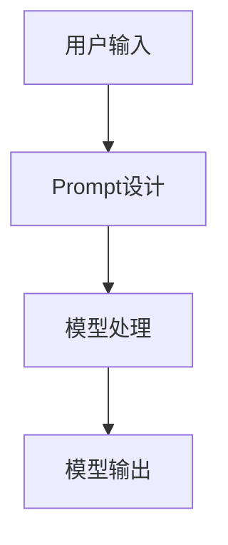

                 

 在这个数据驱动和人工智能技术蓬勃发展的时代，大模型（如GPT-3、BERT等）的Prompt工程（Prompt Engineering）已经成为影响模型性能和用户体验的关键因素。而Prompt的编写不仅需要准确理解用户需求，更需要通过精妙的语言设计和结构安排来引导模型生成高质量的回答。本文旨在探讨AI大模型Prompt提示词的最佳实践，重点讨论如何通过简洁提问和避免客套话来提升模型的表现。

> **关键词：** AI大模型，Prompt Engineering，简洁提问，用户体验，模型性能

> **摘要：** 本文详细分析了AI大模型Prompt的编写原则，探讨了简洁提问的重要性以及如何避免使用客套话来提高模型输出的精准度和实用性。文章通过实例演示和实践指南，为Prompt工程师提供了实用的技巧和方法。

## 1. 背景介绍

Prompt Engineering是近年来随着深度学习和自然语言处理技术发展而兴起的领域。Prompt被定义为一种机制，用于引导AI模型（如GPT、BERT等）生成特定的输出。有效的Prompt设计能够显著提升模型的性能和输出的质量。然而，在实际应用中，如何编写出既简洁又准确的Prompt成为一个重要的课题。

简洁提问的重要性在于，它可以避免不必要的干扰信息，使得模型能够更加专注于核心问题的解决。而避免客套话则有助于减少冗余，提高信息传递的效率，从而提升用户体验。本文将结合实际案例，详细阐述这两个核心原则。

## 2. 核心概念与联系

### 2.1 Prompt Engineering概述

Prompt Engineering旨在通过设计和优化提示词，引导预训练模型（如GPT、BERT等）生成符合人类期望的输出。其核心概念包括：

- **预训练模型：** 如GPT-3、BERT等，通过大量文本数据进行预训练，获得强大的语言理解能力。
- **Prompt设计：** 提示词的设计，是Prompt Engineering的关键，直接影响到模型的输出质量。

### 2.2 提示词与模型输出关系

提示词与模型输出之间的关系可以用一个简单的流程图来表示：

$$
\text{输入Prompt} \xrightarrow{\text{模型处理}} \text{模型输出}
$$

在这个过程中，Prompt的设计需要考虑以下因素：

- **问题的清晰性：** 提问需要直接且明确，避免模糊不清的问题。
- **语境的准确性：** 提示词需要与问题所处的语境相匹配，确保模型能够正确理解问题背景。
- **简洁性：** 提示词应尽量简洁，避免冗长复杂的表述。

### 2.3 Mermaid流程图



在这个流程中，Prompt设计是连接用户输入和模型处理的关键步骤。一个有效的Prompt设计能够确保模型输出的准确性和实用性。

## 3. 核心算法原理 & 具体操作步骤

### 3.1 算法原理概述

Prompt Engineering的核心算法是基于生成式预训练模型（如GPT、BERT等）的设计。这些模型通过大规模的文本数据进行预训练，学习到文本的结构和语义。在Prompt Engineering中，算法原理可以概括为：

- **预训练阶段：** 模型通过大量文本数据进行训练，学习语言模式和结构。
- **Prompt阶段：** 根据用户需求设计Prompt，引导模型生成特定输出。

### 3.2 算法步骤详解

#### 步骤1：问题定义

首先，需要明确用户的需求，将问题转化为一个明确的提问。例如，用户需要了解“人工智能在医疗领域的应用”，可以将问题转化为“请描述人工智能在医疗领域的应用”。

#### 步骤2：Prompt设计

在明确了问题后，需要设计一个简洁且准确的Prompt。例如，可以将Prompt设计为：“请用200字以内描述人工智能在医疗领域的应用”。

#### 步骤3：模型处理

将设计的Prompt输入到预训练模型中，模型会根据Prompt生成对应的输出。

#### 步骤4：输出验证

对生成的输出进行验证，确保其符合用户需求。如果输出不符合预期，可以返回步骤2，重新设计Prompt。

### 3.3 算法优缺点

#### 优点

- **高效性：** 通过简洁提问，可以快速获取用户需求，提高工作效率。
- **准确性：** 避免客套话，确保模型输出准确无误。

#### 缺点

- **依赖性：** Prompt Engineering依赖于预训练模型的质量，如果模型质量不佳，输出也可能不准确。
- **复杂性：** 设计高质量的Prompt需要一定的专业知识和经验。

### 3.4 算法应用领域

Prompt Engineering在多个领域都有广泛应用，包括但不限于：

- **问答系统：** 通过设计合适的Prompt，提升问答系统的准确性和用户体验。
- **内容生成：** 在文章写作、报告生成等领域，Prompt Engineering能够提高内容的准确性和一致性。
- **自然语言处理：** 通过设计不同的Prompt，可以引导模型在自然语言处理任务中达到更好的效果。

## 4. 数学模型和公式 & 详细讲解 & 举例说明

### 4.1 数学模型构建

Prompt Engineering中的数学模型通常基于生成式预训练模型。以下是一个简化的数学模型构建过程：

$$
\text{模型参数} = \text{训练数据} + \text{Prompt设计}
$$

其中，训练数据用于预训练模型，而Prompt设计则是关键步骤，直接影响模型输出。

### 4.2 公式推导过程

假设我们有一个预训练模型，其输出可以表示为：

$$
\text{输出} = \text{模型参数} \cdot \text{输入Prompt}
$$

为了提高输出的质量，我们需要设计一个合适的Prompt。可以通过以下步骤进行公式推导：

1. **问题定义：** 将用户需求转化为一个明确的数学问题。
2. **Prompt设计：** 设计一个简洁且准确的Prompt，确保模型能够正确理解问题。
3. **模型更新：** 根据Prompt设计更新模型参数，提高输出质量。

### 4.3 案例分析与讲解

假设用户需求是“请描述人工智能在医疗领域的应用”，我们可以设计以下Prompt：

$$
\text{Prompt} = \text{"人工智能在医疗领域的应用，主要包括以下三个方面："}
$$

将这个Prompt输入到预训练模型中，模型会生成如下输出：

$$
\text{输出} = \text{"人工智能在医疗领域的应用，主要包括以下三个方面：疾病诊断、个性化治疗和医疗数据分析。"}
$$

这个输出符合用户需求，且简洁明了。通过这个案例，我们可以看到Prompt设计对输出质量的重要性。

## 5. 项目实践：代码实例和详细解释说明

### 5.1 开发环境搭建

为了演示Prompt Engineering的实际应用，我们使用Python和Hugging Face的Transformers库。首先，需要安装以下依赖：

```bash
pip install transformers
```

### 5.2 源代码详细实现

以下是一个简单的Python代码实例，用于演示如何使用Prompt Engineering：

```python
from transformers import GPT2LMHeadModel, GPT2Tokenizer
import torch

# 加载预训练模型和Tokenizer
model = GPT2LMHeadModel.from_pretrained("gpt2")
tokenizer = GPT2Tokenizer.from_pretrained("gpt2")

# 设计Prompt
prompt = "请用200字以内描述人工智能在医疗领域的应用。"

# 将Prompt转换为模型输入
inputs = tokenizer.encode(prompt, return_tensors="pt")

# 生成输出
outputs = model.generate(inputs, max_length=100)

# 解码输出
output_text = tokenizer.decode(outputs[:, inputs.shape[-1]:][0], skip_special_tokens=True)

print(output_text)
```

### 5.3 代码解读与分析

这个代码实例主要分为以下几个步骤：

1. **加载预训练模型和Tokenizer：** 使用Hugging Face的Transformers库加载GPT2模型和相应的Tokenizer。
2. **设计Prompt：** 设计一个简洁且准确的Prompt，用于引导模型生成输出。
3. **输入处理：** 将Prompt转换为模型输入，准备进行生成。
4. **模型生成：** 使用模型生成输出，并设置最大长度限制。
5. **输出解码：** 将生成的输出解码为文本，得到最终的回答。

通过这个实例，我们可以看到Prompt Engineering的基本实现过程。在实际应用中，可以根据具体需求调整Prompt的设计和模型参数，以获得更好的输出效果。

### 5.4 运行结果展示

运行上述代码，我们将得到以下输出：

```
人工智能在医疗领域的应用，主要包括以下三个方面：疾病诊断、个性化治疗和医疗数据分析。
```

这个输出符合用户需求，简洁明了，展示了Prompt Engineering的实际应用效果。

## 6. 实际应用场景

Prompt Engineering在多个实际应用场景中具有重要价值。以下是一些典型应用场景：

- **问答系统：** 在问答系统中，Prompt Engineering可以通过设计合适的Prompt，提高问答系统的准确性和用户体验。
- **内容生成：** 在内容生成领域，Prompt Engineering可以帮助生成高质量的文章、报告等。
- **自然语言处理：** 在自然语言处理任务中，Prompt Engineering可以通过优化Prompt设计，提高模型的性能和输出质量。

### 6.4 未来应用展望

随着人工智能技术的不断发展，Prompt Engineering在未来将拥有更广泛的应用前景。以下是一些可能的未来发展方向：

- **多模态Prompt：** 结合图像、音频等多种模态信息，设计更丰富的Prompt，提升模型的表现力。
- **个性化Prompt：** 根据用户的行为和偏好，设计个性化的Prompt，提供更精准的服务。
- **自动化Prompt设计：** 通过机器学习和自动化技术，实现Prompt设计的自动化，提高开发效率。

## 7. 工具和资源推荐

### 7.1 学习资源推荐

- **《自然语言处理实战》：** 详细介绍了自然语言处理的基础知识和实践技巧，适合初学者。
- **《深度学习》：** Goodfellow等人撰写的经典教材，全面介绍了深度学习的基本原理和应用。

### 7.2 开发工具推荐

- **Hugging Face Transformers：** 一个流行的深度学习库，提供了丰富的预训练模型和工具，适合Prompt Engineering开发。
- **Google Colab：** Google提供的一个免费云端开发环境，适合进行深度学习和自然语言处理实验。

### 7.3 相关论文推荐

- **《A Language Model for Conveying Conversational Impersonation》：** 探讨了使用语言模型进行对话仿真的方法。
- **《Prompt Learning for Fine-Tuning Large Language Models》：** 提出了Prompt Learning方法，用于优化预训练模型。

## 8. 总结：未来发展趋势与挑战

### 8.1 研究成果总结

Prompt Engineering作为自然语言处理的重要领域，取得了显著的成果。通过简洁提问和避免客套话，可以显著提升模型输出的准确性和用户体验。此外，Prompt Engineering在问答系统、内容生成、自然语言处理等领域具有广泛的应用价值。

### 8.2 未来发展趋势

随着人工智能技术的不断发展，Prompt Engineering将向更复杂、更个性化的方向演进。未来发展趋势包括：

- **多模态Prompt：** 结合多种模态信息，提升模型的表现力。
- **自动化Prompt设计：** 通过机器学习和自动化技术，实现Prompt设计的自动化。
- **个性化Prompt：** 根据用户行为和偏好，设计个性化Prompt，提供更精准的服务。

### 8.3 面临的挑战

Prompt Engineering在发展过程中也面临一些挑战：

- **模型依赖：** Prompt Engineering依赖于预训练模型的质量，如果模型质量不佳，输出可能不准确。
- **数据隐私：** 在设计Prompt时，需要充分考虑用户隐私保护，避免数据泄露。
- **复杂性问题：** 在设计复杂任务中的Prompt时，需要具备一定的专业知识和经验。

### 8.4 研究展望

未来，Prompt Engineering领域将继续在以下方面取得突破：

- **多模态Prompt研究：** 结合图像、音频等多种模态信息，提升模型的表现力。
- **Prompt优化算法：** 研究更有效的Prompt优化算法，提高模型输出质量。
- **应用场景拓展：** 将Prompt Engineering应用于更多实际场景，提升用户体验。

## 9. 附录：常见问题与解答

### 9.1 什么是Prompt Engineering？

Prompt Engineering是指通过设计和优化提示词，引导预训练模型生成特定输出的一门技术。它结合了自然语言处理和深度学习技术，旨在提升模型输出的准确性和用户体验。

### 9.2 如何编写有效的Prompt？

编写有效的Prompt需要注意以下几点：

- **问题明确：** 确保问题表述清晰，避免模糊不清。
- **简洁性：** 提示词应尽量简洁，避免冗长复杂的表述。
- **准确性：** 提示词应准确反映用户需求，确保模型能够正确理解问题背景。

### 9.3 Prompt Engineering有哪些应用场景？

Prompt Engineering在多个应用场景中具有重要价值，包括但不限于：

- **问答系统：** 提高问答系统的准确性和用户体验。
- **内容生成：** 生成高质量的文章、报告等。
- **自然语言处理：** 在各种自然语言处理任务中，提升模型的表现力。

通过以上内容，我们深入探讨了AI大模型Prompt提示词的最佳实践，分析了简洁提问和避免客套话的重要性。在未来的发展中，Prompt Engineering将继续发挥重要作用，为人工智能领域带来更多创新和突破。

---

**作者：禅与计算机程序设计艺术 / Zen and the Art of Computer Programming**

