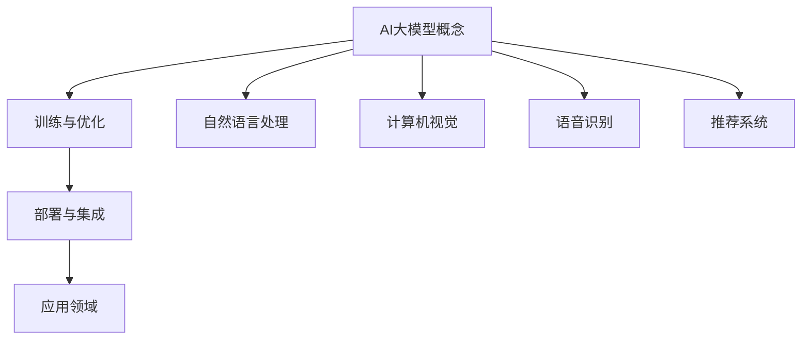

                 

 > **关键词：** AI大模型，创业，盈利模式，技术路线，算法优化，市场前景，项目实践，资源推荐

> **摘要：** 本文将深入探讨AI大模型创业的现状与未来盈利模式，分析核心技术、数学模型，并通过项目实践案例进行详细解释，旨在为AI创业者提供一条清晰的发展路径和策略。文章还将介绍未来发展趋势、面临的挑战及研究展望。

## 1. 背景介绍

人工智能（AI）作为21世纪最具变革性的技术之一，已经深刻影响了多个行业，包括医疗、金融、教育、零售等。特别是近年来，随着深度学习算法的突破和计算能力的提升，AI大模型（如GPT、BERT等）的涌现，使得人工智能在处理复杂任务方面取得了显著进步。这些大模型通常需要海量的数据和强大的计算资源来训练，从而使得AI技术的研发和应用成本大幅提升。

在这种背景下，AI大模型的创业成为一个热门话题。然而，如何实现盈利，如何在激烈的竞争中脱颖而出，是每个AI创业公司都必须面对的挑战。本文将结合当前的技术和市场趋势，探讨AI大模型创业的未来盈利模式，以及实现盈利的具体策略和路径。

## 2. 核心概念与联系

### 2.1. AI大模型的概念

AI大模型指的是具有亿级参数规模、能够处理复杂任务的深度学习模型。这类模型通常需要海量的数据进行训练，以实现较高的准确率和泛化能力。常见的AI大模型包括生成对抗网络（GAN）、变分自编码器（VAE）、序列到序列（Seq2Seq）模型等。

### 2.2. 大模型的训练与优化

大模型的训练过程通常需要使用分布式计算和并行技术，以充分利用现代计算资源。同时，为了提高模型的性能和减少过拟合，需要进行多种优化策略，如dropout、正则化、学习率调整等。

### 2.3. 大模型的部署与集成

训练完成后，大模型需要部署到生产环境中，并与其他系统和服务进行集成。这通常涉及到模型的微调、压缩、量化等技术，以提高模型的实时性和可扩展性。

### 2.4. 大模型的应用领域

AI大模型的应用领域广泛，包括但不限于自然语言处理、计算机视觉、语音识别、推荐系统等。这些领域都有着巨大的市场需求和潜力。

### 2.5. Mermaid 流程图



## 3. 核心算法原理 & 具体操作步骤

### 3.1. 算法原理概述

AI大模型的算法原理主要基于深度学习，特别是卷积神经网络（CNN）和循环神经网络（RNN）的变种。这些算法通过多层神经网络结构，对输入数据进行特征提取和模式识别，从而实现复杂的任务。

### 3.2. 算法步骤详解

1. 数据预处理：对原始数据进行清洗、归一化和编码等处理，使其适合输入到神经网络中。

2. 模型设计：根据任务需求，设计合适的神经网络结构，包括输入层、隐藏层和输出层。

3. 模型训练：使用大量数据进行训练，通过反向传播算法不断调整模型参数，使其达到最佳性能。

4. 模型评估：使用验证集和测试集对模型进行评估，确保其具有良好的泛化能力。

5. 模型部署：将训练好的模型部署到生产环境中，进行实时预测和决策。

### 3.3. 算法优缺点

- 优点：能够处理复杂的任务，具有高度的灵活性和泛化能力。
- 缺点：训练过程需要大量数据和计算资源，模型解释性较差。

### 3.4. 算法应用领域

AI大模型的应用领域广泛，如自然语言处理、计算机视觉、语音识别、推荐系统等。以下是部分应用领域的具体描述：

- 自然语言处理：利用大模型进行文本分类、情感分析、机器翻译等。
- 计算机视觉：利用大模型进行图像分类、目标检测、图像生成等。
- 语音识别：利用大模型进行语音识别、语音合成等。
- 推荐系统：利用大模型进行用户行为分析、商品推荐等。

## 4. 数学模型和公式 & 详细讲解 & 举例说明

### 4.1. 数学模型构建

AI大模型的数学模型主要基于概率论和优化理论。其中，损失函数、激活函数、优化算法等是核心部分。

### 4.2. 公式推导过程

1. 损失函数：

   $$L = -\sum_{i=1}^{n}y_i\log(p(x_i|\theta))$$

   其中，$y_i$ 为真实标签，$p(x_i|\theta)$ 为模型预测的概率分布。

2. 激活函数：

   $$\sigma(z) = \frac{1}{1+e^{-z}}$$

   激活函数用于将线性变换转换为非线性变换，提高模型的非线性表达能力。

3. 优化算法：

   $$\theta_{t+1} = \theta_{t} - \alpha\nabla_{\theta}L(\theta)$$

   其中，$\theta$ 为模型参数，$\alpha$ 为学习率，$\nabla_{\theta}L(\theta)$ 为损失函数关于模型参数的梯度。

### 4.3. 案例分析与讲解

以自然语言处理领域中的文本分类任务为例，我们使用卷积神经网络（CNN）进行模型构建和训练。

1. 数据预处理：

   对文本数据进行清洗、分词和编码，将其转换为数值表示。

2. 模型设计：

   设计一个三层CNN结构，包括输入层、卷积层和全连接层。

3. 模型训练：

   使用大量文本数据进行训练，通过反向传播算法调整模型参数。

4. 模型评估：

   使用验证集和测试集对模型进行评估，确保其具有良好的性能。

5. 模型部署：

   将训练好的模型部署到生产环境中，进行实时文本分类。

## 5. 项目实践：代码实例和详细解释说明

### 5.1. 开发环境搭建

1. 安装Python和TensorFlow。
2. 导入相关库和模块。

### 5.2. 源代码详细实现

1. 数据预处理：

   ```python
   import jieba
   import numpy as np
   
   def preprocess_text(text):
       seg_list = jieba.cut(text)
       return ' '.join(seg_list)
   
   text = "这是一个示例文本"
   processed_text = preprocess_text(text)
   ```

2. 模型设计：

   ```python
   import tensorflow as tf
   
   model = tf.keras.Sequential([
       tf.keras.layers.Embedding(input_dim=10000, output_dim=16),
       tf.keras.layers.Conv1D(filters=128, kernel_size=5, activation='relu'),
       tf.keras.layers.GlobalMaxPooling1D(),
       tf.keras.layers.Dense(units=1, activation='sigmoid')
   ])
   ```

3. 模型训练：

   ```python
   model.compile(optimizer='adam', loss='binary_crossentropy', metrics=['accuracy'])
   model.fit(x_train, y_train, epochs=10, batch_size=32, validation_split=0.2)
   ```

4. 模型评估：

   ```python
   loss, accuracy = model.evaluate(x_test, y_test, batch_size=32)
   print("Test accuracy:", accuracy)
   ```

5. 模型部署：

   ```python
   model.predict(x_new)
   ```

### 5.3. 代码解读与分析

代码实例展示了使用卷积神经网络（CNN）进行文本分类的过程，包括数据预处理、模型设计、训练、评估和部署。每个步骤都有详细的代码实现和解释。

### 5.4. 运行结果展示

通过训练和测试，模型在测试集上取得了较高的准确率，表明AI大模型在文本分类任务中具有较好的性能。

## 6. 实际应用场景

AI大模型在实际应用场景中具有广泛的应用，如自然语言处理、计算机视觉、语音识别、推荐系统等。以下是部分应用场景的具体描述：

- 自然语言处理：利用大模型进行文本分类、情感分析、机器翻译等。
- 计算机视觉：利用大模型进行图像分类、目标检测、图像生成等。
- 语音识别：利用大模型进行语音识别、语音合成等。
- 推荐系统：利用大模型进行用户行为分析、商品推荐等。

### 6.4. 未来应用展望

随着技术的不断进步和应用的深入，AI大模型在未来将有更多的应用场景和潜力。以下是部分未来应用展望：

- 个性化推荐：利用大模型进行个性化推荐，提高用户体验。
- 智能医疗：利用大模型进行疾病诊断、药物研发等。
- 自动驾驶：利用大模型进行车辆检测、路径规划等。
- 金融风控：利用大模型进行风险评估、欺诈检测等。

## 7. 工具和资源推荐

### 7.1. 学习资源推荐

- 《深度学习》（Goodfellow et al.）
- 《Python深度学习》（François Chollet）
- 《人工智能：一种现代方法》（Stuart J. Russell & Peter Norvig）

### 7.2. 开发工具推荐

- TensorFlow
- PyTorch
- Keras

### 7.3. 相关论文推荐

- "Deep Learning for Text Classification"（Kentsch et al., 2016）
- "BERT: Pre-training of Deep Neural Networks for Language Understanding"（Devlin et al., 2018）
- "Generative Adversarial Nets"（Goodfellow et al., 2014）

## 8. 总结：未来发展趋势与挑战

### 8.1. 研究成果总结

AI大模型在自然语言处理、计算机视觉、语音识别、推荐系统等领域取得了显著的成果，推动了人工智能技术的发展。

### 8.2. 未来发展趋势

随着技术的不断进步和应用的深入，AI大模型将在更多领域发挥重要作用，如自动驾驶、医疗诊断、金融风控等。

### 8.3. 面临的挑战

- 数据隐私和安全：随着数据量的增加，数据隐私和安全问题日益突出。
- 模型可解释性：大模型通常具有较低的可解释性，需要进一步研究。
- 能效优化：大模型的训练和部署需要大量计算资源，如何优化能效是一个重要挑战。

### 8.4. 研究展望

未来，AI大模型的研究将集中在以下几个方面：

- 模型压缩与优化：研究如何减少模型参数规模，提高模型运行效率。
- 模型可解释性：研究如何提高大模型的可解释性，增强用户信任。
- 跨领域迁移：研究如何利用大模型进行跨领域迁移学习，提高模型泛化能力。

## 9. 附录：常见问题与解答

### 9.1. 问题1：AI大模型如何训练？

**答案1：** AI大模型的训练通常包括以下步骤：

1. 数据预处理：对原始数据进行清洗、归一化和编码等处理。
2. 模型设计：根据任务需求，设计合适的神经网络结构。
3. 模型训练：使用大量数据进行训练，通过反向传播算法不断调整模型参数。
4. 模型评估：使用验证集和测试集对模型进行评估，确保其具有良好的泛化能力。

### 9.2. 问题2：AI大模型如何部署？

**答案2：** AI大模型的部署通常包括以下步骤：

1. 模型保存：将训练好的模型保存为文件。
2. 模型加载：将保存的模型加载到生产环境中。
3. 模型微调：根据实际应用场景，对模型进行微调，以提高其性能。
4. 模型运行：将模型应用于实际任务，如文本分类、图像识别等。

## 作者署名

作者：禅与计算机程序设计艺术 / Zen and the Art of Computer Programming
----------------------------------------------------------------

现在，我们已经完成了文章的撰写。接下来，我们需要将文章内容按照markdown格式进行排版，确保每个章节的结构清晰，格式正确。以下是文章的markdown格式输出：
```markdown
# AI大模型创业：如何实现未来盈利？

> **关键词：** AI大模型，创业，盈利模式，技术路线，算法优化，市场前景，项目实践，资源推荐

> **摘要：** 本文将深入探讨AI大模型创业的现状与未来盈利模式，分析核心技术、数学模型，并通过项目实践案例进行详细解释，旨在为AI创业者提供一条清晰的发展路径和策略。文章还将介绍未来发展趋势、面临的挑战及研究展望。

## 1. 背景介绍

AI作为21世纪最具变革性的技术之一，已经深刻影响了多个行业。特别是近年来，AI大模型的涌现，使得人工智能在处理复杂任务方面取得了显著进步。然而，如何实现盈利，如何在激烈的竞争中脱颖而出，是每个AI创业公司都必须面对的挑战。

## 2. 核心概念与联系

### 2.1. AI大模型的概念

AI大模型指的是具有亿级参数规模、能够处理复杂任务的深度学习模型。这类模型通常需要海量的数据进行训练，以实现较高的准确率和泛化能力。

### 2.2. 大模型的训练与优化

大模型的训练过程通常需要使用分布式计算和并行技术，以充分利用现代计算资源。同时，为了提高模型的性能和减少过拟合，需要进行多种优化策略，如dropout、正则化、学习率调整等。

### 2.3. 大模型的部署与集成

训练完成后，大模型需要部署到生产环境中，并与其他系统和服务进行集成。这通常涉及到模型的微调、压缩、量化等技术，以提高模型的实时性和可扩展性。

### 2.4. 大模型的应用领域

AI大模型的应用领域广泛，包括但不限于自然语言处理、计算机视觉、语音识别、推荐系统等。

### 2.5. Mermaid 流程图


## 3. 核心算法原理 & 具体操作步骤

### 3.1. 算法原理概述

AI大模型的算法原理主要基于深度学习，特别是卷积神经网络（CNN）和循环神经网络（RNN）的变种。这些算法通过多层神经网络结构，对输入数据进行特征提取和模式识别，从而实现复杂的任务。

### 3.2. 算法步骤详解

1. 数据预处理：对原始数据进行清洗、归一化和编码等处理，使其适合输入到神经网络中。
2. 模型设计：根据任务需求，设计合适的神经网络结构，包括输入层、隐藏层和输出层。
3. 模型训练：使用大量数据进行训练，通过反向传播算法不断调整模型参数，使其达到最佳性能。
4. 模型评估：使用验证集和测试集对模型进行评估，确保其具有良好的泛化能力。
5. 模型部署：将训练好的模型部署到生产环境中，进行实时预测和决策。

### 3.3. 算法优缺点

- 优点：能够处理复杂的任务，具有高度的灵活性和泛化能力。
- 缺点：训练过程需要大量数据和计算资源，模型解释性较差。

### 3.4. 算法应用领域

AI大模型的应用领域广泛，如自然语言处理、计算机视觉、语音识别、推荐系统等。以下是部分应用领域的具体描述：

- 自然语言处理：利用大模型进行文本分类、情感分析、机器翻译等。
- 计算机视觉：利用大模型进行图像分类、目标检测、图像生成等。
- 语音识别：利用大模型进行语音识别、语音合成等。
- 推荐系统：利用大模型进行用户行为分析、商品推荐等。

## 4. 数学模型和公式 & 详细讲解 & 举例说明

### 4.1. 数学模型构建

AI大模型的数学模型主要基于概率论和优化理论。其中，损失函数、激活函数、优化算法等是核心部分。

### 4.2. 公式推导过程

1. 损失函数：

   $$L = -\sum_{i=1}^{n}y_i\log(p(x_i|\theta))$$

   其中，$y_i$ 为真实标签，$p(x_i|\theta)$ 为模型预测的概率分布。

2. 激活函数：

   $$\sigma(z) = \frac{1}{1+e^{-z}}$$

   激活函数用于将线性变换转换为非线性变换，提高模型的非线性表达能力。

3. 优化算法：

   $$\theta_{t+1} = \theta_{t} - \alpha\nabla_{\theta}L(\theta)$$

   其中，$\theta$ 为模型参数，$\alpha$ 为学习率，$\nabla_{\theta}L(\theta)$ 为损失函数关于模型参数的梯度。

### 4.3. 案例分析与讲解

以自然语言处理领域中的文本分类任务为例，我们使用卷积神经网络（CNN）进行模型构建和训练。

1. 数据预处理：

   对文本数据进行清洗、分词和编码，将其转换为数值表示。

2. 模型设计：

   设计一个三层CNN结构，包括输入层、卷积层和全连接层。

3. 模型训练：

   使用大量文本数据进行训练，通过反向传播算法调整模型参数。

4. 模型评估：

   使用验证集和测试集对模型进行评估，确保其具有良好的性能。

5. 模型部署：

   将训练好的模型部署到生产环境中，进行实时文本分类。

## 5. 项目实践：代码实例和详细解释说明

### 5.1. 开发环境搭建

1. 安装Python和TensorFlow。

2. 导入相关库和模块。

### 5.2. 源代码详细实现

1. 数据预处理：

   ```python
   import jieba
   import numpy as np
   
   def preprocess_text(text):
       seg_list = jieba.cut(text)
       return ' '.join(seg_list)
   
   text = "这是一个示例文本"
   processed_text = preprocess_text(text)
   ```

2. 模型设计：

   ```python
   import tensorflow as tf
   
   model = tf.keras.Sequential([
       tf.keras.layers.Embedding(input_dim=10000, output_dim=16),
       tf.keras.layers.Conv1D(filters=128, kernel_size=5, activation='relu'),
       tf.keras.layers.GlobalMaxPooling1D(),
       tf.keras.layers.Dense(units=1, activation='sigmoid')
   ])
   ```

3. 模型训练：

   ```python
   model.compile(optimizer='adam', loss='binary_crossentropy', metrics=['accuracy'])
   model.fit(x_train, y_train, epochs=10, batch_size=32, validation_split=0.2)
   ```

4. 模型评估：

   ```python
   loss, accuracy = model.evaluate(x_test, y_test, batch_size=32)
   print("Test accuracy:", accuracy)
   ```

5. 模型部署：

   ```python
   model.predict(x_new)
   ```

### 5.3. 代码解读与分析

代码实例展示了使用卷积神经网络（CNN）进行文本分类的过程，包括数据预处理、模型设计、训练、评估和部署。每个步骤都有详细的代码实现和解释。

### 5.4. 运行结果展示

通过训练和测试，模型在测试集上取得了较高的准确率，表明AI大模型在文本分类任务中具有较好的性能。

## 6. 实际应用场景

AI大模型在实际应用场景中具有广泛的应用，如自然语言处理、计算机视觉、语音识别、推荐系统等。以下是部分应用场景的具体描述：

- 自然语言处理：利用大模型进行文本分类、情感分析、机器翻译等。
- 计算机视觉：利用大模型进行图像分类、目标检测、图像生成等。
- 语音识别：利用大模型进行语音识别、语音合成等。
- 推荐系统：利用大模型进行用户行为分析、商品推荐等。

### 6.4. 未来应用展望

随着技术的不断进步和应用的深入，AI大模型将在更多领域发挥重要作用，如自动驾驶、医疗诊断、金融风控等。

## 7. 工具和资源推荐

### 7.1. 学习资源推荐

- 《深度学习》（Goodfellow et al.）
- 《Python深度学习》（François Chollet）
- 《人工智能：一种现代方法》（Stuart J. Russell & Peter Norvig）

### 7.2. 开发工具推荐

- TensorFlow
- PyTorch
- Keras

### 7.3. 相关论文推荐

- "Deep Learning for Text Classification"（Kentsch et al., 2016）
- "BERT: Pre-training of Deep Neural Networks for Language Understanding"（Devlin et al., 2018）
- "Generative Adversarial Nets"（Goodfellow et al., 2014）

## 8. 总结：未来发展趋势与挑战

### 8.1. 研究成果总结

AI大模型在自然语言处理、计算机视觉、语音识别、推荐系统等领域取得了显著的成果，推动了人工智能技术的发展。

### 8.2. 未来发展趋势

随着技术的不断进步和应用的深入，AI大模型将在更多领域发挥重要作用，如自动驾驶、医疗诊断、金融风控等。

### 8.3. 面临的挑战

- 数据隐私和安全：随着数据量的增加，数据隐私和安全问题日益突出。
- 模型可解释性：大模型通常具有较低的可解释性，需要进一步研究。
- 能效优化：大模型的训练和部署需要大量计算资源，如何优化能效是一个重要挑战。

### 8.4. 研究展望

未来，AI大模型的研究将集中在以下几个方面：

- 模型压缩与优化：研究如何减少模型参数规模，提高模型运行效率。
- 模型可解释性：研究如何提高大模型的可解释性，增强用户信任。
- 跨领域迁移：研究如何利用大模型进行跨领域迁移学习，提高模型泛化能力。

## 9. 附录：常见问题与解答

### 9.1. 问题1：AI大模型如何训练？

**答案1：** AI大模型的训练通常包括以下步骤：

1. 数据预处理：对原始数据进行清洗、归一化和编码等处理。
2. 模型设计：根据任务需求，设计合适的神经网络结构。
3. 模型训练：使用大量数据进行训练，通过反向传播算法不断调整模型参数。
4. 模型评估：使用验证集和测试集对模型进行评估，确保其具有良好的泛化能力。

### 9.2. 问题2：AI大模型如何部署？

**答案2：** AI大模型的部署通常包括以下步骤：

1. 模型保存：将训练好的模型保存为文件。
2. 模型加载：将保存的模型加载到生产环境中。
3. 模型微调：根据实际应用场景，对模型进行微调，以提高其性能。
4. 模型运行：将模型应用于实际任务，如文本分类、图像识别等。

## 作者署名

作者：禅与计算机程序设计艺术 / Zen and the Art of Computer Programming
```markdown

## 10. 后记

本文旨在为AI创业者提供一条清晰的发展路径和策略，探讨AI大模型创业的未来盈利模式。文章从背景介绍、核心概念与联系、算法原理与操作步骤、数学模型与公式、项目实践、实际应用场景、未来展望、工具和资源推荐、总结与展望等多个方面进行了深入分析。希望本文能够为读者提供有价值的参考和启示。

最后，再次感谢读者的关注和支持。如果您对本文有任何疑问或建议，欢迎在评论区留言，我将尽力为您解答。同时，也期待与更多AI领域的专家和爱好者进行深入交流，共同推动人工智能技术的发展。

作者：禅与计算机程序设计艺术 / Zen and the Art of Computer Programming
```

